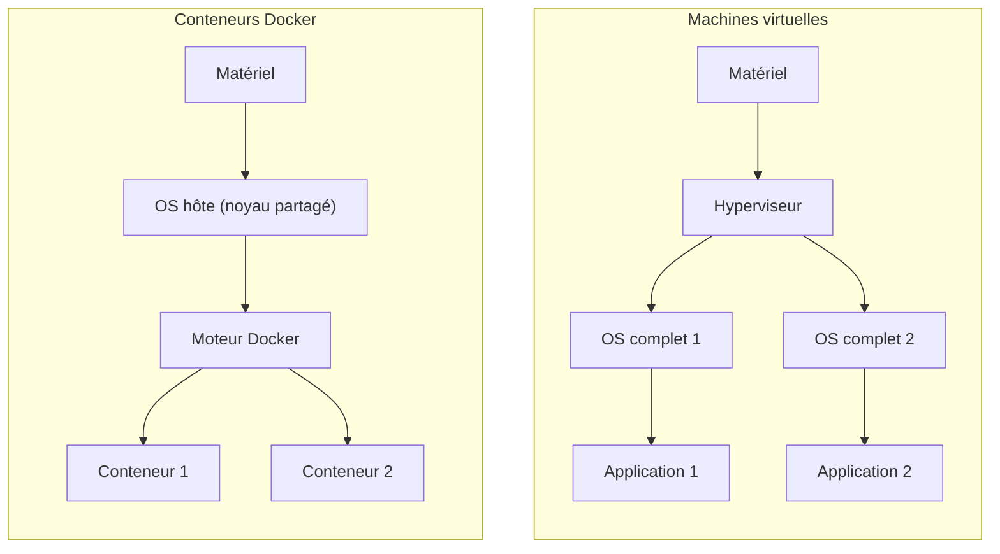
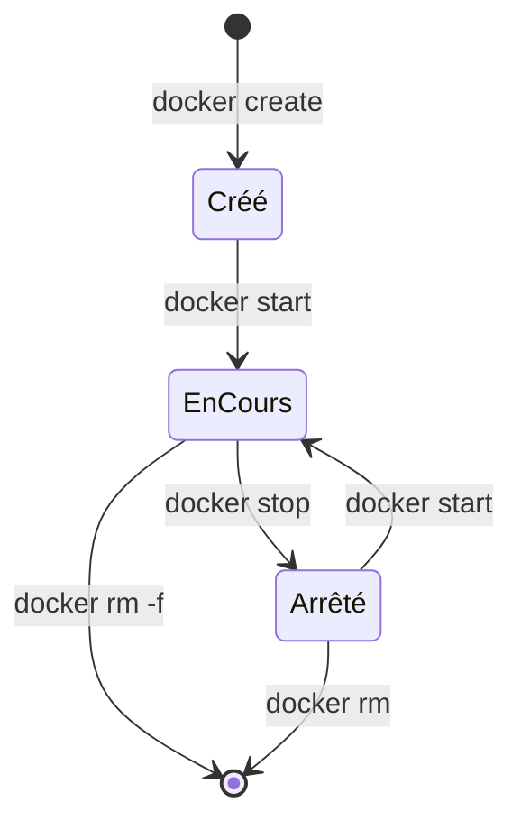
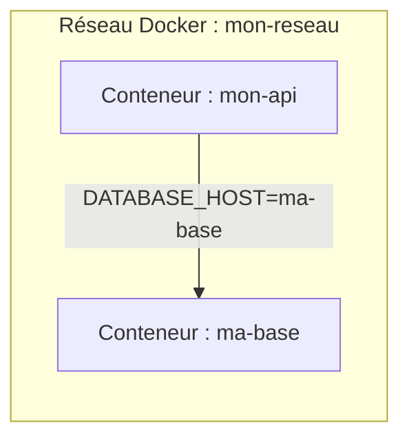

<div class="chapitre-titre-num">CHAPITRE 11 · 🟡 INTERMÉDIAIRE</div>

# Docker : images, conteneurs, volumes, réseaux

<div class="encadre objectif">
<span class="encadre-titre">🎯 Objectif du chapitre</span>
Comprendre précisément ce qu'est un conteneur (et ce qu'il n'est pas — pas une machine virtuelle), maîtriser le cycle de vie complet d'un conteneur Docker, comprendre comment les volumes rendent des données persistantes malgré la nature jetable des conteneurs, et comment les réseaux Docker permettent à plusieurs conteneurs de communiquer entre eux. Ce chapitre ouvre la Partie V : les trois chapitres suivants (Dockerfile, Compose, registries) s'appuient tous sur ces quatre concepts.
</div>

<div class="encadre scenario">
<span class="encadre-titre">🎬 Mise en situation</span>
Rappelle-toi le scénario d'ouverture du chapitre 1 : un déploiement qui prend six heures parce que le serveur de production n'a pas les mêmes dépendances que la machine du développeur. Docker résout ce problème précis en empaquetant une application avec absolument tout ce dont elle a besoin pour fonctionner — jusqu'au système d'exploitation minimal sous-jacent — dans une seule unité portable, qui se comporte de façon identique sur ta machine locale, ton serveur de laboratoire, ou n'importe quel serveur de production.
</div>

## 11.1 Conteneur ou machine virtuelle : une différence fondamentale

<div class="encadre attention">
<span class="encadre-titre">⚠️ Erreur de compréhension très fréquente : "un conteneur, c'est une petite machine virtuelle"</span>
C'est faux, et cette confusion mène à beaucoup de malentendus sur Docker. Une machine virtuelle (VM) virtualise du <strong>matériel</strong> et fait tourner un système d'exploitation complet par-dessus, avec son propre noyau. Un conteneur ne virtualise <strong>pas</strong> de matériel : il partage le noyau du système hôte, et isole seulement les processus, le système de fichiers et le réseau au niveau du système d'exploitation. C'est cette différence qui rend un conteneur infiniment plus léger et plus rapide à démarrer qu'une VM.
</div>



| | Machine virtuelle | Conteneur Docker |
|---|---|---|
| **Isolation** | Matérielle (hyperviseur), très forte | Système d'exploitation (noyau partagé), plus légère |
| **Démarrage** | Minutes | Secondes, parfois moins d'une seconde |
| **Taille typique** | Plusieurs Go (OS complet) | Quelques Mo à quelques centaines de Mo |
| **Densité** | Quelques VM par serveur physique | Des dizaines à des centaines de conteneurs par serveur |
| **Cas d'usage typique** | Isolation forte entre environnements totalement différents | Empaqueter et faire tourner des applications de façon reproductible |

## 11.2 Images et conteneurs : la recette et le plat

<div class="encadre astuce">
<span class="encadre-titre">💡 Analogie — la recette et le plat cuisiné</span>
Une <strong>image</strong> Docker est comme une recette de cuisine : une liste d'instructions figées (chapitre 12, Dockerfile), qui décrit exactement quoi assembler. Un <strong>conteneur</strong> est le plat effectivement cuisiné à partir de cette recette — on peut cuisiner le même plat (créer plusieurs conteneurs) autant de fois qu'on veut à partir de la même recette (image), et chaque plat (conteneur) peut être mangé, jeté, recommencé, sans jamais modifier la recette elle-même.
</div>

```bash
docker pull nginx:1.27
docker images
```

**Explication :** `docker pull` télécharge une image depuis un registre (Docker Hub par défaut, chapitre 14) ; `nginx:1.27` précise le nom de l'image et son **tag** (ici, une version précise plutôt que `latest`) ; `docker images` liste toutes les images téléchargées localement.

```bash
docker run -d --name mon-nginx -p 8080:80 nginx:1.27
docker ps
```

**Explication des options :** `-d` (*detached*) lance le conteneur en arrière-plan, sans bloquer le terminal ; `--name` donne un nom lisible au conteneur plutôt qu'un identifiant généré aléatoirement ; `-p 8080:80` publie le port 80 du conteneur (celui écouté par Nginx à l'intérieur) sur le port 8080 de la machine hôte (`hôte:conteneur`, un ordre à retenir) ; `docker ps` liste les conteneurs **en cours d'exécution**.

**Test de vérification :**

```bash
curl http://localhost:8080
```

**Résultat attendu** : la page d'accueil par défaut de Nginx s'affiche — la preuve que le conteneur tourne réellement et répond sur le port publié.

## 11.3 Le cycle de vie d'un conteneur



```bash
docker stop mon-nginx
docker start mon-nginx
docker restart mon-nginx
docker logs mon-nginx
docker exec -it mon-nginx bash
docker rm -f mon-nginx
```

**Explication de chaque commande :** `stop` envoie un signal d'arrêt propre (avec un délai de grâce avant arrêt forcé) ; `start` redémarre un conteneur arrêté (en conservant son état précédent, contrairement à `run` qui en crée un nouveau) ; `restart` combine les deux ; `logs` affiche la sortie standard du conteneur (essentiel pour le diagnostic, approfondi au chapitre 22) ; `exec -it ... bash` ouvre un terminal interactif **à l'intérieur** du conteneur en cours d'exécution, très utile pour inspecter son état ; `rm -f` supprime définitivement le conteneur, y compris s'il tourne encore (`-f`, forcé).

<div class="encadre retenir">
<span class="encadre-titre">📌 `docker run` crée toujours un NOUVEAU conteneur</span>
Une confusion fréquente chez les débutants : exécuter <code>docker run</code> plusieurs fois de suite avec le même nom échoue (le nom est déjà pris par le conteneur existant, même arrêté) — <code>run</code> ne "relance" jamais un conteneur existant, il tente toujours d'en <strong>créer</strong> un nouveau. Pour relancer un conteneur déjà créé, utiliser <code>docker start</code>, pas <code>docker run</code>.
</div>

## 11.4 Volumes : la persistance malgré des conteneurs jetables

Par défaut, tout ce qui est écrit dans le système de fichiers d'un conteneur **disparaît** quand ce conteneur est supprimé (`docker rm`). Pour des données qui doivent survivre (une base de données, des fichiers uploadés), Docker propose les **volumes**.

```bash
docker volume create donnees-postgres
docker run -d --name ma-base -v donnees-postgres:/var/lib/postgresql/data postgres:16
```

**Explication :** `docker volume create` crée un espace de stockage géré par Docker, indépendant du cycle de vie de n'importe quel conteneur ; `-v donnees-postgres:/var/lib/postgresql/data` (`volume:chemin_dans_le_conteneur`) monte ce volume à l'intérieur du conteneur, à l'emplacement où PostgreSQL écrit ses données.

**Test de vérification :**

```bash
docker rm -f ma-base
docker run -d --name ma-base -v donnees-postgres:/var/lib/postgresql/data postgres:16
```

**Résultat attendu** : même après avoir supprimé et recréé le conteneur, les données de la base restent intactes — parce qu'elles vivaient dans le volume, pas dans le conteneur lui-même.

<div class="encadre retenir">
<span class="encadre-titre">📌 Volume nommé ou bind mount</span>
Un <strong>volume nommé</strong> (<code>donnees-postgres</code> ci-dessus) est entièrement géré par Docker, dans un emplacement que Docker choisit sur le disque de l'hôte — la méthode recommandée pour des données applicatives comme une base de données. Un <strong>bind mount</strong> (<code>-v /chemin/absolu/local:/chemin/dans/conteneur</code>) relie directement un dossier précis de la machine hôte — utile en développement pour éditer du code en local et le voir reflété immédiatement dans le conteneur, moins recommandé pour des données de production.
</div>

## 11.5 Réseaux : faire communiquer plusieurs conteneurs

Par défaut, un conteneur ne peut pas joindre un autre conteneur par son nom sans réseau explicite.

```bash
docker network create mon-reseau
docker run -d --name ma-base --network mon-reseau postgres:16
docker run -d --name mon-api --network mon-reseau -e DATABASE_HOST=ma-base mon-image-api
```

**Explication :** `docker network create` crée un réseau virtuel isolé ; les deux conteneurs, rattachés au **même** réseau, peuvent alors se joindre directement en utilisant leur **nom de conteneur** comme s'il s'agissait d'un nom de domaine (`ma-base` résout automatiquement vers l'adresse IP interne du conteneur de base de données) — c'est ce mécanisme de résolution par nom qui rend Docker Compose (chapitre 13) aussi simple à utiliser.



**Test de vérification :**

```bash
docker exec -it mon-api ping ma-base
```

**Résultat attendu** : le conteneur `mon-api` résout et joint `ma-base` par son nom, sans jamais connaître son adresse IP interne réelle.

## Atelier — Deux conteneurs qui communiquent, avec données persistantes

<div class="encadre exercice">
<span class="encadre-titre">🛠️ Atelier 11.1 — Une base de données persistante, jointe par un second conteneur</span>

**Objectif** : combiner volumes et réseaux dans un scénario réaliste, sur ton serveur de laboratoire.

**Étapes détaillées** :

1. Crée un réseau `atelier-net` et un volume `atelier-data`.
2. Lance un conteneur PostgreSQL (`postgres:16`), rattaché au réseau, avec le volume monté et une variable `POSTGRES_PASSWORD` définie (obligatoire pour cette image).
3. Lance un second conteneur (par exemple `postgres:16` également, juste pour utiliser son client `psql`) sur le même réseau, et connecte-toi à la base depuis ce second conteneur en utilisant le nom du premier comme hôte.
4. Crée une table de test, insère une ligne.
5. Supprime le conteneur de base de données (`docker rm -f`), recrée-le à l'identique (même nom, même volume).
6. Reconnecte-toi et vérifie que la table et la ligne insérée sont toujours là.

**Résultat attendu** : la preuve concrète, en conditions réelles, que la donnée survit à la destruction du conteneur grâce au volume — le principe central de ce chapitre.

**Dépannage** : si la connexion échoue au point 3, vérifie que les deux conteneurs sont bien rattachés au **même** réseau (`docker network inspect atelier-net`).
</div>

## Erreurs fréquentes

<div class="encadre attention">
<span class="encadre-titre">⚠️ Erreur n°1 — Confondre conteneur et machine virtuelle</span>
Comme détaillé en section 11.1, un conteneur partage le noyau de l'hôte — il n'offre pas la même isolation qu'une VM. Cette distinction influence directement des choix de sécurité abordés au chapitre 36.
</div>

<div class="encadre attention">
<span class="encadre-titre">⚠️ Erreur n°2 — Stocker des données importantes sans volume</span>
Un conteneur de base de données lancé sans `-v` perd **toutes** ses données au premier `docker rm`, y compris accidentel. Toujours un volume nommé pour toute donnée qui doit survivre au conteneur.
</div>

<div class="encadre attention">
<span class="encadre-titre">⚠️ Erreur n°3 — `docker run` répété au lieu de `start`</span>
Comme signalé en section 11.3, relancer `docker run --name x` sur un nom déjà utilisé échoue avec `Conflict. The container name "/x" is already in use` — la solution est `docker start x` (ou supprimer l'ancien conteneur avec `docker rm` si on veut réellement en recréer un).
</div>

## En entreprise

**Réalité répandue** : Docker (ou une alternative compatible comme Podman) est devenu le standard de fait pour empaqueter des applications, quel que soit le langage — la portabilité qu'il offre justifie son adoption quasi universelle dans les nouveaux projets depuis le milieu des années 2010.

**Bonne pratique répandue** : en production, les volumes de données critiques (bases de données) sont presque toujours sauvegardés séparément (Partie IX) — le volume protège contre la suppression du conteneur, pas contre une corruption de disque ou une erreur humaine sur les données elles-mêmes.

**Erreur classique observée** : des conteneurs de développement lancés sans jamais de volume, où l'équipe perd des heures de configuration locale à chaque redémarrage de machine — un problème que ce chapitre permet d'éviter dès maintenant.

## Entretien technique

<div class="encadre exercice">
<span class="encadre-titre">💼 Questions fréquemment posées en entretien</span>

**Q1. "Quelle est la différence fondamentale entre un conteneur et une machine virtuelle ?"**
Réponse attendue : un conteneur partage le noyau du système hôte et isole au niveau processus/système de fichiers/réseau ; une VM virtualise le matériel et fait tourner un OS complet séparé, avec un coût en ressources et en temps de démarrage bien plus élevé (section 11.1).

**Q2. "Comment feras-tu persister les données d'une base de données conteneurisée ?"**
Réponse attendue : un volume Docker nommé, monté à l'emplacement où la base écrit ses données, indépendant du cycle de vie du conteneur lui-même (section 11.4).

**Q3. "Comment deux conteneurs peuvent-ils communiquer entre eux ?"**
Réponse attendue : en étant rattachés au même réseau Docker, ce qui permet de les joindre l'un l'autre directement par leur nom de conteneur, sans connaître d'adresse IP interne (section 11.5).
</div>

## Optimisation, sécurité et maintenabilité — les réflexes dès ce chapitre

<div class="encadre securite">
<span class="encadre-titre">🔒 Sécurité</span>
Un réseau Docker dédié (plutôt que le réseau `bridge` par défaut partagé par tous les conteneurs) isole les conteneurs d'un même projet des autres conteneurs qui pourraient tourner sur la même machine — un premier réflexe de cloisonnement, approfondi au chapitre 36.
</div>

<div class="encadre bonne-pratique">
<span class="encadre-titre">✅ Maintenabilité</span>
Nomme systématiquement tes conteneurs, volumes et réseaux de façon explicite (`--name`, `docker volume create nom-clair`) plutôt que de laisser Docker générer des noms aléatoires — un `docker ps` lisible fait gagner un temps précieux en diagnostic.
</div>

<div class="encadre performance">
<span class="encadre-titre">🚀 Performance</span>
Le temps de démarrage très court d'un conteneur (par rapport à une VM) permet des cycles de développement et de test bien plus rapides — un conteneur qu'on peut détruire et recréer en quelques secondes encourage à tester plus souvent, sans crainte de "casser" un environnement fragile.
</div>

## Résumé du chapitre

- Un conteneur partage le noyau de l'hôte (contrairement à une VM qui virtualise le matériel), le rendant beaucoup plus léger et rapide.
- Une image est la recette figée ; un conteneur est l'instance en cours d'exécution créée à partir de cette image.
- Le cycle de vie d'un conteneur (`create`/`start`/`stop`/`rm`) est distinct de `docker run`, qui crée toujours un nouveau conteneur.
- Les volumes rendent des données persistantes malgré la nature jetable des conteneurs — indispensables pour toute base de données ou fichier important.
- Les réseaux Docker permettent à des conteneurs de se joindre directement par leur nom, sans configuration réseau manuelle complexe.

## Quiz

<div class="encadre exercice">
<span class="encadre-titre">📝 QCM (une seule bonne réponse par question)</span>

1. Un conteneur Docker, contrairement à une machine virtuelle :
   - a) Virtualise le matériel physique
   - b) Partage le noyau du système d'exploitation hôte
   - c) Nécessite toujours plusieurs minutes pour démarrer
   - d) Ne peut jamais être supprimé

2. Sans volume, les données écrites dans un conteneur :
   - a) Sont automatiquement sauvegardées dans le cloud
   - b) Disparaissent quand le conteneur est supprimé
   - c) Sont répliquées sur tous les autres conteneurs
   - d) Deviennent en lecture seule après 24h

3. Pour que deux conteneurs se joignent par leur nom, il faut :
   - a) Qu'ils soient rattachés au même réseau Docker
   - b) Qu'ils partagent la même image
   - c) Qu'ils soient lancés avec `docker create` plutôt que `docker run`
   - d) Rien de spécial, cela fonctionne toujours par défaut

**Corrigé** : 1-b, 2-b, 3-a.
</div>

<div class="encadre exercice">
<span class="encadre-titre">📝 Vrai ou Faux</span>

1. `docker run` avec un nom déjà utilisé relance simplement le conteneur existant. — **Faux** (il échoue avec un conflit, section 11.3).
2. Un volume nommé survit à la suppression du conteneur qui l'utilisait. — **Vrai**.
3. Deux conteneurs sur des réseaux Docker différents peuvent se joindre directement par leur nom sans configuration supplémentaire. — **Faux** (ils doivent être sur le même réseau, section 11.5).

</div>

## Exercices

<div class="encadre exercice">
<span class="encadre-titre">📝 Exercice 11.1</span>

Explique la différence entre un volume nommé et un bind mount, et donne un cas d'usage typique pour chacun.
</div>

**Corrigé :** un volume nommé est entièrement géré par Docker, à un emplacement qu'il choisit lui-même — adapté aux données applicatives persistantes comme une base de données en production. Un bind mount relie un dossier précis et visible de la machine hôte à un chemin dans le conteneur — adapté au développement local, pour éditer du code sur sa machine et voir immédiatement le résultat dans le conteneur, sans reconstruire l'image à chaque changement (section 11.4).

## Checklist de fin de chapitre

<ul class="checklist">
<li>☐ Je sais expliquer la différence entre un conteneur et une machine virtuelle.</li>
<li>☐ Je comprends la différence entre une image et un conteneur (recette vs plat cuisiné).</li>
<li>☐ Je maîtrise le cycle de vie d'un conteneur (create/start/stop/restart/rm), et je sais que `run` crée toujours un nouveau conteneur.</li>
<li>☐ Je sais créer et utiliser un volume nommé pour rendre des données persistantes.</li>
<li>☐ Je sais créer un réseau Docker et faire communiquer deux conteneurs par leur nom.</li>
<li>☐ J'ai vérifié en pratique qu'un volume survit à la suppression de son conteneur.</li>
</ul>

## FAQ

<dl class="faq">
<dt>Docker fonctionne-t-il nativement sur Windows ?</dt>
<dd>Docker Desktop sur Windows s'appuie sur WSL2 (chapitre 3) pour exécuter un vrai noyau Linux en arrière-plan — les conteneurs Linux ne tournent techniquement jamais directement sur le noyau Windows, mais l'expérience reste transparente pour l'utilisateur.</dd>

<dt>Peut-on faire tourner des conteneurs Windows avec Docker ?</dt>
<dd>Oui, Docker supporte aussi des conteneurs basés sur Windows Server, mais ce cas d'usage est nettement plus rare dans l'écosystème DevOps moderne et n'est pas couvert par ce manuel, qui se concentre sur les conteneurs Linux, de très loin les plus répandus.</dd>

<dt>Que devient un port publié (`-p`) si le conteneur redémarre ?</dt>
<dd>Il reste identique tant que le conteneur est relancé avec `docker start` (pas recréé) — les options de `docker run`, y compris `-p`, sont mémorisées pour la vie du conteneur. Un conteneur recréé avec `docker run` doit se voir repréciser ses options.</dd>
</dl>

## Références et pour aller plus loin

- Documentation officielle Docker — Get Started : [https://docs.docker.com/get-started/](https://docs.docker.com/get-started/)
- Documentation officielle Docker — volumes : [https://docs.docker.com/engine/storage/volumes/](https://docs.docker.com/engine/storage/volumes/)
- Documentation officielle Docker — réseaux : [https://docs.docker.com/engine/network/](https://docs.docker.com/engine/network/)

*Chapitre suivant : Dockerfile professionnel — multi-stage build, cache, utilisateur non-root, healthcheck, et la construction d'images pour Node.js, React, NestJS, Python/Django et Java/Spring Boot.*
