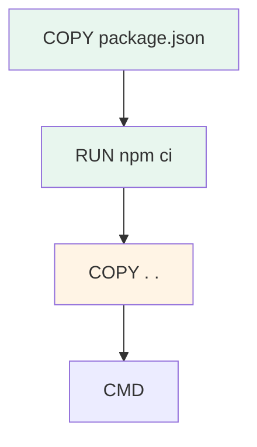

<div class="chapitre-titre-num">CHAPITRE 12 · 🟠 AVANCÉ</div>

# Dockerfile professionnel

<div class="encadre objectif">
<span class="encadre-titre">🎯 Objectif du chapitre</span>
Écrire des Dockerfiles de qualité professionnelle : multi-stage build (pour des images minimales), cache de build (pour des reconstructions rapides), `.dockerignore`, utilisateur non-root, healthcheck. Ce chapitre construit cinq Dockerfiles réels et commentés — Node.js, React, NestJS, Python/Django, Java/Spring Boot — que tu pourras réutiliser directement dans tes propres projets.
</div>

<div class="encadre scenario">
<span class="encadre-titre">🎬 Mise en situation</span>
Le chapitre 11 a montré comment utiliser des images déjà prêtes (`nginx`, `postgres`). Ce chapitre répond à la question suivante : comment construire **ta propre** image, pour **ton** application ? Un premier Dockerfile naïf fonctionne souvent, mais produit fréquemment une image de plusieurs centaines de Mo, lente à construire, lente à transférer, et qui tourne en root par défaut — trois problèmes que ce chapitre corrige méthodiquement.
</div>

## 12.1 Un premier Dockerfile, puis ses limites

```dockerfile
FROM node:20
WORKDIR /app
COPY . .
RUN npm install
CMD ["node", "index.js"]
```

**Explication ligne par ligne :** `FROM` choisit l'image de base ; `WORKDIR` définit le dossier de travail à l'intérieur de l'image (créé automatiquement s'il n'existe pas) ; `COPY . .` copie tout le contenu du dossier courant dans l'image ; `RUN` exécute une commande **pendant la construction** de l'image ; `CMD` définit la commande exécutée **au démarrage** d'un conteneur basé sur cette image.

```bash
docker build -t mon-app:v1 .
```

<div class="encadre attention">
<span class="encadre-titre">⚠️ Ce Dockerfile fonctionne, mais cumule plusieurs problèmes</span>
<code>node:20</code> (sans variante précisée) pèse plusieurs centaines de Mo, l'essentiel étant des outils de développement jamais utilisés en production ; <code>COPY . .</code> copie aussi <code>node_modules</code> et <code>.git</code> s'ils existent localement, gonflant l'image et risquant d'écraser une installation propre ; sans utilisateur précisé, le conteneur tourne en <strong>root</strong> par défaut ; et surtout, <strong>toute</strong> modification du code, même d'une seule ligne, invalide le cache et force une réinstallation complète de toutes les dépendances à chaque build. Les sections suivantes corrigent chacun de ces points.
</div>

## 12.2 `.dockerignore` : ce qui ne doit jamais entrer dans l'image

```text
node_modules
.git
.env
*.log
dist
coverage
.vscode
```

**Explication :** exactement comme `.gitignore` (chapitre 7) exclut des fichiers de Git, `.dockerignore` exclut des fichiers du contexte de build envoyé à Docker — `node_modules` local (souvent incompatible avec l'OS de l'image, sera réinstallé proprement à l'intérieur), `.git` (inutile en production, potentiellement volumineux), `.env` (jamais de secret dans une image, chapitre 25).

## 12.3 Cache de build : ordonner les instructions intelligemment

<div class="encadre retenir">
<span class="encadre-titre">📌 Comment fonctionne le cache Docker</span>
Docker construit une image instruction par instruction, et met en cache le résultat de chaque étape. Si une instruction et son contexte (les fichiers qu'elle utilise) n'ont pas changé depuis le dernier build, Docker <strong>réutilise</strong> le résultat en cache au lieu de la réexécuter — mais dès qu'une étape change, <strong>toutes les étapes suivantes</strong> sont invalidées et réexécutées, même si elles n'ont elles-mêmes pas changé.
</div>

```dockerfile
FROM node:20-slim
WORKDIR /app

COPY package.json package-lock.json ./
RUN npm ci --omit=dev

COPY . .
CMD ["node", "index.js"]
```

**Explication de l'optimisation :** en copiant **uniquement** `package.json`/`package-lock.json` avant `npm ci`, cette étape ne se réinvalide que lorsque les dépendances changent réellement — pas à chaque modification de code source. `COPY . .` (qui change à chaque modification de code) est placé **après**, pour que seule cette dernière étape (rapide) se réexécute lors d'un développement itératif.



**Explication du schéma :** les étapes en vert restent en cache tant que `package.json` ne change pas ; seule l'étape en orange (copie du code) se réexécute à chaque modification de code source — une différence énorme en temps de build sur un projet avec beaucoup de dépendances.

## 12.4 Multi-stage build : séparer construction et exécution

<div class="encadre astuce">
<span class="encadre-titre">💡 Pourquoi séparer "construire" et "exécuter"</span>
Construire une application (compiler du TypeScript, packager du React) nécessite souvent des outils volumineux (compilateurs, dépendances de développement) totalement inutiles une fois le résultat final produit. Le multi-stage build permet d'utiliser une image complète pour construire, puis de ne copier <strong>que le résultat final</strong> dans une image finale minimale — les outils de construction n'existent jamais dans l'image livrée en production.
</div>

```dockerfile
# --- Étape 1 : construction ---
FROM node:20-slim AS build
WORKDIR /app
COPY package.json package-lock.json ./
RUN npm ci
COPY . .
RUN npm run build

# --- Étape 2 : image finale, minimale ---
FROM node:20-slim
WORKDIR /app
COPY package.json package-lock.json ./
RUN npm ci --omit=dev
COPY --from=build /app/dist ./dist

CMD ["node", "dist/index.js"]
```

**Explication :** `AS build` nomme la première étape pour pouvoir y faire référence plus tard ; `COPY --from=build /app/dist ./dist` copie **uniquement** le résultat compilé de la première étape vers la seconde, sans jamais inclure le code source TypeScript ni les dépendances de développement dans l'image finale.

## 12.5 Utilisateur non-root

```dockerfile
FROM node:20-slim
WORKDIR /app
COPY package.json package-lock.json ./
RUN npm ci --omit=dev
COPY . .

RUN addgroup --system appgroup && adduser --system --ingroup appgroup appuser
USER appuser

CMD ["node", "index.js"]
```

**Explication :** `addgroup`/`adduser --system` crée un utilisateur dédié, sans privilèges administrateur ; `USER appuser` fait que **toutes** les instructions suivantes (et le conteneur au démarrage) s'exécutent avec cet utilisateur, jamais root.

<div class="encadre securite">
<span class="encadre-titre">🔒 Sécurité — pourquoi root dans un conteneur reste dangereux</span>
Même si un conteneur isole davantage qu'un simple processus (chapitre 11), une faille combinée (dans l'application ET dans le moteur Docker) qui permettrait de "s'échapper" du conteneur aurait un impact bien plus grave si le processus tournait en root à l'intérieur. Le principe du moindre privilège (chapitres 4 et 5) s'applique à l'identique dans un conteneur — approfondi au chapitre 36.
</div>

## 12.6 Healthcheck

```dockerfile
HEALTHCHECK --interval=30s --timeout=5s --retries=3 \
  CMD curl -f http://localhost:3000/health || exit 1
```

**Explication :** Docker exécute cette commande à intervalle régulier (`--interval`) ; si elle échoue plusieurs fois de suite (`--retries`), le conteneur est marqué `unhealthy` dans `docker ps` — une information exploitable par Docker Compose (chapitre 13) et par des orchestrateurs comme Kubernetes (Partie XIII) pour redémarrer automatiquement un conteneur défaillant, exactement le même principe que `healthcheck.sh` (chapitre 10).

## 12.7 Cinq Dockerfiles construits, commentés

**Node.js (API simple) :**
```dockerfile
FROM node:20-slim
WORKDIR /app
COPY package.json package-lock.json ./
RUN npm ci --omit=dev
COPY . .
RUN addgroup --system appgroup && adduser --system --ingroup appgroup appuser
USER appuser
EXPOSE 3000
HEALTHCHECK --interval=30s CMD curl -f http://localhost:3000/health || exit 1
CMD ["node", "index.js"]
```

**React (build statique, servi par Nginx) :**
```dockerfile
FROM node:20-slim AS build
WORKDIR /app
COPY package.json package-lock.json ./
RUN npm ci
COPY . .
RUN npm run build

FROM nginx:1.27-alpine
COPY --from=build /app/dist /usr/share/nginx/html
EXPOSE 80
```

**Explication spécifique React :** la deuxième étape n'utilise même plus Node.js — un site React compilé n'est que des fichiers HTML/CSS/JS statiques, servis idéalement par Nginx (chapitre 15), une image finale radicalement plus petite qu'une image Node.js complète.

**NestJS (avec compilation TypeScript) :**
```dockerfile
FROM node:20-slim AS build
WORKDIR /app
COPY package.json package-lock.json ./
RUN npm ci
COPY . .
RUN npm run build

FROM node:20-slim
WORKDIR /app
COPY package.json package-lock.json ./
RUN npm ci --omit=dev
COPY --from=build /app/dist ./dist
RUN addgroup --system appgroup && adduser --system --ingroup appgroup appuser
USER appuser
EXPOSE 3000
CMD ["node", "dist/main.js"]
```

**Python/Django :**
```dockerfile
FROM python:3.12-slim
WORKDIR /app
COPY requirements.txt .
RUN pip install --no-cache-dir -r requirements.txt
COPY . .
RUN adduser --system --group appuser
USER appuser
EXPOSE 8000
CMD ["gunicorn", "--bind", "0.0.0.0:8000", "monprojet.wsgi"]
```

**Explication spécifique Python :** même logique de cache que Node.js — `requirements.txt` copié et installé **avant** le reste du code ; `--no-cache-dir` évite que `pip` conserve un cache local inutile dans l'image finale ; `gunicorn` (plutôt que le serveur de développement Django) est le serveur d'application recommandé en production.

**Java/Spring Boot (multi-stage avec Maven) :**
```dockerfile
FROM maven:3.9-eclipse-temurin-21 AS build
WORKDIR /app
COPY pom.xml .
RUN mvn dependency:go-offline
COPY src ./src
RUN mvn package -DskipTests

FROM eclipse-temurin:21-jre-alpine
WORKDIR /app
COPY --from=build /app/target/*.jar app.jar
RUN addgroup -S appgroup && adduser -S appuser -G appgroup
USER appuser
EXPOSE 8080
CMD ["java", "-jar", "app.jar"]
```

**Explication spécifique Java :** `mvn dependency:go-offline` télécharge les dépendances Maven avant de copier le code source, appliquant le même principe de cache ; l'image finale utilise un JRE (*Java Runtime Environment*, pour exécuter) plutôt qu'un JDK complet (*Java Development Kit*, pour compiler) — le JDK et Maven n'existent que dans l'étape de build, jamais dans l'image livrée.

<div class="encadre bonne-pratique">
<span class="encadre-titre">✅ Le motif commun à ces cinq Dockerfiles</span>
Malgré des langages très différents, le même motif revient à chaque fois : copier et installer les dépendances avant le code (cache), séparer construction et exécution (multi-stage), utilisateur non-root, image de base "slim"/"alpine" plutôt que complète. Une fois ce motif intégré, écrire un Dockerfile pour un nouveau langage devient un exercice d'adaptation, pas une découverte complète à chaque fois.
</div>

## Atelier — Comparer la taille et le temps de build

<div class="encadre exercice">
<span class="encadre-titre">🛠️ Atelier 12.1 — Mesurer l'impact des optimisations</span>

**Objectif** : constater concrètement l'effet du multi-stage build et du cache sur la taille d'image et le temps de construction.

**Étapes détaillées** :

1. Construis l'image naïve de la section 12.1 (`docker build -t app-naive .`), note le temps et la taille (`docker images`).
2. Construis l'image optimisée de la section 12.5 (`docker build -t app-optimisee .`), note à nouveau temps et taille.
3. Modifie une seule ligne de code applicatif (pas les dépendances) dans les deux versions, reconstruis chacune, compare le temps de la deuxième construction.

**Résultat attendu** : l'image optimisée est significativement plus petite (souvent plusieurs fois), et sa reconstruction après un simple changement de code est nettement plus rapide grâce au cache — la preuve mesurable des principes de ce chapitre.
</div>

## Erreurs fréquentes

<div class="encadre attention">
<span class="encadre-titre">⚠️ Erreur n°1 — `COPY . .` avant l'installation des dépendances</span>
Comme détaillé en section 12.3, copier tout le code avant d'installer les dépendances invalide le cache à chaque modification de code, même la plus mineure — l'erreur d'optimisation la plus fréquente et la plus coûteuse en temps de build.
</div>

<div class="encadre attention">
<span class="encadre-titre">⚠️ Erreur n°2 — Oublier `.dockerignore`</span>
Sans `.dockerignore`, `node_modules` local (souvent compilé pour un OS différent de celui de l'image) peut être copié par erreur et entrer en conflit avec l'installation propre faite dans le Dockerfile.
</div>

<div class="encadre attention">
<span class="encadre-titre">⚠️ Erreur n°3 — Image de base complète au lieu d'une variante "slim"</span>
`node:20` pèse plusieurs centaines de Mo de plus que `node:20-slim`, pour un usage de production qui n'a besoin d'aucun des outils supplémentaires inclus dans la version complète.
</div>

## En entreprise

**Réalité répandue** : la taille d'une image Docker a un impact direct et mesurable sur les coûts (stockage du registre, chapitre 14) et sur la vitesse de déploiement (transfert réseau vers le serveur) — une préoccupation prise très au sérieux dans les équipes avec un rythme de déploiement élevé (chapitre 2).

**Bonne pratique répandue** : de nombreuses équipes maintiennent des "Dockerfiles de référence" internes par type de projet (une base Node.js, une base Python...), maintenus centralement et réutilisés par tous les projets, plutôt que de réinventer un Dockerfile à chaque nouveau projet.

**Erreur classique observée** : des images construites en root "temporairement, le temps de livrer", jamais corrigées ensuite — un exemple classique de dette technique de sécurité qui s'installe durablement (chapitre 35).

## Entretien technique

<div class="encadre exercice">
<span class="encadre-titre">💼 Questions fréquemment posées en entretien</span>

**Q1. "Pourquoi utiliser un multi-stage build ?"**
Réponse attendue : séparer les outils nécessaires à la construction (compilateurs, dépendances de développement) de l'image finale livrée en production, réduisant considérablement sa taille et sa surface d'attaque (section 12.4).

**Q2. "Comment optimiserais-tu le cache de build d'un Dockerfile Node.js ?"**
Réponse attendue : copier et installer `package.json`/`package-lock.json` avant de copier le reste du code source, pour que l'installation des dépendances ne se réinvalide que lorsque les dépendances changent réellement (section 12.3).

**Q3. "Pourquoi éviter de faire tourner un conteneur en root ?"**
Réponse attendue : réduit l'impact potentiel d'une faille de sécurité qui permettrait de sortir du conteneur, en cohérence avec le principe du moindre privilège appliqué partout ailleurs dans ce manuel (section 12.5).
</div>

## Optimisation, sécurité et maintenabilité — les réflexes dès ce chapitre

<div class="encadre securite">
<span class="encadre-titre">🔒 Sécurité</span>
Utilisateur non-root, `.dockerignore` excluant tout secret, et image de base minimale (moins de composants installés, moins de vulnérabilités potentielles) forment le socle de sécurité de base d'un Dockerfile — approfondi au chapitre 36 avec le scan d'images.
</div>

<div class="encadre bonne-pratique">
<span class="encadre-titre">✅ Maintenabilité</span>
Commente les sections moins évidentes d'un Dockerfile complexe (pourquoi telle étape est séparée, pourquoi telle version précise d'image de base) — un Dockerfile se relit et se modifie aussi souvent que le code applicatif lui-même.
</div>

<div class="encadre performance">
<span class="encadre-titre">🚀 Performance</span>
Épingler des versions précises (`node:20-slim`, jamais `node:latest`) évite qu'une image change silencieusement de comportement entre deux builds à des dates différentes — un principe de reproductibilité central à tout ce manuel (chapitre 1).
</div>

## Résumé du chapitre

- Un Dockerfile naïf fonctionne mais cumule des problèmes de taille, de cache et de sécurité.
- `.dockerignore` exclut du contexte de build ce qui ne doit jamais entrer dans l'image (dépendances locales, secrets, historique Git).
- Ordonner les instructions du moins changeant (dépendances) au plus changeant (code source) optimise radicalement le cache.
- Le multi-stage build sépare construction et exécution, produisant une image finale minimale.
- Un utilisateur non-root et un healthcheck sont deux réflexes de production non négociables.
- Le même motif (cache, multi-stage, non-root, image slim) s'applique, avec des variations mineures, à tous les langages.

## Quiz

<div class="encadre exercice">
<span class="encadre-titre">📝 QCM (une seule bonne réponse par question)</span>

1. Le multi-stage build sert principalement à :
   - a) Accélérer l'exécution du conteneur
   - b) Séparer les outils de construction de l'image finale livrée
   - c) Créer plusieurs conteneurs en une seule commande
   - d) Remplacer Docker Compose

2. Pour optimiser le cache Docker sur un projet Node.js, il faut :
   - a) Copier tout le code avant d'installer les dépendances
   - b) Copier `package.json` et installer les dépendances avant de copier le reste du code
   - c) Ne jamais utiliser `npm ci`
   - d) Toujours utiliser `node:latest`

3. `.dockerignore` sert à :
   - a) Ignorer les erreurs de build
   - b) Exclure certains fichiers/dossiers du contexte envoyé à Docker lors du build
   - c) Supprimer une image existante
   - d) Empêcher le conteneur de démarrer

**Corrigé** : 1-b, 2-b, 3-b.
</div>

<div class="encadre exercice">
<span class="encadre-titre">📝 Vrai ou Faux</span>

1. Un conteneur sans `USER` précisé tourne en root par défaut. — **Vrai** (section 12.5).
2. `node:20-slim` contient toujours plus d'outils que `node:20`. — **Faux** (c'est l'inverse, section 12.1).
3. Un HEALTHCHECK défini dans un Dockerfile peut marquer un conteneur comme "unhealthy" s'il échoue plusieurs fois de suite. — **Vrai** (section 12.6).

</div>

## Exercices

<div class="encadre exercice">
<span class="encadre-titre">📝 Exercice 12.1</span>

Réécris le Dockerfile Python/Django de la section 12.7 pour ajouter un HEALTHCHECK qui vérifie `http://localhost:8000/health` toutes les 30 secondes.
</div>

**Corrigé :**
```dockerfile
FROM python:3.12-slim
WORKDIR /app
COPY requirements.txt .
RUN pip install --no-cache-dir -r requirements.txt
COPY . .
RUN adduser --system --group appuser
USER appuser
EXPOSE 8000
HEALTHCHECK --interval=30s --timeout=5s --retries=3 \
  CMD python -c "import urllib.request; urllib.request.urlopen('http://localhost:8000/health')" || exit 1
CMD ["gunicorn", "--bind", "0.0.0.0:8000", "monprojet.wsgi"]
```
Note : `curl` n'étant pas installé par défaut dans `python:3.12-slim`, cette version utilise directement Python pour la requête HTTP, évitant une dépendance supplémentaire dans l'image finale.

## Checklist de fin de chapitre

<ul class="checklist">
<li>☐ Je sais écrire un `.dockerignore` adapté à un projet.</li>
<li>☐ Je sais ordonner les instructions d'un Dockerfile pour optimiser le cache.</li>
<li>☐ Je sais écrire un Dockerfile multi-stage, séparant construction et exécution.</li>
<li>☐ Je sais créer et utiliser un utilisateur non-root dans une image.</li>
<li>☐ Je sais ajouter un HEALTHCHECK fonctionnel.</li>
<li>☐ Je sais adapter ce motif à au moins deux langages différents.</li>
</ul>

## FAQ

<dl class="faq">
<dt>Alpine ou "slim" comme image de base ?</dt>
<dd>Les deux réduisent la taille par rapport à une image complète. Alpine (basée sur musl plutôt que glibc) est généralement encore plus petite, mais peut occasionnellement poser des problèmes de compatibilité avec certaines dépendances natives ; "slim" (basée sur Debian, plus proche d'un environnement standard) est souvent un compromis plus sûr par défaut, Alpine restant une optimisation à considérer ensuite.</dd>

<dt>Faut-il un Dockerfile différent pour le développement et la production ?</dt>
<dd>C'est une pratique courante : un Dockerfile (ou une cible de build) pour le développement (avec rechargement à chaud, dépendances de développement) et un autre, comme ceux de ce chapitre, pour la production. Docker Compose (chapitre 13) facilite cette distinction.</dd>

<dt>Combien de temps une image Docker doit-elle rester "petite" ?</dt>
<dd>Il n'existe pas de seuil universel, mais quelques dizaines à quelques centaines de Mo est une fourchette raisonnable pour la plupart des applications web de ce manuel — une image de plusieurs Go mérite généralement d'être questionnée.</dd>
</dl>

## Références et pour aller plus loin

- Documentation officielle Docker — bonnes pratiques d'écriture de Dockerfile : [https://docs.docker.com/build/building/best-practices/](https://docs.docker.com/build/building/best-practices/)
- Documentation officielle Docker — multi-stage builds : [https://docs.docker.com/build/building/multi-stage/](https://docs.docker.com/build/building/multi-stage/)
- `hadolint` — analyseur statique de Dockerfile, détecte automatiquement une partie des erreurs de ce chapitre : [https://github.com/hadolint/hadolint](https://github.com/hadolint/hadolint)

*Chapitre suivant : Docker Compose — orchestrer plusieurs conteneurs ensemble, de l'architecture React+Node+PostgreSQL jusqu'à React+NestJS+PostgreSQL+Redis+Nginx.*
