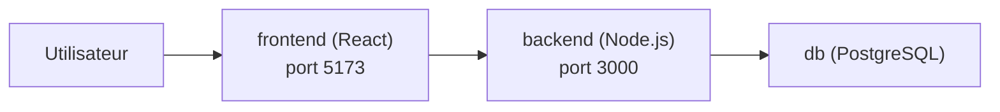
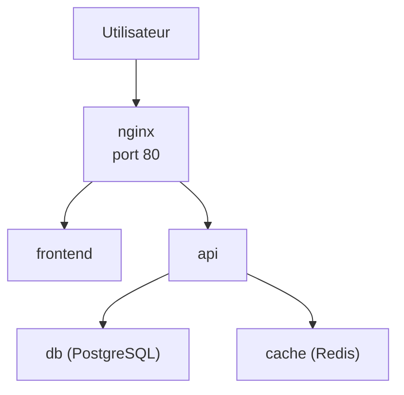

<div class="chapitre-titre-num">CHAPITRE 13 · 🟡 INTERMÉDIAIRE</div>

# Docker Compose

<div class="encadre objectif">
<span class="encadre-titre">🎯 Objectif du chapitre</span>
Passer de commandes `docker run` isolées et répétées manuellement (chapitre 11) à une définition déclarative complète d'une architecture multi-conteneurs avec Docker Compose. Ce chapitre construit deux architectures de A à Z : React + Node.js + PostgreSQL, puis une architecture plus complète React + NestJS + PostgreSQL + Redis + Nginx — les deux directement réutilisables comme squelette de projet réel.
</div>

<div class="encadre scenario">
<span class="encadre-titre">🎬 Mise en situation</span>
Une application réelle n'est presque jamais un seul conteneur : une base de données, une API, un frontend, parfois un cache, parfois un reverse proxy. Lancer et reconfigurer manuellement chaque conteneur avec `docker run`, dans le bon ordre, avec les bonnes options de réseau et de volumes (chapitre 11), devient vite ingérable et impossible à reproduire de façon fiable. Docker Compose résout précisément ce problème : toute l'architecture décrite dans **un seul fichier**, démarrée par **une seule commande**.
</div>

## 13.1 Le fichier `compose.yaml`

```yaml
services:
  api:
    build: ./api
    ports:
      - "3000:3000"
    environment:
      DATABASE_URL: postgres://app:motdepasse@db:5432/app
    depends_on:
      - db

  db:
    image: postgres:16
    environment:
      POSTGRES_USER: app
      POSTGRES_PASSWORD: motdepasse
      POSTGRES_DB: app
    volumes:
      - donnees-db:/var/lib/postgresql/data

volumes:
  donnees-db:
```

**Explication de la structure :** `services` liste chaque conteneur à orchestrer, chacun avec un nom logique (`api`, `db`) qui sert aussi de nom d'hôte réseau (le principe du chapitre 11, section 11.5, automatisé) ; `build: ./api` construit une image à partir d'un Dockerfile local, `image: postgres:16` utilise directement une image existante ; `environment` définit des variables d'environnement (chapitre 5, section 5.6) ; `depends_on` établit un ordre de démarrage ; `volumes` (en bas du fichier) déclare les volumes nommés utilisés par les services.

```bash
docker compose up -d
docker compose ps
```

**Résultat attendu** : les deux conteneurs démarrent, rattachés automatiquement à un réseau créé par Compose, capables de se joindre par leur nom de service (`db` résolu automatiquement depuis `api`) — exactement le résultat du chapitre 11, mais obtenu en une seule commande plutôt que trois commandes manuelles.

<div class="encadre retenir">
<span class="encadre-titre">📌 Commandes Compose essentielles</span>

```bash
docker compose up -d        # démarre tous les services en arrière-plan
docker compose down         # arrête et supprime les conteneurs (garde les volumes)
docker compose down -v      # arrête et supprime aussi les volumes (destructif)
docker compose logs -f api  # suit les logs d'un service précis
docker compose exec api sh  # ouvre un terminal dans le conteneur d'un service
docker compose build        # reconstruit les images sans redémarrer
```
</div>

## 13.2 `depends_on` et `healthcheck` : bien démarrer dans le bon ordre

<div class="encadre attention">
<span class="encadre-titre">⚠️ `depends_on` seul ne garantit qu'un ORDRE de démarrage, pas une DISPONIBILITÉ</span>
Par défaut, <code>depends_on</code> garantit seulement que le conteneur <code>db</code> est <strong>démarré</strong> avant <code>api</code> — pas que PostgreSQL soit réellement <strong>prêt</strong> à accepter des connexions (une base de données met souvent quelques secondes à s'initialiser après le démarrage de son conteneur). Une API qui tente de se connecter trop tôt peut échouer, même avec <code>depends_on</code> correctement configuré.
</div>

```yaml
services:
  api:
    build: ./api
    depends_on:
      db:
        condition: service_healthy

  db:
    image: postgres:16
    environment:
      POSTGRES_PASSWORD: motdepasse
    healthcheck:
      test: ["CMD-SHELL", "pg_isready -U postgres"]
      interval: 5s
      timeout: 3s
      retries: 5
```

**Explication :** `healthcheck` sur le service `db` (même principe que le chapitre 12, section 12.6) vérifie réellement que PostgreSQL répond ; `condition: service_healthy` fait attendre `api` non pas simplement que `db` soit démarré, mais qu'il soit passé à l'état `healthy` — la combinaison exacte qui élimine la classe de bugs "l'API démarre plus vite que la base de données".

## 13.3 Architecture 1 : React + Node.js + PostgreSQL

```yaml
services:
  frontend:
    build: ./frontend
    ports:
      - "5173:80"
    depends_on:
      - backend

  backend:
    build: ./backend
    ports:
      - "3000:3000"
    environment:
      DATABASE_URL: postgres://app:motdepasse@db:5432/app
      NODE_ENV: production
    depends_on:
      db:
        condition: service_healthy

  db:
    image: postgres:16
    environment:
      POSTGRES_USER: app
      POSTGRES_PASSWORD: motdepasse
      POSTGRES_DB: app
    volumes:
      - donnees-db:/var/lib/postgresql/data
    healthcheck:
      test: ["CMD-SHELL", "pg_isready -U app"]
      interval: 5s
      retries: 5

volumes:
  donnees-db:
```



**Test de vérification :**

```bash
docker compose up -d --build
curl http://localhost:3000/health
```

**Résultat attendu** : les trois services démarrent dans le bon ordre (base de données prête avant l'API), l'API répond, et l'interface React est accessible sur `http://localhost:5173`.

## 13.4 Architecture 2 : React + NestJS + PostgreSQL + Redis + Nginx

Cette architecture ajoute un cache (Redis) et un reverse proxy (Nginx, approfondi au chapitre 15) devant l'ensemble, un pattern très proche de ce que verront de vrais projets en production.

```yaml
services:
  nginx:
    image: nginx:1.27-alpine
    ports:
      - "80:80"
    volumes:
      - ./nginx.conf:/etc/nginx/conf.d/default.conf:ro
    depends_on:
      - frontend
      - api

  frontend:
    build: ./frontend

  api:
    build: ./api
    environment:
      DATABASE_URL: postgres://app:motdepasse@db:5432/app
      REDIS_URL: redis://cache:6379
    depends_on:
      db:
        condition: service_healthy
      cache:
        condition: service_healthy

  db:
    image: postgres:16
    environment:
      POSTGRES_USER: app
      POSTGRES_PASSWORD: motdepasse
      POSTGRES_DB: app
    volumes:
      - donnees-db:/var/lib/postgresql/data
    healthcheck:
      test: ["CMD-SHELL", "pg_isready -U app"]
      interval: 5s
      retries: 5

  cache:
    image: redis:7-alpine
    healthcheck:
      test: ["CMD", "redis-cli", "ping"]
      interval: 5s
      retries: 5

volumes:
  donnees-db:
```



**Explication des ajouts :** `nginx` devient le point d'entrée unique (port 80 publié, tous les autres services restent internes au réseau Compose, jamais directement exposés) ; `nginx.conf` (fichier local monté en lecture seule, `:ro`) route les requêtes vers `frontend` ou `api` selon le chemin demandé ; `cache` (Redis) a son propre healthcheck, et `api` attend que **les deux** dépendances (`db` et `cache`) soient réellement prêtes avant de démarrer.

<div class="encadre bonne-pratique">
<span class="encadre-titre">✅ Bonne pratique — seul Nginx est exposé publiquement</span>
Remarque qu'aucun port n'est publié (<code>ports:</code>) pour <code>frontend</code>, <code>api</code>, <code>db</code> ou <code>cache</code> dans cette seconde architecture — seul <code>nginx</code> expose le port 80. Les autres services restent joignables uniquement <strong>depuis l'intérieur</strong> du réseau Compose, jamais directement depuis l'extérieur : une réduction de surface d'attaque significative (approfondie au chapitre 35), qui n'a aucune raison d'exposer une base de données directement sur Internet.
</div>

## 13.5 Fichiers d'environnement multiples

```yaml
services:
  api:
    build: ./api
    env_file:
      - .env
```

```bash
docker compose --env-file .env.production up -d
```

**Explication :** `env_file` charge des variables depuis un fichier externe plutôt que de les lister une à une dans `compose.yaml` — pratique préparant directement le chapitre 18 (gestion des environnements) ; `--env-file` permet de basculer entre plusieurs jeux de variables (développement, staging, production) sans dupliquer le fichier Compose lui-même.

## Atelier — Construire l'architecture 1 de bout en bout

<div class="encadre exercice">
<span class="encadre-titre">🛠️ Atelier 13.1 — De trois Dockerfiles à une architecture orchestrée</span>

**Objectif** : assembler des Dockerfiles du chapitre 12 avec un fichier Compose pour obtenir une architecture complète fonctionnelle.

**Étapes détaillées** :

1. Crée trois dossiers (`frontend`, `backend`, dossier racine) sur ton serveur de laboratoire ou ta machine locale.
2. Place un Dockerfile Node.js simple (chapitre 12) dans `backend`, avec une route `/health` répondant `200 OK`.
3. Place un Dockerfile React (chapitre 12) dans `frontend`.
4. Écris le fichier `compose.yaml` de la section 13.3 à la racine.
5. `docker compose up -d --build`, vérifie `docker compose ps` (tous les services doivent afficher `healthy` ou `running`).
6. Modifie une ligne du backend, relance `docker compose up -d --build` : seul le service modifié doit se reconstruire, grâce au cache (chapitre 12).

**Résultat attendu** : une architecture complète, démarrée et arrêtée en une seule commande, avec une base de données dont les données survivent à un `docker compose down` (sans `-v`).

**Dépannage** : si `api` échoue à se connecter à `db` malgré `depends_on`, vérifie que le `healthcheck` du service `db` est bien défini et que `condition: service_healthy` est utilisé (section 13.2) plutôt qu'un simple `depends_on` sans condition.
</div>

## Erreurs fréquentes

<div class="encadre attention">
<span class="encadre-titre">⚠️ Erreur n°1 — `depends_on` sans `condition: service_healthy`</span>
Rappel de la section 13.2 : sans cette condition, `depends_on` ne garantit qu'un ordre de démarrage, jamais une réelle disponibilité du service dépendant.
</div>

<div class="encadre attention">
<span class="encadre-titre">⚠️ Erreur n°2 — Exposer tous les ports par réflexe</span>
Publier `ports:` sur chaque service (base de données comprise) reproduit, à l'intérieur de Docker Compose, exactement le problème que le pare-feu (chapitre 5) cherche à éviter au niveau du serveur — n'exposer que ce qui doit réellement être joignable depuis l'extérieur (section 13.4).
</div>

<div class="encadre attention">
<span class="encadre-titre">⚠️ Erreur n°3 — `docker compose down -v` exécuté par réflexe</span>
Le `-v` supprime aussi les volumes, donc **toutes les données** — y compris celles d'une base de données de développement qu'on pensait juste "redémarrer". Utiliser `docker compose down` (sans `-v`) sauf intention explicite de tout effacer.
</div>

## En entreprise

**Réalité répandue** : Docker Compose est omniprésent en développement local, y compris dans des équipes qui déploient ensuite sur Kubernetes (Partie XIII) en production — la simplicité de Compose pour reproduire une architecture complète sur la machine d'un développeur n'a pas vraiment d'équivalent aussi léger.

**Bonne pratique répandue** : deux fichiers Compose distincts (ou un fichier de base + un fichier de surcharge `compose.override.yaml`) pour le développement (avec bind mounts pour le rechargement à chaud) et une configuration proche de la production (avec les images construites comme en Partie VIII).

**Erreur classique observée** : un fichier `compose.yaml` unique qui accumule, au fil du temps, des services commentés ou obsolètes jamais nettoyés — un fichier Compose mérite la même hygiène de maintenance que n'importe quel autre fichier de configuration versionné.

## Entretien technique

<div class="encadre exercice">
<span class="encadre-titre">💼 Questions fréquemment posées en entretien</span>

**Q1. "Quelle est la différence entre `depends_on` simple et `depends_on` avec `condition: service_healthy` ?"**
Réponse attendue : le premier garantit seulement un ordre de démarrage des conteneurs ; le second attend que le service dépendant soit réellement prêt (healthcheck positif) avant de démarrer le service suivant (section 13.2).

**Q2. "Pourquoi ne publier que le port de Nginx dans une architecture avec reverse proxy ?"**
Réponse attendue : réduire la surface d'attaque en gardant les autres services (base de données, API interne) accessibles uniquement depuis le réseau interne de Compose, jamais directement depuis Internet (section 13.4).

**Q3. "Que se passe-t-il avec les volumes lors d'un `docker compose down` sans `-v` ?"**
Réponse attendue : les conteneurs sont arrêtés et supprimés, mais les volumes nommés persistent — les données ne sont perdues qu'avec l'option explicite `-v` (section "Erreurs fréquentes", erreur n°3).
</div>

## Optimisation, sécurité et maintenabilité — les réflexes dès ce chapitre

<div class="encadre securite">
<span class="encadre-titre">🔒 Sécurité</span>
N'écris jamais de secret réel directement dans `compose.yaml` versionné — utilise `env_file` avec un fichier `.env` **non versionné** (chapitre 25 approfondit cette pratique, déjà appliquée ici par anticipation).
</div>

<div class="encadre bonne-pratique">
<span class="encadre-titre">✅ Maintenabilité</span>
Nomme tes services de façon claire et cohérente (`api`, `db`, `cache`, jamais `service1`/`service2`) — ces noms deviennent aussi les noms d'hôte réseau utilisés partout dans le code applicatif, une convention qui mérite d'être stable dans le temps.
</div>

<div class="encadre performance">
<span class="encadre-titre">🚀 Performance</span>
`docker compose build` (sans `up`) permet de reconstruire les images sans redémarrer les services déjà en cours — utile pour valider qu'un Dockerfile modifié construit correctement avant de perturber un environnement de développement déjà en marche.
</div>

## Résumé du chapitre

- Docker Compose décrit une architecture multi-conteneurs complète dans un seul fichier `compose.yaml`, démarrée par une seule commande.
- Les services se joignent automatiquement par leur nom, sur un réseau créé automatiquement par Compose.
- `depends_on` avec `condition: service_healthy` garantit une réelle disponibilité, pas seulement un ordre de démarrage.
- Deux architectures complètes ont été construites : React+Node+PostgreSQL, puis React+NestJS+PostgreSQL+Redis+Nginx.
- Dans une architecture avec reverse proxy, seul Nginx devrait être exposé publiquement.
- `docker compose down -v` supprime aussi les volumes — à utiliser uniquement avec une intention explicite de tout effacer.

## Quiz

<div class="encadre exercice">
<span class="encadre-titre">📝 QCM (une seule bonne réponse par question)</span>

1. Dans Docker Compose, deux services peuvent se joindre entre eux :
   - a) Uniquement via leur adresse IP interne
   - b) Directement par leur nom de service, résolu automatiquement
   - c) Uniquement s'ils publient un port
   - d) Jamais, chaque service est totalement isolé

2. `depends_on` avec `condition: service_healthy` attend que le service dépendant :
   - a) Soit simplement démarré
   - b) Passe positivement son healthcheck
   - c) Soit reconstruit
   - d) Soit supprimé

3. `docker compose down -v` :
   - a) Arrête les conteneurs sans toucher aux volumes
   - b) Arrête les conteneurs et supprime aussi les volumes
   - c) Ne fait rien de plus que `docker compose down`
   - d) Reconstruit toutes les images

**Corrigé** : 1-b, 2-b, 3-b.
</div>

<div class="encadre exercice">
<span class="encadre-titre">📝 Vrai ou Faux</span>

1. Tous les services d'un fichier Compose doivent obligatoirement publier un port. — **Faux** (section 13.4).
2. `env_file` permet de charger des variables d'environnement depuis un fichier externe plutôt que de les écrire directement dans `compose.yaml`. — **Vrai**.
3. `depends_on` sans condition garantit qu'un service dépendant est totalement prêt à recevoir des requêtes. — **Faux** (section 13.2).

</div>

## Exercices

<div class="encadre exercice">
<span class="encadre-titre">📝 Exercice 13.1</span>

Ajoute un healthcheck au service `api` de l'architecture de la section 13.3, vérifiant `http://localhost:3000/health`, puis fais dépendre `frontend` de `api` avec `condition: service_healthy`.
</div>

**Corrigé :**
```yaml
services:
  frontend:
    build: ./frontend
    depends_on:
      backend:
        condition: service_healthy

  backend:
    build: ./backend
    environment:
      DATABASE_URL: postgres://app:motdepasse@db:5432/app
    depends_on:
      db:
        condition: service_healthy
    healthcheck:
      test: ["CMD", "curl", "-f", "http://localhost:3000/health"]
      interval: 10s
      timeout: 3s
      retries: 3
```

## Checklist de fin de chapitre

<ul class="checklist">
<li>☐ Je sais écrire un `compose.yaml` avec plusieurs services, volumes et variables d'environnement.</li>
<li>☐ Je comprends la différence entre `depends_on` simple et `depends_on` avec `condition: service_healthy`.</li>
<li>☐ J'ai construit une architecture React+Node+PostgreSQL fonctionnelle.</li>
<li>☐ J'ai construit une architecture avec reverse proxy (Nginx) où seul ce dernier est exposé publiquement.</li>
<li>☐ Je sais utiliser `env_file` pour séparer la configuration du fichier Compose lui-même.</li>
<li>☐ Je connais la différence entre `docker compose down` et `docker compose down -v`.</li>
</ul>

## FAQ

<dl class="faq">
<dt>`docker-compose` (avec tiret) et `docker compose` (sans tiret), quelle différence ?</dt>
<dd>`docker-compose` est l'ancien outil autonome en Python, aujourd'hui obsolète. `docker compose` (le plugin intégré, installé au chapitre 3) est la version actuelle recommandée, réécrite en Go et intégrée directement à Docker. Ce manuel utilise systématiquement la seconde forme.</dd>

<dt>Peut-on utiliser Docker Compose en production ?</dt>
<dd>Oui, pour des déploiements de taille modeste sur un seul serveur (approfondi au chapitre 26) — c'est même une approche tout à fait raisonnable et largement utilisée. Au-delà d'un seul serveur ou pour une haute disponibilité poussée, Kubernetes (Partie XIII) devient plus adapté.</dd>

<dt>Comment gérer plusieurs environnements (dev/staging/prod) avec Compose ?</dt>
<dd>Soit avec plusieurs fichiers `--env-file` (section 13.5), soit avec plusieurs fichiers Compose combinés (`-f compose.yaml -f compose.prod.yaml`) qui se surchargent l'un l'autre — approfondi au chapitre 18.</dd>
</dl>

## Références et pour aller plus loin

- Documentation officielle Docker Compose : [https://docs.docker.com/compose/](https://docs.docker.com/compose/)
- Référence complète du format `compose.yaml` : [https://docs.docker.com/reference/compose-file/](https://docs.docker.com/reference/compose-file/)

*Chapitre suivant : les registries — Docker Hub, registre privé, tags, versions, push et pull, pour distribuer les images construites dans ce chapitre.*
