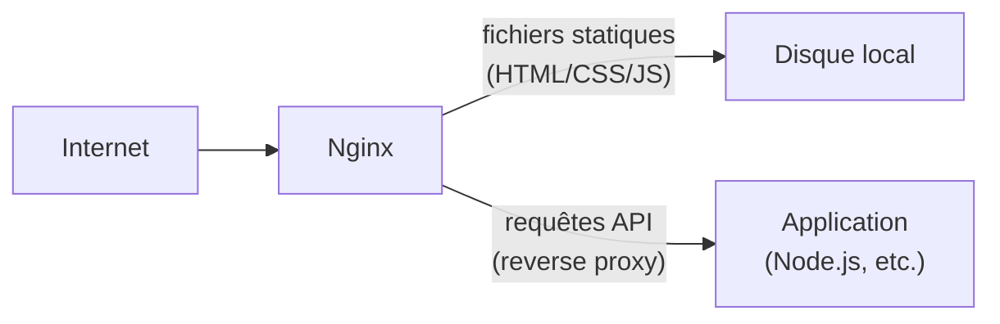
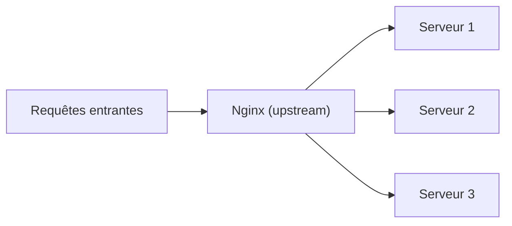

<div class="chapitre-titre-num">CHAPITRE 15 · 🟡 INTERMÉDIAIRE</div>

# Nginx

<div class="encadre objectif">
<span class="encadre-titre">🎯 Objectif du chapitre</span>
Comprendre ce qu'est un serveur web et un reverse proxy, installer et configurer Nginx pour servir des fichiers statiques, router des requêtes vers une application, répartir la charge entre plusieurs instances, compresser les réponses et gérer le cache. Ce chapitre ouvre la Partie VI : Nginx devient, à partir de maintenant, le point d'entrée unique de toutes les architectures construites dans ce manuel — exactement le rôle qu'il jouait déjà, sans être expliqué, dans l'architecture Docker Compose du chapitre 13.
</div>

<div class="encadre scenario">
<span class="encadre-titre">🎬 Mise en situation</span>
Une application Node.js peut, techniquement, écouter directement sur le port 80 et répondre aux visiteurs. Mais en pratique, presque aucune application de production ne fait cela directement : un serveur comme Nginx s'intercale toujours devant, pour des raisons de performance, de sécurité et de flexibilité que ce chapitre détaille. C'est exactement le rôle que jouait déjà `nginx` dans l'architecture du chapitre 13 — ce chapitre explique enfin ce qu'il fait précisément, et comment le configurer soi-même.
</div>

## 15.1 Serveur web et reverse proxy : deux rôles différents

<div class="encadre retenir">
<span class="encadre-titre">📌 Deux rôles que Nginx peut jouer</span>
En tant que <strong>serveur web</strong>, Nginx sert directement des fichiers statiques (HTML, CSS, JS, images) depuis le disque — extrêmement rapide, sans jamais passer par un langage de programmation. En tant que <strong>reverse proxy</strong>, Nginx reçoit une requête et la transmet à une autre application (une API Node.js, par exemple) qui, elle, génère la réponse — Nginx agissant comme un intermédiaire, pas comme la source de la réponse.
</div>



## 15.2 Installation et premier fichier de configuration

```bash
# Sur le serveur de laboratoire
sudo apt update
sudo apt install -y nginx
sudo systemctl status nginx
```

**Résultat attendu** : Nginx démarre automatiquement après installation (`active (running)`, chapitre 4), et `curl http://localhost` (depuis le serveur lui-même) affiche la page d'accueil par défaut.

**Structure des fichiers de configuration Nginx :**

```text
/etc/nginx/
├── nginx.conf              # configuration globale
├── sites-available/        # configurations de sites disponibles
│   └── mon-site.conf
└── sites-enabled/          # liens symboliques vers les sites ACTIFS
    └── mon-site.conf -> ../sites-available/mon-site.conf
```

<div class="encadre astuce">
<span class="encadre-titre">💡 Pourquoi `sites-available` ET `sites-enabled`</span>
Cette séparation permet de préparer une configuration dans <code>sites-available</code> sans qu'elle soit active, puis de l'activer explicitement en créant un lien symbolique dans <code>sites-enabled</code> — et de la désactiver tout aussi facilement en supprimant simplement ce lien, sans jamais perdre le fichier de configuration original.
</div>

## 15.3 Servir des fichiers statiques

```nginx
server {
    listen 80;
    server_name monsite.exemple.com;

    root /var/www/monsite;
    index index.html;

    location / {
        try_files $uri $uri/ =404;
    }
}
```

**Explication ligne par ligne :** `listen 80` écoute les requêtes HTTP sur le port 80 ; `server_name` définit le nom de domaine géré par ce bloc (chapitre 17) ; `root` pointe vers le dossier contenant les fichiers à servir ; `location /` définit comment traiter les requêtes vers ce chemin ; `try_files $uri $uri/ =404` cherche d'abord le fichier exact demandé, puis un dossier du même nom (avec son `index.html`), puis retourne une erreur 404 si rien n'est trouvé.

```bash
sudo ln -s /etc/nginx/sites-available/mon-site.conf /etc/nginx/sites-enabled/
sudo nginx -t
sudo systemctl reload nginx
```

**Explication :** `ln -s` crée le lien symbolique qui active le site (section 15.2) ; `nginx -t` **teste** la validité de la configuration **sans l'appliquer** — un réflexe à prendre systématiquement avant tout rechargement ; `systemctl reload` (plutôt que `restart`) recharge la configuration sans interrompre les connexions déjà en cours, un redémarrage "à chaud".

<div class="encadre bonne-pratique">
<span class="encadre-titre">✅ Bonne pratique — toujours `nginx -t` avant `reload`</span>
Une erreur de syntaxe dans un fichier de configuration Nginx, si elle n'est pas détectée avant le rechargement, peut empêcher Nginx de redémarrer correctement — potentiellement une interruption totale de service. `nginx -t` détecte ces erreurs **avant** qu'elles n'affectent le serveur en production, un réflexe aussi important que la vérification SSH du chapitre 6 avant redémarrage.
</div>

## 15.4 Reverse proxy vers une application

```nginx
server {
    listen 80;
    server_name api.exemple.com;

    location / {
        proxy_pass http://localhost:3000;
        proxy_set_header Host $host;
        proxy_set_header X-Real-IP $remote_addr;
        proxy_set_header X-Forwarded-For $proxy_add_x_forwarded_for;
        proxy_set_header X-Forwarded-Proto $scheme;
    }
}
```

**Explication :** `proxy_pass` transmet la requête à l'application qui écoute sur le port 3000 (par exemple un conteneur Docker, chapitre 11, avec son port publié localement) ; les quatre en-têtes `proxy_set_header` transmettent à l'application des informations qu'elle perdrait sinon (l'adresse IP réelle du visiteur, le nom de domaine d'origine, si la requête initiale était en HTTPS) — sans eux, l'application "verrait" toujours Nginx comme client, jamais le vrai visiteur.

<div class="encadre attention">
<span class="encadre-titre">⚠️ Erreur fréquente : oublier `X-Forwarded-For`</span>
Sans <code>proxy_set_header X-Forwarded-For</code>, une application derrière Nginx enregistre systématiquement l'adresse IP <strong>de Nginx lui-même</strong> (127.0.0.1 ou l'IP interne) dans ses journaux d'activité, jamais la vraie adresse IP du visiteur — un problème pour tout système de limitation de débit, de journalisation de sécurité ou de géolocalisation basé sur l'IP.
</div>

## 15.5 Compression et fichiers statiques mis en cache

```nginx
gzip on;
gzip_types text/plain text/css application/json application/javascript text/xml application/xml;
gzip_min_length 1024;

location /static/ {
    root /var/www/monsite;
    expires 30d;
    add_header Cache-Control "public, immutable";
}
```

**Explication :** `gzip on` compresse les réponses avant de les envoyer, réduisant la bande passante utilisée (particulièrement utile sur une connexion réseau plus lente, un contexte pertinent en Haïti) ; `gzip_min_length` évite de compresser des réponses trop petites où la compression n'apporte aucun bénéfice réel ; `expires 30d` + `Cache-Control` indiquent au navigateur de garder ces fichiers en cache local pendant 30 jours, évitant de les retélécharger à chaque visite — typiquement utilisé sur des fichiers versionnés (contenant un hash dans leur nom, qui change automatiquement à chaque nouvelle version).

## 15.6 Répartition de charge (load balancing)

```nginx
upstream mon_api_backend {
    server 10.0.0.11:3000;
    server 10.0.0.12:3000;
    server 10.0.0.13:3000;
}

server {
    listen 80;
    server_name api.exemple.com;

    location / {
        proxy_pass http://mon_api_backend;
    }
}
```

**Explication :** un bloc `upstream` définit un groupe de serveurs backend identiques ; par défaut, Nginx répartit les requêtes entre eux selon l'algorithme **round-robin** (chacun à son tour) — la base du concept de scalabilité horizontale, approfondi au chapitre 48.



<div class="encadre astuce">
<span class="encadre-titre">💡 D'autres stratégies de répartition existent</span>
<code>least_conn</code> (envoie vers le serveur avec le moins de connexions actives) et <code>ip_hash</code> (un même visiteur est toujours dirigé vers le même serveur, utile si l'application garde un état en mémoire locale) sont deux alternatives courantes au round-robin par défaut, à ajouter dans le bloc <code>upstream</code> selon le besoin réel de l'application.
</div>

## Atelier — Nginx devant l'architecture du chapitre 13

<div class="encadre exercice">
<span class="encadre-titre">🛠️ Atelier 15.1 — Reverse proxy réel devant une application conteneurisée</span>

**Objectif** : remplacer la configuration Nginx minimale du chapitre 13 par une version complète et commentée, avec compression et en-têtes corrects.

**Étapes détaillées** :

1. Sur ton serveur de laboratoire (hors Docker, cette fois, en installation native), installe Nginx (section 15.2).
2. Lance un petit serveur Node.js de test sur le port 3000 (`node -e "require('http').createServer((req,res)=>res.end('Bonjour')).listen(3000)"`, ou une application plus complète si tu en as une sous la main).
3. Écris une configuration Nginx en reverse proxy vers ce port, avec les quatre en-têtes `proxy_set_header` de la section 15.4.
4. Active le site, teste avec `nginx -t` avant de recharger.
5. Depuis ta machine locale, accède au serveur par son IP (`curl http://ip_du_laboratoire`) : la réponse doit venir de l'application Node.js, via Nginx, sans jamais exposer directement le port 3000 à l'extérieur (pare-feu du chapitre 5, qui n'autorise que 80/443).

**Résultat attendu** : Nginx sert de point d'entrée unique, transmettant correctement la requête à l'application tout en préservant l'information de la requête originale (IP réelle, hôte, protocole).
</div>

## Erreurs fréquentes

<div class="encadre attention">
<span class="encadre-titre">⚠️ Erreur n°1 — Recharger Nginx sans avoir testé la configuration</span>
Rappel de la section 15.3 : `nginx -t` avant `systemctl reload`, systématiquement — une simple faute de frappe dans un fichier de configuration peut interrompre le service.
</div>

<div class="encadre attention">
<span class="encadre-titre">⚠️ Erreur n°2 — Oublier les en-têtes `proxy_set_header`</span>
Sans eux (section 15.4), l'application derrière Nginx perd des informations essentielles sur la requête d'origine — un piège qui ne se manifeste souvent qu'au moment où on cherche à diagnostiquer un problème de sécurité ou de journalisation basé sur l'IP réelle du visiteur.
</div>

<div class="encadre attention">
<span class="encadre-titre">⚠️ Erreur n°3 — Exposer directement le port de l'application, en plus de Nginx</span>
Si le pare-feu (chapitre 5) autorise aussi le port 3000 en plus du 80/443, un visiteur peut contourner totalement Nginx (et donc ses en-têtes, sa compression, son éventuel cache) en s'adressant directement à l'application. Le port de l'application ne devrait jamais être accessible depuis l'extérieur, uniquement en local sur le serveur.
</div>

## En entreprise

**Réalité répandue** : Nginx (et son concurrent direct, Caddy, plus simple à configurer pour HTTPS automatique) reste l'un des logiciels les plus déployés au monde devant des applications web, toutes tailles d'organisation confondues.

**Bonne pratique répandue** : les configurations Nginx de production sont versionnées dans Git (chapitre 7) au même titre que le code applicatif, souvent déployées automatiquement par le même pipeline CI/CD (Partie VII) plutôt qu'éditées manuellement sur le serveur.

**Erreur classique observée** : des fichiers de configuration Nginx modifiés directement en production, jamais reportés dans le dépôt versionné, créant une divergence invisible entre ce qui est documenté et ce qui tourne réellement — un exemple concret d'Infrastructure as Code non respectée (Partie XII).

## Entretien technique

<div class="encadre exercice">
<span class="encadre-titre">💼 Questions fréquemment posées en entretien</span>

**Q1. "Quelle est la différence entre Nginx en tant que serveur web et en tant que reverse proxy ?"**
Réponse attendue : serveur web, il sert directement des fichiers statiques depuis le disque ; reverse proxy, il transmet la requête à une autre application qui génère la réponse (section 15.1).

**Q2. "Pourquoi ajouter `X-Forwarded-For` dans une configuration de reverse proxy ?"**
Réponse attendue : sans cet en-tête, l'application derrière Nginx voit toujours l'adresse IP de Nginx lui-même plutôt que celle du visiteur réel, cassant tout mécanisme de sécurité ou de journalisation basé sur l'IP (section 15.4).

**Q3. "Comment Nginx répartit-il la charge entre plusieurs serveurs par défaut ?"**
Réponse attendue : round-robin (chacun à son tour), avec des alternatives disponibles comme `least_conn` ou `ip_hash` selon le besoin (section 15.6).
</div>

## Optimisation, sécurité et maintenabilité — les réflexes dès ce chapitre

<div class="encadre securite">
<span class="encadre-titre">🔒 Sécurité</span>
N'expose jamais directement le port d'une application derrière Nginx (section "Erreurs fréquentes", erreur n°3) — seul Nginx devrait être joignable depuis l'extérieur, même principe déjà appliqué avec Docker Compose au chapitre 13.
</div>

<div class="encadre bonne-pratique">
<span class="encadre-titre">✅ Maintenabilité</span>
Un fichier de configuration par site (dans `sites-available`), jamais tout entassé dans `nginx.conf` — la structure du chapitre 15.2 facilite l'ajout, la désactivation ou la suppression d'un site sans risque pour les autres.
</div>

<div class="encadre performance">
<span class="encadre-titre">🚀 Performance</span>
`gzip` et le cache navigateur (section 15.5) réduisent significativement la bande passante consommée et le temps de chargement perçu — un gain particulièrement notable sur des connexions réseau plus lentes ou instables.
</div>

## Résumé du chapitre

- Nginx joue deux rôles distincts : serveur web (fichiers statiques) et reverse proxy (transmission vers une application).
- `sites-available`/`sites-enabled` permettent d'activer ou désactiver un site sans perdre sa configuration.
- `nginx -t` avant tout `reload` est un réflexe non négociable.
- Un reverse proxy correctement configuré transmet les vraies informations de la requête via `proxy_set_header`.
- `gzip` et le cache navigateur améliorent significativement les performances perçues.
- Un bloc `upstream` répartit la charge entre plusieurs serveurs backend, par défaut en round-robin.

## Quiz

<div class="encadre exercice">
<span class="encadre-titre">📝 QCM (une seule bonne réponse par question)</span>

1. `nginx -t` sert à :
   - a) Redémarrer Nginx immédiatement
   - b) Tester la validité de la configuration sans l'appliquer
   - c) Supprimer un site actif
   - d) Afficher les logs en temps réel

2. Sans `proxy_set_header X-Forwarded-For`, l'application derrière Nginx voit :
   - a) L'adresse IP réelle du visiteur
   - b) L'adresse IP de Nginx lui-même, pas celle du visiteur
   - c) Aucune adresse IP
   - d) Une erreur systématique

3. Par défaut, un bloc `upstream` Nginx répartit les requêtes selon :
   - a) L'ordre alphabétique des serveurs
   - b) Le round-robin (chacun à son tour)
   - c) La date de dernière requête
   - d) Un tirage totalement aléatoire

**Corrigé** : 1-b, 2-b, 3-b.
</div>

<div class="encadre exercice">
<span class="encadre-titre">📝 Vrai ou Faux</span>

1. `systemctl reload` interrompt les connexions en cours, contrairement à `restart`. — **Faux** (c'est l'inverse : `reload` recharge à chaud sans interruption, section 15.3).
2. Un fichier dans `sites-available` est actif dès sa création, sans étape supplémentaire. — **Faux** (il faut un lien symbolique dans `sites-enabled`, section 15.2).
3. Exposer directement le port d'une application, en plus de Nginx, permet de contourner le reverse proxy. — **Vrai** (section "Erreurs fréquentes", erreur n°3).

</div>

## Exercices

<div class="encadre exercice">
<span class="encadre-titre">📝 Exercice 15.1</span>

Écris un bloc `location` Nginx qui sert les fichiers statiques d'un dossier `/var/www/monsite/static/` sous le chemin `/static/`, avec un cache navigateur de 7 jours.
</div>

**Corrigé :**
```nginx
location /static/ {
    alias /var/www/monsite/static/;
    expires 7d;
    add_header Cache-Control "public";
}
```
Note : `alias` (plutôt que `root`) est utilisé ici car le chemin d'URL (`/static/`) et le chemin disque ne partagent pas la même structure finale — `alias` remplace exactement le préfixe de chemin par le chemin disque indiqué, contrairement à `root` qui le concatène.

## Checklist de fin de chapitre

<ul class="checklist">
<li>☐ Je comprends la différence entre Nginx serveur web et reverse proxy.</li>
<li>☐ Je sais créer, activer et tester un fichier de configuration de site.</li>
<li>☐ Je sais configurer un reverse proxy avec les en-têtes `proxy_set_header` corrects.</li>
<li>☐ Je sais activer la compression gzip et le cache navigateur sur des fichiers statiques.</li>
<li>☐ Je sais configurer un bloc `upstream` pour répartir la charge entre plusieurs serveurs.</li>
<li>☐ Je m'assure qu'aucun port d'application n'est exposé directement en plus de Nginx.</li>
</ul>

## FAQ

<dl class="faq">
<dt>Nginx ou Apache : lequel choisir ?</dt>
<dd>Les deux restent largement utilisés. Nginx, conçu dès le départ pour gérer un très grand nombre de connexions simultanées avec peu de ressources, domine largement les nouveaux déploiements et les cas d'usage reverse proxy — le choix de ce manuel, cohérent avec l'écosystème Docker/conteneurs.</dd>

<dt>Nginx peut-il gérer HTTPS directement ?</dt>
<dd>Oui, entièrement — le chapitre 16 couvre cette configuration en détail, une extension naturelle de ce chapitre.</dd>

<dt>Faut-il connaître toutes les directives Nginx par cœur ?</dt>
<dd>Non. Les quelques directives de ce chapitre (`listen`, `server_name`, `root`, `location`, `proxy_pass`, `proxy_set_header`, `upstream`) couvrent l'immense majorité des cas d'usage réels — la documentation officielle reste la référence pour tout besoin plus spécifique.</dd>
</dl>

## Références et pour aller plus loin

- Documentation officielle Nginx : [https://nginx.org/en/docs/](https://nginx.org/en/docs/)
- DigitalOcean — "Understanding Nginx Server and Location Block Selection Algorithms" (comprendre l'ordre de priorité des blocs) : [https://www.digitalocean.com/community/tutorials/understanding-nginx-server-and-location-block-selection-algorithms](https://www.digitalocean.com/community/tutorials/understanding-nginx-server-and-location-block-selection-algorithms)

*Chapitre suivant : HTTPS et TLS — comprendre le chiffrement, obtenir un certificat gratuit avec Let's Encrypt, et sécuriser complètement l'application exposée par Nginx dans ce chapitre.*
