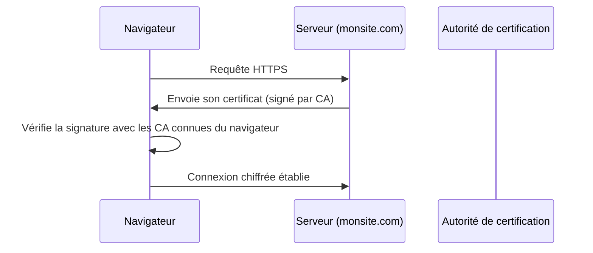

<div class="chapitre-titre-num">CHAPITRE 16 · 🟡 INTERMÉDIAIRE</div>

# HTTPS et TLS

<div class="encadre objectif">
<span class="encadre-titre">🎯 Objectif du chapitre</span>
Comprendre ce que HTTPS protège réellement (et ce qu'il ne protège pas), comment fonctionne un certificat TLS, et mettre en place HTTPS gratuitement et automatiquement avec Let's Encrypt et Certbot sur l'application Nginx du chapitre 15. À la fin de ce chapitre, ton serveur de laboratoire (avec un vrai nom de domaine, voir chapitre 17 pour le DNS) sert du HTTPS valide, avec renouvellement automatique.
</div>

<div class="encadre scenario">
<span class="encadre-titre">🎬 Mise en situation</span>
Un cadenas dans la barre d'adresse du navigateur est devenu si banal qu'on ne le remarque presque plus — jusqu'au jour où il manque, et où le navigateur affiche un avertissement rouge "Connexion non sécurisée" qui fait fuir la quasi-totalité des visiteurs. Ce chapitre explique ce que ce cadenas garantit réellement, pourquoi il est aujourd'hui non négociable pour toute application exposée sur Internet, et comment l'obtenir gratuitement en quelques commandes.
</div>

## 16.1 HTTP, HTTPS, TLS : ce que chaque terme désigne précisément

<div class="encadre retenir">
<span class="encadre-titre">📌 Vocabulaire précis</span>
<strong>HTTP</strong> est le protocole de communication entre navigateur et serveur, en clair — n'importe qui interceptant le trafic réseau peut lire (et modifier) tout ce qui transite. <strong>TLS</strong> (<em>Transport Layer Security</em>, successeur de l'ancien SSL) est le protocole de chiffrement qui protège cette communication. <strong>HTTPS</strong> est simplement HTTP transporté à travers une connexion chiffrée par TLS — pas un protocole différent, une version protégée du même protocole.
</div>

<div class="encadre attention">
<span class="encadre-titre">⚠️ Ce que HTTPS protège, et ce qu'il ne protège PAS</span>
HTTPS garantit trois choses : la <strong>confidentialité</strong> (personne ne peut lire le contenu échangé en interceptant le trafic), l'<strong>intégrité</strong> (personne ne peut modifier les données en transit sans que ce soit détecté), et l'<strong>authentification du serveur</strong> (le navigateur vérifie qu'il parle bien au vrai serveur, pas à un imposteur). HTTPS ne protège <strong>pas</strong> contre une faille dans l'application elle-même (une injection SQL reste possible en HTTPS), ni contre un serveur compromis qui enverrait volontairement des données falsifiées — HTTPS sécurise le <strong>transport</strong>, pas le contenu ni l'application.
</div>

## 16.2 Le certificat : la carte d'identité vérifiée du serveur

Un certificat TLS lie une clé publique (chapitre 6, même principe cryptographique que SSH) à un nom de domaine précis, signé par une **autorité de certification** (*Certificate Authority*, CA) reconnue par les navigateurs.



<div class="encadre astuce">
<span class="encadre-titre">💡 Analogie — le certificat comme une pièce d'identité</span>
Un certificat TLS ressemble à une pièce d'identité officielle : elle affirme "je suis bien monsite.com", et cette affirmation n'a de valeur que parce qu'elle est délivrée et signée par une autorité de confiance reconnue (l'équivalent d'un état civil), pas parce que le site l'affirme lui-même. Un certificat auto-signé (sans autorité reconnue) revient à se présenter avec une carte d'identité que l'on a soi-même imprimée — techniquement une "pièce d'identité", mais que personne d'autre n'a de raison de croire.
</div>

## 16.3 Let's Encrypt et Certbot : HTTPS gratuit et automatisé

**Let's Encrypt** est une autorité de certification gratuite et automatisée, largement responsable de la généralisation de HTTPS sur le web depuis 2016 (auparavant, un certificat coûtait souvent plusieurs dizaines à centaines de dollars par an).

```bash
sudo apt install -y certbot python3-certbot-nginx
sudo certbot --nginx -d monsite.exemple.com
```

**Explication :** `python3-certbot-nginx` est un plugin qui configure **automatiquement** Nginx une fois le certificat obtenu (ajout des directives `ssl_certificate`, redirection HTTP→HTTPS) — pas besoin d'éditer manuellement la configuration Nginx après coup ; `-d` précise le nom de domaine concerné (qui doit déjà pointer vers ce serveur, chapitre 17, avant de lancer cette commande).

**Résultat attendu** : après quelques questions (email de contact, acceptation des conditions), Certbot obtient le certificat et modifie automatiquement la configuration Nginx du chapitre 15 :

```nginx
server {
    listen 443 ssl;
    server_name monsite.exemple.com;

    ssl_certificate /etc/letsencrypt/live/monsite.exemple.com/fullchain.pem;
    ssl_certificate_key /etc/letsencrypt/live/monsite.exemple.com/privkey.pem;

    root /var/www/monsite;
    index index.html;
}

server {
    listen 80;
    server_name monsite.exemple.com;
    return 301 https://$host$request_uri;
}
```

**Explication de l'ajout :** le premier bloc `server` écoute désormais sur le port 443 (HTTPS) avec le certificat obtenu ; le second bloc, sur le port 80 (HTTP), ne sert plus qu'à **rediriger** systématiquement (`return 301`, redirection permanente) vers la version HTTPS — aucune requête HTTP en clair n'est plus jamais traitée directement.

## 16.4 Renouvellement automatique

<div class="encadre attention">
<span class="encadre-titre">⚠️ Un certificat Let's Encrypt expire tous les 90 jours</span>
Contrairement à un certificat payant traditionnel (souvent valable 1 an), un certificat Let's Encrypt n'est valable que 90 jours — un choix délibéré des concepteurs pour encourager l'automatisation du renouvellement plutôt que sa gestion manuelle, réduisant le risque d'un certificat oublié et expiré (chapitre 46, un scénario de panne très fréquent).
</div>

```bash
sudo certbot renew --dry-run
```

**Explication :** `--dry-run` simule un renouvellement sans réellement le faire — une vérification que tout fonctionnerait correctement le jour venu, sans consommer de tentative réelle auprès de Let's Encrypt (qui limite le nombre de délivrances par domaine sur une période donnée).

Certbot installe **automatiquement** une tâche planifiée (systemd timer, l'équivalent moderne de cron pour ce cas précis) qui tente un renouvellement deux fois par jour, ne renouvelant réellement que lorsque le certificat approche de son expiration (typiquement dans les 30 derniers jours) :

```bash
sudo systemctl list-timers | grep certbot
```

**Résultat attendu** : une entrée `certbot.timer` active, confirmant que le renouvellement automatique est bien programmé — aucune tâche cron manuelle à écrire, contrairement au chapitre 5.

## 16.5 En-têtes de sécurité complémentaires

```nginx
add_header Strict-Transport-Security "max-age=31536000; includeSubDomains" always;
add_header X-Content-Type-Options "nosniff" always;
add_header X-Frame-Options "SAMEORIGIN" always;
```

**Explication :** `Strict-Transport-Security` (HSTS) indique au navigateur de **toujours** utiliser HTTPS pour ce domaine pendant la durée indiquée (`max-age` en secondes, ici un an), même si l'utilisateur tape explicitement `http://` — une protection contre une éventuelle interception qui tenterait de forcer une connexion non chiffrée ; `X-Content-Type-Options: nosniff` empêche le navigateur de deviner un type de fichier différent de celui déclaré ; `X-Frame-Options: SAMEORIGIN` empêche le site d'être intégré dans un `<iframe>` sur un autre domaine, une protection contre le *clickjacking*. Ces en-têtes complémentaires sont approfondis dans une perspective de sécurité plus large au chapitre 35.

## Atelier — HTTPS complet sur ton laboratoire

<div class="encadre exercice">
<span class="encadre-titre">🛠️ Atelier 16.1 — De HTTP à HTTPS avec redirection et renouvellement vérifié</span>

**Objectif** : appliquer HTTPS de bout en bout sur ton serveur de laboratoire, avec un vrai nom de domaine.

**Prérequis** : un nom de domaine (même un sous-domaine gratuit) pointant vers l'IP publique de ton serveur de laboratoire — si tu utilises l'option B du chapitre 3 (VM locale sans IP publique), cet atelier nécessite de basculer temporairement vers l'option A (VPS réel), comme anticipé au chapitre 3.

**Étapes détaillées** :

1. Vérifie que le domaine pointe bien vers ton serveur (`ping ton-domaine.com`, ou attends la propagation DNS du chapitre 17).
2. Installe Certbot et son plugin Nginx (section 16.3).
3. Lance `certbot --nginx -d ton-domaine.com`, observe la configuration Nginx automatiquement modifiée.
4. Vérifie dans un navigateur que `http://ton-domaine.com` redirige bien vers `https://ton-domaine.com`, avec un cadenas valide.
5. Ajoute les en-têtes de sécurité de la section 16.5, `nginx -t`, `systemctl reload nginx` (chapitre 15).
6. Vérifie le renouvellement automatique avec `certbot renew --dry-run`.

**Résultat attendu** : un site en HTTPS valide, avec redirection automatique depuis HTTP, en-têtes de sécurité actifs, et renouvellement automatique confirmé.
</div>

## Erreurs fréquentes

<div class="encadre attention">
<span class="encadre-titre">⚠️ Erreur n°1 — Lancer Certbot avant que le DNS ne pointe vers le serveur</span>
Let's Encrypt vérifie, avant de délivrer un certificat, que le domaine pointe réellement vers le serveur qui fait la demande (via une requête HTTP de vérification) — lancer Certbot avant la propagation DNS complète (chapitre 17) échoue systématiquement.
</div>

<div class="encadre attention">
<span class="encadre-titre">⚠️ Erreur n°2 — Oublier la redirection HTTP → HTTPS</span>
Sans le second bloc `server` de la section 16.3, le site reste accessible en HTTP non chiffré en parallèle de HTTPS — une configuration incomplète qui laisse le choix à l'utilisateur (ou à un lien mal construit ailleurs) de rester sur la version non sécurisée.
</div>

<div class="encadre attention">
<span class="encadre-titre">⚠️ Erreur n°3 — Ignorer les limites de taux de Let's Encrypt</span>
Let's Encrypt limite le nombre de certificats délivrés par domaine sur une période donnée (typiquement 5 par semaine pour un même ensemble de noms) — de nombreux essais/erreurs rapprochés en phase de test peuvent atteindre cette limite ; utiliser `--dry-run` ou l'environnement de test de Let's Encrypt pour les essais répétés, réservant les tentatives réelles aux configurations déjà vérifiées.
</div>

## En entreprise

**Réalité répandue** : HTTPS est aujourd'hui la norme absolue — les navigateurs modernes signalent activement tout site en HTTP seul comme "non sécurisé", et de nombreuses fonctionnalités web modernes (géolocalisation, notifications push) sont techniquement indisponibles hors HTTPS.

**Bonne pratique répandue** : dans les architectures avec load balancer cloud (chapitre 40) ou Kubernetes (Partie XIII), le certificat TLS est souvent géré au niveau de ce composant frontal plutôt que directement sur chaque serveur applicatif — un pattern appelé "TLS termination", où Nginx (ou son équivalent) déchiffre le trafic entrant puis communique en clair avec les services internes, protégés par ailleurs par l'isolation réseau (chapitre 13).

**Erreur classique observée** : des certificats expirés en production faute de renouvellement automatique correctement configuré ou testé — l'une des causes de panne les plus "bêtes" mais les plus fréquentes en production, entièrement évitable avec le `--dry-run` de la section 16.4.

## Entretien technique

<div class="encadre exercice">
<span class="encadre-titre">💼 Questions fréquemment posées en entretien</span>

**Q1. "Que protège concrètement HTTPS, et que ne protège-t-il pas ?"**
Réponse attendue : confidentialité, intégrité et authentification du serveur pendant le transport ; ne protège ni contre une faille applicative (injection, etc.) ni contre un serveur compromis (section 16.1).

**Q2. "Pourquoi les certificats Let's Encrypt expirent-ils tous les 90 jours plutôt qu'un an ?"**
Réponse attendue : un choix délibéré pour forcer l'automatisation du renouvellement plutôt qu'une gestion manuelle risquant l'oubli, réduisant le risque global d'un certificat expiré en production (section 16.4).

**Q3. "Qu'est-ce que HSTS et à quoi sert-il ?"**
Réponse attendue : l'en-tête `Strict-Transport-Security` indique au navigateur de toujours utiliser HTTPS pour ce domaine pendant une durée définie, même si l'utilisateur tente explicitement une connexion HTTP (section 16.5).
</div>

## Optimisation, sécurité et maintenabilité — les réflexes dès ce chapitre

<div class="encadre securite">
<span class="encadre-titre">🔒 Sécurité</span>
Le trio redirection HTTP→HTTPS systématique + HSTS + renouvellement automatique vérifié constitue le socle HTTPS non négociable de toute application de ce manuel à partir de maintenant.
</div>

<div class="encadre bonne-pratique">
<span class="encadre-titre">✅ Maintenabilité</span>
Documente, dans le `README.md` du projet, la commande exacte utilisée pour obtenir le certificat initial (domaine, options) — utile le jour où il faut reconstruire un serveur de zéro (chapitre 26) sans deviner la configuration exacte utilisée à l'origine.
</div>

<div class="encadre performance">
<span class="encadre-titre">🚀 Performance</span>
TLS ajoute un coût de calcul minime (le "handshake" initial de chiffrement, illustré section 16.2), largement négligeable sur le matériel moderne — un mythe persistant veut que HTTPS "ralentit" un site, largement dépassé depuis les optimisations de TLS 1.3 et la généralisation du matériel dédié.
</div>

## Résumé du chapitre

- HTTPS est HTTP transporté via TLS, garantissant confidentialité, intégrité et authentification du serveur — pas la sécurité de l'application elle-même.
- Un certificat lie une clé publique à un nom de domaine, signé par une autorité de certification reconnue par les navigateurs.
- Let's Encrypt + Certbot obtiennent et configurent un certificat gratuit automatiquement, y compris la redirection HTTP→HTTPS.
- Les certificats Let's Encrypt expirent tous les 90 jours, avec un renouvellement automatique programmé par Certbot — `--dry-run` permet de le vérifier sans le déclencher réellement.
- HSTS et d'autres en-têtes de sécurité complètent la configuration HTTPS de base.

## Quiz

<div class="encadre exercice">
<span class="encadre-titre">📝 QCM (une seule bonne réponse par question)</span>

1. HTTPS protège :
   - a) Contre toute faille de sécurité applicative
   - b) La confidentialité, l'intégrité et l'authentification du serveur pendant le transport
   - c) Uniquement contre les virus
   - d) Rien de concret, c'est un simple affichage visuel

2. Un certificat Let's Encrypt expire :
   - a) Après 1 an
   - b) Après 90 jours
   - c) Jamais
   - d) Après 10 ans

3. `certbot renew --dry-run` sert à :
   - a) Renouveler réellement le certificat immédiatement
   - b) Simuler un renouvellement sans le déclencher réellement
   - c) Supprimer le certificat actuel
   - d) Générer un nouveau domaine

**Corrigé** : 1-b, 2-b, 3-b.
</div>

<div class="encadre exercice">
<span class="encadre-titre">📝 Vrai ou Faux</span>

1. Un certificat auto-signé est reconnu automatiquement par tous les navigateurs sans avertissement. — **Faux** (section 16.2).
2. Certbot configure automatiquement Nginx pour rediriger HTTP vers HTTPS avec le plugin `python3-certbot-nginx`. — **Vrai** (section 16.3).
3. HTTPS élimine totalement le besoin de sécuriser le code de l'application elle-même. — **Faux** (section 16.1).

</div>

## Exercices

<div class="encadre exercice">
<span class="encadre-titre">📝 Exercice 16.1</span>

Explique pourquoi lancer `certbot --nginx -d monsite.com` avant que le DNS ne pointe réellement vers le serveur échoue systématiquement.
</div>

**Corrigé :** Let's Encrypt vérifie, avant de délivrer un certificat, que le demandeur contrôle réellement le domaine concerné, en envoyant une requête de vérification HTTP vers ce domaine et en s'attendant à recevoir une réponse du serveur qui a fait la demande. Si le DNS ne pointe pas encore vers ce serveur (chapitre 17), cette requête de vérification n'atteint jamais le bon serveur, et Let's Encrypt refuse de délivrer le certificat (section "Erreurs fréquentes", erreur n°1).

## Checklist de fin de chapitre

<ul class="checklist">
<li>☐ Je sais expliquer ce que HTTPS protège, et ce qu'il ne protège pas.</li>
<li>☐ Je comprends le rôle d'une autorité de certification dans la validation d'un certificat.</li>
<li>☐ Je sais obtenir un certificat Let's Encrypt avec Certbot et le plugin Nginx.</li>
<li>☐ Je sais vérifier que la redirection HTTP→HTTPS fonctionne correctement.</li>
<li>☐ Je sais vérifier le renouvellement automatique avec `--dry-run`.</li>
<li>☐ Je sais ajouter les en-têtes de sécurité complémentaires (HSTS, X-Content-Type-Options, X-Frame-Options).</li>
</ul>

## FAQ

<dl class="faq">
<dt>Let's Encrypt est-il fiable pour un usage professionnel réel ?</dt>
<dd>Oui, totalement. Let's Encrypt est utilisé par une part très majoritaire des sites HTTPS dans le monde, y compris de grandes entreprises. Il n'y a pas de différence de sécurité entre un certificat gratuit Let's Encrypt et un certificat payant équivalent (DV, "Domain Validated") — la différence de prix historique reflétait surtout le coût opérationnel avant l'automatisation, pas un niveau de sécurité supérieur.</dd>

<dt>Que faire si mon serveur n'a pas de nom de domaine, seulement une IP ?</dt>
<dd>Let's Encrypt ne délivre pas de certificat pour une simple adresse IP, uniquement pour un nom de domaine. Pour un usage strictement local de test, un certificat auto-signé (section 16.2) reste possible, avec l'avertissement navigateur qui l'accompagne.</dd>

<dt>HTTPS est-il nécessaire même pour une API interne, jamais accessible publiquement ?</dt>
<dd>C'est recommandé dès que le trafic traverse un réseau non totalement maîtrisé, même interne — approfondi avec la notion de "confiance zéro" abordée en filigrane au chapitre 35.</dd>
</dl>

## Références et pour aller plus loin

- Documentation officielle Let's Encrypt : [https://letsencrypt.org/fr/docs/](https://letsencrypt.org/fr/docs/)
- Certbot — instructions officielles interactives par système/serveur : [https://certbot.eff.org](https://certbot.eff.org)
- Mozilla Observatory — outil gratuit pour auditer la configuration HTTPS/en-têtes de sécurité d'un site : [https://developer.mozilla.org/en-US/observatory](https://developer.mozilla.org/en-US/observatory)

*Chapitre suivant : DNS — domaines, enregistrements A/AAAA/CNAME/MX/TXT, et comment un nom de domaine se transforme en connexion réelle vers ton serveur, le prérequis silencieux de tout ce chapitre.*
