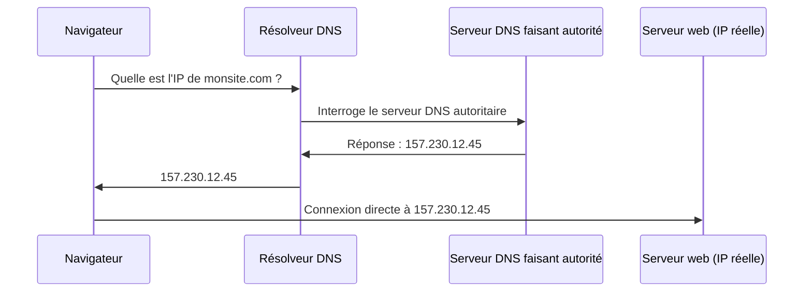

<div class="chapitre-titre-num">CHAPITRE 17 · 🟢 DÉBUTANT ABSOLU</div>

# DNS

<div class="encadre objectif">
<span class="encadre-titre">🎯 Objectif du chapitre</span>
Comprendre ce qu'est le DNS et pourquoi il est nécessaire, connaître les types d'enregistrements les plus utilisés (A, AAAA, CNAME, MX, TXT), comprendre le rôle du TTL, et configurer un vrai nom de domaine pour qu'il pointe vers ton serveur de laboratoire — le chaînon manquant entre le chapitre 16 (HTTPS, qui nécessite un domaine) et le reste de ce manuel.
</div>

<div class="encadre scenario">
<span class="encadre-titre">🎬 Mise en situation</span>
Personne ne tape une adresse IP (`157.230.12.45`) pour visiter un site — on tape `monsite.com`. Le DNS (*Domain Name System*) est l'annuaire mondial et distribué qui fait cette traduction, en permanence, des milliards de fois par jour, sans qu'on y pense jamais. Ce chapitre explique ce mécanisme, resté implicite jusqu'ici dans ce manuel (chaque `server_name` du chapitre 15 supposait déjà un DNS déjà configuré).
</div>

## 17.1 Ce que le DNS résout, concrètement



<div class="encadre astuce">
<span class="encadre-titre">💡 Analogie — un annuaire téléphonique mondial et distribué</span>
Le DNS fonctionne comme un annuaire téléphonique géant : tu connais le nom d'une personne (<code>monsite.com</code>), l'annuaire te donne son numéro (l'adresse IP). Personne ne mémorise directement les numéros — tout le monde passe par l'annuaire. La différence, c'est que cet annuaire n'est pas centralisé sur un seul serveur : il est distribué sur des millions de serveurs dans le monde, chacun responsable d'une partie précise de l'espace de noms.
</div>

## 17.2 Les types d'enregistrements essentiels

| Type | Rôle | Exemple |
|---|---|---|
| **A** | Fait pointer un nom vers une adresse IPv4 | `monsite.com → 157.230.12.45` |
| **AAAA** | Fait pointer un nom vers une adresse IPv6 | `monsite.com → 2604:a880:...` |
| **CNAME** | Fait pointer un nom vers un **autre nom** (jamais directement une IP) | `www.monsite.com → monsite.com` |
| **MX** | Indique quel(s) serveur(s) gèrent les emails du domaine | `monsite.com → mail.monsite.com (priorité 10)` |
| **TXT** | Stocke du texte libre, souvent pour prouver la propriété d'un domaine ou configurer la sécurité email | `v=spf1 include:_spf.google.com ~all` |

<div class="encadre retenir">
<span class="encadre-titre">📌 CNAME ne peut jamais coexister avec un autre enregistrement sur le même nom</span>
Une règle technique souvent source de confusion : un nom qui a un enregistrement CNAME ne peut avoir <strong>aucun autre</strong> type d'enregistrement (pas de A, pas de MX) sur ce même nom exact. C'est pour cette raison que le domaine racine (<code>monsite.com</code>, sans <code>www.</code>) utilise presque toujours un enregistrement A, jamais un CNAME — un CNAME sur la racine empêcherait d'avoir des enregistrements MX pour l'email sur ce même domaine.
</div>

## 17.3 TTL : la durée de mise en cache

```text
monsite.com.    3600    IN    A    157.230.12.45
```

**Explication :** `3600` est le **TTL** (*Time To Live*, en secondes — ici une heure) : la durée pendant laquelle les résolveurs DNS intermédiaires (souvent ceux de ton fournisseur d'accès Internet) sont autorisés à garder cette réponse en cache, sans réinterroger le serveur faisant autorité.

<div class="encadre bonne-pratique">
<span class="encadre-titre">✅ Bonne pratique — réduire le TTL avant un changement planifié</span>
Avant une migration de serveur ou un changement d'IP planifié, réduire le TTL à une faible valeur (par exemple 300 secondes, 5 minutes) plusieurs heures ou jours à l'avance permet à l'ancien TTL élevé d'expirer partout, avant même de faire le changement — le nouveau TTL court garantit ensuite une propagation rapide du vrai changement, plutôt que de laisser certains visiteurs bloqués sur l'ancienne IP pendant la durée d'un TTL élevé encore en cache.
</div>

## 17.4 Configurer un domaine pour pointer vers ton laboratoire

<div class="encadre memoriser">
<span class="encadre-titre">🧠 Exemple complet, du domaine au conteneur</span>

```text
monsite.com
      ↓ (enregistrement A, chez le registrar/fournisseur DNS)
157.230.12.45 (IP de ton serveur de laboratoire)
      ↓ (Nginx écoute sur le port 443, chapitre 16)
Nginx
      ↓ (proxy_pass, chapitre 15)
Conteneur Docker (chapitre 11)
```
</div>

**Étapes concrètes** (l'interface exacte varie selon le fournisseur du domaine, mais suit toujours ce schéma) :

1. Dans le panneau de gestion DNS de ton fournisseur de domaine, ajoute un enregistrement **A** : nom `@` (ou vide, pour le domaine racine), valeur = l'adresse IP publique de ton serveur de laboratoire.
2. Ajoute un enregistrement **CNAME** : nom `www`, valeur = `monsite.com` (pour que `www.monsite.com` fonctionne aussi).
3. Attends la propagation (de quelques minutes à, rarement, quelques heures selon le TTL précédent).

**Test de vérification :**

```bash
dig monsite.com A
nslookup monsite.com
```

**Résultat attendu** : la commande retourne l'adresse IP configurée. `dig` (plus détaillé, disponible via `sudo apt install -y dnsutils` sur Ubuntu) affiche aussi le TTL restant et le serveur ayant répondu ; `nslookup` (disponible sur la plupart des systèmes, y compris Windows) donne une réponse plus condensée.

<div class="encadre astuce">
<span class="encadre-titre">💡 Vérifier la propagation depuis plusieurs endroits du monde</span>
Un résolveur DNS local peut avoir gardé en cache une ancienne réponse. Un outil comme <code>whatsmydns.net</code> interroge simultanément des résolveurs DNS situés dans différents pays, donnant une vue bien plus fiable de l'état réel de la propagation qu'une seule vérification locale.
</div>

## Atelier — De l'achat du domaine à HTTPS fonctionnel

<div class="encadre exercice">
<span class="encadre-titre">🛠️ Atelier 17.1 — Boucler la chaîne complète DNS → Nginx → HTTPS</span>

**Objectif** : relier ce chapitre au chapitre 16, en configurant un vrai domaine de bout en bout.

**Étapes détaillées** :

1. Si tu n'as pas encore de domaine, obtiens-en un (un domaine bon marché suffit largement pour ce manuel, ou un sous-domaine gratuit si le budget est une contrainte réelle).
2. Configure l'enregistrement A vers ton serveur de laboratoire (section 17.4).
3. Vérifie la propagation avec `dig` avant de continuer — ne passe pas à l'étape suivante tant que la résolution n'est pas confirmée.
4. Relance (ou lance pour la première fois) `certbot --nginx -d ton-domaine.com` (chapitre 16), qui devrait maintenant réussir puisque le DNS pointe correctement.
5. Vérifie dans un navigateur : `https://ton-domaine.com` affiche ton site avec un certificat valide.

**Résultat attendu** : la chaîne complète du chapitre 17.4 fonctionne de bout en bout, du nom de domaine jusqu'au conteneur applicatif, en HTTPS.

**Dépannage** : si Certbot échoue encore après une propagation DNS apparemment confirmée, attends encore quelques minutes — certains résolveurs DNS gardent un cache plus long que prévu malgré un TTL réduit.
</div>

## Erreurs fréquentes

<div class="encadre attention">
<span class="encadre-titre">⚠️ Erreur n°1 — Vouloir un CNAME sur le domaine racine avec des emails déjà configurés</span>
Comme détaillé en section 17.2, un CNAME sur `monsite.com` (sans sous-domaine) empêche tout enregistrement MX sur ce même nom — utiliser un enregistrement A sur la racine, jamais un CNAME, dès qu'un email professionnel est prévu sur ce domaine.
</div>

<div class="encadre attention">
<span class="encadre-titre">⚠️ Erreur n°2 — Ne pas attendre la propagation avant de tester</span>
Tester immédiatement après avoir modifié un enregistrement DNS, sans laisser le temps à la propagation (surtout avec un TTL élevé hérité d'une configuration précédente), donne souvent l'impression à tort que "ça ne marche pas" — patienter, ou vérifier avec un outil multi-résolveurs (section 17.4) avant de conclure à un problème réel.
</div>

<div class="encadre attention">
<span class="encadre-titre">⚠️ Erreur n°3 — Oublier le sous-domaine `www`</span>
Une configuration qui ne couvre que `monsite.com` (sans l'enregistrement CNAME pour `www.monsite.com`) laisse une partie des visiteurs, habitués à taper `www.`, face à une erreur — un oubli fréquent et facilement évitable.
</div>

## En entreprise

**Réalité répandue** : la gestion DNS d'une entreprise passe de plus en plus par un fournisseur DNS dédié (Cloudflare, Route 53 d'AWS, chapitre 40) plutôt que par le panneau basique fourni par le registrar du domaine — offrant davantage de fonctionnalités (DNS géré comme code, chapitre 37, latence réduite via des serveurs distribués mondialement).

**Bonne pratique répandue** : les enregistrements DNS critiques sont documentés (voire versionnés comme de l'Infrastructure as Code, Partie XII) plutôt que gérés uniquement via une interface web, pour garder une trace de chaque changement et pouvoir le reproduire ou l'auditer.

**Erreur classique observée** : l'expiration d'un nom de domaine oublié (le renouvellement annuel n'a pas été anticipé), causant une interruption de service totale et parfois une perte définitive du nom si un tiers le rachète immédiatement après expiration — un scénario de panne particulièrement coûteux et entièrement évitable avec un simple rappel calendaire.

## Entretien technique

<div class="encadre exercice">
<span class="encadre-titre">💼 Questions fréquemment posées en entretien</span>

**Q1. "Quelle est la différence entre un enregistrement A et un CNAME ?"**
Réponse attendue : A pointe directement vers une adresse IPv4 ; CNAME pointe vers un autre nom de domaine, qui sera lui-même résolu ensuite (section 17.2).

**Q2. "Pourquoi réduire le TTL avant une migration de serveur planifiée ?"**
Réponse attendue : laisser le temps à l'ancien TTL élevé d'expirer dans tous les caches DNS intermédiaires avant le changement réel, pour que le nouveau TTL court garantisse une propagation rapide au moment de la bascule effective (section 17.3).

**Q3. "Pourquoi Let's Encrypt ne peut-il pas délivrer de certificat avant la propagation DNS complète ?"**
Réponse attendue : la vérification de propriété du domaine par Let's Encrypt nécessite que le domaine pointe réellement vers le serveur qui fait la demande — sans propagation DNS effective, cette vérification échoue (lien direct avec le chapitre 16).
</div>

## Optimisation, sécurité et maintenabilité — les réflexes dès ce chapitre

<div class="encadre securite">
<span class="encadre-titre">🔒 Sécurité</span>
Active le verrouillage du domaine (*registrar lock*) et l'authentification à deux facteurs sur le compte de gestion du domaine — un domaine détourné (par accès non autorisé au compte du registrar) peut rediriger tout le trafic d'un site vers un serveur malveillant, un risque de sécurité aussi grave qu'un serveur compromis directement.
</div>

<div class="encadre bonne-pratique">
<span class="encadre-titre">✅ Maintenabilité</span>
Documente l'ensemble des enregistrements DNS d'un domaine (pas seulement ceux liés au site web — email, vérifications tierces via TXT) dans un endroit centralisé, pour éviter de casser un service existant en modifiant un enregistrement sans en connaître l'usage réel.
</div>

<div class="encadre performance">
<span class="encadre-titre">🚀 Performance</span>
Un TTL trop bas en permanence (quelques secondes) force des résolutions DNS répétées inutilement, ajoutant une latence perceptible ; un TTL raisonnable en fonctionnement normal (plusieurs heures) réduit ce surcoût, réservant un TTL court aux périodes de changement planifié (section 17.3).
</div>

## Résumé du chapitre

- Le DNS traduit un nom de domaine en adresse IP, de façon distribuée mondialement.
- A/AAAA pointent vers une IP ; CNAME pointe vers un autre nom ; MX gère l'email ; TXT stocke du texte libre (vérification, sécurité email).
- Un CNAME ne peut jamais coexister avec un autre enregistrement sur le même nom exact.
- Le TTL détermine la durée de mise en cache d'une réponse DNS — à réduire avant un changement planifié.
- La chaîne complète domaine → IP → Nginx → conteneur applicatif relie directement ce chapitre aux chapitres 11, 15 et 16.

## Quiz

<div class="encadre exercice">
<span class="encadre-titre">📝 QCM (une seule bonne réponse par question)</span>

1. Un enregistrement CNAME pointe vers :
   - a) Une adresse IPv4 directement
   - b) Un autre nom de domaine
   - c) Un serveur de messagerie
   - d) Un certificat TLS

2. Le TTL d'un enregistrement DNS détermine :
   - a) La vitesse du serveur web
   - b) La durée de mise en cache de la réponse par les résolveurs
   - c) Le nombre de visiteurs autorisés
   - d) La taille du certificat HTTPS

3. Un enregistrement MX sert à :
   - a) Chiffrer le trafic web
   - b) Indiquer quel(s) serveur(s) gèrent les emails du domaine
   - c) Rediriger vers un autre site
   - d) Stocker du texte libre

**Corrigé** : 1-b, 2-b, 3-b.
</div>

<div class="encadre exercice">
<span class="encadre-titre">📝 Vrai ou Faux</span>

1. Un domaine racine (`monsite.com`) peut avoir simultanément un CNAME et un enregistrement MX. — **Faux** (section 17.2).
2. Réduire le TTL avant une migration planifiée accélère la propagation du changement réel. — **Vrai** (section 17.3).
3. Certbot peut délivrer un certificat même si le DNS ne pointe pas encore vers le bon serveur. — **Faux** (chapitre 16, erreur fréquente n°1).

</div>

## Exercices

<div class="encadre exercice">
<span class="encadre-titre">📝 Exercice 17.1</span>

Un site doit être accessible à la fois sur `monsite.com` et `www.monsite.com`, avec des emails gérés sur `monsite.com`. Quels enregistrements DNS faut-il configurer, et pourquoi pas un CNAME sur la racine ?
</div>

**Corrigé :** un enregistrement A sur `monsite.com` (racine) pointant vers l'IP du serveur, un enregistrement CNAME sur `www` pointant vers `monsite.com`, et un ou plusieurs enregistrements MX sur `monsite.com` pour la gestion des emails. Un CNAME sur la racine est impossible ici car il empêcherait techniquement la coexistence des enregistrements MX nécessaires à l'email sur ce même nom (section 17.2).

## Checklist de fin de chapitre

<ul class="checklist">
<li>☐ Je sais expliquer le rôle général du DNS.</li>
<li>☐ Je connais les enregistrements A, AAAA, CNAME, MX, TXT et leur usage respectif.</li>
<li>☐ Je comprends pourquoi un CNAME ne peut pas coexister avec un autre enregistrement sur le même nom.</li>
<li>☐ Je sais expliquer le rôle du TTL et pourquoi le réduire avant un changement planifié.</li>
<li>☐ J'ai configuré un vrai domaine pointant vers mon serveur de laboratoire, vérifié avec `dig`.</li>
<li>☐ J'ai relié la chaîne complète domaine → Nginx → HTTPS → conteneur applicatif.</li>
</ul>

## FAQ

<dl class="faq">
<dt>Combien de temps prend réellement une propagation DNS ?</dt>
<dd>Cela dépend surtout du TTL précédemment configuré (section 17.3) — de quelques minutes (TTL déjà bas) à plusieurs heures (TTL élevé hérité). Un nouveau domaine, sans historique de cache, se propage généralement très rapidement.</dd>

<dt>Peut-on utiliser un sous-domaine gratuit pour apprendre ce chapitre sans acheter de domaine ?</dt>
<dd>Oui, plusieurs services proposent des sous-domaines gratuits avec gestion DNS complète, suffisants pour tous les exercices de ce chapitre et du chapitre 16.</dd>

<dt>Le DNS a-t-il un lien avec la sécurité, au-delà de la simple résolution de nom ?</dt>
<dd>Oui, notamment via les enregistrements TXT utilisés pour SPF/DKIM/DMARC (protection contre l'usurpation d'email) — un sujet qui dépasse le périmètre de ce chapitre mais mérite d'être connu si un domaine gère aussi des emails professionnels.</dd>
</dl>

## Références et pour aller plus loin

- Cloudflare — "What is DNS?" (introduction très claire et illustrée) : [https://www.cloudflare.com/learning/dns/what-is-dns/](https://www.cloudflare.com/learning/dns/what-is-dns/)
- `whatsmydns.net` — vérification de propagation DNS depuis plusieurs résolveurs mondiaux : [https://www.whatsmydns.net](https://www.whatsmydns.net)
- MX Toolbox — diagnostic complet d'un domaine (DNS, MX, blacklists) : [https://mxtoolbox.com](https://mxtoolbox.com)

*Chapitre suivant : gérer ses environnements — development, testing, staging, production, fichiers `.env`, et les différences de configuration entre chacun. La Partie VI se termine avec cette base indispensable avant d'aborder le CI/CD.*
