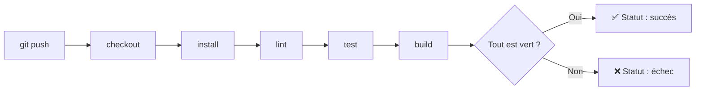

CHAPITRE 19 · 🟡 INTERMÉDIAIRE

# Comprendre l'intégration continue (CI)

🎯 Objectif du chapitre
Comprendre précisément ce que l'intégration continue vérifie et pourquoi, le pipeline générique push→checkout→install→lint→test→build, et pourquoi ce mécanisme automatisé change fondamentalement la confiance qu'une équipe peut avoir dans son propre code. Ce chapitre ouvre la Partie VII : les chapitres 20 à 24 construisent, outil par outil, ce que ce chapitre introduit conceptuellement.

🎬 Mise en situation
Rappelle-toi le principe du "shift-left" du chapitre 2 (section 2.5) : plus un problème est détecté tôt, moins il coûte cher à corriger. Jusqu'ici dans ce manuel, chaque vérification (tests, build) a été faite manuellement, par toi, quand tu y pensais. L'intégration continue automatise cette vérification : elle se déclenche **toute seule**, à chaque changement de code poussé sur GitHub (chapitre 8), sans jamais dépendre de la mémoire ou de la discipline d'une personne.

## 19.1 Ce que l'intégration continue vérifie, et pourquoi

📌 Définition précise
L'<strong>intégration continue</strong> (CI, <em>Continuous Integration</em>) consiste à intégrer fréquemment le code de plusieurs contributeurs dans une branche commune, et à vérifier <strong>automatiquement</strong>, à chaque intégration, que le résultat fonctionne toujours (compile, passe les tests, respecte les règles de qualité) — sans attendre une intégration manuelle occasionnelle et risquée.

Le terme vient historiquement du problème qu'il résout : avant la CI, plusieurs développeurs travaillaient sur des branches séparées pendant des semaines, puis tentaient de tout fusionner ("intégrer") en une seule fois — un moment redouté, souvent source de conflits difficiles et de bugs d'intégration découverts tardivement. La CI résout ce problème en intégrant **en continu**, par petits incréments fréquents, avec une vérification automatique à chaque étape.

💡 Lien direct avec le chapitre 9
La CI est la raison technique profonde pour laquelle GitHub Flow et trunk-based development (chapitre 9) recommandent des branches courtes et des fusions fréquentes : plus l'intégration est fréquente, plus chaque vérification automatique porte sur un changement petit et facile à diagnostiquer en cas d'échec.

## 19.2 Le pipeline générique

**Explication de chaque étape :**

- **`git push`** : le déclencheur — un développeur pousse du code vers GitHub (chapitre 8).
- **`checkout`** : le serveur d'exécution de la CI récupère une copie fraîche du code à ce commit précis.
- **`install`** : installation des dépendances (`npm ci`, chapitre 12) dans un environnement propre, jamais celui, potentiellement pollué, d'un développeur.
- **`lint`** : vérification automatique du style et de certaines erreurs de code (chapitre 24).
- **`test`** : exécution de la suite de tests automatisés (chapitre 23).
- **`build`** : construction de l'application (compilation, ou construction d'une image Docker, chapitre 12) pour confirmer qu'elle est réellement déployable, pas seulement que son code est syntaxiquement correct.

✅ Bonne pratique — un environnement d'exécution propre à chaque fois
Chaque exécution de la CI démarre dans un environnement **entièrement neuf** (souvent littéralement une nouvelle machine virtuelle ou un nouveau conteneur, chapitre 21) — jamais un environnement réutilisé d'une exécution précédente. Cela garantit que "ça passe en CI" signifie réellement "ça fonctionne dans des conditions propres et reproductibles", pas "ça fonctionne parce qu'un fichier oublié d'une exécution précédente traînait encore".

## 19.3 Ce que la CI change concrètement dans le quotidien d'une équipe

🧠 Avant / après CI

**Sans CI** : un développeur pousse du code, personne ne sait s'il fonctionne réellement tant qu'un autre développeur ne le récupère pas et ne le teste manuellement — souvent bien après, quand le contexte du changement est déjà oublié.

**Avec CI** : dans les minutes qui suivent un `git push`, un statut visible (✅ ou ❌, directement dans l'interface GitHub, chapitre 8) confirme si le changement respecte les règles de base du projet — un retour quasi immédiat, exactement le principe du "shift-left" (chapitre 2).

Ce statut devient un critère objectif dans le processus de revue de code (chapitre 8) : une pull request avec la CI en échec ne devrait jamais être fusionnée, indépendamment de l'avis du relecteur humain sur la qualité du code — la CI et la revue humaine se complètent, l'une ne remplace pas l'autre.

## Atelier — Dérouler le pipeline générique à la main

🛠️ Atelier 19.1 — Simuler manuellement ce qu'une CI ferait

**Objectif** : avant d'automatiser quoi que ce soit (chapitre 21), comprendre concrètement chaque étape du pipeline en l'exécutant toi-même, dans l'ordre, sur un projet simple.

**Étapes détaillées**, sur ton serveur de laboratoire, dans un dossier de projet Node.js simple (même minimal) :

1. `git clone` une copie fraîche du dépôt dans un dossier temporaire distinct (simulant le `checkout` d'un environnement propre).
2. `npm ci` (jamais `npm install` en CI — `ci` respecte strictement `package-lock.json`, sans jamais le modifier, contrairement à `install` qui peut le mettre à jour).
3. Si un linter est configuré, exécute-le (`npm run lint`, chapitre 24).
4. Exécute la suite de tests (`npm test`, chapitre 23).
5. Construis l'application (`npm run build`, ou `docker build`, chapitre 12).
6. Si toutes les étapes réussissent, le pipeline "passerait" en vert ; à la première étape en échec, il "s'arrêterait" en rouge.

**Résultat attendu** : une compréhension concrète, avant automatisation, de ce que chaque étape vérifie réellement — le chapitre 21 automatisera exactement cette séquence.

## Erreurs fréquentes

⚠️ Erreur n°1 — Confondre CI et déploiement
La CI (ce chapitre) vérifie qu'un changement fonctionne ; le déploiement (chapitre 20 et Partie VIII) le met en production. Les deux sont souvent enchaînés dans un même pipeline, mais restent conceptuellement deux étapes distinctes avec des objectifs différents.

⚠️ Erreur n°2 — Utiliser `npm install` plutôt que `npm ci` en environnement d'intégration
`npm install` peut légèrement modifier `package-lock.json` (mise à jour de versions compatibles) ; `npm ci` respecte le fichier de verrouillage à l'identique et échoue si une incohérence existe — le comportement attendu dans un environnement reproductible comme la CI.

⚠️ Erreur n°3 — Ignorer un échec de CI "juste cette fois"
Fusionner une pull request malgré un échec de CI ("je suis sûr que ce n'est pas grave") érode progressivement la confiance de toute l'équipe dans le statut de la CI — si les échecs sont régulièrement ignorés, personne ne les prend plus au sérieux, annulant tout l'intérêt du mécanisme.

## En entreprise

**Réalité répandue** : la CI est aujourd'hui considérée comme un strict minimum sur tout projet professionnel au-delà d'un usage strictement personnel — son absence est généralement perçue comme un signal de dette technique ou d'immaturité du projet.

**Bonne pratique répandue** : les branches protégées (chapitre 8) rendent la CI **obligatoire** techniquement, pas seulement recommandée — le bouton de fusion reste grisé tant que la CI n'est pas passée, éliminant le risque de l'erreur n°3 ci-dessus.

**Erreur classique observée** : des pipelines de CI lents (plusieurs dizaines de minutes) que les développeurs finissent par contourner ou ignorer par lassitude — la rapidité d'un pipeline CI est elle-même une caractéristique de qualité à entretenir, approfondie au chapitre 22.

## Entretien technique

💼 Questions fréquemment posées en entretien

**Q1. "Qu'est-ce que l'intégration continue, et quel problème historique résout-elle ?"**
Réponse attendue : l'intégration fréquente et automatiquement vérifiée du code de plusieurs contributeurs, en réaction au problème des fusions massives et tardives, source de conflits difficiles (section 19.1).

**Q2. "Pourquoi utiliser `npm ci` plutôt que `npm install` dans un pipeline CI ?"**
Réponse attendue : `npm ci` respecte strictement le fichier de verrouillage des dépendances sans le modifier, garantissant un environnement reproductible à l'identique à chaque exécution (section 19.3, erreur fréquente n°2).

**Q3. "Que devrait-il se passer si la CI échoue sur une pull request ?"**
Réponse attendue : la fusion devrait être techniquement bloquée (via une branche protégée, chapitre 8), pas seulement déconseillée — pour éviter que des échecs ne soient progressivement ignorés (section "Erreurs fréquentes", erreur n°3).

## Optimisation, sécurité et maintenabilité — les réflexes dès ce chapitre

🔒 Sécurité
Un pipeline CI qui échoue systématiquement pour des raisons ignorées finit par être désactivé ou contourné — traiter chaque échec de CI comme une information à comprendre, jamais comme un obstacle à écarter, est aussi une discipline de sécurité (approfondi avec le DevSecOps, chapitre 35).

✅ Maintenabilité
Garde le pipeline CI aussi simple et lisible que possible au départ (le pipeline générique de la section 19.2 suffit largement pour commencer) — la complexité (matrices de versions, étapes parallèles) s'ajoute progressivement, une fois le besoin réellement identifié, jamais par anticipation excessive.

🚀 Performance
Un pipeline CI rapide (quelques minutes) encourage des pushs fréquents et de petite taille (chapitre 2, section 2.4) ; un pipeline lent décourage cette pratique et pousse, paradoxalement, vers de plus gros changements moins fréquents — l'inverse de l'objectif recherché.

## Résumé du chapitre

- L'intégration continue vérifie automatiquement, à chaque changement poussé, que le code fonctionne toujours.
- Le pipeline générique suit toujours la même logique : checkout → install → lint → test → build.
- Chaque exécution de CI démarre dans un environnement propre et reproductible.
- `npm ci` (ou son équivalent selon le langage) est préféré à une installation qui pourrait modifier le fichier de verrouillage des dépendances.
- La CI et la revue de code humaine se complètent — un échec de CI ne devrait jamais être ignoré ni contourné.

## Quiz

📝 QCM (une seule bonne réponse par question)

1. L'intégration continue vérifie principalement :
   - a) Que le serveur de production fonctionne
   - b) Qu'un changement de code intégré fonctionne toujours (compile, teste, se construit)
   - c) La vitesse de connexion réseau
   - d) Le nombre de visiteurs d'un site

2. Le pipeline générique de CI suit l'ordre :
   - a) build → test → lint → install
   - b) checkout → install → lint → test → build
   - c) deploy → test → build
   - d) lint → deploy → checkout

3. `npm ci`, contrairement à `npm install` :
   - a) Installe des dépendances supplémentaires
   - b) Respecte strictement le fichier de verrouillage sans le modifier
   - c) Supprime le fichier `package.json`
   - d) Ne fonctionne que sur macOS

**Corrigé** : 1-b, 2-b, 3-b.

📝 Vrai ou Faux

1. La CI et le déploiement désignent exactement la même chose. — **Faux** (section "Erreurs fréquentes", erreur n°1).
2. Chaque exécution de CI devrait démarrer dans un environnement neuf, jamais réutilisé. — **Vrai** (section 19.2).
3. Ignorer occasionnellement un échec de CI n'a aucun impact sur la confiance de l'équipe dans ce mécanisme. — **Faux** (section "Erreurs fréquentes", erreur n°3).

## Exercices

📝 Exercice 19.1

Explique pourquoi un pipeline CI lent peut, paradoxalement, encourager des changements plus gros et moins fréquents plutôt que l'inverse.

**Corrigé :** si chaque vérification prend plusieurs dizaines de minutes, les développeurs sont découragés de pousser fréquemment de petits changements (chaque push déclenchant une attente longue) et tendent à accumuler plusieurs modifications avant de pousser, pour "rentabiliser" chaque exécution du pipeline — recréant exactement le problème des grosses livraisons risquées que les petits changements fréquents (chapitre 2, section 2.4) cherchent à éviter. Un pipeline rapide (section "Performance") est donc une condition presque silencieuse mais réelle du succès de la culture DevOps décrite au chapitre 2.

## Checklist de fin de chapitre

<ul class="checklist">
<li>☐ Je sais définir précisément ce que l'intégration continue vérifie.</li>
<li>☐ Je connais les six étapes du pipeline générique et leur rôle respectif.</li>
<li>☐ Je comprends pourquoi chaque exécution de CI doit démarrer dans un environnement propre.</li>
<li>☐ Je sais pourquoi `npm ci` est préféré à `npm install` dans ce contexte.</li>
<li>☐ Je comprends pourquoi un échec de CI ne devrait jamais être contourné.</li>
</ul>

## FAQ

<dl class="faq">
<dt>La CI est-elle utile pour un projet personnel, sans équipe ?</dt>
<dd>Oui, même seul. Elle garantit qu'un changement poussé fonctionne réellement, sans dépendre de ta propre mémoire de tester manuellement à chaque fois — particulièrement utile en reprenant un projet après une pause.</dd>

<dt>Combien de temps un pipeline CI devrait-il prendre ?</dt>
<dd>Il n'existe pas de seuil universel, mais quelques minutes est une cible raisonnable pour la majorité des projets de taille modeste — au-delà de dix à quinze minutes, la tentation de contourner ou d'ignorer le pipeline grandit sensiblement.</dd>

<dt>Faut-il un outil spécifique pour faire de la CI ?</dt>
<dd>Ce chapitre reste volontairement conceptuel et indépendant d'un outil précis. Le chapitre 21 introduit GitHub Actions, l'outil utilisé pour le reste de ce manuel, mais les mêmes principes s'appliquent à n'importe quelle plateforme de CI (GitLab CI, CircleCI, Jenkins...).</dd>
</dl>

## Références et pour aller plus loin

- Martin Fowler — "Continuous Integration" (article de référence historique sur le sujet) : [https://martinfowler.com/articles/continuousIntegration.html](https://martinfowler.com/articles/continuousIntegration.html)
- ThoughtWorks Technology Radar — perspectives régulièrement mises à jour sur les pratiques CI/CD : [https://www.thoughtworks.com/radar](https://www.thoughtworks.com/radar)

*Chapitre suivant : comprendre le déploiement continu (CD) — Continuous Delivery et Continuous Deployment, la suite logique du pipeline une fois la CI en place.*
