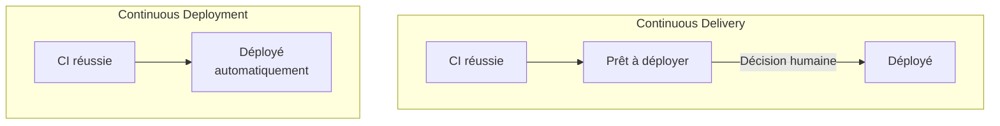
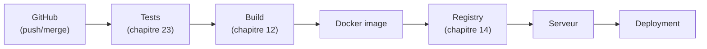

CHAPITRE 20 · 🟡 INTERMÉDIAIRE

# Comprendre le déploiement continu (CD)

🎯 Objectif du chapitre
Distinguer précisément Continuous Delivery et Continuous Deployment (deux sens différents derrière le même sigle CD, une confusion fréquente), comprendre le pipeline complet GitHub→Tests→Build→Docker image→Registry→Serveur→Deployment, et savoir choisir entre les deux approches selon le contexte d'un projet. Ce chapitre referme la boucle conceptuelle ouverte au chapitre 19 : la CI vérifie, la CD livre.

🎬 Mise en situation
Le chapitre 19 a montré comment vérifier automatiquement qu'un changement fonctionne. Une question reste ouverte : une fois cette vérification réussie, qui décide de mettre ce changement en production, et comment ? Ce chapitre répond à cette question, et introduit une distinction que beaucoup de professionnels confondent eux-mêmes : delivery (livraison) et deployment (déploiement) ne désignent pas exactement la même chose.

## 20.1 Continuous Delivery et Continuous Deployment : la nuance qui compte

📌 La différence exacte
<strong>Continuous Delivery</strong> (livraison continue) : chaque changement qui passe la CI est automatiquement préparé et <strong>prêt</strong> à être déployé en production, mais le déploiement final reste déclenché par une <strong>décision humaine</strong> (souvent un simple clic). <strong>Continuous Deployment</strong> (déploiement continu) : chaque changement qui passe la CI est <strong>automatiquement déployé</strong> en production, sans aucune intervention humaine supplémentaire.

⚠️ Une confusion très répandue, y compris chez des professionnels expérimentés
Le sigle "CD" est utilisé indifféremment pour les deux, ce qui entretient la confusion. Dans la pratique et dans ce manuel, "CD" désignera le concept général (le pipeline qui suit la CI), et le contexte précisera s'il s'agit de livraison (avec approbation) ou de déploiement (entièrement automatique).

## 20.2 Pourquoi choisir Continuous Delivery plutôt que Deployment

✅ Quand Continuous Delivery a du sens
Continuous Delivery convient à des contextes où une validation humaine finale reste précieuse : une application avec des enjeux réglementaires, un changement à fort impact business, ou simplement une équipe qui construit progressivement sa confiance dans son pipeline avant de sauter le pas du déploiement entièrement automatique. C'est souvent l'étape intermédiaire naturelle avant d'atteindre le Continuous Deployment complet.

Un exemple concret : le chapitre 8 (section 8.6) a introduit les **Environments** GitHub avec des règles de protection (approbation manuelle requise) — c'est exactement le mécanisme technique qui implémente Continuous Delivery plutôt que Continuous Deployment : le pipeline prépare tout automatiquement, mais un humain doit cliquer "approuver" avant que le déploiement en production ne s'exécute réellement.

## 20.3 Pourquoi choisir Continuous Deployment

✅ Quand Continuous Deployment a du sens
Continuous Deployment convient aux équipes matures en tests automatisés (Partie VII) et en monitoring (Partie X) — la confiance dans le pipeline remplace la validation humaine manuelle, permettant le rythme de plusieurs déploiements par jour évoqué depuis le chapitre 1 (le cas Flickr). C'est la stratégie la plus alignée avec le trunk-based development (chapitre 9) et les feature flags, qui permettent de déployer du code inachevé sans risque, invisible tant qu'il n'est pas activé.

🧠 Recommandation par défaut de ce manuel
Pour la majorité des projets de ce manuel, débuter avec <strong>Continuous Delivery</strong> (approbation manuelle avant production) le temps de construire la confiance dans le pipeline, puis évoluer vers <strong>Continuous Deployment</strong> une fois les tests automatisés (chapitre 23), le monitoring (chapitre 32) et les capacités de rollback (chapitre 29) suffisamment matures. Ce n'est jamais un choix figé — la bascule d'une approche à l'autre est une décision qui évolue avec la maturité du projet.

## 20.4 Le pipeline complet

**Explication de chaque étape, reliant les chapitres déjà couverts :** un push ou une fusion sur GitHub (chapitre 8) déclenche le pipeline ; les tests (chapitre 23) et le build (chapitre 12) reprennent exactement le pipeline générique du chapitre 19 ; une image Docker est construite à partir de ce build ; elle est poussée vers un registre (chapitre 14) ; le serveur cible (chapitre 26) la récupère ; le déploiement final l'active (avec ou sans approbation humaine, selon la section 20.1).

💡 Ce pipeline n'est pas nouveau — c'est `deploy.sh` automatisé
Compare ce schéma au script <code>deploy.sh</code> du chapitre 10 (section 10.7) : sauvegarder, récupérer le code, redémarrer, vérifier. La logique est rigoureusement identique — ce chapitre ne fait qu'orchestrer automatiquement, à travers plusieurs outils spécialisés (Docker, un registre, GitHub Actions au chapitre 21), ce qu'un script unique faisait manuellement.

## Atelier — Cartographier le pipeline de son propre projet

🛠️ Atelier 20.1 — Choisir Delivery ou Deployment pour un contexte donné

**Objectif** : s'entraîner à choisir entre Continuous Delivery et Continuous Deployment selon un contexte réaliste.

**Étapes détaillées** : pour chacun des trois contextes suivants, choisis l'approche la plus adaptée et justifie en une phrase.

1. Une application bancaire soumise à des obligations réglementaires strictes de validation avant mise en production.
2. Un blog personnel avec une suite de tests automatisés très simple.
3. Une équipe de dix développeurs sur une application SaaS avec une suite de tests automatisés très mature, un monitoring en temps réel, et des feature flags déjà en place.

**Résultat attendu / corrigé** : (1) Continuous Delivery — la contrainte réglementaire impose une validation humaine documentée avant chaque mise en production. (2) Continuous Deployment — l'enjeu est faible, l'automatisation complète est la voie la plus simple et rapide. (3) Continuous Deployment — la maturité technique (tests, monitoring, feature flags) rend l'automatisation complète sûre et cohérente avec le rythme recherché.

## Erreurs fréquentes

⚠️ Erreur n°1 — Confondre Continuous Delivery et Continuous Deployment en discussion d'équipe
Utiliser "CD" sans préciser lequel des deux est réellement en place peut créer des malentendus sur le niveau réel d'automatisation d'un projet — préciser explicitement l'approche choisie dans la documentation du projet évite cette ambiguïté.

⚠️ Erreur n°2 — Passer directement à Continuous Deployment sans la maturité nécessaire
Automatiser entièrement le déploiement en production avant d'avoir une suite de tests fiable (chapitre 23) et un monitoring efficace (chapitre 32) revient à déployer des changements non vérifiés directement chez de vrais utilisateurs, sans filet de sécurité réel.

⚠️ Erreur n°3 — Une approbation manuelle qui devient une formalité vide de sens
Si l'approbation humaine de Continuous Delivery devient systématiquement un clic automatique sans réelle vérification ("j'approuve toujours sans regarder"), l'équipe perd le bénéfice réel de cette étape tout en gardant sa lenteur — un signal qu'il est peut-être temps de basculer réellement vers Continuous Deployment, ou de revoir ce que cette approbation est censée vérifier.

## En entreprise

**Réalité répandue** : la majorité des équipes commencent par Continuous Delivery et évoluent progressivement vers Continuous Deployment à mesure que la confiance dans le pipeline se construit — rarement l'inverse.

**Bonne pratique répandue** : même en Continuous Deployment complet, certaines organisations gardent une approbation manuelle uniquement pour les changements touchant des zones particulièrement sensibles (migrations de base de données, changements de tarification) — une approche hybride, pas un choix binaire absolu pour tout le pipeline.

**Erreur classique observée** : présenter fièrement "on fait du Continuous Deployment" alors que le pipeline réel contient encore des étapes manuelles non documentées — un écart entre la théorie affichée et la pratique réelle, à corriger en clarifiant honnêtement le niveau d'automatisation effectif.

## Entretien technique

💼 Questions fréquemment posées en entretien

**Q1. "Quelle est la différence exacte entre Continuous Delivery et Continuous Deployment ?"**
Réponse attendue : les deux préparent automatiquement chaque changement validé ; Delivery s'arrête avant la mise en production réelle, qui reste déclenchée manuellement ; Deployment va jusqu'au bout automatiquement (section 20.1).

**Q2. "Dans quel contexte recommanderais-tu Continuous Delivery plutôt que Continuous Deployment ?"**
Réponse attendue : des contraintes réglementaires, un enjeu business élevé, ou une équipe qui construit encore sa confiance dans son pipeline (section 20.2).

**Q3. "Quelles conditions de maturité recommanderais-tu avant de passer à un Continuous Deployment complet ?"**
Réponse attendue : une suite de tests automatisés fiable, un monitoring efficace, et idéalement une capacité de rollback rapide — sans ces trois éléments, l'automatisation complète du déploiement expose directement les utilisateurs à des changements non suffisamment vérifiés (section 20.3).

## Optimisation, sécurité et maintenabilité — les réflexes dès ce chapitre

🔒 Sécurité
Quelle que soit l'approche choisie, l'accès pour approuver un déploiement en production (Continuous Delivery) ou pour modifier le pipeline lui-même (les deux approches) devrait rester restreint selon le principe du moindre privilège (chapitres 4, 5 et 8) — un pipeline de déploiement mal protégé est une cible de choix pour un attaquant cherchant à atteindre la production.

✅ Maintenabilité
Documente explicitement, dans le projet, quelle approche est en place (Delivery ou Deployment) et pourquoi ce choix a été fait — cette décision, comme la stratégie de branches du chapitre 9, mérite d'être explicite plutôt que tacite.

🚀 Performance
Le "lead time" (chapitre 1 et 9) est directement réduit par le passage de Continuous Delivery à Continuous Deployment — l'étape d'approbation humaine, même rapide, ajoute toujours une latence que l'automatisation complète élimine.

## Résumé du chapitre

- Continuous Delivery prépare automatiquement chaque changement, mais le déploiement final reste une décision humaine.
- Continuous Deployment va jusqu'au bout automatiquement, sans intervention humaine supplémentaire après la CI.
- Le pipeline complet suit GitHub → Tests → Build → Docker image → Registry → Serveur → Deployment.
- La recommandation par défaut de ce manuel est de commencer par Delivery et d'évoluer vers Deployment avec la maturité du projet.
- Une approbation manuelle qui devient une formalité vide de sens perd son intérêt réel.

## Quiz

📝 QCM (une seule bonne réponse par question)

1. En Continuous Delivery, le déploiement final en production est :
   - a) Entièrement automatique, sans aucune intervention
   - b) Déclenché par une décision humaine, après préparation automatique
   - c) Impossible techniquement
   - d) Toujours annulé automatiquement

2. Le Continuous Deployment convient particulièrement à une équipe :
   - a) Sans aucun test automatisé
   - b) Avec une suite de tests mature, un bon monitoring, et idéalement des feature flags
   - c) Qui déploie une fois par trimestre
   - d) Qui n'utilise jamais Git

3. Le pipeline complet CD suit l'ordre :
   - a) Deployment → Build → Tests
   - b) GitHub → Tests → Build → Docker image → Registry → Serveur → Deployment
   - c) Registry → GitHub → Deployment
   - d) Build → GitHub → Registry

**Corrigé** : 1-b, 2-b, 3-b.

📝 Vrai ou Faux

1. Continuous Delivery et Continuous Deployment désignent exactement la même chose. — **Faux** (section 20.1).
2. Il est recommandé de commencer directement par Continuous Deployment complet, même sans tests automatisés matures. — **Faux** (section 20.3, erreur fréquente n°2).
3. Une approbation manuelle systématiquement donnée sans réelle vérification perd son intérêt. — **Vrai** (section "Erreurs fréquentes", erreur n°3).

## Exercices

📝 Exercice 20.1

Une équipe pratique Continuous Delivery depuis six mois : chaque déploiement est approuvé manuellement, sans jamais avoir été refusé une seule fois. Que recommanderais-tu, et pourquoi ?

**Corrigé (exemple de réponse) :** si l'approbation n'a jamais mené à un refus en six mois, cela suggère que le pipeline automatique (tests, build) filtre déjà efficacement les changements problématiques, et que l'étape manuelle n'apporte plus de valeur réelle de filtrage (section "Erreurs fréquentes", erreur n°3). Une transition progressive vers Continuous Deployment serait à envisager, en s'assurant au préalable que le monitoring (chapitre 32) et les capacités de rollback (chapitre 29) sont suffisamment robustes pour compenser l'absence de cette dernière vérification humaine.

## Checklist de fin de chapitre

<ul class="checklist">
<li>☐ Je sais expliquer la différence exacte entre Continuous Delivery et Continuous Deployment.</li>
<li>☐ Je sais choisir l'approche adaptée selon le contexte d'un projet.</li>
<li>☐ Je connais les sept étapes du pipeline complet CD.</li>
<li>☐ Je comprends pourquoi commencer par Delivery avant d'évoluer vers Deployment est souvent recommandé.</li>
<li>☐ Je sais relier ce pipeline au script `deploy.sh` manuel du chapitre 10.</li>
</ul>

## FAQ

<dl class="faq">
<dt>Le terme "CI/CD" utilisé partout regroupe-t-il toujours les deux (CI et CD) ?</dt>
<dd>Oui, dans l'usage courant, "CI/CD" désigne l'ensemble du pipeline, de la vérification (CI, chapitre 19) jusqu'à la livraison ou le déploiement (CD, ce chapitre) — les deux parties sont presque toujours pensées et construites ensemble en pratique.</dd>

<dt>Peut-on avoir du Continuous Deployment pour certains services et du Continuous Delivery pour d'autres, dans le même projet ?</dt>
<dd>Oui, c'est une pratique courante dans les architectures avec plusieurs services (préfigurant les microservices abordés en filigrane à la Partie XIII) — chaque service peut avoir son propre niveau de maturité et donc sa propre approche.</dd>

<dt>Les feature flags remplacent-ils le besoin de Continuous Delivery ?</dt>
<dd>Ils réduisent le risque du Continuous Deployment (chapitre 9, section 9.3) en permettant de déployer du code inachevé sans l'activer — ils ne remplacent pas une contrainte réglementaire ou organisationnelle qui exigerait explicitement une approbation humaine documentée avant mise en production.</dd>
</dl>

## Références et pour aller plus loin

- Martin Fowler — "Continuous Delivery" (article de référence) : [https://martinfowler.com/bliki/ContinuousDelivery.html](https://martinfowler.com/bliki/ContinuousDelivery.html)
- *Continuous Delivery*, Jez Humble et David Farley — ouvrage fondateur sur le sujet.
- DORA — rapport "State of DevOps", données sur la fréquence de déploiement réelle des équipes matures : [https://dora.dev](https://dora.dev)

*Chapitre suivant : GitHub Actions — workflow, event, job, step, runner, secrets, artifacts, environments. La théorie de ce chapitre et du précédent devient enfin un outil concret.*
