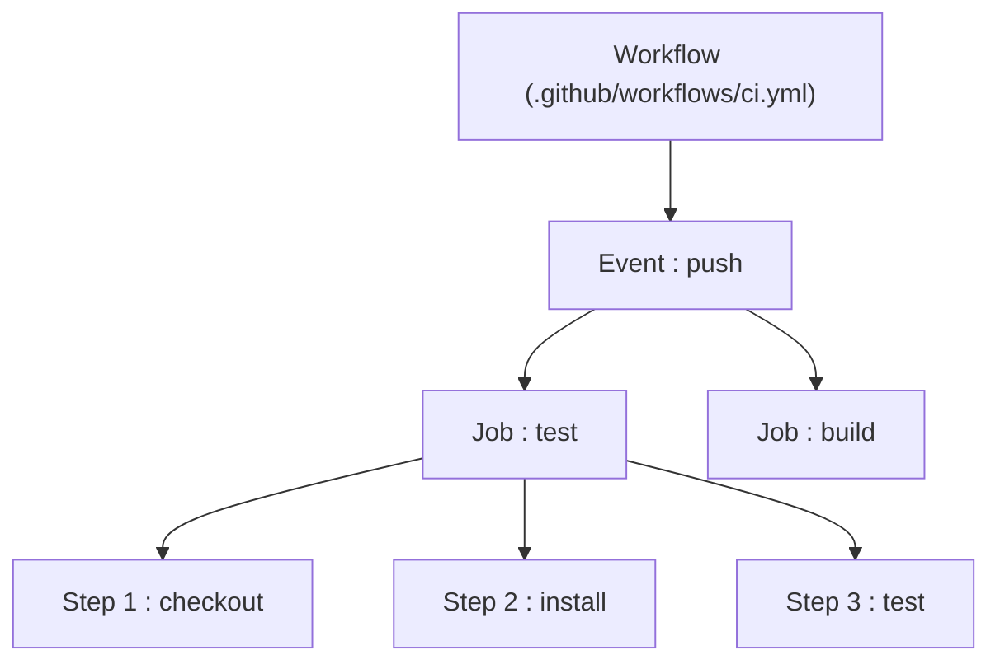
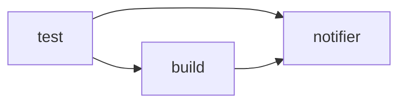

<div class="chapitre-titre-num">CHAPITRE 21 · 🟠 AVANCÉ</div>

# GitHub Actions

<div class="encadre objectif">
<span class="encadre-titre">🎯 Objectif du chapitre</span>
Maîtriser le vocabulaire et la syntaxe de GitHub Actions (workflow, event, job, step, runner, action, secrets, artifacts, environments), et construire plusieurs workflows réels. Ce chapitre transforme enfin en outil concret tout ce que les chapitres 19 et 20 ont posé conceptuellement.
</div>

<div class="encadre scenario">
<span class="encadre-titre">🎬 Mise en situation</span>
GitHub Actions est le moteur d'automatisation intégré directement à GitHub (chapitre 8) — pas besoin d'un service tiers séparé pour exécuter le pipeline générique du chapitre 19. Ce chapitre transforme la séquence manuelle de l'atelier 19.1 (`git clone`, `npm ci`, lint, test, build, exécutés à la main) en un fichier YAML qui s'exécute automatiquement à chaque push, sur des machines fournies gratuitement par GitHub.
</div>

## 21.1 Vocabulaire GitHub Actions

<div class="encadre retenir">
<span class="encadre-titre">📌 Cinq termes à maîtriser avant tout</span>
Un <strong>workflow</strong> est un fichier YAML complet (dans <code>.github/workflows/</code>) décrivant une automatisation. Un <strong>event</strong> (événement) déclenche ce workflow (`push`, `pull_request`, planification...). Un <strong>job</strong> est un ensemble d'étapes exécutées ensemble, sur une même machine. Un <strong>step</strong> (étape) est une action individuelle à l'intérieur d'un job. Un <strong>runner</strong> est la machine (fournie par GitHub, ou auto-hébergée) qui exécute réellement le job.
</div>



## 21.2 Premier workflow : le pipeline générique du chapitre 19

```yaml
# .github/workflows/ci.yml
name: CI

on:
  push:
    branches: [main]
  pull_request:
    branches: [main]

jobs:
  test:
    runs-on: ubuntu-latest
    steps:
      - name: Checkout du code
        uses: actions/checkout@v4

      - name: Installer Node.js
        uses: actions/setup-node@v4
        with:
          node-version: "20"
          cache: "npm"

      - name: Installer les dépendances
        run: npm ci

      - name: Linter
        run: npm run lint

      - name: Tests
        run: npm test

      - name: Build
        run: npm run build
```

**Explication ligne par ligne :** `on` définit les événements déclencheurs — ici, un push sur `main` ou une pull request ciblant `main` ; `runs-on: ubuntu-latest` choisit le type de runner (une machine Ubuntu fournie gratuitement par GitHub, avec des minutes gratuites mensuelles généreuses) ; `uses:` exécute une **action** réutilisable, un bloc de fonctionnalité préconstruit et partagé par la communauté (`actions/checkout` récupère le code, exactement l'étape "checkout" du chapitre 19) ; `run:` exécute une commande shell directement, comme dans les scripts du chapitre 10.

<div class="encadre astuce">
<span class="encadre-titre">💡 `cache: "npm"`, un détail qui change tout</span>
Cette seule ligne active la mise en cache automatique des dépendances npm entre les exécutions — exactement le même principe d'optimisation du cache que le Dockerfile du chapitre 12 (section 12.3), appliqué ici au pipeline CI lui-même : sans changement dans <code>package-lock.json</code>, l'installation des dépendances devient nettement plus rapide.
</div>

## 21.3 Secrets et variables

```yaml
jobs:
  deploy:
    runs-on: ubuntu-latest
    steps:
      - name: Déployer
        env:
          DEPLOY_KEY: ${{ secrets.DEPLOY_KEY }}
          API_URL: ${{ vars.API_URL }}
        run: |
          echo "Déploiement vers $API_URL"
          # utilisation de $DEPLOY_KEY sans jamais l'afficher
```

**Explication :** `secrets.NOM` récupère une valeur stockée dans GitHub Secrets (chapitre 8, section 8.6, approfondi au chapitre 25) — jamais affichée en clair dans les logs, même si le workflow tente explicitement de l'afficher (GitHub la masque automatiquement, remplacée par `***`) ; `vars.NOM` récupère une **variable** (non sensible, visible dans les logs sans problème) — la distinction entre les deux mécanismes reflète directement la sensibilité de la donnée.

<div class="encadre securite">
<span class="encadre-titre">🔒 Sécurité — secrets et pull requests externes</span>
Par défaut, les secrets ne sont <strong>pas</strong> accessibles aux workflows déclenchés par une pull request provenant d'un fork externe (un contributeur extérieur au projet) — une protection qui empêche quelqu'un d'ouvrir une pull request malveillante spécifiquement conçue pour exfiltrer des secrets via les logs du workflow.
</div>

## 21.4 Jobs multiples et dépendances entre jobs

```yaml
jobs:
  test:
    runs-on: ubuntu-latest
    steps:
      - uses: actions/checkout@v4
      - run: npm ci && npm test

  build:
    needs: test
    runs-on: ubuntu-latest
    steps:
      - uses: actions/checkout@v4
      - run: npm ci && npm run build
      - name: Sauvegarder le résultat du build
        uses: actions/upload-artifact@v4
        with:
          name: build-output
          path: dist/

  notifier:
    needs: [test, build]
    runs-on: ubuntu-latest
    if: always()
    steps:
      - run: echo "Pipeline terminé"
```

**Explication :** `needs: test` fait attendre le job `build` que `test` réussisse avant de démarrer — par défaut, tous les jobs d'un workflow s'exécutent **en parallèle**, `needs` impose un ordre explicite quand nécessaire ; `upload-artifact` sauvegarde un résultat (ici, le dossier `dist/` compilé) pour le rendre téléchargeable depuis l'interface GitHub, ou réutilisable par un job suivant ; `if: always()` fait s'exécuter `notifier` même si `test` ou `build` a échoué — utile pour une notification qui doit toujours partir, succès ou échec.



## 21.5 Environments et approbation manuelle

```yaml
jobs:
  deploy-production:
    runs-on: ubuntu-latest
    environment:
      name: production
      url: https://monsite.exemple.com
    steps:
      - run: echo "Déploiement en production"
```

**Explication :** `environment: production` relie ce job à l'Environment GitHub du même nom (chapitre 8, section 8.6) — si des règles de protection y sont configurées (approbation manuelle requise), le job **s'arrête et attend** cette approbation avant de continuer, l'implémentation concrète de Continuous Delivery (chapitre 20, section 20.2) plutôt que Continuous Deployment.

## 21.6 Déclenchements alternatifs

```yaml
on:
  push:
    branches: [main]
  schedule:
    - cron: "0 2 * * *"
  workflow_dispatch:
```

**Explication :** `schedule` avec une syntaxe cron (chapitre 5, section 5.5, identique) déclenche le workflow automatiquement à intervalle régulier — utile pour des tâches planifiées (rapports, nettoyages, chapitre 46) ; `workflow_dispatch` ajoute un bouton "Run workflow" dans l'interface GitHub, permettant un déclenchement manuel à la demande, indépendamment de tout push.

## Atelier — Construire un workflow multi-jobs complet

<div class="encadre exercice">
<span class="encadre-titre">🛠️ Atelier 21.1 — De zéro à un pipeline GitHub Actions fonctionnel</span>

**Objectif** : reproduire, sur un vrai dépôt GitHub, un workflow complet avec plusieurs jobs dépendants.

**Étapes détaillées** :

1. Sur un dépôt GitHub existant (ou nouveau) avec un projet Node.js simple, crée `.github/workflows/ci.yml` avec le contenu de la section 21.2.
2. Pousse ce fichier, observe l'onglet "Actions" du dépôt GitHub : le workflow se déclenche automatiquement.
3. Ajoute un second job `build` qui dépend de `test` (section 21.4), avec un `upload-artifact`.
4. Provoque volontairement un échec (une erreur de syntaxe temporaire, ou un test qui échoue), observe le statut rouge et les logs détaillés de l'étape en échec.
5. Corrige, pousse à nouveau, observe le retour au vert.

**Résultat attendu** : un historique visible de chaque exécution dans l'onglet "Actions", avec un statut clair par job et par étape — l'automatisation complète du pipeline manuel de l'atelier 19.1.
</div>

## Erreurs fréquentes

<div class="encadre attention">
<span class="encadre-titre">⚠️ Erreur n°1 — Oublier `actions/checkout` en première étape</span>
Sans cette étape, le runner démarre sur une machine **vide**, sans le code du projet — presque toutes les commandes suivantes échoueraient immédiatement. `actions/checkout@v4` est quasiment toujours la toute première étape de n'importe quel job qui manipule du code.
</div>

<div class="encadre attention">
<span class="encadre-titre">⚠️ Erreur n°2 — Afficher un secret dans les logs par accident</span>
GitHub masque automatiquement une valeur exactement identique à un secret connu, mais une transformation du secret (par exemple encodé en base64 dans le log) peut échapper à ce masquage — ne jamais manipuler ni transformer un secret d'une façon qui pourrait le rendre visible indirectement.
</div>

<div class="encadre attention">
<span class="encadre-titre">⚠️ Erreur n°3 — Jobs qui devraient dépendre les uns des autres, mais s'exécutent en parallèle par erreur</span>
Sans `needs:`, tous les jobs d'un workflow démarrent en parallèle — un job `deploy` sans `needs: test` pourrait démarrer avant même que les tests ne soient terminés, un risque sérieux si `deploy` n'est pas censé s'exécuter en cas d'échec des tests.
</div>

## En entreprise

**Réalité répandue** : GitHub Actions, du fait de son intégration native et de ses minutes gratuites généreuses, est devenu l'un des outils de CI/CD les plus utilisés pour les projets hébergés sur GitHub — une alternative à des outils historiquement plus établis comme Jenkins, avec une courbe d'apprentissage sensiblement plus douce.

**Bonne pratique répandue** : les workflows complexes sont souvent décomposés en fichiers réutilisables ("reusable workflows" ou "composite actions") plutôt qu'un unique fichier YAML géant et difficile à maintenir — une pratique qui dépasse le périmètre de ce chapitre introductif mais mérite d'être connue en évoluant vers des pipelines plus sophistiqués.

**Erreur classique observée** : des minutes de CI gratuites épuisées par des workflows mal optimisés (sans cache, avec des jobs redondants) sur des dépôts très actifs, forçant un passage prématuré à un plan payant qu'une meilleure optimisation (section 21.2, cache) aurait pu éviter ou retarder significativement.

## Entretien technique

<div class="encadre exercice">
<span class="encadre-titre">💼 Questions fréquemment posées en entretien</span>

**Q1. "Quelle est la différence entre un job et un step dans GitHub Actions ?"**
Réponse attendue : un job est un ensemble d'étapes exécutées ensemble sur une même machine (runner) ; un step est une action individuelle à l'intérieur d'un job. Par défaut, plusieurs jobs d'un même workflow s'exécutent en parallèle, sauf dépendance explicite via `needs` (section 21.1 et 21.4).

**Q2. "Comment GitHub Actions protège-t-il un secret dans les logs ?"**
Réponse attendue : toute valeur correspondant exactement à un secret connu est automatiquement masquée dans les logs, remplacée par `***` — mais une transformation du secret peut échapper à cette protection (section 21.3 et erreur fréquente n°2).

**Q3. "Comment implémenterais-tu une approbation manuelle avant un déploiement en production avec GitHub Actions ?"**
Réponse attendue : en liant le job de déploiement à un GitHub Environment configuré avec une règle de protection exigeant une approbation, ce qui met le job en pause jusqu'à validation humaine (section 21.5).
</div>

## Optimisation, sécurité et maintenabilité — les réflexes dès ce chapitre

<div class="encadre securite">
<span class="encadre-titre">🔒 Sécurité</span>
Épingle la version des actions tierces utilisées (`actions/checkout@v4`, jamais `@main` ou une version non précisée) — une action tierce compromise ou modifiée pourrait autrement injecter du code malveillant directement dans ton pipeline, un risque de supply chain approfondi au chapitre 35.
</div>

<div class="encadre bonne-pratique">
<span class="encadre-titre">✅ Maintenabilité</span>
Nomme chaque step explicitement (`name:`) plutôt que de laisser GitHub afficher la commande brute — un historique de workflow lisible fait gagner un temps précieux en diagnostic, exactement le même principe que des noms de conteneurs explicites au chapitre 11.
</div>

<div class="encadre performance">
<span class="encadre-titre">🚀 Performance</span>
Le cache des dépendances (`cache: "npm"`, section 21.2) et l'exécution en parallèle des jobs indépendants (section 21.4) réduisent significativement le temps total d'un pipeline — un levier direct sur le "lead time" évoqué depuis le chapitre 1.
</div>

## Résumé du chapitre

- Workflow (fichier YAML), event (déclencheur), job (ensemble d'étapes), step (action individuelle), runner (machine d'exécution) sont le vocabulaire de base de GitHub Actions.
- Le pipeline générique du chapitre 19 se traduit directement en un fichier `.github/workflows/ci.yml`.
- `secrets` (masqués) et `vars` (non sensibles) distinguent les deux types de valeurs externes injectées dans un workflow.
- `needs` impose un ordre entre jobs, par défaut exécutés en parallèle ; `upload-artifact` sauvegarde un résultat entre jobs ou pour téléchargement.
- Les GitHub Environments avec règles de protection implémentent Continuous Delivery avec approbation manuelle.

## Quiz

<div class="encadre exercice">
<span class="encadre-titre">📝 QCM (une seule bonne réponse par question)</span>

1. Sans `needs:`, plusieurs jobs d'un même workflow s'exécutent :
   - a) Toujours dans l'ordre du fichier
   - b) En parallèle
   - c) Jamais simultanément
   - d) Uniquement sur demande manuelle

2. `secrets.NOM_SECRET` dans un workflow :
   - a) Affiche toujours la valeur en clair dans les logs
   - b) Est automatiquement masqué dans les logs s'il y apparaît
   - c) N'est accessible qu'en dehors de GitHub Actions
   - d) Doit être écrit directement dans le fichier YAML

3. La toute première étape d'un job qui manipule du code est presque toujours :
   - a) `actions/upload-artifact`
   - b) `actions/checkout`
   - c) `npm test`
   - d) `workflow_dispatch`

**Corrigé** : 1-b, 2-b, 3-b.
</div>

<div class="encadre exercice">
<span class="encadre-titre">📝 Vrai ou Faux</span>

1. Les secrets GitHub Actions sont accessibles par défaut aux workflows déclenchés par une pull request d'un fork externe. — **Faux** (section 21.3).
2. `workflow_dispatch` ajoute un bouton de déclenchement manuel dans l'interface GitHub. — **Vrai** (section 21.6).
3. Un GitHub Environment avec règle de protection peut mettre un job en pause jusqu'à approbation humaine. — **Vrai** (section 21.5).

</div>

## Exercices

<div class="encadre exercice">
<span class="encadre-titre">📝 Exercice 21.1</span>

Écris un workflow qui se déclenche uniquement sur les pull requests (pas sur push direct vers `main`), exécute les tests, et affiche "Tests réussis" uniquement si le job précédent a réussi.
</div>

**Corrigé :**
```yaml
name: Vérification PR

on:
  pull_request:
    branches: [main]

jobs:
  test:
    runs-on: ubuntu-latest
    steps:
      - uses: actions/checkout@v4
      - uses: actions/setup-node@v4
        with:
          node-version: "20"
      - run: npm ci
      - run: npm test

  confirmation:
    needs: test
    runs-on: ubuntu-latest
    steps:
      - run: echo "Tests réussis"
```

## Checklist de fin de chapitre

<ul class="checklist">
<li>☐ Je connais le vocabulaire GitHub Actions (workflow, event, job, step, runner, action).</li>
<li>☐ Je sais écrire un workflow qui reproduit le pipeline générique du chapitre 19.</li>
<li>☐ Je sais utiliser `secrets` et `vars` correctement selon la sensibilité de la donnée.</li>
<li>☐ Je sais faire dépendre un job d'un autre avec `needs`, et sauvegarder un résultat avec `upload-artifact`.</li>
<li>☐ Je sais configurer une approbation manuelle via un GitHub Environment protégé.</li>
<li>☐ Je sais épingler la version des actions tierces utilisées.</li>
</ul>

## FAQ

<dl class="faq">
<dt>GitHub Actions est-il gratuit ?</dt>
<dd>Oui, avec un quota généreux de minutes gratuites par mois pour les dépôts privés (illimité pour les dépôts publics), largement suffisant pour l'apprentissage et la plupart des petits projets de ce manuel.</dd>

<dt>Peut-on utiliser ses propres machines plutôt que celles fournies par GitHub ?</dt>
<dd>Oui, via des "self-hosted runners" — une machine que tu contrôles (par exemple ton serveur de laboratoire) exécute alors les jobs, utile pour des besoins spécifiques (accès à un réseau interne, matériel particulier) non couverts par les runners standards de GitHub.</dd>

<dt>Faut-il connaître YAML en profondeur pour utiliser GitHub Actions ?</dt>
<dd>Non, une compréhension de base de l'indentation et de la structure clé-valeur de YAML (déjà croisée avec Docker Compose au chapitre 13) suffit largement pour les cas d'usage de ce manuel.</dd>
</dl>

## Références et pour aller plus loin

- Documentation officielle GitHub Actions : [https://docs.github.com/actions](https://docs.github.com/actions)
- GitHub Marketplace — catalogue des actions réutilisables partagées par la communauté : [https://github.com/marketplace?type=actions](https://github.com/marketplace?type=actions)
- `actions/starter-workflows` — modèles de workflows officiels par langage/framework : [https://github.com/actions/starter-workflows](https://github.com/actions/starter-workflows)

*Chapitre suivant : premier pipeline CI/CD complet — une vraie application Node.js, du push jusqu'au déploiement, avec tous les fichiers nécessaires fournis intégralement.*
