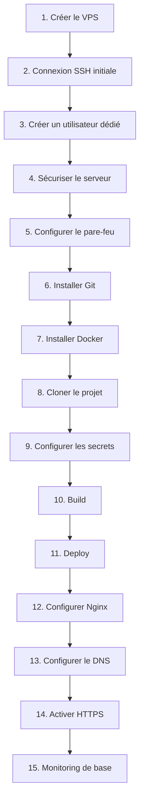

<div class="chapitre-titre-num">CHAPITRE 26 · 🟠 AVANCÉ</div>

# Déploiement sur VPS, guide complet

<div class="encadre objectif">
<span class="encadre-titre">🎯 Objectif du chapitre</span>
Dérouler, sans aucune étape implicite, la procédure complète de mise en production d'une application sur un VPS : créer le serveur, se connecter, créer un utilisateur, sécuriser, configurer le pare-feu, installer Git et Docker, cloner le projet, configurer les secrets, construire, déployer, configurer Nginx, le DNS, HTTPS, et le monitoring de base. Ce chapitre est la synthèse pratique de tout ce que la Partie II à la Partie VIII ont construit séparément.
</div>

<div class="encadre scenario">
<span class="encadre-titre">🎬 Mise en situation</span>
Jusqu'ici, chaque chapitre a travaillé sur ton serveur de laboratoire, déjà configuré depuis le chapitre 3. Ce chapitre repart d'une page blanche absolue : un VPS tout juste créé, sans rien dessus, et déroule dans l'ordre exact chaque étape nécessaire jusqu'à une application réellement en production, accessible via un nom de domaine, en HTTPS, surveillée. C'est le chapitre à suivre littéralement, étape par étape, le jour où tu déploieras un vrai projet pour un vrai client.
</div>

## 26.1 Vue d'ensemble de la procédure complète



Chaque étape numérotée ci-dessous renvoie explicitement au chapitre qui la détaille en profondeur — ce chapitre **assemble**, il ne réexplique pas ce qui l'a déjà été.

## 26.2 Étape 1 — Créer le VPS

Choisir un fournisseur (DigitalOcean, Vultr, OVH, Contabo, ou tout autre), une image **Ubuntu Server 24.04 LTS**, une configuration adaptée à la charge attendue (1-2 vCPU / 1-2 Go de RAM suffisent pour la majorité des applications de ce manuel), et une authentification par **clé SSH** dès la création (chapitre 6) plutôt que par mot de passe.

<div class="encadre bonne-pratique">
<span class="encadre-titre">✅ Rappel du chapitre 3</span>
Cette étape reprend exactement l'option A du chapitre 3 (section 3.6) — si tu as suivi ce manuel depuis le début avec l'option B (VM locale), c'est le moment de basculer vers un vrai VPS pour un déploiement réel avec nom de domaine et HTTPS.
</div>

## 26.3 Étape 2 — Connexion SSH initiale

```bash
ssh root@adresse_ip_du_vps
```

À ce stade, la connexion se fait encore en `root` (chapitre 6, avant durcissement) — c'est la toute première et unique fois dans ce guide où c'est acceptable, uniquement pour créer l'utilisateur dédié de l'étape suivante.

## 26.4 Étape 3 — Créer un utilisateur dédié

```bash
adduser deploiement
usermod -aG sudo deploiement
rsync --archive --chown=deploiement:deploiement ~/.ssh /home/deploiement
```

**Explication** (chapitre 5, section 5.1) : `rsync` copie la clé publique déjà autorisée pour `root` vers le nouvel utilisateur, permettant à `deploiement` de se connecter immédiatement par clé, sans étape manuelle supplémentaire de copie de clé.

```bash
exit
ssh deploiement@adresse_ip_du_vps
```

## 26.5 Étape 4 — Sécuriser le serveur (SSH)

Reprendre intégralement le chapitre 6 (section 6.5) : désactiver `PasswordAuthentication`, désactiver `PermitRootLogin`, en gardant toujours une session de secours active pendant la vérification.

```bash
sudo nano /etc/ssh/sshd_config
# PasswordAuthentication no
# PermitRootLogin no
sudo systemctl restart sshd
```

## 26.6 Étape 5 — Configurer le pare-feu

Reprendre le chapitre 5 (section 5.4) : autoriser SSH **avant** d'activer UFW, sans exception.

```bash
sudo apt update && sudo apt install -y ufw
sudo ufw allow OpenSSH
sudo ufw allow 80/tcp
sudo ufw allow 443/tcp
sudo ufw enable
```

## 26.7 Étapes 6-7 — Installer Git et Docker

```bash
sudo apt install -y git
```

Puis la procédure complète d'installation de Docker Engine du chapitre 3 (section 3.5) :

```bash
sudo apt install -y ca-certificates curl
sudo install -m 0755 -d /etc/apt/keyrings
sudo curl -fsSL https://download.docker.com/linux/ubuntu/gpg -o /etc/apt/keyrings/docker.asc
sudo chmod a+r /etc/apt/keyrings/docker.asc
echo "deb [arch=$(dpkg --print-architecture) signed-by=/etc/apt/keyrings/docker.asc] https://download.docker.com/linux/ubuntu $(. /etc/os-release && echo "$VERSION_CODENAME") stable" | sudo tee /etc/apt/sources.list.d/docker.list > /dev/null
sudo apt update
sudo apt install -y docker-ce docker-ce-cli containerd.io docker-buildx-plugin docker-compose-plugin
sudo usermod -aG docker deploiement
```

<div class="encadre attention">
<span class="encadre-titre">⚠️ Se reconnecter après l'ajout au groupe docker</span>
Rappel du chapitre 3 (section 3.5) : déconnecte-toi et reconnecte-toi après cette commande pour que le nouveau groupe soit pris en compte.
</div>

## 26.8 Étape 8 — Cloner le projet

```bash
git clone git@github.com:ton-compte/ton-projet.git
cd ton-projet
```

<div class="encadre astuce">
<span class="encadre-titre">💡 Clé SSH dédiée au déploiement</span>
Pour un accès en lecture seule au dépôt (souvent suffisant sur un serveur de production), génère une clé SSH dédiée (chapitre 6) et configure-la comme "deploy key" en lecture seule dans les paramètres du dépôt GitHub — plutôt que ta clé personnelle avec accès complet.
</div>

## 26.9 Étape 9 — Configurer les secrets

Reprendre le chapitre 25 : créer le fichier `.env` réel sur le serveur, jamais versionné, à partir de `.env.example` (chapitre 18).

```bash
cp .env.example .env
nano .env
```

## 26.10 Étapes 10-11 — Build et Deploy

```bash
docker compose build
docker compose up -d
docker compose ps
```

**Vérification** (chapitre 10, `healthcheck.sh`) :

```bash
curl -f http://localhost:3000/health
```

## 26.11 Étape 12 — Configurer Nginx

Reprendre le chapitre 15 : Nginx comme reverse proxy devant l'application, avec les en-têtes `proxy_set_header` corrects.

```bash
sudo apt install -y nginx
sudo nano /etc/nginx/sites-available/ton-projet.conf
sudo ln -s /etc/nginx/sites-available/ton-projet.conf /etc/nginx/sites-enabled/
sudo nginx -t
sudo systemctl reload nginx
```

## 26.12 Étape 13 — Configurer le DNS

Reprendre le chapitre 17 : enregistrement A vers l'IP du VPS, CNAME pour `www`, vérification avec `dig` avant de continuer.

## 26.13 Étape 14 — Activer HTTPS

Reprendre le chapitre 16 : Certbot avec le plugin Nginx, vérification du renouvellement automatique.

```bash
sudo apt install -y certbot python3-certbot-nginx
sudo certbot --nginx -d ton-domaine.com -d www.ton-domaine.com
sudo certbot renew --dry-run
```

## 26.14 Étape 15 — Monitoring de base

<div class="encadre astuce">
<span class="encadre-titre">💡 Un premier niveau de monitoring, avant la Partie X</span>
La Partie X (chapitres 32-34) couvre le monitoring en profondeur. Pour ce guide de déploiement, un premier niveau minimal suffit : une tâche cron (chapitre 5) exécutant `healthcheck.sh` (chapitre 10) toutes les 5 minutes, avec une alerte simple (email ou webhook) en cas d'échec.
</div>

```bash
crontab -e
```
```text
*/5 * * * * /home/deploiement/ton-projet/scripts/healthcheck.sh || curl -X POST https://hooks.exemple.com/alerte
```

## Atelier — Dérouler la procédure complète sur un nouveau VPS

<div class="encadre exercice">
<span class="encadre-titre">🛠️ Atelier 26.1 — De zéro à la production, sans sauter une étape</span>

**Objectif** : exécuter, sur un VPS fraîchement créé, l'intégralité des 15 étapes de ce chapitre, dans l'ordre, sans en sauter une seule.

**Étapes détaillées** : suis les sections 26.2 à 26.14 dans l'ordre exact, en cochant chaque étape de la checklist de fin de chapitre au fur et à mesure.

**Résultat attendu** : une application réelle, accessible via un nom de domaine, en HTTPS valide, avec un utilisateur dédié non-root, un pare-feu actif, et une vérification de santé automatique — la synthèse concrète de 25 chapitres précédents.

**Dépannage** : en cas de blocage à une étape précise, reviens directement au chapitre référencé pour cette étape plutôt que de tâtonner — chaque section de ce chapitre a été volontairement gardée courte, le détail complet vivant dans le chapitre d'origine.
</div>

## Erreurs fréquentes

<div class="encadre attention">
<span class="encadre-titre">⚠️ Erreur n°1 — Sauter une étape de sécurité "pour aller plus vite"</span>
Chaque étape de sécurité de ce guide (utilisateur dédié, durcissement SSH, pare-feu) a été justifiée en détail dans son chapitre d'origine — en sauter une "temporairement" mène presque toujours à l'oubli pur et simple de la corriger plus tard, une fois l'application en production et fonctionnelle.
</div>

<div class="encadre attention">
<span class="encadre-titre">⚠️ Erreur n°2 — Configurer HTTPS avant que le DNS ne pointe réellement vers le serveur</span>
Rappel du chapitre 16 (erreur fréquente n°1) : Certbot échoue systématiquement si le DNS n'a pas encore propagé — respecter l'ordre des étapes 13 puis 14, jamais l'inverse.
</div>

<div class="encadre attention">
<span class="encadre-titre">⚠️ Erreur n°3 — Aucune vérification de santé après déploiement</span>
Un déploiement "terminé" sans vérification finale (étape 11, healthcheck) peut laisser une application démarrée mais non fonctionnelle passer inaperçue jusqu'à ce qu'un utilisateur réel tombe sur l'erreur.
</div>

## En entreprise

**Réalité répandue** : cette procédure manuelle, bien que complète et correcte, est rarement répétée entièrement à la main au-delà du tout premier déploiement d'un projet — les chapitres suivants (27, automatisation complète ; 37-38, Infrastructure as Code) transforment cette même séquence en quelque chose de reproductible sans intervention manuelle répétée.

**Bonne pratique répandue** : documenter cette procédure précisément pour chaque projet (souvent sous forme d'un `DEPLOYMENT.md` dans le dépôt), même une fois automatisée, pour qu'elle reste compréhensible et reproductible manuellement en cas de défaillance de l'automatisation elle-même.

**Erreur classique observée** : un premier déploiement manuel réussi, jamais documenté précisément, dont les détails exacts (quelles étapes, dans quel ordre, quelles valeurs de configuration) se perdent progressivement — rendant un futur second déploiement (nouveau serveur, nouvel environnement) bien plus laborieux qu'il ne devrait l'être.

## Entretien technique

<div class="encadre exercice">
<span class="encadre-titre">💼 Questions fréquemment posées en entretien</span>

**Q1. "Décris, dans l'ordre, les grandes étapes d'un déploiement complet sur un VPS vierge."**
Réponse attendue : reprendre la structure du schéma de la section 26.1 — création, connexion initiale, utilisateur dédié, sécurisation, pare-feu, outils (Git, Docker), récupération du code, secrets, build, deploy, reverse proxy, DNS, HTTPS, monitoring.

**Q2. "Pourquoi configurer le DNS avant HTTPS, jamais l'inverse ?"**
Réponse attendue : Let's Encrypt vérifie la propriété du domaine via une requête qui doit atteindre le bon serveur — sans propagation DNS complète au préalable, cette vérification échoue systématiquement (section 26.13, rappel du chapitre 16).

**Q3. "Pourquoi ne jamais rester connecté en root après la création de l'utilisateur dédié ?"**
Réponse attendue : principe du moindre privilège (chapitres 4, 5) — un compte nominatif avec `sudo` limite l'impact d'une erreur ou d'une compromission, contrairement à un usage permanent de root (section 26.4).
</div>

## Optimisation, sécurité et maintenabilité — les réflexes dès ce chapitre

<div class="encadre securite">
<span class="encadre-titre">🔒 Sécurité</span>
Les 15 étapes de ce chapitre représentent le minimum non négociable avant qu'une application ne soit réellement exposée à Internet — aucune ne devrait être considérée optionnelle pour un vrai déploiement client.
</div>

<div class="encadre bonne-pratique">
<span class="encadre-titre">✅ Maintenabilité</span>
Transforme ce chapitre en checklist personnelle réutilisable (un fichier `DEPLOIEMENT.md` dans chacun de tes projets) — le déploiement suivant, sur un projet différent, ira sensiblement plus vite avec cette référence déjà adaptée à tes habitudes.
</div>

<div class="encadre performance">
<span class="encadre-titre">🚀 Performance</span>
Un VPS correctement dimensionné dès le départ (section 26.2) évite un redimensionnement d'urgence en pleine charge de production — la Partie XIV (performance, scalabilité) approfondit comment anticiper ce besoin.
</div>

## Résumé du chapitre

- Ce chapitre assemble, dans l'ordre exact, 15 étapes déjà détaillées dans les chapitres précédents : création du VPS, sécurisation, outils, déploiement applicatif, reverse proxy, DNS, HTTPS, monitoring de base.
- L'ordre des étapes n'est jamais arbitraire : sécuriser avant d'exposer, DNS avant HTTPS, déployer avant de vérifier.
- Ce guide manuel est la référence à suivre pour un premier déploiement ; les chapitres suivants l'automatisent progressivement.
- Documenter cette procédure pour chaque projet réel facilite grandement tout déploiement futur.

## Quiz

<div class="encadre exercice">
<span class="encadre-titre">📝 QCM (une seule bonne réponse par question)</span>

1. La toute première connexion à un VPS fraîchement créé se fait généralement :
   - a) Avec un utilisateur dédié déjà créé
   - b) En root, uniquement pour créer l'utilisateur dédié
   - c) Sans authentification
   - d) Directement via Nginx

2. Le pare-feu (UFW) doit être activé :
   - a) Avant d'autoriser SSH
   - b) Après avoir explicitement autorisé SSH
   - c) Jamais sur un VPS de production
   - d) Uniquement après avoir configuré HTTPS

3. HTTPS (Certbot) doit être configuré :
   - a) Avant que le DNS ne pointe vers le serveur
   - b) Après que le DNS pointe réellement vers le serveur
   - c) Sans rapport avec le DNS
   - d) Uniquement en environnement de développement

**Corrigé** : 1-b, 2-b, 3-b.
</div>

<div class="encadre exercice">
<span class="encadre-titre">📝 Vrai ou Faux</span>

1. Il est acceptable de rester connecté en root de façon permanente après le déploiement initial, pour simplifier les futures interventions. — **Faux** (section 26.4 et chapitre 5).
2. Une vérification de santé (healthcheck) après déploiement est optionnelle si aucune erreur n'apparaît dans les logs. — **Faux** (section "Erreurs fréquentes", erreur n°3).
3. Documenter cette procédure pour chaque projet facilite les déploiements futurs. — **Vrai** (section "En entreprise").

</div>

## Exercices

<div class="encadre exercice">
<span class="encadre-titre">📝 Exercice 26.1</span>

Un déploiement échoue à l'étape HTTPS (Certbot renvoie une erreur de vérification de domaine). En te basant sur l'ordre des étapes de ce chapitre, quelle est la cause la plus probable, et comment la vérifier ?
</div>

**Corrigé :** la cause la plus probable est que le DNS n'a pas encore fini de se propager, ou n'a pas été configuré correctement avant de lancer Certbot (section 26.13, ordre des étapes 13 puis 14). Vérifier avec `dig ton-domaine.com A` (chapitre 17) que le domaine pointe bien vers l'IP exacte du VPS, et éventuellement avec un outil multi-résolveurs (`whatsmydns.net`) pour confirmer une propagation complète avant de relancer Certbot.

## Checklist de fin de chapitre

<ul class="checklist">
<li>☐ VPS créé (Ubuntu Server 24.04 LTS, authentification par clé SSH).</li>
<li>☐ Utilisateur dédié créé, avec accès `sudo` et clé SSH fonctionnelle.</li>
<li>☐ SSH durci (`PasswordAuthentication no`, `PermitRootLogin no`), vérifié avec session de secours.</li>
<li>☐ Pare-feu UFW actif (SSH autorisé avant activation).</li>
<li>☐ Git et Docker installés, utilisateur ajouté au groupe `docker`.</li>
<li>☐ Projet cloné, `.env` configuré à partir de `.env.example`.</li>
<li>☐ `docker compose build && up -d` exécuté avec succès, healthcheck vérifié.</li>
<li>☐ Nginx configuré en reverse proxy, `nginx -t` validé avant `reload`.</li>
<li>☐ DNS configuré et propagation vérifiée avec `dig`.</li>
<li>☐ HTTPS activé avec Certbot, renouvellement automatique vérifié (`--dry-run`).</li>
<li>☐ Monitoring de base en place (tâche cron de vérification de santé).</li>
</ul>

## FAQ

<dl class="faq">
<dt>Ce guide fonctionne-t-il pour n'importe quel type d'application ?</dt>
<dd>Oui dans ses grandes lignes — seules les étapes 8-10 (récupération du code, build) varient selon le langage/framework (chapitre 12), tout le reste (sécurisation, réseau, HTTPS) reste identique quelle que soit l'application déployée.</dd>

<dt>Combien de temps prend ce déploiement complet, la première fois ?</dt>
<dd>Comptez une à deux heures pour une première exécution complète et attentive, en incluant la propagation DNS (qui peut représenter une pause d'attente) — bien plus rapide dès la deuxième fois, une fois la procédure familière.</dd>

<dt>Que faire si mon application nécessite plusieurs services (base de données, cache) en plus de l'application elle-même ?</dt>
<dd>Le chapitre 13 (Docker Compose) couvre déjà cette architecture multi-conteneurs — les étapes 10-11 de ce chapitre (build/deploy) s'appliquent alors à l'ensemble du fichier `compose.yaml`, sans rien changer aux autres étapes.</dd>
</dl>

## Références et pour aller plus loin

- Récapitulatif des chapitres référencés dans ce guide : 3 (environnement), 5-6 (Linux/SSH), 10 (scripts), 11-14 (Docker), 15-18 (réseau/environnements), 25 (secrets).
- DigitalOcean — tutoriels de référence sur le déploiement initial d'un VPS Ubuntu : [https://www.digitalocean.com/community/tutorial_collections/initial-server-setup-with-ubuntu](https://www.digitalocean.com/community/tutorial_collections/initial-server-setup-with-ubuntu)

*Chapitre suivant : déploiement automatique de bout en bout — connecter ce guide manuel à GitHub Actions, pour qu'un simple `git push` reproduise automatiquement les étapes 8 à 15 de ce chapitre.*
