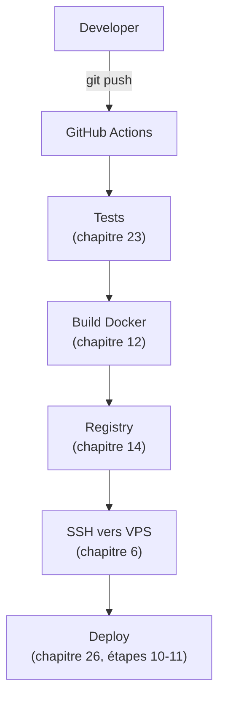

<div class="chapitre-titre-num">CHAPITRE 27 · 🟠 AVANCÉ</div>

# Déploiement automatique de bout en bout

<div class="encadre objectif">
<span class="encadre-titre">🎯 Objectif du chapitre</span>
Connecter le pipeline GitHub Actions du chapitre 22 au guide de déploiement manuel complet du chapitre 26, pour qu'un simple `git push` reproduise automatiquement les étapes 8 à 15 (récupération du code jusqu'au monitoring de base) — sans plus jamais avoir besoin de se connecter manuellement en SSH pour déployer.
</div>

<div class="encadre scenario">
<span class="encadre-titre">🎬 Mise en situation</span>
Le chapitre 26 a montré comment déployer manuellement, une fois, avec la plus grande rigueur. Ce chapitre répond à la question naturelle qui suit : comment répéter cette même rigueur à chaque changement, sans jamais avoir à retaper les commandes manuellement ? La réponse assemble tout ce que ce manuel a construit depuis le chapitre 21 (GitHub Actions) jusqu'au chapitre 26.
</div>

## 27.1 Le schéma complet



Ce schéma n'introduit aucun concept nouveau — c'est exactement le pipeline du chapitre 22 (section 22.3), déjà construit et vérifié, désormais explicitement relié à la procédure complète du chapitre 26.

## 27.2 Le workflow complet, annoté étape par étape du chapitre 26

```yaml
name: Déploiement automatique complet

on:
  push:
    branches: [main]

env:
  IMAGE_NAME: ghcr.io/${{ github.repository }}

jobs:
  test:
    runs-on: ubuntu-latest
    steps:
      - uses: actions/checkout@v4
      - uses: actions/setup-node@v4
        with: { node-version: "20", cache: "npm" }
      - run: npm ci
      - run: npx eslint .          # chapitre 24
      - run: npx prettier --check . # chapitre 24
      - run: npm test               # chapitre 23

  build-and-push:
    needs: test
    runs-on: ubuntu-latest
    permissions: { contents: read, packages: write }
    steps:
      - uses: actions/checkout@v4
      - uses: docker/login-action@v3
        with: { registry: ghcr.io, username: "${{ github.actor }}", password: "${{ secrets.GITHUB_TOKEN }}" }
      - uses: docker/build-push-action@v6
        with:
          context: .
          push: true
          tags: "${{ env.IMAGE_NAME }}:${{ github.sha }},${{ env.IMAGE_NAME }}:latest"

  deploy:
    needs: build-and-push
    runs-on: ubuntu-latest
    environment: { name: production, url: "https://ton-domaine.com" }
    steps:
      - name: "Étapes 10-11 du chapitre 26 : build et deploy sur le VPS"
        uses: appleboy/ssh-action@v1
        with:
          host: ${{ secrets.SERVEUR_IP }}
          username: ${{ secrets.SERVEUR_UTILISATEUR }}
          key: ${{ secrets.SERVEUR_CLE_SSH }}
          script: |
            cd /home/deploiement/ton-projet
            docker pull ${{ env.IMAGE_NAME }}:${{ github.sha }}
            sed -i "s|image:.*|image: ${{ env.IMAGE_NAME }}:${{ github.sha }}|" docker-compose.override.yml
            docker compose up -d
            sleep 5
            curl -f http://localhost:3000/health

      - name: "Étape 15 du chapitre 26 : vérification finale via le domaine public"
        run: |
          sleep 5
          curl -f https://ton-domaine.com/health
```

**Explication des ajouts par rapport au chapitre 22 :** le job `test` inclut désormais linting et formatage (chapitre 24), pas seulement les tests fonctionnels ; le déploiement utilise `docker-compose.override.yml` (un fichier séparé, non versionné avec la même rigueur que le fichier principal, qui ne fait que surcharger le tag d'image à utiliser, chapitre 13, section 13.5) plutôt qu'un simple `docker run`, pour rester cohérent avec une architecture Compose complète (chapitre 13) ; une vérification finale interroge le **domaine public réel** (`https://ton-domaine.com`), pas seulement `localhost` — confirmant que Nginx (chapitre 15) et HTTPS (chapitre 16) fonctionnent aussi, pas uniquement le conteneur applicatif lui-même.

## 27.3 Ce qui reste volontairement manuel : la première installation

<div class="encadre retenir">
<span class="encadre-titre">📌 Le chapitre 26 reste nécessaire une première fois</span>
Ce workflow automatise le <strong>redéploiement</strong> d'une application déjà installée — il suppose que les étapes 1 à 9 du chapitre 26 (création du VPS, sécurisation, installation de Docker et Nginx, premier clone, premier `.env`) ont déjà été faites manuellement, une seule fois. Automatiser <em>cette première installation</em> elle-même est le sujet de la Partie XII (Infrastructure as Code, notamment Terraform, chapitre 38) — une distinction importante entre "provisionner un serveur" et "déployer une application sur un serveur déjà prêt".
</div>

## 27.4 Notifications de déploiement

```yaml
      - name: Notifier le résultat
        if: always()
        run: |
          STATUT="${{ job.status }}"
          curl -X POST https://hooks.exemple.com/notifications \
            -H "Content-Type: application/json" \
            -d "{\"texte\": \"Déploiement ${{ github.sha }} : $STATUT\"}"
```

**Cas pratique DevOps :** `if: always()` (chapitre 21, section 21.4) garantit que cette notification part que le déploiement ait réussi ou échoué — une équipe qui ne découvre un déploiement raté que par un utilisateur mécontent a un problème d'observabilité, pas seulement de déploiement (Partie X approfondit ce sujet).

## Atelier — Automatiser le déploiement manuel du chapitre 26

<div class="encadre exercice">
<span class="encadre-titre">🛠️ Atelier 27.1 — Ne plus jamais se connecter manuellement en SSH pour déployer</span>

**Objectif** : transformer le déploiement manuel de l'atelier 26.1 en pipeline entièrement automatisé.

**Étapes détaillées** :

1. Sur le serveur déjà configuré à l'atelier 26.1, crée un `docker-compose.override.yml` minimal ne contenant que le tag d'image à surcharger.
2. Ajoute le workflow de la section 27.2 au dépôt, avec les mêmes secrets qu'au chapitre 22 (section 22.4).
3. Pousse un changement mineur sur `main`, observe le pipeline s'exécuter entièrement : tests, qualité, build, push, déploiement, vérification finale via le domaine public.
4. Vérifie, sans jamais te connecter toi-même en SSH, que le changement est bien visible sur `https://ton-domaine.com`.

**Résultat attendu** : la boucle complète, du `git push` initial jusqu'à la vérification finale sur le vrai domaine public, sans aucune commande manuelle sur le serveur — la synthèse opérationnelle de 27 chapitres.
</div>

## Erreurs fréquentes

<div class="encadre attention">
<span class="encadre-titre">⚠️ Erreur n°1 — Automatiser un déploiement sans avoir d'abord validé la procédure manuellement</span>
Automatiser directement, sans être passé par le chapitre 26 au moins une fois manuellement, revient à automatiser une procédure jamais réellement vérifiée — en cas d'échec du pipeline automatique, personne ne sait alors si le problème vient de l'automatisation elle-même ou d'une étape jamais correctement comprise.
</div>

<div class="encadre attention">
<span class="encadre-titre">⚠️ Erreur n°2 — Vérifier uniquement `localhost`, jamais le domaine public réel</span>
Un `curl http://localhost:3000/health` réussi ne garantit pas que Nginx (chapitre 15) et HTTPS (chapitre 16) fonctionnent correctement devant l'application — la vérification finale de la section 27.2 sur le domaine public complet est ce qui détecte réellement un problème de configuration réseau.
</div>

<div class="encadre attention">
<span class="encadre-titre">⚠️ Erreur n°3 — Aucune notification en cas d'échec</span>
Sans notification explicite (section 27.4), un déploiement raté peut rester silencieusement inaperçu, l'équipe ne le découvrant qu'en consultant manuellement l'onglet Actions de GitHub, ou pire, par un signalement d'un vrai utilisateur.
</div>

## En entreprise

**Réalité répandue** : la première mise en place complète d'un pipeline de déploiement automatique comme celui-ci représente souvent un investissement de plusieurs jours pour une équipe, largement rentabilisé dès les premiers déploiements suivants — le temps gagné à chaque déploiement (de plusieurs heures manuelles à quelques minutes automatiques) s'accumule rapidement.

**Bonne pratique répandue** : de nombreuses équipes séparent explicitement le déploiement vers staging (automatique, sans approbation) du déploiement vers production (avec approbation via un GitHub Environment protégé, chapitre 21) — un compromis entre vitesse et prudence, cohérent avec le choix Continuous Delivery/Deployment du chapitre 20.

**Erreur classique observée** : un pipeline de déploiement automatique qui fonctionne parfaitement pendant des mois, jusqu'au jour où une étape manuelle oubliée sur le serveur (une dépendance système jamais automatisée) casse silencieusement un déploiement — un rappel que même un pipeline automatisé mérite d'être révisé et testé périodiquement, pas seulement construit une fois et oublié.

## Entretien technique

<div class="encadre exercice">
<span class="encadre-titre">💼 Questions fréquemment posées en entretien</span>

**Q1. "Décris un pipeline de déploiement automatique complet, du push jusqu'à la vérification finale."**
Réponse attendue : reprendre le schéma de la section 27.1 — push, tests et qualité, build et publication d'une image versionnée, connexion SSH sécurisée, mise à jour du conteneur, vérification finale sur le domaine public réel (section 27.2).

**Q2. "Pourquoi vérifier le domaine public plutôt que seulement `localhost` en fin de pipeline ?"**
Réponse attendue : une vérification locale ne couvre pas la chaîne complète (reverse proxy, HTTPS) que traverse réellement un utilisateur — seule une vérification sur le domaine public confirme que l'ensemble de la chaîne fonctionne (section "Erreurs fréquentes", erreur n°2).

**Q3. "Que reste-t-il de manuel même dans un pipeline de déploiement automatique complet ?"**
Réponse attendue : le provisionnement initial du serveur (création, sécurisation, installation des outils de base) — ce pipeline automatise le redéploiement d'une application sur un serveur déjà préparé, pas la création du serveur lui-même (section 27.3, à automatiser plus tard avec l'Infrastructure as Code, Partie XII).
</div>

## Optimisation, sécurité et maintenabilité — les réflexes dès ce chapitre

<div class="encadre securite">
<span class="encadre-titre">🔒 Sécurité</span>
Le pipeline complet de ce chapitre concentre un pouvoir considérable (accès SSH de déploiement, secrets de registre) — protège l'accès pour modifier ce workflow au même niveau que l'accès direct au serveur de production (principe du moindre privilège, chapitres 4, 5, 8, 25).
</div>

<div class="encadre bonne-pratique">
<span class="encadre-titre">✅ Maintenabilité</span>
Teste périodiquement (pas seulement à la construction initiale) que le pipeline de déploiement automatique fonctionne toujours de bout en bout, notamment après une mise à jour de dépendance ou de configuration serveur — un pipeline qui n'a "jamais" été retesté depuis des mois cache parfois une défaillance silencieuse.
</div>

<div class="encadre performance">
<span class="encadre-titre">🚀 Performance</span>
Ce pipeline complet (test + qualité + build + deploy + vérification) prend plus de temps que le pipeline minimal du chapitre 22 — un compromis assumé entre rigueur et vitesse, conforme au principe du chapitre 19 (section "Performance") : rapide, mais jamais au prix de la fiabilité.
</div>

## Résumé du chapitre

- Ce chapitre relie le pipeline GitHub Actions (chapitres 21-22) à la procédure manuelle complète du chapitre 26, automatisant les étapes 8 à 15.
- Le provisionnement initial du serveur (étapes 1 à 9) reste manuel, ou relève de l'Infrastructure as Code (Partie XII) — une distinction importante entre créer un serveur et déployer dessus.
- La vérification finale doit toujours porter sur le domaine public réel, pas seulement sur `localhost`.
- Une notification explicite, en cas de succès comme d'échec, évite qu'un déploiement raté ne passe inaperçu.
- Automatiser une procédure jamais validée manuellement au préalable est une source fréquente de confusion en cas d'échec.

## Quiz

<div class="encadre exercice">
<span class="encadre-titre">📝 QCM (une seule bonne réponse par question)</span>

1. Ce pipeline automatise principalement :
   - a) La création initiale du serveur
   - b) Le redéploiement d'une application déjà installée sur un serveur préparé
   - c) L'achat d'un nom de domaine
   - d) La configuration du DNS

2. La vérification finale du pipeline complet devrait porter sur :
   - a) Uniquement `localhost` sur le serveur
   - b) Le domaine public réel, à travers Nginx et HTTPS
   - c) Uniquement le code source local
   - d) Le registre d'images uniquement

3. Une notification de déploiement avec `if: always()` :
   - a) Ne se déclenche qu'en cas de succès
   - b) Se déclenche que le déploiement ait réussi ou échoué
   - c) Ne se déclenche jamais
   - d) Remplace la vérification de santé

**Corrigé** : 1-b, 2-b, 3-b.
</div>

<div class="encadre exercice">
<span class="encadre-titre">📝 Vrai ou Faux</span>

1. Ce pipeline automatise également la création et la sécurisation initiale du VPS. — **Faux** (section 27.3).
2. Une vérification `localhost` uniquement suffit à garantir que Nginx et HTTPS fonctionnent correctement. — **Faux** (section "Erreurs fréquentes", erreur n°2).
3. Un pipeline de déploiement automatique mérite d'être retesté périodiquement, pas seulement construit une fois. — **Vrai** (section "Maintenabilité").

</div>

## Exercices

<div class="encadre exercice">
<span class="encadre-titre">📝 Exercice 27.1</span>

Explique pourquoi ce chapitre sépare volontairement le "provisionnement du serveur" (chapitre 26, étapes 1-9) du "déploiement de l'application" (ce chapitre, étapes 10-15), plutôt que de tout automatiser en un seul grand pipeline.
</div>

**Corrigé :** le provisionnement (créer un serveur, le sécuriser, installer les outils de base) est une opération rare, effectuée une seule fois par serveur, souvent avec des implications de sécurité et de coût qui justifient une supervision humaine plus étroite. Le déploiement applicatif, à l'inverse, se répète à chaque changement de code, parfois plusieurs fois par jour (chapitre 2, section 2.4) — automatiser cette partie fréquente apporte le plus grand bénéfice immédiat, tandis que le provisionnement, plus rare, peut rester manuel ou être automatisé séparément avec des outils dédiés (Terraform, chapitre 38) sans lier les deux cycles de vie différents.

## Checklist de fin de chapitre

<ul class="checklist">
<li>☐ J'ai relié le pipeline GitHub Actions à la procédure complète du chapitre 26.</li>
<li>☐ Mon pipeline inclut tests, qualité de code, build, publication et déploiement.</li>
<li>☐ Ma vérification finale interroge le domaine public réel, pas seulement `localhost`.</li>
<li>☐ J'ai une notification qui se déclenche en cas de succès comme d'échec.</li>
<li>☐ Je comprends la distinction entre provisionnement du serveur et déploiement applicatif.</li>
<li>☐ J'ai testé le pipeline complet, d'un `git push` jusqu'à la vérification sur le vrai domaine.</li>
</ul>

## FAQ

<dl class="faq">
<dt>Faut-il un pipeline distinct pour staging et pour production ?</dt>
<dd>C'est une pratique courante et recommandée (section "En entreprise") — souvent deux workflows séparés, ou un seul workflow avec des jobs conditionnels selon la branche, staging sans approbation et production avec approbation via un GitHub Environment protégé (chapitre 21).</dd>

<dt>Ce pipeline peut-il gérer plusieurs serveurs (plusieurs environnements) simultanément ?</dt>
<dd>Oui, en dupliquant le job `deploy` avec des secrets différents par environnement, ou avec une matrice de déploiement (une fonctionnalité GitHub Actions non couverte en détail dans ce manuel introductif) pour éviter la duplication complète du workflow.</dd>

<dt>Que faire si le déploiement échoue en pleine exécution, avec le conteneur dans un état incertain ?</dt>
<dd>Le chapitre 29 (Rollback) traite précisément ce scénario — la capacité à revenir rapidement à la version précédente est le complément indispensable de tout pipeline de déploiement automatique.</dd>
</dl>

## Références et pour aller plus loin

- Récapitulatif : ce chapitre s'appuie directement sur les chapitres 6, 12, 14, 15, 16, 20, 21, 22, 23, 24, 26.
- GitHub Actions — documentation sur les Environments et les déploiements : [https://docs.github.com/actions/how-tos/managing-workflow-runs-and-deployments/managing-deployments/managing-environments-for-deployment](https://docs.github.com/actions/how-tos/managing-workflow-runs-and-deployments/managing-deployments/managing-environments-for-deployment)

*Chapitre suivant : stratégies de déploiement — Recreate, Rolling, Blue/Green, Canary. Ce chapitre a utilisé la stratégie la plus simple (Recreate) ; le suivant explore les alternatives qui éliminent l'interruption de service à chaque déploiement.*
