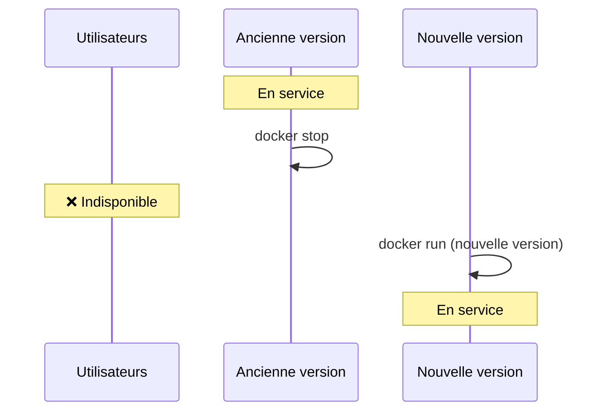
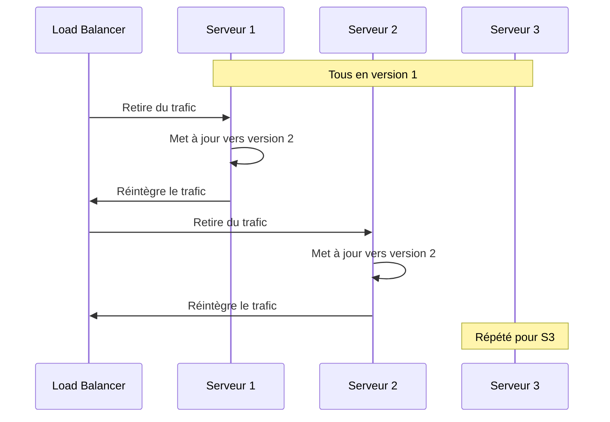
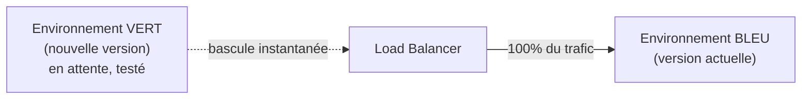
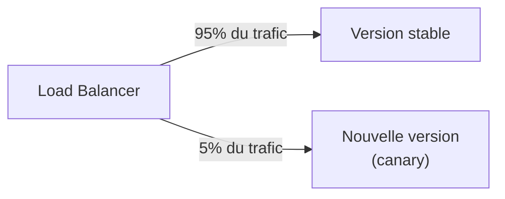

CHAPITRE 28 · 🟠 AVANCÉ

# Stratégies de déploiement

🎯 Objectif du chapitre
Comprendre quatre stratégies de déploiement — Recreate, Rolling, Blue/Green, Canary — leurs schémas, avantages et limites respectifs, et savoir choisir la stratégie adaptée au niveau de tolérance à l'interruption d'une application. Ce chapitre corrige directement la limite identifiée à la fin du chapitre 22 (exercice 22.1) : la stratégie Recreate, utilisée jusqu'ici, interrompt toujours brièvement le service à chaque déploiement.

🎬 Mise en situation
Le pipeline des chapitres 22 et 27 arrête l'ancien conteneur avant de démarrer le nouveau — une application indisponible pendant quelques secondes à chaque déploiement. Pour une application interne peu utilisée, c'est souvent acceptable. Pour une application avec des utilisateurs actifs en permanence, cette interruption, même brève et répétée à chaque déploiement, devient un vrai problème. Ce chapitre présente les alternatives.

## 28.1 Recreate : la stratégie déjà utilisée

📌 Recreate
Arrêter complètement l'ancienne version, puis démarrer la nouvelle. La stratégie la plus simple à mettre en œuvre (exactement celle des chapitres 22 et 27), mais avec une fenêtre d'indisponibilité totale, même brève, à chaque déploiement.

| Avantages | Limites |
|---|---|
| Simplicité maximale d'implémentation | Interruption de service à chaque déploiement |
| Pas de risque de coexistence de deux versions incompatibles | Inacceptable pour une application à disponibilité critique |
| Suffisant pour une application interne à faible trafic | — |

## 28.2 Rolling deployment

📌 Rolling deployment
Avec plusieurs instances de l'application (nécessite le load balancing du chapitre 15, section 15.6), mettre à jour les instances <strong>une par une</strong> (ou par petits groupes), en retirant temporairement chacune du répartiteur de charge le temps de sa mise à jour. À aucun moment l'application entière n'est indisponible — seule une fraction de la capacité l'est, brièvement, à tour de rôle.

| Avantages | Limites |
|---|---|
| Aucune interruption totale de service | Nécessite plusieurs instances (donc du load balancing, chapitre 15) |
| Utilisation efficace des ressources (pas de doublement temporaire) | Les deux versions coexistent brièvement — doivent rester compatibles entre elles (même schéma de données, par exemple) |
| Rollback progressif possible en cas de problème détecté en cours de déploiement | Plus complexe à orchestrer manuellement — Kubernetes (Partie XIII) l'automatise nativement |

## 28.3 Blue/Green

📌 Blue/Green
Deux environnements complets et identiques ("bleu" et "vert") coexistent. Le trafic va entièrement vers l'un (disons bleu, la version actuelle) pendant que l'autre (vert) reçoit la nouvelle version, entièrement testée en isolation avant toute exposition réelle. La bascule du trafic de bleu vers vert est <strong>instantanée</strong> (un simple changement de configuration du load balancer ou du DNS) — et un retour arrière tout aussi instantané si un problème apparaît.

| Avantages | Limites |
|---|---|
| Bascule et retour arrière quasi instantanés | Nécessite de doubler temporairement l'infrastructure (coût) |
| Nouvelle version testée en conditions réelles avant toute exposition | Les migrations de base de données doivent rester compatibles avec les deux versions simultanément |
| Aucune coexistence prolongée de deux versions sous trafic réel | Plus complexe à mettre en place qu'un Rolling deployment simple |

## 28.4 Canary

📌 Canary
Exposer la nouvelle version à une <strong>petite fraction</strong> du trafic réel (5%, 10%...) tout en gardant la majorité sur la version stable, puis augmenter progressivement cette fraction si aucun problème n'est détecté (monitoring, Partie X) — jusqu'à 100%. Le nom vient des canaris utilisés historiquement dans les mines pour détecter un danger avant qu'il n'affecte les mineurs : la nouvelle version "canari" révèle un problème sur un petit sous-ensemble d'utilisateurs avant d'affecter tout le monde.

| Avantages | Limites |
|---|---|
| Détecte un problème sur un impact limité avant exposition complète | Nécessite un monitoring fin (Partie X) pour comparer objectivement les deux versions |
| Permet de mesurer un impact réel (performance, taux d'erreur) en conditions réelles | La configuration du routage progressif est la plus complexe des quatre stratégies |
| Rollback ciblé sur une petite fraction du trafic si besoin | Les utilisateurs du groupe canari peuvent avoir une expérience différente, brièvement |

## 28.5 Comparatif et critères de choix

| Critère | Recreate | Rolling | Blue/Green | Canary |
|---|---|---|---|---|
| **Interruption de service** | Oui, brève | Non | Non | Non |
| **Complexité de mise en œuvre** | Très faible | Modérée | Modérée à élevée | Élevée |
| **Coût infrastructure** | Minimal | Minimal (mêmes ressources) | Double temporairement | Minimal à modéré |
| **Rollback** | Redéployer l'ancienne version | Progressif, par instance | Instantané (rebascule) | Ciblé sur la fraction exposée |
| **Adapté à** | Applications internes, faible trafic | Applications avec plusieurs instances | Applications critiques, changements majeurs | Changements risqués, validation progressive |

🧠 Progression naturelle recommandée
Commencer par Recreate (déjà en place depuis le chapitre 22) tant que l'interruption brève reste acceptable ; passer à Rolling dès que plusieurs instances existent et que l'interruption devient gênante ; envisager Blue/Green pour des changements particulièrement critiques ou pour des applications où même une interruption "brève" n'est jamais tolérable ; réserver Canary aux changements les plus risqués ou aux équipes disposant déjà d'un monitoring suffisamment fin (chapitre 32) pour l'exploiter pleinement.

## Atelier — Simuler un Rolling deployment avec Docker Compose

🛠️ Atelier 28.1 — Rolling deployment simplifié avec deux instances

**Objectif** : simuler, à petite échelle, un Rolling deployment sur l'architecture du chapitre 13, avec Nginx en répartiteur de charge (chapitre 15, section 15.6).

**Étapes détaillées** :

1. Configure deux instances de la même application dans `compose.yaml`, avec un bloc `upstream` Nginx pointant vers les deux.
2. Vérifie que le trafic alterne bien entre les deux instances (`curl` répété, en observant un identifiant différent selon l'instance, par exemple via une variable d'environnement `INSTANCE_ID`).
3. Mets à jour manuellement la première instance seulement (`docker compose up -d --no-deps instance1`), en gardant la seconde active pendant l'opération.
4. Vérifie que le service reste disponible pendant cette mise à jour partielle (les requêtes routées vers la seconde instance continuent de répondre normalement).
5. Répète pour la seconde instance.

**Résultat attendu** : la démonstration concrète, à petite échelle, qu'aucune requête n'est jamais totalement bloquée pendant toute l'opération — contrairement à la stratégie Recreate des chapitres précédents.

## Erreurs fréquentes

⚠️ Erreur n°1 — Rolling deployment avec des versions incompatibles entre elles
Si la nouvelle version modifie un format de données que l'ancienne version ne sait pas lire (ou l'inverse), leur coexistence brève pendant un Rolling deployment peut provoquer des erreurs — les changements de schéma de données doivent être conçus pour rester compatibles avec la version précédente pendant la transition (une discipline approfondie au chapitre 30).

⚠️ Erreur n°2 — Blue/Green sans plan clair pour les migrations de base de données
Si les deux environnements (bleu et vert) partagent la même base de données, une migration incompatible entre les deux versions casse l'un des deux environnements pendant la période de coexistence — un piège fréquent, approfondi également au chapitre 30.

⚠️ Erreur n°3 — Canary sans monitoring suffisant pour juger objectivement
Déployer en canary sans indicateurs clairs (taux d'erreur, temps de réponse, comparés entre les deux versions) revient à exposer une fraction d'utilisateurs à un risque sans réel moyen de détecter un problème avant qu'il ne s'aggrave — le canary n'a de valeur qu'avec une observation rigoureuse en parallèle (Partie X).

## En entreprise

**Réalité répandue** : Kubernetes (Partie XIII) implémente nativement le Rolling deployment comme comportement par défaut, rendant cette stratégie beaucoup plus accessible qu'une implémentation manuelle avec de simples conteneurs Docker et Nginx.

**Bonne pratique répandue** : les changements de schéma de base de données sont conçus selon le principe de "compatibilité ascendante et descendante" — une nouvelle colonne ajoutée en la rendant optionnelle plutôt qu'obligatoire immédiatement, permettant à l'ancienne et à la nouvelle version de cohabiter sans casser l'une ou l'autre pendant une transition Rolling ou Blue/Green.

**Erreur classique observée** : le choix d'une stratégie de déploiement sophistiquée (Canary) avant d'avoir un monitoring suffisamment mature pour l'exploiter réellement — la stratégie devient alors un risque supplémentaire plutôt qu'une protection, contrairement à son objectif.

## Entretien technique

💼 Questions fréquemment posées en entretien

**Q1. "Explique la différence entre Rolling deployment et Blue/Green."**
Réponse attendue : Rolling met à jour les instances existantes une par une, sans jamais doubler l'infrastructure ; Blue/Green maintient deux environnements complets en parallèle, avec une bascule instantanée du trafic entre les deux (sections 28.2 et 28.3).

**Q2. "Pourquoi une stratégie Canary nécessite-t-elle un bon monitoring pour être vraiment utile ?"**
Réponse attendue : sans indicateurs comparant objectivement le comportement de la nouvelle version exposée à une fraction du trafic par rapport à la version stable, il devient impossible de détecter un problème avant de l'étendre à tous les utilisateurs (section 28.4 et erreur fréquente n°3).

**Q3. "Quel risque partagent Rolling deployment et Blue/Green concernant les changements de base de données ?"**
Réponse attendue : dans les deux cas, deux versions de l'application coexistent brièvement (Rolling) ou partagent temporairement la même base (Blue/Green) — un changement de schéma incompatible entre versions peut casser l'une des deux pendant cette période (section "Erreurs fréquentes", erreurs n°1 et 2).

## Optimisation, sécurité et maintenabilité — les réflexes dès ce chapitre

🔒 Sécurité
Un correctif de sécurité critique devrait généralement être déployé le plus rapidement possible, ce qui peut justifier une stratégie plus simple et rapide (Recreate ou Rolling) plutôt qu'un Canary progressif qui retarderait la protection complète de tous les utilisateurs — le choix de stratégie dépend aussi de l'urgence du changement, pas seulement de sa nature.

✅ Maintenabilité
Documente explicitement, pour chaque projet, quelle stratégie de déploiement est utilisée et pourquoi — un changement de stratégie (par exemple de Recreate vers Rolling en ajoutant des instances) mérite d'être une décision consciente, pas une conséquence accidentelle d'un changement d'infrastructure.

🚀 Performance
Rolling et Blue/Green éliminent l'interruption de service perçue par les utilisateurs, un gain direct sur la disponibilité perçue — mesurable via les mêmes métriques DORA (chapitre 1) qui suivent la fréquence et la fiabilité des déploiements.

## Résumé du chapitre

- Recreate (déjà utilisée) est la plus simple mais interrompt le service à chaque déploiement.
- Rolling met à jour les instances une par une, sans interruption totale, mais nécessite plusieurs instances et des versions compatibles entre elles.
- Blue/Green bascule instantanément entre deux environnements complets, au prix d'un doublement temporaire de l'infrastructure.
- Canary expose progressivement une nouvelle version à une fraction du trafic, nécessitant un monitoring rigoureux pour être réellement utile.
- Le choix de stratégie dépend du niveau de tolérance à l'interruption, de la complexité acceptable, du coût, et de l'urgence du changement.

## Quiz

📝 QCM (une seule bonne réponse par question)

1. La stratégie Recreate se caractérise par :
   - a) Aucune interruption de service
   - b) Une interruption de service à chaque déploiement, mais une grande simplicité
   - c) Un doublement permanent de l'infrastructure
   - d) Un routage progressif du trafic

2. Blue/Green permet un rollback :
   - a) Impossible techniquement
   - b) Quasi instantané, en rebasculant le trafic vers l'ancien environnement
   - c) Uniquement après plusieurs heures
   - d) Uniquement en redéployant depuis zéro

3. La stratégie Canary est particulièrement utile pour :
   - a) Les changements sans aucun risque
   - b) Détecter un problème sur un impact limité avant une exposition complète
   - c) Remplacer entièrement le monitoring
   - d) Réduire les coûts d'infrastructure

**Corrigé** : 1-b, 2-b, 3-b.

📝 Vrai ou Faux

1. Rolling deployment nécessite plusieurs instances de l'application pour fonctionner. — **Vrai** (section 28.2).
2. Blue/Green ne nécessite jamais de doubler temporairement l'infrastructure. — **Faux** (section 28.3).
3. Canary est utile même sans aucun monitoring pour comparer les versions. — **Faux** (section "Erreurs fréquentes", erreur n°3).

## Exercices

📝 Exercice 28.1

Une équipe prépare un changement majeur de schéma de base de données, jugé risqué, sur une application avec un fort trafic et un monitoring déjà mature. Quelle stratégie recommanderais-tu, et pourquoi ?

**Corrigé (exemple de réponse) :** Canary, en exposant d'abord le changement à une petite fraction du trafic (par exemple 5%), avec une surveillance étroite des indicateurs d'erreur et de performance (monitoring déjà mature, condition nécessaire section 28.4) avant d'étendre progressivement — cette approche limite l'impact d'un problème imprévu sur le changement de schéma à un sous-ensemble restreint d'utilisateurs, plutôt que d'exposer immédiatement 100% du trafic à un risque non encore validé en conditions réelles (section 28.5, critères de choix).

## Checklist de fin de chapitre

<ul class="checklist">
<li>☐ Je sais décrire les quatre stratégies de déploiement et leur schéma respectif.</li>
<li>☐ Je connais les avantages et limites de chacune.</li>
<li>☐ Je sais choisir une stratégie adaptée selon la tolérance à l'interruption, la complexité, le coût et l'urgence.</li>
<li>☐ Je comprends le risque de compatibilité entre versions lors d'un Rolling deployment ou d'un Blue/Green.</li>
<li>☐ Je comprends pourquoi Canary nécessite un monitoring mature pour être réellement utile.</li>
</ul>

## FAQ

<dl class="faq">
<dt>Peut-on combiner plusieurs stratégies ?</dt>
<dd>Oui, c'est même courant — par exemple, un déploiement Canary qui, une fois validé sur une petite fraction du trafic, se termine par un Rolling deployment complet vers les instances restantes.</dd>

<dt>Ces stratégies nécessitent-elles toutes Kubernetes ?</dt>
<dd>Non, toutes peuvent être implémentées manuellement avec Docker et Nginx (comme dans l'atelier de ce chapitre), même si Kubernetes (Partie XIII) les automatise nativement et les rend beaucoup plus simples à orchestrer à grande échelle.</dd>

<dt>Quelle stratégie ce manuel utilisera-t-il dans le projet final (Partie XV) ?</dt>
<dd>Le projet final reprend la stratégie Recreate du chapitre 27 comme base, avec une réflexion explicite sur son évolution possible vers une stratégie plus tolérante à l'interruption selon le contexte du projet choisi.</dd>
</dl>

## Références et pour aller plus loin

- Martin Fowler — "BlueGreenDeployment" (article de référence) : [https://martinfowler.com/bliki/BlueGreenDeployment.html](https://martinfowler.com/bliki/BlueGreenDeployment.html)
- Google Cloud — "Canary deployments" (vue d'ensemble et bonnes pratiques) : [https://cloud.google.com/deploy/docs/deployment-strategies/canary](https://cloud.google.com/deploy/docs/deployment-strategies/canary)
- Kubernetes — documentation officielle sur les stratégies de mise à jour des Deployments : [https://kubernetes.io/docs/concepts/workloads/controllers/deployment/](https://kubernetes.io/docs/concepts/workloads/controllers/deployment/)

*Chapitre suivant : rollback — la procédure complète pour revenir en arrière après un déploiement défaillant, quelle que soit la stratégie utilisée.*
