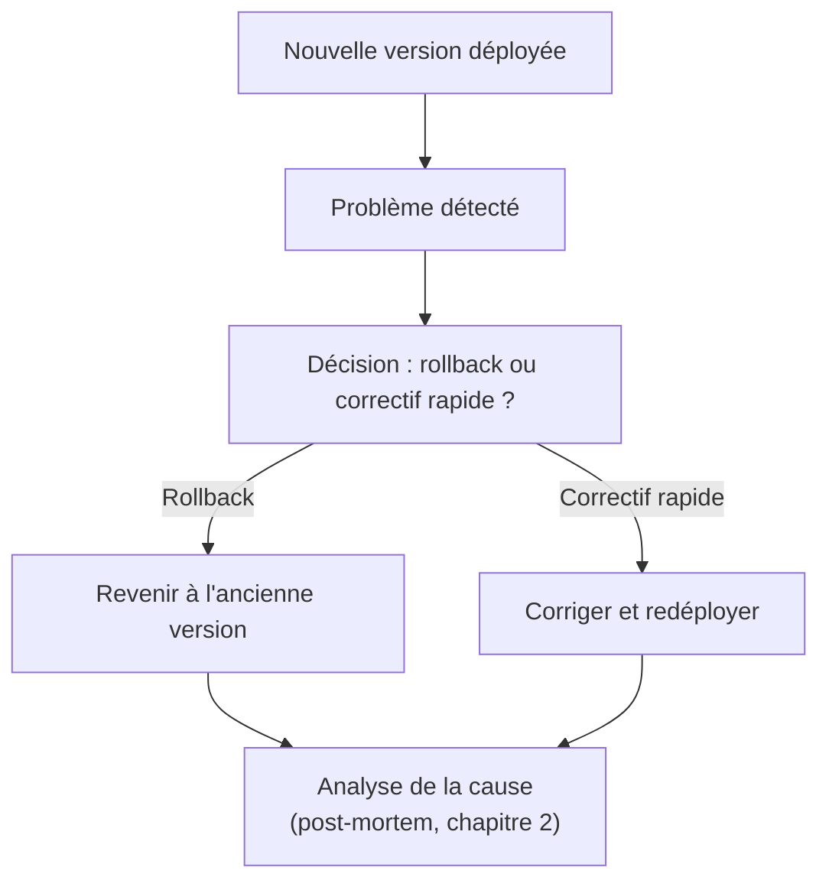

<div class="chapitre-titre-num">CHAPITRE 29 · 🟠 AVANCÉ</div>

# Rollback

<div class="encadre objectif">
<span class="encadre-titre">🎯 Objectif du chapitre</span>
Construire une procédure complète de rollback : détecter qu'un déploiement pose problème, revenir rapidement à la version précédente, puis analyser la cause sans précipitation. Ce chapitre clôt la Partie VIII : après avoir appris à déployer (chapitres 26-27) selon différentes stratégies (chapitre 28), ce chapitre répond à la question qu'aucune équipe ne peut éviter indéfiniment — que faire quand un déploiement tourne mal ?
</div>

<div class="encadre scenario">
<span class="encadre-titre">🎬 Mise en situation</span>
Malgré des tests (chapitre 23), une qualité de code vérifiée (chapitre 24) et une stratégie de déploiement adaptée (chapitre 28), un déploiement peut toujours révéler un problème invisible jusque-là — une interaction avec des données de production spécifiques, une charge réelle différente de celle testée, une dépendance externe qui se comporte différemment. Ce chapitre ne cherche pas à éliminer ce risque (impossible) mais à réduire au minimum le temps entre sa détection et sa résolution.
</div>

## 29.1 Le cycle complet du rollback



<div class="encadre retenir">
<span class="encadre-titre">📌 Rollback n'est pas toujours la bonne réponse</span>
Un rollback n'est pas automatiquement le bon choix face à tout problème. Si le correctif est trivial et rapide (une faute de frappe dans une variable de configuration, par exemple), corriger et redéployer immédiatement peut être plus rapide qu'un rollback complet. Le rollback devient la réponse privilégiée quand la cause n'est pas immédiatement claire, ou quand le problème est suffisamment grave pour ne pas attendre l'investigation.
</div>

## 29.2 Détection : la condition préalable à tout rollback

<div class="encadre astuce">
<span class="encadre-titre">💡 On ne peut pas revenir en arrière sur un problème qu'on n'a pas détecté</span>
Le rollback dépend entièrement de la vitesse de détection — un problème qui met une heure à être remarqué signifie une heure d'impact avant même de commencer à réagir. C'est pourquoi le healthcheck final des chapitres 22 et 27, et plus largement le monitoring de la Partie X, sont les vrais prérequis techniques d'un rollback rapide et efficace : sans eux, il n'y a rien à observer pour déclencher la décision de la section 29.1.
</div>

## 29.3 Rollback avec Docker : revenir à l'image précédente

<div class="encadre memoriser">
<span class="encadre-titre">🧠 Pourquoi le versionnage du chapitre 14 rend ce chapitre possible</span>
Rappel du chapitre 14 (section 14.3) : chaque image est taguée avec le SHA du commit qui l'a produite, jamais uniquement <code>latest</code>. C'est cette discipline, déjà appliquée depuis le chapitre 22, qui rend un rollback Docker aussi simple que la commande suivante.
</div>

```bash
# Identifier le SHA du commit précédent qui fonctionnait
git log --oneline -5

# Revenir à cette version précise
docker pull ghcr.io/ton-compte/ton-projet:abc1234
docker compose down
sed -i "s|image:.*|image: ghcr.io/ton-compte/ton-projet:abc1234|" docker-compose.override.yml
docker compose up -d
curl -f https://ton-domaine.com/health
```

**Explication :** aucune reconstruction n'est nécessaire — l'ancienne image existe déjà sur le registre (chapitre 14), le rollback consiste uniquement à demander au serveur de faire tourner cette version précise plutôt que la dernière. C'est une opération de quelques secondes, radicalement plus rapide qu'un nouveau cycle de build complet.

## 29.4 Rollback automatisé via GitHub Actions

```yaml
name: Rollback manuel

on:
  workflow_dispatch:
    inputs:
      sha_a_restaurer:
        description: "SHA du commit à restaurer"
        required: true

jobs:
  rollback:
    runs-on: ubuntu-latest
    environment:
      name: production
    steps:
      - name: Revenir à la version précédente
        uses: appleboy/ssh-action@v1
        with:
          host: ${{ secrets.SERVEUR_IP }}
          username: ${{ secrets.SERVEUR_UTILISATEUR }}
          key: ${{ secrets.SERVEUR_CLE_SSH }}
          script: |
            cd /home/deploiement/ton-projet
            docker pull ghcr.io/${{ github.repository }}:${{ github.event.inputs.sha_a_restaurer }}
            sed -i "s|image:.*|image: ghcr.io/${{ github.repository }}:${{ github.event.inputs.sha_a_restaurer }}|" docker-compose.override.yml
            docker compose up -d
            sleep 5
            curl -f http://localhost:3000/health
```

**Explication :** `workflow_dispatch` avec un `input` (chapitre 21, section 21.6) transforme le rollback en une action déclenchable manuellement depuis l'interface GitHub, en indiquant simplement le SHA à restaurer — pas besoin de se connecter en SSH ni de retaper des commandes en pleine gestion de crise, un moment où la rapidité et la fiabilité comptent le plus.

## 29.5 Rollback de base de données : le cas le plus délicat

<div class="encadre attention">
<span class="encadre-titre">⚠️ Un rollback applicatif ne rembobine jamais automatiquement la base de données</span>
Revenir à l'ancienne version du <strong>code</strong> (sections 29.3-29.4) est simple parce que les images Docker sont immuables. Une migration de base de données déjà appliquée (une nouvelle colonne créée, une donnée transformée) ne s'annule <strong>pas</strong> automatiquement en redéployant l'ancien code — si l'ancienne version du code n'est pas conçue pour fonctionner avec le nouveau schéma, le rollback applicatif seul peut casser l'application plutôt que la réparer.
</div>

<div class="encadre bonne-pratique">
<span class="encadre-titre">✅ Bonne pratique — migrations réversibles</span>
Concevoir chaque migration de base de données (approfondi au chapitre 30) avec son script d'annulation (<em>down migration</em>) correspondant, et privilégier des changements de schéma rétrocompatibles (une nouvelle colonne optionnelle plutôt qu'un renommage destructif) — exactement le même principe de compatibilité déjà mentionné pour le Rolling deployment et le Blue/Green (chapitre 28, section "Erreurs fréquentes").
</div>

## 29.6 Gérer les versions d'images pour un rollback fiable

<div class="encadre bonne-pratique">
<span class="encadre-titre">✅ Politique de rétention pour permettre un rollback</span>
Un rollback n'est possible que si l'ancienne image existe toujours sur le registre (chapitre 14) — une politique de nettoyage trop agressive qui supprime les images de plus d'une semaine pourrait supprimer justement celle vers laquelle il faudrait revenir. Garder au minimum les images des derniers déploiements réussis en production, une politique à définir explicitement plutôt que de subir un nettoyage automatique mal calibré.
</div>

## Atelier — Provoquer une panne et effectuer un rollback réel

<div class="encadre exercice">
<span class="encadre-titre">🛠️ Atelier 29.1 — Rollback de bout en bout, chronométré</span>

**Objectif** : vivre un rollback réel, chronométré, sur le pipeline construit aux chapitres 22 et 27.

**Étapes détaillées** :

1. Déploie une version fonctionnelle de ton application, note le SHA du commit (`git log --oneline -1`).
2. Introduis volontairement un bug simple (par exemple, l'endpoint `/health` renvoie désormais une erreur 500), commite, pousse, laisse le pipeline déployer cette version défaillante.
3. Constate l'échec via la vérification de santé du pipeline (chapitre 22) ou manuellement.
4. Déclenche le workflow de rollback de la section 29.4, avec le SHA noté à l'étape 1.
5. Chronomètre le temps total entre la détection du problème et le retour à un état fonctionnel vérifié.

**Résultat attendu** : un rollback réussi, avec un temps mesuré — cette mesure est directement liée à la métrique DORA "temps moyen de rétablissement" évoquée depuis le chapitre 1.
</div>

## Erreurs fréquentes

<div class="encadre attention">
<span class="encadre-titre">⚠️ Erreur n°1 — Ne pas conserver assez d'anciennes images</span>
Comme détaillé en section 29.6, un rollback est impossible si l'image cible n'existe plus sur le registre — vérifier la politique de rétention avant d'en avoir besoin en urgence, pas après.
</div>

<div class="encadre attention">
<span class="encadre-titre">⚠️ Erreur n°2 — Oublier l'état de la base de données lors d'un rollback</span>
Rappel de la section 29.5 : un rollback applicatif sans considération pour les migrations déjà appliquées peut aggraver la situation plutôt que la résoudre.
</div>

<div class="encadre attention">
<span class="encadre-titre">⚠️ Erreur n°3 — Improviser la procédure de rollback en pleine crise</span>
Découvrir, au moment même d'un incident, qu'aucune procédure de rollback n'a jamais été testée (comme dans l'atelier de ce chapitre) ajoute un stress et un délai évitables — une procédure de rollback doit être testée **avant** d'en avoir réellement besoin, exactement comme une sauvegarde doit être testée en restauration avant qu'on en ait besoin (principe déjà énoncé dans d'autres manuels du portefeuille, repris au chapitre 31).
</div>

## En entreprise

**Réalité répandue** : les équipes matures pratiquent des exercices de rollback délibérés (parfois appelés "game days" ou tests de chaos) en dehors de tout incident réel, précisément pour vérifier que la procédure fonctionne et que le temps de rétablissement reste acceptable — l'atelier de ce chapitre reproduit, à petite échelle, cette pratique.

**Bonne pratique répandue** : un rollback est presque toujours accompagné d'un post-mortem sans blâme (chapitre 2, section 2.3), même quand le rollback lui-même s'est bien passé — comprendre la cause racine du problème initial reste essentiel, indépendamment de la rapidité avec laquelle il a été résolu en surface.

**Erreur classique observée** : une confiance excessive dans "on peut toujours faire un rollback" qui pousse à réduire les tests avant déploiement, sans considérer que certains impacts (une donnée corrompue, une action utilisateur irréversible) ne s'annulent pas simplement en revenant à l'ancien code — le rollback est un filet de sécurité, jamais une excuse pour négliger la prévention.

## Entretien technique

<div class="encadre exercice">
<span class="encadre-titre">💼 Questions fréquemment posées en entretien</span>

**Q1. "Comment effectuerais-tu un rollback rapide après un déploiement Docker défaillant ?"**
Réponse attendue : redéployer l'image précédente, déjà disponible sur le registre grâce au versionnage par SHA de commit, sans reconstruction nécessaire — une opération de quelques secondes (section 29.3).

**Q2. "Pourquoi un rollback de code seul peut-il ne pas suffire après une migration de base de données ?"**
Réponse attendue : une migration déjà appliquée ne s'annule pas automatiquement avec l'ancien code, qui peut ne pas être compatible avec le nouveau schéma — nécessite des migrations réversibles et rétrocompatibles conçues à l'avance (section 29.5).

**Q3. "Pourquoi tester une procédure de rollback avant d'en avoir réellement besoin ?"**
Réponse attendue : découvrir que la procédure ne fonctionne pas (secrets expirés, script obsolète) en pleine crise ajoute un délai et un stress évitables — un rollback jamais testé n'est pas une garantie fiable, comme une sauvegarde jamais restaurée (section "Erreurs fréquentes", erreur n°3).
</div>

## Optimisation, sécurité et maintenabilité — les réflexes dès ce chapitre

<div class="encadre securite">
<span class="encadre-titre">🔒 Sécurité</span>
L'accès pour déclencher un rollback en production (via le workflow de la section 29.4) devrait rester accessible à un nombre restreint de personnes de confiance, mais **jamais** à une seule personne isolée — un rollback urgent ne devrait jamais être bloqué par l'indisponibilité d'une unique personne détentrice de l'accès (principe du "bus factor" déjà évoqué dans d'autres manuels du portefeuille).
</div>

<div class="encadre bonne-pratique">
<span class="encadre-titre">✅ Maintenabilité</span>
Documente la procédure de rollback dans le même `DEPLOIEMENT.md` que le chapitre 26 a recommandé de créer — un runbook clair, testé, accessible à toute l'équipe, pas seulement à la personne qui l'a écrit.
</div>

<div class="encadre performance">
<span class="encadre-titre">🚀 Performance</span>
Le temps de rollback mesuré à l'atelier 29.1 est directement comparable à la métrique DORA "temps moyen de rétablissement" (chapitre 1) — un objectif de quelques minutes est réaliste avec la procédure de ce chapitre, contre potentiellement des heures avec une approche manuelle et improvisée.
</div>

## Résumé du chapitre

- Le rollback n'est pas toujours la meilleure réponse — un correctif rapide et ciblé peut parfois être plus efficace.
- La détection rapide d'un problème (monitoring, healthcheck) est le vrai prérequis d'un rollback rapide.
- Le versionnage par SHA de commit (chapitre 14) rend un rollback Docker quasi instantané : redéployer une image déjà existante, sans reconstruction.
- Un rollback de code ne rembobine jamais automatiquement une migration de base de données déjà appliquée — nécessite des migrations conçues pour être réversibles et rétrocompatibles.
- Une procédure de rollback doit être testée avant d'en avoir réellement besoin, jamais découverte en pleine crise.

## Quiz

<div class="encadre exercice">
<span class="encadre-titre">📝 QCM (une seule bonne réponse par question)</span>

1. Le rollback est toujours la meilleure réponse face à un problème de déploiement :
   - a) Vrai, sans exception
   - b) Faux, un correctif rapide peut parfois être plus efficace selon le contexte
   - c) Vrai, uniquement en production
   - d) Faux, le rollback n'existe pas en pratique

2. Un rollback Docker vers une version précédente nécessite :
   - a) De reconstruire entièrement l'image depuis le code source
   - b) De redéployer une image déjà existante sur le registre, sans reconstruction
   - c) De supprimer toute la base de données
   - d) De contacter le fournisseur du VPS

3. Une migration de base de données déjà appliquée :
   - a) S'annule automatiquement lors d'un rollback de code
   - b) Ne s'annule pas automatiquement — nécessite une conception réversible et rétrocompatible
   - c) N'a jamais d'impact sur un rollback
   - d) Doit toujours être supprimée avant tout déploiement

**Corrigé** : 1-b, 2-b, 3-b.
</div>

<div class="encadre exercice">
<span class="encadre-titre">📝 Vrai ou Faux</span>

1. Une politique de rétention d'images trop agressive peut rendre un rollback impossible. — **Vrai** (section 29.6, erreur fréquente n°1).
2. Tester une procédure de rollback avant d'en avoir besoin est une perte de temps. — **Faux** (section "Erreurs fréquentes", erreur n°3).
3. L'accès pour déclencher un rollback en production devrait être limité à une seule personne pour plus de sécurité. — **Faux** (section "Sécurité").

</div>

## Exercices

<div class="encadre exercice">
<span class="encadre-titre">📝 Exercice 29.1</span>

Une équipe déploie une nouvelle version qui ajoute une colonne obligatoire (`NOT NULL`, sans valeur par défaut) à une table existante. Le déploiement échoue en production, et un rollback de code est déclenché. Explique pourquoi ce rollback risque de ne pas suffire, et comment la migration aurait dû être conçue.
</div>

**Corrigé :** si la migration de base de données a déjà été appliquée avant l'échec applicatif détecté, la colonne obligatoire existe désormais dans la base — un rollback du code seul (revenir à l'ancienne version qui ne connaît pas cette colonne) ne supprime pas la colonne, et selon la façon dont l'ancienne version interagit avec la base, cela peut fonctionner ou révéler un nouveau problème inattendu (section 29.5). La migration aurait dû être conçue en plusieurs étapes rétrocompatibles : d'abord ajouter la colonne comme **optionnelle** (sans contrainte `NOT NULL`), déployer et valider le nouveau code qui l'utilise, puis, seulement dans un déploiement ultérieur séparé une fois la stabilité confirmée, rendre la colonne obligatoire — une pratique de migration progressive approfondie au chapitre 30.

## Checklist de fin de chapitre

<ul class="checklist">
<li>☐ Je sais décider entre un rollback complet et un correctif rapide ciblé.</li>
<li>☐ Je comprends pourquoi la détection rapide est le vrai prérequis d'un rollback efficace.</li>
<li>☐ Je sais effectuer un rollback Docker en redéployant une image déjà existante, sans reconstruction.</li>
<li>☐ J'ai un mécanisme de rollback déclenchable manuellement (workflow_dispatch) pour les situations d'urgence.</li>
<li>☐ Je comprends pourquoi un rollback de code ne suffit pas toujours face à une migration de base de données déjà appliquée.</li>
<li>☐ J'ai testé, au moins une fois, ma procédure de rollback en conditions contrôlées, et j'ai mesuré le temps nécessaire.</li>
</ul>

## FAQ

<dl class="faq">
<dt>Combien de temps un rollback devrait-il prendre, idéalement ?</dt>
<dd>Il n'existe pas de seuil universel, mais quelques minutes est un objectif raisonnable une fois la procédure de ce chapitre en place — largement plus rapide qu'un nouveau cycle complet de build et déploiement.</dd>

<dt>Faut-il toujours un rollback automatique déclenché sans intervention humaine ?</dt>
<dd>Ce n'est pas systématique — certaines équipes préfèrent un rollback automatique déclenché uniquement sur des critères très clairs et fiables (un taux d'erreur qui dépasse un seuil précis, chapitre 32), gardant une décision humaine pour les cas plus ambigus, en cohérence avec le choix Continuous Delivery/Deployment du chapitre 20.</dd>

<dt>Rolling deployment ou Blue/Green (chapitre 28) facilitent-ils le rollback ?</dt>
<dd>Oui, particulièrement Blue/Green, où le rollback consiste simplement à rebasculer le trafic vers l'environnement précédent, encore intact et disponible — souvent plus rapide encore que le rollback Docker de ce chapitre.</dd>
</dl>

## Références et pour aller plus loin

- Google SRE Book — chapitre sur la gestion des incidents : [https://sre.google/sre-book/managing-incidents/](https://sre.google/sre-book/managing-incidents/)
- Documentation officielle GitHub Actions — `workflow_dispatch` : [https://docs.github.com/actions/using-workflows/manually-running-a-workflow](https://docs.github.com/actions/using-workflows/manually-running-a-workflow)

*Chapitre suivant : les bases de données en DevOps — la Partie IX s'ouvre, avec les migrations, la persistance des données, et la compatibilité entre versions déjà évoquées dans ce chapitre, approfondies en profondeur.*
