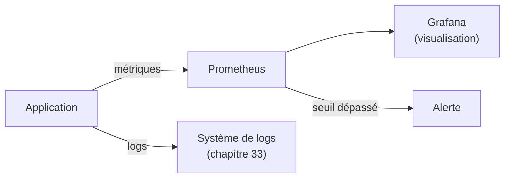

<div class="chapitre-titre-num">CHAPITRE 32 · 🟠 AVANCÉ</div>

# Monitoring

<div class="encadre objectif">
<span class="encadre-titre">🎯 Objectif du chapitre</span>
Comprendre les quatre piliers du monitoring — métriques, logs, traces, alertes — et la notion de disponibilité, puis construire un laboratoire complet avec Docker Stats, Prometheus et Grafana. Ce chapitre ouvre la Partie X : jusqu'ici, "vérifier que ça marche" s'est limité à un `curl` ponctuel (healthcheck, chapitre 10) — ce chapitre construit une vraie observation continue.
</div>

<div class="encadre scenario">
<span class="encadre-titre">🎬 Mise en situation</span>
Un `healthcheck.sh` (chapitre 10) répond à une question binaire : l'application répond-elle, oui ou non, à cet instant précis ? Cette question ne dit rien sur la tendance (la mémoire augmente-t-elle progressivement depuis trois jours ?), ni sur l'ampleur d'un problème (combien de requêtes échouent réellement, sur combien au total ?). Le monitoring répond à ces questions plus riches, en continu, avant même qu'un healthcheck ne détecte un problème déjà survenu.
</div>

## 32.1 Les quatre piliers

<div class="encadre retenir">
<span class="encadre-titre">📌 Métriques, logs, traces, alertes</span>
Les <strong>métriques</strong> sont des valeurs numériques mesurées dans le temps (CPU utilisé, nombre de requêtes par seconde, temps de réponse moyen). Les <strong>logs</strong> (chapitre 33) sont des événements textuels horodatés, détaillant ce qui s'est passé précisément. Les <strong>traces</strong> (chapitre 34) suivent le parcours complet d'une requête à travers plusieurs services. Les <strong>alertes</strong> transforment une métrique ou un log anormal en notification active, plutôt que d'attendre qu'un humain consulte un tableau de bord par hasard.
</div>



## 32.2 Docker Stats : le premier niveau, déjà disponible

```bash
docker stats
```

**Résultat attendu** : un tableau qui se rafraîchit en temps réel, affichant CPU, utilisation mémoire, trafic réseau et E/S disque pour chaque conteneur en cours d'exécution — sans aucune installation supplémentaire, le même principe que `top`/`htop` (chapitre 4) mais appliqué aux conteneurs plutôt qu'aux processus système.

<div class="encadre astuce">
<span class="encadre-titre">💡 Suffisant pour un diagnostic ponctuel, insuffisant pour une vraie observation continue</span>
`docker stats` répond bien à "que se passe-t-il <em>maintenant</em> ?" mais ne garde aucun historique — dès que le terminal se ferme, l'information est perdue. Prometheus (section 32.3) résout précisément cette limite en conservant un historique interrogeable.
</div>

## 32.3 Prometheus : collecter et stocker des métriques dans le temps

```yaml
# prometheus.yml
global:
  scrape_interval: 15s

scrape_configs:
  - job_name: "mon-api"
    static_configs:
      - targets: ["api:3000"]
  - job_name: "node-exporter"
    static_configs:
      - targets: ["node-exporter:9100"]
```

```yaml
# Extrait de compose.yaml
services:
  prometheus:
    image: prom/prometheus:latest
    volumes:
      - ./prometheus.yml:/etc/prometheus/prometheus.yml:ro
      - donnees-prometheus:/prometheus
    ports:
      - "9090:9090"

  node-exporter:
    image: prom/node-exporter:latest
    ports:
      - "9100:9100"
```

**Explication :** Prometheus fonctionne par **scraping** — il interroge activement (`scrape_interval: 15s`, toutes les 15 secondes) chaque cible configurée, plutôt que d'attendre que l'application lui envoie des données. `node-exporter` est un agent qui expose les métriques du système d'exploitation lui-même (CPU, RAM, disque du serveur) dans le format que Prometheus comprend ; l'application (`mon-api`) doit exposer ses propres métriques métier sur un endpoint dédié (souvent `/metrics`).

```javascript
// Exposer des métriques applicatives (Node.js, avec prom-client)
const client = require('prom-client');
const compteurRequetes = new client.Counter({
  name: 'http_requetes_totales',
  help: 'Nombre total de requêtes HTTP',
  labelNames: ['methode', 'route', 'statut'],
});

app.get('/metrics', async (req, res) => {
  res.set('Content-Type', client.register.contentType);
  res.end(await client.register.metrics());
});
```

**Explication :** un `Counter` (compteur, qui ne fait qu'augmenter) suit le nombre total de requêtes, avec des **labels** (`methode`, `route`, `statut`) qui permettent ensuite de filtrer et croiser cette donnée — combien de requêtes `GET /api/utilisateurs` ont retourné un statut `500`, par exemple.

## 32.4 Grafana : visualiser

```yaml
services:
  grafana:
    image: grafana/grafana:latest
    ports:
      - "3001:3000"
    volumes:
      - donnees-grafana:/var/lib/grafana
```

Après connexion à Grafana (`http://localhost:3001`), ajouter Prometheus comme source de données (`http://prometheus:9090`, résolu automatiquement par nom de service, chapitre 11 section 11.5), puis construire un tableau de bord.

<div class="encadre astuce">
<span class="encadre-titre">💡 Requêtes PromQL de base</span>

```promql
rate(http_requetes_totales[5m])
```
Le taux de requêtes par seconde, moyenné sur les 5 dernières minutes — la métrique la plus fondamentale pour visualiser le trafic réel d'une application dans le temps, bien plus parlante qu'un simple compteur brut qui ne fait qu'augmenter.
</div>

## 32.5 Alertes

```yaml
# alert_rules.yml
groups:
  - name: alertes_application
    rules:
      - alert: TauxErreurEleve
        expr: rate(http_requetes_totales{statut="500"}[5m]) > 0.05
        for: 2m
        annotations:
          resume: "Taux d'erreur 500 supérieur à 5% depuis 2 minutes"
```

**Explication :** cette règle se déclenche si le taux de requêtes en erreur 500 dépasse 5% pendant au moins 2 minutes consécutives (`for: 2m`, évitant une fausse alerte sur un pic isolé d'une seule seconde) — Prometheus transmet ensuite cette alerte à un gestionnaire dédié (Alertmanager, ou une intégration directe vers un canal de notification) qui l'achemine vers l'équipe.

## 32.6 Disponibilité : au-delà de "ça répond"

<div class="encadre retenir">
<span class="encadre-titre">📌 Disponibilité mesurée, pas supposée</span>
La disponibilité (souvent exprimée en pourcentage, "99,9% de disponibilité") se mesure généralement par le ratio entre le temps où un healthcheck externe (chapitre 10) confirme un fonctionnement correct, et le temps total observé — une mesure objective, construite à partir des données collectées par ce chapitre, plutôt qu'une simple impression subjective ("ça a l'air stable ces derniers temps").
</div>

## Atelier — Un tableau de bord complet sur l'architecture du chapitre 13

<div class="encadre exercice">
<span class="encadre-titre">🛠️ Atelier 32.1 — Prometheus et Grafana devant une vraie application</span>

**Objectif** : instrumenter l'architecture du chapitre 13 avec les quatre éléments de ce chapitre.

**Étapes détaillées** :

1. Ajoute Prometheus, node-exporter et Grafana à `compose.yaml` (sections 32.3-32.4).
2. Instrumente l'API avec `prom-client` (ou équivalent selon le langage), expose `/metrics`.
3. Construis un tableau de bord Grafana avec au moins deux graphiques : taux de requêtes (`rate(...)`) et utilisation CPU/mémoire (via node-exporter).
4. Configure la règle d'alerte de la section 32.5, provoque volontairement des erreurs 500 (une route qui lève systématiquement une exception) pour vérifier son déclenchement.

**Résultat attendu** : un tableau de bord vivant, avec un historique consultable dans le temps — la première fois, dans ce manuel, qu'un problème pourrait être détecté **avant** qu'un utilisateur ne le signale.
</div>

## Erreurs fréquentes

<div class="encadre attention">
<span class="encadre-titre">⚠️ Erreur n°1 — Confondre `docker stats` et une vraie stratégie de monitoring</span>
`docker stats` (section 32.2) est utile pour un diagnostic ponctuel, mais son absence d'historique le rend inadapté comme unique outil de monitoring d'une application en production.
</div>

<div class="encadre attention">
<span class="encadre-titre">⚠️ Erreur n°2 — Des alertes sans seuil de durée (`for:`)</span>
Une alerte qui se déclenche au moindre pic isolé, sans exiger une persistance minimale (`for: 2m` dans la section 32.5), génère un volume de fausses alertes qui finit par être ignoré — exactement le même piège que les échecs de CI ignorés (chapitre 19, section "Erreurs fréquentes").
</div>

<div class="encadre attention">
<span class="encadre-titre">⚠️ Erreur n°3 — Collecter des métriques sans jamais les regarder</span>
Mettre en place Prometheus et Grafana sans jamais construire de tableau de bord consulté régulièrement, ni d'alerte active, revient à collecter des données sans en tirer aucune valeur réelle — le monitoring n'a de sens que s'il est effectivement utilisé, pas seulement techniquement en place.
</div>

## En entreprise

**Réalité répandue** : la combinaison Prometheus + Grafana est devenue un standard de facto de l'écosystème open source pour le monitoring, particulièrement répandue dans les environnements conteneurisés (Docker, Kubernetes, Partie XIII).

**Bonne pratique répandue** : les équipes matures définissent des **SLI/SLO** (*Service Level Indicators/Objectives* — par exemple, "99% des requêtes doivent répondre en moins de 500ms") avant même de construire leurs tableaux de bord, pour savoir précisément ce qu'ils cherchent à observer plutôt que d'accumuler des graphiques sans objectif clair.

**Erreur classique observée** : des tableaux de bord Grafana très riches visuellement mais jamais reliés à une alerte active — l'équipe découvre un problème en consultant le tableau de bord par hasard, plutôt que d'être notifiée activement au moment où il survient.

## Entretien technique

<div class="encadre exercice">
<span class="encadre-titre">💼 Questions fréquemment posées en entretien</span>

**Q1. "Quels sont les quatre piliers du monitoring, et à quoi sert chacun ?"**
Réponse attendue : métriques (valeurs numériques dans le temps), logs (événements détaillés horodatés), traces (parcours d'une requête à travers plusieurs services), alertes (notification active sur un seuil anormal) — section 32.1.

**Q2. "Comment fonctionne Prometheus pour collecter des métriques ?"**
Réponse attendue : par scraping — il interroge activement, à intervalle régulier, chaque cible configurée exposant un endpoint de métriques, plutôt que d'attendre que les applications lui envoient des données (section 32.3).

**Q3. "Pourquoi ajouter une durée minimale (`for:`) à une règle d'alerte ?"**
Réponse attendue : éviter qu'un pic isolé et sans conséquence réelle ne déclenche une fausse alerte, réduisant la confiance et l'attention portées aux alertes légitimes (section 32.5 et erreur fréquente n°2).
</div>

## Optimisation, sécurité et maintenabilité — les réflexes dès ce chapitre

<div class="encadre securite">
<span class="encadre-titre">🔒 Sécurité</span>
Les endpoints `/metrics` et les interfaces Grafana/Prometheus ne devraient jamais être exposés publiquement sans authentification (chapitre 15, seul Nginx exposé, section 13.4) — des métriques détaillées peuvent révéler des informations sensibles sur l'architecture interne à un attaquant potentiel.
</div>

<div class="encadre bonne-pratique">
<span class="encadre-titre">✅ Maintenabilité</span>
Nomme les métriques et leurs labels de façon cohérente et documentée à travers toute l'application — une convention de nommage claire (`http_requetes_totales` plutôt que des noms incohérents d'un endpoint à l'autre) facilite énormément la construction de tableaux de bord et de requêtes PromQL par la suite.
</div>

<div class="encadre performance">
<span class="encadre-titre">🚀 Performance</span>
Un intervalle de scraping trop court (`scrape_interval` très bas) augmente la charge sur les applications surveillées et le volume de données stocké par Prometheus, sans bénéfice proportionné — 15 secondes à 1 minute est une fourchette raisonnable pour la majorité des cas d'usage de ce manuel.
</div>

## Résumé du chapitre

- Les quatre piliers du monitoring sont les métriques, les logs, les traces et les alertes.
- `docker stats` offre un premier niveau immédiat mais sans historique, insuffisant seul pour une vraie stratégie.
- Prometheus collecte des métriques par scraping actif, à intervalle régulier, stockées dans le temps.
- Grafana visualise ces métriques via des requêtes PromQL, dans des tableaux de bord consultables et partageables.
- Une alerte bien conçue inclut un seuil de durée minimale pour éviter les fausses alertes sur des pics isolés.

## Quiz

<div class="encadre exercice">
<span class="encadre-titre">📝 QCM (une seule bonne réponse par question)</span>

1. Prometheus collecte des métriques principalement par :
   - a) Envoi passif depuis les applications
   - b) Scraping actif, à intervalle régulier
   - c) Email automatique
   - d) Copie manuelle de fichiers

2. `docker stats`, comparé à Prometheus :
   - a) Offre un historique complet dans le temps
   - b) N'offre aucun historique, seulement un instantané en temps réel
   - c) Remplace entièrement Prometheus
   - d) Nécessite une installation supplémentaire complexe

3. Ajouter `for: 2m` à une règle d'alerte sert à :
   - a) Retarder indéfiniment toute alerte
   - b) Exiger une persistance minimale du problème avant de déclencher l'alerte
   - c) Supprimer l'alerte après 2 minutes
   - d) Doubler la fréquence de scraping

**Corrigé** : 1-b, 2-b, 3-b.
</div>

<div class="encadre exercice">
<span class="encadre-titre">📝 Vrai ou Faux</span>

1. Les quatre piliers du monitoring sont métriques, logs, traces et alertes. — **Vrai** (section 32.1).
2. `docker stats` conserve un historique consultable même après la fermeture du terminal. — **Faux** (section 32.2).
3. Un endpoint `/metrics` devrait être exposé publiquement sans authentification pour plus de simplicité. — **Faux** (section "Sécurité").

</div>

## Exercices

<div class="encadre exercice">
<span class="encadre-titre">📝 Exercice 32.1</span>

Une équipe reçoit des dizaines de fausses alertes par jour sur un pic de latence de quelques secondes, sans impact réel constaté. Propose une correction à la règle d'alerte en cause.
</div>

**Corrigé :** ajouter ou augmenter le seuil de durée minimale (`for:`) de la règle, par exemple de `for: 30s` à `for: 5m`, pour n'alerter que si la latence élevée persiste réellement plutôt que sur un pic isolé et transitoire (section 32.5 et erreur fréquente n°2) — un ajustement qui réduit le bruit tout en gardant la capacité de détecter un vrai problème soutenu.

## Checklist de fin de chapitre

<ul class="checklist">
<li>☐ Je sais nommer et expliquer les quatre piliers du monitoring.</li>
<li>☐ Je sais utiliser `docker stats` pour un diagnostic ponctuel.</li>
<li>☐ J'ai mis en place Prometheus avec au moins une cible applicative et node-exporter.</li>
<li>☐ J'ai construit un tableau de bord Grafana avec au moins deux graphiques utiles.</li>
<li>☐ J'ai configuré une règle d'alerte avec un seuil de durée minimale, testée en conditions réelles.</li>
<li>☐ Je protège mes endpoints de monitoring d'un accès public non authentifié.</li>
</ul>

## FAQ

<dl class="faq">
<dt>Faut-il instrumenter manuellement chaque application avec `prom-client` ?</dt>
<dd>Pour des métriques métier spécifiques, oui. Pour des métriques système génériques (CPU, RAM, réseau), des exporters préconstruits (comme `node-exporter`, ou des exporters dédiés à PostgreSQL, Nginx...) évitent ce travail manuel.</dd>

<dt>Prometheus et Grafana suffisent-ils pour une application en production réelle ?</dt>
<dd>Pour beaucoup de projets de taille modeste, oui, largement. À plus grande échelle, des solutions managées (Datadog, New Relic) ou des architectures plus complexes (Thanos, Cortex, pour du Prometheus distribué à très grande échelle) deviennent pertinentes — hors du périmètre de ce manuel introductif.</dd>

<dt>Le monitoring remplace-t-il les tests automatisés (chapitre 23) ?</dt>
<dd>Non, ils sont complémentaires : les tests vérifient un comportement attendu avant déploiement (shift-left, chapitre 2) ; le monitoring observe le comportement réel après déploiement, révélant des problèmes qu'aucun test n'aurait pu anticiper (charge réelle, comportement d'utilisateurs réels).</dd>
</dl>

## Références et pour aller plus loin

- Documentation officielle Prometheus : [https://prometheus.io/docs/introduction/overview/](https://prometheus.io/docs/introduction/overview/)
- Documentation officielle Grafana : [https://grafana.com/docs/](https://grafana.com/docs/)
- Google SRE Book — "Monitoring Distributed Systems" : [https://sre.google/sre-book/monitoring-distributed-systems/](https://sre.google/sre-book/monitoring-distributed-systems/)

*Chapitre suivant : gestion des logs — logs applicatifs, Nginx, Docker, rotation et centralisation, le second pilier du monitoring approfondi en détail.*
