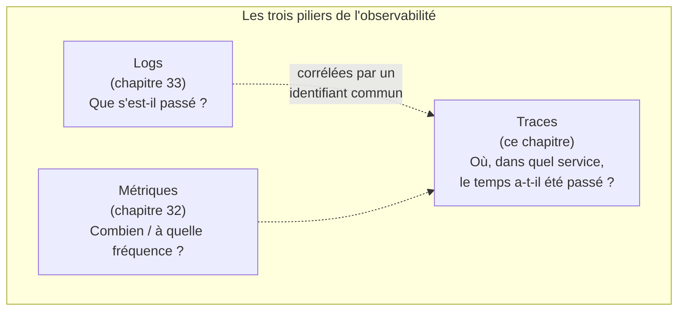

<div class="chapitre-titre-num">CHAPITRE 34 · 🟠 AVANCÉ</div>

# Observabilité

<div class="encadre objectif">
<span class="encadre-titre">🎯 Objectif du chapitre</span>
Réunir logs (chapitre 33), métriques (chapitre 32) et traces en une discipline cohérente — l'observabilité — et introduire progressivement OpenTelemetry, le standard qui unifie la collecte de ces trois piliers. Ce chapitre clôt la Partie X en ajoutant la pièce manquante : les traces, qui suivent une requête à travers plusieurs services.
</div>

<div class="encadre scenario">
<span class="encadre-titre">🎬 Mise en situation</span>
L'architecture du chapitre 13 (React + NestJS + PostgreSQL + Redis + Nginx) illustre bien le problème que les traces résolvent : une requête lente peut traverser Nginx, l'API, une requête vers Redis, une requête vers PostgreSQL — les métriques (chapitre 32) disent "cette route est lente en moyenne", les logs (chapitre 33) disent ce qui s'est passé à chaque étape séparément, mais rien ne relie encore ces étapes entre elles pour une requête précise. Les traces comblent ce manque.
</div>

## 34.1 Monitoring vs observabilité : une nuance importante

<div class="encadre retenir">
<span class="encadre-titre">📌 La différence</span>
Le <strong>monitoring</strong> (chapitres 32-33) répond à des questions anticipées à l'avance ("le CPU dépasse-t-il 80% ?", "combien d'erreurs 500 ?") via des tableaux de bord et des alertes préconstruits. L'<strong>observabilité</strong> va plus loin : la capacité à répondre à des questions <strong>non anticipées</strong> ("pourquoi cette requête précise, de cet utilisateur précis, à cet instant précis, a-t-elle pris 4 secondes ?") en explorant librement les données collectées, sans avoir préparé un tableau de bord spécifique à cette question exacte.
</div>



## 34.2 Traces distribuées : suivre une requête à travers plusieurs services

<div class="encadre astuce">
<span class="encadre-titre">💡 Analogie — le colis avec un numéro de suivi</span>
Une trace ressemble à un numéro de suivi de colis : à chaque étape de son parcours (entrepôt de départ, centre de tri, camion de livraison), un horodatage est enregistré sous ce même numéro. À la fin, on peut reconstituer le trajet complet et voir précisément où le colis a passé le plus de temps — exactement ce qu'une trace fait pour une requête qui traverse Nginx, une API, une base de données.
</div>

```javascript
// Exemple conceptuel avec OpenTelemetry (Node.js)
const { trace } = require('@opentelemetry/api');
const tracer = trace.getTracer('mon-api');

app.get('/api/commande/:id', async (req, res) => {
  const span = tracer.startSpan('recuperer-commande');
  try {
    const commande = await recupererDepuisBaseDeDonnees(req.params.id, span);
    span.setStatus({ code: 0 }); // succès
    res.json(commande);
  } catch (erreur) {
    span.recordException(erreur);
    span.setStatus({ code: 2 }); // erreur
    res.status(500).json({ erreur: 'Erreur interne' });
  } finally {
    span.end();
  }
});
```

**Explication :** un **span** est le bloc de base d'une trace — une unité de travail avec un début et une fin, ici "récupérer une commande". Un span peut contenir des **spans enfants** (par exemple, un span séparé pour l'appel à la base de données à l'intérieur de ce span) — l'ensemble forme un arbre qui représente visuellement où le temps total d'une requête a été consommé.

```mermaid
gantt
    title Trace d'une requête GET /api/commande/42 (durée totale 340ms)
    dateFormat X
    axisFormat %L ms
    section Nginx
    Réception requête : 0, 10
    section API
    Traitement : 10, 320
    section PostgreSQL
    Requête SQL : 60, 280
    section Redis
    Vérification cache : 280, 300
```



<div class="encadre astuce">
<span class="encadre-titre">💡 Explication du diagramme</span>
Ce type de visualisation (souvent appelé <em>waterfall</em> dans les outils de tracing réels comme Jaeger ou Grafana Tempo) révèle immédiatement où le temps a été consommé : ici, la requête PostgreSQL (220ms sur un total de 340ms) est clairement le goulot d'étranglement — une information que les métriques seules (chapitre 32, une moyenne globale) n'auraient pas révélée avec cette précision, et que les logs seuls (chapitre 33, des événements séparés) n'auraient pas reliée aussi clairement.
</div>

## 34.3 OpenTelemetry : le standard qui unifie la collecte

<div class="encadre memoriser">
<span class="encadre-titre">🧠 Pourquoi OpenTelemetry plutôt qu'un outil propriétaire</span>
Avant OpenTelemetry, chaque solution de monitoring (Datadog, New Relic...) imposait son propre agent et son propre format de collecte — changer de fournisseur signifiait réinstrumenter tout le code. OpenTelemetry est un standard <strong>ouvert et neutre</strong> : le code s'instrumente une seule fois, et les données (logs, métriques, traces) peuvent ensuite être envoyées vers n'importe quel outil compatible (Prometheus, Grafana Tempo, Jaeger, ou une solution commerciale), sans réinstrumenter l'application.
</div>

```yaml
# Extrait Compose : Grafana Tempo, pour visualiser les traces OpenTelemetry
services:
  tempo:
    image: grafana/tempo:latest
    ports:
      - "4318:4318"  # endpoint OpenTelemetry (OTLP)
      - "3200:3200"  # interface de requête
```

**Explication :** l'application envoie ses traces via le protocole standard OTLP (*OpenTelemetry Protocol*) vers Tempo, qui les stocke et les rend consultables directement depuis Grafana (déjà en place depuis le chapitre 32) — métriques, logs et traces réunis dans une seule interface, la réalisation concrète du schéma de la section 34.1.

## 34.4 Une introduction progressive, pas un big-bang

<div class="encadre bonne-pratique">
<span class="encadre-titre">✅ Bonne pratique — instrumenter progressivement, pas tout d'un coup</span>
Instrumenter l'intégralité d'une application existante avec des traces détaillées en une seule fois est un chantier conséquent, souvent décourageant. Commencer par les points d'entrée les plus critiques (les routes API les plus utilisées, ou celles historiquement les plus lentes selon les métriques du chapitre 32) donne un retour sur investissement immédiat, avant d'étendre progressivement à mesure que le besoin se confirme — le même principe de progressivité déjà appliqué au linting (chapitre 24, section "Erreurs fréquentes").
</div>

## Atelier — Une trace complète sur l'architecture du chapitre 13

<div class="encadre exercice">
<span class="encadre-titre">🛠️ Atelier 34.1 — Voir, pour la première fois, où le temps est réellement consommé</span>

**Objectif** : instrumenter une route de l'architecture du chapitre 13 avec OpenTelemetry, et visualiser sa trace complète.

**Étapes détaillées** :

1. Ajoute Grafana Tempo à `compose.yaml` (section 34.3).
2. Installe le SDK OpenTelemetry pour Node.js, instrumente une route qui interagit avec PostgreSQL et Redis (section 34.2).
3. Génère quelques requêtes vers cette route, ouvre Grafana, recherche la trace correspondante.
4. Identifie, visuellement, quelle étape consomme le plus de temps — compare ce résultat à ce qu'une simple métrique de temps de réponse moyen (chapitre 32) aurait pu suggérer.

**Résultat attendu** : la démonstration concrète qu'une trace révèle une information que ni les métriques ni les logs seuls ne peuvent offrir aussi clairement — la localisation précise d'un goulot d'étranglement au sein d'une requête individuelle.
</div>

## Erreurs fréquentes

<div class="encadre attention">
<span class="encadre-titre">⚠️ Erreur n°1 — Confondre monitoring et observabilité comme synonymes stricts</span>
Bien que liés et souvent utilisés l'un pour l'autre familièrement, la nuance de la section 34.1 (questions anticipées vs questions imprévues) a une vraie implication pratique sur la conception des outils utilisés — un tableau de bord seul (monitoring) ne remplace pas la capacité d'exploration libre qu'apportent des traces bien instrumentées.
</div>

<div class="encadre attention">
<span class="encadre-titre">⚠️ Erreur n°2 — Instrumenter en profondeur sans jamais consulter les traces produites</span>
Comme pour le monitoring (chapitre 32, erreur fréquente n°3), instrumenter du code avec des traces détaillées sans jamais les consulter activement en cas de problème (ou pour un audit de performance périodique) n'apporte aucune valeur réelle — l'investissement d'instrumentation doit être suivi d'un usage effectif.
</div>

<div class="encadre attention">
<span class="encadre-titre">⚠️ Erreur n°3 — Trop de spans, trop détaillés, dès le départ</span>
Créer un span pour chaque ligne de code, même triviale, produit un volume de données difficile à naviguer et un coût de stockage disproportionné — réserver les spans aux opérations réellement significatives (appels réseau, requêtes base de données, calculs coûteux), pas à chaque micro-opération interne.
</div>

## En entreprise

**Réalité répandue** : l'observabilité complète (les trois piliers réunis avec traçabilité croisée) reste, en 2026, davantage l'apanage des équipes matures et des applications à criticité élevée que la norme universelle — beaucoup de projets s'arrêtent au monitoring de base (chapitres 32-33), ce qui reste largement suffisant pour de nombreux contextes.

**Bonne pratique répandue** : l'adoption d'OpenTelemetry, précisément parce qu'il est neutre vis-à-vis du fournisseur final, est de plus en plus recommandée même pour des équipes qui n'ont pas encore choisi leur solution de visualisation définitive — instrumenter une fois, décider du backend de stockage plus tard, sans risque de blocage (*vendor lock-in*).

**Erreur classique observée** : des projets qui adoptent une solution de tracing propriétaire coûteuse avant même d'avoir une vraie discipline de monitoring de base (métriques et logs bien organisés, chapitres 32-33) — l'observabilité complète est un raffinement qui s'appuie sur des fondations déjà solides, pas un point de départ.

## Entretien technique

<div class="encadre exercice">
<span class="encadre-titre">💼 Questions fréquemment posées en entretien</span>

**Q1. "Quelle est la différence entre monitoring et observabilité ?"**
Réponse attendue : le monitoring répond à des questions anticipées via des tableaux de bord préconstruits ; l'observabilité permet d'explorer et de répondre à des questions imprévues à partir des données collectées (section 34.1).

**Q2. "Qu'est-ce qu'une trace distribuée, et à quel problème répond-elle ?"**
Réponse attendue : elle suit le parcours complet d'une requête à travers plusieurs services, révélant précisément où le temps a été consommé — une information que des métriques agrégées ou des logs séparés ne relient pas aussi clairement (section 34.2).

**Q3. "Pourquoi OpenTelemetry est-il devenu un standard important ?"**
Réponse attendue : il permet d'instrumenter une application une seule fois, indépendamment du backend de visualisation final choisi, évitant un verrouillage vis-à-vis d'un fournisseur propriétaire (section 34.3).
</div>

## Optimisation, sécurité et maintenabilité — les réflexes dès ce chapitre

<div class="encadre securite">
<span class="encadre-titre">🔒 Sécurité</span>
Comme pour les logs (chapitre 33), les traces ne devraient jamais contenir de données sensibles en clair (identifiants de session, contenus de mots de passe même partiels) dans leurs attributs — une trace, souvent accessible à une équipe plus large que la base de données de production, mérite la même vigilance.
</div>

<div class="encadre bonne-pratique">
<span class="encadre-titre">✅ Maintenabilité</span>
Nomme les spans de façon cohérente et descriptive (`recuperer-commande`, pas `span1`) — exactement le même principe déjà appliqué aux métriques (chapitre 32) et aux tests (chapitre 23).
</div>

<div class="encadre performance">
<span class="encadre-titre">🚀 Performance</span>
L'instrumentation elle-même a un coût de performance non nul (création de spans, transmission réseau vers le collecteur) — un taux d'échantillonnage (*sampling*, ne tracer qu'un pourcentage des requêtes plutôt que 100%) est souvent utilisé en production à fort trafic pour limiter ce coût, tout en gardant une visibilité statistiquement représentative.
</div>

## Résumé du chapitre

- L'observabilité va au-delà du monitoring : la capacité à répondre à des questions imprévues, pas seulement anticipées à l'avance.
- Les traces distribuées suivent le parcours complet d'une requête à travers plusieurs services, révélant précisément où le temps est consommé.
- OpenTelemetry est un standard ouvert qui permet d'instrumenter une seule fois, indépendamment du backend de visualisation choisi.
- L'instrumentation devrait être progressive, priorisant les points critiques, plutôt qu'exhaustive dès le départ.
- Les traces, comme les logs, ne doivent jamais contenir de données sensibles en clair.

## Quiz

<div class="encadre exercice">
<span class="encadre-titre">📝 QCM (une seule bonne réponse par question)</span>

1. L'observabilité, par rapport au simple monitoring :
   - a) Est exactement la même chose sans nuance
   - b) Permet de répondre à des questions imprévues, pas seulement anticipées via des tableaux de bord préconstruits
   - c) Remplace entièrement les logs
   - d) Ne concerne que les métriques

2. Un span, dans une trace distribuée, représente :
   - a) Une unité de travail avec un début et une fin
   - b) Un fichier de configuration
   - c) Une image Docker
   - d) Un utilisateur connecté

3. OpenTelemetry sert principalement à :
   - a) Remplacer Docker
   - b) Instrumenter une application de façon neutre, indépendamment du backend de visualisation final
   - c) Gérer les secrets
   - d) Configurer un pare-feu

**Corrigé** : 1-b, 2-a, 3-b.
</div>

<div class="encadre exercice">
<span class="encadre-titre">📝 Vrai ou Faux</span>

1. Une trace distribuée peut révéler où le temps a été consommé à travers plusieurs services, information qu'une métrique agrégée seule ne montre pas aussi précisément. — **Vrai** (section 34.2).
2. Il est recommandé d'instrumenter l'intégralité d'une application avec des traces détaillées en une seule fois. — **Faux** (section 34.4).
3. OpenTelemetry impose un fournisseur unique de visualisation, sans possibilité de changer. — **Faux** (section 34.3).

</div>

## Exercices

<div class="encadre exercice">
<span class="encadre-titre">📝 Exercice 34.1</span>

Une route API a un temps de réponse moyen de 800ms selon les métriques (chapitre 32), mais l'équipe ne sait pas où ce temps est consommé. Explique comment une trace distribuée répondrait à cette question, étape par étape.
</div>

**Corrigé :** instrumenter la route avec OpenTelemetry (section 34.2), en créant un span parent pour la requête globale et des spans enfants pour chaque opération significative (appel base de données, appel à un service externe, calcul interne coûteux). En consultant une trace individuelle dans l'interface de visualisation (Grafana Tempo, Jaeger), l'équipe verrait un diagramme temporel (comme celui de la section 34.2) montrant précisément quelle portion des 800ms est consommée par chaque étape — révélant, par exemple, que 600ms proviennent d'une requête SQL non optimisée, une information que la métrique agrégée seule ne pouvait pas localiser aussi précisément.

## Checklist de fin de chapitre

<ul class="checklist">
<li>☐ Je comprends la nuance entre monitoring et observabilité.</li>
<li>☐ Je sais expliquer ce qu'est un span et comment une trace se construit.</li>
<li>☐ Je comprends pourquoi OpenTelemetry est devenu un standard important.</li>
<li>☐ J'ai instrumenté au moins une route avec des traces, et visualisé le résultat.</li>
<li>☐ Je sais pourquoi instrumenter progressivement plutôt qu'exhaustivement dès le départ.</li>
<li>☐ Je ne mets jamais de données sensibles dans les attributs d'une trace.</li>
</ul>

## FAQ

<dl class="faq">
<dt>Faut-il les trois piliers (logs, métriques, traces) pour être "observable" ?</dt>
<dd>Les trois se complètent, mais beaucoup de projets tirent déjà une valeur considérable de seulement deux d'entre eux (métriques et logs, chapitres 32-33) bien organisés — les traces apportent un raffinement supplémentaire particulièrement utile pour des architectures multi-services complexes.</dd>

<dt>Jaeger, Zipkin, Grafana Tempo : comment choisir ?</dt>
<dd>Les trois sont des backends compatibles OpenTelemetry pour visualiser des traces — Tempo, utilisé dans ce chapitre, s'intègre nativement avec Grafana déjà en place depuis le chapitre 32 ; Jaeger et Zipkin sont des alternatives matures avec leurs propres interfaces dédiées.</dd>

<dt>L'observabilité est-elle nécessaire pour une petite application avec un seul service ?</dt>
<dd>Les traces distribuées apportent le plus de valeur dès que plusieurs services interagissent (chapitre 13) — pour une application monolithique unique, le monitoring de base (chapitres 32-33) couvre déjà l'essentiel des besoins pratiques.</dd>
</dl>

## Références et pour aller plus loin

- Documentation officielle OpenTelemetry : [https://opentelemetry.io/docs/](https://opentelemetry.io/docs/)
- Documentation officielle Grafana Tempo : [https://grafana.com/docs/tempo/latest/](https://grafana.com/docs/tempo/latest/)
- Charity Majors, Liz Fong-Jones, George Miranda — *Observability Engineering* (référence approfondie sur le sujet).

*Chapitre suivant : sécurité DevOps / DevSecOps — la Partie XI s'ouvre, en intégrant la sécurité du code aux secrets, en passant par les dépendances, les images et la supply chain, dans un pipeline DevSecOps complet.*
