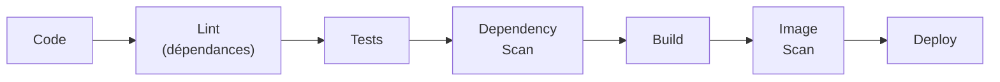

<div class="chapitre-titre-num">CHAPITRE 35 · 🟠 AVANCÉ</div>

# Sécurité DevOps / DevSecOps

<div class="encadre objectif">
<span class="encadre-titre">🎯 Objectif du chapitre</span>
Comprendre la sécurité comme une responsabilité intégrée à chaque étape du cycle DevOps — du code aux dépendances, des images à la supply chain — plutôt qu'une vérification ajoutée en fin de parcours. Ce chapitre ouvre la Partie XI en rassemblant, sous une doctrine cohérente appelée DevSecOps, la sécurité déjà appliquée en pointillé à travers 34 chapitres précédents.
</div>

<div class="encadre scenario">
<span class="encadre-titre">🎬 Mise en situation</span>
Le chapitre 1 (section "Sécurité") a introduit l'idée que la sécurité doit s'intégrer dès CODE et BUILD, pas ajoutée en dernière minute avant la mise en production. Depuis, presque chaque chapitre a appliqué ce principe sans jamais s'y arrêter longuement : utilisateur non-root (chapitre 12), secrets jamais commités (chapitre 25), pare-feu (chapitre 5), SSH durci (chapitre 6). Ce chapitre nomme et structure enfin cette pratique transversale : DevSecOps.
</div>

## 35.1 DevSecOps : la sécurité comme responsabilité partagée, pas comme équipe séparée

<div class="encadre retenir">
<span class="encadre-titre">📌 Définition</span>
<strong>DevSecOps</strong> étend la culture DevOps (chapitre 2) en intégrant la sécurité comme responsabilité partagée par toute l'équipe, à chaque étape du cycle — pas uniquement l'affaire d'une équipe sécurité séparée, consultée seulement juste avant la mise en production. Exactement le même raisonnement que "you build it, you run it" (chapitre 2, section 2.2), appliqué cette fois à la sécurité : "you build it, you secure it".
</div>



Ce pipeline reprend et enrichit le pipeline générique du chapitre 19 — chaque étape de sécurité s'insère naturellement à un point précis du cycle déjà construit, jamais comme une phase séparée à la fin.

## 35.2 Sécurité du code et des dépendances

<div class="encadre memoriser">
<span class="encadre-titre">🧠 Rappel du chapitre 24 (analyse statique)</span>
CodeQL (chapitre 24, section 24.3) détecte des vulnérabilités dans le code lui-même. Ce chapitre ajoute un second front : les <strong>dépendances</strong> — les bibliothèques tierces dont dépend une application, souvent bien plus nombreuses que le code écrit soi-même, et une source de vulnérabilités tout aussi réelle.
</div>

```bash
npm audit
```

```yaml
- name: Audit des dépendances
  run: npm audit --audit-level=high
```

**Explication :** `npm audit` compare les dépendances installées à une base de données de vulnérabilités connues (CVE — *Common Vulnerabilities and Exposures*) ; `--audit-level=high` fait échouer le pipeline uniquement sur les vulnérabilités jugées graves ou critiques, évitant de bloquer chaque build sur des problèmes mineurs sans impact réel — un compromis pragmatique, ajustable selon la tolérance au risque du projet.

<div class="encadre astuce">
<span class="encadre-titre">💡 Dependabot : la mise à jour automatisée</span>
GitHub propose Dependabot, qui scanne automatiquement les dépendances d'un dépôt et ouvre une pull request (chapitre 8) dès qu'une mise à jour de sécurité est disponible — transformant une tâche autrefois manuelle et souvent négligée en un flux automatisé qui s'intègre directement dans le processus de revue déjà en place.
</div>

## 35.3 Secrets dans le pipeline DevSecOps

<div class="encadre memoriser">
<span class="encadre-titre">🧠 Rappel direct du chapitre 25</span>
Le chapitre 25 a déjà couvert en profondeur la gestion des secrets — ce chapitre ajoute la dimension de <strong>détection automatisée</strong> : un scan de secrets (`gitleaks`, déjà mentionné au chapitre 25) intégré directement au pipeline CI (chapitre 19), bloquant toute pull request qui introduirait un secret par erreur, avant même qu'un humain ne le repère en revue.
</div>

```yaml
- name: Scanner les secrets
  uses: gitleaks/gitleaks-action@v2
```

## 35.4 Réseau et permissions

<div class="encadre memoriser">
<span class="encadre-titre">🧠 Récapitulatif de ce qui a déjà été construit</span>

```text
Réseau       → pare-feu UFW (chapitre 5), seul Nginx exposé (chapitre 13/15)
Serveur      → SSH par clé uniquement, root désactivé (chapitre 6)
Permissions  → utilisateur dédié, principe du moindre privilège (chapitres 4-5)
CI/CD        → versions d'actions épinglées, permissions minimales (chapitre 21)
```

Ce chapitre ne réintroduit aucun de ces éléments — il les regroupe pour la première fois sous une vue d'ensemble cohérente, la "checklist DevSecOps" de l'atelier de ce chapitre.
</div>

## 35.5 Supply chain : la sécurité de ce qu'on ne contrôle pas soi-même

<div class="encadre attention">
<span class="encadre-titre">⚠️ La supply chain logicielle, un risque souvent sous-estimé</span>
La <strong>supply chain</strong> (chaîne d'approvisionnement logicielle) désigne tout ce qui entre dans une application sans avoir été écrit par l'équipe elle-même : dépendances (section 35.2), images de base Docker (chapitre 36), actions GitHub tierces (chapitre 21, section "Sécurité"), outils de build. Une compromission à n'importe quel maillon de cette chaîne (un paquet npm piraté, une action GitHub modifiée) peut affecter silencieusement toute application qui en dépend, sans qu'aucune faille n'existe dans le code propre de l'équipe.
</div>

<div class="encadre bonne-pratique">
<span class="encadre-titre">✅ Bonnes pratiques déjà appliquées dans ce manuel, réunies</span>
Épingler les versions précises (images Docker "slim" avec tag exact, chapitre 12 ; actions GitHub avec version exacte, chapitre 21) ; utiliser `npm ci` plutôt qu'`install` pour respecter strictement le fichier de verrouillage (chapitre 19) ; scanner les dépendances (section 35.2) et les images (chapitre 36) systématiquement.
</div>

## 35.6 Pipeline DevSecOps complet

```yaml
jobs:
  securite:
    runs-on: ubuntu-latest
    steps:
      - uses: actions/checkout@v4
      - uses: actions/setup-node@v4
        with: { node-version: "20", cache: "npm" }
      - run: npm ci
      - name: Lint
        run: npx eslint .
      - name: Tests
        run: npm test
      - name: Audit des dépendances
        run: npm audit --audit-level=high
      - name: Scan de secrets
        uses: gitleaks/gitleaks-action@v2
      - name: Analyse CodeQL
        uses: github/codeql-action/analyze@v3
```

**Explication :** ce job assemble, dans l'ordre le plus efficace (les vérifications les plus rapides en premier, chapitre 19, section "Performance"), tous les contrôles déjà couverts individuellement dans les chapitres 21 à 25 — la synthèse concrète du pipeline conceptuel de la section 35.1.

## Atelier — Construire la checklist DevSecOps de son propre projet

<div class="encadre exercice">
<span class="encadre-titre">🛠️ Atelier 35.1 — Auditer un projet existant contre la checklist du chapitre</span>

**Objectif** : appliquer, sur le projet des chapitres 22/27, une checklist DevSecOps complète.

**Étapes détaillées** :

1. Vérifie que le Dockerfile utilise un utilisateur non-root (chapitre 12).
2. Vérifie qu'aucun secret n'est présent dans l'historique Git avec `gitleaks` (chapitre 25).
3. Exécute `npm audit`, corrige ou documente toute vulnérabilité de sévérité haute ou critique.
4. Vérifie que toutes les actions GitHub utilisées ont une version épinglée précise (chapitre 21).
5. Ajoute le job `securite` complet de la section 35.6 au pipeline existant.

**Résultat attendu** : un pipeline qui échoue désormais explicitement sur une régression de sécurité (un secret introduit par erreur, une dépendance vulnérable) — pas seulement sur un test fonctionnel cassé.
</div>

## Erreurs fréquentes

<div class="encadre attention">
<span class="encadre-titre">⚠️ Erreur n°1 — Traiter la sécurité comme une étape finale plutôt qu'intégrée</span>
Réserver toute vérification de sécurité à un audit ponctuel avant une mise en production majeure, plutôt que de l'intégrer en continu dans le pipeline (section 35.1), signifie découvrir des problèmes bien plus tard et à un coût de correction bien plus élevé (principe du "shift-left", chapitre 2, section 2.5).
</div>

<div class="encadre attention">
<span class="encadre-titre">⚠️ Erreur n°2 — Ignorer les alertes de vulnérabilité par lassitude</span>
Un volume important d'alertes `npm audit` non triées peut mener à les ignorer systématiquement — exactement le même piège que les échecs de CI ignorés (chapitre 19) ou les fausses alertes de monitoring (chapitre 32) ; trier par sévérité (`--audit-level=high`) et traiter réellement ce qui reste.
</div>

<div class="encadre attention">
<span class="encadre-titre">⚠️ Erreur n°3 — Une action GitHub tierce non épinglée</span>
Utiliser `uses: action-tierce@main` plutôt qu'une version précise (chapitre 21, section "Sécurité") expose le pipeline à un changement de comportement, voire malveillant, sans qu'aucun changement n'apparaisse dans le propre code du projet.
</div>

## En entreprise

**Réalité répandue** : DevSecOps est de plus en plus considéré comme un prérequis plutôt qu'une pratique optionnelle, particulièrement dans les secteurs réglementés (finance, santé), où des audits de sécurité formels vérifient explicitement l'intégration de ces contrôles dans le pipeline.

**Bonne pratique répandue** : la responsabilité de la sécurité reste partagée par toute l'équipe technique, mais une personne ou une petite équipe joue souvent un rôle de référent (pas de gardien exclusif) — cohérent avec le principe du chapitre 2 selon lequel une "équipe DevOps séparée" reconstruit un silo, la même logique s'appliquant à une "équipe sécurité" totalement isolée du reste.

**Erreur classique observée** : des outils de scan de sécurité installés avec enthousiasme, générant un volume d'alertes jamais réellement traité — un audit de sécurité, aussi automatisé soit-il, n'a de valeur que si ses résultats sont effectivement examinés et corrigés.

## Entretien technique

<div class="encadre exercice">
<span class="encadre-titre">💼 Questions fréquemment posées en entretien</span>

**Q1. "Que signifie DevSecOps, et en quoi diffère-t-il d'une équipe sécurité traditionnelle séparée ?"**
Réponse attendue : intégrer la sécurité comme responsabilité partagée à chaque étape du cycle DevOps, plutôt qu'une vérification isolée effectuée par une équipe séparée juste avant la mise en production (section 35.1).

**Q2. "Qu'est-ce que la supply chain logicielle, et pourquoi représente-t-elle un risque spécifique ?"**
Réponse attendue : tout ce qui entre dans une application sans être écrit directement par l'équipe (dépendances, images de base, actions tierces) — une compromission à n'importe quel maillon peut affecter l'application sans faille dans son propre code (section 35.5).

**Q3. "Comment intégrerais-tu la détection de secrets dans un pipeline CI/CD ?"**
Réponse attendue : un outil comme gitleaks exécuté à chaque pull request, bloquant la fusion si un motif ressemblant à un secret est détecté, avant qu'un humain n'ait à le repérer en revue de code (section 35.3).
</div>

## Optimisation, sécurité et maintenabilité — les réflexes dès ce chapitre

<div class="encadre securite">
<span class="encadre-titre">🔒 Sécurité</span>
Ce chapitre entier est une checklist de sécurité — la synthèse : sécurité du code (chapitre 24), des secrets (chapitre 25), du réseau (chapitres 5, 15), des dépendances et de la supply chain (ce chapitre), des images (chapitre 36 à venir).
</div>

<div class="encadre bonne-pratique">
<span class="encadre-titre">✅ Maintenabilité</span>
Documente les vulnérabilités connues et volontairement non corrigées (avec justification claire) plutôt que de les laisser silencieusement ignorées — un rapport de sécurité qui distingue "corrigé", "accepté avec justification" et "non traité" reste bien plus utile qu'un simple statut binaire.
</div>

<div class="encadre performance">
<span class="encadre-titre">🚀 Performance</span>
Les scans de sécurité (audit, secrets, CodeQL) ajoutent du temps au pipeline — les placer stratégiquement (après les vérifications les plus rapides, chapitre 19) et en parallèle quand c'est possible (chapitre 21, section 21.4) limite leur impact sur le temps total.
</div>

## Résumé du chapitre

- DevSecOps intègre la sécurité comme responsabilité partagée à chaque étape du cycle, pas une vérification finale isolée.
- L'audit des dépendances (`npm audit`, Dependabot) complète l'analyse statique du code (chapitre 24) déjà en place.
- Le scan de secrets automatisé (gitleaks) détecte une fuite avant qu'un humain n'ait à la repérer en revue.
- La supply chain logicielle (dépendances, images de base, actions tierces) représente un risque distinct du code propre de l'équipe.
- Un pipeline DevSecOps complet assemble tous ces contrôles déjà couverts individuellement dans les chapitres précédents.

## Quiz

<div class="encadre exercice">
<span class="encadre-titre">📝 QCM (une seule bonne réponse par question)</span>

1. DevSecOps signifie principalement :
   - a) Une équipe sécurité totalement séparée du reste de l'équipe technique
   - b) La sécurité intégrée comme responsabilité partagée à chaque étape du cycle DevOps
   - c) Un outil unique qui remplace tous les autres contrôles
   - d) Une certification obligatoire pour tout développeur

2. La supply chain logicielle désigne :
   - a) Uniquement le code écrit par l'équipe elle-même
   - b) Tout ce qui entre dans une application sans avoir été écrit par l'équipe (dépendances, images, actions tierces)
   - c) Le processus de vente d'un logiciel
   - d) La chaîne de blocs (blockchain)

3. `npm audit --audit-level=high` sert à :
   - a) Installer toutes les dépendances
   - b) Faire échouer le pipeline uniquement sur les vulnérabilités graves ou critiques
   - c) Supprimer toutes les dépendances vulnérables automatiquement
   - d) Chiffrer le code source

**Corrigé** : 1-b, 2-b, 3-b.
</div>

<div class="encadre exercice">
<span class="encadre-titre">📝 Vrai ou Faux</span>

1. La sécurité devrait être vérifiée uniquement juste avant une mise en production majeure. — **Faux** (section 35.1, principe du shift-left).
2. Une action GitHub tierce non épinglée à une version précise représente un risque de supply chain. — **Vrai** (section 35.5 et erreur fréquente n°3).
3. Un volume important d'alertes de sécurité non triées devrait toutes être traitées avec la même urgence. — **Faux** (section "Erreurs fréquentes", erreur n°2 — trier par sévérité).

</div>

## Exercices

<div class="encadre exercice">
<span class="encadre-titre">📝 Exercice 35.1</span>

Une équipe découvre que `npm audit` signale 200 vulnérabilités sur son projet, dont la plupart sont de sévérité faible. Propose une approche pragmatique pour traiter ce volume sans paralyser le développement.
</div>

**Corrigé (exemple de réponse) :** trier immédiatement par sévérité (`npm audit --audit-level=high` ou équivalent) pour identifier le sous-ensemble réellement critique, souvent une fraction bien plus restreinte des 200 signalées (section 35.2 et erreur fréquente n°2). Corriger ou mettre à jour en priorité les vulnérabilités hautes/critiques, documenter explicitement une décision d'acceptation temporaire pour les vulnérabilités faibles sans impact réel identifié (section "Maintenabilité"), puis intégrer `--audit-level=high` dans le pipeline CI pour empêcher toute nouvelle vulnérabilité grave de s'ajouter à l'avenir, sans bloquer le développement sur un volume de bruit de faible priorité.

## Checklist de fin de chapitre

<ul class="checklist">
<li>☐ Je comprends DevSecOps comme une responsabilité partagée intégrée au cycle, pas une équipe séparée.</li>
<li>☐ Je sais auditer les dépendances d'un projet et trier les résultats par sévérité.</li>
<li>☐ J'ai un scan de secrets automatisé intégré au pipeline CI.</li>
<li>☐ Je comprends le risque de supply chain et je sais comment le réduire (versions épinglées).</li>
<li>☐ J'ai assemblé un job de sécurité complet dans mon pipeline CI/CD.</li>
</ul>

## FAQ

<dl class="faq">
<dt>Faut-il une certification spécifique pour pratiquer DevSecOps ?</dt>
<dd>Non, ce n'est pas un prérequis technique — DevSecOps est avant tout une pratique et une culture (comme DevOps lui-même, chapitre 2), pas une certification, même si certaines certifications existent pour valider des connaissances dans ce domaine.</dd>

<dt>Ces outils de scan sont-ils gratuits ?</dt>
<dd>`npm audit`, Dependabot, gitleaks et CodeQL sont tous gratuits pour un usage standard sur GitHub, y compris pour des dépôts privés dans une mesure raisonnable — largement suffisant pour les projets de ce manuel.</dd>

<dt>Comment ce chapitre se relie-t-il au chapitre 24 (Qualité du code) ?</dt>
<dd>Le chapitre 24 couvre le linting, le formatage et l'analyse statique générale ; ce chapitre étend cette discipline spécifiquement à la sécurité (dépendances, secrets, supply chain) — les deux job de qualité et de sécurité coexistent naturellement dans le même pipeline.</dd>
</dl>

## Références et pour aller plus loin

- OWASP DevSecOps Guideline : [https://owasp.org/www-project-devsecops-guideline/](https://owasp.org/www-project-devsecops-guideline/)
- GitHub — documentation sur Dependabot : [https://docs.github.com/code-security/dependabot](https://docs.github.com/code-security/dependabot)
- SLSA (Supply-chain Levels for Software Artifacts) — framework de référence sur la sécurité de la supply chain : [https://slsa.dev](https://slsa.dev)

*Chapitre suivant : sécurité des images Docker — vulnérabilités, images officielles, scan, non-root, packages inutiles. Le dernier maillon de la supply chain de ce chapitre, approfondi en détail.*
