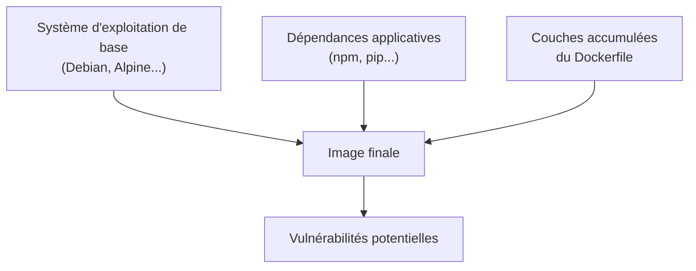

<div class="chapitre-titre-num">CHAPITRE 36 · 🟠 AVANCÉ</div>

# Sécurité des images Docker

<div class="encadre objectif">
<span class="encadre-titre">🎯 Objectif du chapitre</span>
Comprendre les vulnérabilités propres aux images Docker, l'importance des images officielles, le scan automatisé, et pourquoi minimiser les packages installés réduit la surface d'attaque. Ce chapitre clôt la Partie XI en approfondissant un maillon spécifique de la supply chain (chapitre 35, section 35.5) : l'image elle-même.
</div>

<div class="encadre scenario">
<span class="encadre-titre">🎬 Mise en situation</span>
Le chapitre 12 a déjà appliqué plusieurs bonnes pratiques de sécurité (utilisateur non-root, multi-stage build, image "slim") sans les justifier en profondeur du point de vue de la sécurité. Ce chapitre explique précisément pourquoi chacune de ces pratiques compte, et ajoute ce qui manquait : le scan de vulnérabilités, appliqué systématiquement à chaque image avant publication (chapitre 14) ou déploiement (chapitre 26).
</div>

## 36.1 D'où viennent les vulnérabilités d'une image Docker

<div class="encadre retenir">
<span class="encadre-titre">📌 Trois sources de vulnérabilités</span>
Le <strong>système d'exploitation de base</strong> (Debian, Alpine, Ubuntu) contient des paquets système avec leurs propres vulnérabilités connues, qui évoluent dans le temps. Les <strong>dépendances applicatives</strong> (npm, pip, Maven) déjà couvertes au chapitre 35 (section 35.2). Les <strong>couches accumulées</strong> du Dockerfile lui-même — un fichier ou un outil installé temporairement puis "supprimé" dans une instruction ultérieure reste souvent présent dans les couches précédentes de l'image (chapitre 25, section 25.1, déjà mentionné pour les secrets, s'applique identiquement à tout autre contenu).
</div>



## 36.2 Images officielles et vérifiées

<div class="encadre attention">
<span class="encadre-titre">⚠️ Pourquoi ne pas utiliser n'importe quelle image trouvée sur Docker Hub</span>
Docker Hub héberge des millions d'images, dont beaucoup publiées par des comptes individuels sans aucune vérification ni maintenance garantie — une image abandonnée depuis des années, jamais mise à jour, accumule des vulnérabilités connues jamais corrigées. Une image malveillante, déguisée en outil légitime, représente aussi un risque réel de supply chain (chapitre 35, section 35.5).
</div>

<div class="encadre bonne-pratique">
<span class="encadre-titre">✅ Bonne pratique — privilégier les images officielles ou vérifiées</span>
Docker Hub distingue les <strong>images officielles</strong> (maintenues par Docker en partenariat avec l'éditeur du logiciel — <code>node</code>, <code>postgres</code>, <code>nginx</code>, toutes déjà utilisées dans ce manuel) des images publiées par des comptes individuels non vérifiés. Privilégier systématiquement les images officielles, ou à défaut des images publiées par l'éditeur reconnu du logiciel (badge "Verified Publisher"), plutôt qu'une image inconnue trouvée par une recherche rapide.
</div>

## 36.3 Scanner une image avant de la déployer

```bash
docker scout cves mon-api:1.0.0
```

```yaml
- name: Scanner l'image
  uses: docker/scout-action@v1
  with:
    command: cves
    image: ${{ env.IMAGE_NAME }}:${{ github.sha }}
    exit-code: true
```

**Explication :** `docker scout` (intégré nativement à Docker Desktop et disponible en CI) analyse chaque couche de l'image à la recherche de vulnérabilités connues (CVE, même base de données que `npm audit` au chapitre 35) dans le système d'exploitation de base ET les dépendances applicatives ; `exit-code: true` fait échouer le pipeline si des vulnérabilités graves sont détectées — insérant ce contrôle directement après l'étape `build-and-push` du pipeline du chapitre 22, avant que l'image ne soit effectivement déployée.

<div class="encadre astuce">
<span class="encadre-titre">💡 Trivy, une alternative open source largement utilisée</span>
Trivy (Aqua Security) est un scanner open source largement adopté, fonctionnant selon le même principe et souvent utilisé en complément ou en alternative à Docker Scout, particulièrement dans des environnements qui ne souhaitent pas dépendre exclusivement de l'écosystème Docker.
</div>

```yaml
- name: Scanner avec Trivy
  uses: aquasecurity/trivy-action@master
  with:
    image-ref: ${{ env.IMAGE_NAME }}:${{ github.sha }}
    severity: "HIGH,CRITICAL"
    exit-code: "1"
```

## 36.4 Non-root : rappel et approfondissement du chapitre 12

<div class="encadre memoriser">
<span class="encadre-titre">🧠 Pourquoi ce principe, déjà appliqué depuis le chapitre 12, est central à la sécurité des images</span>
Un processus qui tourne en root à l'intérieur d'un conteneur, combiné à une éventuelle faille du moteur Docker permettant une évasion de conteneur (rare mais documentée historiquement), donnerait un accès root directement sur la machine hôte. Un utilisateur non-root (chapitre 12, section 12.5) réduit drastiquement l'impact d'un tel scénario, même s'il ne l'élimine pas à lui seul entièrement.
</div>

```bash
# Vérifier qu'une image ne tourne pas en root
docker inspect --format='{{.Config.User}}' mon-api:1.0.0
```

**Résultat attendu** : un nom d'utilisateur non vide (par exemple `appuser`) — une chaîne vide signale que l'image tourne en root par défaut, un signal d'alerte à corriger avant tout déploiement.

## 36.5 Minimiser les packages installés

<div class="encadre retenir">
<span class="encadre-titre">📌 Chaque package installé est une surface d'attaque potentielle supplémentaire</span>
Un outil de débogage, un client de base de données, ou un utilitaire réseau installé "au cas où" dans une image de production, mais jamais réellement utilisé par l'application elle-même, n'apporte aucun bénéfice tout en élargissant la liste des composants à surveiller pour des vulnérabilités (section 36.1). Le multi-stage build (chapitre 12, section 12.4) est déjà la principale défense contre ce risque — ce chapitre en explique la justification de sécurité complète, pas seulement la justification de taille.
</div>

```dockerfile
# Anti-pattern : outils de débogage laissés dans l'image finale
FROM node:20-slim
RUN apt-get update && apt-get install -y curl vim netcat htop
# ... reste du Dockerfile
```

```dockerfile
# Bonne pratique : rien d'installé qui ne soit pas strictement nécessaire à l'exécution
FROM node:20-slim
WORKDIR /app
COPY package.json package-lock.json ./
RUN npm ci --omit=dev
COPY . .
USER appuser
CMD ["node", "index.js"]
```

<div class="encadre astuce">
<span class="encadre-titre">💡 Images "distroless" : l'extrême minimalisme</span>
Les images <em>distroless</em> (maintenues par Google) vont plus loin que "slim"/"alpine" : elles ne contiennent <strong>aucun</strong> shell, gestionnaire de paquets, ni outil système — uniquement le strict runtime nécessaire à l'exécution de l'application. Cette absence même de shell empêche un attaquant qui obtiendrait un accès au conteneur d'y exécuter la moindre commande interactive — une protection puissante, au prix d'un débogage plus difficile (impossible de faire un simple `docker exec -it ... bash`, chapitre 11).
</div>

## Atelier — Scanner et durcir l'image du chapitre 22

<div class="encadre exercice">
<span class="encadre-titre">🛠️ Atelier 36.1 — De la vulnérabilité détectée à l'image corrigée</span>

**Objectif** : appliquer un scan réel à l'image du chapitre 22, et corriger les problèmes détectés.

**Étapes détaillées** :

1. Construis l'image du chapitre 22, scanne-la avec `docker scout cves` (ou Trivy).
2. Note les vulnérabilités détectées, en particulier celles de sévérité haute ou critique.
3. Vérifie leur origine (image de base obsolète ? dépendance vulnérable ? section 36.1).
4. Corrige : mets à jour l'image de base vers une version plus récente, mets à jour les dépendances concernées (`npm update`, ou une version précise si nécessaire).
5. Reconstruis et rescanne, confirme la réduction du nombre de vulnérabilités.
6. Ajoute le scan (section 36.3) directement au pipeline CI/CD du chapitre 22, avec `exit-code: true`.

**Résultat attendu** : un pipeline qui bloque désormais explicitement la publication d'une image contenant des vulnérabilités graves connues — la dernière pièce du dispositif DevSecOps du chapitre 35.
</div>

## Erreurs fréquentes

<div class="encadre attention">
<span class="encadre-titre">⚠️ Erreur n°1 — Une image de base jamais mise à jour</span>
Une image construite une fois et jamais reconstruite (même sans changement de code applicatif) accumule les vulnérabilités découvertes après sa construction initiale — reconstruire périodiquement une image, même sans changement de code, pour intégrer les correctifs de sécurité de l'image de base et des dépendances.
</div>

<div class="encadre attention">
<span class="encadre-titre">⚠️ Erreur n°2 — Des outils de débogage laissés dans l'image de production</span>
Comme illustré en section 36.5, des outils installés temporairement pour du débogage, jamais retirés, élargissent inutilement la surface d'attaque d'une image de production.
</div>

<div class="encadre attention">
<span class="encadre-titre">⚠️ Erreur n°3 — Ignorer les résultats d'un scan par manque de temps</span>
Un scan configuré mais dont les résultats ne bloquent jamais réellement le pipeline (`exit-code: false` ou absent) perd tout son intérêt pratique — exactement le même piège que les alertes de monitoring ignorées (chapitre 32) ou les vulnérabilités de dépendances non triées (chapitre 35).
</div>

## En entreprise

**Réalité répandue** : le scan d'images est aujourd'hui largement automatisé et intégré directement aux registres eux-mêmes (Docker Hub, GitHub Container Registry, les registres cloud du chapitre 40 proposent tous un scan intégré) — de moins en moins besoin d'un outil totalement séparé pour cette fonction de base.

**Bonne pratique répandue** : une politique de reconstruction périodique automatique (souvent hebdomadaire, via un workflow `schedule`, chapitre 21 section 21.6) reconstruit les images même sans changement de code, pour intégrer les derniers correctifs de sécurité de l'image de base — une pratique qui répond directement à l'erreur fréquente n°1.

**Erreur classique observée** : des images de production construites à partir d'une image de base non maintenue depuis longtemps, découvertes vulnérables seulement lors d'un audit de sécurité externe — un risque totalement évitable avec un scan intégré au pipeline dès le départ (section 36.3).

## Entretien technique

<div class="encadre exercice">
<span class="encadre-titre">💼 Questions fréquemment posées en entretien</span>

**Q1. "Quelles sont les trois sources principales de vulnérabilités dans une image Docker ?"**
Réponse attendue : le système d'exploitation de base, les dépendances applicatives, et les couches accumulées du Dockerfile lui-même (section 36.1).

**Q2. "Comment intégrerais-tu un scan de vulnérabilités dans un pipeline CI/CD ?"**
Réponse attendue : un outil comme Docker Scout ou Trivy, exécuté après la construction de l'image, avec `exit-code` configuré pour bloquer le pipeline en cas de vulnérabilité grave — placé avant l'étape de déploiement (section 36.3).

**Q3. "Qu'apporte une image 'distroless' par rapport à une image 'slim' classique ?"**
Réponse attendue : l'absence totale de shell et d'outils système, empêchant toute exécution de commande interactive même en cas d'accès obtenu au conteneur — une protection plus forte, au prix d'un débogage plus difficile (section 36.5).
</div>

## Optimisation, sécurité et maintenabilité — les réflexes dès ce chapitre

<div class="encadre securite">
<span class="encadre-titre">🔒 Sécurité</span>
Ce chapitre entier est une extension du chapitre 35 appliquée spécifiquement aux images Docker — scan systématique, images officielles, non-root, minimisation des packages, reconstruction périodique.
</div>

<div class="encadre bonne-pratique">
<span class="encadre-titre">✅ Maintenabilité</span>
Documente la politique de reconstruction périodique et de gestion des vulnérabilités détectées (corrigées, acceptées avec justification) de la même façon que le chapitre 35 l'a recommandé pour les dépendances applicatives — une cohérence de documentation entre les deux chapitres complémentaires.
</div>

<div class="encadre performance">
<span class="encadre-titre">🚀 Performance</span>
Une image minimale (section 36.5) n'est pas seulement plus sûre — elle reste aussi plus rapide à construire, transférer et démarrer, un bénéfice qui recoupe directement les optimisations de taille déjà motivées au chapitre 12.
</div>

## Résumé du chapitre

- Les vulnérabilités d'une image proviennent du système d'exploitation de base, des dépendances applicatives, et des couches accumulées du Dockerfile.
- Privilégier les images officielles ou vérifiées plutôt qu'une image inconnue trouvée sur un registre public.
- Un scan de vulnérabilités (Docker Scout, Trivy) intégré au pipeline, avec blocage effectif en cas de problème grave, complète le dispositif DevSecOps du chapitre 35.
- L'utilisateur non-root et la minimisation des packages installés réduisent la surface d'attaque, au-delà du simple bénéfice de taille déjà motivé au chapitre 12.
- Une reconstruction périodique, même sans changement de code, intègre les correctifs de sécurité les plus récents.

## Quiz

<div class="encadre exercice">
<span class="encadre-titre">📝 QCM (une seule bonne réponse par question)</span>

1. Une image Docker "officielle" sur Docker Hub :
   - a) Est identique à n'importe quelle image publiée par un compte individuel
   - b) Est maintenue par Docker en partenariat avec l'éditeur du logiciel, généralement mieux suivie
   - c) Ne peut jamais contenir de vulnérabilité
   - d) Coûte toujours de l'argent

2. Un scan de vulnérabilités avec `exit-code: true` dans un pipeline CI/CD :
   - a) N'a aucun effet sur le pipeline
   - b) Fait échouer le pipeline si des vulnérabilités graves sont détectées
   - c) Supprime automatiquement l'image
   - d) Envoie uniquement un email informatif

3. Une image "distroless" se caractérise par :
   - a) L'absence totale de shell et d'outils système
   - b) Une taille toujours plus grande qu'une image standard
   - c) L'obligation de tourner en root
   - d) L'impossibilité de l'utiliser en production

**Corrigé** : 1-b, 2-b, 3-a.
</div>

<div class="encadre exercice">
<span class="encadre-titre">📝 Vrai ou Faux</span>

1. Une image construite une fois reste sûre indéfiniment, sans jamais avoir besoin d'être reconstruite. — **Faux** (section "Erreurs fréquentes", erreur n°1).
2. Des outils de débogage laissés dans une image de production élargissent sa surface d'attaque. — **Vrai** (section 36.5).
3. Un scan de vulnérabilités configuré mais qui ne bloque jamais réellement le pipeline perd une grande partie de son intérêt pratique. — **Vrai** (section "Erreurs fréquentes", erreur n°3).

</div>

## Exercices

<div class="encadre exercice">
<span class="encadre-titre">📝 Exercice 36.1</span>

Un scan révèle qu'une image de production utilise `node:18-slim`, une version qui n'est plus maintenue activement (fin de vie), avec plusieurs vulnérabilités connues jamais corrigées dans cette branche. Décris la correction à appliquer et pourquoi une simple correction ponctuelle ne suffit pas à long terme.
</div>

**Corrigé :** la correction immédiate consiste à mettre à jour l'image de base vers une version activement maintenue (`node:20-slim` ou plus récente selon le support disponible au moment de la lecture), reconstruire et rescanner pour confirmer la réduction des vulnérabilités (section 36.3-36.1). Mais une correction ponctuelle ne suffit pas seule à long terme : sans reconstruction périodique automatisée (section "En entreprise"), la même situation se reproduira inévitablement quand cette nouvelle version de base atteindra à son tour sa fin de vie — la vraie solution durable combine la correction immédiate avec une politique de reconstruction régulière et un scan systématique intégré au pipeline (section 36.3), pour détecter ce type de dérive avant qu'elle ne s'accumule à nouveau silencieusement.

## Checklist de fin de chapitre

<ul class="checklist">
<li>☐ Je comprends les trois sources de vulnérabilités d'une image Docker.</li>
<li>☐ Je privilégie systématiquement les images officielles ou vérifiées.</li>
<li>☐ J'ai intégré un scan de vulnérabilités (Docker Scout ou Trivy) au pipeline, avec blocage effectif.</li>
<li>☐ Je vérifie que mes images tournent en utilisateur non-root.</li>
<li>☐ Je minimise les packages installés, sans outils de débogage inutiles en production.</li>
<li>☐ J'ai une politique de reconstruction périodique pour intégrer les correctifs de sécurité récents.</li>
</ul>

## FAQ

<dl class="faq">
<dt>Docker Scout ou Trivy : lequel choisir ?</dt>
<dd>Docker Scout, intégré nativement à l'écosystème Docker (déjà utilisé depuis le chapitre 3), est souvent le plus simple à mettre en place immédiatement ; Trivy, open source et indépendant, offre une flexibilité supplémentaire et une adoption large hors de l'écosystème Docker strict — les deux sont des choix valables, parfois utilisés en complément l'un de l'autre.</dd>

<dt>Faut-il scanner aussi les images de base elles-mêmes, pas seulement l'image finale construite ?</dt>
<dd>Les scanners de ce chapitre analysent déjà l'image finale complète, couches comprises, donc l'image de base est automatiquement incluse dans l'analyse — pas besoin d'un scan séparé de l'image de base isolément.</dd>

<dt>Les images "distroless" sont-elles adaptées à tous les projets de ce manuel ?</dt>
<dd>Elles conviennent bien à des applications déjà stables, où le débogage interactif direct dans le conteneur (chapitre 11) est rarement nécessaire — pour un projet encore en développement actif, une image "slim" plus classique reste souvent un compromis plus pratique au quotidien.</dd>
</dl>

## Références et pour aller plus loin

- Documentation officielle Docker Scout : [https://docs.docker.com/scout/](https://docs.docker.com/scout/)
- Trivy — documentation officielle : [https://trivy.dev](https://trivy.dev)
- Images distroless — dépôt officiel Google : [https://github.com/GoogleContainerTools/distroless](https://github.com/GoogleContainerTools/distroless)

*Chapitre suivant : Infrastructure as Code — la Partie XII s'ouvre. Pourquoi éviter la configuration manuelle de serveurs, et une introduction à Terraform, qui automatisera enfin le provisionnement resté manuel depuis le chapitre 26.*
