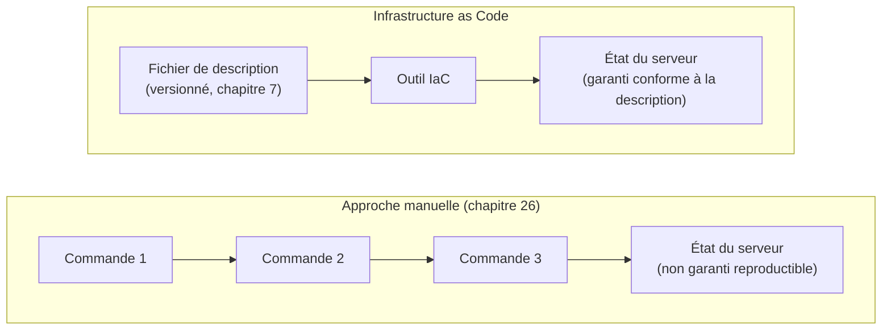

<div class="chapitre-titre-num">CHAPITRE 37 · 🟠 AVANCÉ</div>

# Infrastructure as Code

<div class="encadre objectif">
<span class="encadre-titre">🎯 Objectif du chapitre</span>
Comprendre pourquoi configurer manuellement des serveurs devient un problème à mesure qu'une infrastructure grandit, et découvrir les concepts fondamentaux de l'Infrastructure as Code : configuration déclarative, variables, state, modules. Ce chapitre ouvre la Partie XII et prépare directement le chapitre 38 (Terraform en pratique), qui automatisera enfin le provisionnement resté manuel depuis le chapitre 26.
</div>

<div class="encadre scenario">
<span class="encadre-titre">🎬 Mise en situation</span>
Le chapitre 26 a établi une distinction importante (section 26.1, rappelée au chapitre 27, section 27.3) : le provisionnement d'un serveur (le créer, l'installer, le sécuriser) est resté manuel, contrairement au déploiement applicatif, entièrement automatisé depuis le chapitre 27. Ce chapitre explique pourquoi cette dernière étape manuelle pose problème à mesure qu'un projet grandit, et introduit la solution : décrire l'infrastructure elle-même comme du code.
</div>

## 37.1 Le problème de la configuration manuelle

<div class="encadre attention">
<span class="encadre-titre">⚠️ Ce qui se passe quand on configure des serveurs "à la main", au fil du temps</span>
Un serveur configuré manuellement (chapitre 26) accumule, au fil des mois, des ajustements ponctuels jamais documentés précisément : un paquet installé pour dépanner un problème ponctuel, un fichier de configuration modifié directement sans trace dans Git. Après un an, personne ne sait plus reconstituer exactement l'état de ce serveur à partir d'une documentation à jour — un phénomène connu sous le nom de <strong>configuration drift</strong> (dérive de configuration), où l'état réel s'éloigne progressivement de tout ce qui est documenté.
</div>


<div class="encadre astuce">
<span class="encadre-titre">💡 Analogie — la recette de cuisine jamais réécrite</span>
Configurer un serveur manuellement, sans jamais documenter précisément chaque changement, ressemble à cuisiner un plat en improvisant à chaque fois de nouveaux ajustements sans jamais mettre à jour la recette écrite. Le plat (le serveur) fonctionne peut-être très bien aujourd'hui — mais personne ne pourrait le reproduire à l'identique demain, sur un nouveau serveur, sans deviner ou se souvenir de chaque ajustement fait au fil du temps.
</div>

## 37.2 Infrastructure as Code : décrire plutôt qu'exécuter

<div class="encadre retenir">
<span class="encadre-titre">📌 Définition</span>
L'<strong>Infrastructure as Code</strong> (IaC) consiste à décrire l'état souhaité d'une infrastructure (serveurs, réseau, ressources cloud) dans des fichiers texte versionnés — exactement comme le code applicatif (chapitre 7) — plutôt que de l'atteindre par une séquence de commandes exécutées manuellement. Un outil IaC (Terraform, chapitre 38) lit cette description et se charge de créer, modifier ou détruire les ressources réelles pour correspondre exactement à ce qui est décrit.
</div>



## 37.3 Configuration déclarative vs impérative

<div class="encadre retenir">
<span class="encadre-titre">📌 Une distinction centrale</span>
Une approche <strong>impérative</strong> décrit une séquence d'étapes à exécuter (exactement les scripts Bash du chapitre 10 : "installe ceci, puis fais cela, puis redémarre ce service"). Une approche <strong>déclarative</strong> décrit uniquement l'état final souhaité ("ce serveur doit exister, avec cette configuration réseau, ce disque, ces règles de pare-feu") — sans préciser les étapes exactes, laissant l'outil déterminer lui-même comment atteindre cet état à partir de la situation actuelle.
</div>

```hcl
# Exemple déclaratif (syntaxe Terraform, approfondi au chapitre 38)
resource "digitalocean_droplet" "serveur_labo" {
  name   = "labo-devops"
  region = "nyc1"
  size   = "s-1vcpu-1gb"
  image  = "ubuntu-24-04-x64"
}
```

**Explication :** ce fichier ne dit jamais "exécute la commande de création de serveur" — il déclare simplement qu'un serveur avec ces caractéristiques précises **devrait exister**. Que ce serveur n'existe pas encore (première exécution) ou existe déjà avec une caractéristique différente (une modification à appliquer), l'outil détermine lui-même l'action nécessaire — une différence fondamentale avec un script Bash qui exécuterait aveuglément les mêmes commandes à chaque fois.

## 37.4 Idempotence : le principe hérité du chapitre 10, appliqué à l'infrastructure

<div class="encadre memoriser">
<span class="encadre-titre">🧠 Rappel direct du chapitre 10</span>
Le chapitre 10 (section 10.1) a défini l'idempotence comme la capacité d'un script à produire le même résultat, exécuté une ou plusieurs fois. L'Infrastructure as Code pousse ce principe encore plus loin : exécuter la même description plusieurs fois de suite ne devrait <strong>jamais</strong> recréer une ressource déjà existante et conforme — seules les différences réelles entre l'état actuel et l'état décrit déclenchent une action.
</div>

## 37.5 State : la mémoire de ce qui a été créé

<div class="encadre attention">
<span class="encadre-titre">⚠️ Comment l'outil sait ce qui existe déjà</span>
Pour comparer l'état souhaité (le fichier de description) à l'état réel, un outil IaC doit garder une trace de ce qu'il a lui-même créé — ce fichier de suivi s'appelle le <strong>state</strong> (état). Sans lui, l'outil ne pourrait pas distinguer "cette ressource n'existe pas encore, il faut la créer" de "cette ressource existe déjà, rien à faire" — approfondi concrètement au chapitre 38, avec ses implications pratiques importantes (notamment sur le travail en équipe).
</div>

## 37.6 Modules : réutiliser une description d'infrastructure

<div class="encadre astuce">
<span class="encadre-titre">💡 Un module ressemble à une fonction, appliquée à l'infrastructure</span>
Exactement comme une fonction en programmation évite de dupliquer la même logique partout (chapitre 23, section 23.2), un <strong>module</strong> IaC encapsule une description d'infrastructure réutilisable — par exemple, "un serveur web standard avec Nginx et un pare-feu de base" — paramétrable (nom, taille, région) et réutilisable pour chaque nouveau projet, sans jamais réécrire la même description depuis zéro.
</div>

## Atelier — Documenter le "configuration drift" de son propre laboratoire

<div class="encadre exercice">
<span class="encadre-titre">🛠️ Atelier 37.1 — Constater la dérive, sans encore la corriger</span>

**Objectif** : prendre conscience concrètement du problème que ce chapitre introduit, avant de le résoudre au chapitre 38.

**Étapes détaillées** :

1. Sur ton serveur de laboratoire (configuré depuis le chapitre 3, modifié à travers de nombreux chapitres depuis), essaie de lister, de mémoire, tous les paquets installés et toutes les configurations modifiées depuis le début de ce manuel.
2. Compare cette liste à `dpkg -l` (liste réelle des paquets installés, chapitre 4) et à un inventaire réel des fichiers de configuration modifiés (`/etc/nginx/`, `/etc/ssh/sshd_config`, crontab...).
3. Constate l'écart entre ta mémoire (ou une documentation informelle) et l'état réel du serveur.

**Résultat attendu** : une prise de conscience concrète du "configuration drift" (section 37.1) — même en ayant suivi ce manuel chapitre par chapitre, reconstituer précisément l'état exact d'un serveur de mémoire s'avère déjà difficile après seulement quelques dizaines de chapitres.
</div>

## Erreurs fréquentes

<div class="encadre attention">
<span class="encadre-titre">⚠️ Erreur n°1 — Continuer à modifier manuellement un serveur géré par l'Infrastructure as Code</span>
Une fois un serveur sous gestion IaC (chapitre 38), une modification manuelle directe (par exemple, en se connectant en SSH pour ajuster un paramètre "rapidement") crée immédiatement un écart entre l'état réel et la description — recréant exactement le problème que l'IaC est censé éliminer.
</div>

<div class="encadre attention">
<span class="encadre-titre">⚠️ Erreur n°2 — Confondre Infrastructure as Code et scripts d'automatisation (chapitre 10)</span>
Les scripts Bash du chapitre 10 sont impératifs (une séquence de commandes) ; l'Infrastructure as Code est déclarative (un état décrit). Les deux sont complémentaires — l'IaC provisionne l'infrastructure, les scripts d'automatisation ou le pipeline CI/CD (chapitre 27) gèrent ensuite le déploiement applicatif dessus — mais ne sont jamais interchangeables.
</div>

<div class="encadre attention">
<span class="encadre-titre">⚠️ Erreur n°3 — Adopter l'Infrastructure as Code pour un unique petit serveur, sans réel besoin</span>
Pour un seul serveur de laboratoire simple, la rigueur complète de l'Infrastructure as Code peut représenter une complexité disproportionnée par rapport au bénéfice réel — un principe déjà appliqué à Kubernetes (chapitre 9, section 9.3) et repris ici : proportionner l'outil au besoin réel, jamais l'adopter par principe seul.
</div>

## En entreprise

**Réalité répandue** : l'Infrastructure as Code est devenue une pratique standard dès qu'une organisation gère plus de quelques serveurs, ou dès que plusieurs personnes doivent pouvoir reproduire ou modifier une infrastructure de façon fiable et coordonnée.

**Bonne pratique répandue** : les descriptions d'infrastructure sont versionnées et revues par pull request (chapitre 8), exactement comme le code applicatif — un changement d'infrastructure passe par la même discipline de revue avant d'être appliqué, jamais exécuté directement sans trace.

**Erreur classique observée** : une adoption partielle de l'Infrastructure as Code, où certains serveurs sont gérés par le code et d'autres encore manuellement, créant une confusion sur quelle source de vérité fait réellement foi — une transition complète, même progressive, reste préférable à un état hybride permanent et ambigu.

## Entretien technique

<div class="encadre exercice">
<span class="encadre-titre">💼 Questions fréquemment posées en entretien</span>

**Q1. "Qu'est-ce que le 'configuration drift', et comment l'Infrastructure as Code le résout-il ?"**
Réponse attendue : la dérive progressive entre l'état réel d'un serveur et sa documentation, causée par des ajustements manuels jamais tracés — l'IaC élimine ce risque en faisant du fichier de description la seule source de vérité, appliquée par un outil plutôt que devinée manuellement (section 37.1-37.2).

**Q2. "Quelle est la différence entre une approche déclarative et impérative en Infrastructure as Code ?"**
Réponse attendue : l'impératif décrit une séquence d'étapes à exécuter ; le déclaratif décrit uniquement l'état final souhaité, laissant l'outil déterminer les actions nécessaires pour l'atteindre (section 37.3).

**Q3. "Pourquoi ne jamais modifier manuellement un serveur géré par de l'Infrastructure as Code ?"**
Réponse attendue : cela crée un écart immédiat entre l'état réel et la description, recréant le problème de dérive que l'IaC est censé éliminer — toute modification doit passer par une mise à jour de la description elle-même (section "Erreurs fréquentes", erreur n°1).
</div>

## Optimisation, sécurité et maintenabilité — les réflexes dès ce chapitre

<div class="encadre securite">
<span class="encadre-titre">🔒 Sécurité</span>
Une description d'infrastructure versionnée (chapitre 7) permet un audit complet de qui a changé quoi et quand — une traçabilité impossible avec des modifications manuelles directes sur un serveur, particulièrement utile en cas d'incident de sécurité à investiguer.
</div>

<div class="encadre bonne-pratique">
<span class="encadre-titre">✅ Maintenabilité</span>
Traite les fichiers de description d'infrastructure avec la même rigueur que le code applicatif — revue de code (chapitre 8), tests quand c'est possible, documentation claire des choix effectués.
</div>

<div class="encadre performance">
<span class="encadre-titre">🚀 Performance</span>
Recréer une infrastructure identique (pour un nouvel environnement, chapitre 18, ou après un incident majeur) devient une opération de quelques minutes avec l'Infrastructure as Code, contre potentiellement plusieurs heures de configuration manuelle méticuleuse en suivant le chapitre 26 étape par étape.
</div>

## Résumé du chapitre

- La configuration manuelle d'un serveur accumule, avec le temps, un "configuration drift" difficile à documenter et reproduire.
- L'Infrastructure as Code décrit l'état souhaité d'une infrastructure dans des fichiers versionnés, plutôt que de l'atteindre par des commandes exécutées manuellement.
- L'approche déclarative décrit uniquement l'état final, laissant l'outil déterminer les actions nécessaires — contrairement à l'approche impérative des scripts du chapitre 10.
- Le state garde la trace de ce qui a été créé, permettant à l'outil de comparer l'état réel à l'état souhaité.
- Les modules encapsulent une description d'infrastructure réutilisable, comme une fonction appliquée à l'infrastructure.

## Quiz

<div class="encadre exercice">
<span class="encadre-titre">📝 QCM (une seule bonne réponse par question)</span>

1. Le "configuration drift" désigne :
   - a) Un outil de déploiement automatique
   - b) La dérive progressive entre l'état réel d'un serveur et sa documentation
   - c) Une stratégie de déploiement
   - d) Un type de conteneur Docker

2. Une approche déclarative en Infrastructure as Code :
   - a) Décrit une séquence précise de commandes à exécuter
   - b) Décrit uniquement l'état final souhaité, laissant l'outil déterminer comment l'atteindre
   - c) Nécessite toujours une intervention manuelle
   - d) Ne peut jamais être versionnée

3. Modifier manuellement un serveur géré par de l'Infrastructure as Code :
   - a) Est toujours sans risque
   - b) Crée un écart entre l'état réel et la description, recréant le problème de dérive
   - c) Met automatiquement à jour la description
   - d) Est la méthode recommandée pour les changements urgents

**Corrigé** : 1-b, 2-b, 3-b.
</div>

<div class="encadre exercice">
<span class="encadre-titre">📝 Vrai ou Faux</span>

1. Les scripts Bash du chapitre 10 et l'Infrastructure as Code sont exactement la même chose. — **Faux** (section "Erreurs fréquentes", erreur n°2).
2. Un module IaC permet de réutiliser une description d'infrastructure, comme une fonction en programmation. — **Vrai** (section 37.6).
3. L'Infrastructure as Code est toujours nécessaire, même pour un unique petit serveur de laboratoire. — **Faux** (section "Erreurs fréquentes", erreur n°3).

</div>

## Exercices

<div class="encadre exercice">
<span class="encadre-titre">📝 Exercice 37.1</span>

Explique, en tes propres mots, pourquoi l'idempotence (chapitre 10) est un principe encore plus critique en Infrastructure as Code qu'elle ne l'était déjà pour un simple script Bash.
</div>

**Corrigé :** un script Bash s'exécute généralement une seule fois de façon consciente, dans un contexte précis ; une description Infrastructure as Code, elle, est conçue pour être réappliquée régulièrement — à chaque changement, parfois automatiquement via un pipeline (à l'image du chapitre 27) — sans qu'un humain vérifie systématiquement l'état actuel avant chaque exécution (section 37.4). Sans idempotence garantie, réappliquer la même description pourrait dupliquer des ressources déjà existantes ou provoquer des erreurs inattendues, un risque bien plus systématique et automatisé que celui d'un script Bash exécuté ponctuellement et consciemment.

## Checklist de fin de chapitre

<ul class="checklist">
<li>☐ Je comprends le problème du "configuration drift" causé par la configuration manuelle.</li>
<li>☐ Je sais expliquer ce qu'est l'Infrastructure as Code et en quoi elle diffère d'un script d'automatisation.</li>
<li>☐ Je comprends la différence entre approche déclarative et impérative.</li>
<li>☐ Je comprends le rôle du state dans un outil IaC.</li>
<li>☐ Je comprends l'intérêt des modules pour réutiliser une description d'infrastructure.</li>
<li>☐ Je sais pourquoi ne jamais modifier manuellement un serveur géré par de l'Infrastructure as Code.</li>
</ul>

## FAQ

<dl class="faq">
<dt>Faut-il apprendre l'Infrastructure as Code dès le premier projet personnel ?</dt>
<dd>Pas nécessairement — pour un unique serveur de test ou un projet personnel simple, la procédure manuelle du chapitre 26 reste tout à fait raisonnable (section "Erreurs fréquentes", erreur n°3). L'IaC devient particulièrement utile dès plusieurs serveurs, plusieurs environnements, ou un travail en équipe.</dd>

<dt>Terraform est-il le seul outil d'Infrastructure as Code ?</dt>
<dd>Non, Ansible, Pulumi, AWS CloudFormation (spécifique à AWS) sont d'autres options reconnues — Terraform, couvert au chapitre 38, reste l'un des plus utilisés et des plus indépendants du fournisseur cloud choisi.</dd>

<dt>L'Infrastructure as Code remplace-t-elle Docker Compose (chapitre 13) ?</dt>
<dd>Non, ils opèrent à des niveaux différents et se complètent : l'IaC provisionne l'infrastructure elle-même (le serveur, le réseau, le stockage) ; Docker Compose orchestre les conteneurs applicatifs qui tournent ensuite sur cette infrastructure déjà provisionnée.</dd>
</dl>

## Références et pour aller plus loin

- Martin Fowler — "InfrastructureAsCode" (article de référence) : [https://martinfowler.com/bliki/InfrastructureAsCode.html](https://martinfowler.com/bliki/InfrastructureAsCode.html)
- HashiCorp — "What is Infrastructure as Code?" : [https://www.hashicorp.com/en/resources/what-is-infrastructure-as-code](https://www.hashicorp.com/en/resources/what-is-infrastructure-as-code)

*Chapitre suivant : Terraform en pratique — `init`, `plan`, `apply`, `destroy`, avec un avertissement explicite sur les risques de cette dernière commande, pour provisionner enfin automatiquement un vrai serveur.*
