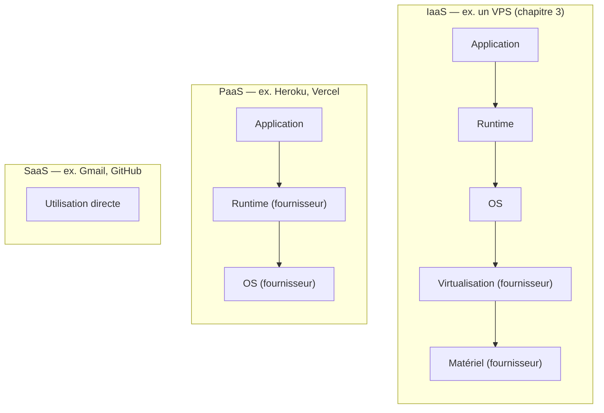
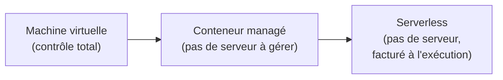

<div class="chapitre-titre-num">CHAPITRE 39 · 🟡 INTERMÉDIAIRE</div>

# Comprendre le Cloud

<div class="encadre objectif">
<span class="encadre-titre">🎯 Objectif du chapitre</span>
Comprendre les concepts fondamentaux du Cloud — IaaS, PaaS, SaaS, régions, zones, réseau, stockage, compute — indépendamment de tout fournisseur spécifique, avant d'aborder AWS en pratique au chapitre 40. Ce chapitre pose volontairement les concepts génériques d'abord : les mêmes idées, sous des noms parfois différents, s'appliquent chez AWS, Azure et GCP.
</div>

<div class="encadre scenario">
<span class="encadre-titre">🎬 Mise en situation</span>
Depuis le chapitre 3, ce manuel utilise un VPS générique — un serveur loué chez un fournisseur, sans jamais exploiter les services additionnels (stockage géré, base de données managée, réseau privé virtuel) qu'un vrai fournisseur cloud propose au-delà du simple serveur. Ce chapitre élargit le vocabulaire avant d'entrer, au chapitre 40, dans l'écosystème complet d'un fournisseur cloud précis.
</div>

## 39.1 IaaS, PaaS, SaaS : trois niveaux d'abstraction

<div class="encadre retenir">
<span class="encadre-titre">📌 Ce que chaque niveau gère, et ce qu'il te laisse gérer</span>

```text
                    Tu gères                    Le fournisseur gère
IaaS (Infrastructure)  → OS, runtime,            Matériel, virtualisation,
                          application, données      réseau physique
PaaS (Platform)         → application, données    OS, runtime, mises à jour
SaaS (Software)         → configuration seulement  Absolument tout le reste
```
</div>



<div class="encadre astuce">
<span class="encadre-titre">💡 Où se situe ce que ce manuel a déjà construit</span>
Le VPS du chapitre 3 est de l'<strong>IaaS</strong> — tu gères tout, du système d'exploitation jusqu'à l'application. Docker Hub (chapitre 14) et GitHub (chapitre 8) sont du <strong>SaaS</strong> — tu utilises directement le service, sans jamais gérer l'infrastructure sous-jacente. Une plateforme comme Vercel ou Heroku serait du <strong>PaaS</strong> — tu déploies ton code, la plateforme gère runtime et OS automatiquement, un compromis entre le contrôle complet de l'IaaS et la simplicité totale du SaaS.
</div>

## 39.2 Régions et zones

<div class="encadre retenir">
<span class="encadre-titre">📌 Vocabulaire géographique du Cloud</span>
Une <strong>région</strong> est une zone géographique large (par exemple, "Europe de l'Ouest", "Est des États-Unis") contenant plusieurs data centers physiquement séparés. Une <strong>zone de disponibilité</strong> (<em>Availability Zone</em>) est l'un de ces data centers individuels au sein d'une région — suffisamment proche des autres zones de la même région pour une latence réseau très faible entre elles, mais suffisamment isolée physiquement (alimentation électrique, réseau) pour qu'une panne d'une zone n'affecte pas les autres.
</div>

<div class="encadre bonne-pratique">
<span class="encadre-titre">✅ Pourquoi cette distinction compte pour la haute disponibilité (chapitre 49)</span>
Répartir une application sur plusieurs zones d'une même région (plutôt que sur une seule) protège contre une panne localisée d'un data center précis, sans le coût et la latence supplémentaire de répartir sur plusieurs régions distantes — un compromis directement lié au concept de "single point of failure" approfondi au chapitre 49.
</div>

## 39.3 Réseau dans le Cloud

<div class="encadre memoriser">
<span class="encadre-titre">🧠 Les briques réseau les plus courantes, indépendamment du fournisseur</span>

```text
VPC / Réseau virtuel  → un réseau privé isolé, propre à ton compte
Sous-réseau            → une subdivision du VPC (public/privé)
Passerelle Internet    → permet à un sous-réseau public de joindre Internet
Security Group         → un pare-feu au niveau de la ressource (équivalent cloud d'UFW, chapitre 5)
Load Balancer          → répartit le trafic entre plusieurs instances (chapitre 15, section 15.6, à l'échelle du Cloud)
```
</div>

<div class="encadre astuce">
<span class="encadre-titre">💡 Le VPC, un chapitre 5 à l'échelle du Cloud</span>
Un VPC (<em>Virtual Private Cloud</em>) applique, à l'échelle d'un compte cloud entier, les mêmes principes déjà vus au chapitre 5 pour un seul serveur : isolation réseau, contrôle explicite de ce qui est exposé. Un sous-réseau "privé" (sans passerelle Internet directe) pour une base de données, un sous-réseau "public" pour un serveur web — le même principe que "seul Nginx exposé" (chapitre 13, section 13.4), appliqué à l'échelle d'une infrastructure cloud complète.
</div>

## 39.4 Stockage dans le Cloud

| Type de stockage | Usage typique | Équivalent déjà vu dans ce manuel |
|---|---|---|
| **Stockage objet** (S3 et équivalents) | Fichiers, sauvegardes, contenu statique | Le stockage hors serveur du chapitre 31 (section 31.5) |
| **Stockage bloc** (disque géré) | Disque persistant attaché à une instance | Un volume Docker (chapitre 11), mais géré par le fournisseur |
| **Base de données managée** | PostgreSQL, MySQL... gérés par le fournisseur | PostgreSQL en conteneur (chapitre 11), mais sans gérer soi-même les sauvegardes, mises à jour, réplication |

<div class="encadre bonne-pratique">
<span class="encadre-titre">✅ Bonne pratique — une base de données managée réduit une charge opérationnelle réelle</span>
Une base de données managée automatise ce que les chapitres 30-31 ont montré comment faire manuellement : sauvegardes automatiques, mises à jour de sécurité, réplication pour la haute disponibilité. Le compromis : moins de contrôle fin, un coût généralement plus élevé qu'un simple conteneur auto-géré — un calcul à faire selon la criticité réelle de l'application et le temps disponible pour l'opérer soi-même.
</div>

## 39.5 Compute : au-delà du simple VPS

<div class="encadre retenir">
<span class="encadre-titre">📌 Trois modèles de compute</span>
Les <strong>machines virtuelles</strong> (le VPS du chapitre 3, à l'échelle du Cloud) offrent un contrôle complet, au prix de la responsabilité de tout gérer soi-même. Les <strong>conteneurs managés</strong> (ECS d'AWS, Cloud Run de GCP) exécutent directement des images Docker (chapitre 11) sans jamais gérer le serveur sous-jacent. Le <strong>serverless</strong> (fonctions comme AWS Lambda) exécute du code à la demande, sans jamais provisionner ni gérer de serveur du tout, facturé uniquement à l'exécution réelle.
</div>



## Atelier — Cartographier ce que ce manuel a déjà construit

<div class="encadre exercice">
<span class="encadre-titre">🛠️ Atelier 39.1 — Reconnaître IaaS, PaaS et SaaS dans son propre projet</span>

**Objectif** : s'entraîner à reconnaître, dans une architecture réelle, à quel niveau d'abstraction appartient chaque composant.

**Étapes détaillées** :

1. Liste tous les services utilisés par le projet des chapitres 22/27 : le VPS (chapitre 3), GitHub (chapitre 8), le registre d'images (chapitre 14), un éventuel service SMTP tiers.
2. Pour chacun, détermine s'il s'agit d'IaaS, PaaS ou SaaS (section 39.1).
3. Réfléchis : lequel de ces composants, actuellement en IaaS (le VPS), pourrait bénéficier d'un passage en PaaS ou en service managé (une base de données managée, section 39.4) ? Quel serait le compromis (coût, contrôle) ?

**Résultat attendu** : une cartographie claire du projet selon les trois niveaux, et une réflexion consciente sur les compromis de chaque choix — la préparation directe du chapitre 40, qui applique ces concepts à un fournisseur précis.
</div>

## Erreurs fréquentes

<div class="encadre attention">
<span class="encadre-titre">⚠️ Erreur n°1 — Confondre région et zone de disponibilité</span>
Une confusion fréquente chez les débutants : répartir des ressources entre deux régions différentes en pensant obtenir la protection d'une répartition multi-zone (section 39.2) — la latence et la complexité d'une répartition inter-régions sont bien plus importantes qu'entre zones d'une même région, pour un besoin souvent déjà couvert par une répartition multi-zone plus simple.
</div>

<div class="encadre attention">
<span class="encadre-titre">⚠️ Erreur n°2 — Choisir systématiquement le service le plus géré, sans considérer le coût</span>
Le serverless et les bases de données managées (sections 39.4-39.5) réduisent la charge opérationnelle mais à un coût souvent plus élevé qu'une gestion auto-hébergée — un choix à faire consciemment selon le contexte réel, jamais par défaut sans comparaison, un principe déjà appliqué à Kubernetes (chapitre 9) et à l'Infrastructure as Code (chapitre 37, section "Erreurs fréquentes", erreur n°3).
</div>

<div class="encadre attention">
<span class="encadre-titre">⚠️ Erreur n°3 — Un sous-réseau "privé" mal configuré, accidentellement joignable depuis Internet</span>
Une erreur de configuration réseau (une passerelle Internet accidentellement associée à un sous-réseau censé rester privé) peut exposer une base de données directement sur Internet, malgré une intention claire de la garder isolée (section 39.3) — vérifier explicitement la configuration réseau plutôt que de supposer qu'un sous-réseau nommé "privé" l'est réellement.
</div>

## En entreprise

**Réalité répandue** : la majorité des organisations utilisent un mélange de modèles — des machines virtuelles pour certains besoins spécifiques, des conteneurs managés pour la majorité des applications web, et du serverless pour des tâches ponctuelles ou événementielles (traitement d'image à la demande, tâche planifiée légère) — rarement un seul modèle appliqué uniformément partout.

**Bonne pratique répandue** : le choix entre gestion auto-hébergée (le VPS du chapitre 3) et services managés (section 39.4) se décide généralement selon la criticité de la donnée, la disponibilité de compétences internes pour l'opérer, et une analyse de coût réelle — jamais uniquement par tendance ou par défaut.

**Erreur classique observée** : une migration précipitée vers des services cloud managés très sophistiqués avant même d'avoir une vraie maîtrise des fondamentaux (les 38 chapitres précédents de ce manuel) — un service managé simplifie l'opération, jamais la nécessité de comprendre ce qu'il fait réellement en cas de problème.

## Entretien technique

<div class="encadre exercice">
<span class="encadre-titre">💼 Questions fréquemment posées en entretien</span>

**Q1. "Quelle est la différence entre IaaS, PaaS et SaaS ?"**
Réponse attendue : IaaS laisse gérer OS et runtime en plus de l'application ; PaaS gère OS et runtime, ne laissant que l'application et les données à la charge de l'utilisateur ; SaaS fournit un service complet, prêt à l'emploi, sans aucune gestion technique (section 39.1).

**Q2. "Pourquoi répartir une application sur plusieurs zones de disponibilité plutôt que sur plusieurs régions ?"**
Réponse attendue : une répartition multi-zone protège déjà contre une panne localisée d'un data center, avec une latence bien plus faible qu'une répartition inter-régions — suffisante pour la plupart des besoins de haute disponibilité, sans la complexité additionnelle d'une répartition géographique large (section 39.2).

**Q3. "Quand recommanderais-tu une base de données managée plutôt qu'une base auto-hébergée en conteneur ?"**
Réponse attendue : quand la charge opérationnelle de gérer soi-même sauvegardes, mises à jour et réplication (chapitres 30-31) dépasse la valeur du contrôle fin et de l'économie de coût qu'une gestion auto-hébergée permettrait, un calcul à faire selon la criticité et les ressources disponibles (section 39.4).
</div>

## Optimisation, sécurité et maintenabilité — les réflexes dès ce chapitre

<div class="encadre securite">
<span class="encadre-titre">🔒 Sécurité</span>
Un Security Group (section 39.3) mal configuré est l'équivalent cloud d'un pare-feu UFW mal configuré (chapitre 5) — la même rigueur de vérification s'applique, à une échelle où une erreur peut exposer davantage de ressources à la fois.
</div>

<div class="encadre bonne-pratique">
<span class="encadre-titre">✅ Maintenabilité</span>
Documente explicitement pourquoi chaque service a été choisi à un niveau d'abstraction précis (IaaS vs service managé) — une décision d'architecture cloud mérite la même justification claire que le choix d'une stratégie de branches (chapitre 9) ou de déploiement (chapitre 28).
</div>

<div class="encadre performance">
<span class="encadre-titre">🚀 Performance</span>
Choisir une région géographiquement proche des utilisateurs réels d'une application réduit directement la latence perçue — un facteur de performance souvent négligé au profit de considérations de coût seules.
</div>

## Résumé du chapitre

- IaaS, PaaS et SaaS représentent trois niveaux d'abstraction, chacun avec un compromis différent entre contrôle et charge opérationnelle.
- Une région contient plusieurs zones de disponibilité, physiquement isolées mais proches en latence — une répartition multi-zone protège contre une panne localisée.
- Un VPC applique, à l'échelle du Cloud, les mêmes principes d'isolation réseau déjà vus au chapitre 5.
- Le stockage objet, bloc et les bases de données managées correspondent à des besoins différents, avec des équivalents déjà construits manuellement dans ce manuel.
- Machines virtuelles, conteneurs managés et serverless offrent trois niveaux de gestion de l'exécution du code.

## Quiz

<div class="encadre exercice">
<span class="encadre-titre">📝 QCM (une seule bonne réponse par question)</span>

1. Un VPS classique (chapitre 3) correspond à :
   - a) Du SaaS
   - b) Du IaaS
   - c) Du PaaS uniquement
   - d) Aucun de ces modèles

2. Une zone de disponibilité, par rapport à une région :
   - a) Est une zone géographique plus large qu'une région
   - b) Est un data center individuel au sein d'une région
   - c) N'a aucun rapport avec la haute disponibilité
   - d) Remplace entièrement le concept de région

3. Le serverless se caractérise par :
   - a) La nécessité de gérer soi-même un serveur physique
   - b) L'exécution de code à la demande, sans jamais provisionner de serveur, facturé à l'exécution
   - c) Un coût toujours plus faible qu'une machine virtuelle
   - d) L'impossibilité d'utiliser des conteneurs

**Corrigé** : 1-b, 2-b, 3-b.
</div>

<div class="encadre exercice">
<span class="encadre-titre">📝 Vrai ou Faux</span>

1. GitHub et Docker Hub, utilisés depuis le début de ce manuel, sont des exemples de SaaS. — **Vrai** (section 39.1).
2. Une répartition sur plusieurs régions offre toujours une latence équivalente à une répartition sur plusieurs zones d'une même région. — **Faux** (section 39.2 et erreur fréquente n°1).
3. Un Security Group cloud joue un rôle équivalent à un pare-feu UFW sur un serveur individuel. — **Vrai** (section 39.3).

</div>

## Exercices

<div class="encadre exercice">
<span class="encadre-titre">📝 Exercice 39.1</span>

Une équipe hésite entre héberger sa base de données PostgreSQL en conteneur sur son propre VPS (comme construit au chapitre 13) ou utiliser une base de données managée. Liste deux arguments en faveur de chaque option.
</div>

**Corrigé (exemple de réponse) :** en faveur du conteneur auto-hébergé — coût potentiellement plus faible pour une petite application, contrôle total sur la configuration et les versions exactes utilisées (chapitre 11). En faveur d'une base de données managée — les sauvegardes, mises à jour de sécurité et réplication pour la haute disponibilité sont automatisées par le fournisseur (section 39.4), réduisant la charge opérationnelle de l'équipe et le risque d'une erreur humaine sur une tâche répétitive (chapitres 30-31) — un choix qui dépend finalement de la criticité de l'application et du temps réellement disponible pour opérer soi-même cette infrastructure.

## Checklist de fin de chapitre

<ul class="checklist">
<li>☐ Je sais distinguer IaaS, PaaS et SaaS, avec un exemple de chaque déjà rencontré dans ce manuel.</li>
<li>☐ Je comprends la différence entre région et zone de disponibilité.</li>
<li>☐ Je connais les briques réseau de base d'un Cloud (VPC, sous-réseau, Security Group, Load Balancer).</li>
<li>☐ Je sais distinguer stockage objet, stockage bloc et base de données managée.</li>
<li>☐ Je sais distinguer machine virtuelle, conteneur managé et serverless.</li>
<li>☐ Je sais évaluer consciemment le compromis coût/contrôle d'un service managé plutôt que de le choisir par défaut.</li>
</ul>

## FAQ

<dl class="faq">
<dt>Faut-il toujours utiliser un grand fournisseur cloud (AWS, Azure, GCP) plutôt qu'un simple VPS ?</dt>
<dd>Non — pour de nombreux projets de taille modeste, le VPS simple du chapitre 3 reste parfaitement adapté, souvent moins coûteux et plus simple à comprendre. Les grands fournisseurs cloud deviennent particulièrement pertinents à mesure que les besoins de scalabilité (Partie XIV), de services managés ou de conformité réglementaire grandissent.</dd>

<dt>Ces concepts sont-ils identiques chez tous les fournisseurs cloud ?</dt>
<dd>Les concepts (section "Règle sur les technologies" du plan éditorial de ce manuel) sont largement partagés, mais les noms diffèrent — un VPC AWS s'appelle un VNet chez Azure, par exemple. Le chapitre 40 (AWS pour DevOps) explicite le vocabulaire précis d'un fournisseur, à traduire mentalement vers les autres si besoin.</dd>

<dt>Le Cloud est-il toujours plus cher qu'un VPS traditionnel ?</dt>
<dd>Pas nécessairement — cela dépend fortement du modèle de facturation choisi (à la demande vs réservé, serverless vs machine virtuelle permanente) et du volume réel d'utilisation. Une analyse de coût précise, propre à chaque projet, reste nécessaire plutôt qu'une généralisation.</dd>
</dl>

## Références et pour aller plus loin

- NIST — définition officielle du Cloud Computing (référence historique du vocabulaire IaaS/PaaS/SaaS) : [https://www.nist.gov/publications/nist-definition-cloud-computing](https://www.nist.gov/publications/nist-definition-cloud-computing)
- AWS — "What is Cloud Computing?" (bonne synthèse pédagogique, malgré son origine chez un fournisseur précis) : [https://aws.amazon.com/what-is-cloud-computing/](https://aws.amazon.com/what-is-cloud-computing/)

*Chapitre suivant : AWS pour DevOps — EC2, VPC, Security Groups, IAM, EBS, S3, RDS, CloudWatch, Load Balancer, Route 53, appliqués concrètement pour construire une architecture réaliste.*
