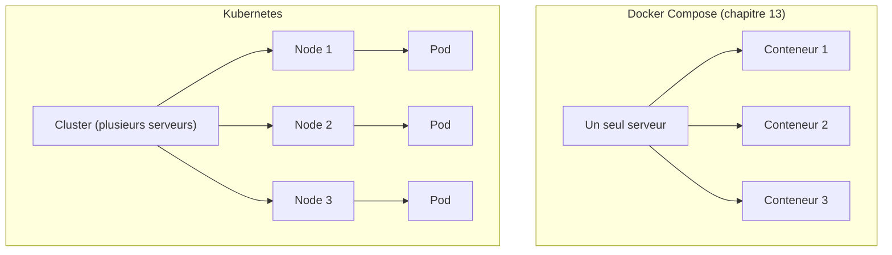

<div class="chapitre-titre-num">CHAPITRE 41 · 🔴 PROFESSIONNEL</div>

# Pourquoi Kubernetes

<div class="encadre objectif">
<span class="encadre-titre">🎯 Objectif du chapitre</span>
Comprendre le problème que Kubernetes résout avant d'en apprendre le vocabulaire — cluster, node, pod, deployment, service, ingress, configmap, secret, namespace, volume. Ce chapitre ouvre la Partie XIII en partant délibérément des limites concrètes de Docker Compose (chapitre 13), plutôt que d'une liste abstraite de fonctionnalités.
</div>

<div class="encadre scenario">
<span class="encadre-titre">🎬 Mise en situation</span>
Docker Compose (chapitre 13) orchestre parfaitement plusieurs conteneurs sur **un seul serveur**. Mais que se passe-t-il si ce serveur tombe en panne ? Que se passe-t-il si le trafic dépasse ce qu'un seul serveur peut absorber, même avec le Rolling deployment du chapitre 28 appliqué manuellement ? Kubernetes répond précisément à ces questions — jamais recommandé avant d'avoir rencontré ces limites concrètement, comme ce manuel le rappelle depuis le chapitre 9.
</div>

## 41.1 Les limites de Docker Compose que Kubernetes résout

<div class="encadre retenir">
<span class="encadre-titre">📌 Trois limites concrètes</span>
<strong>Un seul serveur</strong> : Docker Compose (chapitre 13) orchestre des conteneurs sur une seule machine — si ce serveur tombe, tout tombe avec lui, quelle que soit la qualité du reste de l'architecture. <strong>Pas de auto-réparation</strong> : un conteneur qui plante redémarre grâce à <code>Restart=on-failure</code> (chapitre 5, section 5.3) sur ce même serveur, mais rien ne recrée automatiquement un serveur entier disparu. <strong>Scaling manuel</strong> : ajouter une instance (chapitre 28, Rolling deployment) exige une intervention humaine ou un script sur mesure, jamais un ajustement automatique selon la charge réelle.
</div>



<div class="encadre astuce">
<span class="encadre-titre">💡 Analogie — du chef d'orchestre unique à l'orchestre entier</span>
Docker Compose ressemble à un chef d'orchestre dirigeant des musiciens tous rassemblés dans la même salle : efficace, mais si la salle brûle, tout l'orchestre s'arrête. Kubernetes ressemble à un système capable de coordonner plusieurs orchestres dans plusieurs salles différentes, redistribuant automatiquement les musiciens si une salle devient inutilisable, et ajoutant des musiciens supplémentaires si le public grandit soudainement.
</div>

## 41.2 Cluster et Node

<div class="encadre retenir">
<span class="encadre-titre">📌 Vocabulaire de base</span>
Un <strong>cluster</strong> est l'ensemble complet de serveurs gérés ensemble par Kubernetes. Un <strong>node</strong> est un serveur individuel au sein de ce cluster — équivalent conceptuel d'un VPS (chapitre 3) ou d'une instance EC2 (chapitre 40), mais dont Kubernetes prend en charge l'orchestration collective plutôt qu'un serveur unique géré isolément.
</div>

## 41.3 Pod : l'unité de base, pas le conteneur directement

<div class="encadre attention">
<span class="encadre-titre">⚠️ Kubernetes ne gère pas directement des conteneurs, mais des pods</span>
Contrairement à Docker seul (chapitre 11), Kubernetes ne manipule jamais un conteneur isolément — son unité de base est le <strong>pod</strong>, qui contient un ou plusieurs conteneurs partageant le même réseau et le même stockage. Le cas le plus courant : un pod avec un seul conteneur, se comportant alors presque comme le conteneur Docker déjà familier ; parfois, un pod regroupe un conteneur principal et un conteneur "sidecar" auxiliaire (par exemple, un conteneur qui collecte les logs du conteneur principal, chapitre 33).
</div>

```yaml
apiVersion: v1
kind: Pod
metadata:
  name: mon-api-pod
spec:
  containers:
    - name: api
      image: ghcr.io/ton-compte/mon-api:1.0.0
      ports:
        - containerPort: 3000
```

**Explication :** cette description reprend le vocabulaire déclaratif du chapitre 37 — ce fichier YAML décrit l'état souhaité d'un pod, jamais une séquence de commandes à exécuter.

## 41.4 Deployment : gérer plusieurs pods, avec auto-réparation

```yaml
apiVersion: apps/v1
kind: Deployment
metadata:
  name: mon-api
spec:
  replicas: 3
  selector:
    matchLabels:
      app: mon-api
  template:
    metadata:
      labels:
        app: mon-api
    spec:
      containers:
        - name: api
          image: ghcr.io/ton-compte/mon-api:1.0.0
          ports:
            - containerPort: 3000
```

**Explication :** un **Deployment** décrit combien de copies identiques d'un pod devraient exister (`replicas: 3`) — Kubernetes surveille en permanence cet état et **recrée automatiquement** tout pod qui disparaît (un crash, un node qui tombe en panne), sans intervention humaine. C'est la réponse directe à la limite "pas d'auto-réparation" de la section 41.1, et l'implémentation native du Rolling deployment (chapitre 28, section 28.2) évoqué dès ce chapitre.

## 41.5 Service : joindre des pods qui changent constamment

<div class="encadre attention">
<span class="encadre-titre">⚠️ Un pod peut disparaître et être recréé à tout moment, avec une nouvelle adresse</span>
Contrairement à un conteneur Docker Compose relativement stable (chapitre 11, section 11.5, résolution par nom de conteneur), un pod Kubernetes peut être détruit et recréé fréquemment (mise à jour, auto-réparation), changeant d'adresse IP interne à chaque fois. Un <strong>Service</strong> fournit une adresse stable et permanente, qui route automatiquement le trafic vers les pods actuellement vivants, quels qu'ils soient.
</div>

```yaml
apiVersion: v1
kind: Service
metadata:
  name: mon-api-service
spec:
  selector:
    app: mon-api
  ports:
    - port: 80
      targetPort: 3000
```

**Explication :** `selector: app: mon-api` relie ce Service à tous les pods portant ce label — reprenant le principe de résolution par nom déjà familier depuis le chapitre 11, mais résilient aux pods qui apparaissent et disparaissent.

## 41.6 Ingress : le Nginx de Kubernetes

<div class="encadre memoriser">
<span class="encadre-titre">🧠 Rappel direct du chapitre 15</span>
Un <strong>Ingress</strong> joue exactement le rôle de Nginx en reverse proxy (chapitre 15) — point d'entrée unique, routage selon le chemin ou le domaine, souvent avec HTTPS géré automatiquement (l'équivalent Kubernetes de Certbot, chapitre 16, existe via cert-manager, un outil complémentaire courant).
</div>

```yaml
apiVersion: networking.k8s.io/v1
kind: Ingress
metadata:
  name: mon-api-ingress
spec:
  rules:
    - host: api.exemple.com
      http:
        paths:
          - path: /
            pathType: Prefix
            backend:
              service:
                name: mon-api-service
                port:
                  number: 80
```

## 41.7 ConfigMap et Secret : la configuration du chapitre 18, native à Kubernetes

<div class="encadre memoriser">
<span class="encadre-titre">🧠 Rappel direct des chapitres 18 et 25</span>
Un <strong>ConfigMap</strong> stocke une configuration non sensible (équivalent Kubernetes natif de <code>.env.example</code>, chapitre 18) ; un <strong>Secret</strong> stocke une valeur sensible (équivalent Kubernetes natif des GitHub Secrets ou Docker secrets, chapitres 21 et 25) — les deux mêmes principes déjà maîtrisés, simplement natifs à cette plateforme.
</div>

## 41.8 Namespace et Volume

<div class="encadre retenir">
<span class="encadre-titre">📌 Deux derniers concepts</span>
Un <strong>namespace</strong> isole logiquement un groupe de ressources au sein d'un même cluster — utile pour séparer les environnements (chapitre 18 : development, staging, production) sur la même infrastructure physique, sans les mélanger. Un <strong>volume</strong> Kubernetes rend des données persistantes, exactement le même besoin que les volumes Docker (chapitre 11, section 11.4), mais capable de survivre même si le pod change de node au sein du cluster.
</div>

## Atelier — Traduire l'architecture du chapitre 13 en vocabulaire Kubernetes

<div class="encadre exercice">
<span class="encadre-titre">🛠️ Atelier 41.1 — Un exercice de traduction, sans encore déployer</span>

**Objectif** : s'approprier le vocabulaire de ce chapitre en traduisant, sur le papier, l'architecture Docker Compose du chapitre 13.

**Étapes détaillées** : pour l'architecture React + NestJS + PostgreSQL + Redis + Nginx du chapitre 13 (section 13.4), détermine :

1. Combien de Deployments seraient nécessaires, et avec combien de replicas chacun.
2. Quels Services relieraient ces Deployments entre eux.
3. Ce qui remplacerait le rôle de Nginx (Ingress).
4. Ce qui deviendrait un ConfigMap, et ce qui deviendrait un Secret.
5. Si PostgreSQL et Redis ont besoin d'un Volume persistant.

**Résultat attendu** : une traduction complète et cohérente, préparant directement le chapitre 42 (premier projet Kubernetes réel), qui déploiera concrètement cette même traduction.
</div>

## Erreurs fréquentes

<div class="encadre attention">
<span class="encadre-titre">⚠️ Erreur n°1 — Confondre pod et conteneur</span>
Comme détaillé en section 41.3, Kubernetes ne manipule jamais directement un conteneur isolé — toujours à travers un pod, qui peut en contenir plusieurs.
</div>

<div class="encadre attention">
<span class="encadre-titre">⚠️ Erreur n°2 — Adopter Kubernetes sans avoir rencontré les limites qu'il résout</span>
Rappel du principe déjà appliqué au chapitre 9 (section 9.3) et au chapitre 39 (section "Erreurs fréquentes") : Kubernetes ajoute une complexité réelle, justifiée uniquement une fois les limites concrètes de Docker Compose (section 41.1) effectivement rencontrées — jamais adopté par simple tendance.
</div>

<div class="encadre attention">
<span class="encadre-titre">⚠️ Erreur n°3 — Oublier qu'un Service est nécessaire pour joindre des pods de façon stable</span>
Tenter de joindre directement l'adresse IP d'un pod (plutôt qu'à travers un Service) échoue dès que ce pod est recréé — un piège pour qui vient de Docker Compose (chapitre 11) et suppose, par habitude, une stabilité d'adresse qui n'existe pas de la même façon ici.
</div>

## En entreprise

**Réalité répandue** : Kubernetes domine largement l'orchestration de conteneurs à grande échelle, mais reste souvent réservé aux organisations ayant réellement dépassé les limites de solutions plus simples (Docker Compose, une poignée de serveurs gérés manuellement) — de nombreuses équipes de taille modeste fonctionnent très bien sans jamais y recourir.

**Bonne pratique répandue** : les grands fournisseurs cloud proposent des versions managées de Kubernetes (EKS chez AWS, mentionné au chapitre 40 ; GKE chez GCP ; AKS chez Azure) qui réduisent la charge opérationnelle de gérer soi-même les nodes du cluster — un compromis coût/contrôle similaire à celui déjà présenté au chapitre 39 pour les services managés en général.

**Erreur classique observée** : des équipes qui migrent vers Kubernetes en espérant résoudre des problèmes de fiabilité qui proviennent en réalité d'une mauvaise conception applicative (état stocké localement, absence de healthchecks, chapitre 10) — Kubernetes orchestre mieux une application déjà bien conçue, il ne corrige pas une application mal conçue au départ.

## Entretien technique

<div class="encadre exercice">
<span class="encadre-titre">💼 Questions fréquemment posées en entretien</span>

**Q1. "Quel problème concret Kubernetes résout-il par rapport à Docker Compose ?"**
Réponse attendue : l'orchestration sur plusieurs serveurs (contre un seul avec Compose), l'auto-réparation automatique des pods défaillants, et le scaling automatique selon la charge — trois limites concrètes de Compose (section 41.1).

**Q2. "Quelle est la différence entre un pod et un conteneur ?"**
Réponse attendue : un pod est l'unité de base gérée par Kubernetes, pouvant contenir un ou plusieurs conteneurs partageant réseau et stockage — Kubernetes ne manipule jamais un conteneur isolément (section 41.3).

**Q3. "Pourquoi un Service est-il nécessaire plutôt que de joindre directement l'adresse d'un pod ?"**
Réponse attendue : un pod peut être détruit et recréé à tout moment, changeant d'adresse IP interne — un Service fournit une adresse stable qui route automatiquement vers les pods actuellement vivants (section 41.5).
</div>

## Optimisation, sécurité et maintenabilité — les réflexes dès ce chapitre

<div class="encadre securite">
<span class="encadre-titre">🔒 Sécurité</span>
Les Secrets Kubernetes (section 41.7), comme tout autre mécanisme de secret déjà couvert (chapitre 25), méritent une vraie vigilance — par défaut, un Secret Kubernetes n'est qu'encodé en base64, pas chiffré, un détail technique important à connaître avant de considérer ce mécanisme comme suffisant seul pour des données très sensibles.
</div>

<div class="encadre bonne-pratique">
<span class="encadre-titre">✅ Maintenabilité</span>
Nomme et étiquette (labels) les ressources Kubernetes de façon cohérente (`app: mon-api`, section 41.4) — exactement la même discipline déjà recommandée pour les métriques (chapitre 32), les tags AWS (chapitre 40) et les conteneurs Docker (chapitre 11).
</div>

<div class="encadre performance">
<span class="encadre-titre">🚀 Performance</span>
L'auto-réparation et le scaling automatique de Kubernetes (approfondi au chapitre 48) peuvent absorber des variations de charge sans intervention humaine — un gain direct sur la disponibilité perçue, à condition que l'application elle-même soit conçue pour fonctionner correctement avec plusieurs instances simultanées (état externalisé, healthchecks, chapitre 10).
</div>

## Résumé du chapitre

- Kubernetes résout trois limites concrètes de Docker Compose : un seul serveur, pas d'auto-réparation, scaling manuel.
- Un cluster regroupe plusieurs nodes (serveurs) ; un pod est l'unité de base, pouvant contenir plusieurs conteneurs.
- Un Deployment gère plusieurs pods identiques avec auto-réparation automatique ; un Service fournit une adresse stable malgré des pods qui changent.
- Un Ingress joue le rôle de Nginx ; ConfigMap et Secret reprennent les principes des chapitres 18 et 25, natifs à la plateforme.
- Kubernetes n'a de sens qu'une fois les limites qu'il résout effectivement rencontrées, jamais adopté par tendance.

## Quiz

<div class="encadre exercice">
<span class="encadre-titre">📝 QCM (une seule bonne réponse par question)</span>

1. Kubernetes gère directement :
   - a) Des conteneurs isolés
   - b) Des pods, pouvant contenir un ou plusieurs conteneurs
   - c) Uniquement des machines virtuelles
   - d) Des fichiers de configuration seulement

2. Un Deployment sert principalement à :
   - a) Configurer le DNS
   - b) Gérer plusieurs pods identiques avec auto-réparation automatique
   - c) Remplacer entièrement Docker
   - d) Chiffrer les secrets

3. Un Service Kubernetes sert à :
   - a) Fournir une adresse stable malgré des pods qui changent constamment
   - b) Construire une image Docker
   - c) Remplacer Git
   - d) Gérer les migrations de base de données

**Corrigé** : 1-b, 2-b, 3-a.
</div>

<div class="encadre exercice">
<span class="encadre-titre">📝 Vrai ou Faux</span>

1. Docker Compose peut orchestrer des conteneurs sur plusieurs serveurs physiques distincts, exactement comme Kubernetes. — **Faux** (section 41.1).
2. Un Secret Kubernetes, par défaut, est simplement encodé en base64, pas chiffré. — **Vrai** (section "Sécurité").
3. Kubernetes devrait être adopté systématiquement, dès le premier projet, indépendamment de sa taille. — **Faux** (section "Erreurs fréquentes", erreur n°2).

</div>

## Exercices

<div class="encadre exercice">
<span class="encadre-titre">📝 Exercice 41.1</span>

Une équipe utilise Docker Compose depuis un an sur un seul serveur, sans jamais avoir rencontré de panne ni de besoin de scaling. Un membre de l'équipe propose de migrer vers Kubernetes "pour être prêt en cas de croissance future". Évalue cette proposition à la lumière de ce chapitre.
</div>

**Corrigé :** selon le principe de la section "Erreurs fréquentes" (erreur n°2) et le raisonnement déjà appliqué au chapitre 9 (section 9.3) à propos du trunk-based development, adopter Kubernetes par anticipation d'un besoin futur non encore rencontré ajoute une complexité opérationnelle réelle (apprentissage, exploitation, coût) sans bénéfice immédiat avéré. Une approche plus mesurée consisterait à documenter les signaux concrets qui justifieraient une migration future (une panne réelle du serveur unique, une charge qui dépasse effectivement la capacité actuelle) et à n'entreprendre la migration que lorsque ces signaux se matérialisent réellement — cohérent avec la philosophie de progressivité appliquée à travers tout ce manuel (chapitre 2, section 2.4 ; chapitre 19, section "En entreprise").

## Checklist de fin de chapitre

<ul class="checklist">
<li>☐ Je sais expliquer les trois limites concrètes de Docker Compose que Kubernetes résout.</li>
<li>☐ Je connais le vocabulaire de base : cluster, node, pod, deployment, service, ingress, configmap, secret, namespace, volume.</li>
<li>☐ Je comprends pourquoi Kubernetes manipule des pods, jamais directement des conteneurs isolés.</li>
<li>☐ J'ai traduit, au moins sur le papier, une architecture Docker Compose existante en vocabulaire Kubernetes.</li>
<li>☐ Je sais évaluer si Kubernetes est réellement justifié pour un contexte donné, ou disproportionné.</li>
</ul>

## FAQ

<dl class="faq">
<dt>Faut-il un cluster de plusieurs serveurs physiques pour apprendre Kubernetes ?</dt>
<dd>Non — des outils comme Minikube ou Kind (*Kubernetes in Docker*) créent un cluster Kubernetes local à but d'apprentissage, sur une seule machine, sans nécessiter plusieurs serveurs réels — le chapitre 42 utilisera précisément cette approche.</dd>

<dt>Kubernetes remplace-t-il Docker ?</dt>
<dd>Non, Kubernetes orchestre des conteneurs — il s'appuie sur les mêmes concepts d'image et de conteneur déjà maîtrisés depuis le chapitre 11, sans les remplacer.</dd>

<dt>Combien de temps faut-il pour maîtriser Kubernetes ?</dt>
<dd>Il n'existe pas de seuil universel, mais Kubernetes est reconnu comme l'un des sujets les plus vastes de ce manuel — les quatre chapitres de cette partie couvrent les fondamentaux opérationnels, une maîtrise complète (réseau avancé, opérateurs personnalisés) demandant une pratique continue bien au-delà de ce manuel introductif.</dd>
</dl>

## Références et pour aller plus loin

- Documentation officielle Kubernetes — concepts de base : [https://kubernetes.io/docs/concepts/](https://kubernetes.io/docs/concepts/)
- Kubernetes — "Kubernetes Components" (vue d'ensemble officielle du vocabulaire) : [https://kubernetes.io/docs/concepts/overview/components/](https://kubernetes.io/docs/concepts/overview/components/)

*Chapitre suivant : premier projet Kubernetes — React + API + PostgreSQL déployé progressivement, chaque fichier YAML expliqué ligne par ligne, sur un cluster local.*
