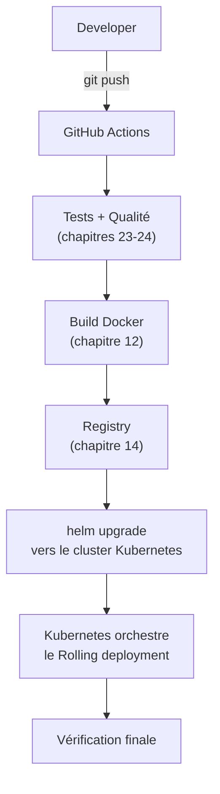

<div class="chapitre-titre-num">CHAPITRE 44 · 🔴 PROFESSIONNEL</div>

# CI/CD vers Kubernetes

<div class="encadre objectif">
<span class="encadre-titre">🎯 Objectif du chapitre</span>
Assembler GitHub → CI → Docker Build → Registry → Kubernetes → Deployment en un seul pipeline automatisé complet, remplaçant les commandes SSH manuelles du chapitre 27 par un déploiement Helm automatisé. Ce chapitre clôt la Partie XIII en réunissant tout ce qu'elle a construit avec le pipeline CI/CD des chapitres 21-22.
</div>

<div class="encadre scenario">
<span class="encadre-titre">🎬 Mise en situation</span>
Le chapitre 27 a automatisé un déploiement vers un unique VPS via SSH. Ce chapitre remplace cette cible par un cluster Kubernetes, orchestré via Helm (chapitre 43) — le même principe de bout en bout (push → tests → build → déploiement → vérification), mais la dernière étape change radicalement : au lieu de se connecter en SSH pour relancer un conteneur, le pipeline demande à Kubernetes de mettre à jour une release.
</div>

## 44.1 Le schéma complet



## 44.2 Authentifier GitHub Actions auprès du cluster

<div class="encadre securite">
<span class="encadre-titre">🔒 Sécurité — le kubeconfig est un secret critique</span>
Le fichier <strong>kubeconfig</strong> contient les identifiants d'accès complets à un cluster Kubernetes — sa fuite équivaut à donner un accès administrateur au cluster entier. Il doit être stocké exclusivement via GitHub Secrets (chapitre 25), jamais autrement, et idéalement limité aux permissions strictement nécessaires au déploiement (principe du moindre privilège, chapitres 4, 5, 40 section 40.4) plutôt qu'un accès administrateur complet au cluster.
</div>

```yaml
jobs:
  deploy:
    needs: build-and-push
    runs-on: ubuntu-latest
    environment:
      name: production
    steps:
      - uses: actions/checkout@v4

      - name: Configurer l'accès au cluster
        run: |
          mkdir -p ~/.kube
          echo "${{ secrets.KUBE_CONFIG }}" | base64 -d > ~/.kube/config

      - name: Installer Helm
        uses: azure/setup-helm@v4

      - name: Déployer avec Helm
        run: |
          helm upgrade --install mon-app ./chart \
            --set api.image.tag=${{ github.sha }} \
            --set frontend.image.tag=${{ github.sha }} \
            --namespace production \
            --wait --timeout 5m
```

**Explication :** `secrets.KUBE_CONFIG` (encodé en base64 pour le transport, décodé au moment de l'exécution) authentifie `kubectl`/`helm` auprès du cluster ; `helm upgrade --install` combine `install` (si la release n'existe pas encore) et `upgrade` (si elle existe déjà) en une seule commande idempotente (chapitre 37, section 37.4) ; `--set api.image.tag=${{ github.sha }}` reprend exactement le principe du chapitre 22 — chaque déploiement utilise le SHA du commit, jamais `latest` seul (chapitre 14, section 14.3) ; `--wait --timeout 5m` fait attendre Helm que le déploiement soit réellement terminé et stable (tous les pods `Ready`) avant de considérer l'étape réussie, plutôt que de se contenter d'avoir accepté la commande.

## 44.3 Vérification finale après déploiement Kubernetes

```yaml
      - name: Vérifier le déploiement
        run: |
          kubectl rollout status deployment/mon-app-api -n production --timeout=60s
          kubectl get pods -n production -l app=mon-app-api

      - name: Vérifier la santé publique
        run: |
          sleep 10
          curl -f https://monsite.exemple.com/api/health
```

**Explication :** `kubectl rollout status` attend explicitement que le Rolling deployment (chapitre 42, section 42.3) soit complètement terminé, avec tous les nouveaux pods passés par leur `readinessProbe` — un niveau de vérification que le simple `--wait` de Helm complète utilement ; la vérification finale sur le domaine public reprend exactement le principe du chapitre 27 (section 27.2) : toujours vérifier la chaîne complète réelle, jamais seulement en interne.

## 44.4 Rollback automatisé avec Helm

```yaml
name: Rollback Kubernetes

on:
  workflow_dispatch:
    inputs:
      revision:
        description: "Numéro de révision Helm à restaurer (helm history mon-app)"
        required: true

jobs:
  rollback:
    runs-on: ubuntu-latest
    environment: { name: production }
    steps:
      - name: Configurer l'accès au cluster
        run: |
          mkdir -p ~/.kube
          echo "${{ secrets.KUBE_CONFIG }}" | base64 -d > ~/.kube/config

      - name: Rollback
        run: |
          helm rollback mon-app ${{ github.event.inputs.revision }} -n production --wait
          kubectl rollout status deployment/mon-app-api -n production
```

**Explication :** ce workflow reprend exactement la structure de rollback manuel déclenchable du chapitre 29 (section 29.4), mais utilise `helm rollback` (chapitre 43, section 43.3) plutôt qu'un redéploiement manuel d'image — bénéficiant nativement de l'historique de révisions déjà géré par Helm.

## Atelier — Le pipeline complet, du push au cluster Kubernetes

<div class="encadre exercice">
<span class="encadre-titre">🛠️ Atelier 44.1 — Boucler la chaîne complète sur le cluster local</span>

**Objectif** : automatiser entièrement le déploiement du chart Helm de l'atelier 43.1, du push GitHub jusqu'à la vérification sur le cluster.

**Étapes détaillées** :

1. Génère un kubeconfig limité en permissions pour le pipeline (un compte de service Kubernetes dédié, avec des droits restreints au namespace de déploiement — approfondi dans la documentation officielle Kubernetes sur les RBAC).
2. Encode ce kubeconfig en base64, ajoute-le comme secret GitHub `KUBE_CONFIG` (chapitre 25).
3. Construis le workflow complet de la section 44.2-44.3, en réutilisant le chart de l'atelier 43.1.
4. Pousse un changement de code, observe le pipeline construire l'image, la pousser, puis exécuter `helm upgrade --install` avec vérification finale.
5. Provoque volontairement un déploiement défaillant (un bug introduit), déclenche le workflow de rollback (section 44.4) avec la révision précédente.

**Résultat attendu** : la boucle complète — push, tests, build, déploiement Kubernetes via Helm, vérification, et capacité de rollback — entièrement automatisée, sans jamais se connecter manuellement au cluster.
</div>

## Erreurs fréquentes

<div class="encadre attention">
<span class="encadre-titre">⚠️ Erreur n°1 — Un kubeconfig avec des permissions administrateur complètes pour le pipeline</span>
Comme signalé en section 44.2, le pipeline ne devrait avoir accès qu'aux permissions strictement nécessaires au déploiement (un namespace précis, certaines actions), jamais un accès cluster-admin complet — un compte de service Kubernetes dédié avec des rôles RBAC limités est la pratique recommandée.
</div>

<div class="encadre attention">
<span class="encadre-titre">⚠️ Erreur n°2 — Ne pas attendre la fin réelle du déploiement</span>
Sans `--wait` (Helm) et `kubectl rollout status`, le pipeline pourrait se déclarer réussi dès que la commande de déploiement est acceptée, avant même que les nouveaux pods ne soient réellement prêts — le même piège que l'erreur n°3 du chapitre 22, appliqué à Kubernetes.
</div>

<div class="encadre attention">
<span class="encadre-titre">⚠️ Erreur n°3 — Oublier de tester le rollback avant d'en avoir réellement besoin</span>
Rappel direct du chapitre 29 (section "Erreurs fréquentes", erreur n°3) : un rollback Kubernetes/Helm jamais testé en conditions contrôlées reste une hypothèse, pas une garantie — l'atelier de ce chapitre inclut délibérément ce test.
</div>

## En entreprise

**Réalité répandue** : les équipes qui opèrent Kubernetes en production utilisent presque systématiquement un pipeline CI/CD complet comme celui de ce chapitre — jamais de `kubectl apply` ou `helm upgrade` manuel en production, exactement la même discipline déjà établie pour le VPS depuis le chapitre 27.

**Bonne pratique répandue** : certaines équipes adoptent une approche "GitOps" (comme ArgoCD ou Flux, non détaillés dans ce manuel introductif), où un agent tournant **dans** le cluster surveille en continu un dépôt Git et applique automatiquement tout changement détecté — une inversion du modèle "push" de ce chapitre (le pipeline pousse vers le cluster) vers un modèle "pull" (le cluster tire depuis Git), avec des avantages de sécurité (le cluster n'a jamais besoin d'exposer un accès entrant au pipeline externe).

**Erreur classique observée** : des credentials Kubernetes de production réutilisés pour des tests en environnement de développement, violant le principe du chapitre 18 (section "Sécurité") sur la séparation stricte des secrets entre environnements.

## Entretien technique

<div class="encadre exercice">
<span class="encadre-titre">💼 Questions fréquemment posées en entretien</span>

**Q1. "Comment sécuriserais-tu l'accès d'un pipeline CI/CD à un cluster Kubernetes de production ?"**
Réponse attendue : un compte de service dédié avec des permissions RBAC limitées au strict nécessaire, jamais un accès administrateur complet, le kubeconfig stocké exclusivement en secret GitHub (section 44.2 et erreur fréquente n°1).

**Q2. "Comment garantirais-tu qu'un pipeline ne se déclare réussi que si le déploiement Kubernetes a réellement abouti ?"**
Réponse attendue : `helm upgrade --wait` combiné à `kubectl rollout status`, qui attendent activement que tous les pods soient prêts, plutôt que de considérer la commande envoyée comme suffisante (section 44.3 et erreur fréquente n°2).

**Q3. "Qu'est-ce que le GitOps, et en quoi diffère-t-il du pipeline de ce chapitre ?"**
Réponse attendue : un agent dans le cluster tire (pull) les changements depuis Git plutôt que le pipeline externe qui pousse (push) vers le cluster — inversant le flux et réduisant le besoin d'exposer un accès entrant au cluster (section "En entreprise").
</div>

## Optimisation, sécurité et maintenabilité — les réflexes dès ce chapitre

<div class="encadre securite">
<span class="encadre-titre">🔒 Sécurité</span>
Le kubeconfig de production mérite la même vigilance que n'importe quel accès administratif critique — rotation périodique (chapitre 25, section 25.6), permissions RBAC limitées, et accès au secret GitHub lui-même restreint à un nombre minimal de personnes.
</div>

<div class="encadre bonne-pratique">
<span class="encadre-titre">✅ Maintenabilité</span>
Documente la procédure de rollback Kubernetes (section 44.4) dans le même `DEPLOIEMENT.md` déjà recommandé aux chapitres 26 et 29 — une cohérence documentaire à travers tout le portefeuille de pratiques de ce manuel.
</div>

<div class="encadre performance">
<span class="encadre-titre">🚀 Performance</span>
`--timeout` sur `helm upgrade` et `kubectl rollout status` évite qu'un pipeline reste bloqué indéfiniment si un déploiement ne converge jamais vers un état stable — un échec rapide et explicite vaut mieux qu'une attente silencieuse et indéfinie.
</div>

## Résumé du chapitre

- Ce chapitre remplace la cible SSH/VPS du chapitre 27 par un cluster Kubernetes, orchestré via Helm.
- Le kubeconfig, stocké en secret GitHub, doit avoir des permissions strictement limitées au déploiement, jamais un accès administrateur complet.
- `helm upgrade --install --wait` combiné à `kubectl rollout status` garantit qu'un déploiement est réellement terminé et stable avant de le déclarer réussi.
- Le rollback Kubernetes bénéficie nativement de l'historique de révisions Helm, déclenchable manuellement via `workflow_dispatch`.
- L'approche GitOps (ArgoCD, Flux) inverse le modèle de ce chapitre, avec des avantages de sécurité pour les clusters les plus critiques.

## Quiz

<div class="encadre exercice">
<span class="encadre-titre">📝 QCM (une seule bonne réponse par question)</span>

1. Le kubeconfig utilisé par un pipeline CI/CD devrait avoir :
   - a) Un accès administrateur complet au cluster, pour plus de simplicité
   - b) Des permissions RBAC limitées au strict nécessaire au déploiement
   - c) Aucune permission, le déploiement se fait sans authentification
   - d) Les mêmes permissions qu'un compte personnel de développeur

2. `helm upgrade --wait` sert à :
   - a) Ne rien faire de particulier
   - b) Attendre que le déploiement soit réellement terminé et stable avant de continuer
   - c) Supprimer la release précédente immédiatement
   - d) Ignorer les erreurs de déploiement

3. Le GitOps (ArgoCD, Flux) se caractérise par :
   - a) Un pipeline externe qui pousse vers le cluster (push)
   - b) Un agent dans le cluster qui tire les changements depuis Git (pull)
   - c) L'absence totale de Git dans le processus
   - d) Le remplacement complet de Kubernetes

**Corrigé** : 1-b, 2-b, 3-b.
</div>

<div class="encadre exercice">
<span class="encadre-titre">📝 Vrai ou Faux</span>

1. Un rollback avec `helm rollback` bénéficie de l'historique de révisions déjà géré nativement par Helm. — **Vrai** (section 44.4).
2. Sans `--wait` ni `kubectl rollout status`, un pipeline pourrait se déclarer réussi avant que les pods ne soient réellement prêts. — **Vrai** (section "Erreurs fréquentes", erreur n°2).
3. Les credentials Kubernetes de production peuvent être réutilisés sans risque pour tester en développement. — **Faux** (section "En entreprise").

</div>

## Exercices

<div class="encadre exercice">
<span class="encadre-titre">📝 Exercice 44.1</span>

Explique pourquoi l'approche GitOps (un agent dans le cluster qui tire les changements) peut être considérée plus sûre, du point de vue de la sécurité réseau, que l'approche de ce chapitre (le pipeline externe qui pousse vers le cluster).
</div>

**Corrigé :** dans l'approche de ce chapitre, le cluster Kubernetes doit exposer un point d'accès entrant (API server) joignable depuis les runners GitHub Actions externes, avec des credentials transmis vers l'extérieur (le kubeconfig en secret GitHub) — une surface d'exposition supplémentaire. En GitOps, l'agent tourne à l'intérieur du cluster et initie lui-même les connexions **sortantes** vers Git pour vérifier les changements, sans jamais avoir besoin d'exposer un accès entrant au cluster depuis l'extérieur ni de transmettre de credentials cluster vers un système tiers — réduisant la surface d'attaque réseau, un principe cohérent avec la doctrine du moindre privilège et de l'exposition minimale déjà appliquée à travers ce manuel (chapitre 5, chapitre 13 section 13.4).

## Checklist de fin de chapitre

<ul class="checklist">
<li>☐ J'ai configuré l'authentification sécurisée d'un pipeline vers un cluster Kubernetes.</li>
<li>☐ Mon pipeline construit, publie et déploie via Helm avec le SHA du commit comme tag.</li>
<li>☐ Mon pipeline attend réellement la fin du déploiement (`--wait`, `rollout status`) avant de le déclarer réussi.</li>
<li>☐ J'ai un mécanisme de rollback Kubernetes déclenchable manuellement, testé en conditions réelles.</li>
<li>☐ Je comprends le principe du GitOps et en quoi il diffère de l'approche de ce chapitre.</li>
</ul>

## FAQ

<dl class="faq">
<dt>Faut-il connaître ArgoCD ou Flux pour ce chapitre ?</dt>
<dd>Non, ce chapitre couvre l'approche "push" avec GitHub Actions, suffisante et largement répandue. GitOps (mentionné en complément) est une évolution possible, pas un prérequis pour maîtriser les fondamentaux de ce chapitre.</dd>

<dt>Comment obtenir un kubeconfig avec des permissions limitées plutôt qu'un accès complet ?</dt>
<dd>Via un ServiceAccount Kubernetes associé à un Role ou ClusterRole restreint (le système RBAC de Kubernetes), une configuration qui dépasse le périmètre détaillé de ce chapitre introductif mais est largement documentée officiellement.</dd>

<dt>Ce pipeline fonctionne-t-il aussi avec un cluster managé (EKS, GKE, AKS) plutôt qu'un cluster local Kind ?</dt>
<dd>Oui, le principe reste identique — seule la méthode d'obtention du kubeconfig change (souvent via la CLI du fournisseur cloud, chapitre 40 pour AWS), le reste du pipeline (Helm, vérifications) restant inchangé.</dd>
</dl>

## Références et pour aller plus loin

- Documentation officielle Kubernetes — RBAC : [https://kubernetes.io/docs/reference/access-authn-authz/rbac/](https://kubernetes.io/docs/reference/access-authn-authz/rbac/)
- ArgoCD — documentation officielle (référence GitOps) : [https://argo-cd.readthedocs.io](https://argo-cd.readthedocs.io)
- `azure/setup-helm` — action GitHub utilisée dans ce chapitre : [https://github.com/Azure/setup-helm](https://github.com/Azure/setup-helm)

*Chapitre suivant : concevoir une infrastructure réelle — la Partie XIV s'ouvre. Internet → DNS → HTTPS → Load Balancer → Frontend/API → Database/Redis, chaque composant de ce manuel réuni dans une seule architecture cohérente.*
