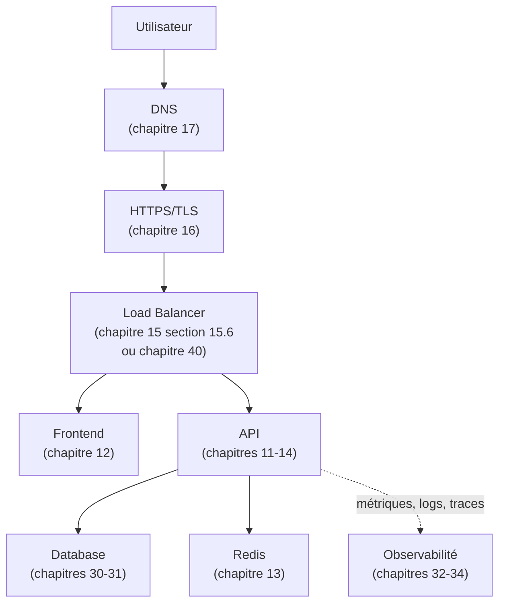
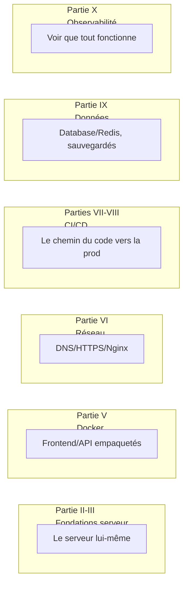

<div class="chapitre-titre-num">CHAPITRE 45 · 🔴 PROFESSIONNEL</div>

# Concevoir une infrastructure réelle

<div class="encadre objectif">
<span class="encadre-titre">🎯 Objectif du chapitre</span>
Assembler, en une seule architecture cohérente et justifiée composant par composant, tout ce que ce manuel a construit séparément depuis le chapitre 1 : Internet → DNS → HTTPS → Load Balancer → Frontend/API → Database/Redis. Ce chapitre ouvre la Partie XIV en prenant du recul sur les 44 chapitres précédents, avant d'aborder le dépannage (chapitre 46), la performance (47), la scalabilité (48) et la haute disponibilité (49).
</div>

<div class="encadre scenario">
<span class="encadre-titre">🎬 Mise en situation</span>
Chaque chapitre de ce manuel a approfondi une pièce précise du puzzle — DNS (17), HTTPS (16), Nginx (15), Docker (11-14), CI/CD (19-27), Kubernetes (41-44). Ce chapitre assemble toutes ces pièces en une seule vue d'ensemble, pour répondre à une question qu'aucun chapitre isolé ne pouvait poser : comment ces composants s'articulent-ils réellement, ensemble, dans une architecture de production complète ?
</div>

## 45.1 L'architecture complète, composant par composant



<div class="encadre retenir">
<span class="encadre-titre">📌 Chaque flèche de ce schéma a déjà été construite dans ce manuel</span>
Ce diagramme n'introduit <strong>aucun</strong> concept nouveau — c'est la synthèse visuelle de 44 chapitres. Le reste de ce chapitre justifie chaque composant : pourquoi il existe, quel problème précis il résout, et à quel chapitre revenir pour l'approfondir.
</div>

## 45.2 Pourquoi chaque composant existe

| Composant | Problème résolu | Chapitre |
|---|---|---|
| **DNS** | Traduire un nom mémorable en adresse IP | 17 |
| **HTTPS/TLS** | Chiffrer et authentifier la communication | 16 |
| **Load Balancer** | Répartir le trafic, éliminer le point de défaillance unique | 15, 28, 49 |
| **Frontend/API séparés** | Isoler les responsabilités, scaler indépendamment | 12, 13 |
| **Base de données** | Persister les données de façon fiable | 30, 31 |
| **Redis (cache)** | Réduire la charge sur la base pour les données fréquemment lues | 13 |
| **Observabilité** | Savoir si tout fonctionne réellement, pas seulement "tourne" | 32-34 |

<div class="encadre astuce">
<span class="encadre-titre">💡 Pourquoi Redis, spécifiquement</span>
Le cache (chapitre 13, jamais expliqué en détail à l'époque) répond à un problème de performance précis : certaines données sont lues beaucoup plus souvent qu'elles ne changent (un profil utilisateur, une liste de produits populaires). Interroger la base de données à chaque lecture gaspille des ressources sur une donnée qui n'a probablement pas changé depuis la dernière lecture — Redis garde cette donnée en mémoire, prête à être servie en une fraction du temps d'une requête SQL complète, approfondi concrètement au chapitre 47 (Performance).
</div>

## 45.3 Où se situe chaque partie de ce manuel dans ce schéma



## 45.4 Une architecture qui grandit : du chapitre 3 au chapitre 44

<div class="encadre memoriser">
<span class="encadre-titre">🧠 La trajectoire complète de ce manuel, résumée</span>

```text
Chapitre 3    : un seul serveur de laboratoire
Chapitre 13   : plusieurs conteneurs orchestrés sur ce même serveur (Docker Compose)
Chapitre 26   : ce même serveur, sécurisé et exposé au monde réel (VPS de production)
Chapitre 27   : le déploiement sur ce serveur, automatisé
Chapitre 40   : la même architecture, chez un fournisseur cloud avec ses services managés
Chapitre 41-44: la même architecture, orchestrée sur plusieurs serveurs (Kubernetes)
```

Cette progression n'est pas arbitraire : chaque étape répond à une limite concrète rencontrée par l'étape précédente — exactement le principe de progressivité défendu depuis le chapitre 1 (jamais un outil avant d'avoir rencontré le problème qu'il résout).
</div>

## Atelier — Documenter l'architecture réelle de son propre projet

<div class="encadre exercice">
<span class="encadre-titre">🛠️ Atelier 45.1 — Un schéma d'architecture complet et justifié</span>

**Objectif** : produire, pour le projet construit à travers ce manuel (chapitres 22/27/44), un schéma d'architecture complet avec justification de chaque composant.

**Étapes détaillées** :

1. Dessine (à la main, ou avec un outil comme Mermaid, déjà utilisé dans tout ce manuel) l'architecture réelle de ton projet, composant par composant.
2. Pour chaque composant, écris une phrase expliquant le problème précis qu'il résout — pas "parce que c'est la norme", mais le vrai raisonnement (section 45.2).
3. Identifie les composants qui n'existent pas encore dans ton projet, mais qui existent dans le schéma de la section 45.1 — sont-ils nécessaires à ton contexte actuel, ou une complexité prématurée (chapitre 39, section "Erreurs fréquentes") ?

**Résultat attendu** : un document d'architecture qui pourrait être présenté à un nouveau membre d'équipe ou à un client, expliquant non seulement ce qui existe, mais pourquoi — l'antidote direct au "cargo cult" (copier une architecture sans comprendre pourquoi) évoqué dans plusieurs chapitres de ce manuel.
</div>

## Erreurs fréquentes

<div class="encadre attention">
<span class="encadre-titre">⚠️ Erreur n°1 — Copier une architecture complexe sans en comprendre le besoin réel</span>
Reproduire le schéma complet de la section 45.1 (Load Balancer, cache, observabilité complète) pour un projet à très faible trafic ajoute une complexité opérationnelle sans bénéfice proportionné — rappel direct des principes déjà appliqués à Kubernetes (chapitre 41) et aux services cloud managés (chapitre 39).
</div>

<div class="encadre attention">
<span class="encadre-titre">⚠️ Erreur n°2 — Une architecture jamais documentée dans son ensemble</span>
Chaque composant peut être bien compris individuellement (chapitre par chapitre) sans que personne dans l'équipe n'ait une vue d'ensemble cohérente de comment ils s'articulent tous ensemble — un schéma d'architecture global, mis à jour régulièrement, comble ce vide.
</div>

<div class="encadre attention">
<span class="encadre-titre">⚠️ Erreur n°3 — Ajouter un composant sans retirer ce qu'il remplace</span>
Ajouter Redis (cache) sans jamais vérifier si certaines requêtes redondantes vers la base de données pourraient être éliminées plutôt que simplement mises en cache — un composant supplémentaire devrait résoudre un problème réel, pas seulement s'ajouter par habitude à une architecture qui grandit.
</div>

## En entreprise

**Réalité répandue** : les schémas d'architecture (comme celui de la section 45.1) sont des documents vivants, régulièrement mis à jour et consultés lors de l'intégration de nouveaux membres d'équipe, d'audits de sécurité (chapitre 35), ou de décisions de scalabilité (chapitre 48) — jamais un document figé écrit une fois puis oublié.

**Bonne pratique répandue** : les décisions d'architecture importantes sont documentées avec leur justification au moment où elles sont prises (souvent via des ADR — *Architecture Decision Records*, de courts documents structurés "contexte / décision / conséquences") plutôt que reconstituées de mémoire des mois plus tard.

**Erreur classique observée** : une architecture qui a grandi organiquement, chapitre après chapitre comme dans ce manuel, sans jamais qu'un schéma global ne soit produit — chaque nouvel arrivant doit alors reconstituer mentalement l'architecture complète en lisant le code, un exercice bien plus long et sujet à erreur qu'un schéma à jour.

## Entretien technique

<div class="encadre exercice">
<span class="encadre-titre">💼 Questions fréquemment posées en entretien</span>

**Q1. "Dessine et explique une architecture web typique, du DNS jusqu'à la base de données."**
Réponse attendue : reprendre le schéma de la section 45.1, en expliquant le rôle précis de chaque composant plutôt qu'en se contentant de le nommer — la différence entre mémoriser un schéma et comprendre une architecture (section 45.2).

**Q2. "Pourquoi ajouter un cache comme Redis devant une base de données ?"**
Réponse attendue : réduire la charge sur la base pour des données lues beaucoup plus souvent qu'elles ne changent, améliorant le temps de réponse perçu sans solliciter systématiquement le stockage persistant (section 45.2).

**Q3. "Comment décides-tu si un composant d'architecture est réellement nécessaire pour un projet donné ?"**
Réponse attendue : évaluer s'il résout un problème réellement rencontré (charge, disponibilité, sécurité) plutôt que de l'ajouter par défaut ou par imitation d'une architecture vue ailleurs — le principe de progressivité appliqué à travers tout ce manuel (section "Erreurs fréquentes", erreur n°1).
</div>

## Optimisation, sécurité et maintenabilité — les réflexes dès ce chapitre

<div class="encadre securite">
<span class="encadre-titre">🔒 Sécurité</span>
Un schéma d'architecture complet est aussi un outil de sécurité : il révèle immédiatement les points d'exposition (quel composant est directement accessible depuis Internet, chapitre 13 section 13.4) et facilite l'identification de la surface d'attaque réelle d'un système.
</div>

<div class="encadre bonne-pratique">
<span class="encadre-titre">✅ Maintenabilité</span>
Garde le schéma d'architecture à jour à chaque changement structurel significatif — un schéma périmé, qui ne reflète plus la réalité, devient rapidement plus trompeur qu'utile.
</div>

<div class="encadre performance">
<span class="encadre-titre">🚀 Performance</span>
Une vue d'ensemble de l'architecture aide à repérer visuellement les goulots d'étranglement potentiels avant même de mesurer quoi que ce soit (chapitre 47) — un composant sans réplication ni cache, sur le chemin critique de chaque requête, saute souvent aux yeux dès qu'on regarde l'architecture complète plutôt que chaque pièce isolément.
</div>

## Résumé du chapitre

- L'architecture complète de ce manuel assemble DNS, HTTPS, Load Balancer, Frontend/API, Database/Redis et observabilité — chaque composant déjà construit séparément dans les chapitres précédents.
- Chaque composant existe pour résoudre un problème précis, jamais par défaut ou par imitation.
- L'architecture de ce manuel a grandi progressivement, chaque étape répondant à une limite concrète de l'étape précédente.
- Un schéma d'architecture documenté et à jour facilite l'intégration de nouveaux membres, les audits de sécurité, et les décisions de scalabilité futures.

## Quiz

<div class="encadre exercice">
<span class="encadre-titre">📝 QCM (une seule bonne réponse par question)</span>

1. Un cache comme Redis, placé devant une base de données, sert principalement à :
   - a) Remplacer entièrement la base de données
   - b) Réduire la charge sur la base pour des données lues fréquemment
   - c) Chiffrer les communications
   - d) Gérer le DNS

2. Reproduire une architecture complexe (Load Balancer, cache, Kubernetes) pour un projet à très faible trafic :
   - a) Est toujours recommandé, quelle que soit l'échelle
   - b) Peut ajouter une complexité disproportionnée sans bénéfice réel
   - c) Élimine automatiquement tout risque de panne
   - d) Est obligatoire pour tout projet professionnel

3. Un schéma d'architecture documenté sert notamment à :
   - a) Remplacer le besoin de tests automatisés
   - b) Faciliter l'intégration de nouveaux membres et les audits de sécurité
   - c) Éviter tout besoin de monitoring
   - d) Supprimer le besoin de sauvegardes

**Corrigé** : 1-b, 2-b, 3-b.
</div>

<div class="encadre exercice">
<span class="encadre-titre">📝 Vrai ou Faux</span>

1. Chaque composant de l'architecture de ce manuel a déjà été construit et expliqué séparément dans un chapitre précédent. — **Vrai** (section 45.1).
2. Un schéma d'architecture, une fois créé, n'a jamais besoin d'être mis à jour. — **Faux** (section "En entreprise").
3. Ajouter un composant d'architecture devrait toujours répondre à un problème réel rencontré, jamais par défaut. — **Vrai** (section "Erreurs fréquentes", erreur n°1).

</div>

## Exercices

<div class="encadre exercice">
<span class="encadre-titre">📝 Exercice 45.1</span>

Un projet personnel, avec quelques dizaines de visiteurs par jour, tourne actuellement sur un unique VPS avec Docker Compose (comme au chapitre 13). Le développeur envisage d'ajouter un Load Balancer, un cache Redis et une bascule vers Kubernetes "pour être prêt à grande échelle". Évalue cette proposition.
</div>

**Corrigé :** avec quelques dizaines de visiteurs par jour, un unique VPS avec Docker Compose répond très probablement déjà largement au besoin réel de charge et de disponibilité — les trois ajouts proposés (Load Balancer, cache, Kubernetes) répondent à des problèmes qui n'existent pas encore dans ce contexte (section "Erreurs fréquentes", erreur n°1, et rappel du chapitre 39 sur les services managés ajoutés sans réel besoin). Une approche plus mesurée consisterait à documenter dès maintenant les signaux concrets qui justifieraient chaque ajout (une latence mesurée qui se dégrade avec la croissance du trafic, une panne réelle du serveur unique) et à n'introduire chaque composant que lorsque ces signaux se matérialisent réellement — cohérent avec la philosophie de progressivité appliquée à travers tout ce manuel.

## Checklist de fin de chapitre

<ul class="checklist">
<li>☐ Je sais dessiner et expliquer l'architecture complète de ce manuel, composant par composant.</li>
<li>☐ Je sais justifier pourquoi chaque composant existe, pas seulement le nommer.</li>
<li>☐ Je sais relier chaque composant au chapitre qui l'approfondit.</li>
<li>☐ J'ai documenté l'architecture réelle de mon propre projet, avec justification de chaque choix.</li>
<li>☐ Je sais évaluer si un composant d'architecture est réellement nécessaire pour un contexte donné.</li>
</ul>

## FAQ

<dl class="faq">
<dt>Faut-il toujours tous les composants de la section 45.1 pour un projet "professionnel" ?</dt>
<dd>Non — le professionnalisme se mesure à la justesse des choix par rapport au contexte réel, pas au nombre de composants présents. Un projet simple avec une architecture simple mais bien comprise est plus professionnel qu'un projet sur-architecturé sans réelle justification.</dd>

<dt>Comment savoir quand ajouter un nouveau composant à une architecture existante ?</dt>
<dd>Idéalement, à partir d'un signal mesuré (une métrique du chapitre 32 qui dépasse un seuil, une panne réelle documentée) plutôt qu'une anticipation abstraite — le principe déjà appliqué au chapitre 39 pour les services managés et au chapitre 41 pour Kubernetes.</dd>

<dt>Ce schéma d'architecture couvre-t-il tout ce qu'une vraie entreprise utiliserait ?</dt>
<dd>Il couvre les fondamentaux essentiels enseignés dans ce manuel. Des architectures plus complexes (microservices multiples, files de messages asynchrones, architectures événementielles) existent et dépassent le périmètre introductif de ce manuel, à explorer une fois ces fondamentaux solidement acquis.</dd>
</dl>

## Références et pour aller plus loin

- Architecture Decision Records (ADR) — modèle et pratique de documentation des décisions d'architecture : [https://adr.github.io](https://adr.github.io)
- AWS Well-Architected Framework (déjà mentionné au chapitre 40) — principes de conception applicables indépendamment du fournisseur.

*Chapitre suivant : incidents et dépannage — un catalogue de 60 scénarios de pannes réelles, avec la méthode complète de diagnostic pour chacune, sur l'ensemble de l'architecture de ce chapitre.*
