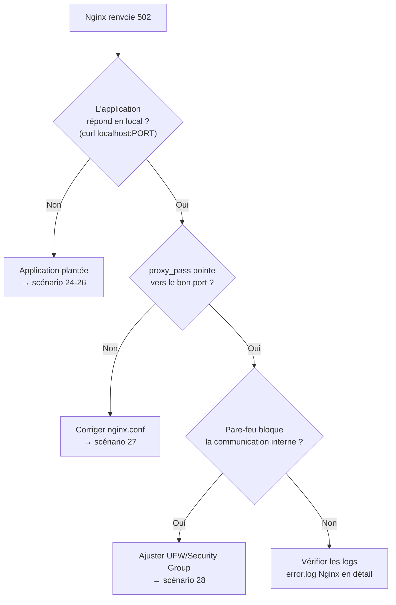
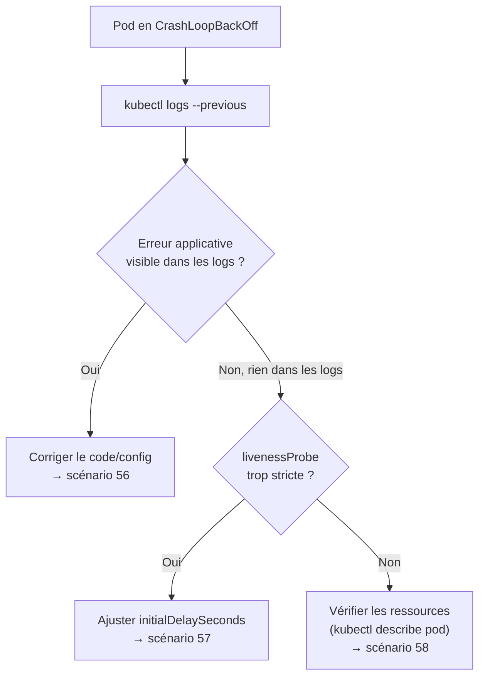
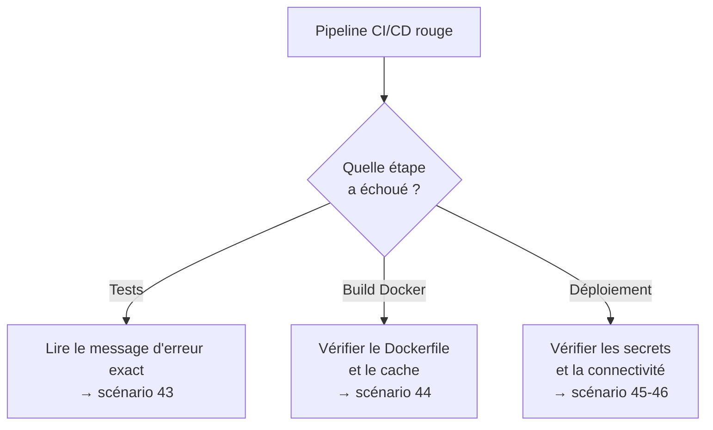

<div class="chapitre-titre-num">CHAPITRE 46 · 🔴 PROFESSIONNEL</div>

# Incidents et dépannage : 60 scénarios réels

<div class="encadre objectif">
<span class="encadre-titre">🎯 Objectif du chapitre</span>
Un catalogue de 60 scénarios de pannes réelles, couvrant l'intégralité de l'architecture du chapitre 45 : serveur/SSH, disque/RAM, Docker, réseau/Nginx, certificats/DNS, bases de données, CI/CD, secrets/permissions, Kubernetes. Chaque scénario suit la même méthode : Symptôme → Diagnostic → Correction → Prévention. Ce chapitre est conçu comme une référence à consulter en situation réelle, pas nécessairement à lire linéairement d'un bout à l'autre.
</div>

<div class="encadre scenario">
<span class="encadre-titre">🎬 Mise en situation</span>
Tous les chapitres précédents ont construit un système qui fonctionne. Ce chapitre part du principe, réaliste et assumé, que quelque chose finira par casser — pas par manque de rigueur, mais parce que c'est la nature même des systèmes en production. Ce qui distingue une équipe expérimentée n'est pas l'absence de pannes, mais la vitesse et la méthode avec lesquelles elle les diagnostique.
</div>

## 46.1 La méthode générale, avant les scénarios

<div class="encadre memoriser">
<span class="encadre-titre">🧠 Rappel : la démarche de diagnostic générale</span>

```text
1. Restreindre le problème (qui, quoi, depuis quand, un seul endroit ou plusieurs)
2. Formuler une hypothèse précise, pas une supposition vague
3. Vérifier cette hypothèse avec une commande de diagnostic précise
4. Corriger la cause identifiée, pas seulement le symptôme visible
5. Vérifier que la correction fonctionne réellement
6. Documenter (post-mortem sans blâme, chapitre 2, section 2.3) pour éviter la répétition
```

Cette démarche générale s'applique à chacun des 60 scénarios suivants — jamais improvisée, toujours méthodique, même sous pression.
</div>

### Trois arbres de décision pour les pannes les plus fréquentes







## 46.2 Serveur et SSH (scénarios 1-8)

**1. Serveur inaccessible en SSH, aucune réponse**
Symptôme : `ssh` reste bloqué sans réponse. Diagnostic : `ping adresse_ip` (chapitre 4) pour vérifier si le serveur répond au niveau réseau. Correction : si `ping` échoue aussi, le serveur est probablement éteint ou son réseau est coupé — consulter la console de secours du fournisseur VPS. Prévention : monitoring externe (chapitre 32) qui alerte avant que quelqu'un ne le découvre manuellement.

**2. SSH refusé : "Connection refused"**
Symptôme : le serveur répond au ping mais refuse la connexion SSH. Diagnostic : le service SSH est probablement arrêté. Correction : accéder via la console de secours du fournisseur, `sudo systemctl start sshd` (chapitre 4). Prévention : `systemctl enable sshd` (chapitre 4, section 4.4) pour un redémarrage automatique après reboot.

**3. SSH refusé : "Permission denied (publickey)"**
Symptôme : la clé SSH n'est plus acceptée. Diagnostic : vérifier que la bonne clé privée est utilisée (`ssh -v`, mode verbeux) ; vérifier les permissions sur le serveur (`ls -la ~/.ssh`, chapitre 6, section 6.3). Correction : `chmod 700 ~/.ssh`, `chmod 600 ~/.ssh/authorized_keys` via la console de secours si aucun accès SSH n'est possible. Prévention : ne jamais désactiver `PasswordAuthentication` (chapitre 6) sans avoir vérifié la clé au préalable dans une session active.

**4. Session SSH qui se coupe systématiquement après quelques minutes**
Symptôme : la connexion SSH tombe après une période d'inactivité. Diagnostic : un timeout réseau intermédiaire (routeur, pare-feu d'entreprise) coupe les connexions inactives. Correction : ajouter `ServerAliveInterval 60` au fichier `~/.ssh/config` local, envoyant un signal périodique qui maintient la connexion active. Prévention : documenter ce réglage dans le guide d'onboarding de l'équipe.

**5. "Host key verification failed"**
Symptôme : SSH refuse la connexion en signalant que l'empreinte du serveur a changé. Diagnostic : soit le serveur a été légitimement recréé (chapitre 38, `terraform destroy`/`apply`), soit une attaque de type "homme du milieu" est en cours — ne jamais ignorer cet avertissement sans vérification. Correction : si la recréation est légitime et confirmée, `ssh-keygen -R adresse_ip` supprime l'ancienne empreinte mémorisée. Prévention : documenter chaque recréation de serveur pour éviter la confusion.

**6. Espace disque saturé empêchant toute nouvelle connexion SSH**
Symptôme : le serveur répond mais tout, y compris SSH, devient extrêmement lent ou échoue. Diagnostic : `df -h` (chapitre 4, section 4.5) via la console de secours si SSH est totalement inaccessible. Correction : voir scénarios 9-15 (disque). Prévention : alerte de monitoring sur le seuil d'espace disque (chapitre 32).

**7. Utilisateur accidentellement supprimé du groupe sudo**
Symptôme : `sudo` échoue avec "user is not in the sudoers file". Diagnostic : vérifier l'appartenance aux groupes (`groups nom_utilisateur`, chapitre 5, section 5.1). Correction : se connecter avec un autre compte disposant de `sudo`, ou via la console de secours en root, puis `usermod -aG sudo nom_utilisateur`. Prévention : toujours garder au moins deux comptes avec accès `sudo` sur un serveur critique (le principe du "bus factor" appliqué aux accès).

**8. Horloge serveur désynchronisée, causant des échecs TLS/authentification**
Symptôme : des erreurs de certificat TLS ou d'authentification apparaissent sans changement de configuration apparent. Diagnostic : `timedatectl` (chapitre 4) révèle une horloge significativement décalée. Correction : `sudo systemctl restart systemd-timesyncd` pour resynchroniser via NTP. Prévention : vérifier que la synchronisation NTP est active dès la configuration initiale du serveur (chapitre 26).

## 46.3 Disque et RAM (scénarios 9-15)

**9. Disque plein à cause des logs Docker**
Symptôme : `df -h` révèle un disque saturé. Diagnostic : `du -sh /var/lib/docker/containers/*` (chapitre 4, section 4.5). Correction : nettoyer les logs concernés, appliquer `max-size`/`max-file` (chapitre 33, section 33.3) manquants. Prévention : configuration systématique du logging Docker dès la création de chaque service (chapitre 33, atelier 33.1).

**10. Disque plein à cause d'images Docker inutilisées**
Symptôme : disque saturé malgré des logs correctement limités. Diagnostic : `docker system df` affiche l'espace utilisé par images/conteneurs/volumes. Correction : `docker image prune -a` (avertissement : supprime toutes les images non utilisées par un conteneur actif — vérifier avant d'exécuter, chapitre 4 sur les commandes destructives). Prévention : nettoyage périodique automatisé (`docker image prune -af --filter "until=720h"` en tâche cron, chapitre 5).

**11. Disque plein à cause de sauvegardes jamais nettoyées**
Symptôme : `/home/deploiement/sauvegardes` occupe un espace croissant. Diagnostic : `du -sh /home/deploiement/sauvegardes/*`. Correction : appliquer la politique de rétention manquante (chapitre 31, section 31.4, `find ... -mtime +7 -delete`). Prévention : vérifier que le script de nettoyage cron est bien actif (`crontab -l`, chapitre 5).

**12. RAM saturée, le système devient très lent**
Symptôme : lenteur générale, parfois le processus SSH lui-même devient injoignable. Diagnostic : `free -h` (chapitre 4, section 4.5), `top`/`htop` pour identifier le processus responsable. Correction : redémarrer le service fautif ; si une fuite mémoire applicative est identifiée, un correctif de code est nécessaire à moyen terme. Prévention : alerte de monitoring sur l'utilisation mémoire (chapitre 32), `Restart=on-failure` (chapitre 5) pour limiter l'impact en attendant.

**13. Processus zombie ou orphelin consommant des ressources**
Symptôme : `top` révèle un processus qui consomme du CPU sans raison apparente. Diagnostic : `ps aux | grep <nom>` pour identifier le PID exact et son origine (chapitre 4, section 4.5). Correction : `kill <PID>` (ou `kill -9` si le processus ne répond pas à un arrêt normal). Prévention : vérifier que les scripts d'automatisation (chapitre 10) ferment proprement leurs sous-processus.

**14. Le swap masque un vrai problème de RAM insuffisante**
Symptôme : `free -h` montre peu de RAM libre mais le système reste utilisable, quoique lent. Diagnostic : une utilisation importante du swap (mémoire sur disque, bien plus lente que la RAM) indique que le serveur est réellement sous-dimensionné pour sa charge actuelle. Correction à court terme : redémarrer les services les plus gourmands. Correction à long terme : augmenter la RAM du serveur (chapitre 47, dimensionnement).

**15. Un volume Docker orphelin, jamais nettoyé, occupe de l'espace**
Symptôme : `docker system df` révèle des volumes inutilisés. Diagnostic : `docker volume ls -f dangling=true`. Correction : `docker volume prune` (vérifier au préalable qu'aucun volume important n'est concerné — un volume "orphelin" au sens Docker peut encore contenir des données précieuses d'un conteneur arrêté, chapitre 11, section 11.4). Prévention : nommer explicitement les volumes (chapitre 11, section "Maintenabilité") pour ne jamais confondre un volume important avec un résidu temporaire.

## 46.4 Docker (scénarios 16-23)

**16. Conteneur qui redémarre en boucle**
Symptôme : `docker ps` montre un conteneur avec un statut "Restarting". Diagnostic : `docker logs <conteneur>` (chapitre 11). Correction : selon la cause révélée par les logs — souvent une variable d'environnement manquante ou une dépendance non prête (rappel du chapitre 13, section 13.2, `depends_on` sans `condition: service_healthy`). Prévention : healthchecks corrects sur les dépendances (chapitre 12, section 12.6).

**17. Port déjà occupé, le conteneur refuse de démarrer**
Symptôme : `docker run` échoue avec "port is already allocated". Diagnostic : `sudo ss -tulpn | grep <port>` (chapitre 4, section 4.6) pour identifier le processus qui occupe déjà ce port. Correction : arrêter le processus concurrent, ou choisir un port différent. Prévention : documenter clairement l'attribution des ports par service dans le projet (rappel du chapitre 10, incident réel documenté dans l'historique du portefeuille de Jaslin).

**18. Image introuvable au moment du déploiement**
Symptôme : `docker pull` échoue avec "manifest unknown" ou "not found". Diagnostic : vérifier que le tag exact existe bien sur le registre (chapitre 14) — souvent une faute de frappe dans le tag, ou une image jamais réellement poussée (`docker push` oublié ou échoué silencieusement dans le pipeline). Correction : reconstruire et pousser l'image manquante. Prévention : vérification explicite du succès de `docker push` dans le pipeline CI/CD (chapitre 22), jamais supposé silencieusement.

**19. "Ça marche en local mais pas en prod" pour un conteneur**
Symptôme : le même Dockerfile produit un comportement différent entre développement et production. Diagnostic : comparer les variables d'environnement réelles (chapitre 18) entre les deux environnements — souvent la cause. Correction : aligner la configuration, jamais le code. Prévention : le principe central du chapitre 1 et du chapitre 18 (section 18.4) — seule la configuration devrait différer entre environnements.

**20. Conteneur qui fonctionne seul mais pas dans le réseau Compose**
Symptôme : un conteneur testé isolément (`docker run`) fonctionne, mais échoue une fois intégré à `compose.yaml`. Diagnostic : vérifier que le conteneur est bien rattaché au bon réseau (`docker network inspect`, chapitre 11, section 11.5) et qu'il utilise le nom de service correct pour joindre ses dépendances. Correction : corriger la variable de connexion (souvent `localhost` utilisé par erreur au lieu du nom de service). Prévention : toujours tester une architecture complète via Compose, pas seulement chaque conteneur isolément.

**21. `docker compose up` échoue avec un conflit de nom de conteneur**
Symptôme : "Conflict. The container name ... is already in use". Diagnostic : rappel direct du chapitre 11 (section 11.3) — un ancien conteneur du même nom existe encore, arrêté mais non supprimé. Correction : `docker rm <nom>` avant de relancer, ou `docker compose down` proprement avant `up`. Prévention : toujours utiliser `docker compose down`/`up` en paire, jamais `up` seul après un arrêt manuel désordonné.

**22. Build Docker qui échoue uniquement en CI, jamais en local**
Symptôme : `docker build` réussit sur la machine locale mais échoue dans le pipeline GitHub Actions. Diagnostic : souvent une différence d'architecture processeur (Apple Silicon local vs runners x86_64 de GitHub) ou une dépendance mise en cache localement mais absente d'un environnement propre (chapitre 19, section 19.2, l'environnement de CI est toujours neuf). Correction : reproduire l'environnement CI localement (`docker build --platform linux/amd64`). Prévention : tester régulièrement un build depuis un environnement propre, pas seulement local.

**23. Healthcheck Docker qui échoue alors que l'application semble fonctionner**
Symptôme : `docker ps` affiche "unhealthy" malgré une application apparemment opérationnelle. Diagnostic : `docker inspect --format='{{json .State.Health}}' <conteneur>` révèle la sortie exacte de la dernière vérification. Correction : souvent un outil manquant dans l'image minimale utilisée pour le HEALTHCHECK (`curl` absent d'une image "slim", chapitre 12, section 12.7, exemple Python utilisant Python plutôt que curl pour cette raison précise). Prévention : tester le healthcheck manuellement (`docker exec <conteneur> <commande_du_healthcheck>`) avant de le considérer fiable.

## 46.5 Réseau, Nginx et 502 (scénarios 24-30)

**24. Nginx renvoie 502 Bad Gateway**
Symptôme : le domaine répond, mais avec une erreur 502. Diagnostic : suivre l'arbre de décision de la section 46.1 — d'abord vérifier si l'application répond en local (`curl http://localhost:PORT/health`). Correction : selon ce que révèle le diagnostic (application plantée, mauvais port dans `proxy_pass`, pare-feu). Prévention : monitoring actif sur l'endpoint public (chapitre 32), pas seulement en interne.

**25. 502 causé par une application qui n'a pas encore démarré**
Symptôme : 502 immédiatement après un déploiement, qui se résout de lui-même après quelques secondes. Diagnostic : le temps de démarrage de l'application dépasse le moment où Nginx commence à router du trafic vers elle. Correction : vérification de santé avant bascule du trafic (chapitre 22, section 22.3, la vérification finale après déploiement). Prévention : `readinessProbe` en Kubernetes (chapitre 42) ou une étape d'attente explicite dans le script de déploiement (chapitre 10, `healthcheck.sh`).

**26. 502 après un redémarrage de Nginx, jamais résolu automatiquement**
Symptôme : 502 persistant, ne se résout pas de lui-même. Diagnostic : `sudo tail -f /var/log/nginx/error.log` (chapitre 33, section 33.2) révèle souvent "connection refused" vers l'application. Correction : vérifier que l'application tourne réellement (`docker ps`), la redémarrer si nécessaire. Prévention : `Restart=on-failure` sur le service applicatif (chapitre 5).

**27. `proxy_pass` pointe vers le mauvais port après un changement de configuration**
Symptôme : 502 après une modification récente de l'application (changement de port d'écoute). Diagnostic : comparer le port réellement écouté par l'application (`docker ps`, colonne PORTS) avec celui configuré dans `proxy_pass` (chapitre 15, section 15.4). Correction : aligner les deux, `nginx -t` puis `reload` (chapitre 15, section 15.3). Prévention : centraliser la configuration de port dans une seule variable d'environnement, référencée à la fois par l'application et la configuration Nginx.

**28. Le pare-feu bloque la communication entre Nginx et l'application**
Symptôme : 502 alors que l'application tourne et répond en local sur le serveur lui-même. Diagnostic : rare en configuration standard (Nginx et l'application sur le même serveur ne passent généralement pas par UFW pour communiquer), mais possible avec des règles de pare-feu très restrictives ou une architecture multi-serveurs. Correction : vérifier les règles UFW (chapitre 5) ou Security Group (chapitre 40) entre les composants concernés. Prévention : documenter explicitement les flux réseau attendus entre composants (chapitre 45).

**29. DNS résolu vers l'ancienne IP après une migration de serveur**
Symptôme : le site reste accessible mais affiche un ancien contenu, ou devient inaccessible après une migration. Diagnostic : `dig monsite.com` (chapitre 17) révèle une adresse IP différente de celle attendue. Correction : mettre à jour l'enregistrement A, patienter la propagation (chapitre 17, section 17.3), ou réduire le TTL en amont d'une migration planifiée. Prévention : réduire le TTL avant toute migration planifiée (chapitre 17, section 17.3, bonne pratique déjà détaillée).

**30. Latence réseau anormalement élevée entre deux services**
Symptôme : des requêtes internes entre l'API et la base de données prennent un temps anormal. Diagnostic : une trace distribuée (chapitre 34) localise précisément où le temps est consommé ; `ping`/`traceroute` entre les deux serveurs si l'architecture est multi-serveurs. Correction : selon la cause identifiée (base de données surchargée, réseau physiquement distant entre deux régions, chapitre 39, section 39.2). Prévention : héberger les composants qui communiquent fréquemment dans la même région/zone.

## 46.6 Certificats et DNS (scénarios 31-36)

**31. Certificat TLS expiré**
Symptôme : le navigateur affiche un avertissement de sécurité, la connexion HTTPS échoue. Diagnostic : `sudo certbot certificates` (chapitre 16) révèle la date d'expiration réelle. Correction : `sudo certbot renew` immédiat. Prévention : `certbot renew --dry-run` testé régulièrement (chapitre 16, section 16.4) — un certificat expiré signale presque toujours que le renouvellement automatique a silencieusement cessé de fonctionner.

**32. Renouvellement automatique de certificat qui échoue silencieusement**
Symptôme : découverte tardive que `certbot renew` échoue depuis des semaines. Diagnostic : `sudo systemctl status certbot.timer` (chapitre 16, section 16.4) et les logs associés (`journalctl -u certbot`, chapitre 4). Correction : selon la cause (DNS qui ne pointe plus vers le bon serveur, port 80 bloqué empêchant la vérification Let's Encrypt). Prévention : une alerte de monitoring sur la date d'expiration du certificat (chapitre 32), pas seulement une confiance aveugle dans l'automatisation.

**33. Certbot échoue avec "too many requests" (limite de taux atteinte)**
Symptôme : Let's Encrypt refuse une nouvelle demande de certificat après plusieurs tentatives rapprochées. Diagnostic : rappel du chapitre 16 (section "Erreurs fréquentes", erreur n°3) — la limite de taux de Let's Encrypt est atteinte. Correction : attendre la fenêtre de réinitialisation (généralement une semaine), ou utiliser l'environnement de test Let's Encrypt pour les essais répétés. Prévention : toujours utiliser `--dry-run` ou l'environnement de test pendant le débogage d'une configuration.

**34. Enregistrement DNS incorrect après une faute de frappe**
Symptôme : le domaine ne résout vers aucune adresse, ou une adresse incorrecte. Diagnostic : `dig monsite.com` comparé à la valeur attendue (chapitre 17). Correction : corriger l'enregistrement dans le panneau de gestion DNS. Prévention : vérifier systématiquement avec `dig` après toute modification DNS, avant de considérer le changement terminé (chapitre 17, section 17.4).

**35. Sous-domaine `www` non configuré**
Symptôme : `monsite.com` fonctionne mais `www.monsite.com` renvoie une erreur. Diagnostic : absence d'enregistrement CNAME pour `www` (chapitre 17, section "Erreurs fréquentes", erreur n°3). Correction : ajouter le CNAME manquant, régénérer le certificat TLS pour inclure ce sous-domaine (`-d www.monsite.com`, chapitre 16). Prévention : inclure systématiquement `www` dans la configuration initiale d'un nouveau domaine.

**36. Certificat valide pour le mauvais nom de domaine**
Symptôme : avertissement de sécurité malgré un certificat non expiré. Diagnostic : le certificat a été généré pour un domaine différent de celui réellement visité (souvent après un changement de domaine ou de sous-domaine sans régénération du certificat). Correction : régénérer le certificat avec les bons noms (`certbot --nginx -d bon-domaine.com`). Prévention : toujours vérifier, après toute modification de domaine, que le certificat couvre bien tous les noms utilisés.

## 46.7 Bases de données et migrations (scénarios 37-42)

**37. Migration qui échoue en production, jamais testée en CI**
Symptôme : une migration réussit en local mais échoue en production. Diagnostic : différence de version du moteur de base de données, ou de volume de données (chapitre 30, section "En entreprise"). Correction : selon l'erreur exacte remontée. Prévention : tester systématiquement les migrations en CI sur une base fraîche (chapitre 30, section 30.5), avant tout déploiement.

**38. Connexion à la base de données refusée après un déploiement**
Symptôme : l'application ne parvient plus à se connecter à PostgreSQL. Diagnostic : `docker logs <conteneur_api>` révèle l'erreur de connexion exacte ; vérifier que `DATABASE_URL` (chapitre 18) est correctement configurée pour cet environnement. Correction : corriger la variable de connexion, ou redémarrer le conteneur de base de données s'il est réellement indisponible. Prévention : `depends_on` avec `condition: service_healthy` (chapitre 13, section 13.2).

**39. Table verrouillée pendant une migration, application bloquée**
Symptôme : l'application devient très lente ou totalement bloquée pendant l'exécution d'une migration. Diagnostic : une migration qui modifie une grande table verrouille cette table pendant sa durée (chapitre 30, section "Performance"). Correction : attendre la fin de la migration, ou l'annuler si elle est mal dimensionnée pour continuer plus tard avec une approche progressive. Prévention : `CREATE INDEX CONCURRENTLY` et des migrations en pattern expand/contract (chapitre 30, section 30.2) pour les tables volumineuses.

**40. Perte de données après un rollback de code sans considération de la migration**
Symptôme : après un rollback (chapitre 29), l'application affiche des erreurs liées à des colonnes manquantes ou incompatibles. Diagnostic : rappel direct du chapitre 29 (section 29.5) — la migration n'a pas été conçue en pattern expand/contract. Correction : selon la situation précise, potentiellement une restauration depuis une sauvegarde (chapitre 31) si les données sont réellement compromises. Prévention : toujours concevoir les migrations pour la compatibilité ascendante et descendante (chapitre 30, section 30.2).

**41. Base de données pleine (quota de stockage atteint)**
Symptôme : les écritures échouent avec une erreur de stockage insuffisant. Diagnostic : vérifier l'espace disque du volume de la base de données spécifiquement (chapitre 11, section 11.4), ou le quota du service managé (chapitre 40, RDS). Correction : étendre le stockage, ou identifier et nettoyer des données obsolètes (anciens logs applicatifs stockés en base par erreur, par exemple). Prévention : alerte de monitoring sur l'espace disque du volume de base de données spécifiquement.

**42. Restauration de sauvegarde qui échoue**
Symptôme : la commande de restauration (chapitre 31, section 31.7) échoue avec une erreur. Diagnostic : souvent un fichier de sauvegarde corrompu, ou une incompatibilité de version entre la sauvegarde et le moteur de restauration. Correction : selon l'erreur précise ; c'est exactement la raison pour laquelle un test de restauration régulier (chapitre 31, section 31.7) doit être fait **avant** d'en avoir réellement besoin. Prévention : test de restauration mensuel systématique, jamais reporté indéfiniment.

## 46.8 CI/CD et images (scénarios 43-49)

**43. Tests qui échouent uniquement en CI, jamais en local**
Symptôme : `npm test` réussit localement mais échoue dans GitHub Actions. Diagnostic : souvent une dépendance à l'ordre d'exécution des tests, une variable d'environnement absente en CI, ou un test qui dépend d'un fuseau horaire différent entre les deux environnements. Correction : reproduire l'environnement CI localement autant que possible ; corriger la dépendance cachée identifiée. Prévention : garder l'environnement de CI et de développement local aussi proches que possible (chapitre 18, section 18.4).

**44. Build Docker qui échoue à cause du cache**
Symptôme : un build échoue avec une erreur qui semble ne pas correspondre au code actuel. Diagnostic : un cache de build corrompu ou périmé (chapitre 12, section 12.3). Correction : `docker build --no-cache` pour forcer une reconstruction complète, isolant si le cache était réellement en cause. Prévention : vider le cache dans le pipeline CI si des builds intermittents et inexpliqués se répètent (`docker builder prune`).

**45. Déploiement qui échoue par manque de secret manquant ou expiré**
Symptôme : le job `deploy` échoue avec une erreur d'authentification. Diagnostic : vérifier que tous les secrets requis (chapitre 25) sont bien configurés dans GitHub Secrets, et qu'aucun n'a expiré (une clé SSH révoquée, un jeton API expiré). Correction : régénérer et reconfigurer le secret manquant ou expiré. Prévention : documenter la liste complète des secrets nécessaires (chapitre 27, section 27.4) et leur date de rotation prévue.

**46. Pipeline qui ne parvient pas à se connecter au serveur en SSH**
Symptôme : le job `deploy` échoue à l'étape SSH. Diagnostic : vérifier que l'IP du serveur (`SERVEUR_IP`) est toujours correcte (pas de changement récent d'adresse), que le pare-feu (chapitre 5) autorise bien les runners GitHub Actions. Correction : mettre à jour le secret IP si le serveur a changé, ou ajuster les règles de pare-feu. Prévention : utiliser une IP fixe/réservée plutôt qu'une IP dynamique susceptible de changer.

**47. Une action GitHub tierce cesse de fonctionner après une mise à jour**
Symptôme : un pipeline qui fonctionnait échoue soudainement sans changement de code applicatif. Diagnostic : l'action tierce utilisée (`uses: ...`) a été mise à jour avec un changement de comportement incompatible. Correction : épingler une version précise et antérieure (chapitre 21, section "Sécurité") le temps d'investiguer, puis migrer consciemment vers la nouvelle version. Prévention : toujours épingler les versions d'actions tierces (jamais `@main`), déjà recommandé au chapitre 21.

**48. Quota de minutes CI/CD épuisé**
Symptôme : les workflows GitHub Actions ne se déclenchent plus, avec un message de quota dépassé. Diagnostic : consulter l'utilisation de minutes CI dans les paramètres du compte/organisation GitHub. Correction : optimiser les pipelines existants (cache, parallélisation, chapitre 21) pour réduire la consommation, ou passer à un plan payant si le volume d'usage le justifie. Prévention : surveiller régulièrement l'utilisation cumulée, particulièrement sur des dépôts très actifs (chapitre 21, section "En entreprise").

**49. Déploiement "réussi" mais l'ancienne version reste visible pour les utilisateurs**
Symptôme : le pipeline affiche un succès complet, mais les utilisateurs voient toujours l'ancien comportement. Diagnostic : un cache navigateur (chapitre 15, section 15.5) ou un cache CDN intermédiaire sert encore l'ancienne version. Correction : invalider le cache concerné, vérifier les en-têtes `Cache-Control` sur les ressources concernées. Prévention : versionner les fichiers statiques (un hash dans le nom de fichier) pour que chaque nouvelle version ait une URL différente, jamais mise en cache par erreur.

## 46.9 Secrets et permissions (scénarios 50-55)

**50. Secret exposé accidentellement dans les logs**
Symptôme : un audit révèle qu'une valeur sensible apparaît en clair dans les logs d'un pipeline ou d'une application. Diagnostic : identifier précisément où et depuis quand (chapitre 25, section 25.6). Correction : révoquer et régénérer immédiatement le secret concerné, jamais se contenter de supprimer la ligne de log fautive. Prévention : `gitleaks` (chapitre 35, section 35.3) intégré au pipeline pour détecter ce type de fuite avant qu'elle n'atteigne les logs de production.

**51. "Permission denied" lors d'une opération sur un fichier**
Symptôme : une commande échoue avec une erreur de permission Linux classique. Diagnostic : `ls -l` sur le fichier/dossier concerné (chapitre 4) révèle le propriétaire et les droits réels. Correction : `chown`/`chmod` appropriés (chapitre 4, section 4.3) — jamais `chmod 777` par réflexe (chapitre 4, section "Erreurs fréquentes"). Prévention : comprendre précisément quel utilisateur système exécute quel processus (chapitre 5, section 5.1), plutôt que de deviner.

**52. Pipeline CI/CD avec des permissions insuffisantes pour publier une image**
Symptôme : `docker push` échoue depuis le pipeline avec une erreur d'autorisation. Diagnostic : rappel du chapitre 22 (section "Erreurs fréquentes", erreur n°1) — `permissions: packages: write` manquant dans le workflow. Correction : ajouter cette permission explicitement. Prévention : toujours vérifier les permissions par défaut d'un nouveau type de job avant de le considérer fonctionnel.

**53. Un compte utilisateur désactivé garde un accès actif via un ancien jeton**
Symptôme : une personne dont l'accès a été révoqué peut toujours interagir avec le système. Diagnostic : un jeton d'accès (refresh token, chapitre 25) émis avant la désactivation n'a pas été explicitement révoqué. Correction : révoquer manuellement tous les jetons actifs associés à ce compte. Prévention : un mécanisme de révocation automatique des sessions à la désactivation d'un compte (déjà appliqué dans plusieurs projets réels du portefeuille de Jaslin, comme NEXORA).

**54. Rotation de secret qui casse la production sans avertissement**
Symptôme : après une rotation de secret (chapitre 25, section 25.6), l'application cesse soudainement de fonctionner. Diagnostic : le secret a été changé à la source sans mise à jour simultanée de tous les endroits où il est utilisé. Correction : identifier tous les usages du secret concerné, les mettre à jour de façon coordonnée. Prévention : documenter précisément où chaque secret est utilisé avant toute rotation planifiée (chapitre 25, section "Maintenabilité").

**55. IAM/RBAC trop permissif découvert lors d'un audit**
Symptôme : un audit de sécurité révèle qu'un compte (IAM AWS, chapitre 40, ou ServiceAccount Kubernetes, chapitre 44) a des permissions bien plus larges que nécessaire. Diagnostic : revue des politiques de permissions actuelles comparées aux besoins réels observés. Correction : restreindre les permissions au strict nécessaire (principe du moindre privilège, appliqué à travers tout ce manuel). Prévention : revue périodique des permissions accordées, pas seulement au moment de leur création initiale.

## 46.10 Kubernetes (scénarios 56-60)

**56. Pod en CrashLoopBackOff avec une erreur applicative claire**
Symptôme : `kubectl get pods` montre `CrashLoopBackOff`. Diagnostic : `kubectl logs --previous` (chapitre 42, section 42.5) révèle l'erreur exacte du dernier plantage. Correction : corriger la cause applicative identifiée (variable manquante, erreur de code). Prévention : tests plus complets en CI (chapitre 23) avant tout déploiement en cluster.

**57. Pod en CrashLoopBackOff à cause d'une `livenessProbe` trop stricte**
Symptôme : les logs ne montrent aucune erreur applicative, mais le pod redémarre en boucle. Diagnostic : rappel du chapitre 42 (section "En entreprise") — `initialDelaySeconds` insuffisant pour le temps de démarrage réel de l'application. Correction : augmenter ce délai dans la définition du Deployment. Prévention : mesurer le temps de démarrage réel de l'application avant de définir cette valeur, jamais une estimation arbitraire.

**58. Pod bloqué en état "Pending"**
Symptôme : un pod ne démarre jamais, reste indéfiniment en attente. Diagnostic : `kubectl describe pod` (chapitre 42, section 42.5) révèle souvent une ressource insuffisante sur les nodes du cluster (CPU/RAM demandés non disponibles). Correction : ajuster les demandes de ressources du pod, ou ajouter de la capacité au cluster. Prévention : dimensionner les demandes de ressources de façon réaliste, ni trop généreuses ni insuffisantes.

**59. Service Kubernetes qui ne route vers aucun pod**
Symptôme : le Service existe mais aucune requête n'atteint les pods censés être derrière lui. Diagnostic : `kubectl get endpoints <nom-service>` révèle une liste vide — souvent un `selector` (chapitre 41, section 41.5) qui ne correspond à aucun label réellement présent sur les pods. Correction : corriger la correspondance entre le `selector` du Service et les `labels` des pods. Prévention : vérifier systématiquement les endpoints après la création d'un nouveau Service, avant de considérer le déploiement terminé.

**60. Déploiement Helm bloqué en état "pending-upgrade"**
Symptôme : `helm upgrade` reste bloqué, une release précédente semble interrompue. Diagnostic : `helm history <release>` (chapitre 43, section 43.3) révèle une révision précédente jamais terminée proprement (souvent une interruption manuelle du pipeline en plein déploiement). Correction : `helm rollback <release> <derniere-revision-stable>` pour revenir à un état connu et cohérent avant de retenter le déploiement. Prévention : ne jamais interrompre manuellement un `helm upgrade` en cours ; utiliser `--timeout` (chapitre 44, section 44.2) pour un échec propre plutôt qu'un blocage indéfini.

## Atelier — Simuler cinq pannes et les résoudre chronométré

<div class="encadre exercice">
<span class="encadre-titre">🛠️ Atelier 46.1 — S'entraîner sur son propre projet, dans des conditions proches du réel</span>

**Objectif** : provoquer volontairement cinq des scénarios de ce chapitre sur le projet construit à travers ce manuel, et les résoudre en suivant strictement la méthode de la section 46.1.

**Étapes détaillées** : choisis cinq scénarios parmi les 60 (idéalement un par catégorie), reproduis-les délibérément (arrête un service, introduis une faute de configuration, épuise volontairement un quota), puis résous chacun en suivant Symptôme → Diagnostic → Correction → Vérification → Prévention, en chronométrant le temps total.

**Résultat attendu** : une familiarité pratique avec la méthode de diagnostic, bien plus solide qu'une simple lecture — exactement l'esprit de l'atelier 29.1 (rollback chronométré), appliqué ici à l'ensemble du catalogue de pannes.
</div>

## Erreurs fréquentes (à l'échelle de ce chapitre entier)

<div class="encadre attention">
<span class="encadre-titre">⚠️ Erreur n°1 — Corriger le symptôme sans comprendre la cause racine</span>
Redémarrer un service qui plante sans jamais comprendre pourquoi il plante corrige temporairement le symptôme, mais la panne se reproduira — la méthode de la section 46.1 insiste sur l'étape 4 ("corriger la cause identifiée, pas seulement le symptôme visible") précisément pour cette raison.
</div>

<div class="encadre attention">
<span class="encadre-titre">⚠️ Erreur n°2 — Paniquer plutôt que suivre la méthode</span>
Sous pression, la tentation de tenter plusieurs corrections à l'aveugle simultanément rend impossible de savoir laquelle a réellement résolu le problème — et risque d'en introduire un nouveau. Une hypothèse à la fois, vérifiée avant de passer à la suivante.
</div>

<div class="encadre attention">
<span class="encadre-titre">⚠️ Erreur n°3 — Ne jamais documenter l'incident une fois résolu</span>
Un incident résolu sans post-mortem (chapitre 2, section 2.3) laisse l'équipe exposée à la répétition exacte du même problème — la documentation de ce chapitre lui-même s'inspire de cette discipline, chaque scénario capturant une "prévention" pour éviter sa récidive.
</div>

## En entreprise

**Réalité répandue** : les équipes matures maintiennent leur propre catalogue de pannes internes, spécifique à leur infrastructure réelle, largement inspiré de la même structure que ce chapitre — un "runbook" vivant, enrichi après chaque incident réel plutôt qu'écrit une seule fois.

**Bonne pratique répandue** : les astreintes (déjà évoquées dans plusieurs manuels du portefeuille) s'appuient directement sur ce type de catalogue — la personne d'astreinte à 3h du matin n'improvise jamais un diagnostic depuis zéro, elle consulte une référence déjà éprouvée.

**Erreur classique observée** : un catalogue de pannes qui existe mais n'est jamais mis à jour après un nouvel incident non documenté — au bout de quelques années, il ne reflète plus plusieurs des pannes réellement rencontrées, perdant une grande partie de son utilité pratique.

## Entretien technique

<div class="encadre exercice">
<span class="encadre-titre">💼 Questions fréquemment posées en entretien</span>

**Q1. "Décris ta méthode de diagnostic face à un incident de production inconnu."**
Réponse attendue : restreindre le problème, formuler une hypothèse précise, la vérifier avec une commande de diagnostic, corriger la cause racine, vérifier la correction, documenter (section 46.1) — une méthode, pas une improvisation.

**Q2. "Un pod Kubernetes est en CrashLoopBackOff. Quelle est ta première commande ?"**
Réponse attendue : `kubectl logs --previous` pour voir la sortie du conteneur avant son dernier redémarrage, avant toute autre action (scénario 56, chapitre 42 section 42.5).

**Q3. "Un site affiche une erreur 502. Décris ta démarche de diagnostic."**
Réponse attendue : suivre l'arbre de décision de la section 46.1 — d'abord vérifier si l'application répond en local, puis la configuration `proxy_pass`, puis le réseau/pare-feu (scénarios 24-28).
</div>

## Optimisation, sécurité et maintenabilité — les réflexes de ce chapitre

<div class="encadre securite">
<span class="encadre-titre">🔒 Sécurité</span>
Plusieurs scénarios de ce chapitre (50, 53, 54, 55) sont directement liés à la sécurité — un incident de disponibilité et un incident de sécurité suivent souvent la même méthode de diagnostic rigoureuse, jamais traités différemment par facilité.
</div>

<div class="encadre bonne-pratique">
<span class="encadre-titre">✅ Maintenabilité</span>
Ce chapitre lui-même est un exemple de documentation vivante — adapte-le, complète-le avec les pannes réellement rencontrées sur tes propres projets, exactement la pratique recommandée en section "En entreprise".
</div>

<div class="encadre performance">
<span class="encadre-titre">🚀 Performance</span>
Un diagnostic méthodique (section 46.1), même sous pression, reste généralement plus rapide qu'une tentative désordonnée de corrections multiples simultanées — la méthode n'est pas un luxe qui ralentit, elle accélère la résolution réelle.
</div>

## Résumé du chapitre

- Ce chapitre catalogue 60 scénarios de pannes réelles à travers neuf catégories : serveur/SSH, disque/RAM, Docker, réseau/Nginx, certificats/DNS, bases de données, CI/CD, secrets/permissions, Kubernetes.
- Chaque scénario suit la même méthode : Symptôme → Diagnostic → Correction → Prévention.
- Trois arbres de décision couvrent les pannes les plus fréquentes : 502 Nginx, CrashLoopBackOff Kubernetes, pipeline CI/CD rouge.
- La méthode générale de diagnostic (restreindre, formuler une hypothèse, vérifier, corriger, vérifier, documenter) s'applique à toute panne, connue ou inédite.
- Un catalogue de pannes, comme ce chapitre, n'a de valeur que s'il reste vivant et mis à jour après chaque nouvel incident réel.

## Quiz

<div class="encadre exercice">
<span class="encadre-titre">📝 QCM (une seule bonne réponse par question)</span>

1. Face à un incident inconnu, la première étape de la méthode de ce chapitre est :
   - a) Redémarrer immédiatement tous les services
   - b) Restreindre le problème (qui, quoi, depuis quand)
   - c) Contacter directement le fournisseur cloud
   - d) Réécrire le code concerné

2. Un pod Kubernetes en CrashLoopBackOff sans erreur visible dans les logs suggère souvent :
   - a) Un problème de DNS
   - b) Une `livenessProbe` trop stricte (délai insuffisant)
   - c) Un certificat TLS expiré
   - d) Un quota GitHub Actions épuisé

3. Corriger un symptôme sans comprendre sa cause racine :
   - a) Résout définitivement le problème
   - b) Risque une répétition de la même panne
   - c) Est toujours la meilleure approche sous pression
   - d) Élimine le besoin de documentation

**Corrigé** : 1-b, 2-b, 3-b.
</div>

<div class="encadre exercice">
<span class="encadre-titre">📝 Vrai ou Faux</span>

1. Un secret exposé dans des logs devrait être révoqué et régénéré, pas seulement supprimé du log. — **Vrai** (scénario 50).
2. `docker image prune -a` peut être exécuté sans aucune vérification préalable en production. — **Faux** (scénario 10, commande destructive à vérifier avant exécution).
3. Un catalogue de pannes interne devrait rester figé une fois écrit, sans jamais être mis à jour. — **Faux** (section "En entreprise").

</div>

## Exercices

<div class="encadre exercice">
<span class="encadre-titre">📝 Exercice 46.1</span>

Un déploiement échoue avec un 502 Bad Gateway juste après sa mise en production. En suivant l'arbre de décision de la section 46.1, décris les trois premières vérifications à effectuer, dans l'ordre.
</div>

**Corrigé :** (1) vérifier si l'application répond en local sur le serveur (`curl http://localhost:PORT/health`) — si elle ne répond pas, le problème est applicatif (scénario 25, probablement un temps de démarrage pas encore terminé) ; (2) si l'application répond en local, vérifier que `proxy_pass` dans la configuration Nginx pointe vers le bon port (scénario 27, particulièrement après un changement récent de port applicatif) ; (3) si la configuration semble correcte, vérifier qu'aucune règle de pare-feu ne bloque la communication interne entre Nginx et l'application (scénario 28) — cette séquence reprend exactement l'arbre de décision de la section 46.1, du plus probable au moins probable.

## Checklist de fin de chapitre

<ul class="checklist">
<li>☐ Je connais la méthode générale de diagnostic en six étapes.</li>
<li>☐ Je sais utiliser les trois arbres de décision (502, CrashLoopBackOff, pipeline rouge) en situation réelle.</li>
<li>☐ J'ai identifié, parmi les 60 scénarios, ceux les plus pertinents pour mon propre projet.</li>
<li>☐ J'ai simulé et résolu au moins cinq pannes réelles sur mon propre projet (atelier 46.1).</li>
<li>☐ Je documente systématiquement chaque incident réel rencontré, pour enrichir mon propre catalogue de pannes.</li>
</ul>

## FAQ

<dl class="faq">
<dt>Faut-il mémoriser les 60 scénarios par cœur ?</dt>
<dd>Non — ce chapitre est conçu comme une référence à consulter, pas un texte à mémoriser intégralement. La méthode générale (section 46.1) compte davantage que la mémorisation de chaque scénario individuel.</dd>

<dt>Ces scénarios couvrent-ils absolument toutes les pannes possibles ?</dt>
<dd>Non, c'est impossible par nature — ce catalogue couvre les pannes les plus fréquentes et représentatives de l'architecture construite dans ce manuel. La méthode de diagnostic (section 46.1) reste l'outil principal face à un scénario totalement inédit, non couvert ici.</dd>

<dt>Comment enrichir ce catalogue avec mes propres incidents ?</dt>
<dd>Suis le même format (Symptôme → Diagnostic → Correction → Prévention) pour chaque nouvel incident réel rencontré, en le classant dans la catégorie appropriée — exactement la pratique du "runbook vivant" recommandée en section "En entreprise".</dd>
</dl>

## Références et pour aller plus loin

- Google SRE Book — "Effective Troubleshooting" : [https://sre.google/sre-book/effective-troubleshooting/](https://sre.google/sre-book/effective-troubleshooting/)
- Kubernetes — documentation officielle sur le débogage des applications : [https://kubernetes.io/docs/tasks/debug/debug-application/](https://kubernetes.io/docs/tasks/debug/debug-application/)

*Chapitre suivant : performance — CPU, RAM, disque, réseau, latence, temps de réponse, concurrence, scaling. Comment identifier un goulot d'étranglement avant qu'il ne devienne une panne de ce catalogue.*
