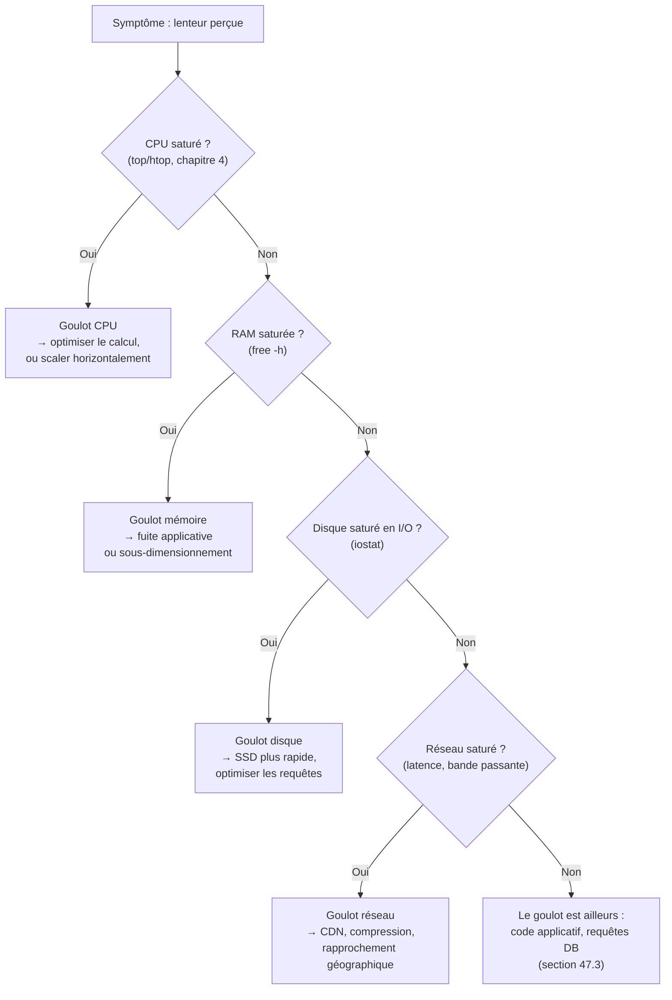

<div class="chapitre-titre-num">CHAPITRE 47 · 🟠 AVANCÉ</div>

# Performance

<div class="encadre objectif">
<span class="encadre-titre">🎯 Objectif du chapitre</span>
Comprendre CPU, RAM, disque, réseau, latence, temps de réponse et concurrence comme les dimensions fondamentales de la performance, et apprendre à identifier un goulot d'étranglement méthodiquement, avant qu'il ne devienne une panne du catalogue du chapitre 46. Ce chapitre transforme les métriques du chapitre 32 en une vraie discipline d'analyse de performance.
</div>

<div class="encadre scenario">
<span class="encadre-titre">🎬 Mise en situation</span>
Le chapitre 34 (section 34.2) a montré comment une trace révèle qu'une requête de 340ms passe 220ms dans une seule requête PostgreSQL. Ce chapitre part de ce type de constat pour construire une méthode complète : comment mesurer, comment interpréter, et comment agir sur chacune des dimensions de performance d'un système.
</div>

## 47.1 Les quatre ressources fondamentales

<div class="encadre retenir">
<span class="encadre-titre">📌 CPU, RAM, disque, réseau — déjà mesurées depuis le chapitre 32</span>
Ces quatre ressources, déjà surveillées via `docker stats` (chapitre 32, section 32.2) et Prometheus/node-exporter (chapitre 32, section 32.3), sont les dimensions physiques fondamentales de toute performance. Un système lent souffre presque toujours d'une saturation d'au moins l'une d'entre elles — la première étape d'un diagnostic de performance consiste à identifier laquelle.
</div>



## 47.2 Latence et temps de réponse

<div class="encadre retenir">
<span class="encadre-titre">📌 Une distinction souvent confondue</span>
La <strong>latence</strong> est le délai avant qu'une réponse ne commence à arriver (le temps "mort" perçu). Le <strong>temps de réponse</strong> est la durée totale entre l'envoi de la requête et la réception complète de la réponse — la latence en fait partie, mais n'est pas la seule composante (le temps de traitement s'ajoute).
</div>

<div class="encadre astuce">
<span class="encadre-titre">💡 Percentiles plutôt que moyenne</span>
Une moyenne masque les cas extrêmes : un temps de réponse moyen de 200ms peut cacher que 95% des requêtes répondent en 50ms tandis que 5% prennent plus de 3 secondes — un problème réel pour une fraction significative des utilisateurs, invisible dans la moyenne seule. Le <strong>p95</strong> (95e percentile : 95% des requêtes sont plus rapides que cette valeur) et le <strong>p99</strong> révèlent ces cas extrêmes, bien plus représentatifs de l'expérience réelle des utilisateurs les moins bien servis.
</div>

```promql
histogram_quantile(0.95, rate(http_request_duration_seconds_bucket[5m]))
```

**Cas pratique DevOps :** cette requête PromQL (chapitre 32, section 32.4) calcule le p95 du temps de réponse sur les 5 dernières minutes — bien plus révélatrice pour un tableau de bord de performance qu'une simple moyenne globale.

## 47.3 Identifier un goulot d'étranglement applicatif

<div class="encadre memoriser">
<span class="encadre-titre">🧠 Rappel direct du chapitre 34</span>
Une fois les quatre ressources fondamentales (section 47.1) écartées comme cause, le goulot se trouve généralement dans le code applicatif lui-même — exactement le cas illustré au chapitre 34 (section 34.2), où une trace distribuée a révélé qu'une requête PostgreSQL non optimisée consommait 220ms sur 340ms au total.
</div>

```sql
EXPLAIN ANALYZE SELECT * FROM commandes WHERE client_id = 42;
```

**Explication :** `EXPLAIN ANALYZE` (PostgreSQL) montre précisément comment la base exécute une requête — souvent révélant qu'un index manquant force un parcours complet de la table (*sequential scan*) plutôt qu'une recherche indexée rapide, la cause la plus fréquente de lenteur applicative.

```sql
CREATE INDEX CONCURRENTLY idx_commandes_client_id ON commandes(client_id);
```

**Cas pratique DevOps :** `CONCURRENTLY` (déjà mentionné au chapitre 30, section "Performance") crée l'index sans verrouiller la table pendant l'opération — une pratique essentielle sur une table déjà utilisée en production.

## 47.4 Concurrence : gérer plusieurs requêtes simultanément

<div class="encadre retenir">
<span class="encadre-titre">📌 Le problème que la concurrence pose concrètement</span>
Un serveur qui gère bien une requête isolée peut se comporter très différemment sous 100 requêtes simultanées — des ressources partagées (connexions à la base de données, verrous, chapitre 30 section 30.4) deviennent des points de contention. Un pool de connexions à la base de données trop petit, par exemple, force les requêtes excédentaires à attendre, dégradant le temps de réponse perçu sans qu'aucune ressource individuelle (CPU, RAM) ne semble pourtant saturée.
</div>

```javascript
// Exemple de configuration d'un pool de connexions (Node.js, pg)
const pool = new Pool({
  max: 20,          // nombre maximal de connexions simultanées
  idleTimeoutMillis: 30000,
});
```

**Cas pratique DevOps :** dimensionner ce pool trop petit crée une contention artificielle sous charge (section 47.4) ; trop grand, il peut saturer la base de données elle-même, qui a ses propres limites de connexions simultanées — un équilibre à mesurer, jamais deviné.

## Atelier — Un test de charge et son analyse

<div class="encadre exercice">
<span class="encadre-titre">🛠️ Atelier 47.1 — Provoquer et diagnostiquer un goulot d'étranglement réel</span>

**Objectif** : générer une charge artificielle sur l'architecture du chapitre 13 et diagnostiquer méthodiquement le premier goulot rencontré.

**Étapes détaillées** :

1. Installe un outil de test de charge simple (`autocannon` pour Node.js, ou `hey` en ligne de commande).
2. Génère une charge croissante sur une route qui interagit avec la base de données (`autocannon -c 50 -d 30 http://localhost:3000/api/commandes`).
3. Observe simultanément les tableaux de bord Grafana (chapitre 32) : CPU, RAM, temps de réponse p95/p99 (section 47.2).
4. Identifie le premier goulot rencontré en suivant l'arbre de décision de la section 47.1.
5. Applique une correction ciblée (un index manquant, section 47.3 ; ou un pool de connexions mal dimensionné, section 47.4), reteste, compare les résultats avant/après.

**Résultat attendu** : une démonstration mesurée et chiffrée de l'effet d'une optimisation ciblée, plutôt qu'une amélioration supposée sans preuve.
</div>

## Erreurs fréquentes

<div class="encadre attention">
<span class="encadre-titre">⚠️ Erreur n°1 — Optimiser sans avoir d'abord mesuré</span>
Deviner qu'un composant est lent et l'optimiser sans données réelles (métriques du chapitre 32, traces du chapitre 34) risque de consacrer du temps à un composant qui n'était pas réellement le goulot d'étranglement — toujours mesurer avant d'agir.
</div>

<div class="encadre attention">
<span class="encadre-titre">⚠️ Erreur n°2 — Se fier uniquement à la moyenne, jamais aux percentiles</span>
Rappel de la section 47.2 : une moyenne peut masquer des cas extrêmes qui affectent réellement une fraction significative des utilisateurs.
</div>

<div class="encadre attention">
<span class="encadre-titre">⚠️ Erreur n°3 — Un pool de connexions dimensionné arbitrairement</span>
Copier une valeur de configuration trouvée en ligne sans la valider par rapport à sa propre charge réelle (section 47.4) peut créer un goulot artificiel ou, à l'inverse, surcharger la base de données.
</div>

## En entreprise

**Réalité répandue** : les équipes matures effectuent des tests de charge réguliers (pas seulement avant un lancement) pour détecter une dégradation progressive de performance avant qu'elle n'affecte réellement les utilisateurs — une pratique proactive plutôt que réactive.

**Bonne pratique répandue** : des objectifs de performance explicites (SLI/SLO, déjà mentionnés au chapitre 32) définissent des seuils clairs ("p95 sous 300ms") plutôt qu'une notion vague de "rapide", permettant de savoir objectivement si une optimisation est réellement nécessaire.

**Erreur classique observée** : des optimisations de performance prématurées sur du code qui n'est jamais réellement devenu un goulot en pratique — un temps de développement investi sans bénéfice mesurable, au détriment de fonctionnalités ou de corrections plus urgentes.

## Entretien technique

<div class="encadre exercice">
<span class="encadre-titre">💼 Questions fréquemment posées en entretien</span>

**Q1. "Comment identifierais-tu la cause d'une lenteur applicative signalée par les utilisateurs ?"**
Réponse attendue : vérifier d'abord les quatre ressources fondamentales (CPU, RAM, disque, réseau), puis creuser le code applicatif et les requêtes de base de données via des traces (chapitre 34) si les ressources de base ne sont pas saturées (section 47.1 et 47.3).

**Q2. "Pourquoi préférer le p95/p99 à la moyenne pour mesurer un temps de réponse ?"**
Réponse attendue : la moyenne masque les cas extrêmes qui affectent une fraction significative des utilisateurs, alors que les percentiles révèlent précisément cette réalité (section 47.2).

**Q3. "Comment diagnostiquerais-tu une requête SQL lente ?"**
Réponse attendue : `EXPLAIN ANALYZE` pour voir le plan d'exécution réel, souvent révélant un index manquant qui force un parcours complet de table (section 47.3).
</div>

## Optimisation, sécurité et maintenabilité — les réflexes dès ce chapitre

<div class="encadre securite">
<span class="encadre-titre">🔒 Sécurité</span>
Un test de charge mal maîtrisé peut lui-même provoquer un déni de service accidentel sur un système partagé — toujours l'exécuter sur un environnement dédié (staging, chapitre 18), jamais directement sur la production sans une planification et une communication préalables à l'équipe.
</div>

<div class="encadre bonne-pratique">
<span class="encadre-titre">✅ Maintenabilité</span>
Documente les résultats de chaque test de charge (avant/après une optimisation) — un historique de mesures permet de détecter une dégradation progressive de performance au fil du temps, invisible d'une seule mesure isolée.
</div>

<div class="encadre performance">
<span class="encadre-titre">🚀 Performance</span>
Ce chapitre entier est une discipline de performance — la méthode (mesurer, identifier, corriger, remesurer) compte davantage que n'importe quelle optimisation isolée mémorisée sans compréhension du contexte qui la justifie.
</div>

## Résumé du chapitre

- CPU, RAM, disque et réseau sont les quatre ressources fondamentales à vérifier en premier face à une lenteur.
- Le p95/p99 révèle des cas extrêmes qu'une moyenne seule masque, plus représentatifs de l'expérience réelle des utilisateurs les moins bien servis.
- `EXPLAIN ANALYZE` diagnostique une requête SQL lente, souvent révélant un index manquant.
- La concurrence (pool de connexions, verrous) peut créer un goulot d'étranglement invisible dans les métriques de ressources individuelles.
- Toujours mesurer avant d'optimiser, jamais deviner.

## Quiz

<div class="encadre exercice">
<span class="encadre-titre">📝 QCM (une seule bonne réponse par question)</span>

1. Le p95 d'un temps de réponse signifie :
   - a) 95% des requêtes sont plus lentes que cette valeur
   - b) 95% des requêtes sont plus rapides que cette valeur
   - c) Exactement 95 requêtes ont été mesurées
   - d) Le temps de réponse moyen

2. `EXPLAIN ANALYZE` sert à :
   - a) Supprimer une table
   - b) Révéler le plan d'exécution réel d'une requête SQL
   - c) Créer un index automatiquement
   - d) Chiffrer une base de données

3. Un pool de connexions à la base de données trop petit peut causer :
   - a) Une saturation immédiate du CPU uniquement
   - b) Une contention qui dégrade le temps de réponse sans saturer les ressources individuelles
   - c) Une amélioration automatique de la performance
   - d) Aucun effet mesurable

**Corrigé** : 1-b, 2-b, 3-b.
</div>

<div class="encadre exercice">
<span class="encadre-titre">📝 Vrai ou Faux</span>

1. Une moyenne de temps de réponse révèle toujours fidèlement l'expérience de tous les utilisateurs. — **Faux** (section 47.2).
2. Un test de charge devrait être exécuté directement en production sans préparation préalable. — **Faux** (section "Sécurité").
3. Optimiser un composant sans avoir d'abord mesuré qu'il est réellement le goulot d'étranglement risque de gaspiller du temps sans bénéfice réel. — **Vrai** (section "Erreurs fréquentes", erreur n°1).

</div>

## Exercices

<div class="encadre exercice">
<span class="encadre-titre">📝 Exercice 47.1</span>

Un tableau de bord montre un temps de réponse moyen stable à 150ms, mais des utilisateurs se plaignent régulièrement de lenteurs importantes. Explique cette apparente contradiction et propose une action.
</div>

**Corrigé :** la moyenne peut rester stable et basse tout en masquant un sous-ensemble significatif de requêtes très lentes (section 47.2) — par exemple, si 90% des requêtes prennent 50ms et 10% prennent 1200ms, la moyenne globale (environ 165ms) semble raisonnable alors qu'une requête sur dix est réellement problématique. L'action recommandée consiste à ajouter des métriques de percentiles (p95, p99) au tableau de bord existant, puis à investiguer spécifiquement les requêtes qui composent cette queue lente (via des traces, chapitre 34) plutôt que de se fier à la moyenne globale qui masque le problème réel signalé par les utilisateurs.

## Checklist de fin de chapitre

<ul class="checklist">
<li>☐ Je sais vérifier méthodiquement les quatre ressources fondamentales face à une lenteur.</li>
<li>☐ Je comprends la différence entre latence et temps de réponse.</li>
<li>☐ Je sais utiliser et interpréter le p95/p99, pas seulement la moyenne.</li>
<li>☐ Je sais diagnostiquer une requête SQL lente avec `EXPLAIN ANALYZE`.</li>
<li>☐ Je comprends comment la concurrence peut créer un goulot d'étranglement invisible dans les métriques de ressources.</li>
<li>☐ Je mesure systématiquement avant d'optimiser, jamais par supposition.</li>
</ul>

## FAQ

<dl class="faq">
<dt>Quel outil de test de charge recommander pour débuter ?</dt>
<dd>`autocannon` (Node.js) ou `hey` (binaire autonome, multi-plateforme) sont simples à prendre en main pour les besoins de ce chapitre — des outils plus complets comme k6 ou Locust existent pour des scénarios de charge plus sophistiqués.</dd>

<dt>Comment savoir si une performance est "suffisamment bonne" ?</dt>
<dd>Idéalement via un objectif explicite (SLO, chapitre 32) défini selon le contexte réel de l'application et les attentes des utilisateurs — pas une comparaison abstraite avec d'autres applications aux contraintes différentes.</dd>

<dt>La performance et la scalabilité (chapitre 48) sont-elles la même chose ?</dt>
<dd>Non — ce chapitre concerne l'efficacité d'un système donné à une charge donnée (le temps de réponse d'une seule instance, par exemple) ; le chapitre 48 concerne la capacité à absorber une charge croissante en ajoutant des ressources, un sujet complémentaire mais distinct.</dd>
</dl>

## Références et pour aller plus loin

- PostgreSQL — documentation officielle sur `EXPLAIN` : [https://www.postgresql.org/docs/current/sql-explain.html](https://www.postgresql.org/docs/current/sql-explain.html)
- Google SRE Book — chapitre sur la définition d'objectifs de fiabilité (SLI/SLO) : [https://sre.google/sre-book/service-level-objectives/](https://sre.google/sre-book/service-level-objectives/)
- `k6` — outil de test de charge moderne, documentation officielle : [https://k6.io/docs/](https://k6.io/docs/)

*Chapitre suivant : scalabilité — vertical scaling, horizontal scaling, load balancing, application stateless, cache, database scaling. Comment absorber une charge croissante, au-delà de la performance d'une seule instance.*
