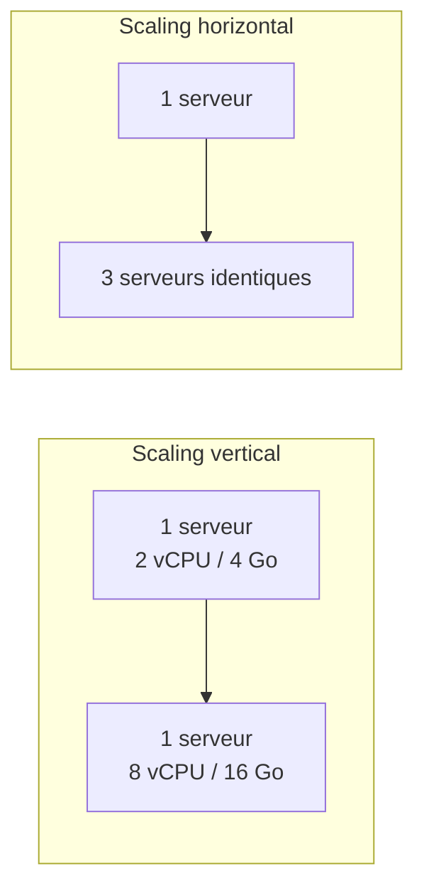

<div class="chapitre-titre-num">CHAPITRE 48 · 🟠 AVANCÉ</div>

# Scalabilité

<div class="encadre objectif">
<span class="encadre-titre">🎯 Objectif du chapitre</span>
Comprendre le scaling vertical et horizontal, le rôle du load balancing, ce que signifie une application stateless, et comment le cache et le scaling de base de données permettent d'absorber une charge croissante. Ce chapitre complète le chapitre 47 : la performance concerne une charge donnée, la scalabilité concerne la capacité à absorber une charge qui grandit.
</div>

<div class="encadre scenario">
<span class="encadre-titre">🎬 Mise en situation</span>
Une application qui répond bien à 10 utilisateurs simultanés (chapitre 47) ne répond pas nécessairement bien à 10 000. Ce chapitre explique comment ajouter de la capacité à un système, deux stratégies fondamentalement différentes déjà esquissées séparément dans ce manuel (le Rolling deployment du chapitre 28, l'auto-réparation Kubernetes du chapitre 41) mais jamais présentées ensemble comme un choix structurant.
</div>

## 48.1 Scaling vertical vs horizontal

<div class="encadre retenir">
<span class="encadre-titre">📌 Deux stratégies fondamentalement différentes</span>
Le <strong>scaling vertical</strong> (ou "scale up") augmente les ressources d'une seule instance existante — plus de CPU, plus de RAM sur le même serveur (chapitre 3). Le <strong>scaling horizontal</strong> (ou "scale out") ajoute davantage d'instances identiques (chapitre 28, Rolling deployment ; chapitre 42, `replicas` Kubernetes) plutôt que d'agrandir une seule.
</div>



| Critère | Scaling vertical | Scaling horizontal |
|---|---|---|
| **Limite** | Plafonnée par la plus grosse machine disponible | Théoriquement illimitée (ajouter plus d'instances) |
| **Complexité** | Simple — aucun changement d'architecture | Nécessite une application stateless (section 48.3) et un load balancer |
| **Tolérance aux pannes** | Aucune — un seul point de défaillance | Bonne — la perte d'une instance n'affecte pas les autres |
| **Coût** | Souvent croissance non linéaire du coût aux tailles extrêmes | Coût plus prévisible, linéaire par instance ajoutée |

<div class="encadre memoriser">
<span class="encadre-titre">🧠 Le scaling vertical a une limite dure, le scaling horizontal une limite architecturale</span>
Le chapitre 41 (section 41.1) a déjà introduit cette idée sans la nommer : Docker Compose sur un seul serveur ne peut que scaler verticalement, jusqu'à la plus grosse machine que le fournisseur propose. Kubernetes (chapitres 41-44) permet le scaling horizontal — la vraie raison pour laquelle il devient nécessaire une fois cette limite verticale atteinte.
</div>

## 48.2 Load balancing : répartir pour permettre le scaling horizontal

<div class="encadre memoriser">
<span class="encadre-titre">🧠 Déjà construit deux fois dans ce manuel</span>
Le bloc <code>upstream</code> Nginx (chapitre 15, section 15.6) et le Service Kubernetes (chapitre 41, section 41.5) répartissent tous deux le trafic entre plusieurs instances — le mécanisme technique qui rend le scaling horizontal possible : sans répartition de charge, ajouter des instances ne servirait à rien si le trafic continue d'être dirigé vers une seule d'entre elles.
</div>

## 48.3 Application stateless : la condition du scaling horizontal

<div class="encadre attention">
<span class="encadre-titre">⚠️ Une application "stateful" ne peut pas scaler horizontalement sans effort supplémentaire</span>
Une application <strong>stateful</strong> garde un état en mémoire locale (une session utilisateur stockée directement dans le processus de l'application, par exemple) — si deux requêtes du même utilisateur atterrissent sur deux instances différentes, l'état de l'une est invisible à l'autre. Une application <strong>stateless</strong> ne garde aucun état local : chaque requête contient (ou récupère depuis un stockage externe partagé) tout ce dont elle a besoin, permettant à n'importe quelle instance de la traiter indifféremment.
</div>

```javascript
// Anti-pattern stateful : session en mémoire locale
const sessions = {};  // perdu si ce processus redémarre, invisible aux autres instances
app.post('/connexion', (req, res) => {
  sessions[req.body.userId] = { connecte: true };
});
```

```javascript
// Pattern stateless : session dans Redis, partagée entre toutes les instances
app.post('/connexion', async (req, res) => {
  await redisClient.set(`session:${req.body.userId}`, JSON.stringify({ connecte: true }));
});
```

**Explication :** en stockant l'état dans Redis (chapitre 13) plutôt qu'en mémoire locale, **n'importe quelle** instance de l'application peut traiter n'importe quelle requête d'un utilisateur donné — la condition technique fondamentale qui rend le scaling horizontal réellement fonctionnel, pas seulement techniquement possible.

## 48.4 Cache : réduire la charge avant même de scaler

<div class="encadre memoriser">
<span class="encadre-titre">🧠 Rappel direct du chapitre 45</span>
Le chapitre 45 (section 45.2) a déjà expliqué pourquoi Redis en cache réduit la charge sur la base de données pour des données fréquemment lues. Ce principe est aussi une stratégie de scalabilité à part entière : un cache efficace peut retarder, voire éviter, le besoin de scaler la base de données elle-même (section 48.5), souvent la ressource la plus coûteuse et complexe à scaler horizontalement.
</div>

## 48.5 Scaling de base de données : la limite la plus difficile

<div class="encadre attention">
<span class="encadre-titre">⚠️ Une base de données ne scale pas horizontalement aussi simplement qu'une API</span>
Contrairement à une API stateless (section 48.3), une base de données gère un état partagé par nature — plusieurs instances identiques d'une base de données doivent rester synchronisées entre elles, un problème bien plus complexe que répliquer une API sans état.
</div>

| Stratégie | Principe | Limite |
|---|---|---|
| **Réplication en lecture** | Une instance principale pour les écritures, plusieurs répliques pour les lectures | Les écritures restent limitées par la capacité d'une seule instance principale |
| **Partitionnement (sharding)** | Répartir les données elles-mêmes entre plusieurs bases, selon une clé (par exemple, l'ID client) | Complexité significative — des requêtes qui croisent plusieurs partitions deviennent difficiles |
| **Base de données managée avec scaling automatique** | Le fournisseur cloud gère la complexité (chapitre 40, RDS) | Coût plus élevé, moins de contrôle fin |

<div class="encadre bonne-pratique">
<span class="encadre-titre">✅ Bonne pratique — repousser le scaling de base de données le plus longtemps possible</span>
Avant d'envisager une réplication ou un partitionnement complexes, épuiser d'abord les optimisations plus simples : index manquants (chapitre 47, section 47.3), cache efficace (section 48.4), requêtes non optimisées. Le scaling de base de données est la dimension la plus coûteuse en complexité de ce chapitre — à n'aborder qu'une fois les alternatives plus simples réellement épuisées, le même principe de progressivité déjà appliqué à Kubernetes (chapitre 41) et à l'Infrastructure as Code (chapitre 37).
</div>

## Atelier — Transformer une application stateful en stateless

<div class="encadre exercice">
<span class="encadre-titre">🛠️ Atelier 48.1 — Rendre le scaling horizontal réellement possible</span>

**Objectif** : identifier et éliminer un état local dans l'application construite à travers ce manuel, condition préalable à un vrai scaling horizontal.

**Étapes détaillées** :

1. Audite le code de l'application (chapitre 22) à la recherche de tout état gardé en mémoire locale (variables globales, sessions, caches internes non partagés).
2. Pour chaque cas trouvé, migre cet état vers Redis (déjà en place depuis le chapitre 13) ou la base de données.
3. Déploie deux instances de l'application (Docker Compose avec `--scale`, ou `replicas: 2` en Kubernetes, chapitre 42).
4. Teste un scénario qui traverserait autrement les deux instances (une connexion suivie d'une action nécessitant la session) via le load balancer, vérifie que le comportement reste cohérent quelle que soit l'instance qui traite chaque requête.

**Résultat attendu** : la démonstration concrète qu'une application réellement stateless se comporte de façon identique, quel que soit le nombre d'instances qui la servent — la condition fondamentale de ce chapitre.
</div>

## Erreurs fréquentes

<div class="encadre attention">
<span class="encadre-titre">⚠️ Erreur n°1 — Scaler horizontalement une application encore stateful</span>
Ajouter des instances sans avoir d'abord éliminé l'état local (section 48.3) produit un comportement incohérent selon l'instance qui traite chaque requête — un scaling horizontal qui ne fait qu'ajouter des bugs, pas de la capacité réelle.
</div>

<div class="encadre attention">
<span class="encadre-titre">⚠️ Erreur n°2 — Scaler la base de données avant d'avoir épuisé les optimisations plus simples</span>
Rappel de la section 48.5 : un index manquant ou un cache absent peuvent résoudre un problème de charge bien plus simplement qu'une réplication ou un partitionnement complexe.
</div>

<div class="encadre attention">
<span class="encadre-titre">⚠️ Erreur n°3 — Scaler par anticipation, sans charge réelle mesurée</span>
Rappel du principe déjà appliqué au chapitre 41 (section "Erreurs fréquentes") et au chapitre 45 : scaler avant d'avoir rencontré une limite réelle mesurée (chapitre 47) ajoute une complexité et un coût sans bénéfice immédiat avéré.
</div>

## En entreprise

**Réalité répandue** : la majorité des applications, même à une échelle raisonnable, restent longtemps sur du scaling vertical simple avant d'avoir réellement besoin du scaling horizontal — la complexité de ce dernier n'est justifiée qu'au-delà d'une charge que le scaling vertical ne peut plus absorber.

**Bonne pratique répandue** : l'autoscaling (l'ajustement automatique du nombre d'instances selon la charge mesurée en temps réel, natif à Kubernetes via le *Horizontal Pod Autoscaler*) permet d'absorber des pics de trafic imprévisibles sans surprovisionner en permanence — un raffinement du scaling horizontal manuel déjà couvert dans ce chapitre.

**Erreur classique observée** : des architectures conçues dès le départ pour un scaling massif jamais réellement atteint, ajoutant une complexité permanente (partitionnement de base de données, microservices multiples) pour un besoin qui ne se matérialise jamais à cette échelle — un coût d'opportunité significatif rarement reconnu comme tel.

## Entretien technique

<div class="encadre exercice">
<span class="encadre-titre">💼 Questions fréquemment posées en entretien</span>

**Q1. "Quelle est la différence entre scaling vertical et horizontal ?"**
Réponse attendue : le vertical augmente les ressources d'une seule instance ; l'horizontal ajoute davantage d'instances identiques, réparties par un load balancer (section 48.1-48.2).

**Q2. "Pourquoi une application doit-elle être stateless pour scaler horizontalement efficacement ?"**
Réponse attendue : sans état partagé (session en mémoire locale, par exemple), une requête traitée par une instance différente d'une requête précédente du même utilisateur ne retrouverait pas le contexte nécessaire — l'état doit vivre dans un stockage externe partagé (Redis, base de données) accessible par toutes les instances (section 48.3).

**Q3. "Pourquoi le scaling de base de données est-il généralement plus complexe que le scaling d'une API ?"**
Réponse attendue : une base de données gère un état partagé par nature, nécessitant une synchronisation entre répliques ou un partitionnement des données — bien plus complexe qu'une API stateless, qui peut être répliquée sans coordination particulière entre instances (section 48.5).
</div>

## Optimisation, sécurité et maintenabilité — les réflexes dès ce chapitre

<div class="encadre securite">
<span class="encadre-titre">🔒 Sécurité</span>
Un état partagé externalisé (Redis, base de données, section 48.3) nécessite les mêmes protections déjà appliquées à travers ce manuel (chapitre 13, section 13.4 : jamais exposé directement au public) — le scaling horizontal ne devrait jamais élargir accidentellement la surface d'attaque du système.
</div>

<div class="encadre bonne-pratique">
<span class="encadre-titre">✅ Maintenabilité</span>
Documente explicitement les décisions de scaling (pourquoi vertical plutôt qu'horizontal, ou l'inverse, à quel moment) — la même discipline de justification déjà recommandée pour l'architecture globale (chapitre 45).
</div>

<div class="encadre performance">
<span class="encadre-titre">🚀 Performance</span>
Le cache (section 48.4) reste souvent l'optimisation la plus rentable avant tout scaling structurel plus lourd — un principe qui recoupe directement le chapitre 47 (mesurer et optimiser avant de scaler).
</div>

## Résumé du chapitre

- Le scaling vertical augmente les ressources d'une seule instance ; le scaling horizontal ajoute des instances identiques, réparties par un load balancer.
- Une application doit être stateless (état externalisé dans Redis ou la base de données) pour scaler horizontalement de façon fiable.
- Le cache réduit la charge sur la base de données, retardant voire évitant le besoin de son propre scaling.
- Le scaling de base de données (réplication, partitionnement) est la dimension la plus complexe de ce chapitre, à aborder en dernier recours.
- Scaler sans charge réelle mesurée ajoute une complexité disproportionnée, le même principe de progressivité appliqué à travers tout ce manuel.

## Quiz

<div class="encadre exercice">
<span class="encadre-titre">📝 QCM (une seule bonne réponse par question)</span>

1. Le scaling vertical consiste à :
   - a) Ajouter davantage d'instances identiques
   - b) Augmenter les ressources d'une seule instance existante
   - c) Répartir le trafic entre plusieurs serveurs
   - d) Supprimer des instances inutilisées

2. Une application stateless :
   - a) Garde son état en mémoire locale sur chaque instance
   - b) Externalise son état dans un stockage partagé, accessible par toutes les instances
   - c) Ne peut jamais avoir de sessions utilisateur
   - d) Fonctionne uniquement avec une seule instance

3. Le scaling de base de données est généralement :
   - a) Plus simple que le scaling d'une API stateless
   - b) Plus complexe, à cause de l'état partagé qui nécessite synchronisation
   - c) Impossible techniquement
   - d) Sans rapport avec la scalabilité

**Corrigé** : 1-b, 2-b, 3-b.
</div>

<div class="encadre exercice">
<span class="encadre-titre">📝 Vrai ou Faux</span>

1. Une application stateful peut scaler horizontalement sans aucun problème de cohérence. — **Faux** (section 48.3).
2. Le cache peut retarder ou éviter le besoin de scaler la base de données elle-même. — **Vrai** (section 48.4).
3. Il est recommandé de scaler une application par anticipation, avant toute charge réelle mesurée. — **Faux** (section "Erreurs fréquentes", erreur n°3).

</div>

## Exercices

<div class="encadre exercice">
<span class="encadre-titre">📝 Exercice 48.1</span>

Une application stocke les paniers d'achat des utilisateurs directement en mémoire dans le processus applicatif. L'équipe souhaite passer de 1 à 3 instances pour absorber une charge croissante. Explique le problème que cela poserait sans modification préalable, et la correction nécessaire.
</div>

**Corrigé :** avec un panier stocké en mémoire locale (état stateful, section 48.3), un utilisateur dont les requêtes successives sont réparties par le load balancer entre les trois instances verrait son panier apparaître vide ou incohérent selon l'instance qui traite chaque requête — une expérience utilisateur cassée par le simple fait d'avoir ajouté des instances. La correction consiste à externaliser l'état du panier vers un stockage partagé (Redis, déjà en place depuis le chapitre 13, ou directement en base de données) avant toute augmentation du nombre d'instances — exactement la démarche de l'atelier 48.1, condition préalable non négociable à un scaling horizontal fiable.

## Checklist de fin de chapitre

<ul class="checklist">
<li>☐ Je sais expliquer la différence entre scaling vertical et horizontal, avec leurs compromis respectifs.</li>
<li>☐ Je comprends pourquoi une application stateless est nécessaire pour un scaling horizontal fiable.</li>
<li>☐ Je sais comment le cache retarde ou évite le besoin de scaler une base de données.</li>
<li>☐ Je connais les trois stratégies de scaling de base de données et leurs compromis.</li>
<li>☐ J'ai transformé, en pratique, un état local en état partagé (atelier 48.1).</li>
<li>☐ Je ne scale jamais par anticipation, uniquement face à une charge réelle mesurée.</li>
</ul>

## FAQ

<dl class="faq">
<dt>Faut-il toujours viser une application stateless dès le premier jour d'un projet ?</dt>
<dd>C'est une bonne pratique par défaut, même sans besoin immédiat de scaling — elle coûte généralement peu à adopter dès le début (Redis pour les sessions, par exemple) et évite une migration plus coûteuse une fois le scaling horizontal réellement nécessaire.</dd>

<dt>L'autoscaling élimine-t-il le besoin de comprendre le scaling manuel de ce chapitre ?</dt>
<dd>Non — l'autoscaling (mentionné en section "En entreprise") automatise l'ajustement du nombre d'instances, mais s'appuie sur les mêmes fondamentaux (application stateless, load balancing) déjà couverts dans ce chapitre. Comprendre ces fondamentaux reste nécessaire pour configurer et diagnostiquer correctement un autoscaling.</dd>

<dt>Le partitionnement de base de données (sharding) est-il souvent nécessaire ?</dt>
<dd>Rarement pour la majorité des applications de ce manuel — c'est une solution réservée à une échelle très importante, après avoir épuisé la réplication en lecture, le cache et l'optimisation des requêtes (section 48.5, bonne pratique de progressivité).</dd>
</dl>

## Références et pour aller plus loin

- Kubernetes — documentation officielle sur le Horizontal Pod Autoscaler : [https://kubernetes.io/docs/tasks/run-application/horizontal-pod-autoscale/](https://kubernetes.io/docs/tasks/run-application/horizontal-pod-autoscale/)
- The Twelve-Factor App — section VI, "Processes" (applications stateless) : [https://12factor.net/fr/processes](https://12factor.net/fr/processes)

*Chapitre suivant : haute disponibilité — single point of failure, réplication, redondance, health checks, failover. La dernière pièce de la Partie XIV, avant le projet final du manuel.*
