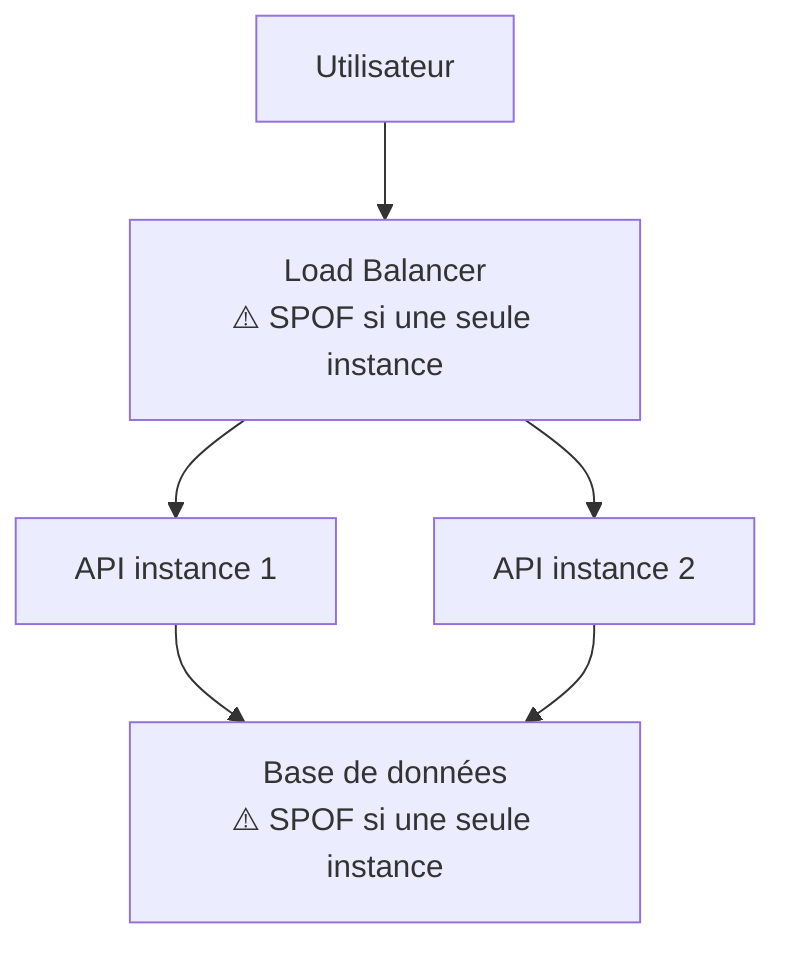
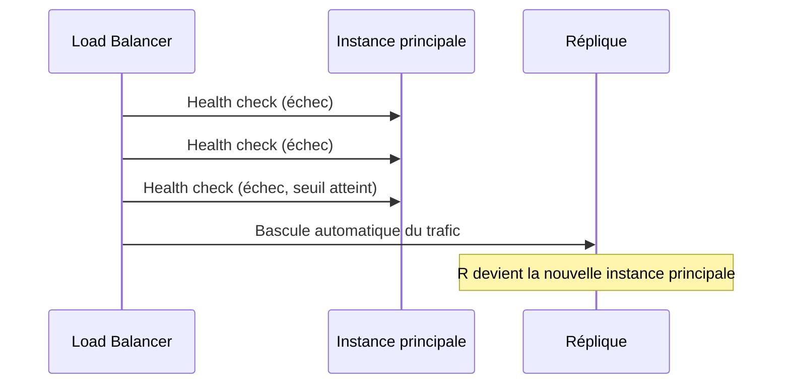

<div class="chapitre-titre-num">CHAPITRE 49 · 🔴 PROFESSIONNEL</div>

# Haute disponibilité

<div class="encadre objectif">
<span class="encadre-titre">🎯 Objectif du chapitre</span>
Comprendre le "single point of failure" (point de défaillance unique), la réplication, la redondance, les health checks et le failover, puis construire une architecture haute disponibilité complète. Ce chapitre clôt la Partie XIV en réunissant scalabilité (chapitre 48) et fiabilité — une application qui scale bien mais tombe entièrement en panne au moindre incident n'a résolu qu'une partie du problème.
</div>

<div class="encadre scenario">
<span class="encadre-titre">🎬 Mise en situation</span>
Le chapitre 41 (section 41.1) a introduit Kubernetes en partant d'un constat : un seul serveur qui tombe en panne emporte toute l'application avec lui. Ce chapitre généralise ce principe à **chaque** composant de l'architecture du chapitre 45 — pas seulement le serveur applicatif, mais aussi le load balancer, la base de données, et même le DNS lui-même. La haute disponibilité consiste à éliminer, un par un, chaque point de défaillance unique restant.
</div>

## 49.1 Single point of failure : identifier chaque maillon fragile

<div class="encadre retenir">
<span class="encadre-titre">📌 Définition</span>
Un <strong>single point of failure</strong> (SPOF) est un composant dont la panne, à elle seule, provoque l'indisponibilité de tout le système — même si tous les autres composants fonctionnent parfaitement. Une architecture haute disponibilité identifie systématiquement chaque SPOF potentiel et le rend redondant.
</div>



<div class="encadre astuce">
<span class="encadre-titre">💡 Le paradoxe visible dans ce schéma</span>
Même après avoir répliqué l'API (chapitre 48) pour éliminer le SPOF applicatif, deux nouveaux SPOF restent visibles : le Load Balancer lui-même (une seule instance) et la base de données (une seule instance, chapitre 30 section 30.1 : `replicas: 1` pour PostgreSQL au chapitre 42). Éliminer un SPOF en révèle souvent un autre, en amont ou en aval — la haute disponibilité est un processus itératif, jamais un état atteint une fois pour toutes.
</div>

## 49.2 Réplication et redondance

<div class="encadre memoriser">
<span class="encadre-titre">🧠 Rappel direct du chapitre 48</span>
La réplication de l'API (section 48.1, scaling horizontal) est déjà une forme de redondance — plusieurs instances identiques, dont la perte d'une seule n'affecte pas la disponibilité globale. Ce chapitre étend ce principe aux composants qui n'ont pas encore été traités : le Load Balancer et la base de données.
</div>

```hcl
# Load Balancer redondant (AWS ALB, déjà multi-zone par conception, chapitre 40)
resource "aws_lb" "principal" {
  load_balancer_type = "application"
  subnets            = [aws_subnet.zone_a.id, aws_subnet.zone_b.id]
}
```

**Explication :** un Application Load Balancer AWS (chapitre 40) est, par conception, déjà réparti sur plusieurs zones de disponibilité (chapitre 39, section 39.2) — contrairement à une seule instance Nginx sur un seul serveur, où le Load Balancer lui-même redevient un SPOF. C'est une des raisons pour lesquelles les services managés cloud (chapitre 39) sont souvent choisis spécifiquement pour les composants les plus critiques d'une architecture haute disponibilité.

```hcl
# Base de données avec réplique (RDS Multi-AZ, chapitre 40)
resource "aws_db_instance" "principale" {
  # ...
  multi_az = true
}
```

**Explication :** `multi_az = true` (RDS, chapitre 40, section 40.6) maintient automatiquement une réplique synchrone dans une seconde zone de disponibilité, avec un basculement automatique en cas de panne de l'instance principale — l'implémentation managée du principe de réplication appliqué à la base de données, la dimension la plus complexe à répliquer manuellement (chapitre 48, section 48.5).

## 49.3 Health checks : détecter une panne avant qu'un utilisateur ne la subisse

<div class="encadre memoriser">
<span class="encadre-titre">🧠 Rappel de tout ce que ce manuel a déjà construit</span>
`healthcheck.sh` (chapitre 10), le `HEALTHCHECK` Docker (chapitre 12, section 12.6), les probes Kubernetes (chapitre 42, section 42.3) — tous ces mécanismes, déjà construits séparément, sont la condition technique du <strong>failover</strong> (section 49.4) : un système ne peut basculer automatiquement vers une instance saine que s'il sait, en continu et sans délai excessif, laquelle est réellement saine.
</div>

## 49.4 Failover : basculer automatiquement

<div class="encadre retenir">
<span class="encadre-titre">📌 Ce que le failover ajoute à la redondance</span>
La redondance (section 49.2) signifie qu'une réplique existe. Le <strong>failover</strong> est le mécanisme qui bascule <strong>automatiquement</strong> vers cette réplique dès qu'une panne est détectée — sans lui, la redondance existe mais reste inutile si personne (ou rien) ne déclenche la bascule à temps.
</div>



<div class="encadre memoriser">
<span class="encadre-titre">🧠 Le failover Kubernetes, déjà construit au chapitre 42</span>
L'auto-réparation Kubernetes (chapitre 42, atelier 42.1) est une forme de failover : un pod qui échoue son `livenessProbe` est automatiquement remplacé, et le Service (chapitre 41, section 41.5) redirige immédiatement le trafic vers les pods sains restants — un failover complet, déjà démontré en conditions réelles dans ce manuel, sans qu'il ait été nommé ainsi à l'époque.
</div>

## 49.5 Mesurer la disponibilité : au-delà de "ça marche"

<div class="encadre retenir">
<span class="encadre-titre">📌 Le calcul des "neuf"</span>
La disponibilité s'exprime en pourcentage de temps de fonctionnement sur une période donnée, souvent résumée par son nombre de "neuf" :

```text
99%      (deux neuf)   → jusqu'à 3,65 jours d'indisponibilité par an
99,9%    (trois neuf)  → jusqu'à 8,76 heures par an
99,99%   (quatre neuf) → jusqu'à 52,6 minutes par an
99,999%  (cinq neuf)   → jusqu'à 5,26 minutes par an
```

Chaque "neuf" supplémentaire multiplie approximativement par dix la complexité et le coût de l'architecture nécessaire pour l'atteindre — un objectif de disponibilité doit être choisi en fonction du besoin réel, jamais par ambition abstraite.
</div>

<div class="encadre bonne-pratique">
<span class="encadre-titre">✅ Bonne pratique — choisir un objectif de disponibilité réaliste et justifié</span>
Un projet personnel ou une application interne à faible enjeu n'a probablement pas besoin de "cinq neuf" (5 minutes d'indisponibilité tolérée par an, une exigence extrêmement coûteuse) — un objectif de "deux" ou "trois neuf" est souvent largement suffisant et bien plus réaliste à atteindre avec les moyens de ce manuel. Le même principe de proportionnalité déjà appliqué au chapitre 48 (section "Erreurs fréquentes") s'applique ici à la disponibilité elle-même.
</div>

## Atelier — Éliminer les SPOF de l'architecture du chapitre 45

<div class="encadre exercice">
<span class="encadre-titre">🛠️ Atelier 49.1 — Un audit complet de haute disponibilité</span>

**Objectif** : identifier et corriger, un par un, chaque SPOF de l'architecture construite à travers ce manuel.

**Étapes détaillées** :

1. Reprends le schéma d'architecture de ton propre projet (atelier 45.1), identifie chaque composant à instance unique.
2. Pour chacun, détermine s'il constitue un vrai SPOF (sa panne rendrait-elle réellement tout le système indisponible ?).
3. Priorise : quel SPOF a le plus fort impact potentiel, et lequel serait le plus simple à corriger (section 49.2) ?
4. Corrige au moins un SPOF réel de ton architecture (répliquer l'API si ce n'est pas déjà fait via l'atelier 48.1, par exemple).
5. Documente les SPOF restants, volontairement non corrigés, avec la justification du choix (coût, complexité disproportionnée par rapport au besoin réel, section 49.5).

**Résultat attendu** : une architecture avec au moins un SPOF de moins qu'au départ, et une documentation honnête de ceux qui restent, avec leur justification — l'application concrète et assumée du principe de proportionnalité de ce chapitre.
</div>

## Erreurs fréquentes

<div class="encadre attention">
<span class="encadre-titre">⚠️ Erreur n°1 — Répliquer l'application sans répliquer le Load Balancer devant elle</span>
Comme illustré en section 49.1, éliminer un SPOF (l'application) peut simplement déplacer le problème vers un autre composant (le Load Balancer) — un audit de haute disponibilité doit être exhaustif, jamais partiel.
</div>

<div class="encadre attention">
<span class="encadre-titre">⚠️ Erreur n°2 — De la redondance sans failover automatique</span>
Rappel de la section 49.4 : une réplique qui existe mais dont le basculement dépend d'une intervention humaine manuelle (souvent lente et sujette à erreur en pleine crise) offre une protection bien moindre qu'un failover réellement automatisé.
</div>

<div class="encadre attention">
<span class="encadre-titre">⚠️ Erreur n°3 — Viser un objectif de disponibilité disproportionné par rapport au besoin réel</span>
Rappel de la section 49.5 : chaque "neuf" supplémentaire coûte significativement plus cher en complexité — un objectif choisi par ambition abstraite plutôt que par besoin réel gaspille des ressources qui auraient pu servir d'autres priorités.
</div>

## En entreprise

**Réalité répandue** : les grandes plateformes avec des exigences de disponibilité très élevées (banques, plateformes de e-commerce à fort trafic) investissent massivement dans l'élimination systématique des SPOF, souvent avec une redondance multi-région (au-delà de la simple redondance multi-zone du chapitre 39) — un niveau de complexité et de coût largement disproportionné pour la majorité des projets de ce manuel.

**Bonne pratique répandue** : des exercices de "chaos engineering" (provoquer délibérément des pannes en production contrôlée, popularisés par Netflix avec son outil Chaos Monkey) vérifient qu'un failover fonctionne réellement, plutôt que de se fier à une conception théorique jamais testée en conditions réelles — l'extension à grande échelle du même principe déjà appliqué à l'atelier 46.1 de ce manuel.

**Erreur classique observée** : une architecture qui semble hautement disponible sur le papier (plusieurs instances, plusieurs zones) mais dont le failover n'a jamais été réellement testé — découvrant, au moment d'un vrai incident, qu'un détail de configuration empêche la bascule automatique de fonctionner comme prévu.

## Entretien technique

<div class="encadre exercice">
<span class="encadre-titre">💼 Questions fréquemment posées en entretien</span>

**Q1. "Qu'est-ce qu'un single point of failure, et comment l'identifierais-tu dans une architecture existante ?"**
Réponse attendue : un composant dont la seule panne rend tout le système indisponible — l'identifier en examinant chaque composant de l'architecture et en se demandant si sa perte, isolément, provoquerait une indisponibilité totale (section 49.1).

**Q2. "Quelle est la différence entre redondance et failover ?"**
Réponse attendue : la redondance signifie qu'une réplique existe ; le failover est le mécanisme qui bascule automatiquement vers cette réplique dès qu'une panne est détectée — la redondance seule, sans failover automatique, reste largement inefficace en pratique (section 49.4).

**Q3. "Comment choisirais-tu un objectif de disponibilité pour un nouveau projet ?"**
Réponse attendue : selon le besoin réel de l'application (criticité, impact d'une indisponibilité), pas par ambition abstraite — chaque "neuf" supplémentaire multiplie significativement la complexité et le coût nécessaires (section 49.5).
</div>

## Optimisation, sécurité et maintenabilité — les réflexes dès ce chapitre

<div class="encadre securite">
<span class="encadre-titre">🔒 Sécurité</span>
Une architecture hautement disponible protège contre les pannes, pas nécessairement contre une attaque délibérée (déni de service) — la haute disponibilité et la sécurité sont complémentaires mais distinctes, un système redondant peut rester vulnérable à une attaque ciblée si sa sécurité (chapitre 35) n'est pas traitée séparément.
</div>

<div class="encadre bonne-pratique">
<span class="encadre-titre">✅ Maintenabilité</span>
Documente chaque SPOF identifié, corrigé ou volontairement accepté (avec sa justification, atelier 49.1) — un audit de haute disponibilité mérite la même rigueur documentaire que n'importe quelle autre décision d'architecture de ce manuel.
</div>

<div class="encadre performance">
<span class="encadre-titre">🚀 Performance</span>
La redondance (section 49.2) recoupe directement le scaling horizontal (chapitre 48) — les mêmes instances supplémentaires qui absorbent une charge croissante offrent aussi, comme bénéfice secondaire naturel, une tolérance aux pannes.
</div>

## Résumé du chapitre

- Un single point of failure est un composant dont la seule panne rend tout le système indisponible.
- Éliminer un SPOF peut en révéler un autre en amont ou en aval — un audit doit être exhaustif, pas partiel.
- La réplication et la redondance nécessitent des health checks fiables et un failover réellement automatisé pour être efficaces en pratique.
- La disponibilité se mesure en "neuf", chaque niveau supplémentaire multipliant significativement la complexité et le coût nécessaires.
- Un objectif de disponibilité doit être choisi selon le besoin réel, jamais par ambition abstraite — le principe de proportionnalité appliqué à travers tout ce manuel.

## Quiz

<div class="encadre exercice">
<span class="encadre-titre">📝 QCM (une seule bonne réponse par question)</span>

1. Un single point of failure désigne :
   - a) Un composant redondant par nature
   - b) Un composant dont la seule panne rend tout le système indisponible
   - c) Un type de base de données
   - d) Un outil de monitoring

2. La redondance seule, sans failover automatique :
   - a) Offre une protection complète et suffisante
   - b) Reste largement inefficace, car rien ne bascule automatiquement vers la réplique
   - c) Élimine tout besoin de health checks
   - d) N'a aucun rapport avec la haute disponibilité

3. Passer de "trois neuf" à "quatre neuf" de disponibilité :
   - a) Ne change rien à la complexité nécessaire
   - b) Multiplie significativement la complexité et le coût nécessaires
   - c) Réduit le coût de l'architecture
   - d) Est toujours l'objectif à viser, quel que soit le contexte

**Corrigé** : 1-b, 2-b, 3-b.
</div>

<div class="encadre exercice">
<span class="encadre-titre">📝 Vrai ou Faux</span>

1. Éliminer un SPOF peut parfois en révéler un autre, en amont ou en aval du système. — **Vrai** (section 49.1).
2. Un objectif de "cinq neuf" de disponibilité est approprié pour tout projet, quelle que soit sa criticité réelle. — **Faux** (section 49.5 et erreur fréquente n°3).
3. Le chaos engineering consiste à provoquer délibérément des pannes contrôlées pour vérifier qu'un failover fonctionne réellement. — **Vrai** (section "En entreprise").

</div>

## Exercices

<div class="encadre exercice">
<span class="encadre-titre">📝 Exercice 49.1</span>

Une équipe a répliqué son API sur trois instances (chapitre 48), mais garde un unique Nginx sur un seul serveur comme Load Balancer, et une base de données PostgreSQL sur une seule instance sans réplique. Identifie les SPOF restants et propose une priorité de correction.
</div>

**Corrigé :** deux SPOF restent identifiables (section 49.1) : le Nginx unique (sa panne rendrait toutes les instances API injoignables, malgré leur bonne santé individuelle) et la base de données unique (sa panne arrêterait complètement l'application, quelle que soit la redondance de l'API). Priorité de correction : la base de données présente généralement l'impact le plus critique (perte potentielle de données en plus de l'indisponibilité, chapitre 31) et mérite d'être traitée en premier via une réplication (section 49.2, `multi_az` ou équivalent) ; le Nginx unique, bien que critique, dispose d'une solution plus simple et moins coûteuse (un second Nginx avec un mécanisme de bascule DNS ou un load balancer managé du fournisseur cloud, chapitre 40) — un ordre de priorité basé sur l'impact réel de chaque panne potentielle, pas seulement sur la facilité de correction.

## Checklist de fin de chapitre

<ul class="checklist">
<li>☐ Je sais identifier un single point of failure dans une architecture donnée.</li>
<li>☐ Je comprends pourquoi éliminer un SPOF peut en révéler un autre, nécessitant un audit exhaustif.</li>
<li>☐ Je sais distinguer redondance et failover, et pourquoi les deux sont nécessaires ensemble.</li>
<li>☐ Je sais calculer et interpréter un objectif de disponibilité en "neuf".</li>
<li>☐ J'ai audité et corrigé au moins un SPOF réel de mon propre projet.</li>
<li>☐ Je documente honnêtement les SPOF volontairement non corrigés, avec leur justification.</li>
</ul>

## FAQ

<dl class="faq">
<dt>Faut-il éliminer absolument tous les SPOF d'une architecture ?</dt>
<dd>Non, pas nécessairement — certains SPOF résiduels peuvent être acceptés consciemment si leur correction coûte disproportionnellement plus que l'impact réel de leur panne éventuelle (section 49.5, principe de proportionnalité), à condition que ce choix soit documenté et assumé, pas simplement ignoré par méconnaissance.</dd>

<dt>Comment tester qu'un failover fonctionne réellement, sans attendre une vraie panne ?</dt>
<dd>En le provoquant délibérément en conditions contrôlées (chaos engineering, section "En entreprise") — arrêter volontairement l'instance principale d'un composant redondant et vérifier que le basculement se produit comme prévu, exactement l'esprit de l'atelier 42.1 (auto-réparation Kubernetes) et de l'atelier 46.1 (simulation de pannes).</dd>

<dt>La haute disponibilité remplace-t-elle le besoin de sauvegardes (chapitre 31) ?</dt>
<dd>Non, absolument pas — la haute disponibilité protège contre l'indisponibilité temporaire d'un composant ; les sauvegardes protègent contre la perte définitive de données (une erreur humaine, une corruption). Les deux sont complémentaires, jamais substituables l'une à l'autre.</dd>
</dl>

## Références et pour aller plus loin

- Google SRE Book — "Embracing Risk" (sur le choix d'un objectif de fiabilité réaliste) : [https://sre.google/sre-book/embracing-risk/](https://sre.google/sre-book/embracing-risk/)
- AWS — "Reliability Pillar" du Well-Architected Framework (déjà mentionné au chapitre 40) : [https://docs.aws.amazon.com/wellarchitected/latest/reliability-pillar/welcome.html](https://docs.aws.amazon.com/wellarchitected/latest/reliability-pillar/welcome.html)
- Netflix — Chaos Monkey, outil open source de référence en chaos engineering : [https://netflix.github.io/chaosmonkey/](https://netflix.github.io/chaosmonkey/)

*Chapitre suivant : le projet final fil rouge — la Partie XV s'ouvre. Du dossier vide jusqu'à une application en production complète, remobilisant dans l'ordre absolument tout ce que ce manuel a construit depuis le chapitre 1.*
