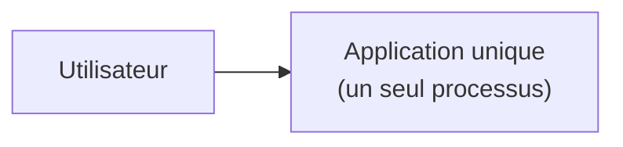
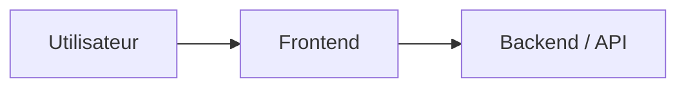
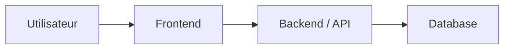
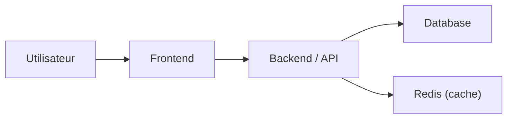
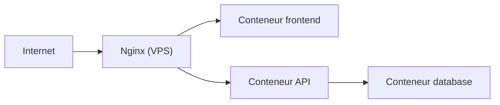
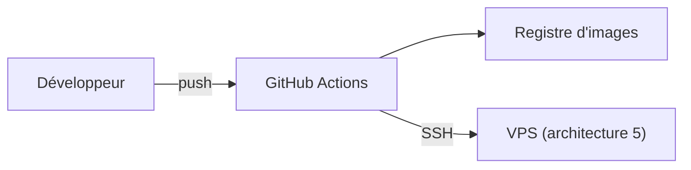
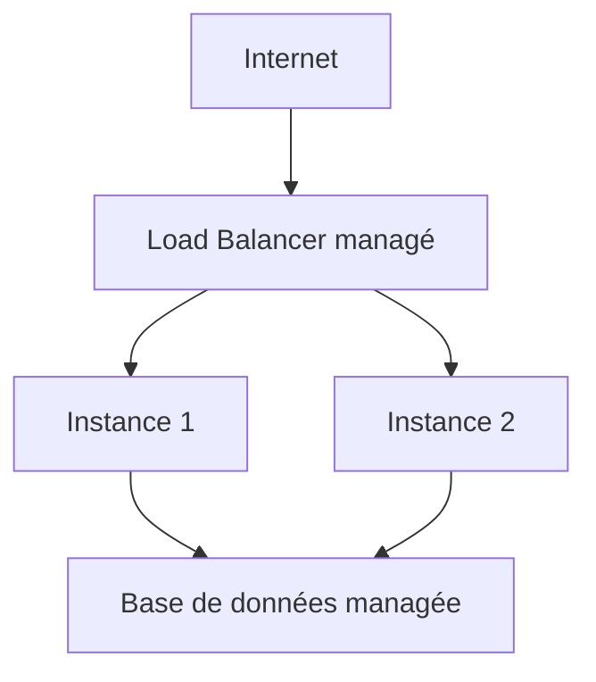
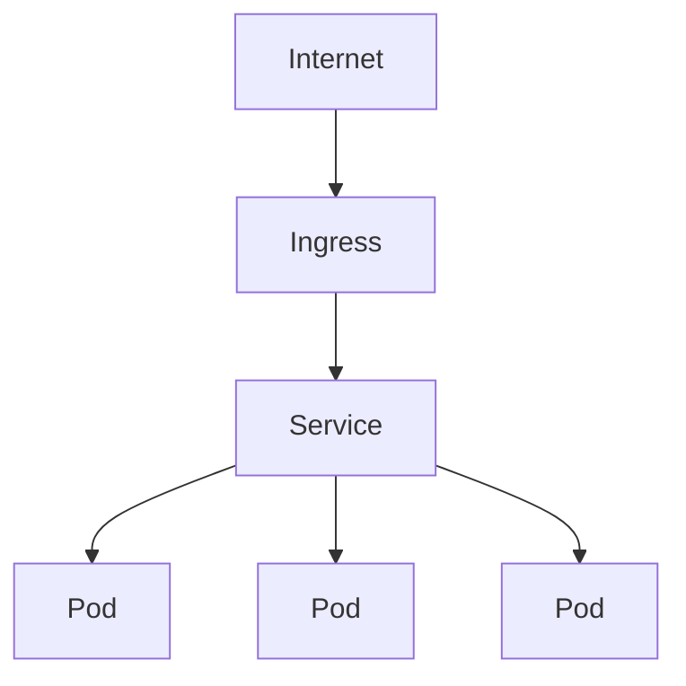
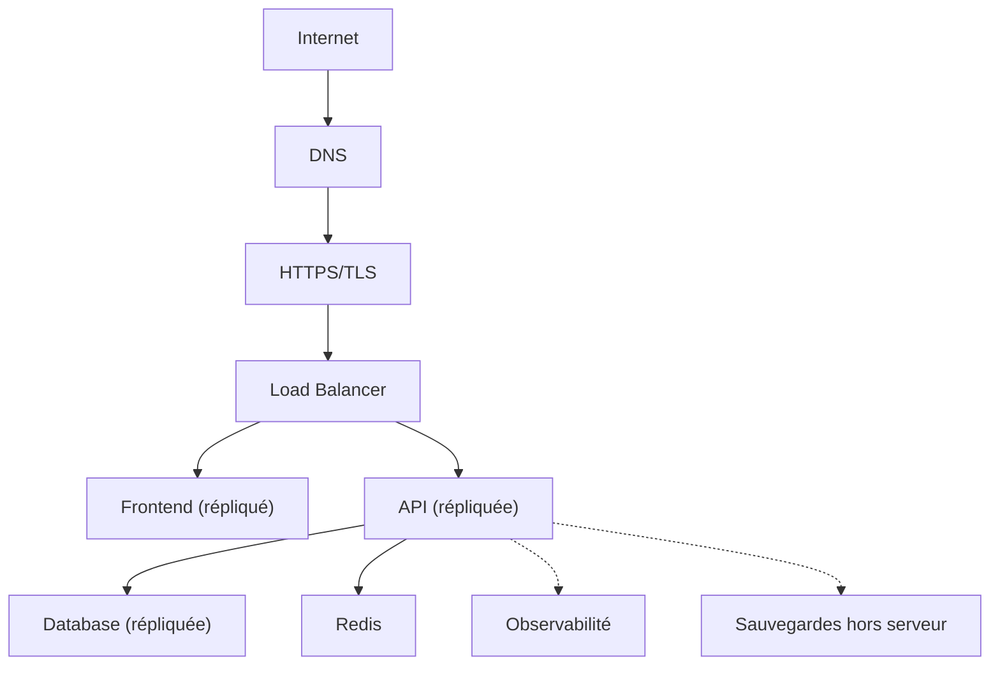

ANNEXE C

# Neuf architectures comparées

🎯 Objectif de cette annexe
De l'application unique à l'infrastructure complète, neuf architectures représentatives de la progression de ce manuel — diagramme, composants, flux, avantages, limites, coût/complexité, cas d'usage pour chacune. Un récapitulatif visuel à consulter pour choisir l'architecture adaptée à un nouveau projet, plutôt qu'à relire chaque chapitre séparément.

## Architecture 1 — Application unique

**Composants** : un seul processus, sans base de données séparée ni réseau complexe. **Avantages** : simplicité maximale, aucune coordination nécessaire. **Limites** : aucune persistance de données fiable, aucune tolérance aux pannes. **Coût/complexité** : minimal. **Cas d'usage** : script personnel, prototype, démonstration rapide (chapitre 1-2).

## Architecture 2 — Frontend + Backend

**Composants** : une interface utilisateur séparée d'une API. **Avantages** : séparation des responsabilités, chacun peut évoluer indépendamment. **Limites** : toujours aucune persistance fiable des données. **Coût/complexité** : faible. **Cas d'usage** : application de démonstration avec données en mémoire (chapitre 12).

## Architecture 3 — Frontend + Backend + Database

**Composants** : ajout d'une base de données persistante. **Avantages** : les données survivent aux redémarrages. **Limites** : un seul point de défaillance à chaque niveau (chapitre 49). **Coût/complexité** : faible à modéré. **Cas d'usage** : la majorité des projets de développement de ce manuel (chapitre 13).

## Architecture 4 — Frontend + Backend + Database + Redis

**Composants** : un cache réduit la charge sur la base de données. **Avantages** : meilleures performances pour les données fréquemment lues (chapitre 45, 47). **Limites** : complexité de cohérence entre cache et source de vérité. **Coût/complexité** : modéré. **Cas d'usage** : application avec un trafic de lecture significatif (chapitre 13, section 13.4).

## Architecture 5 — Docker + Nginx + VPS

**Composants** : tout conteneurisé, Nginx comme reverse proxy, sur un unique VPS. **Avantages** : reproductibilité totale (chapitre 1), déploiement standardisé. **Limites** : un seul serveur, toujours un SPOF (chapitre 41, section 41.1). **Coût/complexité** : modéré. **Cas d'usage** : la majorité des projets réels de petite à moyenne taille (chapitres 22, 26).

## Architecture 6 — CI/CD + Docker + VPS

**Composants** : l'architecture 5, avec un pipeline d'automatisation complet. **Avantages** : déploiements fréquents et fiables (chapitre 2, section 2.4), aucune intervention manuelle répétée. **Limites** : toujours un seul serveur applicatif en bout de chaîne. **Coût/complexité** : modéré (le coût est surtout en temps d'apprentissage initial). **Cas d'usage** : tout projet destiné à évoluer régulièrement (chapitres 22, 27).

## Architecture 7 — Cloud + Load Balancer

**Composants** : plusieurs instances derrière un load balancer managé, une base de données managée. **Avantages** : élimine le SPOF applicatif, scaling horizontal simple (chapitre 48). **Limites** : coût plus élevé, nécessite une application stateless (chapitre 48, section 48.3). **Coût/complexité** : modéré à élevé. **Cas d'usage** : application avec un trafic significatif ou des exigences de disponibilité réelles (chapitres 39-40, 48-49).

## Architecture 8 — Kubernetes

**Composants** : orchestration complète avec auto-réparation et scaling natifs. **Avantages** : résilience et scalabilité automatisées (chapitre 41, section 41.4). **Limites** : complexité opérationnelle significative, justifiée seulement au-delà des limites de l'architecture 7 (chapitre 41, section "Erreurs fréquentes"). **Coût/complexité** : élevé. **Cas d'usage** : équipes ayant réellement dépassé les limites de Docker Compose/VPS unique (chapitres 41-44).

## Architecture 9 — Infrastructure complète

**Composants** : l'intégralité de l'architecture du chapitre 45, avec haute disponibilité (chapitre 49) et observabilité (Partie X) complètes. **Avantages** : résilience, scalabilité et visibilité maximales. **Limites** : coût et complexité les plus élevés de ce récapitulatif — jamais un point de départ, toujours un aboutissement progressif. **Coût/complexité** : élevé à très élevé. **Cas d'usage** : applications critiques à fort trafic, après avoir réellement traversé les architectures précédentes (chapitre 45, section 45.4, la trajectoire complète de ce manuel).

🧠 Une seule question à se poser avant de choisir
Quelle architecture correspond à un problème <strong>réellement rencontré</strong> aujourd'hui, pas à celui qu'on imagine pouvoir rencontrer un jour ? Le principe de progressivité, répété à travers tout ce manuel (chapitres 9, 37, 39, 41, 45, 48, 49), s'applique une dernière fois ici : commencer simple, complexifier seulement quand la limite précédente est réellement atteinte et mesurée.

*Annexe suivante : D — Glossaire complet.*
