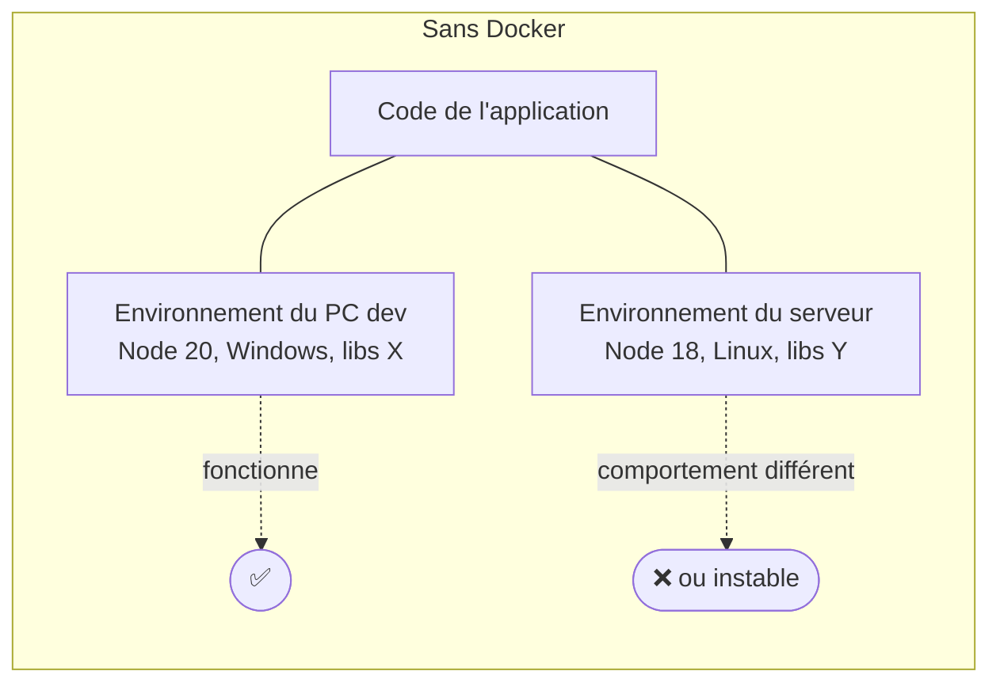
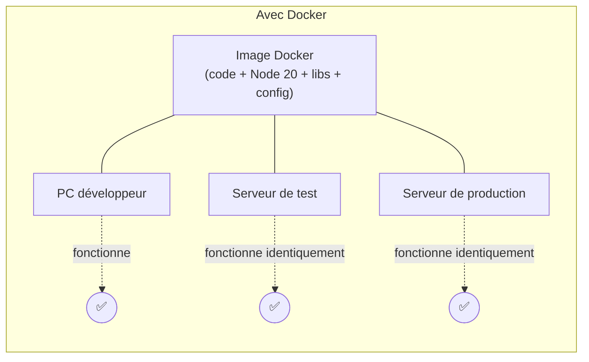
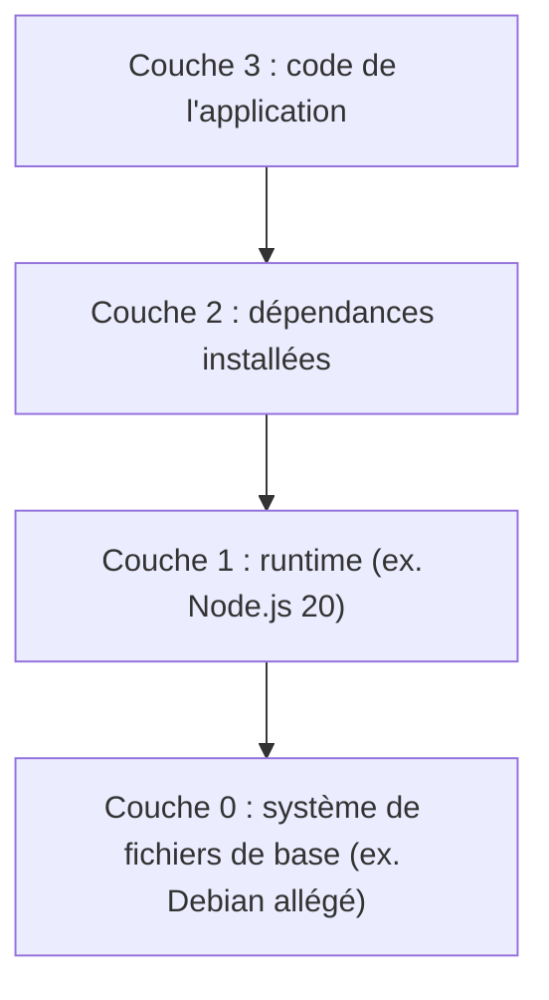
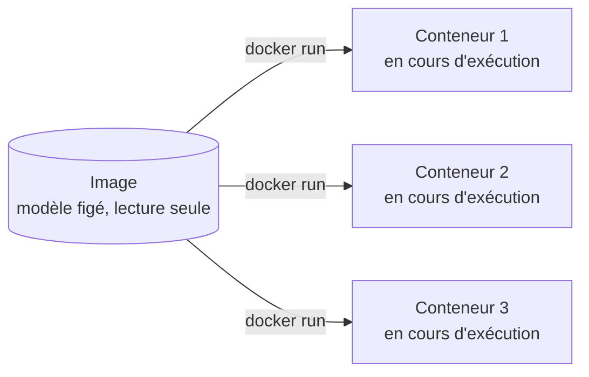
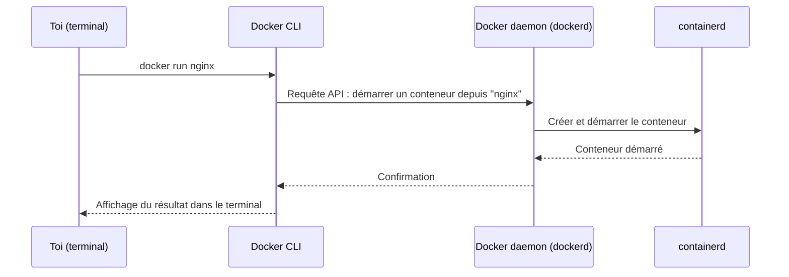
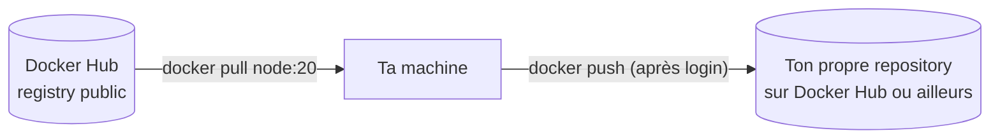
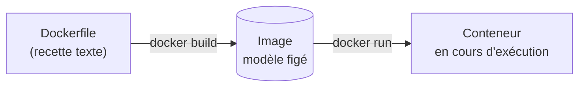
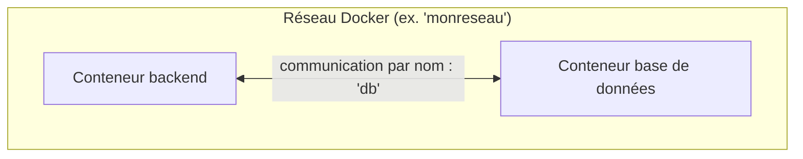

# Chapitre 1 — Comprendre les conteneurs : le vocabulaire et les concepts

**Niveau : Débutant absolu**

---

## Introduction

Avant d'installer Docker, avant de taper la moindre commande, il faut comprendre **quel problème Docker résout réellement** et **quel vocabulaire** il introduit. Ce chapitre ne contient aucune commande — c'est volontaire. Taper des commandes sans savoir ce qu'elles manipulent (une image ? un conteneur ? un volume ?) mène à du copier-coller aveugle, pas à une vraie compétence.

Chaque terme défini ici — application, image, conteneur, Docker Engine, Docker CLI, Docker Hub, registry, Dockerfile, volume, réseau — reviendra, sans nouvelle définition, dans chacun des 47 chapitres suivants. C'est le chapitre le plus court à lire de tout le manuel, mais celui qui rend tout le reste compréhensible plutôt que mémorisé par cœur.

---

## 🎯 Objectifs pédagogiques

À la fin de ce chapitre, tu sauras :
- expliquer avec tes propres mots le problème concret que Docker résout ("ça marche chez moi, pas chez le client") ;
- distinguer une application de son environnement d'exécution (dépendances, version du runtime, variables de configuration) ;
- définir précisément ce qu'est une image Docker et ce qu'est un conteneur, et expliquer la relation entre les deux ;
- décrire l'architecture du Docker Engine (CLI, daemon, containerd) sans encore avoir installé quoi que ce soit ;
- expliquer ce qu'est Docker Hub et à quoi sert un registry en général ;
- expliquer le rôle du Dockerfile comme recette de construction d'une image ;
- expliquer pourquoi un conteneur perd ses données à sa suppression, et quel rôle joue un volume ;
- expliquer, en une phrase, pourquoi des conteneurs isolés ont malgré tout besoin d'un réseau Docker pour communiquer entre eux.

## 📋 Prérequis

Aucune connaissance de Docker, des conteneurs, de Linux ou de l'administration système n'est supposée. Il faut seulement savoir utiliser un ordinateur normalement et avoir déjà écrit du code dans au moins un langage de programmation (peu importe lequel — JavaScript, Python, Java...). Aucune installation n'est nécessaire pour ce chapitre : les laboratoires se font sans Docker installé.

## Pourquoi ce chapitre est important

Un débutant pressé de "juste dockeriser son application" saute souvent directement aux commandes (`docker run`, `docker build`...) sans comprendre ce qu'elles manipulent réellement. Résultat : la moindre erreur ("Cannot connect to the Docker daemon", "port already allocated", "no such image") devient un mur incompréhensible, parce que le vocabulaire de base n'a jamais été posé.

Ce manuel entier repose sur une poignée de concepts — image, conteneur, Dockerfile, volume, réseau — combinés de plus en plus de façons complexes au fil des chapitres. **Ce chapitre construit ces briques une bonne fois pour toutes.** Le chapitre 48 (Dépannage, 50 scénarios réels) suppose que ce vocabulaire est acquis sans avoir besoin d'être redéfini.

---

## Concepts fondamentaux

Ce chapitre couvre huit notions, dans un ordre pensé pour que chacune s'appuie sur la précédente :

1. **Le problème** — pourquoi une application qui tourne sur ta machine peut échouer ailleurs.
2. **Application vs environnement d'exécution** — ce qu'une application emporte avec elle, ou pas.
3. **Image** — un modèle figé, prêt à l'emploi.
4. **Conteneur** — une instance en cours d'exécution de ce modèle.
5. **Docker Engine et Docker CLI** — le logiciel qui rend tout ça possible.
6. **Docker Hub et registry** — où les images vivent et se partagent.
7. **Dockerfile** — la recette qui construit une image.
8. **Volume et réseau** — comment un conteneur (isolé par nature) persiste des données et parle à d'autres conteneurs.

---

## Explications détaillées

### 1.1 Le problème que Docker résout

Imagine la situation suivante, extrêmement courante dans le développement d'applications réelles : tu développes une API Node.js sur ton PC. Elle fonctionne parfaitement. Tu l'envoies à un collègue, ou tu la déploies sur un serveur — et elle **plante**, ou se comporte différemment.

Les causes possibles sont nombreuses et souvent invisibles à l'œil nu :
- une version de Node.js différente entre ton PC et le serveur ;
- une dépendance système absente sur le serveur (une bibliothèque native, par exemple) ;
- une variable d'environnement présente sur ton PC mais oubliée ailleurs ;
- un système d'exploitation différent (Windows en développement, Linux en production) ;
- une version de base de données légèrement différente qui accepte une requête chez toi et la rejette ailleurs.

Ce phénomène a un nom informel bien connu dans le métier : **"ça marche chez moi"** (*works on my machine*). Le code n'est jamais le seul ingrédient d'une application qui fonctionne — il faut aussi, autour de lui, exactement le bon environnement.


**Explication du schéma :** le même code, confronté à deux environnements différents, ne donne aucune garantie de comportement identique. Rien dans le code lui-même ne décrit ni ne transporte l'environnement dont il a besoin — c'est précisément le vide que Docker vient combler.

> 💡 **Analogie** — Une recette de cuisine qui précise les ingrédients et les étapes, mais jamais le four utilisé. Chez toi, un four à convection à 180°C cuit un gâteau en 25 minutes. Chez quelqu'un d'autre, avec un four différent, mal calibré, ou à une altitude différente, le même geste peut donner un résultat raté — alors que la recette (le code) n'a pas changé d'une virgule.

**Ce que Docker propose comme solution** : au lieu de transporter seulement le code et d'espérer que l'environnement d'arrivée soit compatible, Docker permet d'empaqueter **le code ET tout son environnement d'exécution** (runtime, dépendances, configuration) dans une seule unité transportable, qui se comporte **à l'identique** partout où elle s'exécute — ton PC, le PC d'un collègue, un serveur de test, un serveur de production.


**Explication du schéma :** la même image contient tout ce dont l'application a besoin pour tourner. Elle ne s'adapte pas à l'environnement qui l'exécute — elle **emporte** son propre environnement avec elle, partout où elle va.

> 📌 **À retenir** — Docker ne rend pas ton code meilleur. Il élimine une catégorie entière de bugs qui n'ont *rien à voir* avec ton code : ceux causés par une différence d'environnement entre deux machines.

### 1.2 Application, dépendances et environnement d'exécution

Pour comprendre ce qu'une image Docker doit contenir, il faut d'abord identifier précisément ce qui compose "faire tourner une application" :

| Composant | Exemple | Change-t-il facilement d'une machine à l'autre ? |
|---|---|---|
| Le code source | `server.js`, `app.py` | Non — c'est ce que tu maîtrises et versionnes (Git) |
| Le runtime | Node.js 20, Python 3.12, la JVM | **Oui**, souvent silencieusement (mise à jour système, autre projet sur la même machine) |
| Les dépendances | packages npm, packages pip, librairies système | **Oui**, une version installée localement peut différer de celle attendue |
| La configuration | port d'écoute, URL de base de données, clés | **Oui**, change intentionnellement selon l'environnement (dev/test/prod) |
| Le système d'exploitation | Windows, macOS, une distribution Linux | **Oui**, souvent radicalement différent entre poste de développeur et serveur |

> ⚠️ **Attention** — Un piège classique de débutant : croire que "l'application" se limite au code source. En réalité, une application ne peut tourner qu'accompagnée d'un runtime compatible et de ses dépendances exactes — deux éléments qui, sans Docker, dépendent entièrement de ce qui se trouve *déjà installé* sur la machine qui l'exécute, et donc potentiellement absents ou incompatibles.

**Ce qui se passe réellement en arrière-plan sans Docker** : quand tu lances `node server.js`, ton système d'exploitation cherche un programme nommé `node` dans son `PATH`, l'exécute, et ce programme (le runtime Node.js installé sur *cette* machine précise, dans *cette* version précise) interprète ton code. Rien ne garantit qu'une version identique de `node` existe sur une autre machine.

### 1.3 Qu'est-ce qu'une image Docker ?

Une **image Docker** est un **modèle figé, en lecture seule**, contenant tout ce qui est nécessaire pour exécuter une application : un système de fichiers minimal (souvent basé sur une distribution Linux allégée), le runtime nécessaire (Node.js, Python, Java...), les dépendances installées, le code de l'application, et des instructions sur comment la démarrer.

> 💡 **Analogie** — Une image Docker, c'est un **modèle de meuble en kit prêt à l'emploi**, comme un plan IKEA accompagné de toutes les pièces déjà découpées et emballées. Le modèle lui-même ne "vit" nulle part tant que personne ne l'assemble — mais dès qu'on l'assemble (voir 1.4), on obtient un meuble réel, identique à chaque fois qu'on répète l'opération avec le même modèle.

Une image est :
- **immuable** : une fois construite, son contenu ne change jamais. Modifier une application signifie construire une *nouvelle* image, jamais modifier l'ancienne en place.
- **composée de couches (layers)** : chaque étape de sa construction (installer un runtime, copier le code, installer les dépendances...) ajoute une couche par-dessus les précédentes. Ce détail, anodin ici, deviendra très concret au chapitre 5 (les images) et au chapitre 6 (le Dockerfile) — il explique pourquoi Docker peut réutiliser intelligemment des couches déjà construites plutôt que tout refaire à chaque fois.
- **identifiée par un nom et un tag** : par exemple `node:20`, où `node` est le nom de l'image et `20` le tag qui précise sa version. Le chapitre 5 explique en détail pourquoi il faut se méfier du tag `latest`.


**Explication du schéma :** une image s'empile de bas en haut, chaque couche reposant sur celles construites avant elle. On ne "voit" jamais cet empilement en utilisant Docker au quotidien — l'image se comporte comme un tout unique — mais comprendre qu'il existe explique pourquoi reconstruire une image après avoir juste changé une ligne de code est généralement rapide (Docker ne refait que les couches affectées, pas tout depuis le début).

### 1.4 Qu'est-ce qu'un conteneur ?

Un **conteneur** est **une instance en cours d'exécution d'une image**. Si l'image est le modèle figé, le conteneur est ce modèle mis en fonctionnement, avec un processus réellement actif, une mémoire allouée, et — nuance capitale — **une fine couche inscriptible** ajoutée par-dessus l'image en lecture seule, qui permet au conteneur d'écrire des fichiers temporaires pendant son exécution.

> 💡 **Analogie** — Reprenons le meuble en kit de la section précédente. L'**image**, c'est le modèle IKEA en kit. Le **conteneur**, c'est le meuble une fois assemblé et posé dans une pièce, en cours d'utilisation. On peut assembler **plusieurs meubles identiques** à partir du même modèle en kit — de la même façon, on peut lancer **plusieurs conteneurs** à partir d'une même image, chacun indépendant des autres.


**Explication du schéma :** une seule image peut donner naissance à autant de conteneurs indépendants que nécessaire, chacun démarré séparément (`docker run`, vu en détail au chapitre 4), chacun avec son propre cycle de vie — démarrer, s'arrêter, être supprimé — sans affecter les autres ni l'image d'origine.

**Ce qui distingue un conteneur d'un simple programme lancé normalement** : le conteneur tourne **isolé** du reste du système hôte, grâce à des mécanismes du noyau Linux (namespaces et cgroups, dont le détail technique dépasse le périmètre de ce manuel). Concrètement, cette isolation signifie qu'un conteneur voit son propre système de fichiers, ses propres processus, et — sauf configuration explicite (chapitres 8 et 11) — n'a ni accès direct au réseau de l'hôte, ni visibilité sur les fichiers de l'hôte, ni conscience des autres conteneurs qui tournent à côté de lui.

> 📌 **À retenir** — **Image = recette figée. Conteneur = plat en train d'être servi.** On peut préparer le même plat (conteneur) autant de fois qu'on veut à partir de la même recette (image), et rater ou réussir un service n'affecte jamais la recette elle-même.

> ⚠️ **Attention** — La couche inscriptible d'un conteneur est **éphémère** : tout ce qu'un conteneur écrit pendant son exécution disparaît définitivement lorsqu'il est supprimé (`docker rm`), sauf précaution particulière. C'est le problème que les **volumes** viendront résoudre (section 1.8) — et c'est l'une des toutes premières surprises désagréables d'un débutant qui perd les données de sa base de données de test en supprimant un conteneur sans y avoir pensé.

### 1.5 Docker Engine et Docker CLI

**Docker**, en tant que logiciel installé sur une machine, n'est pas un bloc monolithique unique — il se compose de plusieurs pièces qui collaborent :

- **Docker CLI** (`docker`, la commande que tu tapes dans un terminal) : l'interface en ligne de commande. Elle ne fait pas le travail elle-même — elle envoie des instructions au daemon.
- **Docker daemon** (`dockerd`) : le processus qui tourne en arrière-plan et fait le vrai travail — construire des images, démarrer et arrêter des conteneurs, gérer les volumes et les réseaux.
- **containerd** : un composant sous-jacent, utilisé par le daemon, qui gère effectivement le cycle de vie bas niveau des conteneurs.


**Explication ligne par ligne :** taper une commande `docker` ne fait jamais le travail directement dans ton terminal. La commande CLI transmet une requête au daemon (via une API, exactement comme un client web parle à un serveur), et c'est le daemon — pas le terminal — qui orchestre réellement la création du conteneur via containerd. C'est cette architecture qui explique un message d'erreur très fréquent chez les débutants, "*Cannot connect to the Docker daemon*" (détaillé au chapitre 48) : il signifie précisément que le CLI n'arrive pas à joindre le daemon, généralement parce que Docker Desktop n'est pas démarré.

> 💡 **Analogie** — Le Docker CLI, c'est le combiné téléphonique que tu utilises pour appeler un restaurant et passer commande. Le Docker daemon, c'est la cuisine qui reçoit l'appel et prépare réellement le plat. Décrocher un téléphone débranché (le daemon non démarré) ne donnera jamais de plat, quelle que soit la qualité de ta commande.

### 1.6 Docker Hub et les registries

Une image ne se construit pas forcément de zéro à chaque fois. La plupart des projets partent d'une image déjà existante (par exemple une image officielle Node.js ou PostgreSQL) et l'enrichissent. Ces images existantes doivent être stockées quelque part, accessibles publiquement ou en privé : c'est le rôle d'un **registry**.

**Docker Hub** est le registry public par défaut de Docker — une bibliothèque en ligne où des millions d'images sont publiées, dont des **images officielles** maintenues par les éditeurs eux-mêmes ou par Docker (`node`, `postgres`, `mysql`, `redis`, `nginx`...).

> 💡 **Analogie** — Un registry, c'est une bibliothèque publique de modèles de meubles en kit (reprenant l'analogie de 1.3). Docker Hub est la plus grande bibliothèque de ce genre, avec des rayons "officiels" tenus à jour par les fabricants eux-mêmes. Rien n'empêche une entreprise de construire sa propre bibliothèque privée (chapitre 27, registry privé) pour des modèles qu'elle ne veut pas rendre publics.


**Explication du schéma :** `pull` télécharge une image existante d'un registry vers ta machine ; `push` fait l'inverse, envoie une image que tu as construite vers un registry pour la rendre disponible ailleurs (un serveur de production, un collègue, une CI/CD). Ces deux commandes, encore abstraites ici, deviennent concrètes au chapitre 5 et sont approfondies au chapitre 27.

> 📌 **À retenir** — Repository, image et tag : un **repository** est un espace nommé qui regroupe des versions d'une même image (par exemple `node`) ; un **tag** distingue une version précise à l'intérieur de ce repository (`node:20`, `node:18-alpine`). Cette distinction reviendra très souvent à partir du chapitre 5.

### 1.7 Le Dockerfile

Une image ne s'invente pas dans le vide — elle est **construite** à partir d'instructions écrites dans un fichier texte nommé `Dockerfile` (sans extension). C'est la **recette** qui décrit, étape par étape, comment assembler l'image : quel système de base utiliser, quels fichiers copier, quelles commandes exécuter pour installer les dépendances, comment démarrer l'application.

> 💡 **Analogie** — Si l'image est le modèle en kit assemblé et le conteneur le meuble en fonctionnement, le **Dockerfile est le plan de montage** : le document texte qui décrit précisément, dans l'ordre, comment fabriquer le modèle en kit à partir de rien.

Un Dockerfile ressemble, en très simplifié, à ceci (chaque instruction est expliquée en détail au chapitre 6 — inutile de la mémoriser ici) :

```dockerfile
FROM node:20
WORKDIR /app
COPY . .
RUN npm install
CMD ["node", "server.js"]
```

**Ce que ces cinq lignes signifient, en une phrase chacune** (juste pour l'intuition, le détail complet arrive au chapitre 6) :
- `FROM node:20` — part d'une image officielle Node.js version 20 comme base.
- `WORKDIR /app` — définit `/app` comme dossier de travail à l'intérieur de l'image.
- `COPY . .` — copie le code du projet dans ce dossier.
- `RUN npm install` — exécute une commande pendant la construction, pour installer les dépendances.
- `CMD ["node", "server.js"]` — définit ce qui doit s'exécuter quand un conteneur démarre à partir de cette image.

> ⚠️ **Attention** — Un Dockerfile ne s'exécute jamais directement. Il sert d'entrée à une commande de construction (`docker build`, vue au chapitre 6 et 7) qui produit une image. Cette image, une fois construite, peut ensuite être démarrée en conteneur (`docker run`) autant de fois que nécessaire, sans repasser par le Dockerfile.


**Explication du schéma :** c'est le cycle complet que ce manuel va exercer, chapitre après chapitre, jusqu'à devenir un réflexe : écrire un Dockerfile une fois, le transformer en image par une construction (une opération ponctuelle, refaite seulement quand le code ou les dépendances changent), puis démarrer autant de conteneurs que nécessaire à partir de cette image (une opération répétée, rapide, à chaque exécution).

### 1.8 Volume et réseau : ce que l'isolation des conteneurs implique

L'isolation d'un conteneur (section 1.4) est une qualité recherchée — elle garantit qu'un conteneur ne peut pas accidentellement perturber le système hôte ou un autre conteneur. Mais cette même isolation soulève immédiatement deux questions pratiques, résolues par deux mécanismes distincts.

**Première question : que deviennent les données si le conteneur est supprimé ?**

Comme vu en 1.4, la couche inscriptible d'un conteneur disparaît avec lui. Pour une base de données, ce serait catastrophique — perdre toutes les données à chaque redémarrage du conteneur. Un **volume** est un espace de stockage géré par Docker, qui existe **indépendamment du cycle de vie d'un conteneur précis** : un conteneur peut être supprimé et recréé, tant qu'il se reconnecte au même volume, les données survivent.

> 💡 **Analogie** — Le conteneur, c'est une chambre d'hôtel : à chaque nouveau client (nouveau conteneur), la chambre est remise à zéro. Le volume, c'est un coffre-fort à l'extérieur de la chambre, dans lequel le client range ce qui doit survivre à son départ — accessible par le prochain occupant s'il possède la même clé.

Ce mécanisme est développé en détail, avec un vrai laboratoire pratique, au chapitre 10.

**Deuxième question : comment deux conteneurs isolés se parlent-ils entre eux ?**

Une application réelle est rarement un seul conteneur — un backend a besoin de parler à une base de données, qui tourne elle-même dans un autre conteneur. Par défaut, l'isolation empêcherait cette communication. Docker résout ce problème via un **réseau Docker** : un espace de communication virtuel auquel plusieurs conteneurs peuvent être rattachés, et à l'intérieur duquel ils peuvent se joindre les uns les autres par leur nom, comme s'ils étaient sur un petit réseau local dédié.

> 💡 **Analogie** — Plusieurs bureaux isolés (les conteneurs) dans un même immeuble, reliés par un interphone interne (le réseau Docker) : chaque bureau peut appeler un autre bureau simplement en composant son nom, sans passer par l'extérieur de l'immeuble.


**Explication du schéma :** à l'intérieur d'un même réseau Docker, deux conteneurs se joignent directement en utilisant le **nom** attribué à l'autre conteneur (ici `db`), sans jamais avoir besoin de connaître une adresse IP précise — Docker gère cette résolution de noms automatiquement. C'est le sujet complet du chapitre 11, avec un laboratoire pratique à trois conteneurs.

> 📌 **À retenir** — Volume et réseau existent tous les deux **parce que** les conteneurs sont isolés par défaut. Ce ne sont pas des fonctionnalités "en plus" décoratives : ce sont les réponses directes aux deux limites concrètes que cette isolation impose dès qu'une application a plus d'un composant ou plus d'une exécution dans le temps.

---

## Analogies clés de ce chapitre

| Notion | Analogie |
|---|---|
| Le problème sans Docker | Une recette de cuisine sans préciser le four utilisé |
| Image | Un modèle de meuble en kit, prêt à l'emploi |
| Conteneur | Le meuble une fois assemblé et en usage |
| Docker CLI | Le combiné téléphonique pour passer commande |
| Docker daemon | La cuisine qui reçoit la commande et prépare réellement |
| Docker Hub / registry | Une bibliothèque publique de modèles de meubles en kit |
| Dockerfile | Le plan de montage qui décrit comment fabriquer le modèle |
| Volume | Le coffre-fort extérieur à la chambre d'hôtel qui se vide à chaque client |
| Réseau Docker | L'interphone interne entre bureaux isolés d'un même immeuble |

---

## Étude de cas

**Contexte.** Imagine que tu développes, comme freelance, une API pour un client. Sur ton PC, tout fonctionne : tu as Node.js 20 installé, PostgreSQL 16 configuré depuis des mois, et une variable d'environnement `DATABASE_URL` que tu as définie il y a longtemps et oubliée depuis. Tu livres le code par Git à un second développeur qui rejoint le projet. Chez lui : Node.js 18 (installé pour un autre projet), pas de PostgreSQL local, et bien sûr aucune trace de la variable d'environnement que tu n'as jamais pensé à documenter puisqu'elle "allait de soi" sur ta machine.

**Sans ce chapitre**, la phrase du collègue — *"ça ne démarre même pas chez moi, il manque un module et il y a une erreur de connexion"* — semble être un problème de code à corriger.

**Avec ce chapitre**, tu identifies immédiatement qu'il ne s'agit **pas forcément** d'un bug dans le code : c'est très probablement un problème d'**environnement d'exécution** (1.2, une version de Node différente ou une dépendance système absente) combiné à une **configuration jamais transmise** (1.2, la variable d'environnement). Deux catégories de problèmes que Docker, une fois maîtrisé au fil de ce manuel, élimine structurellement : une **image** (1.3) capturerait le bon Node.js et les bonnes dépendances une fois pour toutes, et un fichier `.env.example` versionné (détaillé au chapitre 9) documenterait explicitement la configuration attendue, plutôt que de la laisser implicite dans la tête d'une seule personne.

---

## Bonnes pratiques (récapitulatif du chapitre)

- Ne jamais confondre "le code fonctionne" avec "l'application fonctionne" — un environnement d'exécution complet (runtime, dépendances, configuration) est toujours nécessaire en plus du code.
- Retenir la distinction image (modèle figé) / conteneur (instance en cours d'exécution) avant d'aborder la moindre commande — elle explique la quasi-totalité du vocabulaire Docker.
- Ne jamais compter sur la couche inscriptible d'un conteneur pour des données importantes — elle disparaît avec lui.
- Préférer, dès que possible, les images **officielles** de Docker Hub comme point de départ plutôt que de tout reconstruire depuis une base minimale.

## Erreurs fréquentes (récapitulatif du chapitre)

| Erreur de compréhension | Pourquoi elle arrive | Conséquence plus tard dans le manuel |
|---|---|---|
| Croire qu'une image et un conteneur sont la même chose | Le vocabulaire est souvent utilisé de façon relâchée même par des utilisateurs expérimentés | Confusion permanente en lisant la documentation ou en diagnostiquant une panne (chapitre 48) |
| Croire que modifier un conteneur modifie l'image d'origine | L'intuition "je modifie ce qui tourne" semble naturelle | Perte de modifications à chaque suppression du conteneur, incompréhension du chapitre 6 |
| Croire que les données d'un conteneur survivent toujours | Aucune raison a priori de s'attendre à une perte de données | Perte réelle de données de test ou de développement (résolu au chapitre 10) |
| Penser que `docker` (le CLI) fait le travail lui-même | L'expérience utilisateur donne cette impression | Incompréhension du message "Cannot connect to the Docker daemon" (chapitre 3 et 48) |

---

## Laboratoire pratique n°1 — Repérer les dépendances cachées d'une application que tu connais

**Objectifs :** transformer la section 1.2 (application vs environnement d'exécution) en observation concrète sur un projet réel.
**Prérequis :** aucun.
**Matériel nécessaire :** un de tes projets existants (peu importe le langage), ou à défaut un projet open source que tu connais.

**Étapes :**
1. Choisis un projet que tu as déjà développé ou que tu connais bien.
2. Liste tout ce qui doit être présent sur une machine, **en dehors du code source lui-même**, pour que ce projet fonctionne : runtime et sa version précise, gestionnaire de paquets, dépendances déclarées (fichier `package.json`, `requirements.txt`, `pom.xml`...), variables d'environnement nécessaires, éventuellement une base de données et sa version.
3. Pour chaque élément listé, demande-toi honnêtement : *"Si je donne uniquement le code source à quelqu'un d'autre, sait-il exactement quoi installer, dans quelle version, avec quelle configuration ?"*

**Résultat attendu :** une liste d'au moins cinq éléments d'environnement, dont probablement au moins un que tu n'avais jamais explicitement noté nulle part avant cet exercice.

**Vérifications :** tu dois être capable d'expliquer, pour au moins un élément de ta liste, ce qui se passerait concrètement si sa version différait entre ta machine et celle de quelqu'un d'autre.

**Erreurs fréquentes :** s'arrêter aux dépendances listées dans un fichier de gestion de paquets (`package.json`...) sans penser aux dépendances **système** implicites (une version précise du runtime, une bibliothèque native, un outil en ligne de commande supposé déjà installé).

**Solutions :** si la liste semble trop courte, relis la section 1.2 et vérifie en particulier la ligne "système d'exploitation" du tableau — c'est souvent l'élément le plus oublié.

---

## Laboratoire pratique n°2 — Explorer Docker Hub sans installer Docker

**Objectifs :** rendre concrets les concepts d'image, de repository, de tag et de registry (sections 1.3, 1.6) avant même d'avoir Docker installé.
**Prérequis :** Laboratoire 1 complété.
**Matériel nécessaire :** un navigateur web.

**Étapes :**
1. Ouvre [hub.docker.com](https://hub.docker.com) dans ton navigateur.
2. Recherche `postgres` dans la barre de recherche.
3. Ouvre la page du repository officiel `postgres` (repère le badge "Docker Official Image").
4. Consulte l'onglet des tags disponibles (`Tags`) : observe qu'il en existe plusieurs (par exemple `16`, `16-alpine`, `latest`).
5. Recommence la recherche avec `node`, puis avec un langage ou une base de données que tu utilises régulièrement.

**Résultat attendu :** tu as identifié, pour au moins deux images officielles différentes, au moins trois tags distincts proposés pour chacune.

**Vérifications :** tu dois pouvoir expliquer, avec tes propres mots, la différence entre le repository `postgres` dans son ensemble et un tag précis comme `postgres:16`.

**Erreurs fréquentes :** confondre le nombre de téléchargements ("Pulls") affiché sur la page avec une mesure de qualité du code de ton propre projet — ce chiffre mesure seulement la popularité de l'image elle-même, pas autre chose.

**Solutions :** si aucun badge "Docker Official Image" n'apparaît sur la page trouvée, la recherche a probablement affiché une image communautaire plutôt qu'officielle — reformuler la recherche avec le nom exact du logiciel.

---

## Laboratoire pratique n°3 — Cartographier le cycle Dockerfile → image → conteneur sur papier

**Objectifs :** mémoriser durablement le schéma central de ce chapitre (section 1.7) en le reproduisant soi-même, appliqué à un cas personnel.
**Prérequis :** Laboratoires 1 et 2 complétés.
**Matériel nécessaire :** une feuille de papier ou un éditeur de texte.

**Étapes :**
1. Reprends le projet identifié au Laboratoire 1.
2. Dessine trois cases reliées par des flèches : Dockerfile → (flèche "construction") → Image → (flèche "démarrage") → Conteneur.
3. Sous la case "Dockerfile", note en une phrase ce qu'elle contiendrait probablement pour ton projet (quelle image de base, quelle commande d'installation des dépendances).
4. Sous la case "Conteneur", note combien d'instances de ce conteneur pourraient tourner simultanément à partir de la même image, et pourquoi ce nombre n'est pas limité à un.

**Résultat attendu :** un schéma personnel à trois cases correctement légendé, avec les deux flèches correctement nommées (construction / démarrage).

**Vérifications :** relis ton schéma et vérifie que la flèche "construction" ne part jamais de l'image vers le Dockerfile — le sens est toujours Dockerfile → Image, jamais l'inverse.

**Erreurs fréquentes :** dessiner une flèche directe du Dockerfile vers le Conteneur, en sautant l'étape Image — un conteneur démarre toujours à partir d'une image, jamais directement d'un Dockerfile.

**Solutions :** si le sens des flèches reste flou, relire la section 1.7 en particulier le dernier schéma, qui est la référence exacte à reproduire.

---

## Exercices

1. Explique avec tes propres mots, sans relire le chapitre, la différence entre une image et un conteneur.
2. Un collègue te dit : *"J'ai supprimé le conteneur de ma base de données de test pour libérer de la place, et maintenant toutes mes données de test ont disparu."* Explique-lui, en utilisant le bon vocabulaire, pourquoi c'est arrivé et ce qu'il aurait fallu faire différemment (sans encore donner la solution technique précise, vue au chapitre 10).
3. Pourquoi un Dockerfile ne s'exécute-t-il jamais directement, contrairement à un script bash classique ?
4. Un ami affirme : *"Docker Hub, c'est juste un site pour télécharger des logiciels, comme n'importe quel autre."* Qu'est-ce que cette phrase ne capture pas correctement, à la lumière de la section 1.6 ?
5. Explique pourquoi deux conteneurs, par défaut, ne peuvent pas se parler sans être rattachés à un même réseau Docker.

---

## Quiz

**Question 1.** Une image Docker est :
a) Un conteneur qui a été arrêté
b) Un modèle figé et en lecture seule, à partir duquel des conteneurs peuvent être créés
c) Un fichier de configuration réseau
d) Une capture d'écran d'un conteneur en fonctionnement

**Question 2.** La couche inscriptible d'un conteneur :
a) Est partagée entre tous les conteneurs issus de la même image
b) Modifie directement l'image d'origine
c) Disparaît définitivement à la suppression du conteneur, sauf usage d'un volume
d) N'existe pas, un conteneur ne peut jamais rien écrire

**Question 3.** Le Docker daemon (`dockerd`) :
a) Est la commande que tu tapes directement dans ton terminal
b) Est le processus en arrière-plan qui exécute réellement les opérations demandées via le CLI
c) N'existe que sur Docker Hub, jamais sur ta machine
d) Sert uniquement à construire des images, jamais à démarrer des conteneurs

**Question 4.** Un Dockerfile sert à :
a) Démarrer un conteneur existant
b) Décrire, étape par étape, comment construire une image
c) Stocker les données persistantes d'une application
d) Connecter deux conteneurs entre eux sur le réseau

**Question 5.** Pourquoi deux conteneurs isolés ont-ils besoin d'un réseau Docker pour communiquer ?
a) Parce que Docker facture les communications non planifiées
b) Parce que l'isolation par défaut des conteneurs empêche toute communication tant qu'ils ne sont pas explicitement rattachés à un même réseau
c) Parce que les conteneurs ne peuvent jamais communiquer, quelle que soit la configuration
d) Parce que seul un conteneur "administrateur" peut initier une communication

> 🔑 **Corrigé** — 1: b · 2: c · 3: b · 4: b · 5: b

---

## 📝 Résumé du chapitre

- Docker résout le problème "ça marche chez moi" en empaquetant le code **et** son environnement d'exécution complet dans une unité transportable et reproductible.
- Une **image** est un modèle figé, en lecture seule, composé de couches ; un **conteneur** est une instance en cours d'exécution de cette image, avec une couche inscriptible éphémère.
- Une même image peut donner naissance à plusieurs conteneurs indépendants.
- Le **Docker CLI** transmet des instructions au **Docker daemon**, qui fait le travail réel via containerd — le CLI lui-même n'exécute rien directement.
- **Docker Hub** est le registry public par défaut ; un **repository** regroupe des versions d'une image, distinguées par des **tags**.
- Le **Dockerfile** est la recette texte qui décrit la construction d'une image ; le cycle complet est Dockerfile → (construction) → Image → (démarrage) → Conteneur.
- L'isolation des conteneurs impose deux besoins résolus par deux mécanismes dédiés : le **volume** (persistance des données au-delà du cycle de vie d'un conteneur) et le **réseau Docker** (communication entre conteneurs isolés).

## ✅ Checklist avant de passer au chapitre 2

- [ ] Je peux expliquer avec mes propres mots le problème que Docker résout.
- [ ] Je sais expliquer la différence entre une image et un conteneur sans relire le chapitre.
- [ ] Je sais dessiner de mémoire le cycle Dockerfile → Image → Conteneur.
- [ ] Je comprends pourquoi les données d'un conteneur supprimé peuvent disparaître.
- [ ] Je comprends pourquoi deux conteneurs ont besoin d'un réseau Docker pour se parler.
- [ ] J'ai réalisé les trois laboratoires de ce chapitre et complété les exercices.
- [ ] J'ai obtenu au moins 4/5 au quiz — sinon, relire la section correspondant à la question manquée avant de continuer.

---

## Glossaire du chapitre

**Image**
Définition simple : un modèle figé, prêt à l'emploi, contenant tout ce qu'il faut pour exécuter une application.
Définition technique : un ensemble de couches en lecture seule, empilées, décrivant un système de fichiers et des métadonnées d'exécution (commande de démarrage, variables par défaut...).
Exemple concret : `node:20`, `postgres:16`.
Voir : Chapitre 1, section 1.3 ; Chapitre 5.

**Conteneur**
Définition simple : une instance en cours d'exécution d'une image.
Définition technique : un processus isolé (namespaces, cgroups) démarré à partir d'une image, avec une couche inscriptible éphémère ajoutée par-dessus les couches en lecture seule de l'image.
Exemple concret : le conteneur `mon-api` démarré à partir de l'image construite pour ton projet.
Voir : Chapitre 1, section 1.4 ; Chapitre 4.

**Docker Engine**
Définition simple : le logiciel Docker installé sur une machine, qui rend possible la construction et l'exécution de conteneurs.
Définition technique : l'ensemble formé par le Docker CLI, le Docker daemon (`dockerd`) et containerd.
Exemple concret : ce que le Chapitre 3 installe sur ta machine.
Voir : Chapitre 1, section 1.5 ; Chapitre 3.

**Docker CLI**
Définition simple : la commande `docker` que tu tapes dans un terminal.
Définition technique : l'interface en ligne de commande qui traduit tes commandes en requêtes envoyées à l'API du Docker daemon.
Exemple concret : `docker ps`, `docker run`.
Voir : Chapitre 1, section 1.5.

**Docker daemon (dockerd)**
Définition simple : le programme en arrière-plan qui exécute réellement le travail demandé.
Définition technique : le processus serveur qui reçoit les requêtes du CLI via une API et orchestre la construction d'images et le cycle de vie des conteneurs via containerd.
Exemple concret : le message d'erreur "Cannot connect to the Docker daemon" quand ce processus n'est pas démarré.
Voir : Chapitre 1, section 1.5 ; Chapitre 48.

**Docker Hub**
Définition simple : la bibliothèque publique en ligne d'images Docker.
Définition technique : le registry public par défaut de Docker, hébergeant des images officielles et communautaires, interrogé par les commandes `pull`/`push`.
Exemple concret : [hub.docker.com/_/postgres](https://hub.docker.com/_/postgres).
Voir : Chapitre 1, section 1.6 ; Chapitre 27.

**Registry**
Définition simple : un endroit où des images Docker sont stockées et rendues disponibles.
Définition technique : un service exposant une API standardisée de stockage et de distribution d'images, public (Docker Hub) ou privé (registry auto-hébergé).
Exemple concret : Docker Hub, ou un registry privé installé au Chapitre 27.
Voir : Chapitre 1, section 1.6 ; Chapitre 27.

**Repository**
Définition simple : l'espace nommé qui regroupe toutes les versions d'une même image.
Définition technique : un ensemble d'images liées, partageant un même nom, distinguées entre elles par leur tag.
Exemple concret : le repository `node`, qui contient les tags `20`, `18-alpine`, `latest`, etc.
Voir : Chapitre 1, section 1.6.

**Tag**
Définition simple : l'étiquette qui précise une version précise d'une image dans un repository.
Définition technique : une chaîne de caractères associée à une image précise au sein d'un repository, utilisée pour distinguer les versions (`node:20` vs `node:18-alpine`).
Exemple concret : `16` dans `postgres:16`.
Voir : Chapitre 1, section 1.6 ; Chapitre 5.

**Dockerfile**
Définition simple : le fichier texte qui décrit comment construire une image, étape par étape.
Définition technique : un fichier contenant une séquence d'instructions (`FROM`, `COPY`, `RUN`, `CMD`...) interprétées par `docker build` pour produire une image.
Exemple concret : le fichier `Dockerfile` à la racine d'un projet.
Voir : Chapitre 1, section 1.7 ; Chapitre 6.

**Volume**
Définition simple : un espace de stockage qui survit à la suppression d'un conteneur.
Définition technique : un mécanisme de persistance géré par Docker, indépendant du cycle de vie d'un conteneur précis, monté dans un ou plusieurs conteneurs.
Exemple concret : le volume qui conserve les données d'un conteneur PostgreSQL entre deux redémarrages.
Voir : Chapitre 1, section 1.8 ; Chapitre 10.

**Réseau Docker**
Définition simple : l'espace de communication virtuel qui permet à plusieurs conteneurs de se joindre entre eux par leur nom.
Définition technique : une couche réseau virtuelle (bridge par défaut) créée et gérée par Docker, offrant résolution de noms et isolation vis-à-vis de l'extérieur.
Exemple concret : un backend et une base de données rattachés au même réseau, communiquant via le nom du service.
Voir : Chapitre 1, section 1.8 ; Chapitre 11.

---

## ❓ FAQ

**Pourquoi ce chapitre n'a-t-il aucune commande à taper ?**
Parce que taper `docker run` ou `docker build` sans savoir ce qu'est une image, un conteneur ou un daemon mène à du copier-coller aveugle, pas à une vraie compétence. Le chapitre 3 installe Docker et le chapitre 4 prend le relais avec les mains sur le clavier, en s'appuyant directement sur le vocabulaire construit ici.

**Docker remplace-t-il complètement une machine virtuelle ?**
Pas toujours, et pas dans tous les cas d'usage — le chapitre 2 y consacre une comparaison complète. Pour l'instant, retiens seulement qu'un conteneur est plus léger et démarre plus vite qu'une VM, parce qu'il partage le noyau du système hôte au lieu d'embarquer un système d'exploitation invité complet.

**Faut-il apprendre Kubernetes en même temps que Docker ?**
Non. Kubernetes orchestre de nombreux conteneurs à grande échelle, sur plusieurs machines — un besoin qui n'apparaît que pour des applications avec un trafic et une équipe conséquents. Ce manuel se concentre sur Docker seul et Docker Compose (Partie III), largement suffisants pour la grande majorité des projets réels, y compris en production.

**Une image téléchargée depuis Docker Hub est-elle automatiquement sûre à utiliser ?**
Non, pas automatiquement — le badge "Docker Official Image" (Laboratoire 2) est un bon indicateur de confiance, mais la sécurité des images est un sujet à part entière, traité en détail au Chapitre 26.

---

## Références officielles

- Documentation officielle Docker — [docs.docker.com](https://docs.docker.com)
- Docker Hub — [hub.docker.com](https://hub.docker.com)
- Docker Overview (architecture du Docker Engine) — [docs.docker.com/get-started/overview](https://docs.docker.com/get-started/overview/)
- Open Container Initiative (standard sur lequel s'appuient les images et runtimes de conteneurs) — [opencontainers.org](https://opencontainers.org)

---

## Conclusion

Ce chapitre n'a fait tourner aucun conteneur — et c'est pourtant le chapitre dont dépend la compréhension de tous les suivants. Image, conteneur, Docker Engine, Docker Hub, Dockerfile, volume, réseau : ce vocabulaire de huit notions reviendra sans nouvelle définition dans chacun des 47 chapitres restants. Le chapitre 2 termine la mise en contexte en comparant précisément les conteneurs aux machines virtuelles et à Kubernetes, avant que le chapitre 3 ne mette enfin Docker entre tes mains.

---

⬅️ [Plan éditorial](../PLAN-EDITORIAL.md) · ➡️ **Suite : Chapitre 2 — Conteneur vs machine virtuelle vs Kubernetes**
