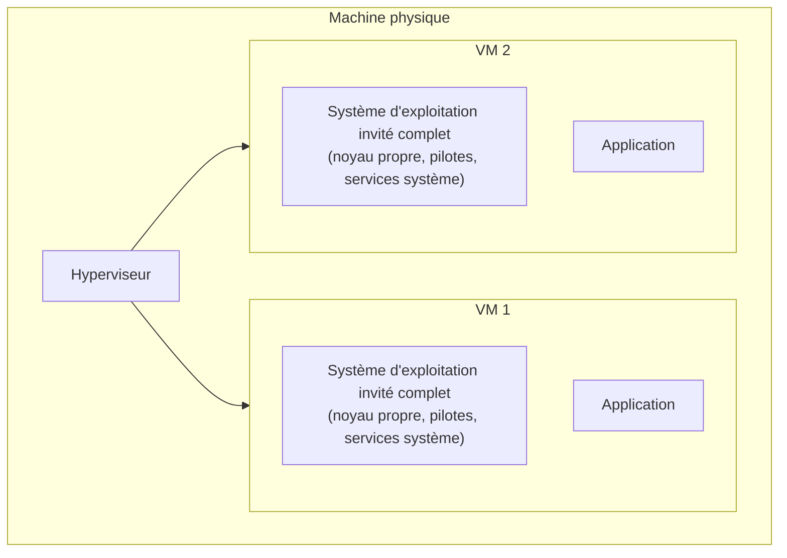
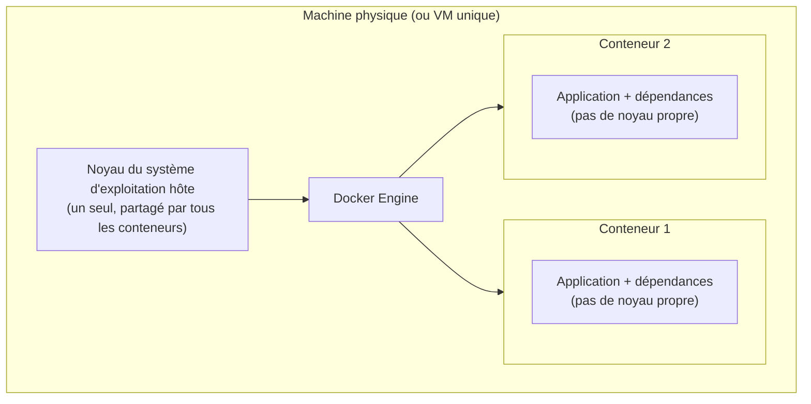
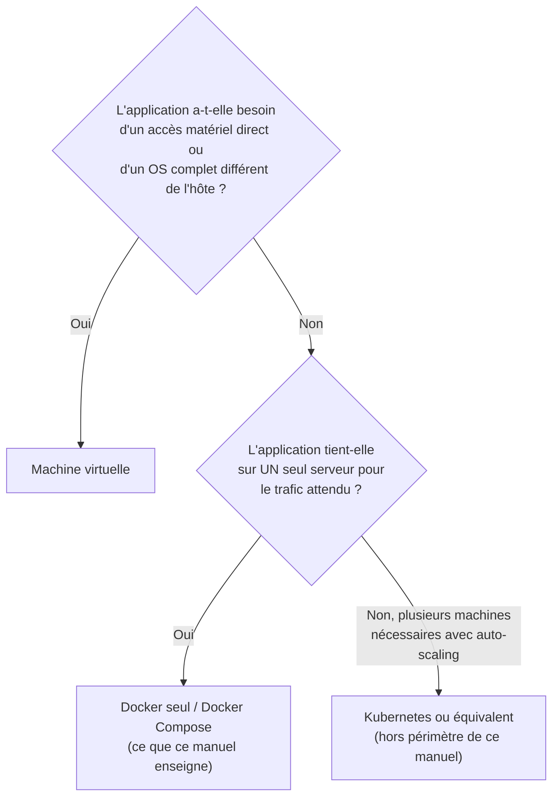

# Chapitre 2 — Conteneur vs machine virtuelle vs Kubernetes

**Niveau : Débutant absolu**

---

## Introduction

Le chapitre 1 a défini ce qu'est un conteneur, en le comparant en passant à une machine virtuelle. Ce chapitre reprend cette comparaison et la pousse jusqu'au bout : **pourquoi un conteneur est-il plus léger et plus rapide qu'une VM**, **dans quels cas une VM reste malgré tout le bon choix**, et **qu'est-ce que Kubernetes**, ce mot que tout développeur croise tôt ou tard sans toujours savoir ce qu'il recouvre exactement.

Ce chapitre reste, comme le précédent, entièrement conceptuel — aucune commande n'y est tapée. Il pose la dernière pièce de contexte nécessaire avant l'installation réelle de Docker au chapitre 3.

---

## 🎯 Objectifs pédagogiques

À la fin de ce chapitre, tu sauras :
- expliquer la différence structurelle entre une machine virtuelle et un conteneur, au niveau du système d'exploitation ;
- justifier pourquoi un conteneur démarre en une fraction de seconde là où une VM prend plusieurs dizaines de secondes ;
- expliquer pourquoi plus de conteneurs que de VM peuvent cohabiter sur une même machine physique, à ressources égales ;
- citer au moins deux situations où une machine virtuelle reste préférable à un conteneur ;
- définir Kubernetes en une phrase et expliquer pourquoi ce manuel ne le couvre pas ;
- choisir, face à une situation donnée, entre Docker seul, une VM, ou une orchestration à plus grande échelle.

## 📋 Prérequis

Chapitre 1 (vocabulaire : image, conteneur, isolation).

## Pourquoi ce chapitre est important

Un débutant expose vite une confusion typique : penser qu'un conteneur "est" une petite machine virtuelle, ou à l'inverse ignorer complètement pourquoi tout le monde ne migre pas vers Kubernetes puisque "c'est ce qu'utilisent les grandes entreprises". Ce chapitre évite les deux excès : comprendre *techniquement* pourquoi un conteneur est différent d'une VM (pas juste "plus petit"), et comprendre que Kubernetes répond à un problème d'échelle que la quasi-totalité des projets, y compris en production, n'atteint jamais.

---

## Concepts fondamentaux

1. **Anatomie d'une VM** — un ordinateur simulé en entier, avec son propre système d'exploitation.
2. **Anatomie d'un conteneur** — un processus isolé, qui partage le noyau du système hôte.
3. **Conséquences pratiques** — légèreté, vitesse de démarrage, densité.
4. **Les limites réelles des conteneurs** — les cas où une VM reste le bon choix.
5. **Kubernetes** — ce que c'est, et pourquoi ce n'est pas le sujet de ce manuel.
6. **Grille de décision** — quoi choisir, face à un projet donné.

---

## Explications détaillées

### 2.1 Anatomie d'une machine virtuelle

Une **machine virtuelle (VM)** simule un ordinateur complet à l'intérieur d'un autre ordinateur. Un logiciel appelé **hyperviseur** (VMware, Hyper-V, VirtualBox, KVM...) alloue à chaque VM une part de CPU, de RAM et de disque, et y installe un **système d'exploitation invité complet et indépendant** — avec son propre noyau, ses propres pilotes, ses propres processus système, totalement distinct du système d'exploitation de la machine physique (l'**hôte**) qui l'héberge.

**Explication du schéma :** chaque VM embarque son propre système d'exploitation complet, du noyau jusqu'aux services système, indépendamment de ce qui tourne sur la machine physique ou dans les autres VM. C'est cette indépendance totale qui garantit une isolation très forte — mais qui a un coût, développé en 2.3.

> 💡 **Analogie** — Une VM, c'est une maison individuelle entièrement autonome construite à l'intérieur d'un immense hangar : elle a ses propres fondations, ses propres murs porteurs, sa propre installation électrique, indépendante des autres maisons du hangar. Robuste et totalement indépendante, mais longue à construire et gourmande en matériaux.

### 2.2 Anatomie d'un conteneur (rappel et approfondissement)

Un **conteneur**, à l'inverse, ne simule aucun système d'exploitation. Il **partage le noyau (kernel) du système hôte** et n'embarque, dans son image, que ce qui est strictement nécessaire à l'application : ses dépendances, ses bibliothèques, éventuellement quelques utilitaires — jamais un noyau ni des pilotes matériels.

**Explication du schéma :** contrairement au schéma des VM, il n'existe ici **qu'un seul noyau**, celui de la machine hôte, partagé par tous les conteneurs. Chaque conteneur reste isolé des autres (namespaces, cgroups — mentionnés au chapitre 1), mais cette isolation se fait **au-dessus** d'un noyau commun, pas en dupliquant un système d'exploitation entier par conteneur.

> 💡 **Analogie** — Reprenons le hangar. Un conteneur, ce sont des appartements dans un immeuble déjà construit : les fondations, la structure et les réseaux électriques/eau (le noyau) sont **déjà là, partagés**, et chaque appartement (conteneur) ne construit que ses propres cloisons intérieures et son propre mobilier (l'application et ses dépendances). Beaucoup plus rapide à aménager qu'une maison individuelle entière — mais impossible si les appartements ont besoin de fondations radicalement incompatibles entre elles (2.4).

> ⚠️ **Attention** — Cette dépendance au noyau de l'hôte explique une contrainte réelle : une image Docker construite pour Linux ne peut pas, en principe, tourner nativement sur un noyau Windows, et inversement. Sur Windows et macOS, Docker Desktop contourne cette limite en faisant tourner une **petite VM Linux en arrière-plan**, invisible en usage courant, dans laquelle les conteneurs Linux s'exécutent réellement. Ce détail devient concret dès le chapitre 3 (installation) et n'a aucune conséquence pratique pour ce manuel — mais il explique pourquoi Docker Desktop sur Windows a besoin de WSL 2.

### 2.3 Conséquences pratiques : légèreté, vitesse, densité

Cette différence structurelle (dupliquer un système d'exploitation entier vs partager un seul noyau) a trois conséquences mesurables et très concrètes :

| Critère | Machine virtuelle | Conteneur |
|---|---|---|
| Ce qu'elle embarque | Un système d'exploitation invité complet | Seulement l'application et ses dépendances |
| Taille typique | Plusieurs gigaoctets | Souvent quelques dizaines à quelques centaines de mégaoctets |
| Temps de démarrage | Dizaines de secondes à quelques minutes (démarrage d'un OS complet) | Une fraction de seconde à quelques secondes (démarrage d'un simple processus) |
| Isolation | Très forte (noyau totalement séparé) | Forte, mais s'appuie sur un noyau partagé |
| Densité (combien sur une même machine) | Quelques dizaines, limitées par la RAM que chaque OS invité consomme rien que pour exister | Souvent des centaines, chaque conteneur ne consommant que ce que son application utilise réellement |
| Portabilité entre systèmes hôtes | Dépend de l'hyperviseur et du format de disque virtuel | Dépend de l'architecture CPU et du type de noyau (Linux/Windows), pas de l'hyperviseur |

> 📌 **À retenir** — Un conteneur n'est pas "une VM en plus petit" par accident de conception : il est structurellement plus léger parce qu'il **ne duplique jamais** ce que le noyau de l'hôte fournit déjà. C'est la cause racine de tous les chiffres du tableau ci-dessus, pas une simple optimisation marketing.

**Impact concret pour ce manuel** : c'est précisément cette légèreté qui permet, dès le chapitre 13 (premier projet Compose), de faire tourner simultanément un frontend, un backend et une base de données sur un simple PC de développement, sans effort notable — un scénario qui aurait exigé trois VM complètes, largement plus lourd à faire tourner sur une machine de développement standard.

### 2.4 Ce qu'un conteneur ne fait pas mieux qu'une VM

Il serait trompeur de présenter les conteneurs comme supérieurs aux VM en toutes circonstances. Trois limites réelles :

**Isolation plus forte requise.** Parce qu'ils partagent le noyau de l'hôte, des conteneurs offrent une isolation légèrement moins étanche qu'une VM sur le papier — une faille très grave dans le noyau partagé pourrait, en théorie, affecter tous les conteneurs qui tournent dessus. C'est pourquoi certains environnements très sensibles (hébergement multi-clients non fiables, par exemple) préfèrent des VM, ou des VM légères spécialisées (comme Firecracker, utilisé par AWS Lambda — hors périmètre de ce manuel).

**Systèmes d'exploitation incompatibles.** Un conteneur Linux a besoin d'un noyau Linux pour tourner. Si un projet a réellement besoin de faire cohabiter, sur une même machine physique, un système Windows complet et un système Linux complet (pas seulement une application Windows conteneurisée), une VM reste la seule option — les conteneurs ne "traversent" jamais la frontière entre familles de noyaux.

**Applications avec interface graphique lourde ou matériel spécifique.** Un conteneur convient parfaitement à un serveur web, une API, une base de données — des programmes qui tournent "en ligne de commande", sans écran. Une application qui a besoin d'un accès direct et complet au matériel graphique (un poste de travail virtuel complet, par exemple) reste un cas d'usage plus naturel pour une VM.

> ⚠️ **Attention** — Ces limites ne concernent presque jamais les applications web (frontend, backend, base de données) qui sont le sujet de ce manuel. Elles sont mentionnées ici pour éviter de présenter Docker comme une solution universelle — ce serait aussi trompeur que l'inverse.

### 2.5 Kubernetes, en une définition

**Kubernetes** (souvent abrégé **K8s**) est un logiciel d'**orchestration de conteneurs à grande échelle** : il gère automatiquement le déploiement, la mise à l'échelle, la répartition de charge et la résilience de très nombreux conteneurs répartis sur **plusieurs machines physiques**.

> 💡 **Analogie** — Si Docker Compose (Partie III de ce manuel) est un petit restaurant familial où le chef connaît et gère personnellement chaque poste de cuisine, Kubernetes est la direction des opérations d'une chaîne de restaurants à travers tout un pays : elle décide automatiquement combien de cuisines ouvrir selon l'affluence, redirige les commandes vers un autre restaurant si l'un ferme brutalement, et remplace un poste de cuisine défaillant sans jamais interrompre le service perçu par le client.

Ce que Kubernetes ajoute par rapport à Docker seul ou Docker Compose :
- répartir des conteneurs sur **plusieurs machines physiques** (un cluster), pas une seule ;
- remplacer automatiquement un conteneur qui plante, sur une autre machine si nécessaire ;
- augmenter ou réduire automatiquement le nombre de conteneurs selon la charge réelle (auto-scaling) ;
- répartir le trafic entrant entre de nombreuses instances (load balancing intégré).

> ⚠️ **Attention** — Kubernetes est **volontairement hors périmètre de ce manuel**, comme annoncé au chapitre 1. Il est mentionné brièvement en Manuel Administration Système (chapitres dédiés à l'orchestration à grande échelle) pour qui voudrait aller plus loin après ce manuel. La très grande majorité des applications — y compris en production, y compris avec plusieurs milliers d'utilisateurs actifs — tournent très bien sur un seul serveur avec Docker Compose (ce que ce manuel enseigne en profondeur), sans jamais avoir besoin de la complexité opérationnelle d'un cluster Kubernetes.

> 📌 **À retenir** — Le signal qui justifie réellement Kubernetes n'est presque jamais "combien d'utilisateurs ai-je", mais "ai-je besoin de répartir ma charge sur plusieurs machines physiques, avec une équipe capable d'opérer cette complexité au quotidien". Sans ce besoin précis, Kubernetes ajoute une charge opérationnelle sans bénéfice proportionnel.

### 2.6 Grille de décision : quoi choisir ?

**Explication du schéma :** la première question élimine les cas structurellement incompatibles avec un conteneur (matériel spécifique, noyau incompatible). Pour tout le reste — l'écrasante majorité des applications web — la vraie question n'est pas "Docker ou Kubernetes" mais "un seul serveur suffit-il". Ce manuel répond entièrement au cas "oui", qui couvre la quasi-totalité des projets réels d'un développeur freelance ou d'une petite équipe.

| Situation | Solution recommandée |
|---|---|
| Application web classique (frontend, backend, base de données), trafic raisonnable, un seul serveur | Docker + Docker Compose (ce manuel, Parties I à XI) |
| Besoin d'isoler complètement deux systèmes d'exploitation différents sur une même machine physique | Machine virtuelle |
| Poste de travail virtuel avec interface graphique complète, accès matériel direct | Machine virtuelle |
| Trafic nécessitant plusieurs serveurs physiques avec bascule automatique et mise à l'échelle | Kubernetes (hors périmètre) |
| Apprentissage, prototypage rapide, développement local | Docker seul (Parties I-II de ce manuel) |

---

## Analogies clés de ce chapitre

| Notion | Analogie |
|---|---|
| Machine virtuelle | Une maison individuelle autonome dans un hangar |
| Conteneur | Un appartement dans un immeuble déjà construit (fondations et réseaux partagés) |
| Docker Compose | Un restaurant familial géré directement par le chef |
| Kubernetes | La direction des opérations d'une chaîne de restaurants à l'échelle d'un pays |

---

## Étude de cas

**Contexte.** Un client freelance te demande : *"On me parle de Kubernetes partout, ma prochaine application doit-elle être construite dessus dès le départ ?"* Le projet en question : une application de gestion pour une PME, quelques dizaines d'utilisateurs simultanés attendus la première année.

**Sans ce chapitre**, la pression du mot à la mode pourrait pousser à répondre "oui" par précaution, en ajoutant une complexité opérationnelle disproportionnée dès le premier jour.

**Avec ce chapitre**, la grille de décision (2.6) donne une réponse claire : à quelques dizaines d'utilisateurs simultanés, un seul serveur avec Docker Compose suffit très largement, avec une charge opérationnelle bien plus raisonnable pour une petite structure. Kubernetes ne deviendrait une vraie question que si le trafic dépassait un jour ce qu'un seul serveur bien dimensionné peut absorber — un problème "de riche" qu'il vaut mieux résoudre le jour où il se pose réellement, avec les moyens (équipe, budget) qui accompagnent généralement cette échelle.

---

## Bonnes pratiques (récapitulatif du chapitre)

- Ne jamais choisir Kubernetes "par anticipation" sans un besoin réel de répartition multi-machines.
- Réserver la VM aux cas où un conteneur ne convient structurellement pas (OS incompatible, accès matériel direct).
- Pour un projet web classique, partir de Docker + Docker Compose sur un seul serveur, et ne complexifier que lorsque le besoin est mesuré, pas anticipé.

## Erreurs fréquentes (récapitulatif du chapitre)

| Erreur | Pourquoi elle arrive | Conséquence |
|---|---|---|
| Croire qu'un conteneur est "une petite VM" | Ressemblance de surface (les deux isolent une application) | Incompréhension de pourquoi les images Linux/Windows ne sont pas interchangeables |
| Vouloir Kubernetes dès le lancement d'un petit projet | Effet de mode, peur de "mal faire" | Complexité opérationnelle disproportionnée, sans équipe pour l'opérer |
| Croire Docker totalement universel | Enthousiasme après le chapitre 1 | Mauvais choix pour un cas nécessitant réellement une VM (2.4) |

---

## Laboratoire pratique n°1 — Rechercher des temps de démarrage réels documentés

**Objectifs :** ancrer la section 2.3 (légèreté, vitesse) dans des chiffres réels plutôt que dans une impression.
**Prérequis :** aucun.
**Matériel nécessaire :** un navigateur.

**Étapes :**
1. Recherche la documentation officielle ou un article de référence comparant temps de démarrage d'une VM classique et d'un conteneur Docker.
2. Note l'ordre de grandeur trouvé pour chacun (VM : dizaines de secondes à quelques minutes ; conteneur : millisecondes à quelques secondes).
3. Réfléchis à l'impact de cette différence sur un scénario concret : redémarrer 10 fois une application pendant une session de débogage.

**Résultat attendu :** deux ordres de grandeur notés, avec la source consultée.

**Vérifications :** tu dois pouvoir expliquer pourquoi cette différence de vitesse vient du fait qu'un conteneur ne démarre "que" son application, jamais un système d'exploitation complet (2.2).

---

## Laboratoire pratique n°2 — Appliquer la grille de décision à tes propres projets

**Objectifs :** transférer la section 2.6 à des cas personnels réels.
**Prérequis :** Laboratoire 1 complété.
**Matériel nécessaire :** la liste de tes projets actuels (ou une sélection).

**Étapes :**
1. Choisis trois projets (les tiens, ou des projets connus).
2. Pour chacun, applique la grille de décision de la section 2.6 et détermine la solution recommandée.
3. Justifie chaque réponse en une phrase.

**Résultat attendu :** trois projets classés, chacun avec une justification cohérente avec le schéma de décision.

**Vérifications :** vérifie qu'aucun de tes trois projets n'a atterri sur "Kubernetes" sans une vraie justification de trafic multi-serveurs — si c'est le cas, relis la section 2.5.

---

## Laboratoire pratique n°3 — Reproduire le schéma en coupe VM vs conteneurs

**Objectifs :** mémoriser durablement la différence structurelle du chapitre en la redessinant.
**Prérequis :** Laboratoires 1 et 2 complétés.
**Matériel nécessaire :** une feuille de papier ou un éditeur de texte.

**Étapes :**
1. Dessine une machine physique contenant deux VM, chacune avec son propre système d'exploitation complet.
2. À côté, dessine une seconde machine physique avec un seul noyau partagé et deux conteneurs.
3. Légende chaque schéma en identifiant ce qui est dupliqué (VM) vs partagé (conteneurs).

**Résultat attendu :** deux schémas comparables aux sections 2.1 et 2.2, correctement légendés.

**Vérifications :** relis tes légendes — le mot "noyau" (ou "kernel") ne doit apparaître qu'une seule fois, partagé, dans le schéma des conteneurs, et une fois par VM dans le schéma des machines virtuelles.

---

## Exercices

1. Explique pourquoi une image Docker construite pour Linux ne tourne pas nativement sur un noyau Windows.
2. Cite deux situations concrètes où une VM reste préférable à un conteneur.
3. Un ami te dit "Docker, c'est juste des VM plus rapides". Corrige cette affirmation avec le bon vocabulaire.
4. Pourquoi la question "combien d'utilisateurs" est-elle un mauvais indicateur, à elle seule, pour décider d'adopter Kubernetes ?
5. Explique en une phrase la différence entre ce que gère Docker Compose et ce que gère Kubernetes.

---

## Quiz

**Question 1.** La principale raison pour laquelle un conteneur démarre plus vite qu'une VM est :
a) Les conteneurs utilisent un processeur plus rapide
b) Un conteneur ne démarre jamais un système d'exploitation complet, contrairement à une VM
c) Les VM sont toujours mal configurées
d) Les conteneurs n'ont pas de système de fichiers

**Question 2.** Un hyperviseur est :
a) Un composant qui gère uniquement les conteneurs, jamais les VM
b) Le logiciel qui alloue des ressources et exécute des machines virtuelles sur une machine physique
c) Un synonyme de Docker Engine
d) Un type de réseau Docker

**Question 3.** Kubernetes sert principalement à :
a) Construire des images Docker plus rapidement
b) Remplacer entièrement Docker sur une seule machine
c) Orchestrer de nombreux conteneurs répartis sur plusieurs machines physiques
d) Sécuriser un Dockerfile

**Question 4.** Ce manuel ne couvre pas Kubernetes parce que :
a) Kubernetes est obsolète
b) La grande majorité des projets réels tiennent sur un seul serveur avec Docker Compose, sans besoin de répartition multi-machines
c) Kubernetes ne fonctionne pas avec Docker
d) Kubernetes est réservé aux applications sans base de données

**Question 5.** Une VM reste préférable à un conteneur quand :
a) L'application est un simple serveur web
b) On a besoin d'isoler un système d'exploitation entièrement différent de celui de l'hôte
c) On veut économiser de la RAM
d) On veut démarrer rapidement plusieurs instances identiques

> 🔑 **Corrigé** — 1: b · 2: b · 3: c · 4: b · 5: b

---

## 📝 Résumé du chapitre

- Une VM embarque un système d'exploitation invité complet et indépendant ; un conteneur partage le noyau du système hôte et n'embarque que l'application et ses dépendances.
- Cette différence structurelle rend les conteneurs plus légers, plus rapides à démarrer et plus denses par machine que les VM — sans "astuce" particulière, juste parce qu'ils ne dupliquent jamais ce que le noyau fournit déjà.
- Les conteneurs ne conviennent pas à tous les cas : systèmes d'exploitation incompatibles, besoin d'un accès matériel direct, isolation extrême requise restent le domaine des VM.
- Kubernetes orchestre de nombreux conteneurs sur plusieurs machines physiques ; il répond à un besoin d'échelle que la quasi-totalité des projets, même en production, n'atteint jamais — et reste volontairement hors périmètre de ce manuel.
- La bonne question n'est presque jamais "Docker ou Kubernetes", mais "un seul serveur suffit-il à mon trafic réel".

## ✅ Checklist avant de passer au chapitre 3

- [ ] Je peux expliquer pourquoi un conteneur démarre plus vite qu'une VM.
- [ ] Je peux citer deux cas où une VM reste préférable à un conteneur.
- [ ] Je peux définir Kubernetes en une phrase et expliquer pourquoi ce manuel ne le couvre pas.
- [ ] Je sais dessiner de mémoire la différence entre l'architecture VM et l'architecture conteneur.
- [ ] J'ai réalisé les trois laboratoires et complété les exercices.
- [ ] J'ai obtenu au moins 4/5 au quiz.

---

## Glossaire du chapitre

**Machine virtuelle (VM)**
Définition simple : un ordinateur complet simulé à l'intérieur d'un autre ordinateur.
Définition technique : un environnement isolé disposant d'un système d'exploitation invité complet, exécuté par un hyperviseur sur une machine physique hôte.
Exemple concret : une VM Ubuntu tournant sous VMware sur un PC Windows.
Voir : Chapitre 2, section 2.1.

**Hyperviseur**
Définition simple : le logiciel qui crée et gère des machines virtuelles.
Définition technique : une couche logicielle qui virtualise le matériel physique et isole plusieurs systèmes d'exploitation invités sur une même machine hôte.
Exemple concret : VMware, Hyper-V, VirtualBox, KVM.
Voir : Chapitre 2, section 2.1.

**Noyau (kernel)**
Définition simple : le cœur du système d'exploitation, qui fait le lien entre les programmes et le matériel.
Définition technique : la couche logicielle centrale d'un système d'exploitation, gérant les processus, la mémoire et les pilotes matériels.
Exemple concret : le noyau Linux, partagé par tous les conteneurs Linux d'une même machine hôte.
Voir : Chapitre 2, section 2.2.

**Kubernetes (K8s)**
Définition simple : le logiciel qui gère automatiquement de nombreux conteneurs répartis sur plusieurs machines.
Définition technique : une plateforme d'orchestration de conteneurs offrant déploiement, auto-scaling, load balancing et auto-réparation à travers un cluster de machines.
Exemple concret : hors périmètre de ce manuel, mentionné ici pour contexte uniquement.
Voir : Chapitre 2, section 2.5.

**Cluster**
Définition simple : un groupe de machines qui travaillent ensemble comme un seul système.
Définition technique : un ensemble de machines physiques ou virtuelles coordonnées, gérées collectivement (par exemple par Kubernetes) pour répartir charge et résilience.
Exemple concret : un cluster Kubernetes de plusieurs serveurs.
Voir : Chapitre 2, section 2.5.

---

## ❓ FAQ

**Docker et Kubernetes sont-ils concurrents ?**
Non — ils répondent à des problèmes différents. Docker construit et exécute des conteneurs ; Kubernetes orchestre de nombreux conteneurs (souvent construits avec Docker ou un outil compatible) à travers plusieurs machines. Ce manuel s'arrête volontairement à Docker Compose, l'équivalent "un seul serveur" de ce que Kubernetes fait à grande échelle.

**Docker Desktop utilise-t-il une VM, même sur ma propre machine ?**
Sur Windows et macOS, oui — une petite VM Linux tourne en arrière-plan (via WSL 2 sur Windows) pour permettre l'exécution de conteneurs Linux, invisible en usage quotidien. Sur Linux, Docker tourne nativement sans cette VM intermédiaire, puisque le noyau Linux est déjà celui de l'hôte.

**Si mon projet grossit, devrai-je un jour migrer vers Kubernetes ?**
Peut-être, mais ce n'est ni automatique ni garanti — de nombreuses applications en production, avec un trafic significatif, tournent très bien sur un seul serveur puissant avec Docker Compose (chapitres 29 et 47 de ce manuel). La migration vers Kubernetes ne se justifie que par un besoin réel et mesuré de répartition multi-machines.

---

## Références officielles

- Documentation officielle Docker — Vue d'ensemble de l'architecture — [docs.docker.com/get-started/overview](https://docs.docker.com/get-started/overview/)
- Documentation officielle Kubernetes — Vue d'ensemble — [kubernetes.io/docs/concepts/overview](https://kubernetes.io/docs/concepts/overview/)
- Docker Desktop — WSL 2 backend (Windows) — [docs.docker.com/desktop/wsl](https://docs.docker.com/desktop/wsl/)

---

## Conclusion

Ce chapitre termine la mise en contexte théorique : tu sais maintenant ce qu'est un conteneur, en quoi il diffère structurellement d'une VM, et pourquoi Kubernetes n'a pas sa place dans ce manuel. Le chapitre 3 installe enfin Docker sur ta machine — la théorie s'arrête ici, la pratique commence.

---

⬅️ [Chapitre 1 — Comprendre les conteneurs](01-comprendre-les-conteneurs.md) · ➡️ **Suite : Chapitre 3 — Installer Docker**
