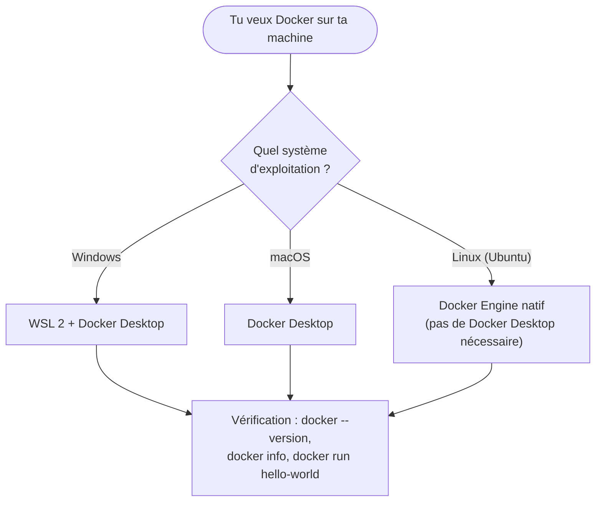

# Chapitre 3 — Installer Docker

**Niveau : Débutant absolu**

---

## Introduction

C'est le premier chapitre où tu tapes une vraie commande. Tout le vocabulaire des chapitres 1 et 2 (image, conteneur, Docker Engine, Docker CLI, Docker daemon) devient concret : à la fin de ce chapitre, Docker tourne réellement sur ta machine, et tu as fait fonctionner ton premier conteneur.

Ce chapitre couvre les trois systèmes d'exploitation les plus courants — **Windows, Ubuntu Linux, macOS**. Suis uniquement la section correspondant à ta machine ; les trois aboutissent au même résultat final (section 3.5), vérifié par les mêmes commandes.

---

## 🎯 Objectifs pédagogiques

À la fin de ce chapitre, tu sauras :
- installer Docker Desktop sur Windows, avec WSL 2 correctement configuré ;
- installer Docker Engine nativement sur Ubuntu, sans passer par Docker Desktop ;
- installer Docker Desktop sur macOS ;
- vérifier qu'une installation Docker fonctionne réellement, avec trois commandes de contrôle ;
- lancer et interpréter le résultat de ton tout premier conteneur (`hello-world`) ;
- diagnostiquer les erreurs d'installation les plus fréquentes sur chaque système.

## 📋 Prérequis

Chapitres 1 et 2 (vocabulaire). Pour Windows : Windows 10 version 2004+ ou Windows 11. Pour Ubuntu : une installation Ubuntu 22.04 LTS ou plus récente (VPS ou machine locale). Pour macOS : macOS 12 ou plus récent, puce Intel ou Apple Silicon.

## Pourquoi ce chapitre est important

Une installation mal faite (WSL 2 non activé, groupe `docker` non configuré, service non démarré) est la source d'une grande partie des erreurs qu'un débutant rencontre dans les tout premiers chapitres pratiques — pas parce que Docker est mal conçu, mais parce que l'installation touche des couches système (virtualisation, permissions, services) rarement manipulées auparavant. Prendre le temps de bien installer et de bien **vérifier** maintenant évite des heures de confusion aux chapitres 4 à 13.

---

## Concepts fondamentaux

1. **Docker Desktop** vs **Docker Engine natif** — deux façons d'obtenir Docker, selon l'OS.
2. **WSL 2** — la couche de compatibilité Linux nécessaire à Docker Desktop sur Windows.
3. **Le repository officiel Docker** — la source fiable pour installer Docker sur Linux.
4. **Le groupe `docker`** — pourquoi il existe, et le risque de sécurité qu'il implique.
5. **Vérification** — trois commandes qui confirment qu'une installation fonctionne réellement.

---

## Où exécuter les commandes de ce chapitre

Chaque commande de ce chapitre est étiquetée selon l'endroit où elle s'exécute :

```text
[Windows PowerShell]   → PowerShell, lancé normalement (pas nécessairement en administrateur, sauf mention contraire)
[Linux Terminal]       → un terminal sur une machine Ubuntu (locale ou VPS via SSH)
[Terminal macOS]       → l'application Terminal (ou iTerm2) sur macOS
```

---

## 3.1 Vue d'ensemble : trois chemins, un seul résultat


**Explication du schéma :** peu importe le chemin suivi, la section 3.5 (vérification) est strictement identique pour les trois systèmes — c'est le vrai test qui compte, pas la méthode d'installation en elle-même.

> 📌 **À retenir** — Sur Windows et macOS, Docker s'installe via **Docker Desktop**, une application graphique qui inclut le Docker Engine (souvent exécuté dans une petite VM Linux en arrière-plan, transparente à l'usage). Sur Linux, Docker s'installe **nativement** — le Docker Engine tourne directement sur le noyau Linux de la machine, sans VM intermédiaire ni application graphique requise.

---

## 3.2 Installer Docker sur Windows

### Prérequis Windows

- Windows 10, version 2004 ou supérieure (build 19041+), ou Windows 11.
- Virtualisation activée dans le BIOS/UEFI de la machine (activée par défaut sur la plupart des PC récents ; à vérifier dans le Gestionnaire des tâches, onglet Performance → CPU → "Virtualisation" doit indiquer "Activée").

### Étape 1 — Installer WSL 2

**WSL (Windows Subsystem for Linux)**, en version 2, fournit un vrai noyau Linux léger à l'intérieur de Windows — c'est cette couche que Docker Desktop utilise pour exécuter réellement les conteneurs Linux.

```powershell
# [Windows PowerShell] — à lancer en tant qu'administrateur (clic droit → "Exécuter en tant qu'administrateur")
wsl --install
```

**Explication de la commande :**
```text
wsl
→ l'outil en ligne de commande de Windows Subsystem for Linux

--install
→ installe WSL, sa version 2 par défaut, et une distribution Linux de base (Ubuntu)
```

**Résultat attendu :** un message confirmant l'installation, puis une invite à redémarrer la machine.

```powershell
# [Windows PowerShell] — après redémarrage, vérifier la version installée
wsl --list --verbose
```

**Résultat attendu :**
```text
  NAME      STATE           VERSION
* Ubuntu    Running         2
```
La colonne `VERSION` doit afficher `2`, pas `1` — WSL 1 ne convient pas à Docker Desktop.

> ❌ **Erreur fréquente** — Si `VERSION` affiche `1`, la conversion en WSL 2 n'a pas eu lieu automatiquement (matériel ancien, virtualisation désactivée dans le BIOS). Corriger avec `wsl --set-version Ubuntu 2`, puis relancer la vérification. Si la commande échoue avec une erreur de virtualisation, il faut d'abord l'activer dans le BIOS de la machine (procédure propre à chaque fabricant, hors du périmètre de ce manuel).

### Étape 2 — Installer Docker Desktop

1. Télécharger Docker Desktop depuis [docker.com/products/docker-desktop](https://www.docker.com/products/docker-desktop/).
2. Lancer l'installeur téléchargé (`Docker Desktop Installer.exe`).
3. Laisser cochée l'option **"Use WSL 2 instead of Hyper-V"** (cochée par défaut sur les systèmes compatibles).
4. Laisser l'installation se dérouler, puis redémarrer si demandé.
5. Lancer Docker Desktop depuis le menu Démarrer. Une icône de baleine 🐳 apparaît dans la barre des tâches une fois Docker Desktop démarré et prêt.

> ⚠️ **Attention** — Docker Desktop doit être **lancé et complètement démarré** (icône baleine stable, pas en cours de chargement) avant de taper la moindre commande `docker` dans PowerShell. Une commande tapée trop tôt renvoie l'erreur "Cannot connect to the Docker daemon" (approfondie au chapitre 48) — la solution est simplement d'attendre que Docker Desktop affiche "Docker Desktop is running".

### Étape 3 — Vérifier l'intégration WSL 2

Dans Docker Desktop : **Settings → Resources → WSL Integration**, vérifier que l'intégration est activée pour la distribution Ubuntu installée à l'étape 1.

---

## 3.3 Installer Docker sur Ubuntu Linux

Sur Linux, Docker s'installe **directement**, sans application graphique intermédiaire — le Docker Engine tourne nativement sur le noyau de la machine.

### Étape 1 — Désinstaller d'anciennes versions

```bash
# [Linux Terminal]
sudo apt remove docker docker-engine docker.io containerd runc
```

**Explication :** certaines distributions proposent des paquets `docker.io` obsolètes dans leurs dépôts par défaut. Cette commande les retire proprement avant d'installer la version officielle à jour — elle ne renvoie pas d'erreur si ces paquets n'étaient pas installés.

### Étape 2 — Ajouter le repository officiel Docker

```bash
# [Linux Terminal]
sudo apt update
sudo apt install ca-certificates curl
sudo install -m 0755 -d /etc/apt/keyrings
sudo curl -fsSL https://download.docker.com/linux/ubuntu/gpg -o /etc/apt/keyrings/docker.asc
sudo chmod a+r /etc/apt/keyrings/docker.asc
```

**Explication ligne par ligne :**
```text
apt update
→ rafraîchit la liste des paquets disponibles

apt install ca-certificates curl
→ installe les outils nécessaires pour télécharger et vérifier le dépôt Docker en toute sécurité

install -m 0755 -d /etc/apt/keyrings
→ crée le dossier qui contiendra la clé de signature de Docker (permissions 0755 : lecture/exécution pour tous, écriture pour le propriétaire uniquement)

curl -fsSL ... -o ...
→ télécharge la clé GPG officielle de Docker et l'enregistre à cet emplacement

chmod a+r ...
→ rend la clé lisible par tous les utilisateurs du système (nécessaire pour qu'apt puisse la lire)
```

```bash
# [Linux Terminal] — enregistrer le repository officiel
echo \
  "deb [arch=$(dpkg --print-architecture) signed-by=/etc/apt/keyrings/docker.asc] https://download.docker.com/linux/ubuntu \
  $(. /etc/os-release && echo "$VERSION_CODENAME") stable" | \
  sudo tee /etc/apt/sources.list.d/docker.list > /dev/null
sudo apt update
```

**Explication :** cette commande construit une ligne de configuration `apt` pointant vers le dépôt officiel Docker, adaptée automatiquement à l'architecture (`dpkg --print-architecture`, par exemple `amd64`) et à la version d'Ubuntu (`$VERSION_CODENAME`, par exemple `jammy` pour 22.04) de la machine — c'est pourquoi cette même commande fonctionne sans modification sur différentes versions d'Ubuntu.

### Étape 3 — Installer Docker Engine

```bash
# [Linux Terminal]
sudo apt install docker-ce docker-ce-cli containerd.io docker-buildx-plugin docker-compose-plugin
```

**Explication de chaque paquet :**
```text
docker-ce
→ Docker Engine lui-même (Community Edition), le daemon (dockerd)

docker-ce-cli
→ le Docker CLI, la commande "docker" que tu tapes

containerd.io
→ le composant bas niveau qui gère réellement le cycle de vie des conteneurs (chapitre 1, section 1.5)

docker-buildx-plugin
→ le moteur de construction d'images moderne, utilisé en arrière-plan par "docker build"

docker-compose-plugin
→ Docker Compose (Partie III de ce manuel), installé ici directement comme sous-commande "docker compose"
```

### Étape 4 — Vérifier que le service tourne

```bash
# [Linux Terminal]
sudo systemctl status docker
```

**Résultat attendu :** une ligne `Active: active (running)`. Si ce n'est pas le cas :

```bash
# [Linux Terminal]
sudo systemctl start docker
sudo systemctl enable docker
```

**Explication :**
```text
systemctl start docker
→ démarre le service Docker immédiatement

systemctl enable docker
→ configure Docker pour démarrer automatiquement à chaque redémarrage de la machine — indispensable sur un serveur, qui doit reprendre le service sans intervention manuelle après un redémarrage
```

### Étape 5 — Utiliser Docker sans `sudo`

Par défaut sur Linux, seul `root` (ou un utilisateur via `sudo`) peut communiquer avec le Docker daemon, car cette communication passe par un fichier spécial (`/var/run/docker.sock`) appartenant à `root`. Taper `sudo` devant chaque commande `docker` est fonctionnel mais lourd — la solution standard est d'ajouter ton utilisateur au groupe `docker` :

```bash
# [Linux Terminal]
sudo usermod -aG docker $USER
newgrp docker
```

**Explication :**
```text
usermod -aG docker $USER
→ ajoute ("-a" pour "append", ne pas écraser les groupes existants) ton utilisateur courant ("$USER") au groupe "docker"

newgrp docker
→ applique immédiatement ce nouveau groupe à la session en cours, sans nécessiter une déconnexion complète
```

> ⚠️ **Attention — implication de sécurité** — Appartenir au groupe `docker` équivaut, en pratique, à avoir un accès `root` complet sur la machine : un conteneur peut être démarré avec des privilèges suffisants pour lire ou modifier n'importe quel fichier du système hôte. Ce n'est **pas** une négligence de configuration à corriger, c'est le fonctionnement normal et documenté de Docker — mais cela signifie qu'ajouter un utilisateur au groupe `docker` doit être traité avec la même prudence que lui donner un accès `sudo` complet. Ce point est repris et approfondi au chapitre 26 (Sécurité Docker).

---

## 3.4 Installer Docker sur macOS

1. Télécharger Docker Desktop depuis [docker.com/products/docker-desktop](https://www.docker.com/products/docker-desktop/) — en choisissant la version correspondant à ta puce (**Apple Silicon** pour les Mac M1/M2/M3/M4, **Intel chip** pour les Mac Intel plus anciens).
2. Ouvrir le fichier `.dmg` téléchargé, puis glisser l'icône Docker dans le dossier Applications.
3. Lancer Docker depuis le dossier Applications ou Spotlight (Cmd+Espace, taper "Docker").
4. Accepter les autorisations système demandées au premier lancement (Docker a besoin d'un accès privilégié pour gérer la mise en réseau et les fichiers des conteneurs).
5. Attendre que l'icône de baleine 🐳 dans la barre de menu indique "Docker Desktop is running".

> 📌 **À retenir** — Sur macOS comme sur Windows, Docker Desktop exécute les conteneurs à l'intérieur d'une petite VM Linux légère, invisible en usage normal (rappel du chapitre 2, section 2.2). Aucune configuration WSL n'est nécessaire sur macOS — Docker Desktop gère cette couche lui-même.

---

## 3.5 Vérifier l'installation (les trois OS)

Ces trois commandes sont **identiques quel que soit le système d'exploitation**, une fois Docker installé et démarré.

```bash
# [Windows PowerShell] / [Linux Terminal] / [Terminal macOS]
docker --version
```

**Explication :**
```text
docker
→ le Docker CLI

--version
→ affiche la version installée, sans contacter le daemon
```

**Résultat attendu :** une ligne du type `Docker version 27.x.x, build xxxxxxx`. Si cette commande échoue ("commande introuvable"), l'installation elle-même a un problème — revenir à la section correspondant à ton OS.

```bash
# [Windows PowerShell] / [Linux Terminal] / [Terminal macOS]
docker info
```

**Explication :** cette commande, contrairement à `--version`, **contacte réellement le Docker daemon** pour obtenir des informations détaillées (nombre de conteneurs, version du serveur, pilote de stockage, etc.). C'est le vrai test que le daemon est démarré et joignable — `--version` seul ne le garantit pas.

**Résultat attendu :** un bloc de texte détaillé, sans message d'erreur en haut. Si la commande échoue avec "Cannot connect to the Docker daemon", voir l'encadré Dépannage ci-dessous.

```bash
# [Windows PowerShell] / [Linux Terminal] / [Terminal macOS]
docker run hello-world
```

**Explication :**
```text
docker run
→ démarre un conteneur (chapitre 4 pour le détail complet de cette commande)

hello-world
→ le nom d'une image officielle Docker, minuscule, conçue uniquement pour ce test de vérification
```

**Résultat attendu**, en substance :
```text
Unable to find image 'hello-world:latest' locally
latest: Pulling from library/hello-world
...
Status: Downloaded newer image for hello-world:latest

Hello from Docker!
This message shows that your installation appears to be working correctly.

To generate this message, Docker took the following steps:
 1. The Docker client contacted the Docker daemon.
 2. The Docker daemon pulled the "hello-world" image from Docker Hub.
 3. The Docker daemon created a new container from that image which runs the
    executable that produces the output you are currently reading.
 4. The Docker daemon streamed that output to the Docker client, which sent it
    to your terminal.
```

**Explication du résultat, ligne par ligne (le texte affiché par Docker lui-même résume déjà parfaitement le cycle appris au chapitre 1) :**
1. Le Docker CLI a contacté le Docker daemon (chapitre 1, section 1.5).
2. Le daemon n'a pas trouvé l'image `hello-world` en local, il l'a donc téléchargée (`pull`) depuis Docker Hub (chapitre 1, section 1.6).
3. Le daemon a créé un **conteneur** à partir de cette **image**, qui a exécuté un tout petit programme.
4. Ce programme a affiché ce texte, renvoyé jusqu'à ton terminal via le CLI.

> 📌 **À retenir** — Si tu relances `docker run hello-world` une seconde fois, la ligne `Unable to find image ... locally` et le téléchargement n'apparaissent plus : l'image est désormais présente localement, seul un nouveau conteneur est créé et démarré à partir d'elle. C'est une démonstration directe et déjà vécue du couple image/conteneur du chapitre 1 : la construction/le téléchargement de l'image est une opération ponctuelle, démarrer un conteneur à partir d'elle est une opération rapide et répétable.

---

## Erreurs fréquentes à l'installation

| Erreur | Cause la plus probable | Solution |
|---|---|---|
| "Cannot connect to the Docker daemon" (toutes plateformes) | Le daemon n'est pas démarré | Windows/macOS : lancer/attendre Docker Desktop. Linux : `sudo systemctl start docker` |
| WSL affiche `VERSION 1` au lieu de `2` (Windows) | Conversion automatique non effectuée | `wsl --set-version Ubuntu 2`, ou activer la virtualisation dans le BIOS si l'erreur persiste |
| "permission denied while trying to connect to the Docker daemon socket" (Linux) | L'utilisateur courant n'est pas dans le groupe `docker`, ou la session n'a pas encore pris en compte l'ajout | `sudo usermod -aG docker $USER` puis `newgrp docker`, ou se déconnecter/reconnecter |
| Docker Desktop reste bloqué sur "Starting..." (Windows/macOS) | Virtualisation désactivée dans le BIOS, ou ressources système insuffisantes | Vérifier la virtualisation (Gestionnaire des tâches sur Windows), redémarrer la machine, réinstaller Docker Desktop en dernier recours |
| `docker: command not found` (Linux) | Installation incomplète ou terminal non rechargé | Revérifier l'étape 3 de la section 3.3 ; ouvrir un nouveau terminal |

> Le chapitre 48 reprend ces scénarios (et bien d'autres) en détail, avec la méthode complète de diagnostic.

---

## 📸 Captures d'écran à réaliser

> 📸 **Capture 1**
> **Logiciel :** Docker Desktop (Windows ou macOS)
> **Pourquoi cette capture est utile :** montre le tableau de bord Docker Desktop une fois démarré avec succès, référence visuelle pour confirmer une installation réussie.
> **Page/écran concerné :** onglet principal de Docker Desktop, juste après `docker run hello-world`
> **Montrer :** l'icône baleine verte "Running", le conteneur `hello-world` listé (arrêté) dans l'onglet Containers.
> **Flouter/masquer :** rien de sensible normalement présent.

> 📸 **Capture 2**
> **Logiciel :** terminal (PowerShell, Linux Terminal ou Terminal macOS)
> **Pourquoi cette capture est utile :** documente le résultat exact de `docker run hello-world` obtenu sur ta propre machine, comme référence personnelle de dépannage futur.
> **Montrer :** la sortie complète de la commande, du téléchargement au message final.

---

## Laboratoire pratique n°1 — Installer Docker sur sa propre machine

**Objectifs :** obtenir une installation Docker fonctionnelle et vérifiée.
**Prérequis :** un ordinateur Windows, macOS ou Linux avec droits administrateur.
**Matériel nécessaire :** une connexion Internet stable (les téléchargements peuvent représenter plusieurs centaines de mégaoctets).

**Étapes :** suivre la section correspondant à ton système d'exploitation (3.2, 3.3 ou 3.4), puis exécuter les trois commandes de vérification de la section 3.5.

**Résultat attendu :** `docker --version` affiche un numéro de version, `docker info` ne renvoie aucune erreur, `docker run hello-world` affiche le message "Hello from Docker!".

**Vérifications :** relancer `docker run hello-world` une seconde fois et confirmer que le téléchargement de l'image n'a pas lieu la seconde fois (section 3.5, encadré "À retenir").

**Erreurs fréquentes :** voir le tableau dédié ci-dessus.

---

## Laboratoire pratique n°2 — Lire en détail la sortie de `docker info`

**Objectifs :** apprendre à lire une sortie de diagnostic Docker, compétence réutilisée à chaque chapitre de dépannage.
**Prérequis :** Laboratoire 1 complété.

**Étapes :**
1. Exécute `docker info`.
2. Repère les lignes indiquant : le nombre de conteneurs (`Containers`), le nombre d'images (`Images`), la version du serveur (`Server Version`), le système d'exploitation sous-jacent (`Operating System`).
3. Note ces quatre valeurs.

**Résultat attendu :** quatre valeurs identifiées et notées, correspondant à ta machine juste après l'installation (`Containers: 1` après le laboratoire 1, `Images: 1`).

**Vérifications :** la valeur `Images` doit être au moins 1 (l'image `hello-world` téléchargée).

---

## Laboratoire pratique n°3 — Simuler un diagnostic de daemon arrêté

**Objectifs :** s'entraîner à reconnaître et corriger l'erreur la plus fréquente de ce chapitre, avant d'en avoir réellement besoin en situation de stress.
**Prérequis :** Laboratoire 1 complété.

**Étapes :**
1. Arrête volontairement Docker (Windows/macOS : quitter Docker Desktop depuis l'icône de la barre des tâches ; Linux : `sudo systemctl stop docker`).
2. Exécute `docker info` et observe le message d'erreur exact.
3. Redémarre Docker (relancer Docker Desktop, ou `sudo systemctl start docker` sur Linux).
4. Réexécute `docker info` et confirme que l'erreur a disparu.

**Résultat attendu :** le message d'erreur "Cannot connect to the Docker daemon..." observé puis résolu par toi-même, sans consulter de solution externe.

**Vérifications :** tu dois pouvoir reconnaître ce message instantanément la prochaine fois qu'il apparaîtra, dans n'importe quel chapitre du manuel.

---

## Exercices

1. Explique la différence entre `docker --version` et `docker info`, et pourquoi l'une peut réussir alors que l'autre échoue.
2. Pourquoi Docker Desktop est-il nécessaire sur Windows et macOS, mais pas sur Linux ?
3. Qu'est-ce que WSL 2 apporte concrètement à Docker Desktop sur Windows ?
4. Pourquoi ajouter son utilisateur au groupe `docker` sur Linux est-il une décision de sécurité, pas seulement une commodité ?
5. Que signifient exactement les quatre étapes affichées par `docker run hello-world` ?

---

## Quiz

**Question 1.** `docker info`, contrairement à `docker --version` :
a) Affiche uniquement un numéro de version
b) Contacte réellement le Docker daemon et échoue si celui-ci n'est pas démarré
c) Nécessite une connexion Internet
d) Ne fonctionne que sur Linux

**Question 2.** Sur Windows, Docker Desktop s'appuie sur :
a) Hyper-V uniquement, sans alternative
b) WSL 2, qui fournit un noyau Linux léger
c) Une machine virtuelle Windows complète
d) Rien, Docker tourne nativement sur Windows

**Question 3.** Ajouter un utilisateur au groupe `docker` sur Linux équivaut à :
a) Lui donner un accès en lecture seule aux conteneurs
b) Lui donner, en pratique, un accès équivalent à `root` sur la machine
c) L'autoriser uniquement à lister les images
d) Aucune conséquence de sécurité particulière

**Question 4.** La commande `sudo systemctl enable docker` sur Linux sert à :
a) Démarrer Docker immédiatement
b) Configurer Docker pour démarrer automatiquement à chaque redémarrage de la machine
c) Mettre à jour Docker Engine
d) Installer Docker Compose

**Question 5.** Relancer `docker run hello-world` une seconde fois :
a) Retélécharge systématiquement l'image
b) Échoue, une image ne peut être utilisée qu'une fois
c) Réutilise l'image déjà présente localement et ne crée qu'un nouveau conteneur
d) Supprime automatiquement le conteneur précédent

> 🔑 **Corrigé** — 1: b · 2: b · 3: b · 4: b · 5: c

---

## 📝 Résumé du chapitre

- Docker s'installe différemment selon l'OS : Docker Desktop (avec WSL 2) sur Windows, Docker Engine natif sur Linux, Docker Desktop sur macOS — mais la vérification finale est identique partout.
- `docker --version` confirme seulement que le CLI est installé ; `docker info` confirme que le daemon est réellement démarré et joignable.
- `docker run hello-world` est le test de bout en bout : il télécharge une image, démarre un conteneur, et affiche un message confirmant que les quatre étapes du cycle Docker (CLI → daemon → conteneur → sortie) fonctionnent.
- Sur Linux, ajouter son utilisateur au groupe `docker` évite `sudo` à chaque commande, mais équivaut à un accès root complet — décision de sécurité, pas juste de confort.
- L'erreur la plus fréquente de ce chapitre, "Cannot connect to the Docker daemon", signifie presque toujours que Docker (Desktop ou le service Linux) n'est simplement pas démarré.

## ✅ Checklist avant de passer au chapitre 4

- [ ] Docker est installé sur ma machine.
- [ ] `docker --version` affiche un numéro de version.
- [ ] `docker info` ne renvoie aucune erreur.
- [ ] `docker run hello-world` a affiché "Hello from Docker!".
- [ ] Je sais expliquer pourquoi le second lancement de `hello-world` ne retélécharge pas l'image.
- [ ] (Linux) Je peux exécuter `docker ps` sans `sudo`.
- [ ] J'ai réalisé les trois laboratoires de ce chapitre.
- [ ] J'ai obtenu au moins 4/5 au quiz.

---

## Glossaire du chapitre

**Docker Desktop**
Définition simple : l'application graphique qui installe et fait tourner Docker sur Windows et macOS.
Définition technique : une application incluant le Docker Engine, généralement exécuté dans une VM Linux légère, avec une interface graphique de gestion.
Exemple concret : l'icône baleine 🐳 dans la barre des tâches/menu.
Voir : Chapitre 3, sections 3.2 et 3.4.

**WSL 2 (Windows Subsystem for Linux, version 2)**
Définition simple : la couche qui permet à Windows de faire tourner un vrai noyau Linux léger.
Définition technique : une machine virtuelle légère intégrée à Windows, exécutant un noyau Linux réel, utilisée par Docker Desktop pour exécuter des conteneurs Linux nativement.
Exemple concret : `wsl --list --verbose` affichant `VERSION 2`.
Voir : Chapitre 3, section 3.2.

**Docker Engine**
Définition simple : le cœur logiciel de Docker (rappel du chapitre 1).
Définition technique : voir Chapitre 1, glossaire.
Voir : Chapitre 3, section 3.3 (installation native sur Linux).

**Groupe `docker`**
Définition simple : le groupe d'utilisateurs Linux autorisé à communiquer avec le Docker daemon sans `sudo`.
Définition technique : un groupe Unix dont l'appartenance donne accès en lecture/écriture à `/var/run/docker.sock`, le socket via lequel le CLI communique avec le daemon.
Exemple concret : `sudo usermod -aG docker $USER`.
Voir : Chapitre 3, section 3.3 ; Chapitre 26.

---

## ❓ FAQ

**Puis-je utiliser Docker Toolbox à la place de Docker Desktop ?**
Non, Docker Toolbox est un ancien outil, obsolète et remplacé par Docker Desktop (Windows/macOS) et Docker Engine natif (Linux) depuis plusieurs années. Ce manuel ne le couvre pas.

**Docker Desktop est-il gratuit ?**
Pour un usage personnel, éducatif, ou dans une petite entreprise, oui, selon les conditions de licence en vigueur au moment de l'installation — à vérifier sur le site officiel, ces conditions ayant déjà évolué par le passé. Docker Engine natif sur Linux reste open source et gratuit sans restriction.

**Je suis sur un VPS Linux, dois-je utiliser Docker Desktop ?**
Non — Docker Desktop est une application de bureau graphique, non pertinente sur un serveur distant. La section 3.3 (Docker Engine natif) est la bonne méthode, identique à ce que le chapitre 29 (déploiement VPS) réutilisera directement.

**Pourquoi certaines commandes Linux commencent-elles par `sudo` et d'autres non, dans ce chapitre ?**
`sudo` est nécessaire pour toute commande système (installer un paquet, gérer le service Docker) mais devient inutile pour les commandes `docker` elles-mêmes une fois l'utilisateur ajouté au groupe `docker` (fin de la section 3.3) — c'est précisément ce que cette étape a corrigé.

---

## Références officielles

- Docker Desktop — Installation Windows — [docs.docker.com/desktop/install/windows-install](https://docs.docker.com/desktop/install/windows-install/)
- Docker Desktop — Installation macOS — [docs.docker.com/desktop/install/mac-install](https://docs.docker.com/desktop/install/mac-install/)
- Docker Engine — Installation Ubuntu — [docs.docker.com/engine/install/ubuntu](https://docs.docker.com/engine/install/ubuntu/)
- Post-installation Linux (gestion du groupe `docker`) — [docs.docker.com/engine/install/linux-postinstall](https://docs.docker.com/engine/install/linux-postinstall/)
- Microsoft — Installer WSL — [learn.microsoft.com/windows/wsl/install](https://learn.microsoft.com/windows/wsl/install)

---

## Conclusion

Docker tourne maintenant réellement sur ta machine, vérifié par trois commandes que tu réutiliseras à chaque fois que quelque chose semblera cassé dans les chapitres suivants. Le chapitre 4 laisse enfin la théorie derrière lui : premiers conteneurs, premier cycle de vie complet, les mains sur le clavier.

---

⬅️ [Chapitre 2 — Conteneur vs machine virtuelle vs Kubernetes](02-conteneur-vs-machine-virtuelle-vs-kubernetes.md) · ➡️ **Suite : Chapitre 4 — Premiers conteneurs : le cycle de vie**
