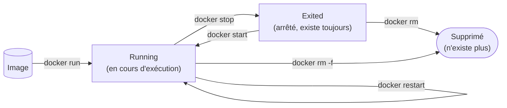

# Chapitre 4 — Premiers conteneurs : le cycle de vie

**Niveau : Débutant**

---

## Introduction

Ce chapitre met enfin les mains sur les commandes qui font vivre un conteneur, de sa création à sa suppression. Chaque commande est expliquée intégralement, puis testée immédiatement — pas de "formule magique" recopiée sans savoir ce qu'elle fait. À la fin de ce chapitre, tu sais créer, observer, arrêter, redémarrer et supprimer un conteneur, en comprenant précisément dans quel état il se trouve à chaque instant.

---

## 🎯 Objectifs pédagogiques

À la fin de ce chapitre, tu sauras :
- créer et démarrer un conteneur avec `docker run`, en mode attaché ou détaché ;
- lister les conteneurs en cours d'exécution, puis tous les conteneurs y compris arrêtés ;
- arrêter, redémarrer et relancer un conteneur existant sans en recréer un nouveau ;
- supprimer un conteneur proprement, et comprendre pourquoi Docker refuse de supprimer un conteneur toujours en cours d'exécution ;
- nommer tes conteneurs pour les manipuler sans avoir à retenir leur identifiant généré automatiquement ;
- dessiner de mémoire le cycle de vie complet d'un conteneur.

## 📋 Prérequis

Chapitre 3 (Docker installé et vérifié).

## Pourquoi ce chapitre est important

`docker run`, `docker ps`, `docker stop`, `docker rm` sont les quatre commandes les plus tapées de tout ce manuel — elles reviennent dans chaque chapitre suivant, souvent sans réexplication. Comprendre précisément ce que chacune fait, et surtout **dans quel état exact** elle laisse un conteneur, évite une confusion très fréquente chez les débutants : croire qu'un conteneur arrêté n'existe plus, ou qu'un conteneur supprimé peut être redémarré.

---

## Concepts fondamentaux

1. **`docker run`** — créer ET démarrer un conteneur en une seule commande.
2. **États d'un conteneur** — created, running, paused, exited.
3. **`docker ps`** — voir ce qui tourne, et ce qui existe mais est arrêté.
4. **`docker stop` / `docker start` / `docker restart`** — changer l'état d'un conteneur existant, sans le recréer.
5. **`docker rm`** — supprimer définitivement un conteneur (pas l'image).

---

## 4.1 Le cycle de vie complet d'un conteneur


**Explication du schéma :** un conteneur naît toujours d'une image (`docker run`), passe par l'état `Running` tant qu'il fonctionne, et bascule en `Exited` quand il s'arrête — **sans jamais disparaître automatiquement**. Un conteneur arrêté (`Exited`) reste sur le disque, avec toute sa configuration et sa couche inscriptible (chapitre 1, section 1.4) intactes, jusqu'à ce qu'il soit explicitement supprimé avec `docker rm`. C'est le malentendu le plus fréquent de ce chapitre : **arrêter un conteneur ne le supprime pas**.

> 📌 **À retenir** — Trois commandes, trois effets radicalement différents : `docker stop` met en pause l'exécution sans rien effacer ; `docker start` relance ce **même** conteneur, avec son état préservé ; `docker rm` l'efface définitivement. `docker run`, lui, crée systématiquement un **nouveau** conteneur — jamais le même que la fois précédente.

---

## 4.2 `docker run` : créer et démarrer un conteneur

```bash
# [Windows PowerShell] / [Linux Terminal] / [Terminal macOS]
docker run nginx
```

**Explication :**
```text
docker run
→ crée un NOUVEAU conteneur à partir d'une image, puis le démarre immédiatement

nginx
→ le nom de l'image à utiliser (téléchargée automatiquement depuis Docker Hub si absente localement, exactement comme au chapitre 3 avec hello-world)
```

**Résultat attendu :** le terminal affiche les logs de démarrage de Nginx et **reste bloqué** — la commande ne rend pas la main. C'est le **mode attaché (foreground)** : ton terminal est directement connecté à la sortie du conteneur. Appuyer sur `Ctrl+C` arrête le conteneur et rend la main au terminal.

> ⚠️ **Attention** — Ce comportement bloquant surprend souvent un débutant qui s'attend à récupérer immédiatement son terminal. Ce n'est pas un bug : `docker run` sans option particulière attache ta session au conteneur, exactement comme lancer n'importe quel programme au premier plan.

### Le mode détaché (`-d`)

Pour la grande majorité des usages réels — faire tourner un serveur en arrière-plan pendant que tu continues à travailler dans le même terminal — on utilise le mode **détaché** :

```bash
# [Windows PowerShell] / [Linux Terminal] / [Terminal macOS]
docker run -d nginx
```

**Explication :**
```text
-d
→ "detached" : démarre le conteneur en arrière-plan et rend immédiatement la main au terminal
```

**Résultat attendu :** une seule ligne affichée — un long identifiant hexadécimal (l'ID complet du conteneur) — puis le terminal redevient immédiatement utilisable.

### Nommer un conteneur (`--name`)

Sans précision, Docker attribue à chaque conteneur un identifiant généré automatiquement (peu lisible) et un nom aléatoire amusant (par exemple `laughing_turing`). Pour manipuler un conteneur facilement dans les commandes suivantes, on lui donne un nom explicite :

```bash
# [Windows PowerShell] / [Linux Terminal] / [Terminal macOS]
docker run -d --name mon-nginx nginx
```

**Explication :**
```text
--name mon-nginx
→ attribue le nom "mon-nginx" à ce conteneur précis, réutilisable dans toutes les commandes suivantes (stop, start, rm...) à la place de l'identifiant généré automatiquement
```

> ⚠️ **Attention** — Un nom de conteneur doit être **unique** sur la machine. Relancer `docker run -d --name mon-nginx nginx` une seconde fois échoue avec une erreur explicite ("*Conflict. The container name "/mon-nginx" is already in use*") — parce que `docker run` crée toujours un nouveau conteneur, et deux conteneurs ne peuvent pas porter le même nom simultanément. La solution n'est pas de forcer la création, mais de réutiliser le conteneur existant (`docker start mon-nginx`, section 4.4) ou de le supprimer d'abord (`docker rm`, section 4.6).

---

## 4.3 `docker ps` : voir ce qui tourne (et ce qui ne tourne plus)

```bash
# [Windows PowerShell] / [Linux Terminal] / [Terminal macOS]
docker ps
```

**Explication :**
```text
docker ps
→ liste uniquement les conteneurs actuellement EN COURS D'EXÉCUTION (état "Running")
```

**Résultat attendu**, en substance :
```text
CONTAINER ID   IMAGE   COMMAND                  CREATED         STATUS         PORTS     NAMES
a1b2c3d4e5f6   nginx   "/docker-entrypoint.…"   2 minutes ago   Up 2 minutes             mon-nginx
```

**Explication des colonnes :**
```text
CONTAINER ID  → identifiant unique du conteneur (souvent abrégé à 12 caractères)
IMAGE         → l'image à partir de laquelle ce conteneur a été créé
COMMAND       → la commande exécutée au démarrage (définie par l'image, chapitre 6)
CREATED       → depuis quand ce conteneur a été créé
STATUS        → l'état actuel ("Up X minutes" = en cours d'exécution)
PORTS         → ports exposés (vide ici, sujet du chapitre 8)
NAMES         → le nom du conteneur (celui donné par --name, ou généré aléatoirement)
```

> ❌ **Erreur fréquente** — Arrêter un conteneur (section 4.4) puis taper `docker ps` et conclure, à tort, qu'il "a disparu" parce qu'il n'apparaît plus dans la liste. `docker ps` **seul** ne montre que les conteneurs en cours d'exécution — un conteneur arrêté existe toujours, mais reste invisible tant qu'on ne demande pas explicitement à le voir.

```bash
# [Windows PowerShell] / [Linux Terminal] / [Terminal macOS]
docker ps -a
```

**Explication :**
```text
-a
→ "all" : affiche TOUS les conteneurs, quel que soit leur état (Running, Exited, Created...)
```

**Résultat attendu**, une fois `mon-nginx` arrêté (section suivante) :
```text
CONTAINER ID   IMAGE   COMMAND                  CREATED          STATUS                      PORTS     NAMES
a1b2c3d4e5f6   nginx   "/docker-entrypoint.…"   5 minutes ago    Exited (0) 30 seconds ago             mon-nginx
```

> 📌 **À retenir** — `docker ps` répond à "qu'est-ce qui tourne maintenant ?". `docker ps -a` répond à "qu'est-ce qui existe sur cette machine, point final ?". Face à un conteneur introuvable, **toujours essayer `-a` avant de conclure qu'il n'existe plus**.

---

## 4.4 `docker stop`, `docker start`, `docker restart`

```bash
# [Windows PowerShell] / [Linux Terminal] / [Terminal macOS]
docker stop mon-nginx
```

**Explication :**
```text
docker stop
→ envoie un signal d'arrêt propre au processus principal du conteneur, puis attend qu'il se termine (jusqu'à 10 secondes par défaut, avant un arrêt forcé)

mon-nginx
→ le nom (ou l'ID) du conteneur à arrêter — un conteneur EXISTANT, pas une nouvelle création
```

**Résultat attendu :** le nom du conteneur est réaffiché en confirmation ; `docker ps` ne le montre plus, `docker ps -a` le montre avec le statut `Exited`.

```bash
# [Windows PowerShell] / [Linux Terminal] / [Terminal macOS]
docker start mon-nginx
```

**Explication :**
```text
docker start
→ redémarre CE MÊME conteneur (pas un nouveau), en conservant sa configuration et tout ce qu'il avait écrit dans sa couche inscriptible avant l'arrêt
```

> ⚠️ **Attention — la confusion la plus fréquente de ce chapitre** — `docker run` et `docker start` sont souvent confondus par un débutant. `docker run` crée **toujours** un tout nouveau conteneur (et échoue si le nom demandé existe déjà, section 4.2). `docker start` redémarre un conteneur **déjà existant**, retrouvé par son nom ou son ID. Utiliser `docker run` en boucle à la place de `docker start` accumule des conteneurs identiques inutiles, visibles ensuite dans un `docker ps -a` qui n'en finit plus.

```bash
# [Windows PowerShell] / [Linux Terminal] / [Terminal macOS]
docker restart mon-nginx
```

**Explication :** équivalent à un `docker stop` suivi immédiatement d'un `docker start` sur le même conteneur, en une seule commande — utile après une modification de configuration externe qui nécessite que l'application redémarre pour en tenir compte (un scénario qui reviendra concrètement au chapitre 9, variables d'environnement).

---

## 4.5 `docker rm` : supprimer un conteneur

```bash
# [Windows PowerShell] / [Linux Terminal] / [Terminal macOS]
docker rm mon-nginx
```

**Explication :**
```text
docker rm
→ supprime DÉFINITIVEMENT un conteneur : son état, sa couche inscriptible, sa configuration. L'image d'origine, elle, n'est jamais affectée (chapitre 1, section 1.3 : une image est immuable et indépendante des conteneurs créés à partir d'elle)
```

**Résultat attendu, si le conteneur est encore en cours d'exécution :**
```text
Error response from daemon: cannot remove container "mon-nginx": container is running: stop the container before removing or force remove
```

> ❌ **Erreur fréquente** — Docker refuse volontairement de supprimer un conteneur actif, pour éviter une suppression accidentelle d'un service encore utile. Deux solutions : l'arrêter d'abord (`docker stop mon-nginx` puis `docker rm mon-nginx`), ou forcer directement :

```bash
# [Windows PowerShell] / [Linux Terminal] / [Terminal macOS]
docker rm -f mon-nginx
```

**Explication :**
```text
-f
→ "force" : arrête le conteneur (s'il tournait) ET le supprime en une seule commande
```

> ⚠️ **Attention** — `docker rm -f` sur un conteneur de base de données sans volume attaché (chapitre 1, section 1.8 ; chapitre 10) **détruit irrémédiablement ses données**. Ce chapitre n'utilise que Nginx, sans conséquence — mais le réflexe de vérifier "ce conteneur a-t-il des données que je ne veux pas perdre" doit s'installer dès maintenant, avant le chapitre 10.

---

## 4.6 Cycle complet, résumé en commandes

```bash
# [Terminal, résumé du cycle complet de ce chapitre]
docker run -d --name mon-nginx nginx    # créer et démarrer
docker ps                               # le voir tourner
docker stop mon-nginx                   # l'arrêter (existe toujours)
docker ps -a                            # le voir arrêté, mais présent
docker start mon-nginx                  # le relancer, sans le recréer
docker restart mon-nginx                # l'arrêter puis le relancer en une commande
docker stop mon-nginx                   # l'arrêter à nouveau
docker rm mon-nginx                     # le supprimer définitivement (image intacte)
docker ps -a                            # il n'apparaît plus nulle part
```

| Commande | Effet sur un conteneur **existant** | Crée-t-elle un nouveau conteneur ? |
|---|---|---|
| `docker run` | — (n'agit pas sur l'existant) | **Oui, toujours** |
| `docker start` | Le redémarre tel quel | Non |
| `docker stop` | L'arrête proprement | Non |
| `docker restart` | L'arrête puis le redémarre | Non |
| `docker rm` | Le supprime définitivement | Non (destruction) |
| `docker rm -f` | L'arrête et le supprime en une commande | Non (destruction) |

---

## Erreurs fréquentes (récapitulatif du chapitre)

| Erreur | Cause | Solution |
|---|---|---|
| "Conflict. The container name is already in use" | `docker run --name X` relancé alors que X existe déjà | `docker start X` pour le relancer, ou `docker rm X` puis relancer `docker run` |
| Un conteneur arrêté semble "avoir disparu" | `docker ps` sans `-a` ne montre que les conteneurs actifs | Utiliser `docker ps -a` |
| "cannot remove container: container is running" | Tentative de `docker rm` sur un conteneur actif | `docker stop` d'abord, ou `docker rm -f` |
| Le terminal reste bloqué après `docker run nginx` | Mode attaché (par défaut) au lieu de détaché | Relancer avec `-d`, ou `Ctrl+C` pour arrêter le conteneur en cours |
| Multiplication de conteneurs identiques | Utilisation de `docker run` à répétition au lieu de `docker start` | Toujours vérifier `docker ps -a` avant de relancer un `docker run` |

---

## Laboratoire pratique n°1 — Faire vivre un conteneur nginx du démarrage à la suppression

**Objectifs :** exécuter et observer, dans l'ordre, chaque étape du cycle de vie de la section 4.1.
**Prérequis :** Docker installé (chapitre 3).

**Étapes :** reproduis exactement la séquence de commandes de la section 4.6, en exécutant `docker ps` ou `docker ps -a` après **chaque** commande pour observer le changement d'état.

**Résultat attendu :** à la fin, `docker ps -a` ne montre plus aucune trace de `mon-nginx`.

**Vérifications :** tu dois être capable d'annoncer, avant de taper `docker ps` ou `docker ps -a`, quel résultat tu attends — si ta prédiction est fausse, relis la section correspondante avant de continuer.

---

## Laboratoire pratique n°2 — Observer la différence entre mode attaché et détaché

**Objectifs :** ressentir concrètement la différence entre `docker run nginx` et `docker run -d nginx` (section 4.2).
**Prérequis :** Laboratoire 1 complété.

**Étapes :**
1. Exécute `docker run --name test-attache nginx` (sans `-d`) et observe que le terminal reste bloqué.
2. Dans un second terminal, exécute `docker ps` et observe que le conteneur apparaît bien comme actif, bien que le premier terminal semble "figé".
3. Reviens au premier terminal, appuie sur `Ctrl+C`.
4. Vérifie avec `docker ps -a` que le conteneur est passé en `Exited`.
5. Supprime-le (`docker rm test-attache`), puis relance-le en mode détaché (`docker run -d --name test-detache nginx`) et constate que le terminal reste immédiatement disponible.

**Résultat attendu :** une compréhension physique, pas seulement théorique, de la différence entre les deux modes.

**Erreurs fréquentes :** confondre "le terminal est bloqué" avec "le conteneur ne fonctionne pas" — l'étape 2 démontre que le conteneur tourne bel et bien, même si le premier terminal semble inactif.

---

## Laboratoire pratique n°3 — Nettoyer plusieurs conteneurs en une fois

**Objectifs :** manipuler plusieurs conteneurs simultanément par leurs identifiants, une compétence réutilisée dans les projets Compose des chapitres suivants.
**Prérequis :** Laboratoires 1 et 2 complétés.

**Étapes :**
1. Crée trois conteneurs nommés à partir de l'image `nginx` : `docker run -d --name web-1 nginx`, `docker run -d --name web-2 nginx`, `docker run -d --name web-3 nginx`.
2. Vérifie avec `docker ps` qu'ils tournent tous les trois.
3. Arrête-les tous en une seule commande : `docker stop web-1 web-2 web-3`.
4. Supprime-les tous en une seule commande : `docker rm web-1 web-2 web-3`.
5. Confirme avec `docker ps -a` qu'aucun des trois n'est plus listé.

**Résultat attendu :** trois conteneurs créés, arrêtés et supprimés en un minimum de commandes, sans erreur.

**Vérifications :** relis la sortie de chaque commande groupée — Docker traite les noms un par un et affiche chacun d'eux en confirmation ; une erreur sur l'un n'empêche pas nécessairement le traitement des autres.

---

## Exercices

1. Explique pourquoi `docker ps` peut afficher une liste vide alors que des conteneurs existent bel et bien sur la machine.
2. Que se passe-t-il si tu tapes `docker run --name mon-nginx nginx` deux fois de suite ? Pourquoi ?
3. Quelle est la différence exacte entre `docker restart` et faire un `docker stop` suivi d'un `docker start` séparément ?
4. Pourquoi Docker refuse-t-il par défaut de supprimer un conteneur en cours d'exécution ?
5. Un conteneur supprimé (`docker rm`) peut-il être récupéré ? Justifie ta réponse avec le vocabulaire du chapitre 1.

---

## Quiz

**Question 1.** Après `docker stop mon-conteneur`, le conteneur :
a) N'existe plus du tout
b) Existe toujours, visible avec `docker ps -a`
c) Redevient automatiquement une image
d) Est automatiquement supprimé après 10 secondes

**Question 2.** `docker start` :
a) Crée un nouveau conteneur à chaque appel
b) Redémarre un conteneur existant, en conservant sa configuration
c) Ne fonctionne que sur des conteneurs jamais démarrés
d) Est un synonyme exact de `docker run`

**Question 3.** `docker rm -f mon-conteneur` :
a) Échoue si le conteneur est en cours d'exécution
b) Arrête puis supprime le conteneur en une seule commande
c) Supprime uniquement les logs du conteneur
d) Supprime l'image utilisée par ce conteneur

**Question 4.** Le mode détaché (`-d`) sert à :
a) Supprimer un conteneur immédiatement après son démarrage
b) Démarrer un conteneur en arrière-plan, sans bloquer le terminal
c) Empêcher un conteneur de démarrer
d) Afficher les logs en continu

**Question 5.** Après `docker rm mon-nginx`, relancer `docker start mon-nginx` :
a) Fonctionne normalement, le conteneur redémarre
b) Échoue, car le conteneur n'existe plus
c) Recrée automatiquement un conteneur identique
d) Restaure le conteneur depuis l'image

> 🔑 **Corrigé** — 1: b · 2: b · 3: b (mêmes effets, en une seule commande) · 4: b · 5: b

---

## 📝 Résumé du chapitre

- `docker run` crée toujours un **nouveau** conteneur ; `docker start` en relance un **existant** — la confusion entre les deux est l'erreur la plus fréquente du chapitre.
- Un conteneur arrêté (`Exited`) n'est **pas** supprimé : il reste visible avec `docker ps -a` et peut être relancé avec `docker start`.
- `docker ps` ne montre que les conteneurs actifs ; `docker ps -a` montre absolument tous les conteneurs, quel que soit leur état.
- `docker rm` supprime définitivement un conteneur (jamais l'image d'origine), et refuse de le faire sur un conteneur actif sauf avec `-f`.
- Nommer ses conteneurs (`--name`) les rend manipulables sans avoir à retenir un identifiant généré automatiquement.

## ✅ Checklist avant de passer au chapitre 5

- [ ] Je sais créer un conteneur en mode détaché et le nommer.
- [ ] Je sais expliquer la différence entre `docker run` et `docker start`.
- [ ] Je sais retrouver un conteneur arrêté avec `docker ps -a`.
- [ ] Je sais pourquoi Docker refuse de supprimer un conteneur actif sans `-f`.
- [ ] J'ai réalisé les trois laboratoires de ce chapitre.
- [ ] J'ai obtenu au moins 4/5 au quiz.

---

## Glossaire du chapitre

**Mode attaché / détaché**
Définition simple : attaché = le terminal reste connecté au conteneur ; détaché = le conteneur tourne en arrière-plan.
Définition technique : le mode détaché (`-d`) exécute le conteneur sans lier le flux d'entrée/sortie du terminal courant à son processus principal.
Exemple concret : `docker run -d nginx`.
Voir : Chapitre 4, section 4.2.

**État d'un conteneur (Running / Exited)**
Définition simple : running = en cours d'exécution ; exited = arrêté mais toujours présent sur le disque.
Définition technique : les états du cycle de vie d'un conteneur reflétés dans la colonne `STATUS` de `docker ps -a`.
Exemple concret : `Up 2 minutes` vs `Exited (0) 30 seconds ago`.
Voir : Chapitre 4, section 4.1.

---

## ❓ FAQ

**Puis-je renommer un conteneur après sa création ?**
Oui, avec `docker rename ancien-nom nouveau-nom`, une commande non détaillée ici mais utile à connaître — elle ne change que le nom, jamais le contenu ni l'état du conteneur.

**Que devient l'image quand je supprime un conteneur ?**
Rien — l'image reste intacte et disponible localement, prête à créer un nouveau conteneur. La suppression d'une image elle-même est une commande différente (`docker rmi`), vue au chapitre 5.

**Pourquoi certains conteneurs s'arrêtent-ils tout seuls immédiatement après `docker run` ?**
Parce que le processus principal du conteneur s'est terminé — un conteneur ne reste actif que tant que son processus principal (défini par l'image, chapitre 6) continue de tourner. Ce comportement, normal pour certaines images utilitaires, est souvent le signe d'un problème pour une image censée rester active (approfondi au chapitre 48).

---

## Références officielles

- `docker run` — [docs.docker.com/reference/cli/docker/container/run](https://docs.docker.com/reference/cli/docker/container/run/)
- `docker ps` — [docs.docker.com/reference/cli/docker/container/ls](https://docs.docker.com/reference/cli/docker/container/ls/)
- `docker stop` / `docker start` / `docker restart` / `docker rm` — [docs.docker.com/reference/cli/docker/container](https://docs.docker.com/reference/cli/docker/container/)

---

## Conclusion

Quatre commandes, un cycle de vie complet compris et manipulé de tes propres mains. Le chapitre 5 s'intéresse maintenant à l'autre moitié de l'équation : les images elles-mêmes — leurs tags, leurs couches, et pourquoi il faut se méfier de `latest`.

---

⬅️ [Chapitre 3 — Installer Docker](03-installer-docker.md) · ➡️ **Suite : Chapitre 5 — Les images Docker**
