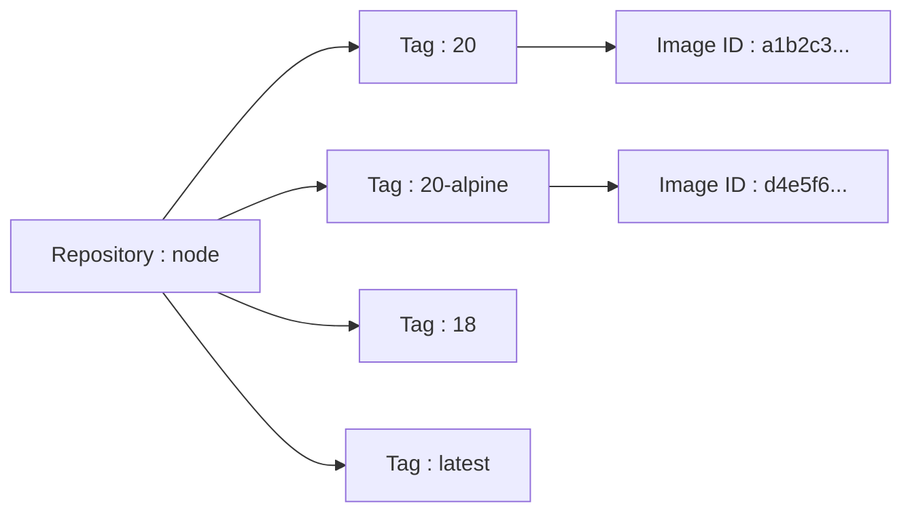
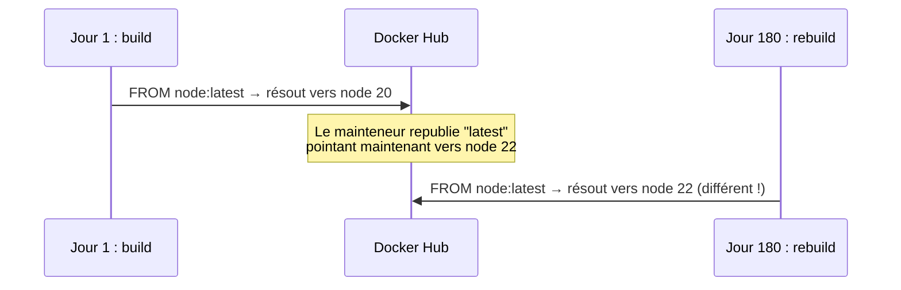

# Chapitre 5 — Les images Docker

**Niveau : Débutant**

---

## Introduction

Le chapitre 4 a manipulé des conteneurs sans jamais s'attarder sur l'image dont ils sont issus. Ce chapitre inverse la focale : comment lister, télécharger, inspecter, comparer et supprimer des images. Il se termine sur un piège classique et sérieux — la dépendance au tag `latest` — qui cause des incidents bien réels en production, détaillés au chapitre 48.

---

## 🎯 Objectifs pédagogiques

À la fin de ce chapitre, tu sauras :
- lister les images présentes localement et lire chacune de leurs colonnes ;
- télécharger explicitement une image avec `docker pull`, sans passer par `docker run` ;
- expliquer la différence entre repository, tag et image ID ;
- expliquer pourquoi dépendre de `latest` en production est risqué, avec un scénario concret ;
- supprimer une image, et comprendre pourquoi Docker peut refuser de le faire ;
- lire la sortie de `docker inspect` et de `docker history` pour comprendre la composition d'une image.

## 📋 Prérequis

Chapitre 4 (cycle de vie des conteneurs).

## Pourquoi ce chapitre est important

Une grande partie des soucis de taille d'image, de mise à jour surprise, ou de "ça a marché hier et plus aujourd'hui" viennent d'une mauvaise compréhension des tags et des couches. Ce chapitre pose les bases nécessaires avant le Dockerfile (chapitre 6), qui *construit* justement les images que ce chapitre apprend à *lire*.

---

## Concepts fondamentaux

1. **Repository, tag, image ID** — trois façons différentes de désigner une image.
2. **`docker images`** — l'inventaire local.
3. **`docker pull`** — obtenir une image sans encore créer de conteneur.
4. **Le piège de `latest`** — pourquoi ce tag n'est pas ce qu'il semble être.
5. **`docker rmi`** — supprimer une image.
6. **`docker inspect` et `docker history`** — voir l'intérieur d'une image.

---

## 5.1 Repository, tag et image ID : trois désignations, un même objet

Rappel du chapitre 1 : une image porte un nom composé d'un **repository** (l'espace nommé, par exemple `node`) et d'un **tag** (la version précise, par exemple `20`), séparés par deux-points : `node:20`.


**Explication du schéma :** un seul repository (`node`) regroupe plusieurs tags, chacun pointant vers une image précise, identifiée en interne par un **image ID** unique (un hash). Deux tags différents peuvent, à un instant donné, pointer vers le **même** image ID — c'est justement le cas de `latest`, développé en 5.4.

Si aucun tag n'est précisé (`docker pull node` au lieu de `docker pull node:20`), Docker suppose automatiquement `latest`.

---

## 5.2 `docker images` : l'inventaire local

```bash
# [Windows PowerShell] / [Linux Terminal] / [Terminal macOS]
docker images
```

**Explication :** `docker images` (ou de façon équivalente `docker image ls`) liste toutes les images présentes **localement** sur ta machine — pas celles de Docker Hub, seulement celles déjà téléchargées ou construites ici.

**Résultat attendu**, en substance :
```text
REPOSITORY   TAG       IMAGE ID       CREATED         SIZE
nginx        latest    a1b2c3d4e5f6   3 weeks ago     187MB
hello-world  latest    d4e5f6a1b2c3   6 months ago    13.3kB
```

**Explication des colonnes :**
```text
REPOSITORY  → le nom de l'image
TAG         → la version précise
IMAGE ID    → l'identifiant unique interne (un hash abrégé à 12 caractères)
CREATED     → date de construction de l'image (pas date de téléchargement)
SIZE        → taille totale de l'image sur le disque
```

> 📌 **À retenir** — `CREATED` indique quand l'image **elle-même** a été construite par son auteur, pas quand tu l'as téléchargée. Une image peut afficher "3 weeks ago" alors que tu viens de la `pull` à l'instant — c'est normal.

---

## 5.3 `docker pull` : télécharger sans démarrer

Le chapitre 3 et le chapitre 4 ont vu Docker télécharger automatiquement une image absente lors d'un `docker run`. Il est aussi possible de télécharger une image **sans** démarrer de conteneur :

```bash
# [Windows PowerShell] / [Linux Terminal] / [Terminal macOS]
docker pull node:20
```

**Explication :**
```text
docker pull
→ télécharge une image depuis un registry (Docker Hub par défaut) vers la machine locale, sans créer de conteneur

node:20
→ repository "node", tag "20"
```

**Résultat attendu :** un téléchargement par couches (chapitre 1, section 1.3 — chaque couche a sa propre barre de progression), confirmé par une ligne finale `Status: Downloaded newer image for node:20`.

> ✅ **Bonne pratique** — Télécharger explicitement une image avant de la reconstruire ou de l'auditer (chapitre 26) est plus clair et plus prévisible que de laisser un `docker run` le faire implicitement au premier lancement, en particulier dans un contexte d'équipe ou de script d'installation.

---

## 5.4 Le piège de `latest`

Le tag `latest` **n'est pas magique** — ce n'est pas automatiquement "la dernière version en date". C'est un tag comme un autre, que le mainteneur d'une image choisit (ou non) de pointer vers une version précise. Rien n'empêche `latest` de rester figé sur une ancienne version si le mainteneur ne le met pas à jour, ou au contraire de changer brutalement de version majeure du jour au lendemain.

> 💡 **Analogie** — `latest` ressemble à une étiquette "Nouveauté" collée en rayon de supermarché. Elle ne garantit ni une date précise, ni que le produit ainsi étiqueté restera le même la semaine prochaine — c'est une convention, pas une promesse contractuelle.

**Scénario concret de ce que `latest` peut casser** : un Dockerfile écrit `FROM node:latest`. Le jour de son écriture, `latest` pointe vers Node.js 20. Six mois plus tard, un redéploiement (`docker build` relancé, chapitres 6-7) reconstruit l'image — mais entre-temps, `latest` a été réassigné à Node.js 22 par le mainteneur de l'image officielle. La nouvelle image se comporte différemment, sans qu'une seule ligne du Dockerfile n'ait changé.


**Explication du schéma :** le même Dockerfile, avec la même ligne `FROM node:latest`, produit deux images différentes selon la date de construction — un comportement non reproductible, contraire à l'objectif même de Docker (chapitre 1, section 1.1 : éliminer les différences d'environnement).

> ⚠️ **Attention** — Ce piège n'est pas propre à `node`. Il s'applique à **toute** image officielle ou communautaire. Le chapitre 25 (Dockerfile professionnel) et le chapitre 32 (versioning) formalisent la règle qui en découle directement :

> ✅ **Bonne pratique** — En production, toujours épingler une version précise (`node:20.11.1`, ou a minima `node:20`), jamais `latest`. Réserver `latest` (ou l'absence de tag) aux tests exploratoires rapides en local, jamais à un Dockerfile destiné à être redéployé dans le temps.

---

## 5.5 `docker rmi` : supprimer une image

```bash
# [Windows PowerShell] / [Linux Terminal] / [Terminal macOS]
docker rmi nginx:latest
```

**Explication :**
```text
docker rmi
→ "remove image" : supprime une image locale (le repository:tag ou l'image ID)
```

**Résultat attendu, si un conteneur (même arrêté) utilise encore cette image :**
```text
Error response from daemon: conflict: unable to remove repository reference "nginx:latest" (must force) - container a1b2c3d4e5f6 is using its referenced image d4e5f6a1b2c3
```

> ❌ **Erreur fréquente** — Ce message est souvent mal interprété comme un bug. C'est en réalité une protection : Docker refuse de supprimer une image tant qu'un conteneur (actif **ou arrêté**, rappel du chapitre 4 — un conteneur `Exited` existe toujours) en dépend encore. La solution correcte est de supprimer d'abord le(s) conteneur(s) concerné(s) (`docker rm`, chapitre 4), pas de forcer aveuglément avec `docker rmi -f`.

> 📌 **À retenir** — Supprimer une image ne supprime jamais un conteneur en cours d'exécution qui en dépend (l'inverse serait dangereux) — Docker bloque l'opération plutôt que de risquer un état incohérent.

---

## 5.6 `docker inspect` : les métadonnées complètes d'une image

```bash
# [Windows PowerShell] / [Linux Terminal] / [Terminal macOS]
docker inspect nginx:latest
```

**Explication :** affiche un document JSON complet décrivant l'image — architecture CPU cible, variables d'environnement par défaut, commande de démarrage, taille de chaque couche, et bien plus. C'est verbeux ; l'option `--format` permet d'extraire un seul champ :

```bash
# [Windows PowerShell] / [Linux Terminal] / [Terminal macOS]
docker inspect --format "{{.Config.Cmd}}" nginx:latest
```

**Explication :**
```text
--format
→ applique un gabarit (syntaxe Go template) pour n'extraire qu'un champ précis du JSON complet

{{.Config.Cmd}}
→ le champ correspondant à la commande de démarrage par défaut de l'image
```

**Résultat attendu**, en substance : `[nginx -g daemon off;]` — la commande exacte que le chapitre 6 (`CMD`) apprendra à définir soi-même.

---

## 5.7 `docker history` : voir les couches d'une image

```bash
# [Windows PowerShell] / [Linux Terminal] / [Terminal macOS]
docker history nginx:latest
```

**Explication :** liste chaque **couche** (layer, chapitre 1 section 1.3) qui compose l'image, dans l'ordre de construction, avec la taille ajoutée par chacune.

**Résultat attendu**, en substance (simplifié) :
```text
IMAGE          CREATED BY                                      SIZE
a1b2c3d4e5f6   CMD ["nginx" "-g" "daemon off;"]                 0B
<missing>      RUN apt-get update && apt-get install ...        62MB
<missing>      COPY nginx.conf /etc/nginx/                      1.2kB
<missing>      FROM debian:bookworm-slim                        124MB
```

**Explication des colonnes :**
```text
IMAGE       → l'identifiant de la couche finale (une seule ligne l'a, les autres sont "<missing>" car intermédiaires et non taguées individuellement)
CREATED BY  → l'instruction du Dockerfile (chapitre 6) qui a produit cette couche
SIZE        → l'espace disque ajouté par CETTE couche précisément, pas le cumul
```

> 📌 **À retenir** — `docker history` est l'outil de diagnostic principal pour comprendre **pourquoi** une image est volumineuse : la couche la plus grosse du tableau désigne directement l'instruction du Dockerfile responsable. C'est le point de départ concret du chapitre 25 (Dockerfile professionnel, optimisation de taille).

---

## Erreurs fréquentes (récapitulatif du chapitre)

| Erreur | Cause | Solution |
|---|---|---|
| "unable to remove repository reference ... must force" | Un conteneur (même arrêté) utilise encore l'image | Supprimer le conteneur d'abord (`docker rm`), pas forcer aveuglément |
| Comportement différent après un rebuild, sans changement de code | Dépendance à `latest` (ou absence de tag) dans le `FROM` | Épingler une version précise, jamais `latest` en production |
| Image "introuvable" alors qu'elle a été `pull`ée hier | Tag différent utilisé par erreur (`node` = `node:latest`, différent de `node:20`) | Toujours vérifier le tag exact avec `docker images` |
| `docker pull` très long ou échoue à mi-chemin | Connexion instable pendant le téléchargement d'une grosse couche | Relancer `docker pull` — Docker reprend les couches déjà téléchargées, ne repart pas de zéro |

---

## Laboratoire pratique n°1 — Comparer la taille de deux variantes d'une même image

**Objectifs :** rendre concrète la section 5.1 (repository/tag) et préparer le chapitre 25 (optimisation).
**Prérequis :** Chapitre 4.

**Étapes :**
1. `docker pull node:20`
2. `docker pull node:20-alpine`
3. `docker images` et compare les deux tailles dans la colonne `SIZE`.

**Résultat attendu :** `node:20-alpine` doit être nettement plus petite que `node:20` (souvent plusieurs centaines de mégaoctets d'écart) — les deux contiennent le même Node.js 20, mais sur des systèmes de base radicalement différents (Debian complet vs Alpine minimal).

**Vérifications :** tu dois pouvoir expliquer, en une phrase, pourquoi deux images censées contenir "la même chose" (Node 20) ont des tailles si différentes.

---

## Laboratoire pratique n°2 — Repérer la couche la plus volumineuse d'une image

**Objectifs :** utiliser `docker history` (5.7) comme un vrai outil de diagnostic.
**Prérequis :** Laboratoire 1 complété.

**Étapes :**
1. `docker history node:20`
2. Identifie, dans la colonne `SIZE`, la ligne avec la plus grosse valeur.
3. Lis la colonne `CREATED BY` correspondante pour comprendre quelle instruction est responsable.
4. Recommence avec `docker history node:20-alpine` et compare.

**Résultat attendu :** identification claire de la couche dominante dans chaque image, avec une explication de la différence entre les deux historiques.

---

## Laboratoire pratique n°3 — Extraire une information précise avec `docker inspect`

**Objectifs :** pratiquer `--format` pour extraire une information ciblée sans lire tout le JSON.
**Prérequis :** Laboratoires 1 et 2 complétés.

**Étapes :**
1. `docker inspect --format "{{.Architecture}}" node:20` — note l'architecture affichée.
2. `docker inspect --format "{{.Config.Env}}" node:20` — note les variables d'environnement par défaut de l'image.
3. Recommence sans `--format` (`docker inspect node:20`) et retrouve à la main les deux mêmes informations dans le JSON complet, pour confirmer leur origine.

**Résultat attendu :** les deux valeurs extraites via `--format` correspondent exactement à ce qui est visible dans le JSON complet.

---

## Exercices

1. Explique la différence entre repository, tag et image ID avec un exemple concret.
2. Pourquoi `docker pull node` et `docker pull node:latest` téléchargent-ils exactement la même chose ?
3. Décris un scénario réel où dépendre de `latest` a causé un problème (inspire-toi de la section 5.4).
4. Que signifie exactement le message "must force" renvoyé par `docker rmi` ?
5. À quoi sert concrètement `docker history`, au-delà de la simple curiosité ?

---

## Quiz

**Question 1.** Le tag `latest` signifie :
a) Toujours la toute dernière version publiée, garantie automatiquement
b) Un tag choisi par le mainteneur, sans garantie de contenu stable dans le temps
c) Une version de test uniquement, jamais utilisable
d) La version la plus légère disponible

**Question 2.** `docker images` affiche :
a) Toutes les images disponibles sur Docker Hub
b) Uniquement les images présentes localement sur la machine
c) Uniquement les images actuellement utilisées par un conteneur actif
d) La liste des conteneurs en cours d'exécution

**Question 3.** `docker rmi` sur une image utilisée par un conteneur arrêté :
a) Réussit toujours sans avertissement
b) Échoue par défaut, protection contre une suppression incohérente
c) Supprime automatiquement aussi le conteneur
d) N'est possible que si le conteneur est en cours d'exécution

**Question 4.** `docker history` sert principalement à :
a) Voir l'historique des commandes tapées dans le terminal
b) Voir les couches d'une image et la taille ajoutée par chacune
c) Voir l'historique des conteneurs supprimés
d) Voir les logs d'un conteneur

**Question 5.** La bonne pratique en production concernant les tags est :
a) Toujours utiliser `latest` pour rester à jour automatiquement
b) Toujours épingler une version précise
c) Ne jamais utiliser de tag du tout
d) Changer de tag à chaque déploiement, peu importe lequel

> 🔑 **Corrigé** — 1: b · 2: b · 3: b · 4: b · 5: b

---

## 📝 Résumé du chapitre

- Une image se désigne par repository + tag (`node:20`), résolus en interne vers un image ID unique.
- `docker images` liste l'inventaire local ; `docker pull` télécharge explicitement une image sans démarrer de conteneur.
- `latest` n'est qu'un tag parmi d'autres, sans garantie de stabilité dans le temps — à éviter en production, où une version précise doit toujours être épinglée.
- `docker rmi` refuse de supprimer une image encore utilisée par un conteneur, même arrêté — protection volontaire, pas un bug.
- `docker inspect` expose toutes les métadonnées d'une image ; `docker history` expose ses couches et leur taille individuelle, l'outil de diagnostic de base pour une image trop volumineuse.

## ✅ Checklist avant de passer au chapitre 6

- [ ] Je sais lister les images locales et lire chaque colonne de `docker images`.
- [ ] Je sais expliquer pourquoi `latest` n'est pas fiable en production.
- [ ] Je sais pourquoi `docker rmi` peut échouer, et comment corriger.
- [ ] Je sais utiliser `docker history` pour trouver la couche la plus volumineuse d'une image.
- [ ] J'ai réalisé les trois laboratoires de ce chapitre.
- [ ] J'ai obtenu au moins 4/5 au quiz.

---

## Glossaire du chapitre

**Repository**
Définition simple : l'espace nommé qui regroupe les versions d'une image (rappel du chapitre 1).
Voir : Chapitre 1, section 1.6 ; Chapitre 5, section 5.1.

**Tag**
Définition simple : l'étiquette de version à l'intérieur d'un repository (rappel du chapitre 1).
Voir : Chapitre 1, section 1.6 ; Chapitre 5, sections 5.1 et 5.4.

**Image ID**
Définition simple : l'identifiant unique interne d'une image précise.
Définition technique : un hash calculé à partir du contenu de l'image, indépendant du nom ou du tag qui pointent vers elle.
Exemple concret : `a1b2c3d4e5f6` dans la sortie de `docker images`.
Voir : Chapitre 5, section 5.1.

**Layer (couche)**
Définition simple : une strate individuelle qui compose une image (rappel du chapitre 1).
Voir : Chapitre 1, section 1.3 ; Chapitre 5, section 5.7.

---

## ❓ FAQ

**Si je supprime une image, les conteneurs déjà créés à partir d'elle sont-ils affectés ?**
Non, tant qu'ils existent déjà (rappel chapitre 4 : Docker refuse même la suppression tant qu'un conteneur en dépend). Un conteneur, une fois créé, ne "revérifie" jamais l'image qui l'a produit.

**Comment savoir si une image a été mise à jour sur Docker Hub depuis mon dernier `pull` ?**
`docker pull` refait toujours la vérification et retélécharge uniquement les couches qui ont changé — relancer `docker pull` régulièrement est la méthode simple. Des outils plus automatisés existent (mentionnés au chapitre 32) mais dépassent ce chapitre.

**Pourquoi certaines images font-elles plusieurs centaines de mégaoctets et d'autres quelques kilooctets (`hello-world`) ?**
Parce que leur contenu diffère radicalement : `hello-world` ne contient qu'un minuscule programme de test, quand une image comme `node:20` embarque un système de base complet plus un runtime entier. Le chapitre 25 explore comment réduire cette taille pour ses propres images.

---

## Références officielles

- `docker images` / `docker pull` / `docker rmi` — [docs.docker.com/reference/cli/docker/image](https://docs.docker.com/reference/cli/docker/image/)
- `docker inspect` — [docs.docker.com/reference/cli/docker/inspect](https://docs.docker.com/reference/cli/docker/inspect/)
- `docker history` — [docs.docker.com/reference/cli/docker/image/history](https://docs.docker.com/reference/cli/docker/image/history/)
- Docker Hub — bonnes pratiques de tagging — [docs.docker.com/docker-hub/repos/manage/access](https://docs.docker.com/docker-hub/repos/manage/access/)

---

## Conclusion

Tu sais maintenant lire, comparer et gérer des images existantes — et tu connais le piège de `latest` avant même d'avoir écrit ton premier Dockerfile. Le chapitre 6 s'attaque justement à la construction : comment écrire, ligne par ligne, la recette qui produit une image.

---

⬅️ [Chapitre 4 — Premiers conteneurs](04-premiers-conteneurs-cycle-de-vie.md) · ➡️ **Suite : Chapitre 6 — Le Dockerfile en profondeur**
