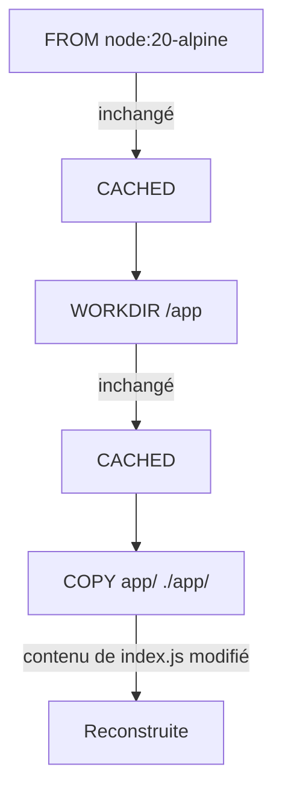

# Chapitre 7 — Premier projet : construire et lancer sa première image

**Niveau : Débutant → Intermédiaire**

---

## Introduction

Douze instructions comprises isolément (chapitre 6), zéro image construite par toi-même jusqu'ici. Ce chapitre corrige ça : un projet minimal, `hello-docker/`, du dossier vide jusqu'à un conteneur qui tourne réellement. C'est aussi le chapitre qui explique enfin ce que fait exactement `docker build` — une commande utilisée en passant au chapitre 6, jamais encore décortiquée.

---

## 🎯 Objectifs pédagogiques

À la fin de ce chapitre, tu sauras :
- construire une image à partir d'un Dockerfile avec `docker build -t`, et expliquer chaque partie de cette commande ;
- expliquer ce qu'est le **contexte de build**, et pourquoi son contenu affecte directement la vitesse de construction ;
- observer et interpréter le **cache de build** — quelles couches sont réutilisées, lesquelles sont reconstruites, et pourquoi ;
- utiliser un `.dockerignore` pour exclure des fichiers inutiles du contexte de build ;
- lancer un conteneur à partir d'une image que tu as toi-même construite, et comprendre pourquoi il s'arrête tout seul.

## 📋 Prérequis

Chapitre 6 (les instructions du Dockerfile).

## Pourquoi ce chapitre est important

Chaque chapitre de la Partie IV (dockeriser Node, React, MySQL...) commence par un `docker build`. Comprendre maintenant, sur un projet minimal et sans enjeu, ce qui se passe réellement pendant cette commande — le contexte envoyé, le cache réutilisé ou invalidé — évite de subir plus tard des reconstructions lentes ou des comportements de cache qui semblent incompréhensibles sans ce socle.

---

## 7.1 Arborescence du projet

```text
hello-docker/
├── app/
│   └── index.js
├── Dockerfile
└── .dockerignore
```

**Crée ce dossier et ces fichiers** (peu importe l'éditeur utilisé) :

`app/index.js` :
```javascript
console.log("Hello, Docker!");
```

`Dockerfile` :
```dockerfile
FROM node:20-alpine
WORKDIR /app
COPY app/ ./app/
CMD ["node", "app/index.js"]
```

**Rappel du chapitre 6, appliqué ici :** `FROM` fixe l'image de base (Node 20, variante `alpine` légère — chapitre 5, laboratoire 1) ; `WORKDIR` fixe `/app` comme dossier de travail ; `COPY` apporte le dossier `app/` du projet dans l'image ; `CMD`, en forme exec, définit la commande de démarrage du conteneur.

Laisse `.dockerignore` vide pour l'instant — il est utilisé en section 7.5.

---

## 7.2 `docker build` : construire l'image

Place-toi dans le dossier `hello-docker/` (celui qui contient le `Dockerfile`), puis :

```bash
# [Windows PowerShell] / [Linux Terminal] / [Terminal macOS]
docker build -t hello-docker .
```

**Explication de la commande, terme par terme :**
```text
docker build
→ construit une image à partir d'un Dockerfile

-t hello-docker
→ "tag" : donne un nom (et implicitement le tag "latest") à l'image produite,
   équivalent à "hello-docker:latest" (chapitre 5, section 5.1)

.
→ le CONTEXTE DE BUILD : le dossier envoyé au Docker daemon pour que
   les instructions COPY/ADD puissent y piocher des fichiers.
   Ici, "." signifie "le dossier courant"
```

**Résultat attendu**, en substance :
```text
[+] Building 4.2s (9/9) FINISHED
 => [internal] load build definition from Dockerfile              0.0s
 => [internal] load .dockerignore                                 0.0s
 => [internal] load metadata for docker.io/library/node:20-alpine 0.8s
 => [1/3] FROM docker.io/library/node:20-alpine@sha256:...         2.1s
 => [internal] load build context                                 0.0s
 => [2/3] WORKDIR /app                                             0.1s
 => [3/3] COPY app/ ./app/                                         0.0s
 => exporting to image                                             0.1s
 => => naming to docker.io/library/hello-docker:latest             0.0s
```

**Explication ligne par ligne :** chaque `=>` correspond à une étape de construction — les trois premières préparent le terrain (lecture du Dockerfile, du `.dockerignore`, récupération des métadonnées de l'image de base), `[1/3]` à `[3/3]` correspondent directement aux trois instructions du Dockerfile (`FROM`, `WORKDIR`, `COPY` — `CMD` ne produit aucune couche, elle ne fait que déclarer une métadonnée), et la dernière ligne confirme le nom final donné à l'image.

> 📌 **À retenir — le contexte de build (le `.` final)** — Ce point mérite d'être isolé car il est souvent mal compris : le `.` n'indique pas où se trouve le Dockerfile (par défaut, Docker le cherche dans ce même dossier, sauf option `-f` non couverte ici), il indique **quel dossier est mis à disposition des instructions `COPY`/`ADD`**. Une instruction `COPY app/ ./app/` ne peut copier que des fichiers qui se trouvent **à l'intérieur** de ce contexte — jamais un fichier situé en dehors, même avec un chemin relatif du type `../autre-dossier`.

```bash
# [Windows PowerShell] / [Linux Terminal] / [Terminal macOS] — vérifier le résultat
docker images
```

**Résultat attendu :** `hello-docker` apparaît dans la liste, avec le tag `latest` (chapitre 5, section 5.2).

---

## 7.3 `docker run` : lancer et observer

```bash
# [Windows PowerShell] / [Linux Terminal] / [Terminal macOS]
docker run hello-docker
```

**Résultat attendu :**
```text
Hello, Docker!
```

Puis le terminal redevient immédiatement disponible — pas de blocage comme au chapitre 4 avec `nginx`.

```bash
# [Terminal]
docker ps -a
```

**Résultat attendu :** le conteneur apparaît avec le statut `Exited (0)`.

> 📌 **À retenir — pourquoi ce conteneur s'arrête tout seul** — Rappel de la FAQ du chapitre 4 : un conteneur reste actif tant que son processus principal continue de tourner. Ici, `node app/index.js` affiche une ligne puis se termine immédiatement (il n'y a ni serveur, ni boucle infinie dans le script) — le conteneur s'arrête donc naturellement, avec le code `0` qui signifie "terminé sans erreur". C'est un comportement **normal et attendu** pour ce script précis, très différent de l'arrêt inattendu d'un serveur qui devrait, lui, rester actif en continu (un scénario de panne réelle, traité au chapitre 48).

---

## 7.4 Le cache de build en action

Modifie `app/index.js` :
```javascript
console.log("Hello, Docker ! Deuxième version.");
```

Reconstruis :
```bash
# [Terminal]
docker build -t hello-docker .
```

**Résultat attendu**, en substance :
```text
[+] Building 0.6s (9/9) FINISHED
 => [internal] load build definition from Dockerfile               0.0s
 => [internal] load .dockerignore                                  0.0s
 => [internal] load metadata for docker.io/library/node:20-alpine  0.3s
 => [1/3] FROM docker.io/library/node:20-alpine@sha256:...          0.0s CACHED
 => [internal] load build context                                  0.0s
 => [2/3] WORKDIR /app                                              0.0s CACHED
 => [3/3] COPY app/ ./app/                                          0.1s
 => exporting to image                                              0.1s
```

**Explication : `CACHED` apparaît sur `[1/3] FROM` et `[2/3] WORKDIR`, mais pas sur `[3/3] COPY`.** Docker calcule, pour chaque instruction, une empreinte basée sur l'instruction elle-même et — pour `COPY`/`ADD` — sur le **contenu réel des fichiers concernés**. `FROM` et `WORKDIR` n'ont pas changé depuis la construction précédente : leurs couches sont réutilisées telles quelles, sans aucun travail refait. `COPY app/ ./app/`, en revanche, pointe vers un fichier dont le contenu a changé (`index.js` modifié) — son empreinte diffère, la couche est donc reconstruite.


**Explication du schéma :** le cache fonctionne **couche par couche, dans l'ordre du Dockerfile** — dès qu'une couche est invalidée (ici `COPY`), Docker doit obligatoirement reconstruire **cette couche et toutes celles qui suivent**, même si elles n'ont elles-mêmes pas changé. Une couche située *avant* la première modification reste, elle, toujours réutilisable.

> 📌 **À retenir** — Cette mécanique explique directement pourquoi, dans un vrai projet Node.js (chapitre 14), on place `COPY package.json package-lock.json ./` puis `RUN npm install` **avant** `COPY . .` : tant que les dépendances déclarées ne changent pas, `RUN npm install` reste `CACHED` même si le code de l'application change à chaque commit — seul un changement des dépendances déclenche une réinstallation complète. Approfondi au chapitre 25.

> ⚠️ **Attention** — Le cache de build est spécifique à **la machine** sur laquelle `docker build` a été exécuté (sauf configuration avancée de cache partagé, hors périmètre de ce manuel). Un `docker build` sur un serveur de production ou dans une CI/CD (chapitre 31) démarre généralement sans aucun cache préexistant lors de sa toute première exécution.

---

## 7.5 Le contexte de build et `.dockerignore`

Le contexte de build (le `.` de la commande) est **entièrement envoyé** au Docker daemon avant même que la première instruction ne s'exécute — y compris des fichiers qu'aucune instruction `COPY`/`ADD` n'utilisera jamais (un dossier `.git`, un `node_modules` local, des fichiers temporaires...).

> ⚠️ **Attention** — Sur un vrai projet (approfondi au chapitre 14), un dossier `node_modules` non exclu peut représenter plusieurs centaines de mégaoctets envoyés inutilement au daemon à **chaque** `docker build`, ralentissant nettement chaque construction — sans même compter le risque de copier accidentellement des secrets locaux (`.env`, chapitre 9) à l'intérieur de l'image si une instruction `COPY . .` les inclut par erreur.

`.dockerignore` fonctionne comme un `.gitignore` : un fichier listant ce qui doit être **exclu** du contexte envoyé au daemon.

```text
# [.dockerignore]
node_modules
.git
.env
*.log
```

**Explication :** chaque ligne est un motif exclu du contexte de build — `node_modules` et `.git`, même volumineux, ne seront jamais envoyés au daemon ni disponibles pour une instruction `COPY`.

> ✅ **Bonne pratique** — Ajouter un `.dockerignore` dès la création d'un projet, pas après coup. Ce point est repris dans la checklist du chapitre 25 (Dockerfile professionnel) comme un des tout premiers réflexes à avoir.

---

## Erreurs fréquentes (récapitulatif du chapitre)

| Erreur | Cause | Solution |
|---|---|---|
| "COPY failed: file not found" | Le fichier référencé est en dehors du contexte de build, ou le chemin est mal orthographié | Vérifier que le fichier est bien à l'intérieur du dossier passé en contexte (le `.`) |
| Construction anormalement lente | Contexte de build trop volumineux (`node_modules`, `.git` non exclus) | Ajouter un `.dockerignore` |
| Le conteneur s'arrête immédiatement, considéré à tort comme un bug | Le script n'a rien à faire en continu (comme `hello-docker` ici) | Comportement normal pour un script ponctuel — un vrai serveur (chapitre 14) reste actif par nature |
| Une modification du code ne semble "pas prise en compte" après reconstruction | Le fichier modifié se trouve hors du dossier réellement copié par l'instruction `COPY` | Vérifier le chemin exact de la ligne `COPY` du Dockerfile |

---

## Laboratoire pratique n°1 — Construire et lancer `hello-docker` de bout en bout

**Objectifs :** exécuter le cycle complet de ce chapitre soi-même.
**Prérequis :** Chapitre 6.

**Étapes :** reproduis intégralement les sections 7.1 à 7.3 : créer l'arborescence, construire l'image, la lancer, vérifier son état avec `docker ps -a`.

**Résultat attendu :** `hello-docker` apparaît dans `docker images`, l'exécution affiche "Hello, Docker!", et le conteneur apparaît `Exited (0)` dans `docker ps -a`.

---

## Laboratoire pratique n°2 — Observer précisément le cache de build

**Objectifs :** vérifier de tes propres yeux le mécanisme de la section 7.4.
**Prérequis :** Laboratoire 1 complété.

**Étapes :**
1. Reconstruis l'image sans rien modifier (`docker build -t hello-docker .`) et observe que **toutes** les étapes affichent `CACHED`.
2. Modifie `app/index.js`, reconstruis, et note quelles étapes restent `CACHED` et laquelle ne l'est plus.
3. Modifie cette fois uniquement le `Dockerfile` (ajoute par exemple un commentaire `# test` en première ligne) sans toucher à `app/index.js`, reconstruis, et observe l'effet sur le cache.

**Résultat attendu :** une compréhension vérifiée par l'expérience de "quelle modification invalide quelle couche".

**Vérifications :** tu dois pouvoir prédire, avant de lancer la reconstruction, quelles lignes afficheront `CACHED`.

---

## Laboratoire pratique n°3 — Mesurer l'effet d'un `.dockerignore`

**Objectifs :** rendre tangible l'impact du contexte de build (section 7.5).
**Prérequis :** Laboratoires 1 et 2 complétés.

**Étapes :**
1. Ajoute au projet un gros fichier factice pour simuler un `node_modules` volumineux (par exemple, une image ou un fichier de plusieurs dizaines de mégaoctets, sans rapport avec le projet).
2. Reconstruis sans `.dockerignore` et note la taille annoncée dans la ligne `load build context` de la sortie.
3. Ajoute ce fichier factice à `.dockerignore`, reconstruis, et compare la taille annoncée.

**Résultat attendu :** une taille de contexte nettement réduite après l'ajout au `.dockerignore`, confirmant concrètement l'intérêt de cette pratique avant même d'attaquer un vrai projet au chapitre 14.

---

## Exercices

1. Explique la différence entre le rôle du Dockerfile et le rôle du contexte de build.
2. Pourquoi la commande `docker build -t hello-docker .` échouerait-elle si elle était lancée depuis un dossier parent de `hello-docker/` plutôt que depuis `hello-docker/` lui-même ?
3. Un développeur modifie un fichier `README.md` non utilisé par aucune instruction `COPY` du Dockerfile, puis reconstruit l'image. Le cache est-il invalidé ? Justifie.
4. Pourquoi un conteneur `Exited (0)` n'est-il pas nécessairement le signe d'un problème ?
5. Explique en une phrase ce qu'apporte un `.dockerignore`, sans relire le chapitre.

---

## Quiz

**Question 1.** Dans `docker build -t hello-docker .`, le `.` final désigne :
a) L'emplacement du fichier Dockerfile uniquement
b) Le contexte de build, le dossier mis à disposition des instructions COPY/ADD
c) Le tag de l'image
d) Le nom du conteneur à créer

**Question 2.** Une couche `CACHED` lors d'un rebuild signifie :
a) Que Docker a ignoré cette instruction
b) Que cette instruction n'a pas changé et que son résultat précédent est réutilisé tel quel
c) Qu'une erreur s'est produite
d) Que l'image de base a été mise à jour

**Question 3.** Si une instruction `COPY` est invalidée par le cache, les instructions suivantes du Dockerfile :
a) Restent forcément en cache
b) Sont également reconstruites, même sans changement direct
c) Sont automatiquement supprimées du Dockerfile
d) N'ont aucun rapport avec le cache de `COPY`

**Question 4.** Un conteneur qui passe à l'état `Exited (0)` juste après son démarrage signifie :
a) Toujours une erreur grave
b) Que son processus principal s'est terminé, potentiellement normalement selon ce que fait l'image
c) Que l'image est corrompue
d) Que Docker a manqué de mémoire

**Question 5.** `.dockerignore` sert à :
a) Empêcher Docker de démarrer un conteneur
b) Exclure des fichiers du contexte envoyé au daemon lors du build
c) Supprimer des images inutilisées
d) Bloquer certains ports réseau

> 🔑 **Corrigé** — 1: b · 2: b · 3: b · 4: b · 5: b

---

## 📝 Résumé du chapitre

- `docker build -t nom .` construit une image : `-t` la nomme (tag), `.` définit le contexte de build (le dossier mis à disposition des instructions `COPY`/`ADD`).
- Le cache de build fonctionne couche par couche, dans l'ordre du Dockerfile : une couche invalidée entraîne la reconstruction de toutes celles qui la suivent, jamais de celles qui la précèdent.
- Un conteneur dont le processus principal se termine naturellement passe à l'état `Exited (0)` — normal pour un script ponctuel comme `hello-docker`, à ne pas confondre avec une panne.
- `.dockerignore` exclut des fichiers du contexte de build, avec un impact réel sur la vitesse de construction et sur ce qui peut accidentellement finir dans une image.

## ✅ Checklist avant de passer au chapitre 8

- [ ] J'ai construit et lancé `hello-docker` moi-même, de zéro.
- [ ] Je sais expliquer ce qu'est le contexte de build.
- [ ] Je sais prédire quelles couches seront `CACHED` après une modification donnée.
- [ ] Je sais pourquoi `hello-docker` s'arrête tout seul sans que ce soit un problème.
- [ ] J'ai un `.dockerignore` dans mon projet de test.
- [ ] J'ai réalisé les trois laboratoires de ce chapitre.
- [ ] J'ai obtenu au moins 4/5 au quiz.

---

## Glossaire du chapitre

**Contexte de build**
Définition simple : le dossier mis à disposition de `docker build` pour que les instructions `COPY`/`ADD` puissent y piocher des fichiers.
Définition technique : l'ensemble des fichiers, à partir du chemin donné à `docker build`, transmis au Docker daemon avant l'exécution de la première instruction du Dockerfile.
Exemple concret : le `.` dans `docker build -t hello-docker .`.
Voir : Chapitre 7, sections 7.2 et 7.5.

**Cache de build**
Définition simple : la réutilisation d'une couche déjà construite, tant que rien n'a changé pour elle.
Définition technique : un mécanisme basé sur une empreinte calculée par instruction (et par contenu de fichier pour `COPY`/`ADD`), invalidant une couche et toutes celles qui la suivent dès qu'un changement est détecté.
Exemple concret : `CACHED` affiché à côté d'une étape lors d'un `docker build`.
Voir : Chapitre 7, section 7.4.

**`.dockerignore`**
Définition simple : la liste des fichiers à exclure du contexte de build.
Voir : Chapitre 7, section 7.5.

---

## ❓ FAQ

**Le cache de build peut-il devenir un problème, pas juste un avantage ?**
Oui — une couche mise en cache à tort (rarement, mais possible avec certains usages avancés non couverts ici) peut masquer un changement attendu. L'option `docker build --no-cache` force une reconstruction complète, utile en dernier recours pour éliminer le cache comme hypothèse de panne (approfondi au chapitre 48).

**Pourquoi le premier build est-il plus long que les suivants, même sans rien modifier ?**
Le premier build doit télécharger l'image de base (`node:20-alpine`) si elle n'est pas déjà locale (chapitre 5), en plus de construire chaque couche pour la première fois — aucune ne peut être `CACHED` puisqu'aucune construction précédente n'existe.

**`docker build` peut-il utiliser un Dockerfile qui ne s'appelle pas exactement `Dockerfile` ?**
Oui, avec l'option `-f chemin/vers/fichier`, non couverte dans ce chapitre volontairement simple — elle redevient utile dans les projets multi-services de la Partie IV.

---

## Références officielles

- `docker build` — [docs.docker.com/reference/cli/docker/buildx/build](https://docs.docker.com/reference/cli/docker/buildx/build/)
- Contexte de build — [docs.docker.com/build/concepts/context](https://docs.docker.com/build/concepts/context/)
- `.dockerignore` — [docs.docker.com/build/concepts/context/#dockerignore-files](https://docs.docker.com/build/concepts/context/#dockerignore-files)
- Cache de build — [docs.docker.com/build/cache](https://docs.docker.com/build/cache/)

---

## Conclusion

Le cycle Dockerfile → build → image → run, jusqu'ici purement théorique (chapitre 1), vient d'être exécuté de tes propres mains, avec un vrai cache observé et un vrai contexte de build maîtrisé. Le chapitre 8 s'attaque à ce que `hello-docker` n'avait pas besoin de faire : rendre une application réellement accessible depuis l'extérieur du conteneur, via les ports.

---

⬅️ [Chapitre 6 — Le Dockerfile en profondeur](06-le-dockerfile-en-profondeur.md) · ➡️ **Suite : Chapitre 8 — Ports et exposition réseau**
