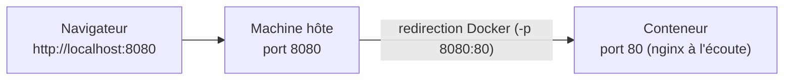

# Chapitre 8 — Ports et exposition réseau

**Niveau : Débutant**

---

## Introduction

Le laboratoire 3 du chapitre 6 s'est terminé par un échec délibéré : `EXPOSE` seul, sans rien d'autre, laisse un conteneur totalement injoignable depuis l'extérieur. Ce chapitre corrige enfin ça avec la véritable commande responsable de la publication d'un port : `-p`. À la fin de ce chapitre, une application conteneurisée devient enfin accessible depuis ton navigateur.

---

## 🎯 Objectifs pédagogiques

À la fin de ce chapitre, tu sauras :
- publier un port d'un conteneur vers l'hôte avec `-p`, et expliquer précisément le sens de `hôte:conteneur` ;
- vérifier qu'un port publié est réellement accessible ;
- faire tourner plusieurs conteneurs simultanément, chacun sur un port hôte différent ;
- diagnostiquer et résoudre un conflit de port ("port is already allocated") ;
- expliquer la différence entre publier sur toutes les interfaces réseau et publier uniquement en local.

## 📋 Prérequis

Chapitres 6 (notamment la section 6.6 sur `EXPOSE`) et 7.

## Pourquoi ce chapitre est important

Une application qui tourne dans un conteneur mais reste injoignable est, de loin, le scénario le plus fréquent de "ça ne marche pas" chez un débutant qui découvre Docker. Ce chapitre élimine cette catégorie d'erreur en construisant un modèle mental clair et vérifié de ce qui se passe entre un navigateur et un port de conteneur.

---

## Concepts fondamentaux

1. **`-p hôte:conteneur`** — la commande qui publie réellement un port.
2. **Vérification** — confirmer qu'un port publié répond effectivement.
3. **Plusieurs conteneurs, plusieurs ports** — éviter les conflits.
4. **Interfaces réseau** — publier partout ou seulement en local.

---

## 8.1 `-p` : publier un port, enfin pour de vrai

```bash
# [Windows PowerShell] / [Linux Terminal] / [Terminal macOS]
docker run -d -p 8080:80 --name web nginx
```

**Explication, terme par terme :**
```text
docker run -d
→ crée et démarre un conteneur en mode détaché (chapitre 4)

-p 8080:80
→ "publish" : relie le port 8080 de la MACHINE HÔTE au port 80 À L'INTÉRIEUR DU CONTENEUR.
   Le format est TOUJOURS "port_hôte:port_conteneur", dans cet ordre précis.

--name web
→ nomme le conteneur "web" (chapitre 4)

nginx
→ l'image (qui déclare EXPOSE 80 dans son propre Dockerfile — chapitre 6, section 6.6)
```


**Explication du schéma :** une requête vers `localhost:8080` (le port de la machine hôte) est redirigée par Docker vers le port 80 **à l'intérieur** du conteneur — le seul port sur lequel Nginx écoute réellement, sans en avoir conscience que la requête vient d'un port "traduit" côté hôte. Le port 8080 n'existe nulle part à l'intérieur du conteneur ; le port 80 n'existe nulle part directement accessible depuis l'hôte sans cette redirection.

> ⚠️ **Attention — l'erreur d'inversion la plus fréquente** — `-p 8080:80` et `-p 80:8080` produisent des résultats radicalement différents. Le premier rend l'application accessible via `localhost:8080` ; le second l'exigerait via `localhost:80`, en s'attendant à ce que le conteneur écoute sur son port 8080 interne (ce qui ne serait pas le cas pour l'image `nginx`, qui écoute sur 80). **Le premier nombre est toujours celui que tu tapes dans ton navigateur ; le second est toujours celui sur lequel l'application écoute réellement à l'intérieur du conteneur.**

---

## 8.2 Vérifier l'accès

```bash
# [Windows PowerShell] / [Linux Terminal] / [Terminal macOS]
curl http://localhost:8080
```

**Résultat attendu :** le HTML de la page d'accueil par défaut de Nginx ("Welcome to nginx!"). Le même test fonctionne dans un navigateur classique à l'adresse `http://localhost:8080`.

Compare ce résultat avec le laboratoire 3 du chapitre 6 (le même `nginx`, sans `-p`) : **c'est la seule différence entre un échec et un succès.**

```bash
# [Terminal] — voir les mappings de port d'un conteneur déjà démarré
docker port web
```

**Résultat attendu :** `80/tcp -> 0.0.0.0:8080` — confirmation explicite du mapping actif.

> 📌 **À retenir** — `docker port` est l'outil de vérification le plus direct quand un mapping de port semble ne pas fonctionner comme prévu : il affiche, sans ambiguïté, ce qui est réellement configuré pour un conteneur donné, sans avoir à se souvenir de la commande `docker run` d'origine.

---

## 8.3 Plusieurs conteneurs, plusieurs ports

Deux conteneurs ne peuvent **jamais** partager le même port **hôte** simultanément — mais rien n'empêche chacun d'utiliser un port hôte différent, tous redirigés vers le même port interne 80 si besoin :

```bash
# [Terminal]
docker run -d -p 8081:80 --name web-1 nginx
docker run -d -p 8082:80 --name web-2 nginx
docker run -d -p 8083:80 --name web-3 nginx
```

**Résultat attendu :** trois conteneurs indépendants, chacun accessible sur un port distinct (`localhost:8081`, `8082`, `8083`), chacun ignorant totalement l'existence des deux autres.

| Conteneur | Port hôte | Port interne (identique pour les trois) | URL d'accès |
|---|---|---|---|
| `web-1` | 8081 | 80 | `http://localhost:8081` |
| `web-2` | 8082 | 80 | `http://localhost:8082` |
| `web-3` | 8083 | 80 | `http://localhost:8083` |

> 📌 **À retenir** — Le port **interne** (80) peut être identique pour tous les conteneurs — c'est même la norme, chaque conteneur étant isolé (chapitre 1, section 1.4) et n'ayant aucune visibilité sur les ports des autres. Seul le port **hôte** doit être unique par conteneur simultanément actif.

---

## 8.4 Conflit de port : diagnostiquer et corriger

```bash
# [Terminal] — tenter de réutiliser un port hôte déjà occupé
docker run -d -p 8081:80 --name web-4 nginx
```

**Résultat attendu, si `web-1` (section 8.3) tourne toujours sur 8081 :**
```text
Error response from daemon: driver failed programming external connectivity on endpoint web-4: Bind for 0.0.0.0:8081 failed: port is already allocated
```

> ❌ **Erreur fréquente** — Ce message ne signifie **pas** que Docker est cassé. Il signifie littéralement ce qu'il dit : un autre conteneur (ou parfois un tout autre programme de la machine, hors Docker) utilise déjà ce port hôte. Deux solutions : choisir un port hôte différent pour le nouveau conteneur, ou arrêter le conteneur qui occupe déjà ce port (`docker stop web-1`, chapitre 4).

**Diagnostic méthodique :**
```bash
# [Terminal] — identifier quel conteneur utilise déjà un port donné
docker ps --filter "publish=8081"
```

**Explication :** filtre la liste des conteneurs actifs pour ne montrer que ceux qui publient le port 8081 — la façon la plus directe de trouver le responsable d'un conflit, plutôt que de deviner.

---

## 8.5 Publier partout ou seulement en local

Par défaut, `-p 8080:80` publie le port sur **toutes les interfaces réseau** de la machine hôte (`0.0.0.0`, visible dans la sortie de `docker port` en 8.2) — y compris, sur un serveur, depuis n'importe quelle adresse capable de joindre la machine sur le réseau, pas seulement `localhost`.

```bash
# [Terminal] — publier UNIQUEMENT en local (127.0.0.1), pas accessible depuis le réseau
docker run -d -p 127.0.0.1:8080:80 --name web-local nginx
```

**Explication :**
```text
127.0.0.1:8080:80
→ ajoute une adresse IP explicite avant le port hôte : seule cette interface
   (127.0.0.1 = la machine elle-même, jamais depuis l'extérieur) reçoit le trafic
```

> ⚠️ **Attention** — Sur un poste de développement personnel, la différence entre `-p 8080:80` et `-p 127.0.0.1:8080:80` est rarement perceptible (le réseau local est généralement fiable). Sur un **serveur** (chapitre 29), la différence devient un enjeu de sécurité réel : publier `-p 3306:3306` (MySQL) sans restriction d'interface rendrait la base de données directement joignable depuis Internet entier, contournant totalement l'application qui devait pourtant être le seul point d'accès. Ce point est repris en détail au chapitre 26 (sécurité) — la règle immédiate à retenir : **ne jamais publier directement le port d'une base de données vers l'extérieur**, un réseau Docker interne (chapitre 11) suffit à la rendre accessible aux seuls conteneurs qui en ont réellement besoin.

---

## Erreurs fréquentes (récapitulatif du chapitre)

| Erreur | Cause | Solution |
|---|---|---|
| Application injoignable malgré `docker run` réussi | Absence de `-p`, ou `EXPOSE` confondu avec une vraie publication (chapitre 6) | Ajouter `-p port_hôte:port_conteneur` |
| "port is already allocated" | Un autre conteneur (ou programme) utilise déjà ce port hôte | Choisir un autre port hôte, ou arrêter le conteneur en conflit |
| L'application répond sur le mauvais port, ou pas du tout, malgré `-p` | Inversion de l'ordre hôte:conteneur | Vérifier avec `docker port nom-conteneur` |
| Une base de données accidentellement accessible depuis Internet | Port publié sans restriction d'interface sur un serveur | Ne jamais publier directement un port de base de données vers l'extérieur (chapitre 11, chapitre 26) |

---

## Laboratoire pratique n°1 — Réussir enfin le laboratoire échoué du chapitre 6

**Objectifs :** transformer l'échec volontaire du chapitre 6 (laboratoire 3) en succès.
**Prérequis :** Chapitre 7.

**Étapes :** relance `docker run -d -p 8080:80 --name web nginx`, puis vérifie l'accès via `curl http://localhost:8080` ou ton navigateur.

**Résultat attendu :** la page d'accueil Nginx s'affiche, là où elle échouait totalement sans `-p`.

---

## Laboratoire pratique n°2 — Trois conteneurs, trois ports

**Objectifs :** manipuler plusieurs conteneurs simultanés sans conflit (section 8.3).
**Prérequis :** Laboratoire 1 complété.

**Étapes :** reproduis la section 8.3 (`web-1`, `web-2`, `web-3` sur les ports 8081-8083), puis vérifie individuellement l'accès à chacun via `curl`.

**Résultat attendu :** trois réponses HTTP indépendantes, une par port.

**Vérifications :** `docker port web-1`, `docker port web-2`, `docker port web-3` doivent chacun confirmer un mapping différent côté hôte, identique (80) côté conteneur.

---

## Laboratoire pratique n°3 — Provoquer et résoudre un conflit de port

**Objectifs :** s'entraîner au diagnostic de la section 8.4 avant d'en avoir besoin en situation réelle.
**Prérequis :** Laboratoires 1 et 2 complétés.

**Étapes :**
1. Avec `web-1` toujours actif sur le port 8081, tente `docker run -d -p 8081:80 --name web-conflit nginx`.
2. Lis attentivement le message d'erreur obtenu.
3. Utilise `docker ps --filter "publish=8081"` pour confirmer le responsable du conflit.
4. Corrige en choisissant un port libre (par exemple 8084) pour `web-conflit`.

**Résultat attendu :** le conflit reproduit intentionnellement, diagnostiqué avec le bon outil, puis résolu.

---

## Exercices

1. Dans `-p 9090:3000`, quel port faut-il taper dans le navigateur pour accéder à l'application ?
2. Pourquoi deux conteneurs peuvent-ils tous les deux utiliser le port interne 80, sans jamais entrer en conflit l'un avec l'autre ?
3. Que signifie exactement le message "port is already allocated" ?
4. Pourquoi ne faut-il jamais publier directement le port d'une base de données vers l'extérieur sur un serveur de production ?
5. Quelle commande permet de retrouver le mapping de port exact d'un conteneur déjà démarré, sans se souvenir de la commande `docker run` d'origine ?

---

## Quiz

**Question 1.** Dans `-p 8080:80`, le premier nombre (8080) désigne :
a) Le port à l'intérieur du conteneur
b) Le port de la machine hôte
c) Le nombre de conteneurs à créer
d) Le temps d'attente avant démarrage

**Question 2.** Deux conteneurs différents peuvent-ils publier tous les deux sur le port hôte 8080 simultanément ?
a) Oui, sans aucune restriction
b) Non, Docker refuse et affiche "port is already allocated"
c) Oui, mais seulement si les deux sont arrêtés
d) Oui, si `--name` est différent

**Question 3.** `docker port nom-conteneur` sert à :
a) Ouvrir un port supplémentaire
b) Afficher les mappings de port réellement actifs pour ce conteneur
c) Fermer tous les ports d'un conteneur
d) Redémarrer le conteneur sur un nouveau port

**Question 4.** `-p 127.0.0.1:8080:80` par rapport à `-p 8080:80` :
a) N'a aucune différence de comportement
b) Restreint l'accès au port publié à la machine locale uniquement
c) Ouvre le port sur toutes les interfaces réseau sans restriction
d) Désactive complètement le port

**Question 5.** Publier directement le port d'une base de données vers l'extérieur sur un serveur de production est :
a) Une bonne pratique recommandée pour faciliter le debug
b) Sans danger tant qu'un mot de passe est configuré
c) Un risque de sécurité à éviter, un réseau Docker interne suffit habituellement
d) Obligatoire pour que l'application backend puisse s'y connecter

> 🔑 **Corrigé** — 1: b · 2: b · 3: b · 4: b · 5: c

---

## 📝 Résumé du chapitre

- `-p port_hôte:port_conteneur` est la seule commande qui publie réellement un port — `EXPOSE` seul (chapitre 6) ne suffit jamais.
- Le premier nombre est celui tapé dans le navigateur ; le second est celui sur lequel l'application écoute réellement à l'intérieur du conteneur.
- Plusieurs conteneurs peuvent partager le même port interne, jamais le même port hôte simultanément.
- "port is already allocated" signifie qu'un autre conteneur (ou programme) occupe déjà ce port hôte — `docker ps --filter "publish=..."` identifie le responsable.
- Publier un port sans restriction d'interface l'expose à tout le réseau joignant la machine — jamais acceptable pour le port d'une base de données en production.

## ✅ Checklist avant de passer au chapitre 9

- [ ] Je sais publier un port et accéder à l'application depuis mon navigateur.
- [ ] Je sais faire tourner plusieurs conteneurs sur des ports hôtes différents.
- [ ] Je sais diagnostiquer et résoudre un conflit de port.
- [ ] Je sais expliquer pourquoi une base de données ne doit jamais être publiée directement vers l'extérieur.
- [ ] J'ai réalisé les trois laboratoires de ce chapitre.
- [ ] J'ai obtenu au moins 4/5 au quiz.

---

## Glossaire du chapitre

**Publication de port (`-p`)**
Définition simple : la redirection d'un port de la machine hôte vers un port à l'intérieur d'un conteneur.
Définition technique : une règle de redirection réseau créée par Docker au démarrage du conteneur, reliant un port hôte à un port du conteneur, dans un sens `hôte:conteneur`.
Exemple concret : `-p 8080:80`.
Voir : Chapitre 8, section 8.1.

**Port hôte / port conteneur**
Définition simple : le port hôte est celui tapé depuis l'extérieur ; le port conteneur est celui sur lequel l'application écoute réellement.
Voir : Chapitre 8, section 8.1.

---

## ❓ FAQ

**Puis-je publier plusieurs ports pour un même conteneur ?**
Oui, en répétant `-p` autant de fois que nécessaire : `docker run -p 8080:80 -p 8443:443 mon-image`.

**Que devient un mapping de port si je fais `docker stop` puis `docker start` sur le même conteneur ?**
Il est conservé à l'identique — le mapping de port fait partie de la configuration du conteneur (chapitre 4), pas de sa seule exécution en cours.

**`-p` fonctionne-t-il différemment sous Windows/macOS et sous Linux ?**
Le comportement observé (côté utilisateur) est identique. La différence se situe uniquement dans la couche sous-jacente (chapitre 2 : Docker Desktop route le trafic à travers la petite VM Linux interne sur Windows/macOS), totalement transparente pour l'usage de `-p` lui-même.

---

## Références officielles

- Publier ou exposer des ports — [docs.docker.com/engine/network/#published-ports](https://docs.docker.com/engine/network/#published-ports)
- `docker run` — options réseau — [docs.docker.com/reference/cli/docker/container/run/#publish](https://docs.docker.com/reference/cli/docker/container/run/#publish)
- `docker port` — [docs.docker.com/reference/cli/docker/container/port](https://docs.docker.com/reference/cli/docker/container/port/)

---

## Conclusion

Une application conteneurisée est enfin accessible depuis l'extérieur, de façon maîtrisée — plus de port ouvert par accident, plus de conflit sans diagnostic. Le chapitre 9 s'attaque à la configuration de cette application : les variables d'environnement, et la question, désormais urgente, de savoir où placer un secret sans jamais le graver dans une image.

---

⬅️ [Chapitre 7 — Premier projet Dockerfile](07-premier-projet-dockerfile.md) · ➡️ **Suite : Chapitre 9 — Variables d'environnement et secrets**
