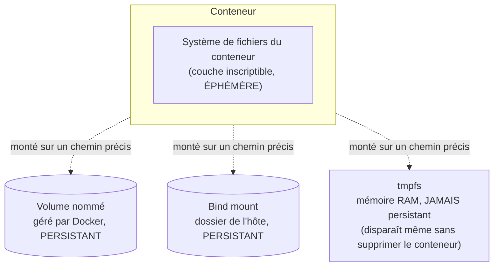

# Chapitre 10 — Volumes et persistance des données

**Niveau : Intermédiaire**

---

## Introduction

Le chapitre 1 (section 1.8) posait déjà la question sans y répondre : que devient une base de données si son conteneur est supprimé ? Ce chapitre y répond avec un vrai laboratoire MySQL — pas une explication abstraite, une perte de données réellement provoquée, puis réellement évitée.

---

## 🎯 Objectifs pédagogiques

À la fin de ce chapitre, tu sauras :
- expliquer pourquoi la couche inscriptible d'un conteneur ne suffit pas pour des données importantes ;
- distinguer volume nommé, bind mount et `tmpfs`, et choisir le bon selon le besoin ;
- créer, lister, inspecter et supprimer un volume avec `docker volume` ;
- monter un volume ou un bind mount avec `-v` ou `--mount`, et connaître la différence de clarté entre les deux syntaxes ;
- démontrer, par l'expérience, qu'un volume fait réellement survivre des données à la suppression d'un conteneur.

## 📋 Prérequis

Chapitre 8. Une compréhension de base d'une commande SQL simple (`INSERT`, `SELECT`) aide, mais n'est pas indispensable — les commandes sont fournies intégralement.

## Pourquoi ce chapitre est important

Aucune base de données réelle (MySQL au chapitre 16, PostgreSQL au chapitre 17, Redis au chapitre 18) ne peut être dockerisée sérieusement sans volume — l'ignorer, c'est construire une application qui perd ses données à chaque mise à jour ou redémarrage de conteneur. C'est l'un des rares chapitres de ce manuel où une erreur de compréhension a des conséquences directement destructrices, pas seulement une erreur de terminal à corriger.

---

## Concepts fondamentaux

1. **Le problème** — la couche inscriptible d'un conteneur est éphémère (rappel chapitre 1).
2. **Volume nommé** — un espace de stockage géré par Docker, la solution recommandée par défaut.
3. **Bind mount** — un dossier de la machine hôte monté directement dans le conteneur.
4. **`tmpfs`** — un stockage en mémoire, jamais persistant, pour des cas très spécifiques.
5. **`docker volume`** — le sous-commande de gestion des volumes.

---

## 10.1 Le problème, démontré

```bash
# [Windows PowerShell] / [Linux Terminal] / [Terminal macOS]
docker run -d --name mysql-sans-volume -e MYSQL_ROOT_PASSWORD=test1234 mysql:8
```

Attends une trentaine de secondes que MySQL termine son initialisation (visible via `docker logs mysql-sans-volume`, technique détaillée au chapitre 22 — pour l'instant, `docker exec` suffit à vérifier que le serveur répond) :

```bash
# [Terminal] — créer une donnée de test
docker exec -it mysql-sans-volume mysql -uroot -ptest1234 -e "CREATE DATABASE test_perte; USE test_perte; CREATE TABLE t (msg VARCHAR(50)); INSERT INTO t VALUES ('Cette donnée va disparaître');"
```

**Explication :**
```text
docker exec -it
→ exécute une commande À L'INTÉRIEUR d'un conteneur déjà en cours d'exécution
   (le détail complet de "exec" arrive au chapitre 23 ; ici, il sert juste à piloter le client MySQL)

mysql -uroot -ptest1234 -e "..."
→ le client MySQL, exécutant directement les instructions SQL fournies
```

```bash
# [Terminal] — vérifier que la donnée existe bien
docker exec -it mysql-sans-volume mysql -uroot -ptest1234 -e "SELECT * FROM test_perte.t;"
```

**Résultat attendu :** la ligne `Cette donnée va disparaître` s'affiche.

```bash
# [Terminal] — supprimer le conteneur (rappel chapitre 4 : opération définitive)
docker rm -f mysql-sans-volume
docker run -d --name mysql-sans-volume-v2 -e MYSQL_ROOT_PASSWORD=test1234 mysql:8
```

Après quelques secondes :
```bash
# [Terminal]
docker exec -it mysql-sans-volume-v2 mysql -uroot -ptest1234 -e "SELECT * FROM test_perte.t;"
```

**Résultat attendu :** `ERROR 1049 (42000): Unknown database 'test_perte'` — **la base de données a totalement disparu**, exactement comme annoncé au chapitre 1. Le nouveau conteneur, bien qu'issu de la même image, démarre avec une base de données vierge, sans aucun lien avec l'ancienne.

> ⚠️ **Attention** — Ce n'est **pas** un bug de MySQL ni de Docker. C'est le fonctionnement normal et attendu de la couche inscriptible d'un conteneur (chapitre 1, section 1.4), qui disparaît définitivement avec lui. Si ce laboratoire avait porté sur une vraie base de données de production, la perte serait tout aussi réelle et irréversible.

---

## 10.2 Trois façons de faire persister des données



| | Volume nommé | Bind mount | `tmpfs` |
|---|---|---|---|
| Géré par | Docker | Toi (chemin exact de l'hôte) | Docker (en RAM) |
| Persiste après suppression du conteneur | Oui | Oui | **Non, jamais** |
| Emplacement réel sur le disque | Géré par Docker, pas besoin de le connaître au quotidien | Un dossier précis que tu choisis sur l'hôte | Aucun (mémoire vive) |
| Cas d'usage typique | Données d'une base de données (recommandé par défaut) | Code source en développement (rechargement à chaud), fichiers de config | Données temporaires sensibles, caches très volatiles |
| Portable entre machines différentes | Oui (le nom suffit) | Non (dépend d'un chemin propre à cette machine précise) | Sans objet |

> 📌 **À retenir** — Pour une base de données, le **volume nommé** est le choix par défaut recommandé dans ce manuel, y compris en production (repris au chapitre 36). Le **bind mount** est surtout utile en développement, pour que des modifications de code sur l'hôte soient immédiatement visibles dans le conteneur sans reconstruire l'image (technique reprise au chapitre 14). `tmpfs` reste un cas marginal, mentionné pour être complet.

---

## 10.3 `docker volume` : gérer les volumes

```bash
# [Terminal]
docker volume create mysql-data
```

**Explication :** crée un volume nommé `mysql-data`, géré par Docker, indépendant de tout conteneur pour l'instant.

```bash
# [Terminal]
docker volume ls
```

**Résultat attendu**, en substance :
```text
DRIVER    VOLUME NAME
local     mysql-data
```

```bash
# [Terminal]
docker volume inspect mysql-data
```

**Résultat attendu**, en substance :
```json
[
    {
        "CreatedAt": "2026-01-01T10:00:00Z",
        "Driver": "local",
        "Mountpoint": "/var/lib/docker/volumes/mysql-data/_data",
        "Name": "mysql-data",
        "Scope": "local"
    }
]
```

> 📌 **À retenir** — Le champ `Mountpoint` révèle l'emplacement réel du volume sur le disque de l'hôte. Il n'est presque jamais nécessaire d'y accéder directement au quotidien (chapitre 33 pour les sauvegardes, une des rares situations qui le justifient) — le rôle même d'un volume nommé est de ne pas avoir à s'en soucier.

```bash
# [Terminal] — supprimer un volume (uniquement s'il n'est utilisé par AUCUN conteneur)
docker volume rm mysql-data
```

> ❌ **Erreur fréquente** — `docker volume rm` échoue avec "volume is in use" si un conteneur (même arrêté) le référence encore — exactement la même logique de protection que `docker rmi` sur une image (chapitre 5, section 5.5). Supprimer d'abord le conteneur concerné.

---

## 10.4 Monter un volume nommé avec `-v` ou `--mount`

```bash
# [Terminal] — syntaxe courte (-v), très répandue
docker run -d --name mysql-avec-volume -e MYSQL_ROOT_PASSWORD=test1234 -v mysql-data:/var/lib/mysql mysql:8
```

**Explication :**
```text
-v mysql-data:/var/lib/mysql
→ monte le volume nommé "mysql-data" sur le chemin "/var/lib/mysql" À L'INTÉRIEUR du conteneur
   (le dossier où MySQL écrit réellement ses fichiers de données, documenté par l'image officielle)
```

Si `mysql-data` n'existe pas encore, Docker le crée automatiquement au premier `docker run` qui le référence — `docker volume create` explicite (section 10.3) reste utile pour créer un volume à l'avance ou l'inspecter, mais n'est jamais strictement obligatoire avant un `-v`.

**Syntaxe longue équivalente (`--mount`)**, plus verbeuse mais plus explicite :

```bash
# [Terminal]
docker run -d --name mysql-avec-volume -e MYSQL_ROOT_PASSWORD=test1234 \
  --mount type=volume,source=mysql-data,target=/var/lib/mysql \
  mysql:8
```

> ⚠️ **Attention — ambiguïté de la syntaxe courte** — `-v source:destination` interprète différemment `source` selon sa forme : un nom simple (`mysql-data`) est traité comme un **volume nommé** ; un chemin commençant par `/` ou `./` (`/home/moi/data:/var/lib/mysql`) est traité comme un **bind mount** (section 10.5). Cette ambiguïté syntaxique est une source réelle de confusion — `--mount`, plus verbeux, lève explicitement cette ambiguïté (`type=volume` vs `type=bind`) et est recommandé par la documentation officielle dès qu'une commande devient complexe ou est destinée à être partagée avec une équipe. Ce manuel utilise `-v` pour sa concision dans les exemples courts, et signale `--mount` comme alternative plus sûre chaque fois que pertinent.

---

## 10.5 Bind mount : monter un dossier de l'hôte

```bash
# [Windows PowerShell]
docker run -d --name nginx-config -v C:\projets\mon-site\config:/etc/nginx/conf.d nginx

# [Linux Terminal] / [Terminal macOS]
docker run -d --name nginx-config -v $(pwd)/config:/etc/nginx/conf.d nginx
```

**Explication :** contrairement à un volume nommé, un bind mount pointe vers un **chemin précis et réel de la machine hôte** — ici, un dossier `config` du projet, monté directement dans le conteneur. Toute modification d'un fichier dans ce dossier, faite depuis l'hôte (dans un éditeur de code, par exemple), est **immédiatement visible** à l'intérieur du conteneur, sans reconstruction ni redémarrage.

> 📌 **À retenir** — C'est exactement ce mécanisme qui permettra, au chapitre 14, de modifier le code d'une API Node.js sur ta machine et de voir le changement pris en compte dans le conteneur sans reconstruire l'image à chaque fois — un gain de temps de développement considérable, réservé au développement local (jamais recommandé en production, où l'image doit rester la seule source de vérité, rappel du chapitre 1, section 1.1).

---

## 10.6 `tmpfs` : mémoire seulement, jamais persistant

```bash
# [Terminal]
docker run -d --name test-tmpfs --tmpfs /app/cache nginx
```

**Explication :** `/app/cache`, à l'intérieur de ce conteneur, vit uniquement en **mémoire RAM** — plus rapide qu'un accès disque, mais perdu non seulement à la suppression du conteneur, mais même à un simple `docker restart` (chapitre 4). Cas d'usage typique : des données strictement temporaires et sensibles, qu'on préfère ne jamais voir écrites sur un disque, même transitoirement.

> ⚠️ **Attention** — `tmpfs` n'est disponible que sur les hôtes Linux (natif sur Linux ; sur Docker Desktop, à travers la VM Linux interne du chapitre 2, avec des limites parfois différentes). Ce manuel le mentionne pour être exhaustif, mais aucun projet des Parties IV, IX et XI ne l'utilise en pratique.

---

## 10.7 Vérification finale : le laboratoire refait, avec un volume cette fois

Reprends exactement les étapes de la section 10.1, mais avec `mysql-avec-volume` (section 10.4, doté du volume `mysql-data`) :

```bash
# [Terminal]
docker exec -it mysql-avec-volume mysql -uroot -ptest1234 -e "CREATE DATABASE test_persistance; USE test_persistance; CREATE TABLE t (msg VARCHAR(50)); INSERT INTO t VALUES ('Cette donnée va survivre');"

docker rm -f mysql-avec-volume

docker run -d --name mysql-avec-volume-v2 -e MYSQL_ROOT_PASSWORD=test1234 -v mysql-data:/var/lib/mysql mysql:8
```

Après quelques secondes :
```bash
# [Terminal]
docker exec -it mysql-avec-volume-v2 mysql -uroot -ptest1234 -e "SELECT * FROM test_persistance.t;"
```

**Résultat attendu :** `Cette donnée va survivre` s'affiche, malgré la suppression complète du premier conteneur entre-temps — **la donnée a survécu parce qu'elle vivait dans le volume, jamais dans la couche inscriptible du conteneur supprimé.**

> 📌 **À retenir, la vraie leçon du chapitre** — Le conteneur MySQL est, en un sens, **jetable** : il peut être supprimé, recréé, mis à jour vers une nouvelle version de l'image, sans jamais affecter les données réelles — **tant qu'il se reconnecte au bon volume**. C'est exactement le principe que le chapitre 32 (mise à jour, rollback) et le chapitre 36 (bases de données en production) réutilisent : le conteneur change, le volume reste.

---

## Erreurs fréquentes (récapitulatif du chapitre)

| Erreur | Cause | Solution |
|---|---|---|
| Perte de données après `docker rm` d'un conteneur de base de données | Aucun volume monté sur le chemin de données de l'image | Toujours monter un volume nommé sur le chemin documenté par l'image (`/var/lib/mysql`, `/var/lib/postgresql/data`...) |
| "volume is in use" lors d'un `docker volume rm` | Un conteneur (même arrêté) référence encore ce volume | Supprimer le conteneur en question d'abord |
| Un bind mount "ne trouve pas le dossier" | Chemin relatif mal résolu, ou dossier inexistant sur l'hôte | Toujours utiliser un chemin absolu (ou `$(pwd)/...` sous Linux/macOS) et vérifier qu'il existe |
| Des données "disparaissent" après un simple redémarrage | Confusion entre `tmpfs` et un volume nommé | Utiliser un volume nommé pour toute donnée censée survivre, réserver `tmpfs` à un besoin explicitement temporaire |

---

## Laboratoire pratique n°1 — Reproduire la perte de données

**Objectifs :** vivre soi-même le problème de la section 10.1, avant d'en connaître la solution.
**Prérequis :** Chapitre 8.

**Étapes :** reproduis intégralement la section 10.1.

**Résultat attendu :** une erreur `Unknown database` confirmant la perte totale des données insérées.

---

## Laboratoire pratique n°2 — Corriger avec un volume nommé

**Objectifs :** appliquer la solution et confirmer qu'elle fonctionne réellement.
**Prérequis :** Laboratoire 1 complété.

**Étapes :** reproduis la section 10.7 en entier.

**Résultat attendu :** la donnée insérée avant suppression du conteneur reste lisible après recréation d'un nouveau conteneur connecté au même volume.

**Vérifications :** utilise `docker volume ls` avant et après chaque étape pour confirmer que le volume, contrairement au conteneur, n'a jamais été supprimé pendant tout le laboratoire.

---

## Laboratoire pratique n°3 — Bind mount avec un fichier de configuration Nginx

**Objectifs :** expérimenter la mise à jour à chaud propre au bind mount (section 10.5).
**Prérequis :** Laboratoires 1 et 2 complétés.

**Étapes :**
1. Crée un dossier `config/` avec un fichier `default.conf` minimal (peu importe le contenu exact pour ce laboratoire).
2. Lance `docker run -d --name nginx-test -v $(pwd)/config:/etc/nginx/conf.d -p 8080:80 nginx` (adapter le chemin sous PowerShell selon la section 10.5).
3. Modifie le contenu de `default.conf` depuis ton éditeur habituel, sans toucher au conteneur.
4. Redémarre uniquement Nginx à l'intérieur du conteneur (`docker exec nginx-test nginx -s reload` — une commande de rechargement propre à Nginx, sans rapport avec Docker) et observe que le changement est pris en compte sans reconstruction d'image.

**Résultat attendu :** confirmation que le contenu du dossier hôte et celui vu par le conteneur sont, en pratique, un seul et même dossier.

---

## Exercices

1. Explique pourquoi un conteneur de base de données peut être supprimé sans risque, tant qu'un volume est correctement monté.
2. Quelle est la différence de comportement entre `docker rm` d'un conteneur avec volume et `docker volume rm` de ce même volume ?
3. Pourquoi un bind mount n'est-il généralement pas recommandé en production, contrairement au développement ?
4. Que signifie exactement le champ `Mountpoint` de `docker volume inspect` ?
5. Dans quel cas précis choisirait-on `tmpfs` plutôt qu'un volume nommé ou un bind mount ?

---

## Quiz

**Question 1.** Un volume nommé, contrairement à la couche inscriptible d'un conteneur :
a) Disparaît également à la suppression du conteneur
b) Survit à la suppression du conteneur qui l'utilisait
c) N'existe que pendant la construction de l'image
d) Est propre à chaque conteneur, jamais partageable

**Question 2.** Dans `-v mysql-data:/var/lib/mysql`, Docker interprète `mysql-data` comme :
a) Un chemin de l'hôte, car il ne commence pas par un caractère spécial
b) Un volume nommé, car ce n'est pas un chemin absolu ou relatif
c) Une erreur de syntaxe systématique
d) Un nom de conteneur

**Question 3.** `tmpfs` :
a) Persiste après un `docker restart`
b) Ne persiste jamais, même sans supprimer le conteneur
c) Est identique à un volume nommé, avec un nom différent
d) Nécessite obligatoirement un chemin absolu de l'hôte

**Question 4.** Un bind mount est particulièrement utile pour :
a) Stocker des données de production critiques
b) Le rechargement à chaud du code en développement local
c) Remplacer totalement les volumes nommés
d) Chiffrer automatiquement les données

**Question 5.** `docker volume rm mon-volume` échoue si :
a) Le volume est vide
b) Un conteneur, même arrêté, référence encore ce volume
c) Le volume a été créé il y a plus de 30 jours
d) Aucun conteneur ne l'utilise

> 🔑 **Corrigé** — 1: b · 2: b · 3: b · 4: b · 5: b

---

## 📝 Résumé du chapitre

- La couche inscriptible d'un conteneur (chapitre 1) est éphémère — sans volume, toute donnée écrite dans un conteneur de base de données disparaît définitivement à sa suppression, démontré ici avec un vrai MySQL.
- Trois options : **volume nommé** (géré par Docker, recommandé par défaut, y compris en production), **bind mount** (un dossier précis de l'hôte, utile en développement pour le rechargement à chaud), **`tmpfs`** (mémoire seulement, jamais persistant).
- `docker volume create/ls/inspect/rm` gère le cycle de vie d'un volume, indépendamment de tout conteneur.
- `-v source:destination` est ambigu selon la forme de `source` (nom = volume, chemin = bind mount) ; `--mount` lève explicitement cette ambiguïté.
- Un conteneur de base de données correctement conçu est jetable : il peut être supprimé et recréé sans perte, tant qu'il se reconnecte au bon volume — le principe central repris aux chapitres 32 et 36.

## ✅ Checklist avant de passer au chapitre 11

- [ ] J'ai personnellement provoqué une perte de données, puis je l'ai corrigée avec un volume.
- [ ] Je sais expliquer la différence entre volume nommé, bind mount et `tmpfs`.
- [ ] Je sais créer, lister, inspecter et supprimer un volume.
- [ ] Je sais pourquoi `-v` peut être ambigu et ce que `--mount` apporte en clarté.
- [ ] J'ai réalisé les trois laboratoires de ce chapitre.
- [ ] J'ai obtenu au moins 4/5 au quiz.

---

## Glossaire du chapitre

**Volume (nommé)**
Définition simple : un espace de stockage géré par Docker, indépendant du cycle de vie d'un conteneur précis (rappel du chapitre 1).
Voir : Chapitre 1, section 1.8 ; Chapitre 10, sections 10.3 et 10.4.

**Bind mount**
Définition simple : un dossier précis de la machine hôte, monté directement dans un conteneur.
Définition technique : un montage qui relie un chemin du système de fichiers de l'hôte à un chemin à l'intérieur du conteneur, avec synchronisation immédiate dans les deux sens.
Exemple concret : `-v $(pwd)/config:/etc/nginx/conf.d`.
Voir : Chapitre 10, section 10.5.

**`tmpfs`**
Définition simple : un montage qui vit uniquement en mémoire RAM, jamais sur le disque.
Voir : Chapitre 10, section 10.6.

---

## ❓ FAQ

**Un volume peut-il être partagé entre plusieurs conteneurs en même temps ?**
Oui — plusieurs conteneurs peuvent monter le même volume nommé simultanément. C'est utile dans certains cas (partage de fichiers uploadés entre plusieurs instances d'une même application), mais exige de la prudence si plusieurs conteneurs écrivent au même endroit sans coordination (hors périmètre détaillé de ce manuel).

**Perdre le conteneur perd-il aussi le volume ?**
Non, jamais automatiquement — un volume nommé existe indépendamment de tout conteneur, y compris après suppression de tous les conteneurs qui l'utilisaient. Il ne disparaît que par une suppression explicite (`docker volume rm`) ou un nettoyage global volontaire (`docker volume prune`, chapitre 24).

**Comment sauvegarder le contenu d'un volume ?**
Question centrale et légitime, traitée en profondeur au chapitre 33 — la réponse courte : jamais en copiant à la main le `Mountpoint` interne de Docker, toujours via un conteneur utilitaire dédié à la sauvegarde.

---

## Références officielles

- Vue d'ensemble du stockage Docker — [docs.docker.com/engine/storage](https://docs.docker.com/engine/storage/)
- Volumes — [docs.docker.com/engine/storage/volumes](https://docs.docker.com/engine/storage/volumes/)
- Bind mounts — [docs.docker.com/engine/storage/bind-mounts](https://docs.docker.com/engine/storage/bind-mounts/)
- `tmpfs` mounts — [docs.docker.com/engine/storage/tmpfs](https://docs.docker.com/engine/storage/tmpfs/)

---

## Conclusion

Une base de données peut désormais être dockerisée sans risque de perte de données — le chapitre 16 (MySQL) et le chapitre 17 (PostgreSQL) réutiliseront directement ce réflexe sans le réexpliquer. Le chapitre 11 s'attaque à la dernière pièce isolée de la Partie II : comment plusieurs conteneurs — un backend et cette même base de données, par exemple — se trouvent et se parlent entre eux.

---

⬅️ [Chapitre 9 — Variables d'environnement et secrets](09-variables-environnement-et-secrets.md) · ➡️ **Suite : Chapitre 11 — Réseaux Docker**
