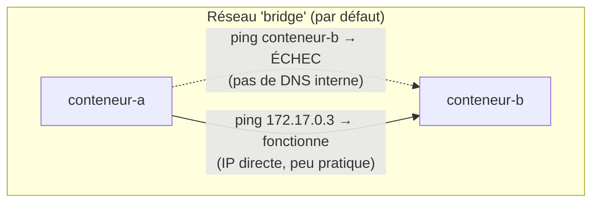
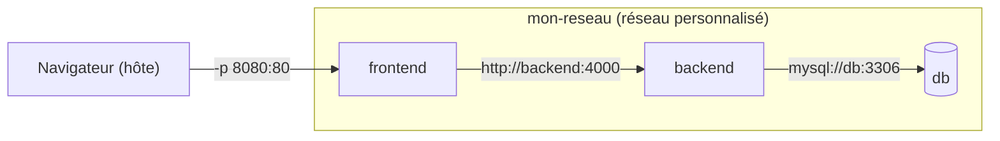

# Chapitre 11 — Réseaux Docker : faire communiquer plusieurs conteneurs

**Niveau : Intermédiaire**

---

## Introduction

Dernier chapitre de la Partie II, et dernière pièce manquante avant Docker Compose (Partie III) : comment un backend trouve-t-il une base de données qui tourne dans un conteneur voisin ? Le chapitre 1 (section 1.8) promettait une réponse — la voici, avec un laboratoire à trois conteneurs qui se trouvent par leur nom, exactement comme le fera Compose en coulisses dès le chapitre 12.

---

## 🎯 Objectifs pédagogiques

À la fin de ce chapitre, tu sauras :
- expliquer pourquoi le réseau `bridge` par défaut de Docker ne permet **pas** la résolution de noms entre conteneurs ;
- créer un réseau personnalisé et y rattacher plusieurs conteneurs ;
- faire communiquer des conteneurs entre eux par leur **nom**, sans jamais coder une adresse IP en dur ;
- expliquer la différence entre les modes réseau `bridge`, `host` et `none` ;
- isoler une base de données du réseau externe tout en la rendant accessible aux conteneurs qui en ont réellement besoin.

## 📋 Prérequis

Chapitres 8 (ports) et 10 (volumes).

## Pourquoi ce chapitre est important

Aucune application réelle de ce manuel, à partir du chapitre 13, ne tient dans un seul conteneur. Un frontend, un backend, une base de données, parfois Redis (chapitre 18) : chacun dans son propre conteneur, chacun devant trouver les autres de façon fiable. Ce chapitre construit, à la main, exactement ce que Docker Compose automatisera — comprendre le mécanisme sous-jacent maintenant rend Compose transparent plutôt que magique.

---

## Concepts fondamentaux

1. **Le réseau `bridge` par défaut** — et sa limite : pas de résolution par nom.
2. **Réseau personnalisé** — la solution, avec DNS interne automatique.
3. **`docker network`** — créer, inspecter, connecter, déconnecter.
4. **`host` et `none`** — deux modes réseau alternatifs, pour des cas particuliers.
5. **Isolation d'une base de données** — ne l'exposer qu'aux conteneurs qui en ont besoin.

---

## 11.1 Le réseau `bridge` par défaut, et sa limite

Sans précision, tout conteneur démarré avec `docker run` rejoint automatiquement un réseau nommé `bridge`, créé par Docker à l'installation. Ce réseau permet aux conteneurs de communiquer entre eux — mais **uniquement par adresse IP**, jamais par nom.

```bash
# [Terminal] — deux conteneurs sur le réseau bridge par défaut (aucun --network précisé)
docker run -d --name conteneur-a alpine sleep 3600
docker run -d --name conteneur-b alpine sleep 3600
```

**Explication :** `alpine sleep 3600` fait tourner un conteneur minimal qui reste actif une heure sans rien faire d'autre — pratique pour un laboratoire réseau, sans avoir besoin d'une vraie application.

```bash
# [Terminal] — tenter de joindre "conteneur-b" par son NOM depuis "conteneur-a"
docker exec conteneur-a ping -c 2 conteneur-b
```

**Résultat attendu :**
```text
ping: bad address 'conteneur-b'
```

> ❌ **Erreur fréquente, et incomprise sans ce chapitre** — Les deux conteneurs tournent bel et bien, tous les deux accessibles depuis la machine hôte, tous les deux sur le même réseau `bridge` par défaut — et pourtant, l'un ne trouve pas l'autre par son nom. **Ce n'est pas un bug** : le réseau `bridge` par défaut, pour des raisons historiques de compatibilité, ne fournit **aucune résolution DNS automatique** entre les conteneurs qui y sont rattachés. Seule une adresse IP (obtenue via `docker inspect`, fastidieux et instable — l'IP peut changer à chaque redémarrage) permettrait de les faire communiquer sur ce réseau précis.


**Explication du schéma :** la communication réseau elle-même fonctionne parfaitement sur le réseau `bridge` par défaut — c'est spécifiquement la **résolution de noms** qui y est absente. La solution, développée dans la section suivante, n'est donc pas de contourner ce réseau par des adresses IP codées en dur (fragile, rappel du chapitre 1 sur les mauvaises pratiques de configuration), mais d'utiliser un réseau d'un type différent.

---

## 11.2 Réseau personnalisé : la solution, avec DNS automatique

```bash
# [Terminal]
docker network create mon-reseau
```

**Explication :** crée un réseau **personnalisé** (techniquement, toujours de type `bridge`, mais **défini par l'utilisateur** plutôt que celui par défaut de Docker) — et c'est précisément cette distinction qui active la résolution de noms automatique.

```bash
# [Terminal] — recréer les deux conteneurs, rattachés cette fois à "mon-reseau"
docker rm -f conteneur-a conteneur-b
docker run -d --name conteneur-a --network mon-reseau alpine sleep 3600
docker run -d --name conteneur-b --network mon-reseau alpine sleep 3600
```

```bash
# [Terminal]
docker exec conteneur-a ping -c 2 conteneur-b
```

**Résultat attendu :**
```text
PING conteneur-b (172.20.0.3): 56 data bytes
64 bytes from 172.20.0.3: seq=0 ttl=64 time=0.089 ms
64 bytes from 172.20.0.3: seq=1 ttl=64 time=0.077 ms
```

**Cette fois, ça fonctionne** — `conteneur-a` a trouvé `conteneur-b` en tapant simplement son nom.

> 📌 **À retenir, la règle centrale de ce chapitre** — Sur un réseau **personnalisé** (créé avec `docker network create`), Docker fait tourner un petit serveur DNS interne (accessible en interne à l'adresse `127.0.0.11`, invisible en usage normal) qui résout automatiquement le **nom** de chaque conteneur rattaché vers son adresse IP réelle sur ce réseau. Sur le réseau `bridge` par défaut, ce service n'existe pas. **Conséquence pratique directe pour tout le reste du manuel : ne jamais utiliser le réseau `bridge` par défaut pour une application à plusieurs conteneurs — toujours créer un réseau personnalisé.**

```bash
# [Terminal] — gérer les réseaux
docker network ls
docker network inspect mon-reseau
```

**`docker network inspect`** révèle, entre autres, la liste des conteneurs actuellement rattachés au réseau, avec leur adresse IP sur celui-ci — utile pour un diagnostic (approfondi au chapitre 48).

---

## 11.3 `docker network connect` et `disconnect`

Un conteneur déjà démarré peut rejoindre un réseau supplémentaire, ou en quitter un, sans être recréé :

```bash
# [Terminal]
docker network connect mon-reseau conteneur-c
docker network disconnect mon-reseau conteneur-c
```

> 📌 **À retenir** — Un conteneur peut être rattaché à **plusieurs réseaux simultanément** — utile, par exemple, pour un conteneur de diagnostic qu'on connecte temporairement au réseau interne d'une application sans avoir à modifier ni relancer les conteneurs de l'application elle-même. Technique reprise au chapitre 23 (debugging).

---

## 11.4 `host` et `none` : deux modes alternatifs

```bash
# [Linux Terminal uniquement]
docker run -d --network host nginx
```

**Explication :** en mode `host`, un conteneur **partage directement la pile réseau de la machine hôte**, sans aucune isolation réseau ni mapping de port (`-p` devient inutile, et sans effet — l'application écoute directement sur les ports de l'hôte, comme si elle n'était pas conteneurisée du tout côté réseau).

> ⚠️ **Attention** — Le mode `host` sacrifie une partie de l'isolation propre à Docker (chapitre 1, section 1.4) pour un gain marginal de performance réseau, pertinent seulement dans des cas très spécifiques (mesuré, pas supposé). Il n'est **pas disponible de la même façon sur Docker Desktop (Windows/macOS)**, où les conteneurs tournent de toute façon à l'intérieur d'une VM Linux intermédiaire (chapitre 2) — ce mode n'est donc directement utile qu'en déploiement Linux natif (chapitre 29). Ce manuel ne l'utilise dans aucun de ses projets.

```bash
# [Terminal]
docker run -d --network none alpine sleep 3600
```

**Explication :** en mode `none`, un conteneur ne dispose d'**aucune interface réseau** en dehors de la boucle locale (`localhost` interne à lui-même) — isolation réseau totale. Cas d'usage : un traitement ponctuel qui ne doit avoir strictement aucun accès réseau, ni entrant ni sortant, par exigence de sécurité explicite.

| Mode | Isolation réseau | Résolution DNS par nom | Cas d'usage dans ce manuel |
|---|---|---|---|
| `bridge` (par défaut) | Isolé de l'hôte, communication par IP entre conteneurs | Non | Jamais utilisé directement — toujours remplacé par un réseau personnalisé |
| `bridge` personnalisé | Isolé de l'hôte, communication entre conteneurs | **Oui** | Le standard de ce manuel, du chapitre 11 au chapitre 47 |
| `host` | Aucune (partage la pile réseau de l'hôte) | Sans objet | Non utilisé dans ce manuel |
| `none` | Totale (aucun accès réseau) | Sans objet | Non utilisé dans ce manuel |

---

## 11.5 Laboratoire conceptuel : Frontend → Backend → Database


**Explication du schéma :** seul `frontend` publie un port vers l'hôte (`-p`, chapitre 8) — `backend` et `db` restent **injoignables depuis l'extérieur**, accessibles uniquement par les autres conteneurs du même réseau, par leur nom. C'est exactement l'architecture que le chapitre 20 (application full stack) et le chapitre 47 (projet final) construiront avec Docker Compose, qui ne fait, en coulisses, rien de plus que ce que ce chapitre vient de faire à la main.

**Commandes complètes** (reprenant le volume MySQL du chapitre 10) :

```bash
# [Terminal]
docker network create mon-reseau

docker run -d --name db --network mon-reseau \
  -e MYSQL_ROOT_PASSWORD=test1234 -e MYSQL_DATABASE=app \
  -v mysql-data:/var/lib/mysql \
  mysql:8

docker run -d --name backend --network mon-reseau alpine sleep 3600

docker run -d --name frontend --network mon-reseau -p 8080:80 nginx
```

```bash
# [Terminal] — vérifier que "backend" trouve "db" par son nom
docker exec backend ping -c 2 db

# [Terminal] — vérifier que "frontend" trouve "backend" par son nom
docker exec frontend ping -c 2 backend
```

**Résultat attendu :** les deux commandes réussissent, malgré trois conteneurs totalement distincts, chacun ignorant l'existence physique des autres et ne les connaissant que par un nom.

> 📌 **À retenir** — Aucune de ces trois commandes `docker run` n'a eu besoin de connaître l'adresse IP d'un autre conteneur, et aucune ne s'est cassée si les conteneurs sont recréés dans un ordre différent lors d'un futur redémarrage : le nom, contrairement à une IP, reste stable tant que le conteneur porte ce nom sur ce réseau.

---

## 11.6 Isoler une base de données du réseau externe

Reprends `db` (section 11.5) : elle n'a **jamais reçu de `-p`** dans sa commande de lancement.

```bash
# [Terminal] — tenter de joindre "db" depuis L'HÔTE (pas depuis un autre conteneur)
mysql -h 127.0.0.1 -P 3306 -uroot -ptest1234
```

**Résultat attendu :** échec de connexion — le port 3306 n'est publié nulle part vers l'hôte.

> ✅ **Bonne pratique, application directe du chapitre 8 (section 8.5)** — `db` reste pourtant parfaitement joignable par `backend`, via le réseau interne `mon-reseau` et son nom. C'est exactement le modèle recommandé : **une base de données n'a jamais besoin de `-p`** dès lors qu'elle est rattachée au même réseau personnalisé que les conteneurs qui doivent réellement y accéder — l'isolation devient une propriété de l'architecture, pas une règle qu'il faut se souvenir d'appliquer à chaque déploiement.

---

## Erreurs fréquentes (récapitulatif du chapitre)

| Erreur | Cause | Solution |
|---|---|---|
| `ping: bad address 'nom-du-conteneur'` | Conteneurs sur le réseau `bridge` par défaut, sans `--network` personnalisé | Créer et utiliser un réseau personnalisé (`docker network create`) |
| Deux conteneurs sur des réseaux personnalisés différents ne se trouvent pas | Chacun rattaché à un réseau distinct | Les rattacher au même réseau, ou utiliser `docker network connect` |
| Un backend perd la connexion à sa base de données après un redémarrage | Adresse IP codée en dur plutôt que le nom du conteneur | Toujours utiliser le nom du conteneur/service, jamais une IP figée |
| Impossible de se connecter à une base de données depuis l'hôte, alors que le backend y accède sans problème | Comportement volontaire : la base n'est publiée sur aucun port hôte | Normal et souhaitable en production ; utiliser `docker exec` pour un accès de diagnostic ponctuel si nécessaire (chapitre 23) |

---

## Laboratoire pratique n°1 — Reproduire l'échec du réseau bridge par défaut

**Objectifs :** vivre la limite de la section 11.1 avant sa solution.
**Prérequis :** Chapitre 10.

**Étapes :** reproduis intégralement la section 11.1.

**Résultat attendu :** `ping: bad address` confirmé, malgré deux conteneurs actifs et sains.

---

## Laboratoire pratique n°2 — Frontend → Backend → Database, complet

**Objectifs :** construire à la main l'architecture que Compose automatisera dès le chapitre 13.
**Prérequis :** Laboratoire 1 complété.

**Étapes :** reproduis intégralement la section 11.5, puis vérifie les deux communications par nom.

**Résultat attendu :** `backend` trouve `db`, `frontend` trouve `backend`, tous deux par leur nom, sur `mon-reseau`.

**Vérifications :** utilise `docker network inspect mon-reseau` et confirme que les trois conteneurs y apparaissent, chacun avec une adresse IP différente sur ce réseau.

---

## Laboratoire pratique n°3 — Confirmer l'isolation de la base de données

**Objectifs :** vérifier concrètement la section 11.6.
**Prérequis :** Laboratoires 1 et 2 complétés.

**Étapes :**
1. Avec `db` toujours active (laboratoire 2), tente une connexion depuis l'hôte (avec un client MySQL local, ou `docker run --rm mysql:8 mysql -h host.docker.internal -P 3306 -uroot -ptest1234` depuis un conteneur externe au réseau `mon-reseau`).
2. Confirme l'échec.
3. Depuis `backend` (`docker exec -it backend sh`, puis un client MySQL s'il est installé, ou simplement `ping db` comme confirmation d'accessibilité réseau), confirme le succès.

**Résultat attendu :** une base de données prouvée injoignable de l'extérieur, tout en restant pleinement fonctionnelle pour les conteneurs qui en ont réellement besoin.

---

## Exercices

1. Explique pourquoi `ping conteneur-b` échoue sur le réseau `bridge` par défaut, mais réussit sur un réseau personnalisé.
2. Pourquoi une IP codée en dur pour joindre une base de données est-elle une mauvaise pratique, même si elle "fonctionne" au moment où on l'écrit ?
3. Que permet `docker network connect`, qu'un simple `--network` au lancement ne permet pas ?
4. Pourquoi une base de données correctement architecturée n'a-t-elle jamais besoin de `-p` ?
5. Explique en une phrase le lien entre ce chapitre et ce que fera Docker Compose au chapitre 12.

---

## Quiz

**Question 1.** Sur le réseau `bridge` par défaut de Docker, deux conteneurs peuvent-ils se joindre par leur nom ?
a) Oui, automatiquement
b) Non, seule une adresse IP directe fonctionne
c) Seulement s'ils partagent le même volume
d) Seulement en mode `host`

**Question 2.** Un réseau créé avec `docker network create` fournit :
a) Un accès Internet plus rapide
b) Une résolution DNS automatique entre les conteneurs qui y sont rattachés
c) Un chiffrement automatique de tout le trafic
d) Un stockage persistant partagé

**Question 3.** En mode réseau `none`, un conteneur :
a) Reste connecté au réseau `bridge` par défaut en secours
b) N'a aucune interface réseau externe
c) Ne peut pas démarrer
d) Est automatiquement connecté à Internet

**Question 4.** Une base de données qui n'a jamais reçu de `-p` mais est rattachée au même réseau personnalisé qu'un backend :
a) Est totalement injoignable, y compris par le backend
b) Reste accessible au backend par son nom, mais injoignable depuis l'hôte
c) Doit obligatoirement recevoir un `-p` pour fonctionner
d) N'a besoin d'aucun réseau

**Question 5.** `docker network connect mon-reseau conteneur-c` :
a) Crée un nouveau conteneur
b) Rattache un conteneur déjà existant à un réseau supplémentaire, sans le recréer
c) Supprime le réseau `mon-reseau`
d) Publie automatiquement tous les ports du conteneur

> 🔑 **Corrigé** — 1: b · 2: b · 3: b · 4: b · 5: b

---

## 📝 Résumé du chapitre

- Le réseau `bridge` par défaut de Docker permet la communication entre conteneurs, mais **sans résolution de noms** — une limite historique, pas un bug.
- Un réseau **personnalisé** (`docker network create`) fournit une résolution DNS automatique : chaque conteneur rattaché trouve les autres par leur **nom**, jamais par une IP à retenir ou coder en dur.
- `docker network connect`/`disconnect` rattachent ou détachent un conteneur déjà existant, sans le recréer.
- Les modes `host` (partage total de la pile réseau de l'hôte, Linux uniquement) et `none` (isolation réseau totale) restent des cas marginaux, non utilisés dans les projets de ce manuel.
- Une base de données rattachée à un réseau personnalisé n'a jamais besoin de publier son port vers l'hôte (`-p`) pour être utilisable par les conteneurs qui en dépendent — l'architecture même de la Partie II (réseau + volume) rend cette isolation naturelle plutôt qu'à retenir séparément.

## ✅ Checklist avant de passer à la Partie III

- [ ] Je sais expliquer pourquoi le réseau `bridge` par défaut ne résout pas les noms.
- [ ] Je sais créer un réseau personnalisé et y rattacher plusieurs conteneurs.
- [ ] J'ai fait communiquer trois conteneurs par leur nom (frontend → backend → database).
- [ ] Je sais pourquoi une base de données n'a pas besoin de `-p` si elle partage le bon réseau avec ses clients.
- [ ] J'ai réalisé les trois laboratoires de ce chapitre.
- [ ] J'ai obtenu au moins 4/5 au quiz.

---

## Glossaire du chapitre

**Réseau `bridge`**
Définition simple : le type de réseau virtuel par défaut de Docker.
Définition technique : un réseau isolé de l'hôte, permettant la communication entre conteneurs par adresse IP ; le réseau `bridge` par défaut ne fournit pas de résolution DNS entre conteneurs, contrairement à un réseau `bridge` personnalisé.
Voir : Chapitre 11, sections 11.1 et 11.2.

**Réseau personnalisé**
Définition simple : un réseau créé explicitement par l'utilisateur, avec résolution de noms automatique entre les conteneurs qui y sont rattachés.
Voir : Chapitre 11, section 11.2.

**DNS interne Docker**
Définition simple : le petit serveur de résolution de noms intégré à chaque réseau personnalisé.
Définition technique : un service DNS embarqué (accessible en interne à `127.0.0.11`) qui traduit le nom d'un conteneur en son adresse IP sur ce réseau précis.
Voir : Chapitre 11, section 11.2.

---

## ❓ FAQ

**Docker Compose utilise-t-il exactement ce mécanisme ?**
Oui, très directement — Compose (chapitre 12) crée automatiquement un réseau personnalisé pour chaque projet, et chaque service y est nommé d'après sa clé dans `compose.yaml`. Tout ce chapitre a été construit à la main pour que ce comportement automatique ne semble jamais magique.

**Peut-on renommer un conteneur pour changer la façon dont les autres le trouvent sur le réseau ?**
Oui, avec `docker rename` (mentionné au chapitre 4) — mais un conteneur déjà connecté conserve son ancienne résolution jusqu'à un redémarrage effectif dans certains cas ; le plus fiable reste de fixer le bon nom dès `docker run --name`.

**Que se passe-t-il si deux conteneurs sur le même réseau personnalisé portent le même nom ?**
Impossible — comme au chapitre 4, un nom de conteneur doit être unique sur la machine, ce qui garantit indirectement l'absence d'ambiguïté de résolution sur un réseau donné.

---

## Références officielles

- Vue d'ensemble des réseaux Docker — [docs.docker.com/engine/network](https://docs.docker.com/engine/network/)
- Pilote réseau `bridge` — [docs.docker.com/engine/network/drivers/bridge](https://docs.docker.com/engine/network/drivers/bridge/)
- `docker network` (référence des commandes) — [docs.docker.com/reference/cli/docker/network](https://docs.docker.com/reference/cli/docker/network/)

---

## Conclusion

La Partie II se termine ici : conteneurs, images, Dockerfile, ports, variables d'environnement, volumes, réseaux — chaque brique manipulée séparément, à la main, avec ses commandes complètes. La Partie III commence avec Docker Compose, qui ne fait rien de conceptuellement nouveau — il automatise, dans un seul fichier déclaratif, exactement ce que ces huit derniers chapitres ont appris à faire commande par commande.

---

⬅️ [Chapitre 10 — Volumes et persistance des données](10-volumes-et-persistance-des-donnees.md) · ➡️ **Suite : Chapitre 12 — Introduction à Docker Compose**
