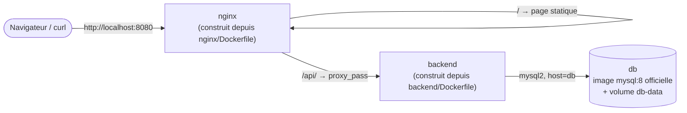

# Chapitre 13 — Premier projet Compose : Nginx + Backend + MySQL

**Niveau : Intermédiaire**

---

## Introduction

Ce chapitre ferme la Partie III et tout le socle fondamental du manuel (Parties I à III) avec un vrai projet complet : Nginx en point d'entrée unique, un backend Node.js construit depuis son propre Dockerfile, et MySQL avec ses données qui survivent à tout redémarrage. Tout ce qui a été appris séparément — Dockerfile (chapitre 6), ports (chapitre 8), variables d'environnement (chapitre 9), volumes (chapitre 10), réseaux (chapitre 11), Compose (chapitre 12) — se combine ici pour la première fois dans un seul projet cohérent.

---

## 🎯 Objectifs pédagogiques

À la fin de ce chapitre, tu sauras :
- construire une architecture à trois services avec Compose, où deux services (`backend`, `nginx`) sont bâtis depuis un Dockerfile local plutôt qu'une image toute faite ;
- utiliser un fichier `.env` à la racine du projet, automatiquement lu par Compose et interpolé dans `compose.yaml` avec la syntaxe `${VARIABLE}` ;
- vérifier de bout en bout qu'une requête traverse correctement Nginx → Backend → MySQL ;
- reconstruire un seul service modifié sans tout redémarrer ;
- observer une limite réelle de `depends_on`, préparant le chapitre 21.

## 📋 Prérequis

Chapitre 12. Une lecture rapide du chapitre 6 (Dockerfile) et du chapitre 9 (`.env`) aide à suivre plus vite, sans être strictement indispensable.

## Pourquoi ce chapitre est important

C'est le premier projet du manuel qui ressemble à une vraie application, avec plusieurs services **construits** (pas seulement des images officielles utilisées telles quelles) et une base de données réellement interrogée. La Partie IV qui suit reprend systématiquement ce patron : un backend applicatif, une base de données, un reverse proxy devant les deux.

---

## 13.1 Architecture cible


**Explication du schéma :** seul `nginx` publie un port vers l'hôte (chapitre 8, chapitre 11 section 11.6) — `backend` et `db` restent injoignables depuis l'extérieur, communiquant uniquement par leur nom sur le réseau Compose créé automatiquement (chapitre 12).

---

## 13.2 Arborescence du projet

```text
projet-compose-1/
├── backend/
│   ├── Dockerfile
│   ├── package.json
│   └── server.js
├── nginx/
│   ├── Dockerfile
│   └── default.conf
├── compose.yaml
├── .env.example
└── .gitignore
```

### `backend/package.json`
```json
{
  "name": "backend",
  "version": "1.0.0",
  "main": "server.js",
  "dependencies": {
    "mysql2": "^3.9.0"
  }
}
```

### `backend/server.js`
```javascript
const http = require("http");
const mysql = require("mysql2/promise");

const server = http.createServer(async (req, res) => {
  if (req.url === "/api/status") {
    try {
      const connection = await mysql.createConnection({
        host: process.env.DB_HOST,
        user: process.env.DB_USER,
        password: process.env.DB_PASSWORD,
        database: process.env.DB_NAME,
      });
      await connection.execute(
        "CREATE TABLE IF NOT EXISTS visites (id INT AUTO_INCREMENT PRIMARY KEY, vu_le TIMESTAMP DEFAULT CURRENT_TIMESTAMP)"
      );
      await connection.execute("INSERT INTO visites () VALUES ()");
      const [rows] = await connection.execute("SELECT COUNT(*) AS total FROM visites");
      await connection.end();

      res.writeHead(200, { "Content-Type": "application/json" });
      res.end(JSON.stringify({ status: "ok", visites: rows[0].total }));
    } catch (err) {
      res.writeHead(500, { "Content-Type": "application/json" });
      res.end(JSON.stringify({ status: "error", message: err.message }));
    }
  } else {
    res.writeHead(404);
    res.end();
  }
});

server.listen(4000, () => console.log("Backend à l'écoute sur le port 4000"));
```

**Explication du comportement :** chaque appel à `/api/status` insère une ligne dans une table `visites`, puis renvoie le total — une preuve simple et vérifiable que les données persistent réellement d'une requête à l'autre, et d'un redémarrage à l'autre (chapitre 10).

### `backend/Dockerfile`
```dockerfile
FROM node:20-alpine
WORKDIR /app
COPY package.json ./
RUN npm install
COPY . .
CMD ["node", "server.js"]
```

**Rappel du chapitre 7** : `COPY package.json ./` puis `RUN npm install` **avant** `COPY . .` — cet ordre permet au cache de build de réutiliser `npm install` tant que `package.json` ne change pas, même si `server.js` change à chaque itération.

### `nginx/default.conf`
```nginx
server {
    listen 80;

    location /api/ {
        proxy_pass http://backend:4000/api/;
    }

    location / {
        default_type text/plain;
        return 200 "Bienvenue sur le premier projet Compose !\n";
    }
}
```

**Explication :** `proxy_pass http://backend:4000/api/` — **`backend` est ici un nom résolu par le DNS interne du réseau Compose** (chapitre 11, chapitre 12), pas une adresse à configurer manuellement. Ce fichier reste volontairement minimal ; le chapitre 19 (Nginx reverse proxy) l'enrichit avec les en-têtes, la compression et le cache qu'une vraie configuration de production exige.

### `nginx/Dockerfile`
```dockerfile
FROM nginx:1.27
COPY default.conf /etc/nginx/conf.d/default.conf
```

### `.env.example` (versionné — rappel du chapitre 9)
```text
DB_ROOT_PASSWORD=changeme
DB_NAME=app
DB_USER=app_user
DB_PASSWORD=changeme
```

Copie ce fichier en `.env` (jamais versionné, ajouté au `.gitignore`) avec de vraies valeurs pour ton propre test.

---

## 13.3 `compose.yaml` complet

```yaml
services:
  db:
    image: mysql:8
    environment:
      MYSQL_ROOT_PASSWORD: ${DB_ROOT_PASSWORD}
      MYSQL_DATABASE: ${DB_NAME}
      MYSQL_USER: ${DB_USER}
      MYSQL_PASSWORD: ${DB_PASSWORD}
    volumes:
      - db-data:/var/lib/mysql

  backend:
    build: ./backend
    environment:
      DB_HOST: db
      DB_USER: ${DB_USER}
      DB_PASSWORD: ${DB_PASSWORD}
      DB_NAME: ${DB_NAME}
    depends_on:
      - db

  nginx:
    build: ./nginx
    ports:
      - "8080:80"
    depends_on:
      - backend

volumes:
  db-data:
```

**Ce qui est nouveau par rapport au chapitre 12 :**

```yaml
build: ./backend
```
**Explication :** au lieu de `image:` (une image déjà existante), `build:` indique à Compose de **construire** l'image depuis le Dockerfile trouvé dans ce dossier — l'équivalent exact d'un `docker build ./backend` (chapitre 7), exécuté automatiquement au premier `docker compose up`.

```yaml
MYSQL_ROOT_PASSWORD: ${DB_ROOT_PASSWORD}
```
**Explication — l'interpolation `.env` de Compose :** Compose lit **automatiquement** un fichier nommé `.env`, s'il existe à la racine du projet (là où se trouve `compose.yaml`), et remplace chaque `${NOM_VARIABLE}` rencontré dans le fichier par sa valeur. C'est un mécanisme **différent** de la clé `environment:` (qui définit des variables **à l'intérieur du conteneur**, chapitre 9) — ici, `.env` alimente directement le contenu de `compose.yaml` **avant** que Compose ne l'interprète.

> ⚠️ **Attention — deux usages différents du même fichier `.env`, à ne pas confondre** — Le fichier `.env` sert ici à **interpoler `compose.yaml` lui-même** (`${DB_NAME}` devient littéralement le texte `app` avant toute création de conteneur). Il est possible, séparément, de charger un `.env` **à l'intérieur** d'un conteneur avec une clé `env_file:` sous un service — un mécanisme différent, plus proche du `--env-file` du chapitre 9. Ce projet n'utilise que la première forme (interpolation), suffisante ici.

---

## 13.4 Construire et lancer

```bash
# [Terminal] — depuis projet-compose-1/, après avoir créé .env à partir de .env.example
docker compose up -d --build
```

**Explication :**
```text
--build
→ force la (re)construction des images "build:" avant de démarrer,
  même si des images du même nom existent déjà localement
```

**Résultat attendu :** trois services créés (`db`, `backend`, `nginx`), le réseau et le volume `db-data` créés automatiquement (chapitre 12).

```bash
# [Terminal] — vérifier la page statique servie directement par nginx
curl http://localhost:8080/
```

**Résultat attendu :** `Bienvenue sur le premier projet Compose !`

```bash
# [Terminal] — vérifier le trajet complet Nginx → Backend → MySQL
curl http://localhost:8080/api/status
```

**Résultat attendu :** `{"status":"ok","visites":1}`. Relance la même commande plusieurs fois : le compteur `visites` augmente à chaque appel, confirmant que chaque requête traverse réellement les trois services et que MySQL persiste bien l'information entre deux appels.

---

## 13.5 Reconstruire un seul service modifié

Modifie `backend/server.js` (par exemple, change le message JSON), puis :

```bash
# [Terminal] — reconstruire ET redémarrer UNIQUEMENT "backend"
docker compose up -d --build backend
```

**Explication :** en ciblant `backend` explicitement, Compose ne touche ni à `db` (dont les données doivent rester intactes) ni à `nginx` — exactement le comportement souhaité en développement itératif, où reconstruire toute la pile à chaque changement de code serait inutilement long.

> 📌 **À retenir** — Le cache de build (chapitre 7) s'applique ici exactement comme pour un `docker build` manuel : reconstruire `backend` après une modification de `server.js` réutilise la couche `RUN npm install` en cache, tant que `package.json` n'a pas changé.

---

## 13.6 Une limite réelle de `depends_on`

```bash
# [Terminal] — provoquer un démarrage à froid complet
docker compose down
docker compose up -d --build
curl http://localhost:8080/api/status
```

**Résultat possible, selon la vitesse de la machine :**
```json
{"status":"error","message":"connect ECONNREFUSED 172.x.x.x:3306"}
```

> ⚠️ **Attention — ce que `depends_on` garantit, et ce qu'il ne garantit PAS** — `depends_on: [db]` (section 13.3) garantit uniquement que le **conteneur** `db` est **démarré** avant `backend` — pas que MySQL, à l'intérieur, a terminé son initialisation et accepte déjà des connexions (un processus qui prend, dans les faits, plusieurs secondes après le démarrage du conteneur). Une requête arrivée trop tôt peut donc légitimement échouer, même si `docker compose ps` affiche `db` comme `Up`. Ce n'est pas un bug de ce projet — c'est une limite documentée de `depends_on` dans sa forme simple.

```bash
# [Terminal] — réessayer après quelques secondes
curl http://localhost:8080/api/status
```

**Résultat attendu, cette fois :** `{"status":"ok","visites":1}` — le second appel réussit, une fois MySQL réellement prêt.

> 📌 **À retenir, en attendant le chapitre 21** — La vraie solution à ce problème n'est pas d'ajouter un délai arbitraire (`sleep`) avant de démarrer `backend` — une approche fragile, parfois trop courte, parfois inutilement longue. La bonne solution utilise un `HEALTHCHECK` (introduit au chapitre 6, section 6.9) combiné à `depends_on: condition: service_healthy` — développé en profondeur, avec un vrai laboratoire de correction de ce problème précis, au **chapitre 21**.

---

## Erreurs fréquentes (récapitulatif du chapitre)

| Erreur | Cause | Solution |
|---|---|---|
| `${DB_NAME}` apparaît littéralement dans les logs plutôt que sa valeur | Fichier `.env` absent, mal placé, ou variable mal orthographiée | Vérifier que `.env` existe à la racine du projet, au même niveau que `compose.yaml` |
| "connect ECONNREFUSED" au premier démarrage | Limite de `depends_on` (section 13.6) — MySQL pas encore prêt à accepter des connexions | Réessayer après quelques secondes ; solution durable au chapitre 21 |
| Modifier `server.js` semble sans effet | `docker compose up -d` relancé sans `--build` | Toujours ajouter `--build` (ou cibler le service : `--build backend`) après une modification de code |
| Perte du compteur `visites` après un `docker compose down` | Utilisation accidentelle de `-v` (rappel chapitre 12) | Ne jamais ajouter `-v` sauf volonté explicite de repartir de zéro |

---

## Laboratoire pratique n°1 — Construire et vérifier le projet de bout en bout

**Objectifs :** exécuter l'intégralité de ce chapitre soi-même.
**Prérequis :** Chapitre 12.

**Étapes :** reproduis les sections 13.2 à 13.4.

**Résultat attendu :** `curl http://localhost:8080/` et `curl http://localhost:8080/api/status` répondent tous deux correctement, le second avec un compteur qui augmente à chaque appel.

---

## Laboratoire pratique n°2 — Modifier et reconstruire un seul service

**Objectifs :** pratiquer le flux de travail itératif de la section 13.5.
**Prérequis :** Laboratoire 1 complété.

**Étapes :** modifie le message JSON renvoyé par `backend/server.js`, reconstruis uniquement `backend`, vérifie le changement, puis confirme que le compteur `visites` n'a pas été réinitialisé (preuve que `db` n'a pas été affectée par cette reconstruction ciblée).

---

## Laboratoire pratique n°3 — Reproduire et comprendre la limite de `depends_on`

**Objectifs :** vivre la section 13.6 avant que le chapitre 21 ne la corrige.
**Prérequis :** Laboratoires 1 et 2 complétés.

**Étapes :**
1. `docker compose down` puis immédiatement `docker compose up -d --build` suivi d'un `curl` **immédiat** (sans délai).
2. Si la requête échoue, note le message d'erreur exact.
3. Réessaie après 10-15 secondes et confirme le succès.
4. Consulte `docker compose logs db` pour repérer, dans les logs de MySQL, la ligne signalant qu'il est prêt à accepter des connexions (technique reprise en détail au chapitre 22).

**Résultat attendu :** une observation directe et non théorique de la différence entre "conteneur démarré" et "application réellement prête".

---

## Exercices

1. Explique la différence entre `image:` et `build:` dans un `compose.yaml`.
2. Comment Compose transforme-t-il `${DB_NAME}` dans `compose.yaml`, et à partir de quel fichier ?
3. Pourquoi `backend` et `db` ne publient-ils aucun port vers l'hôte dans ce projet, contrairement à `nginx` ?
4. Que garantit exactement `depends_on`, et que ne garantit-il pas ?
5. Pourquoi reconstruire uniquement `backend` (plutôt que tout le projet) après une modification de `server.js` préserve-t-il les données de `db` ?

---

## Quiz

**Question 1.** `build: ./backend` dans `compose.yaml` signifie :
a) Utiliser une image officielle nommée "backend"
b) Construire l'image depuis le Dockerfile présent dans le dossier `./backend`
c) Créer un volume nommé "backend"
d) Publier le port du dossier "backend"

**Question 2.** Le fichier `.env` à la racine d'un projet Compose sert, dans ce chapitre, à :
a) Définir des variables uniquement visibles depuis le conteneur `nginx`
b) Interpoler des valeurs directement dans `compose.yaml` via `${VARIABLE}`
c) Remplacer entièrement le Dockerfile
d) Chiffrer automatiquement les mots de passe

**Question 3.** `depends_on: [db]` garantit que :
a) MySQL est totalement prêt à accepter des connexions avant que `backend` ne démarre
b) Le conteneur `db` est démarré avant `backend`, sans garantie sur son état interne
c) `backend` ne peut jamais démarrer avant `db`, sous aucune circonstance temporelle
d) Les données de `db` sont automatiquement sauvegardées

**Question 4.** Pour reconstruire uniquement le service `backend` après une modification de code :
a) `docker compose down -v` puis `up`
b) `docker compose up -d --build backend`
c) `docker compose restart` seul, sans `--build`
d) Il faut obligatoirement supprimer tout le projet

**Question 5.** Pourquoi `backend` et `db` restent-ils injoignables depuis un navigateur, contrairement à `nginx` ?
a) Parce qu'ils sont mal configurés
b) Parce qu'ils ne publient aucun port vers l'hôte, seul `nginx` le fait
c) Parce que Compose bloque automatiquement tous les services sauf le premier
d) Parce qu'ils n'ont pas d'adresse IP

> 🔑 **Corrigé** — 1: b · 2: b · 3: b · 4: b · 5: b

---

## 📝 Résumé du chapitre

- `build: ./dossier` construit une image depuis un Dockerfile local, au lieu d'utiliser une image existante avec `image:`.
- Un fichier `.env` à la racine du projet est automatiquement lu par Compose et interpole `${VARIABLE}` directement dans `compose.yaml`, un mécanisme distinct de `environment:`.
- Seul le service qui doit être joignable depuis l'extérieur (`nginx`, ici) publie un port — le reste communique uniquement par le réseau interne et la résolution DNS par nom.
- `depends_on` garantit l'ordre de démarrage des **conteneurs**, jamais que le service à l'intérieur est réellement prêt — une limite réelle, vécue ici, corrigée au chapitre 21.
- Reconstruire un service précis (`--build nom-du-service`) évite de perturber les autres, en particulier une base de données dont les données doivent rester intactes.

## ✅ Checklist avant de passer à la Partie IV

- [ ] J'ai construit et vérifié le projet complet de bout en bout.
- [ ] Je sais expliquer la différence entre `image:` et `build:`.
- [ ] Je sais comment `.env` interpole `compose.yaml`.
- [ ] J'ai personnellement observé l'échec puis le succès lié à la limite de `depends_on`.
- [ ] J'ai réalisé les trois laboratoires de ce chapitre.
- [ ] J'ai obtenu au moins 4/5 au quiz.

---

## Glossaire du chapitre

**`build:` (Compose)**
Définition simple : l'instruction qui indique à Compose de construire une image depuis un Dockerfile local.
Voir : Chapitre 13, section 13.3.

**Interpolation `.env`**
Définition simple : le remplacement automatique de `${VARIABLE}` dans `compose.yaml` par la valeur correspondante d'un fichier `.env`.
Voir : Chapitre 13, section 13.3.

---

## ❓ FAQ

**Peut-on nommer le fichier de variables autrement que `.env` ?**
Oui, avec `docker compose --env-file mon-fichier up`, mais `.env` reste la convention par défaut, reconnue automatiquement sans option supplémentaire — utilisée dans tous les projets suivants de ce manuel.

**Pourquoi ne pas avoir utilisé Express pour le backend de ce chapitre ?**
Pour rester concentré sur Compose et l'architecture à trois services, sans ajouter une nouvelle dépendance à expliquer en même temps. Le chapitre 14 reprend un vrai backend Express, en profondeur, avec ses propres bonnes pratiques.

**Le fichier `nginx/default.conf` de ce chapitre est-il suffisant pour de la production ?**
Non, volontairement minimal ici. Le chapitre 19 le complète avec en-têtes de sécurité, compression, gestion du cache et bonnes pratiques de reverse proxy.

---

## Références officielles

- `build` dans le fichier Compose — [docs.docker.com/reference/compose-file/build](https://docs.docker.com/reference/compose-file/build/)
- Variables d'environnement dans Compose — [docs.docker.com/compose/how-tos/environment-variables](https://docs.docker.com/compose/how-tos/environment-variables/)
- `depends_on` — [docs.docker.com/reference/compose-file/services/#depends_on](https://docs.docker.com/reference/compose-file/services/#depends_on)

---

## Conclusion

Toute la Partie III se termine ici avec un projet qui tourne réellement, du navigateur jusqu'à une ligne persistée en base de données. La Partie IV commence maintenant : chaque type d'application courante — Node.js, React, MySQL, PostgreSQL, Redis, Nginx — dockerisée en profondeur, chapitre par chapitre, jusqu'à l'assemblage complet du chapitre 20.

---

⬅️ [Chapitre 12 — Introduction à Docker Compose](12-introduction-a-docker-compose.md) · ➡️ **Suite : Chapitre 14 — Dockeriser une API Node.js / Express**
