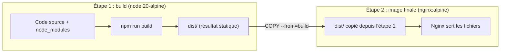

# Chapitre 15 — Dockeriser React en production (multi-stage build)

**Niveau : Intermédiaire**

---

## Introduction

Une application React, une fois construite (`npm run build`), n'est plus qu'un tas de fichiers HTML, CSS et JavaScript statiques — elle n'a plus besoin de Node.js pour **fonctionner**, seulement pour être **construite**. Ce chapitre exploite cette distinction avec le premier vrai **build multi-étapes** du manuel (annoncé au chapitre 6, section 6.1) : une étape avec Node.js pour construire, une étape finale avec Nginx seul pour servir — sans jamais embarquer Node.js dans l'image livrée.

---

## 🎯 Objectifs pédagogiques

À la fin de ce chapitre, tu sauras :
- expliquer pourquoi une image de production React n'a besoin ni de Node.js ni de `node_modules` ;
- écrire un Dockerfile multi-étapes avec `AS build` et `COPY --from=build` ;
- configurer Nginx pour servir correctement une application React avec routage côté client ;
- expliquer pourquoi les variables d'environnement React sont figées **au moment du build**, contrairement aux variables d'un backend lues au **lancement** (chapitre 9) — une différence qui piège souvent les développeurs backend découvrant le frontend.

## 📋 Prérequis

Chapitres 6 (section 6.1, multi-stage) et 14.

## Pourquoi ce chapitre est important

Le patron construit ici — build multi-étapes, Nginx pour servir du statique, `try_files` pour le routage côté client — est directement réutilisé dans le chapitre 20 (application full stack) et dans chaque projet de la Partie X qui comporte un frontend React.

---

## Concepts fondamentaux

1. **Le problème de l'approche naïve** — une seule étape garde tout Node.js inutilement.
2. **Build multi-étapes** — construire avec Node, servir avec Nginx.
3. **`try_files`** — pourquoi une SPA a besoin d'une configuration Nginx spécifique.
4. **Variables d'environnement au build vs au runtime** — la différence capitale avec un backend.

---

## 15.1 Le problème de l'approche naïve

```dockerfile
# ❌ Approche naïve — À NE PAS FAIRE
FROM node:20
WORKDIR /app
COPY package.json package-lock.json ./
RUN npm ci
COPY . .
RUN npm run build
CMD ["npx", "serve", "-s", "dist"]
```

Cette approche **fonctionne**, mais l'image finale contient : Node.js et npm complets (inutiles une fois le build terminé), tout `node_modules` — y compris les outils de développement (Vite, plugins de build) qui ne servent plus à rien après `npm run build` — et le code source non compilé, en plus du résultat compilé.

> ⚠️ **Attention** — Une fois `npm run build` exécuté, son seul résultat utile est le dossier `dist/` (des fichiers statiques). Tout le reste — Node.js, `node_modules`, le code source JSX non transpilé — n'a plus aucune utilité à l'exécution, et pourtant resterait présent dans l'image, gonflant sa taille (souvent plusieurs centaines de mégaoctets superflus) et sa surface d'attaque (chapitre 26).

---

## 15.2 Le multi-stage build

```dockerfile
# Étape 1 : construction (utilise Node.js, jamais livrée telle quelle)
FROM node:20-alpine AS build
WORKDIR /app
COPY package.json package-lock.json ./
RUN npm ci
COPY . .
RUN npm run build

# Étape 2 : servir les fichiers statiques (Nginx seul, PAS de Node.js)
FROM nginx:1.27-alpine
COPY --from=build /app/dist /usr/share/nginx/html
COPY nginx.conf /etc/nginx/conf.d/default.conf
EXPOSE 80
CMD ["nginx", "-g", "daemon off;"]
```

**Explication, ligne par ligne :**
```text
FROM node:20-alpine AS build
→ démarre une première étape, nommée "build" (rappel du chapitre 6, section 6.1),
  avec Node.js — cette étape n'apparaîtra JAMAIS dans l'image finale

RUN npm run build
→ produit le dossier "dist/" (fichiers statiques compilés), à l'intérieur de CETTE étape

FROM nginx:1.27-alpine
→ démarre une SECONDE étape, entièrement indépendante de la première :
  aucune trace de Node.js, aucune couche de la première étape n'est héritée

COPY --from=build /app/dist /usr/share/nginx/html
→ copie UNIQUEMENT le résultat "/app/dist" de l'étape "build", vers le dossier
  où Nginx sert ses fichiers statiques par défaut. C'est la seule chose qui
  "traverse" d'une étape à l'autre — jamais Node.js, jamais node_modules
```


**Explication du schéma :** l'étape 1 est un **échafaudage temporaire**, jamais publié — comme l'échafaudage d'un chantier, démonté une fois le bâtiment achevé. Seul le résultat (`dist/`) traverse vers l'image finale, radicalement plus légère.

> 📌 **À retenir** — `docker images` (chapitre 5) ne montre jamais l'image intermédiaire `node:20-alpine AS build` comme une image distincte utilisable — elle existe temporairement pendant `docker build`, sert de source à `COPY --from=build`, puis n'apparaît dans aucune image finale. Comparer la taille d'une image construite en une seule étape (section 15.1) à celle construite en deux étapes rend cette économie immédiatement visible (laboratoire 2).

---

## 15.3 `try_files` : pourquoi une SPA a besoin d'une config Nginx spécifique

```nginx
# [nginx.conf]
server {
    listen 80;
    root /usr/share/nginx/html;
    index index.html;

    location / {
        try_files $uri $uri/ /index.html;
    }
}
```

**Le problème que `try_files` résout :** une application React avec routage côté client (React Router, par exemple) gère des URL comme `/produits/42` **entièrement dans le navigateur**, en JavaScript — aucun fichier `produits/42.html` n'existe réellement sur le serveur. Sans configuration particulière, un utilisateur qui **recharge** la page sur `/produits/42` (ou y accède directement par un lien partagé) provoque une requête serveur classique vers ce chemin — que Nginx, cherchant un fichier physique inexistant, rejette par une erreur `404`.

**Explication de `try_files $uri $uri/ /index.html` :**
```text
$uri
→ tente d'abord de servir le fichier exact demandé (utile pour /style.css, /logo.png...)

$uri/
→ tente ensuite un dossier de ce nom (rarement utile pour une SPA, présent par convention)

/index.html
→ si rien de tout cela n'existe, sert TOUJOURS index.html en dernier recours —
  charge alors l'application React, qui lit elle-même l'URL demandée
  et affiche la bonne page CÔTÉ CLIENT, en JavaScript
```

> ❌ **Erreur fréquente** — Oublier `try_files` (ou une configuration équivalente) est la cause n°1 des "404 au rechargement de page" sur une SPA React déployée derrière Nginx — une erreur totalement absente en développement (le serveur de développement Vite/webpack gère nativement ce cas), ce qui la rend d'autant plus surprenante en première mise en production. Approfondi comme scénario de dépannage complet au chapitre 48.

---

## 15.4 Variables d'environnement : build-time, pas runtime

> ⚠️ **Attention — la différence la plus piégeuse de ce chapitre, à l'opposé du chapitre 9** — Pour un backend (chapitre 9), `-e` au lancement suffit à changer une configuration : la variable est lue **à l'exécution**, par le processus Node.js qui tourne en continu. Pour une application React construite avec Vite ou un outil équivalent, les variables d'environnement préfixées (`VITE_*` avec Vite, `REACT_APP_*` avec Create React App) sont **injectées directement dans le code JavaScript compilé, au moment de `npm run build`** — le résultat est un fichier statique, sans aucun processus qui pourrait "lire" une variable au moment où un navigateur le charge. **Changer une variable après le build n'a strictement aucun effet tant que l'image n'est pas reconstruite.**

```dockerfile
FROM node:20-alpine AS build
WORKDIR /app
COPY package.json package-lock.json ./
RUN npm ci
COPY . .
ARG VITE_API_URL
ENV VITE_API_URL=$VITE_API_URL
RUN npm run build

FROM nginx:1.27-alpine
COPY --from=build /app/dist /usr/share/nginx/html
COPY nginx.conf /etc/nginx/conf.d/default.conf
EXPOSE 80
CMD ["nginx", "-g", "daemon off;"]
```

```bash
# [Terminal] — la variable doit être fournie AU BUILD, pas au run
docker build --build-arg VITE_API_URL=https://api.exemple.ht -t frontend-react .
```

**Explication :**
```text
ARG VITE_API_URL
→ rend la valeur disponible PENDANT la construction (rappel chapitre 6, section 6.5)

ENV VITE_API_URL=$VITE_API_URL
→ expose cette même valeur comme variable d'environnement DURANT l'exécution
  de "RUN npm run build" — c'est Vite, lisant cette variable AU MOMENT du build,
  qui l'intègre dans le JavaScript compilé
```

| | Backend Express (chapitre 9) | Frontend React (ce chapitre) |
|---|---|---|
| Où la variable est fixée | Au lancement du conteneur (`-e`) | À la construction de l'image (`--build-arg`) |
| Modifiable sans reconstruire l'image | **Oui** | **Non** |
| Visible dans le code livré | Non (lue dynamiquement par le processus) | **Oui**, en clair dans le JavaScript compilé, visible par quiconque ouvre les outils de développement du navigateur |

> ⚠️ **Attention — conséquence de sécurité directe** — Parce qu'une variable `VITE_*`/`REACT_APP_*` finit en clair dans le code livré au navigateur, **aucun secret réel** (clé d'API privée, mot de passe) ne doit jamais y être placé — seules des valeurs déjà destinées à être publiques (l'URL d'une API publique, une clé publique de service tiers) ont leur place ici. Un vrai secret nécessaire au frontend doit transiter par un backend qui le garde privé, jamais directement exposé au navigateur. Ce point est repris au chapitre 26.

---

## Erreurs fréquentes (récapitulatif du chapitre)

| Erreur | Cause | Solution |
|---|---|---|
| Image de plusieurs centaines de Mo pour une simple SPA | Une seule étape de build, Node.js resté dans l'image finale | Passer à un vrai multi-stage build (section 15.2) |
| 404 au rechargement d'une page interne de l'application | `try_files` absent de la configuration Nginx | Ajouter `try_files $uri $uri/ /index.html;` |
| Une variable d'environnement changée au lancement (`-e`) n'a aucun effet visible | Confusion entre variable build-time (React) et runtime (backend) | Reconstruire l'image avec `--build-arg` pour toute variable frontend |
| Un secret apparaît en clair dans le JavaScript livré au navigateur | Secret placé par erreur dans une variable `VITE_*`/`REACT_APP_*` | Ne jamais y placer de secret réel ; le faire transiter par un backend |

---

## Laboratoire pratique n°1 — Construire l'image multi-étapes

**Objectifs :** exécuter le multi-stage build de bout en bout.
**Prérequis :** Chapitre 14.

**Étapes :** crée un projet React minimal (`npm create vite@latest` en local, ou réutilise un projet existant), ajoute le Dockerfile et le `nginx.conf` de ce chapitre, construis (`docker build -t frontend-react .`) et lance (`docker run -d -p 8080:80 frontend-react`).

**Résultat attendu :** l'application React s'affiche sur `http://localhost:8080`.

---

## Laboratoire pratique n°2 — Comparer la taille : naïf vs multi-stage

**Objectifs :** mesurer concrètement l'économie du multi-stage build.
**Prérequis :** Laboratoire 1 complété.

**Étapes :**
1. Construis aussi l'image naïve de la section 15.1, sous un tag différent (`frontend-react:naif`).
2. `docker images` et compare les deux tailles.

**Résultat attendu :** l'image multi-étapes doit être nettement plus petite (souvent un facteur de 5 à 10, selon le projet) — une démonstration directe, pas seulement une affirmation théorique.

---

## Laboratoire pratique n°3 — Reproduire puis corriger le 404 au rechargement

**Objectifs :** vivre le piège de la section 15.3 avant de le corriger.
**Prérequis :** Laboratoires 1 et 2 complétés.

**Étapes :**
1. Retire temporairement `try_files` du `nginx.conf` (remplace par `location / { }` vide, ou une configuration Nginx par défaut sans fallback).
2. Reconstruis, relance, et navigue vers une route interne de l'application (si un routage client existe dans le projet de test) ou simule en accédant directement à une URL du type `/une-route-quelconque`.
3. Observe le `404`.
4. Restaure `try_files`, reconstruis, et confirme la correction.

**Résultat attendu :** le passage d'un échec reproductible à une correction vérifiée.

---

## Exercices

1. Explique pourquoi l'étape `AS build` n'apparaît jamais dans l'image finale livrée.
2. Que copie exactement `COPY --from=build /app/dist /usr/share/nginx/html` ?
3. Pourquoi une SPA React a-t-elle besoin de `try_files`, contrairement à un site strictement statique sans routage côté client ?
4. Pourquoi changer une variable `VITE_API_URL` avec `docker run -e` n'a-t-il aucun effet sur une image déjà construite ?
5. Pourquoi ne faut-il jamais placer un vrai secret dans une variable `VITE_*` ou `REACT_APP_*` ?

---

## Quiz

**Question 1.** Dans un Dockerfile multi-étapes, l'image finale livrée contient :
a) Toutes les étapes empilées, y compris Node.js
b) Uniquement ce qui est explicitement copié depuis une étape précédente via `COPY --from=`
c) Uniquement la première étape
d) Le contenu de toutes les étapes, sauf la dernière

**Question 2.** `try_files $uri $uri/ /index.html;` sert à :
a) Accélérer le chargement des images
b) Rediriger toute requête vers un fichier physique inexistant vers `index.html`, permettant au routage côté client de fonctionner
c) Bloquer l'accès aux routes non définies
d) Compresser les fichiers JavaScript

**Question 3.** Une variable `VITE_API_URL` définie avec `docker run -e VITE_API_URL=...` sur une image déjà construite :
a) Change immédiatement le comportement de l'application
b) N'a aucun effet, la valeur a déjà été figée dans le code au moment du build
c) Provoque une erreur de démarrage
d) Remplace automatiquement l'ancienne valeur dans le JavaScript déjà compilé

**Question 4.** Un secret placé dans une variable `REACT_APP_*` ou `VITE_*` est :
a) Totalement sécurisé, car chiffré automatiquement
b) Visible en clair dans le code JavaScript livré au navigateur
c) Accessible uniquement côté serveur
d) Automatiquement supprimé avant le build

**Question 5.** L'intérêt principal du multi-stage build pour une application React est :
a) D'accélérer le rendu dans le navigateur
b) De livrer une image finale sans Node.js ni outillage de développement, nettement plus légère
c) De permettre plusieurs versions de React simultanément
d) De remplacer Nginx par Node.js

> 🔑 **Corrigé** — 1: b · 2: b · 3: b · 4: b · 5: b

---

## 📝 Résumé du chapitre

- Une application React construite n'est plus que des fichiers statiques — elle n'a besoin de Node.js que pour être **construite**, jamais pour être **servie**.
- Un Dockerfile multi-étapes (`FROM ... AS build` puis `COPY --from=build`) ne livre que le résultat de la construction, jamais l'outillage utilisé pour y arriver — un gain de taille directement mesurable.
- `try_files $uri $uri/ /index.html;` est indispensable pour qu'une application avec routage côté client ne renvoie pas de 404 au rechargement d'une route interne.
- Les variables d'environnement d'une application React sont figées **au moment du build** (`--build-arg`), jamais lisibles dynamiquement au lancement contrairement à un backend — et finissent visibles en clair dans le navigateur, donc jamais adaptées à un vrai secret.

## ✅ Checklist avant de passer au chapitre 16

- [ ] J'ai construit une image React multi-étapes fonctionnelle.
- [ ] Je sais expliquer pourquoi l'image finale ne contient pas Node.js.
- [ ] Je sais pourquoi `try_files` est nécessaire pour une SPA.
- [ ] Je sais pourquoi une variable frontend doit être fournie au build, pas au run.
- [ ] J'ai réalisé les trois laboratoires de ce chapitre.
- [ ] J'ai obtenu au moins 4/5 au quiz.

---

## Glossaire du chapitre

**Build multi-étapes (multi-stage build)**
Définition simple : un Dockerfile avec plusieurs `FROM`, où seul le résultat choisi d'une étape est copié dans la suivante (rappel du chapitre 6).
Voir : Chapitre 6, section 6.1 ; Chapitre 15, section 15.2.

**`try_files` (Nginx)**
Définition simple : la directive Nginx qui tente plusieurs chemins dans l'ordre avant un dernier recours.
Voir : Chapitre 15, section 15.3.

**SPA (Single Page Application)**
Définition simple : une application web qui charge une seule page HTML puis gère la navigation entièrement en JavaScript côté client.
Voir : Chapitre 15, section 15.3.

---

## ❓ FAQ

**Peut-on utiliser le même patron multi-stage pour Vue ou Angular ?**
Oui — le principe est identique quel que soit le framework frontend : une étape Node.js construit les fichiers statiques, une étape Nginx les sert. Seule la commande de build (`npm run build`) et le dossier de sortie (`dist/`, `build/` selon l'outil) changent.

**Faut-il obligatoirement Nginx pour l'étape finale ?**
Non, tout serveur de fichiers statiques léger conviendrait (Caddy, un simple `serve`) — Nginx est choisi ici pour sa cohérence avec le reste du manuel (chapitre 19) et sa position dominante en production.

**Pourquoi `node:20-alpine` pour le build mais `nginx:1.27-alpine` pour la finale, et pas juste `nginx:1.27` ?**
Rappel du chapitre 5 : `alpine` réduit la taille à chaque étape où c'est possible — y compris pour l'image finale, qui bénéficie du même raisonnement que l'image de build.

---

## Références officielles

- Build multi-étapes — [docs.docker.com/build/building/multi-stage](https://docs.docker.com/build/building/multi-stage/)
- Documentation Vite — variables d'environnement — [vite.dev/guide/env-and-mode](https://vite.dev/guide/env-and-mode.html)
- Nginx `try_files` — [nginx.org/en/docs/http/ngx_http_core_module.html#try_files](https://nginx.org/en/docs/http/ngx_http_core_module.html#try_files)

---

## Conclusion

Frontend et backend savent désormais chacun être dockerisés correctement, avec leurs contraintes propres. Le chapitre 16 s'attaque à la troisième brique commune à presque tous les projets du manuel : la base de données MySQL, cette fois avec toute la rigueur de configuration qu'elle mérite.

---

⬅️ [Chapitre 14 — Dockeriser Node.js/Express](14-dockeriser-nodejs-express.md) · ➡️ **Suite : Chapitre 16 — Dockeriser MySQL**
