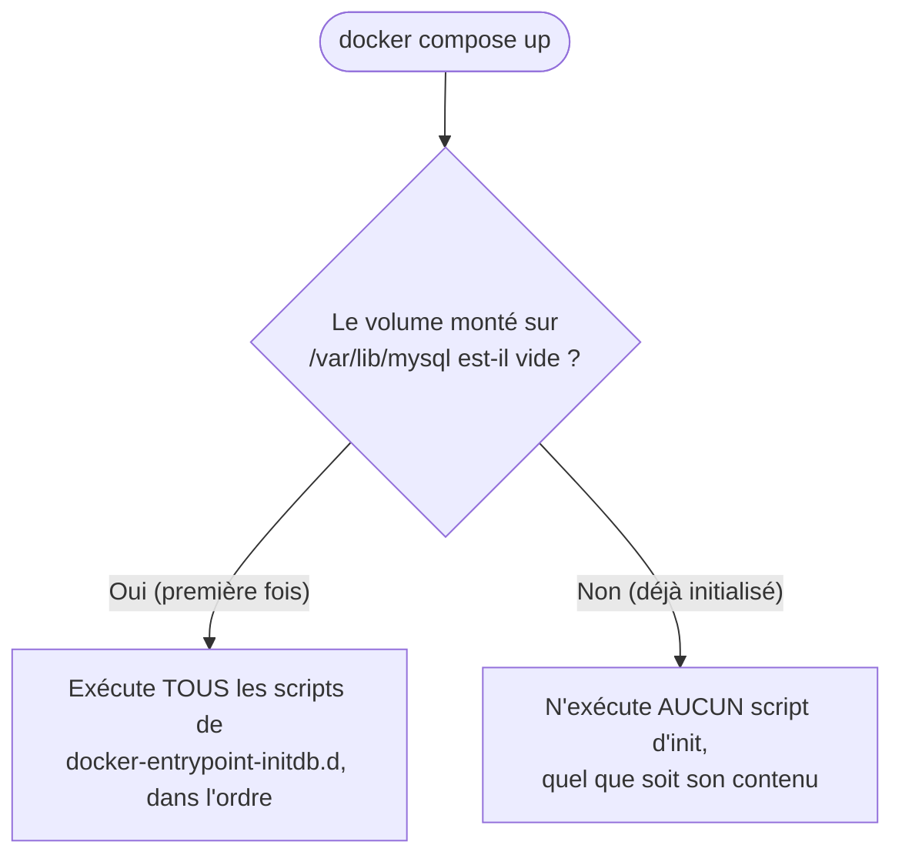

# Chapitre 16 — Dockeriser MySQL

**Niveau : Intermédiaire**

---

## Introduction

Le chapitre 10 a déjà résolu le problème central d'une base de données conteneurisée — la persistance, avec un volume. Ce chapitre couvre tout ce qui restait en suspens autour de MySQL précisément : les variables d'environnement qui créent automatiquement une base et un utilisateur, les scripts d'initialisation exécutés une seule fois, et un piège très concret qui en découle.

---

## 🎯 Objectifs pédagogiques

À la fin de ce chapitre, tu sauras :
- configurer un conteneur MySQL avec les bonnes variables d'environnement pour créer automatiquement une base et un utilisateur applicatif ;
- écrire des scripts d'initialisation exécutés au premier démarrage via `docker-entrypoint-initdb.d` ;
- expliquer pourquoi ces scripts ne se réexécutent **jamais** une fois le volume déjà initialisé, et pourquoi c'est un piège fréquent ;
- personnaliser la configuration MySQL avec un fichier `my.cnf` ;
- te connecter à un MySQL conteneurisé depuis l'hôte, en développement, en toute connaissance des implications vues au chapitre 11.

## 📋 Prérequis

Chapitre 10 (volumes, déjà appliqués à MySQL) et Chapitre 11 (réseaux).

## Pourquoi ce chapitre est important

Chaque projet complet de ce manuel qui utilise MySQL (chapitre 42, par exemple) reprend directement ce patron de configuration. Le piège des scripts d'initialisation non réexécutés, en particulier, est une source réelle et récurrente de confusion ("mon script de seed ne s'exécute pas") si on ne sait pas exactement pourquoi.

---

## Concepts fondamentaux

1. **Variables d'environnement MySQL** — création automatique de base et d'utilisateur.
2. **`docker-entrypoint-initdb.d`** — scripts exécutés une seule fois, à la toute première initialisation.
3. **Configuration personnalisée** — `my.cnf`.
4. **Connexion depuis l'hôte** — utile en développement, à proscrire au-delà (rappel chapitre 11).

---

## 16.1 Variables d'environnement MySQL

```bash
# [Terminal]
docker run -d --name mysql-projet \
  -e MYSQL_ROOT_PASSWORD=motdepasse_root \
  -e MYSQL_DATABASE=app \
  -e MYSQL_USER=app_user \
  -e MYSQL_PASSWORD=motdepasse_app \
  -v mysql-projet-data:/var/lib/mysql \
  mysql:8
```

| Variable | Rôle | Obligatoire ? |
|---|---|---|
| `MYSQL_ROOT_PASSWORD` | Mot de passe du compte `root` MySQL | Oui (sauf `MYSQL_ALLOW_EMPTY_PASSWORD`, à éviter — voir plus bas) |
| `MYSQL_DATABASE` | Nom d'une base créée automatiquement au premier démarrage | Non, mais quasi systématique en pratique |
| `MYSQL_USER` | Nom d'un utilisateur applicatif créé automatiquement | Non |
| `MYSQL_PASSWORD` | Mot de passe de cet utilisateur applicatif | Requis si `MYSQL_USER` est fourni |
| `MYSQL_ALLOW_EMPTY_PASSWORD` | Autorise un `root` sans mot de passe | **Jamais en pratique**, y compris en développement (rappel du chapitre 26 à venir) |
| `MYSQL_RANDOM_ROOT_PASSWORD` | Génère un mot de passe root aléatoire, affiché une seule fois dans les logs au démarrage | Alternative valable à `MYSQL_ROOT_PASSWORD` fixe |

> 📌 **À retenir** — `MYSQL_USER` et `MYSQL_PASSWORD` créent un compte **distinct de `root`**, avec des droits limités à la base désignée par `MYSQL_DATABASE` — exactement le compte qu'une application backend doit utiliser pour se connecter (jamais `root` directement depuis le code applicatif, un principe de moindre privilège repris au chapitre 26).

> ⚠️ **Attention** — Ces variables ne produisent leur effet **qu'au tout premier démarrage**, quand le volume monté sur `/var/lib/mysql` est encore vide. Si `mysql-projet-data` existe déjà avec des données (d'un lancement précédent), MySQL démarre normalement mais **ignore silencieusement** `MYSQL_DATABASE`/`MYSQL_USER`/`MYSQL_PASSWORD` — aucune nouvelle base ni aucun nouvel utilisateur ne sera créé, sans message d'erreur explicite. C'est la même logique que la section suivante, et une source réelle de confusion si elle n'est pas connue à l'avance.

---

## 16.2 Scripts d'initialisation : `docker-entrypoint-initdb.d`

L'image officielle MySQL exécute automatiquement, **au tout premier démarrage seulement**, tout fichier `.sh`, `.sql` ou `.sql.gz` placé dans `/docker-entrypoint-initdb.d/` à l'intérieur du conteneur — dans l'ordre alphabétique de leurs noms.

```text
projet/
├── init/
│   ├── 01-schema.sql
│   └── 02-seed.sql
└── compose.yaml
```

`init/01-schema.sql` :
```sql
CREATE TABLE IF NOT EXISTS produits (
    id INT AUTO_INCREMENT PRIMARY KEY,
    nom VARCHAR(100) NOT NULL,
    prix DECIMAL(10,2) NOT NULL
);
```

`init/02-seed.sql` :
```sql
INSERT INTO produits (nom, prix) VALUES ('Café', 150.00), ('Thé', 100.00);
```

```yaml
# [compose.yaml, extrait]
services:
  db:
    image: mysql:8
    environment:
      MYSQL_ROOT_PASSWORD: motdepasse_root
      MYSQL_DATABASE: app
    volumes:
      - db-data:/var/lib/mysql
      - ./init:/docker-entrypoint-initdb.d

volumes:
  db-data:
```

**Explication :** `./init:/docker-entrypoint-initdb.d` est un **bind mount** (chapitre 10) — les scripts restent sur l'hôte, visibles et modifiables directement, exécutés par MySQL au premier démarrage seulement. Le préfixe numérique (`01-`, `02-`) garantit l'ordre d'exécution : le schéma avant les données qui en dépendent.

> ❌ **Erreur fréquente, le vrai piège de ce chapitre** — Un développeur ajoute un troisième script `03-nouvelle-table.sql` **après** un premier démarrage déjà effectué, relance `docker compose up -d`, et constate que la nouvelle table n'a **pas été créée**. Ce n'est pas un bug : `docker-entrypoint-initdb.d` ne s'exécute **qu'une seule fois**, à l'initialisation du volume — un volume déjà peuplé (même par un seul script précédent) ne redéclenche jamais ces scripts, quels que soient les nouveaux fichiers ajoutés depuis.



**Solution pour rejouer une initialisation modifiée** (en développement uniquement — jamais sur des données réelles, rappel du chapitre 10) :
```bash
# [Terminal] — repartir d'un volume vide pour retester l'initialisation
docker compose down -v   # ⚠️ supprime les données existantes (rappel chapitre 12)
docker compose up -d
```

> 📌 **À retenir** — En production, une nouvelle table ou une modification de schéma sur une base déjà initialisée passe par une **migration** (un outil dédié comme Prisma Migrate, Flyway, ou des scripts SQL exécutés manuellement une fois), jamais par un ajout naïf dans `docker-entrypoint-initdb.d` — approfondi au chapitre 36 (bases de données en production).

---

## 16.3 Configuration personnalisée avec `my.cnf`

```ini
# [config/custom.cnf]
[mysqld]
character-set-server = utf8mb4
collation-server = utf8mb4_unicode_ci
max_connections = 200
```

```yaml
# [compose.yaml, extrait]
services:
  db:
    image: mysql:8
    volumes:
      - db-data:/var/lib/mysql
      - ./config/custom.cnf:/etc/mysql/conf.d/custom.cnf
```

**Explication :** MySQL charge automatiquement tout fichier `.cnf` placé dans `/etc/mysql/conf.d/` — un bind mount suffit à appliquer une configuration personnalisée sans reconstruire d'image ni modifier l'image officielle.

```bash
# [Terminal] — vérifier qu'une valeur personnalisée est bien prise en compte
docker compose exec db mysql -uroot -pmotdepasse_root -e "SHOW VARIABLES LIKE 'max_connections';"
```

---

## 16.4 Se connecter depuis l'hôte, en développement

```yaml
# [compose.yaml, extrait — développement UNIQUEMENT]
services:
  db:
    image: mysql:8
    ports:
      - "3306:3306"
```

```bash
# [Terminal] — avec un client MySQL installé localement
mysql -h 127.0.0.1 -P 3306 -uapp_user -pmotdepasse_app app
```

> ⚠️ **Attention — rappel direct du chapitre 11, section 11.6** — Publier le port 3306 (`-p 3306:3306` ou son équivalent Compose `ports:`) est pratique en développement local (pour utiliser un client graphique comme MySQL Workbench ou DBeaver, par exemple), mais **ne doit jamais être fait sur un serveur de production accessible depuis Internet** — un backend applicatif, lui, doit toujours se connecter via le réseau Docker interne et le nom du service (`db`), jamais via un port publié. Ce chapitre utilise `ports:` uniquement pour ce cas de développement local explicite ; les projets de production de ce manuel (Partie X) ne le font jamais.

---

## Erreurs fréquentes (récapitulatif du chapitre)

| Erreur | Cause | Solution |
|---|---|---|
| `MYSQL_DATABASE`/`MYSQL_USER` semblent ignorés | Volume déjà initialisé lors d'un lancement précédent | Ces variables n'agissent qu'à la toute première initialisation ; repartir d'un volume vide en développement si nécessaire |
| Un nouveau script d'init n'a aucun effet | `docker-entrypoint-initdb.d` déjà exécuté une fois pour ce volume | Ne jamais compter sur ce mécanisme pour des évolutions de schéma après la première initialisation — utiliser une vraie migration |
| Connexion refusée depuis l'hôte malgré `-p 3306:3306` | MySQL encore en cours d'initialisation (rappel chapitre 13, `depends_on`) | Attendre quelques secondes, ou vérifier les logs (chapitre 22) |
| Configuration personnalisée (`my.cnf`) sans effet visible | Fichier placé au mauvais endroit, ou conteneur non redémarré après modification | Vérifier le chemin exact `/etc/mysql/conf.d/`, redémarrer le conteneur après toute modification |

---

## Laboratoire pratique n°1 — Base et utilisateur créés automatiquement

**Objectifs :** vérifier la section 16.1 par l'expérience.
**Prérequis :** Chapitre 10.

**Étapes :** lance le conteneur de la section 16.1, puis vérifie avec `docker exec -it mysql-projet mysql -uapp_user -pmotdepasse_app app -e "SHOW TABLES;"` que la connexion réussit avec le compte applicatif, limité à la base `app`.

**Résultat attendu :** connexion réussie, base `app` accessible avec le compte `app_user`.

---

## Laboratoire pratique n°2 — Vivre le piège des scripts d'initialisation

**Objectifs :** reproduire concrètement l'erreur de la section 16.2, avant de la comprendre en théorie seulement.
**Prérequis :** Laboratoire 1 complété.

**Étapes :**
1. Mets en place la structure de la section 16.2 (`init/01-schema.sql`, `init/02-seed.sql`), lance avec `docker compose up -d`.
2. Vérifie que `produits` contient bien deux lignes.
3. Ajoute un `init/03-nouvelle-table.sql` créant une table `categories`, relance `docker compose up -d` (sans `-v`).
4. Vérifie que `categories` **n'existe pas** malgré le nouveau script.
5. `docker compose down -v` puis `docker compose up -d` de nouveau, et confirme cette fois que `categories` a été créée.

**Résultat attendu :** compréhension vécue, pas seulement lue, de la portée exacte de "une seule fois, à l'initialisation".

---

## Laboratoire pratique n°3 — Personnaliser la configuration MySQL

**Objectifs :** appliquer et vérifier une configuration personnalisée (section 16.3).
**Prérequis :** Laboratoires 1 et 2 complétés.

**Étapes :** ajoute le fichier `config/custom.cnf` avec une valeur de ton choix (par exemple `max_connections = 150`), monte-le, redémarre, et vérifie la valeur avec `SHOW VARIABLES LIKE '...'`.

**Résultat attendu :** la valeur personnalisée apparaît bien, différente de la valeur par défaut de l'image officielle.

---

## Exercices

1. Explique la différence entre le compte créé par `MYSQL_ROOT_PASSWORD` et celui créé par `MYSQL_USER`/`MYSQL_PASSWORD`.
2. Pourquoi un backend applicatif ne devrait-il jamais se connecter à MySQL avec le compte `root` ?
3. Un script d'initialisation ajouté après le premier démarrage n'a produit aucun effet. Explique pourquoi, sans relire le chapitre.
4. Pourquoi `-p 3306:3306` est-il acceptable en développement local mais jamais recommandé en production ?
5. Comment MySQL charge-t-il une configuration personnalisée sans modifier l'image officielle ?

---

## Quiz

**Question 1.** `MYSQL_USER` et `MYSQL_PASSWORD` créent :
a) Le compte `root`
b) Un utilisateur applicatif distinct, avec des droits limités à `MYSQL_DATABASE`
c) Un utilisateur système Linux
d) Un nouveau conteneur

**Question 2.** Les scripts de `docker-entrypoint-initdb.d` s'exécutent :
a) À chaque démarrage du conteneur
b) Uniquement à la toute première initialisation d'un volume vide
c) Uniquement si `MYSQL_ROOT_PASSWORD` est absent
d) Jamais automatiquement, il faut les lancer manuellement

**Question 3.** Un nouveau script ajouté à `docker-entrypoint-initdb.d` après un premier démarrage :
a) S'exécute automatiquement au prochain redémarrage
b) Ne s'exécute jamais tant que le volume n'est pas réinitialisé
c) Provoque une erreur bloquante
d) Remplace tous les scripts précédents

**Question 4.** Publier `-p 3306:3306` pour MySQL est acceptable :
a) Uniquement en développement local, jamais en production accessible depuis Internet
b) Dans tous les contextes sans restriction
c) Uniquement si un mot de passe root est défini
d) Jamais, sous aucune circonstance

**Question 5.** Une configuration MySQL personnalisée via `my.cnf` doit être placée dans :
a) `/var/lib/mysql`
b) `/etc/mysql/conf.d/`
c) `/docker-entrypoint-initdb.d/`
d) Le Dockerfile uniquement

> 🔑 **Corrigé** — 1: b · 2: b · 3: b · 4: a · 5: b

---

## 📝 Résumé du chapitre

- `MYSQL_DATABASE`/`MYSQL_USER`/`MYSQL_PASSWORD` créent automatiquement une base et un compte applicatif dédié, distinct de `root` — mais **uniquement au tout premier démarrage** d'un volume vide.
- `docker-entrypoint-initdb.d` exécute des scripts `.sh`/`.sql` une seule fois, à l'initialisation — jamais lors des démarrages suivants, un piège fréquent pour qui ajoute un script après coup.
- Une évolution de schéma sur une base déjà initialisée nécessite une vraie migration, pas un nouveau script d'init.
- Une configuration personnalisée via `my.cnf`, montée dans `/etc/mysql/conf.d/`, s'applique sans modifier l'image officielle.
- Publier le port 3306 reste utile en développement local, mais jamais recommandé en production — rappel direct du chapitre 11.

## ✅ Checklist avant de passer au chapitre 17

- [ ] Je sais configurer MySQL pour créer automatiquement une base et un utilisateur applicatif.
- [ ] J'ai personnellement vécu le piège des scripts d'initialisation non réexécutés.
- [ ] Je sais appliquer une configuration personnalisée via `my.cnf`.
- [ ] Je sais pourquoi publier 3306 est acceptable en développement mais pas en production.
- [ ] J'ai réalisé les trois laboratoires de ce chapitre.
- [ ] J'ai obtenu au moins 4/5 au quiz.

---

## Glossaire du chapitre

**`docker-entrypoint-initdb.d`**
Définition simple : le dossier dont les scripts sont exécutés une seule fois, à la toute première initialisation d'une base MySQL (ou PostgreSQL, avec une convention similaire, chapitre 17) conteneurisée.
Voir : Chapitre 16, section 16.2.

**Migration (base de données)**
Définition simple : un changement contrôlé et tracé du schéma d'une base de données déjà en usage.
Voir : Chapitre 16, section 16.2 ; Chapitre 36.

---

## ❓ FAQ

**Peut-on utiliser un fichier `.sql.gz` (compressé) dans `docker-entrypoint-initdb.d` ?**
Oui, l'image officielle le décompresse et l'exécute automatiquement — utile pour un jeu de données volumineux de démonstration.

**Que se passe-t-il si deux scripts portent le même préfixe numérique ?**
L'ordre devient alors alphabétique sur le reste du nom de fichier — pour un ordre garanti et lisible, préférer des préfixes uniques (`01-`, `02-`, `03-`...).

**MySQL 8 a-t-il des différences de configuration notables par rapport à MySQL 5.7 dans ce contexte Docker ?**
L'authentification par défaut a changé (`caching_sha2_password` plutôt que `mysql_native_password`), sans impact sur les patrons de ce chapitre, mais parfois source d'incompatibilité avec certains anciens clients — mentionné ici pour référence, non approfondi.

---

## Références officielles

- Image officielle MySQL sur Docker Hub — [hub.docker.com/_/mysql](https://hub.docker.com/_/mysql)
- Variables d'environnement et initialisation — documentation intégrée à la page Docker Hub ci-dessus, section "Environment Variables"

---

## Conclusion

MySQL est maintenant configuré avec la même rigueur que le reste du manuel : création automatique, initialisation maîtrisée, configuration personnalisable. Le chapitre 17 applique exactement la même démarche à PostgreSQL, avec un comparatif direct des deux moteurs.

---

⬅️ [Chapitre 15 — Dockeriser React](15-dockeriser-react-multi-stage.md) · ➡️ **Suite : Chapitre 17 — Dockeriser PostgreSQL**
