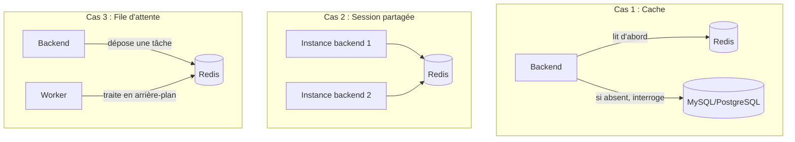

# Chapitre 18 — Ajouter Redis (cache, session, file d'attente)

**Niveau : Intermédiaire**

---

## Introduction

Dernière brique de données de la Partie IV. Redis diffère radicalement de MySQL et PostgreSQL : pas de tables, pas de schéma, juste des paires clé-valeur en mémoire, extrêmement rapides. Ce chapitre couvre ses trois usages les plus courants — cache, session, file d'attente — et une question que MySQL/PostgreSQL ne posaient jamais aussi directement : **cette donnée mérite-t-elle vraiment de survivre à un redémarrage ?**

---

## 🎯 Objectifs pédagogiques

À la fin de ce chapitre, tu sauras :
- expliquer ce qu'est Redis et en quoi il diffère structurellement d'une base de données relationnelle ;
- lancer Redis avec un mot de passe, corrigeant une faille de configuration par défaut réelle et documentée ;
- choisir entre RDB, AOF, ou aucune persistance, selon la nature de la donnée stockée ;
- te connecter avec `redis-cli` et manipuler des clés de base ;
- implémenter un cache simple devant une requête coûteuse vers MySQL.

## 📋 Prérequis

Chapitres 10 (volumes) et 16 (MySQL, réutilisé dans l'exemple de cache).

## Pourquoi ce chapitre est important

Redis apparaît dans une part significative des projets de production de ce portefeuille — cache, sessions partagées entre plusieurs instances backend, files d'attente de traitement asynchrone. Comprendre sa persistance optionnelle, différente de la persistance systématique attendue d'une base de données relationnelle, évite deux erreurs opposées : perdre un cache sans conséquence réelle mais croire à tort que c'est un problème, ou au contraire perdre une vraie file d'attente critique faute d'avoir activé la bonne option.

---

## Concepts fondamentaux

1. **Redis, un magasin clé-valeur en mémoire** — pas une base relationnelle.
2. **Trois cas d'usage** — cache, session, file d'attente.
3. **Sécurité par défaut** — l'absence de mot de passe, un vrai piège.
4. **RDB, AOF, ou rien** — un choix de persistance qui dépend de la donnée.

---

## 18.1 Qu'est-ce que Redis ?

**Redis** (Remote Dictionary Server) stocke des données en **mémoire vive**, sous forme de paires clé-valeur, avec des types simples (chaînes, listes, ensembles, hachages) — pas de tables, pas de colonnes, pas de langage de requête façon SQL. Sa contrepartie : une vitesse de lecture/écriture largement supérieure à une base relationnelle classique, pour des opérations simples.

> 💡 **Analogie** — Si MySQL/PostgreSQL sont une armoire à classeurs bien organisée (chapitre 1, section 1.4, rappel sur RAM vs disque), Redis est un post-it collé sur le bureau : instantanément accessible, mais pas fait pour tout y stocker durablement, et sujet à disparaître si personne ne prend soin de le fixer solidement (la persistance, section 18.4).

---

## 18.2 Trois cas d'usage

**Cache.** Éviter de refaire une requête coûteuse (une agrégation SQL lourde, un appel à une API externe lente) en stockant temporairement son résultat. Exploré en détail en section 18.6.

**Session.** Quand plusieurs instances d'un même backend tournent en parallèle (chapitre 35, performance ; chapitre 37, microservices), stocker la session d'un utilisateur connecté **en mémoire du processus Node.js** poserait un problème : une requête suivante, routée vers une autre instance, ne retrouverait pas cette session. Redis, partagé entre toutes les instances, centralise ces sessions.

**File d'attente (queue).** Différer un traitement (l'envoi d'un email, la génération d'un rapport) plutôt que de le faire attendre l'utilisateur en direct — un backend dépose une tâche dans Redis, un processus séparé (un "worker") la traite en arrière-plan. Des bibliothèques comme BullMQ (Node.js) s'appuient directement sur Redis pour ce patron.



---

## 18.3 Lancer Redis, avec un mot de passe

```bash
# [Terminal]
docker run -d --name redis-projet \
  -e REDIS_PASSWORD=motdepasse_redis \
  redis:7 redis-server --requirepass motdepasse_redis
```

> ⚠️ **Attention — une vraie faille de sécurité par défaut, pas une supposition** — L'image officielle Redis, lancée sans aucune configuration, **n'exige aucun mot de passe**. N'importe quel client capable d'atteindre le port 6379 (rappel du chapitre 11, section 11.6 : ne jamais le publier vers l'extérieur sans réfléchir) peut lire et écrire librement, sans authentification. `--requirepass` (ou une configuration ACL plus fine, hors périmètre de ce manuel) est **la première chose à ajouter**, y compris en développement — un réflexe qui a valeur d'entraînement pour la production, où l'oubli a de vraies conséquences documentées (des instances Redis exposées sans mot de passe ont réellement été compromises sur Internet par le passé).

```bash
# [Terminal] — se connecter avec le mot de passe
docker exec -it redis-projet redis-cli -a motdepasse_redis
```

```text
127.0.0.1:6379> SET ma_cle "bonjour"
OK
127.0.0.1:6379> GET ma_cle
"bonjour"
127.0.0.1:6379> EXPIRE ma_cle 30
(integer) 1
127.0.0.1:6379> TTL ma_cle
(integer) 27
```

**Explication rapide :** `SET`/`GET` manipulent une clé simple ; `EXPIRE` fixe une durée de vie en secondes (`TTL`, Time To Live) — un mécanisme central pour un cache (section 18.6), absent par défaut d'une table SQL classique.

---

## 18.4 RDB, AOF, ou rien : un choix qui dépend de la donnée

| Mécanisme | Fonctionnement | Perte possible en cas de crash | Cas d'usage |
|---|---|---|---|
| **RDB** (snapshot) | Sauvegarde périodique complète (par défaut, activée par l'image officielle selon des règles de fréquence intégrées) | Toutes les écritures depuis le dernier instantané | Cache où une perte de quelques minutes est acceptable |
| **AOF** (append-only file) | Journalise **chaque écriture** au fur et à mesure | Minime (dernières millisecondes selon la configuration) | Files d'attente ou données où chaque écriture compte |
| **Aucune persistance** | Rien n'est écrit sur disque, tout vit uniquement en RAM | **Totale**, à chaque redémarrage du conteneur | Cache pur, où repartir de zéro est normal et sans conséquence |

```bash
# [Terminal] — activer AOF en plus du RDB par défaut, avec un volume pour survivre à un docker rm
docker run -d --name redis-durable \
  -v redis-data:/data \
  redis:7 redis-server --requirepass motdepasse_redis --appendonly yes
```

**Explication :**
```text
-v redis-data:/data
→ monte un volume nommé (chapitre 10) sur le dossier où Redis écrit
  ses fichiers RDB et AOF — sans ce volume, même avec AOF activé,
  tout disparaît à la suppression du conteneur, exactement comme au chapitre 10

--appendonly yes
→ active le journal AOF, en plus des snapshots RDB déjà actifs par défaut
```

> 📌 **À retenir, la vraie question de ce chapitre** — Contrairement à MySQL/PostgreSQL (chapitres 16-17), où la persistance est **toujours** souhaitée, Redis pose une question à trancher consciemment pour chaque usage : **cette donnée mérite-t-elle de survivre à un redémarrage ?** Un cache de résultats de requêtes SQL (section 18.6) : non, sans conséquence réelle — repartir d'un cache vide coûte juste quelques millisecondes de plus le temps qu'il se reconstruise. Une file d'attente de tâches critiques (un email de confirmation de commande jamais envoyé) : oui, absolument, avec AOF et un volume.

---

## 18.5 Exemple : cache devant une requête MySQL coûteuse

```javascript
const redis = require("redis");
const client = redis.createClient({
  url: "redis://:motdepasse_redis@redis:6379", // "redis" = nom du service Compose, chapitre 11/12
});
await client.connect();

async function getProduitsAvecCache() {
  const cle = "produits:liste";

  const enCache = await client.get(cle);
  if (enCache) {
    return { source: "cache", donnees: JSON.parse(enCache) };
  }

  // Simule une requête MySQL coûteuse (rappel chapitre 16)
  const produits = await requeteMySQLCouteuse();

  await client.set(cle, JSON.stringify(produits), { EX: 60 }); // expire après 60 secondes
  return { source: "mysql", donnees: produits };
}
```

**Explication du patron ("cache-aside") :** avant d'interroger MySQL, on vérifie d'abord si le résultat existe déjà dans Redis (`GET`). S'il existe (`enCache`), on le retourne directement — rapide, sans solliciter MySQL. Sinon, on interroge MySQL, puis on **enregistre** le résultat dans Redis avec une expiration (`EX: 60`) avant de le retourner — la prochaine requête, dans les 60 secondes, bénéficiera du cache.

> ⚠️ **Attention** — Ce patron introduit une donnée potentiellement **périmée** pendant la durée de vie du cache (jusqu'à 60 secondes dans cet exemple) : un produit modifié en base pendant ce délai n'apparaîtra pas immédiatement mis à jour pour un utilisateur servi depuis le cache. C'est un compromis assumé, pas un oubli — le bon délai d'expiration dépend de la tolérance réelle de l'application à une donnée légèrement obsolète, à évaluer projet par projet.

---

## Erreurs fréquentes (récapitulatif du chapitre)

| Erreur | Cause | Solution |
|---|---|---|
| N'importe qui peut lire/écrire dans Redis | Aucun mot de passe configuré (comportement par défaut de l'image officielle) | Toujours `--requirepass`, y compris en développement |
| Le cache "disparaît" après un redémarrage, jugé à tort comme un bug | Comportement normal sans volume, ou avec RDB seul sans volume | Décider consciemment : est-ce vraiment un problème pour cet usage précis ? |
| Perte de tâches d'une file d'attente critique | Aucune persistance activée pour une donnée qui l'exigeait | Activer `--appendonly yes` et monter un volume pour tout usage où la perte est inacceptable |
| Un utilisateur voit une donnée manifestement obsolète | Durée de cache (`EX`) trop longue pour la fraîcheur attendue | Ajuster la durée d'expiration selon la tolérance réelle de l'application |

---

## Laboratoire pratique n°1 — Lancer Redis sécurisé et manipuler des clés

**Objectifs :** exécuter les sections 18.3 par toi-même.
**Prérequis :** Chapitre 17.

**Étapes :** lance Redis avec `--requirepass`, connecte-toi avec `redis-cli -a`, exécute `SET`, `GET`, `EXPIRE`, `TTL`.

**Résultat attendu :** manipulation réussie, avec une clé qui expire effectivement après le délai fixé (`GET` renvoie `nil` après expiration).

---

## Laboratoire pratique n°2 — Comparer persistance et absence de persistance

**Objectifs :** vivre concrètement le choix de la section 18.4.
**Prérequis :** Laboratoire 1 complété.

**Étapes :**
1. Lance un Redis **sans** volume, ajoute une clé, `docker rm -f` puis relance : constate la perte.
2. Lance un second Redis **avec** `-v` et `--appendonly yes`, ajoute une clé, `docker rm -f` puis relance avec le même volume : constate la persistance.

**Résultat attendu :** une distinction vécue entre les deux configurations, directement comparable au laboratoire du chapitre 10 mais appliquée consciemment à un choix, pas à une correction d'erreur.

---

## Laboratoire pratique n°3 — Implémenter le cache-aside

**Objectifs :** mettre en œuvre la section 18.5 sur un exemple mesurable.
**Prérequis :** Laboratoires 1 et 2 complétés, backend du chapitre 13 ou 14 disponible.

**Étapes :**
1. Ajoute une route qui simule une opération lente (`await new Promise(r => setTimeout(r, 1000))` avant de répondre).
2. Ajoute la logique de cache-aside de la section 18.5 autour de cette route.
3. Appelle la route deux fois de suite et mesure le temps de réponse de chaque appel (`curl -w "%{time_total}\n"`).

**Résultat attendu :** le premier appel prend environ 1 seconde (simulation de la charge), le second répond quasi instantanément — la preuve mesurée que le cache fonctionne.

---

## Exercices

1. Explique en une phrase la différence fondamentale entre Redis et une base de données relationnelle.
2. Pourquoi l'absence de mot de passe par défaut sur Redis est-elle une vraie faille, pas juste une négligence théorique ?
3. Pour une file d'attente de traitement de paiements, quelle configuration de persistance choisirais-tu, et pourquoi ?
4. Qu'apporte `EXPIRE`/`TTL`, absent d'une table SQL classique ?
5. Pourquoi le patron cache-aside introduit-il un compromis de fraîcheur des données, et comment ce compromis se règle-t-il ?

---

## Quiz

**Question 1.** Redis stocke ses données principalement :
a) Sur disque, comme MySQL
b) En mémoire vive, avec persistance optionnelle
c) Uniquement sur un serveur distant tiers
d) Dans des fichiers CSV

**Question 2.** Par défaut, sans configuration particulière, l'accès à Redis est :
a) Protégé par un mot de passe généré automatiquement
b) Totalement ouvert, sans authentification
c) Impossible sans certificat TLS
d) Limité à un seul client à la fois

**Question 3.** AOF (append-only file) :
a) Sauvegarde périodique complète, avec perte possible depuis le dernier instantané
b) Journalise chaque écriture, minimisant la perte possible en cas de crash
c) Désactive toute persistance
d) Concerne uniquement les sauvegardes MySQL

**Question 4.** Pour un cache pur, dont la perte au redémarrage est acceptable :
a) AOF est obligatoire
b) Aucune persistance n'est nécessaire
c) Un volume est indispensable
d) RDB et AOF doivent être activés ensemble sans exception

**Question 5.** Le patron cache-aside consiste à :
a) Toujours interroger la base de données, jamais le cache
b) Vérifier d'abord le cache, puis interroger la base de données seulement si absent, en mettant à jour le cache ensuite
c) Supprimer systématiquement le cache avant chaque requête
d) Stocker uniquement des sessions, jamais des résultats de requêtes

> 🔑 **Corrigé** — 1: b · 2: b · 3: b · 4: b · 5: b

---

## 📝 Résumé du chapitre

- Redis est un magasin clé-valeur en mémoire, structurellement différent d'une base relationnelle — rapide, sans schéma, avec expiration native (`EXPIRE`/`TTL`).
- Trois cas d'usage courants : cache, session partagée entre instances, file d'attente.
- L'image officielle n'exige aucun mot de passe par défaut — `--requirepass` est un réflexe de sécurité de base, pas une option avancée.
- Le choix de persistance (RDB, AOF, ou rien) dépend de la nature réelle de la donnée : un cache peut légitimement tout perdre au redémarrage, une file d'attente critique ne le peut pas.
- Le patron cache-aside (vérifier le cache, sinon interroger la source puis mettre à jour le cache) introduit un compromis de fraîcheur assumé, réglé par la durée d'expiration choisie.

## ✅ Checklist avant de passer au chapitre 19

- [ ] Je sais lancer Redis avec un mot de passe.
- [ ] Je sais manipuler des clés de base avec `redis-cli`.
- [ ] Je sais choisir consciemment entre RDB, AOF et l'absence de persistance selon l'usage.
- [ ] J'ai implémenté et mesuré un cache-aside fonctionnel.
- [ ] J'ai réalisé les trois laboratoires de ce chapitre.
- [ ] J'ai obtenu au moins 4/5 au quiz.

---

## Glossaire du chapitre

**Redis**
Définition simple : un magasin de données clé-valeur en mémoire, rapide, avec persistance optionnelle.
Voir : Chapitre 18, section 18.1.

**TTL (Time To Live)**
Définition simple : la durée de vie restante d'une clé avant son expiration automatique.
Voir : Chapitre 18, section 18.3.

**Cache-aside**
Définition simple : le patron consistant à vérifier le cache avant la source de vérité, et à mettre à jour le cache après une lecture depuis cette source.
Voir : Chapitre 18, section 18.5.

**RDB / AOF**
Définition simple : les deux mécanismes de persistance de Redis — snapshot périodique (RDB) et journal de chaque écriture (AOF).
Voir : Chapitre 18, section 18.4.

---

## ❓ FAQ

**Redis peut-il remplacer complètement MySQL/PostgreSQL ?**
Non, dans l'écrasante majorité des cas — Redis n'a ni schéma relationnel, ni requêtes complexes façon SQL, ni garanties transactionnelles poussées équivalentes. Il complète une base relationnelle, il ne la remplace pas.

**Faut-il toujours activer AOF par précaution ?**
Non — AOF a un coût réel en performance d'écriture et en espace disque. L'activer pour un cache pur serait une complexité inutile ; le réserver aux données où la perte est réellement inacceptable (section 18.4).

**BullMQ (mentionné en section 18.2) fait-il partie de ce manuel ?**
Non, ce manuel se concentre sur Docker et Redis lui-même — BullMQ (ou toute bibliothèque de file d'attente) est un choix applicatif côté Node.js, qui s'appuie simplement sur le Redis dockerisé dans ce chapitre.

---

## Références officielles

- Image officielle Redis sur Docker Hub — [hub.docker.com/_/redis](https://hub.docker.com/_/redis)
- Persistance Redis (RDB et AOF) — [redis.io/docs/latest/operate/oss_and_stack/management/persistence](https://redis.io/docs/latest/operate/oss_and_stack/management/persistence/)
- Sécurité Redis — [redis.io/docs/latest/operate/oss_and_stack/management/security](https://redis.io/docs/latest/operate/oss_and_stack/management/security/)

---

## Conclusion

Cache, session, file d'attente : les trois bases de données du portefeuille (MySQL, PostgreSQL, Redis) sont maintenant dockerisées avec la rigueur qu'elles méritent chacune. Le chapitre 19 s'attaque à la pièce qui les relie toutes au monde extérieur : Nginx, en reverse proxy complet.

---

⬅️ [Chapitre 17 — Dockeriser PostgreSQL](17-dockeriser-postgresql.md) · ➡️ **Suite : Chapitre 19 — Nginx comme reverse proxy devant plusieurs services**
