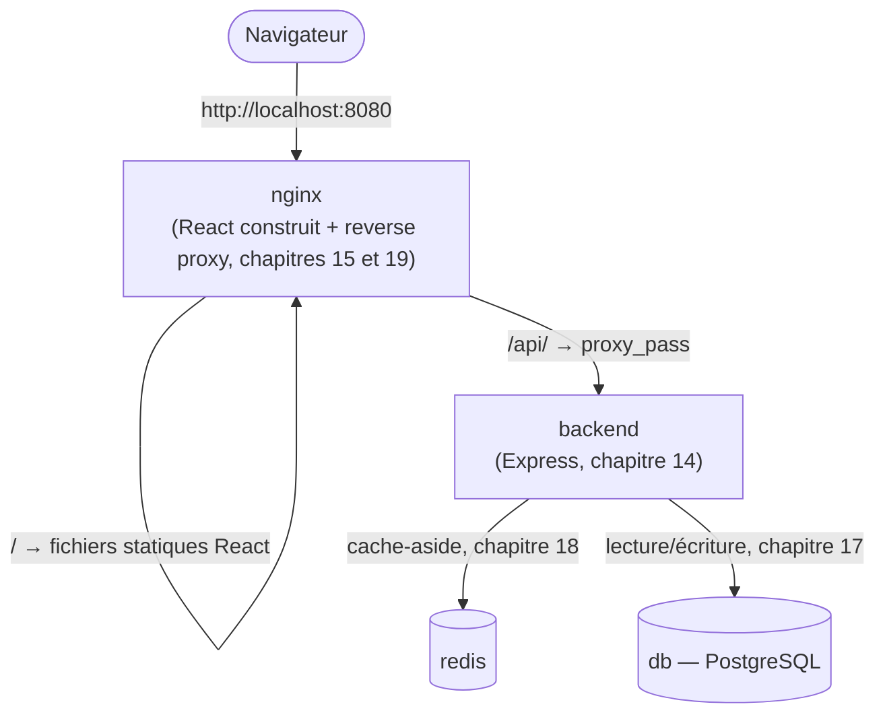

# Chapitre 20 — Assembler une application full stack complète

**Niveau : Intermédiaire**

---

## Introduction

Ce chapitre ferme la Partie IV en assemblant tout ce qu'elle a construit séparément : React (chapitre 15) servi par Nginx (chapitre 19), une API Express (chapitre 14) connectée à PostgreSQL (chapitre 17) avec un cache Redis (chapitre 18). Rien de nouveau à apprendre ici sur le plan conceptuel — seulement la démonstration que chaque brique s'assemble sans friction avec les autres, exactement comme prévu depuis le chapitre 1.

---

## 🎯 Objectifs pédagogiques

À la fin de ce chapitre, tu sauras :
- assembler cinq services Compose (nginx/React, backend, PostgreSQL, Redis) en une seule application cohérente ;
- réutiliser une astuce de build-time (chapitre 15) pour éviter de reconstruire le frontend entre développement et production ;
- implémenter un cache-aside complet, lecture **et** invalidation à l'écriture (extension du chapitre 18) ;
- vérifier de bout en bout qu'une donnée créée depuis le frontend traverse correctement les cinq services.

## 📋 Prérequis

Chapitres 14 à 19 — ce chapitre assemble, il ne réexplique pas.

## Pourquoi ce chapitre est important

C'est l'architecture de référence de ce manuel — celle que le chapitre 44 (Projet 4) et le chapitre 47 (projet final) reprendront directement, agrandie mais jamais fondamentalement différente. Comprendre comment cinq services s'articulent ici rend ces chapitres ultérieurs beaucoup plus rapides à suivre.

---

## 20.1 Architecture cible



Seul `nginx` publie un port vers l'hôte — `backend`, `db` et `redis` restent joignables uniquement via le réseau Compose interne (chapitres 11-12).

---

## 20.2 Arborescence complète

```text
app-complete/
├── frontend/
│   ├── src/
│   │   └── App.jsx
│   ├── index.html
│   ├── package.json
│   ├── Dockerfile
│   └── nginx.conf
├── backend/
│   ├── src/
│   │   └── index.js
│   ├── package.json
│   ├── package-lock.json
│   ├── Dockerfile
│   └── .dockerignore
├── db/
│   └── init/
│       └── 01-schema.sql
├── compose.yaml
├── .env.example
└── .gitignore
```

---

## 20.3 Backend : Express + PostgreSQL + Redis

### `backend/package.json`
```json
{
  "name": "backend",
  "version": "1.0.0",
  "main": "src/index.js",
  "dependencies": {
    "express": "^4.19.0",
    "pg": "^8.11.0",
    "redis": "^4.6.0"
  }
}
```

**Explication :** deux nouvelles dépendances par rapport au chapitre 14 — `pg` (client PostgreSQL, chapitre 17) et `redis` (client Redis, chapitre 18) — rien d'autre ne change dans la logique de construction de l'image (`npm ci`, rappel du chapitre 14).

### `backend/src/index.js`
```javascript
const express = require("express");
const { Pool } = require("pg");
const redis = require("redis");

const app = express();
app.use(express.json());

const pool = new Pool({
  host: process.env.DB_HOST,
  user: process.env.DB_USER,
  password: process.env.DB_PASSWORD,
  database: process.env.DB_NAME,
});

const redisClient = redis.createClient({ url: process.env.REDIS_URL });
redisClient.connect();

const CLE_CACHE_TASKS = "tasks:liste";

app.get("/health", (req, res) => res.json({ status: "ok" }));

app.get("/api/tasks", async (req, res) => {
  const enCache = await redisClient.get(CLE_CACHE_TASKS);
  if (enCache) {
    return res.json({ source: "cache", donnees: JSON.parse(enCache) });
  }
  const { rows } = await pool.query("SELECT * FROM tasks ORDER BY id");
  await redisClient.set(CLE_CACHE_TASKS, JSON.stringify(rows), { EX: 30 });
  res.json({ source: "postgresql", donnees: rows });
});

app.post("/api/tasks", async (req, res) => {
  const { rows } = await pool.query(
    "INSERT INTO tasks (titre) VALUES ($1) RETURNING *",
    [req.body.titre]
  );
  await redisClient.del(CLE_CACHE_TASKS);
  res.status(201).json(rows[0]);
});

app.listen(4000, () => console.log("Backend à l'écoute sur le port 4000"));
```

**Ce qui est nouveau par rapport au chapitre 18 :** la route `POST /api/tasks` **invalide** le cache (`redisClient.del`) après chaque écriture — une pièce manquante du cache-aside minimal du chapitre 18, qui ne montrait que la lecture. Sans cette invalidation, une tâche fraîchement créée resterait invisible dans `GET /api/tasks` jusqu'à l'expiration naturelle du cache (30 secondes ici) — un bug de fraîcheur bien réel si l'invalidation est oubliée.

> 📌 **À retenir** — Le cache-aside complet a **deux** responsabilités, pas une seule : mettre en cache à la lecture (chapitre 18), et **invalider** le cache à toute écriture qui rend son contenu obsolète. Oublier la seconde moitié est une source de bugs de fraîcheur des données fréquente et facile à manquer en revue de code.

### `backend/Dockerfile` (rappel du chapitre 14)
```dockerfile
FROM node:20-alpine
WORKDIR /app
COPY package.json package-lock.json ./
RUN npm ci --omit=dev
COPY src/ ./src/
ENV NODE_ENV=production
EXPOSE 4000
USER node
CMD ["node", "src/index.js"]
```

---

## 20.4 Frontend : React + Nginx, avec l'astuce de l'URL relative

### `frontend/src/App.jsx` (extrait)
```jsx
import { useEffect, useState } from "react";

export default function App() {
  const [taches, setTaches] = useState([]);
  const [titre, setTitre] = useState("");

  const charger = () =>
    fetch(`${import.meta.env.VITE_API_URL}/tasks`)
      .then((r) => r.json())
      .then((d) => setTaches(d.donnees));

  useEffect(() => { charger(); }, []);

  const ajouter = async (e) => {
    e.preventDefault();
    await fetch(`${import.meta.env.VITE_API_URL}/tasks`, {
      method: "POST",
      headers: { "Content-Type": "application/json" },
      body: JSON.stringify({ titre }),
    });
    setTitre("");
    charger();
  };

  return (
    <div>
      <form onSubmit={ajouter}>
        <input value={titre} onChange={(e) => setTitre(e.target.value)} />
        <button type="submit">Ajouter</button>
      </form>
      <ul>{taches.map((t) => <li key={t.id}>{t.titre}</li>)}</ul>
    </div>
  );
}
```

> ⚠️ **Attention — la solution à une limite posée au chapitre 15** — Le chapitre 15 prévenait qu'une variable React (`VITE_API_URL`) est figée au build et ne peut plus changer sans reconstruction. Ici, `VITE_API_URL` vaut simplement `/api` (une URL **relative**, pas un nom de domaine complet) — elle fonctionne à l'identique en développement, en test ou en production, **quel que soit le domaine réel**, puisque le navigateur résout toujours `/api` par rapport à l'origine de la page elle-même. Cette astuce élimine, pour ce cas précis, le besoin de reconstruire l'image entre environnements — une solution élégante à la limite honnêtement posée au chapitre 15, pas un contournement de cette limite.

### `frontend/Dockerfile` (multi-stage, chapitre 15)
```dockerfile
FROM node:20-alpine AS build
WORKDIR /app
COPY package.json package-lock.json ./
RUN npm ci
COPY . .
ARG VITE_API_URL
ENV VITE_API_URL=$VITE_API_URL
RUN npm run build

FROM nginx:1.27-alpine
COPY --from=build /app/dist /usr/share/nginx/html
COPY nginx.conf /etc/nginx/conf.d/default.conf
EXPOSE 80
CMD ["nginx", "-g", "daemon off;"]
```

### `frontend/nginx.conf` (rappel complet du chapitre 19)
```nginx
server {
    listen 80;

    gzip on;
    gzip_types text/plain text/css application/json application/javascript;
    gzip_min_length 1024;

    location /api/ {
        proxy_pass http://backend:4000/api/;
        proxy_set_header Host $host;
        proxy_set_header X-Real-IP $remote_addr;
        proxy_set_header X-Forwarded-For $proxy_add_x_forwarded_for;
        proxy_set_header X-Forwarded-Proto $scheme;
        add_header Cache-Control "no-store";
    }

    location / {
        root /usr/share/nginx/html;
        index index.html;
        try_files $uri $uri/ /index.html;
    }
}
```

---

## 20.5 `db/init/01-schema.sql` (rappel du chapitre 16/17)

```sql
CREATE TABLE IF NOT EXISTS tasks (
    id SERIAL PRIMARY KEY,
    titre VARCHAR(200) NOT NULL,
    creee_le TIMESTAMP DEFAULT NOW()
);
```

---

## 20.6 `compose.yaml` complet

```yaml
services:
  db:
    image: postgres:16
    environment:
      POSTGRES_USER: ${DB_USER}
      POSTGRES_PASSWORD: ${DB_PASSWORD}
      POSTGRES_DB: ${DB_NAME}
      PGDATA: /var/lib/postgresql/data/pgdata
    volumes:
      - db-data:/var/lib/postgresql/data
      - ./db/init:/docker-entrypoint-initdb.d

  redis:
    image: redis:7
    command: redis-server --requirepass ${REDIS_PASSWORD}
    volumes:
      - redis-data:/data

  backend:
    build: ./backend
    environment:
      DB_HOST: db
      DB_USER: ${DB_USER}
      DB_PASSWORD: ${DB_PASSWORD}
      DB_NAME: ${DB_NAME}
      REDIS_URL: redis://:${REDIS_PASSWORD}@redis:6379
    depends_on:
      - db
      - redis

  nginx:
    build:
      context: ./frontend
      args:
        VITE_API_URL: /api
    ports:
      - "8080:80"
    depends_on:
      - backend

volumes:
  db-data:
  redis-data:
```

### `.env.example`
```text
DB_USER=app_user
DB_PASSWORD=changeme
DB_NAME=app
REDIS_PASSWORD=changeme
```

> ⚠️ **Attention, honnêtement signalée avant le chapitre 21** — Ce `compose.yaml` utilise `depends_on` dans sa forme simple (une liste), avec exactement la même limite vécue au chapitre 13 : l'ordre de démarrage des conteneurs est garanti, pas que PostgreSQL ou Redis soient réellement prêts à accepter des connexions. Le chapitre 21 reprend **ce projet précis** pour y ajouter des `HEALTHCHECK` et corriger cette limite définitivement.

---

## 20.7 Construire, lancer, vérifier de bout en bout

```bash
# [Terminal] — depuis app-complete/, après avoir créé .env depuis .env.example
docker compose up -d --build
```

```bash
# [Terminal] — vérifier chaque brique
curl http://localhost:8080/                          # le frontend React se charge
curl http://localhost:8080/api/tasks                  # {"source":"postgresql","donnees":[]}
curl -X POST http://localhost:8080/api/tasks \
  -H "Content-Type: application/json" -d '{"titre":"Première tâche"}'
curl http://localhost:8080/api/tasks                  # {"source":"postgresql","donnees":[{...}]} — cache invalidé, relu depuis PostgreSQL
curl http://localhost:8080/api/tasks                  # {"source":"cache","donnees":[{...}]} — cette fois servi par Redis
```

**Résultat attendu :** le premier `GET` après le `POST` revient à `"source":"postgresql"` (le cache vient d'être invalidé), le suivant revient à `"source":"cache"` — la preuve, en direct, que l'invalidation de la section 20.3 fonctionne exactement comme prévu.

---

## Erreurs fréquentes (récapitulatif du chapitre)

| Erreur | Cause | Solution (renvoi) |
|---|---|---|
| "connect ECONNREFUSED" au tout premier démarrage | Limite de `depends_on` simple, déjà vue au chapitre 13 | Réessayer après quelques secondes ; solution durable au chapitre 21 |
| Une tâche créée n'apparaît pas dans la liste pendant un moment | Invalidation du cache oubliée ou mal implémentée | Vérifier que `redisClient.del` est bien appelé après chaque écriture (section 20.3) |
| Le frontend ne trouve pas l'API en développement local hors Docker | `VITE_API_URL` non fourni hors du contexte du reverse proxy | Rappel du chapitre 15 : cette variable est figée au build, cohérente uniquement dans l'architecture où `/api` est effectivement servi par le même Nginx |
| 404 sur les appels `/api/...` | Piège du slash final dans `proxy_pass` (chapitre 19) | Vérifier la correspondance exacte `location`/`proxy_pass` |

---

## Laboratoire pratique n°1 — Construire et vérifier chaque brique individuellement

**Objectifs :** exécuter les sections 20.1 à 20.6.
**Prérequis :** Chapitres 14 à 19.

**Étapes :** reproduis l'arborescence complète, construis, lance, et vérifie chaque service séparément : `docker compose ps` (tous `Up`), `curl` sur `/health` du backend via `docker compose exec backend wget -qO- localhost:4000/health`, connexion à `db` et `redis` comme aux chapitres 16-18.

**Résultat attendu :** les cinq services (`db`, `redis`, `backend`, `nginx`) actifs et individuellement vérifiés avant le test de bout en bout.

---

## Laboratoire pratique n°2 — Test de bout en bout avec cache-aside complet

**Objectifs :** exécuter et comprendre la section 20.7.
**Prérequis :** Laboratoire 1 complété.

**Étapes :** reproduis exactement la séquence de la section 20.7, en observant attentivement le champ `source` de chaque réponse.

**Résultat attendu :** la séquence `postgresql` → `postgresql` (après invalidation) → `cache` confirmée dans cet ordre précis.

---

## Laboratoire pratique n°3 — Vérifier la persistance de bout en bout

**Objectifs :** confirmer que `db-data` et `redis-data` (chapitre 10) protègent réellement les données de toute la stack.
**Prérequis :** Laboratoires 1 et 2 complétés.

**Étapes :** après avoir créé plusieurs tâches, `docker compose down` (sans `-v`, rappel du chapitre 12), puis `docker compose up -d` de nouveau — vérifie que les tâches créées précédemment sont toujours listées.

**Résultat attendu :** confirmation que toute la Partie II (volumes, chapitre 10) continue de protéger les données même dans une architecture à cinq services.

---

## Exercices

1. Pourquoi seul `nginx` publie-t-il un port vers l'hôte dans ce projet ?
2. Explique pourquoi `VITE_API_URL=/api` (une URL relative) évite le problème de reconstruction identifié au chapitre 15.
3. Que se passerait-il si la route `POST /api/tasks` omettait `redisClient.del` ?
4. Pourquoi ce chapitre signale-t-il une limite de `depends_on` sans encore la corriger ?
5. Trace, de mémoire, le chemin complet d'une requête `GET /api/tasks` depuis le navigateur jusqu'à sa réponse.

---

## Quiz

**Question 1.** Dans cette architecture, `backend` et `db` publient-ils un port vers l'hôte ?
a) Oui, tous les services en publient un
b) Non, seul `nginx` en publie un
c) Seul `db` en publie un
d) Aucun service n'en publie

**Question 2.** `VITE_API_URL=/api` (URL relative) plutôt qu'une URL complète permet :
a) D'éviter toute reconstruction de l'image entre environnements différents, tant que l'architecture reverse proxy reste identique
b) De contourner totalement la limite du chapitre 15
c) De ne jamais avoir besoin de Nginx
d) De stocker un secret en toute sécurité

**Question 3.** Sans l'appel à `redisClient.del` après un `POST`, une tâche nouvellement créée :
a) N'est jamais enregistrée en base de données
b) Peut rester invisible dans `GET /api/tasks` jusqu'à l'expiration naturelle du cache
c) Provoque une erreur systématique
d) Supprime automatiquement le cache existant

**Question 4.** La limite de `depends_on` évoquée dans ce chapitre concerne :
a) Le nombre maximal de services autorisés
b) La garantie de l'ordre de démarrage des conteneurs, sans garantir que le service interne est réellement prêt
c) Les volumes nommés
d) La taille des images construites

**Question 5.** Le chemin d'une requête `GET /api/tasks` traverse, dans l'ordre :
a) Directement le navigateur vers PostgreSQL
b) Navigateur → nginx → backend → (Redis puis, si besoin, PostgreSQL)
c) Navigateur → PostgreSQL → Redis → nginx
d) Navigateur → Redis uniquement

> 🔑 **Corrigé** — 1: b · 2: a · 3: b · 4: b · 5: b

---

## 📝 Résumé du chapitre

- L'architecture de référence de ce manuel assemble cinq services : `nginx` (React construit + reverse proxy), `backend` (Express), `db` (PostgreSQL), `redis` — chacun issu d'un chapitre précédent, sans nouvelle notion Docker introduite ici.
- Une URL relative (`/api`) comme variable de build React élimine, dans une architecture reverse proxy, la limite de reconstruction du chapitre 15 — une solution élégante, pas un contournement.
- Un cache-aside complet exige une invalidation à l'écriture, en plus de la mise en cache à la lecture du chapitre 18 — omettre l'invalidation cause des données visiblement obsolètes.
- La limite de `depends_on` déjà rencontrée au chapitre 13 réapparaît telle quelle sur cette architecture élargie — signalée honnêtement, corrigée au chapitre suivant.

## ✅ Checklist avant de passer au chapitre 21

- [ ] J'ai construit et lancé les cinq services avec succès.
- [ ] J'ai vérifié la séquence complète de cache-aside (postgresql → postgresql → cache).
- [ ] J'ai confirmé la persistance des données après un `docker compose down`/`up`.
- [ ] Je sais expliquer l'astuce de l'URL relative pour les variables de build React.
- [ ] J'ai réalisé les trois laboratoires de ce chapitre.
- [ ] J'ai obtenu au moins 4/5 au quiz.

---

## Glossaire du chapitre

**Invalidation de cache**
Définition simple : la suppression volontaire d'une entrée de cache devenue obsolète après une écriture.
Voir : Chapitre 20, section 20.3 (extension du cache-aside du chapitre 18).

**URL relative (variable de build)**
Définition simple : une variable frontend pointant vers un chemin (`/api`) plutôt qu'un domaine complet, résolue par le navigateur par rapport à l'origine de la page.
Voir : Chapitre 20, section 20.4.

---

## ❓ FAQ

**Pourquoi PostgreSQL plutôt que MySQL (chapitre 13) pour ce projet ?**
Pour couvrir les deux moteurs dans des contextes réels différents au fil du manuel (chapitre 13 avec MySQL, celui-ci avec PostgreSQL) — le patron Compose serait identique avec MySQL, seules les variables d'environnement changeraient (chapitre 16 vs 17).

**Ce projet est-il prêt pour la production telle quelle ?**
Pas encore complètement — il manque les healthchecks (chapitre 21), un vrai déploiement HTTPS (chapitre 30), et les durcissements de sécurité (chapitre 26). C'est une base solide et fonctionnelle, pas encore un livrable final.

**Pourquoi ne pas avoir mis le frontend et le backend dans le même service ?**
Parce que chacun a un cycle de vie de construction différent (chapitre 15 : build React puis servir via Nginx ; chapitre 14 : un processus Node.js continu) — les séparer permet de reconstruire l'un sans toucher à l'autre, comme démontré au chapitre 13, section 13.5.

---

## Références officielles

- Cette section ne cite aucune référence nouvelle — voir les chapitres 14 à 19 pour les références propres à chaque brique assemblée ici.

---

## Conclusion

La Partie IV se termine avec une application complète, fonctionnelle, et vérifiée de bout en bout. La Partie V s'attaque maintenant à la fiabilité de ce démarrage multi-services — le chapitre 21 corrige, une bonne fois pour toutes, la limite de `depends_on` observée deux fois déjà (chapitres 13 et 20).

---

⬅️ [Chapitre 19 — Nginx reverse proxy](19-nginx-reverse-proxy.md) · ➡️ **Suite : Chapitre 21 — Healthchecks et dépendances entre services**
