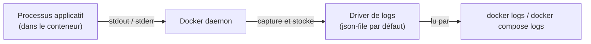

# Chapitre 22 — Consulter et interpréter les logs

**Niveau : Intermédiaire**

---

## Introduction

Première étape de la Partie VI, consacrée à l'exploitation au quotidien d'une application déjà en fonctionnement. Avant de diagnostiquer quoi que ce soit (chapitre 23) ou de nettoyer quoi que ce soit (chapitre 24), il faut savoir **lire** ce qui s'est réellement passé — et les logs en sont, presque toujours, la première et la plus fiable source.

---

## 🎯 Objectifs pédagogiques

À la fin de ce chapitre, tu sauras :
- consulter les logs d'un conteneur avec `docker logs`, en direct ou rétrospectivement ;
- agréger et filtrer les logs de plusieurs services avec `docker compose logs` ;
- rechercher une erreur précise dans un flux de logs volumineux ;
- expliquer pourquoi une application conteneurisée doit toujours écrire ses logs sur la sortie standard, jamais dans un fichier interne ;
- configurer une rotation de logs pour éviter qu'ils ne remplissent silencieusement le disque.

## 📋 Prérequis

Chapitre 13 (Compose).

## Pourquoi ce chapitre est important

Face à n'importe quelle panne du chapitre 48, la toute première action recommandée sera systématiquement de consulter les logs — un réflexe qui ne vaut que si la commande, ses options et la lecture du résultat sont déjà maîtrisées avant d'en avoir un besoin urgent.

---

## Concepts fondamentaux

1. **`docker logs`** — consulter les logs d'un seul conteneur.
2. **`docker compose logs`** — agréger et filtrer plusieurs services.
3. **Rechercher une erreur** — isoler l'information utile dans un flux volumineux.
4. **La convention stdout/stderr** — pourquoi Docker s'attend à ce format.
5. **Rotation des logs** — éviter un remplissage de disque silencieux.

---

## 22.1 `docker logs` : les bases

```bash
# [Terminal]
docker logs backend
```

**Résultat attendu :** l'intégralité des logs produits par le conteneur depuis son démarrage, jusqu'à l'instant présent.

```bash
# [Terminal] — suivre les logs en continu, comme "tail -f"
docker logs -f backend
```

**Explication :**
```text
-f
→ "follow" : garde la commande ouverte et affiche chaque nouvelle ligne
  au fur et à mesure qu'elle est produite — Ctrl+C pour arrêter le suivi
  (sans jamais arrêter le conteneur lui-même)
```

```bash
# [Terminal] — options utiles
docker logs --tail 50 backend       # les 50 dernières lignes seulement
docker logs --since 10m backend     # seulement les logs des 10 dernières minutes
docker logs -t backend              # avec horodatage sur chaque ligne
docker logs --since 10m -f backend  # combinable : suivre à partir des 10 dernières minutes
```

> 📌 **À retenir** — `--tail` et `--since` sont indispensables sur un conteneur qui tourne depuis des jours ou des semaines : `docker logs` sans option rejoue **tout** l'historique disponible, potentiellement des dizaines de milliers de lignes, rendant la commande elle-même lente et son résultat inexploitable sans filtrage.

---

## 22.2 `docker compose logs` : agréger plusieurs services

```bash
# [Terminal]
docker compose logs
```

**Résultat attendu :** les logs de **tous** les services du projet, entrelacés par ordre chronologique, chaque ligne préfixée du nom du service qui l'a produite (`backend-1 | ...`, `db-1 | ...`).

```bash
# [Terminal] — filtrer sur un ou plusieurs services précis
docker compose logs backend
docker compose logs backend db
docker compose logs -f --tail=100 backend
```

> 📌 **À retenir** — Le préfixage automatique par nom de service est ce qui rend `docker compose logs` bien plus lisible qu'une suite de `docker logs` séparés lors du diagnostic d'un problème qui implique potentiellement plusieurs services à la fois (un backend qui échoue à cause d'une base de données, par exemple) — le chapitre 48 s'appuie systématiquement sur cette commande pour ce type de scénario.

---

## 22.3 Rechercher une erreur dans un flux de logs

```bash
# [Linux Terminal] / [Terminal macOS]
docker compose logs backend | grep -i error

# [Windows PowerShell]
docker compose logs backend | Select-String "error"
```

**Explication :**
```text
grep -i error / Select-String "error"
→ filtre les lignes contenant "error" (insensible à la casse avec -i sous grep,
  Select-String est insensible à la casse par défaut sous PowerShell),
  éliminant tout le bruit des lignes normales pour ne garder que le signal utile
```

```bash
# [Linux Terminal] / [Terminal macOS] — combiner avec le suivi en direct
docker compose logs -f backend | grep -i --line-buffered error
```

> ⚠️ **Attention** — `--line-buffered` (avec `grep`) est nécessaire en mode suivi (`-f`) : sans cette option, `grep` peut retenir sa sortie en mémoire tampon et n'afficher les résultats filtrés qu'en gros blocs différés, plutôt qu'au fil de l'eau — un détail technique peu connu mais qui change concrètement l'utilité de la commande en surveillance active.

**Scénario réel :** un backend qui refuse intermittemment des connexions à sa base de données.
```bash
# [Terminal]
docker compose logs backend | grep -i "econnrefused\|timeout\|connection"
```

> 📌 **À retenir** — Combiner plusieurs motifs de recherche avec `\|` (grep) ou plusieurs appels à `Select-String` permet de couvrir plusieurs formulations possibles d'une même famille d'erreurs, sans devoir deviner le message exact au premier essai.

---

## 22.4 La convention stdout/stderr : pourquoi elle existe



**Explication du schéma :** Docker ne "lit" jamais un fichier de log applicatif interne au conteneur — il capture uniquement ce que le processus principal écrit sur sa **sortie standard** (stdout) et sa **sortie d'erreur** (stderr), exactement les flux qu'un programme lancé normalement dans un terminal afficherait déjà.

> ⚠️ **Attention — un anti-pattern réel et fréquent** — Une application qui écrit ses logs dans un fichier interne (`/var/log/app.log`, par exemple) plutôt que sur stdout/stderr rend ces logs **invisibles** pour `docker logs`, sauf à entrer manuellement dans le conteneur pour lire ce fichier (chapitre 23, `docker exec`) — une régression pénible comparée au comportement attendu par défaut. La convention Docker (héritée des principes dits "Twelve-Factor App") est explicite : **une application conteneurisée doit toujours écrire ses logs sur stdout/stderr**, jamais dans un fichier qu'elle gère elle-même. C'est déjà le comportement par défaut de la plupart des frameworks web modernes (Express avec `console.log`, par exemple) — un point de vigilance surtout pour des logiciels plus anciens ou mal configurés.

---

## 22.5 Rotation des logs : éviter un remplissage silencieux du disque

```bash
# [Terminal] — inspecter la configuration de logs actuelle d'un conteneur
docker inspect --format "{{.HostConfig.LogConfig}}" backend
```

**Résultat attendu, par défaut :** un driver `json-file`, **sans limite de taille définie**.

> ⚠️ **Attention — un vrai risque en production** — Sans configuration explicite, le driver de logs par défaut de Docker **n'impose aucune limite de taille** : un conteneur qui tourne des mois, avec une application bavarde, peut accumuler des fichiers de logs de plusieurs gigaoctets, jusqu'à saturer silencieusement l'espace disque du serveur — un scénario de panne bien réel, traité comme tel au chapitre 48. Ce risque n'est visible dans aucune commande vue jusqu'ici sans investigation ciblée (`docker inspect`, ou le chapitre 24 pour un diagnostic d'espace disque plus large).

```yaml
# [compose.yaml, extrait — appliquer une rotation à un service]
services:
  backend:
    build: ./backend
    logging:
      driver: json-file
      options:
        max-size: "10m"
        max-file: "3"
```

**Explication :**
```text
max-size: "10m"
→ chaque fichier de log ne dépasse jamais 10 Mo avant rotation

max-file: "3"
→ conserve au maximum 3 fichiers de rotation (le plus ancien est supprimé
  au-delà), limitant l'espace total consommé à environ 30 Mo pour ce service
```

> ✅ **Bonne pratique** — Appliquer une rotation de logs à **tous** les services d'un projet destiné à tourner durablement (repris explicitement dans les projets de production de la Partie X), pas seulement au backend le plus bavard — un réglage simple, oublié par défaut, qui évite un incident évitable des mois plus tard.

---

## Erreurs fréquentes (récapitulatif du chapitre)

| Erreur | Cause | Solution |
|---|---|---|
| `docker logs` extrêmement lent ou terminal saturé | Absence de `--tail`/`--since` sur un conteneur avec un long historique | Toujours limiter la portée par défaut |
| Logs applicatifs introuvables malgré `docker logs` | Application qui écrit dans un fichier interne plutôt que stdout/stderr | Corriger la configuration de logging de l'application elle-même (section 22.4) |
| Espace disque épuisé après plusieurs mois de fonctionnement | Aucune rotation de logs configurée | Ajouter `logging:` avec `max-size`/`max-file` (section 22.5) |
| Recherche `grep`/`Select-String` ne trouve rien alors que l'erreur "semble" présente | Motif de recherche trop restrictif, ou casse non prise en compte | Utiliser `-i` (grep) ou vérifier que `Select-String` couvre bien la casse recherchée, élargir le motif |

---

## Laboratoire pratique n°1 — Provoquer une erreur et la retrouver dans les logs

**Objectifs :** exécuter un cycle complet "erreur → log → diagnostic" sur un cas contrôlé.
**Prérequis :** Chapitre 21 (le projet complet avec healthchecks).

**Étapes :**
1. Modifie temporairement `DB_PASSWORD` dans `.env` avec une valeur incorrecte.
2. `docker compose up -d --build backend` et observe l'échec de connexion.
3. `docker compose logs backend | grep -i error` (ou `Select-String` sous PowerShell) pour isoler le message précis.
4. Corrige `.env`, reconstruis, et confirme la disparition de l'erreur dans les nouveaux logs.

**Résultat attendu :** identification précise du message d'erreur exact, sans avoir eu besoin de lire l'intégralité des logs pour le trouver.

---

## Laboratoire pratique n°2 — Suivre plusieurs services en direct

**Objectifs :** pratiquer `docker compose logs -f` sur plusieurs services simultanément.
**Prérequis :** Laboratoire 1 complété.

**Étapes :** `docker compose logs -f backend db redis`, puis génère de l'activité (quelques appels `curl` sur l'API) et observe les logs entrelacés de plusieurs services, distingués par leur préfixe.

**Résultat attendu :** capacité à identifier, pour chaque ligne affichée, quel service l'a produite, sans confusion.

---

## Laboratoire pratique n°3 — Configurer et vérifier la rotation des logs

**Objectifs :** appliquer et vérifier la section 22.5.
**Prérequis :** Laboratoires 1 et 2 complétés.

**Étapes :** ajoute `logging:` avec `max-size`/`max-file` au service `backend` du projet du chapitre 20/21, reconstruis, puis vérifie avec `docker inspect --format "{{.HostConfig.LogConfig}}" nom-du-conteneur-backend` que la configuration est bien appliquée.

**Résultat attendu :** confirmation que `MaxSize`/`MaxFile` apparaissent désormais dans la configuration inspectée, là où ils étaient absents au départ.

---

## Exercices

1. Pourquoi `docker logs` sans aucune option peut-il devenir inutilisable sur un conteneur ancien ?
2. Quelle est la différence entre `docker logs` et `docker compose logs` ?
3. Pourquoi une application qui écrit ses logs dans un fichier interne pose-t-elle un problème dans un contexte Docker ?
4. Que se passe-t-il, par défaut, à la taille des logs d'un conteneur qui tourne sans interruption pendant plusieurs mois ?
5. Que garantissent `max-size` et `max-file` ensemble ?

---

## Quiz

**Question 1.** `docker logs -f` sert à :
a) Supprimer les logs existants
b) Suivre les logs en continu, sans arrêter le conteneur
c) Exporter les logs dans un fichier
d) Filtrer uniquement les erreurs

**Question 2.** `docker compose logs`, comparé à plusieurs `docker logs` séparés, apporte principalement :
a) Un chiffrement automatique
b) Un préfixage par nom de service et une agrégation chronologique lisible
c) Une réduction de la taille des logs
d) Aucune différence réelle

**Question 3.** Une application qui écrit ses logs uniquement dans un fichier interne au conteneur :
a) Fonctionne exactement comme prévu avec `docker logs`
b) Rend ses logs invisibles pour `docker logs`, sauf accès manuel au fichier
c) Provoque un crash immédiat du conteneur
d) Est la pratique recommandée par Docker

**Question 4.** Par défaut, sans configuration de `logging:`, la taille des logs d'un conteneur :
a) Est plafonnée automatiquement à 10 Mo
b) N'a aucune limite, risquant de saturer le disque à terme
c) Est automatiquement compressée
d) Est supprimée toutes les 24 heures

**Question 5.** `max-file: "3"` dans une configuration de rotation signifie :
a) Trois conteneurs maximum peuvent écrire des logs
b) Trois fichiers de rotation maximum sont conservés, le plus ancien étant supprimé au-delà
c) Trois lignes de logs maximum par seconde
d) Trois services maximum par projet Compose

> 🔑 **Corrigé** — 1: b · 2: b · 3: b · 4: b · 5: b

---

## 📝 Résumé du chapitre

- `docker logs` (un service) et `docker compose logs` (plusieurs services, préfixés et agrégés) sont les deux commandes de base pour consulter ce qui s'est réellement passé.
- `--tail`, `--since` et `-f` rendent ces commandes exploitables même sur un historique volumineux ou en surveillance active.
- `grep`/`Select-String` isolent une erreur précise dans un flux de logs, une compétence réutilisée à chaque scénario du chapitre 48.
- Docker ne capture que ce qu'un processus écrit sur stdout/stderr — une application qui journalise dans un fichier interne rend ses logs invisibles par cette voie standard.
- Sans configuration explicite de rotation (`max-size`/`max-file`), les logs d'un conteneur peuvent croître indéfiniment et saturer un disque, un risque réel en production.

## ✅ Checklist avant de passer au chapitre 23

- [ ] Je sais consulter et filtrer les logs d'un conteneur et d'un projet Compose entier.
- [ ] Je sais rechercher une erreur précise dans un flux de logs volumineux.
- [ ] Je sais pourquoi une application doit écrire ses logs sur stdout/stderr.
- [ ] J'ai configuré et vérifié une rotation de logs.
- [ ] J'ai réalisé les trois laboratoires de ce chapitre.
- [ ] J'ai obtenu au moins 4/5 au quiz.

---

## Glossaire du chapitre

**stdout / stderr**
Définition simple : les deux flux de sortie standard d'un programme, capturés automatiquement par Docker.
Voir : Chapitre 22, section 22.4.

**Driver de logs**
Définition simple : le mécanisme qui détermine comment et où Docker stocke les logs capturés d'un conteneur.
Définition technique : `json-file` par défaut, configurable par service via la clé `logging:` en Compose.
Voir : Chapitre 22, section 22.5.

---

## ❓ FAQ

**Peut-on envoyer les logs Docker vers un système externe (type ELK, Datadog) ?**
Oui, via d'autres drivers de logs (`syslog`, `journald`, ou des pilotes tiers) — hors du périmètre de ce chapitre, mais mentionné et situé au chapitre 34 (monitoring) parmi les options de centralisation des logs à plus grande échelle.

**`docker compose logs` sans option affiche-t-il les logs en continu ou s'arrête-t-il ?**
Il affiche l'historique disponible puis s'arrête (rend la main), sauf si `-f` est explicitement ajouté — comportement identique à `docker logs` sur ce point.

**Pourquoi certains logs Node.js apparaissent-ils dans un ordre légèrement différent de celui attendu ?**
Un mélange de `console.log` (stdout) et `console.error` (stderr) peut, selon la mise en tampon de chaque flux, arriver légèrement désynchronisé dans l'affichage global — un détail rarement gênant en pratique, mentionné pour éviter une fausse piste de diagnostic.

---

## Références officielles

- `docker logs` — [docs.docker.com/reference/cli/docker/container/logs](https://docs.docker.com/reference/cli/docker/container/logs/)
- `docker compose logs` — [docs.docker.com/reference/cli/docker/compose/logs](https://docs.docker.com/reference/cli/docker/compose/logs/)
- Drivers de logs Docker — [docs.docker.com/engine/logging/configure](https://docs.docker.com/engine/logging/configure/)
- Twelve-Factor App — Logs — [12factor.net/fr/logs](https://12factor.net/fr/logs)

---

## Conclusion

Lire un log est une compétence désormais acquise — le chapitre 23 va plus loin : entrer réellement à l'intérieur d'un conteneur en cours d'exécution pour observer et diagnostiquer en direct, avec `docker exec`, `docker top` et `docker stats`.

---

⬅️ [Chapitre 21 — Healthchecks et dépendances](21-healthchecks-et-dependances.md) · ➡️ **Suite : Chapitre 23 — Debugging : inspect, exec, top, stats, events**
