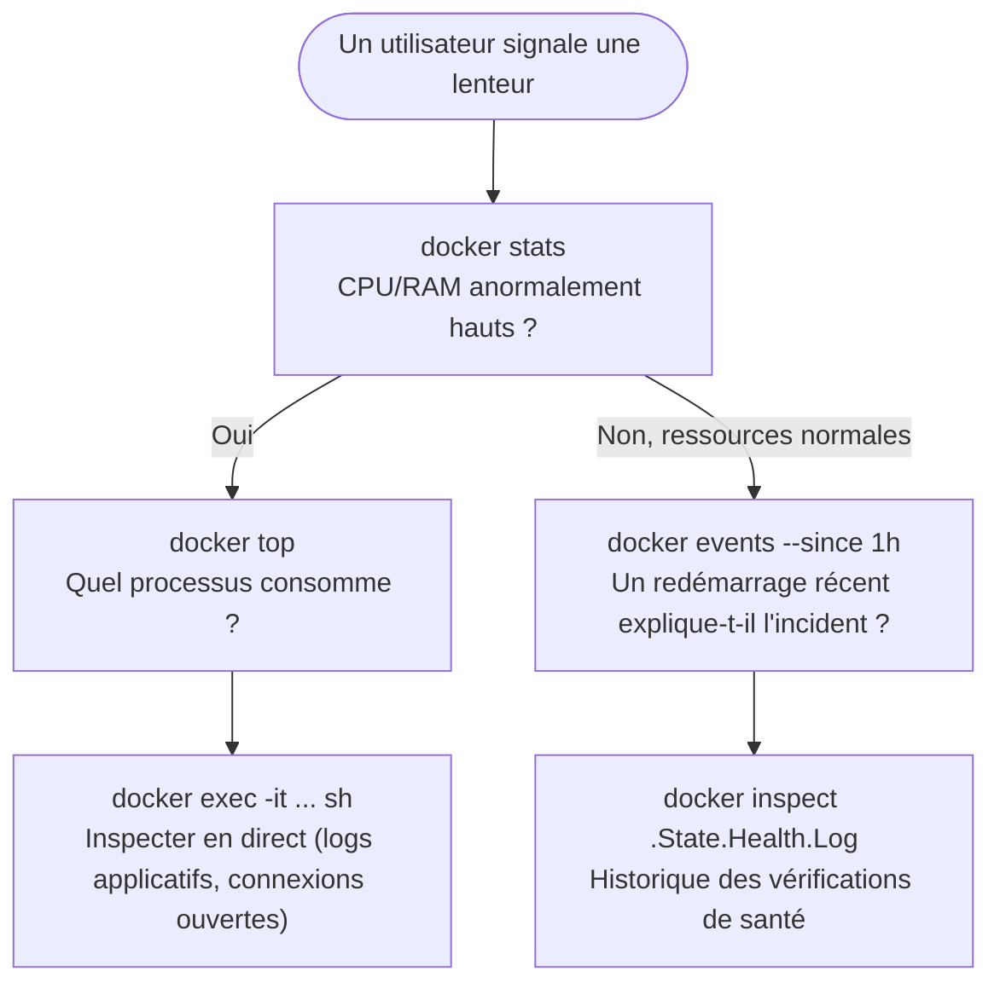

# Chapitre 23 — Debugging : inspect, exec, top, stats, events

**Niveau : Intermédiaire → Avancé**

---

## Introduction

Les logs (chapitre 22) racontent ce qu'une application a **choisi** de dire. Ce chapitre va plus loin : entrer réellement dans un conteneur en cours d'exécution, observer ses processus, mesurer sa consommation de ressources en direct, et reconstituer la chronologie exacte de ce qui s'est passé sur la machine — cinq outils complémentaires, chacun répondant à une question différente.

---

## 🎯 Objectifs pédagogiques

À la fin de ce chapitre, tu sauras :
- ouvrir un shell interactif à l'intérieur d'un conteneur avec `docker exec`, et savoir pourquoi ce n'est pas la même chose que `docker attach` ;
- lister les processus d'un conteneur sans y entrer, avec `docker top` ;
- mesurer en direct la consommation CPU/RAM/réseau d'un conteneur avec `docker stats` ;
- consulter le flux chronologique des événements Docker avec `docker events` ;
- extraire des informations précises d'un conteneur (IP, volumes montés, historique de santé) avec `docker inspect`.

## 📋 Prérequis

Chapitre 22.

## Pourquoi ce chapitre est important

Face à un problème qui ne se lit pas entièrement dans les logs (une lenteur, un processus zombie, une consommation mémoire anormale), ces cinq outils sont ceux qu'un administrateur système ou un développeur backend utilise réellement, en direct, pour comprendre ce qui se passe **maintenant** — un savoir-faire directement réutilisé dans une bonne partie des scénarios du chapitre 48.

---

## Concepts fondamentaux

1. **`docker exec`** — exécuter une commande dans un conteneur déjà actif.
2. **`docker top`** — voir les processus sans entrer dans le conteneur.
3. **`docker stats`** — mesurer les ressources en direct.
4. **`docker events`** — la chronologie des événements Docker.
5. **`docker inspect`, approfondi** — extraire des informations précises d'un conteneur.

---

## 23.1 `docker exec` : entrer dans un conteneur actif

```bash
# [Terminal]
docker exec -it backend sh
```

**Explication :**
```text
docker exec
→ exécute une NOUVELLE commande à l'intérieur d'un conteneur DÉJÀ EN COURS D'EXÉCUTION
  (contrairement à "docker run", qui crée toujours un nouveau conteneur, chapitre 4)

-it
→ "-i" (interactive) garde l'entrée standard ouverte, "-t" alloue un pseudo-terminal —
  combinés, ils rendent la session utilisable comme un vrai terminal interactif

sh
→ la commande exécutée : un shell. Les images basées sur Alpine (rappel du chapitre 5)
  n'incluent PAS bash par défaut, seulement "sh" (un shell plus minimal) — tenter
  "docker exec -it backend bash" sur une image Alpine échoue avec
  "OCI runtime exec failed: exec: bash: executable file not found in $PATH"
```

Une fois dans le shell :
```bash
ps aux                          # lister les processus (rappel de la section 23.2, en version manuelle)
env                              # variables d'environnement actives (rappel chapitre 9)
cat /etc/hosts                   # résolution DNS interne (rappel chapitre 11)
wget -qO- http://localhost:4000/health   # tester l'application depuis l'intérieur même du conteneur
ping -c 2 db                     # vérifier la connectivité réseau vers un autre service
exit                              # quitter le shell (le conteneur continue de tourner normalement)
```

> ⚠️ **Attention — `docker exec` n'est PAS `docker attach`** — `docker attach backend` connecte ton terminal directement au **processus principal** du conteneur (celui défini par `CMD`/`ENTRYPOINT`, chapitre 6) — quitter cette session avec `Ctrl+C` peut **arrêter le processus principal lui-même**, et donc le conteneur entier, un piège réel pour qui s'attend à un simple "retour au terminal hôte" sans conséquence. `docker exec`, à l'inverse, démarre un **second processus indépendant** (ici, un shell) à côté du processus principal — le quitter (`exit`) n'affecte jamais ce dernier. **Pour toute session de diagnostic manuelle, `docker exec` est presque toujours le bon choix, jamais `docker attach`.**

---

## 23.2 `docker top` : les processus, sans entrer dans le conteneur

```bash
# [Terminal]
docker top backend
```

**Résultat attendu**, en substance :
```text
UID    PID    PPID   C   STIME   TTY   TIME       CMD
node   4821   4800   0   10:32   ?     00:00:02   node src/index.js
```

**Explication :** équivalent de `ps aux` exécuté **depuis l'extérieur** du conteneur, sans avoir besoin d'y entrer — utile pour une vérification rapide (le processus attendu tourne-t-il bien, avec quel utilisateur — rappel du chapitre 6, section 6.7 sur `USER`) sans ouvrir une session interactive complète.

---

## 23.3 `docker stats` : ressources en temps réel

```bash
# [Terminal]
docker stats
```

**Résultat attendu**, en continu (comme `top`/`htop` sur une machine classique) :
```text
CONTAINER ID   NAME      CPU %   MEM USAGE / LIMIT   MEM %   NET I/O           BLOCK I/O   PIDS
a1b2c3d4e5f6   backend   2.34%   45.2MiB / 512MiB     8.83%   1.2MB / 850kB     0B / 0B     11
```

```bash
# [Terminal] — un seul service, un seul relevé (utile en script, sans rester en mode continu)
docker stats --no-stream backend
```

**Explication des colonnes :**
```text
CPU %       → part du CPU utilisée, relative au total disponible sur la machine
MEM USAGE / LIMIT → mémoire consommée, sur la limite éventuellement fixée (chapitre 35)
NET I/O     → trafic réseau cumulé depuis le démarrage du conteneur
BLOCK I/O   → lecture/écriture disque cumulée
PIDS        → nombre de processus actifs à l'intérieur du conteneur
```

> 📌 **À retenir** — `docker stats` est le premier réflexe face à une suspicion de lenteur ou de consommation excessive — avant même d'aller chercher plus loin (chapitre 35, performance, qui approfondit chacune de ces métriques et leur diagnostic).

---

## 23.4 `docker events` : la chronologie des événements

```bash
# [Terminal] — dans un premier terminal, suivre les événements en direct
docker events
```

```bash
# [Terminal] — dans un second terminal, provoquer de l'activité
docker compose restart backend
```

**Résultat attendu**, dans le premier terminal :
```text
2026-01-01T10:40:00 container die a1b2c3... (name=backend)
2026-01-01T10:40:01 container start a1b2c3... (name=backend)
2026-01-01T10:40:11 container health_status: healthy a1b2c3... (name=backend)
```

**Explication :** `docker events` diffuse, en temps réel, chaque événement significatif touchant le Docker Engine — création, démarrage, arrêt, changement de statut de santé (rappel du chapitre 21) — avec un horodatage précis.

```bash
# [Terminal] — filtrer sur un conteneur précis, ou revoir un historique récent
docker events --filter container=backend
docker events --since 10m
```

> 📌 **À retenir** — `docker events` répond à une question que ni les logs ni `docker stats` ne couvrent bien : **"quand exactement ce conteneur a-t-il redémarré, et combien de fois ?"** — utile pour corréler un incident applicatif signalé par un utilisateur à un événement Docker précis dans le temps.

---

## 23.5 `docker inspect`, approfondi

```bash
# [Terminal] — l'adresse IP d'un conteneur sur un réseau donné (rappel chapitre 11)
docker inspect --format "{{.NetworkSettings.Networks}}" backend

# [Terminal] — les volumes et bind mounts réellement actifs (rappel chapitre 10)
docker inspect --format "{{.Mounts}}" backend

# [Terminal] — l'historique récent des vérifications de santé (rappel chapitre 21)
docker inspect --format "{{.State.Health.Log}}" backend
```

**Explication du dernier exemple :** `.State.Health.Log` conserve les derniers résultats du `HEALTHCHECK` (chapitre 21) — code de sortie, sortie de la commande, durée — un historique précieux pour comprendre **pourquoi** un service a basculé en `unhealthy`, plutôt que de simplement constater qu'il l'est.

---

## 23.6 Scénario combiné : diagnostiquer une lenteur perçue


**Explication du schéma :** ce n'est jamais un seul outil qui résout un diagnostic — c'est la combinaison, dans un ordre logique, qui restreint progressivement le champ des causes possibles. Cette méthode, encore artisanale ici, est formalisée en profondeur au chapitre 48.

---

## Erreurs fréquentes (récapitulatif du chapitre)

| Erreur | Cause | Solution |
|---|---|---|
| `bash: executable file not found in $PATH` | Image basée sur Alpine, sans bash | Utiliser `sh` à la place |
| Le conteneur s'arrête après un `Ctrl+C` en session de diagnostic | `docker attach` utilisé au lieu de `docker exec` | Toujours utiliser `docker exec -it ... sh` pour une session de diagnostic manuelle |
| `docker stats` ne montre rien d'anormal malgré une lenteur signalée | La cause n'est pas une saturation de ressources locale (peut-être un service externe lent, une requête réseau distante) | Élargir le diagnostic au-delà du conteneur lui-même — chapitre 48 |
| Impossible de savoir combien de fois un conteneur a redémarré récemment | Absence de consultation de `docker events` | `docker events --filter container=nom --since 1h` |

---

## Laboratoire pratique n°1 — Explorer un conteneur de l'intérieur

**Objectifs :** exécuter la section 23.1 sur un vrai conteneur du projet des chapitres 20-21.
**Prérequis :** Chapitre 22.

**Étapes :** `docker exec -it backend sh`, puis `ps aux`, `env`, `cat /etc/hosts`, `ping -c 2 db`, `wget -qO- http://localhost:4000/health`, `exit`.

**Résultat attendu :** confirmation directe, depuis l'intérieur du conteneur, que la résolution DNS (chapitre 11) et l'application elle-même fonctionnent comme attendu.

---

## Laboratoire pratique n°2 — Observer une montée en charge avec `docker stats`

**Objectifs :** exécuter la section 23.3 dans un scénario de charge réelle.
**Prérequis :** Laboratoire 1 complété.

**Étapes :** ouvre `docker stats backend` dans un terminal, puis dans un second terminal lance une boucle de requêtes (`for i in 1..50; do curl http://localhost:8080/api/tasks; done` sous PowerShell, ou l'équivalent shell) et observe l'évolution de `CPU %` en direct.

**Résultat attendu :** une hausse mesurable et transitoire du `CPU %` pendant la boucle, retombant une fois celle-ci terminée.

---

## Laboratoire pratique n°3 — Corréler `docker events` et l'historique de santé

**Objectifs :** exécuter la section 23.4 et 23.5 ensemble, sur un cas concret.
**Prérequis :** Laboratoires 1 et 2 complétés.

**Étapes :**
1. `docker events --filter container=backend` dans un terminal.
2. `docker compose restart backend` dans un second terminal.
3. Observe la séquence `die` → `start` → `health_status: healthy` dans le premier terminal, en notant les horodatages.
4. `docker inspect --format "{{.State.Health.Log}}" nom-du-conteneur-backend` et confirme que l'historique des vérifications de santé correspond à la chronologie observée.

**Résultat attendu :** une reconstitution précise et vérifiée de "que s'est-il passé, et quand" — la compétence centrale de ce chapitre.

---

## Exercices

1. Explique pourquoi `docker attach` peut arrêter un conteneur alors que `docker exec` ne le fait jamais.
2. Pourquoi `bash` échoue-t-il souvent sur une image Alpine, et que faut-il utiliser à la place ?
3. Que révèle `docker top` que `docker stats` ne montre pas, et inversement ?
4. À quelle question précise `docker events` répond-il, que les logs applicatifs (chapitre 22) ne couvrent pas directement ?
5. Que contient `.State.Health.Log`, et pourquoi est-ce utile après un basculement `unhealthy` (chapitre 21) ?

---

## Quiz

**Question 1.** `docker exec -it backend sh` :
a) Crée un nouveau conteneur
b) Exécute un nouveau processus (ici, un shell) à l'intérieur d'un conteneur déjà actif
c) Arrête le conteneur ciblé
d) Supprime les logs du conteneur

**Question 2.** Quitter une session `docker attach` avec `Ctrl+C` :
a) N'a jamais d'impact sur le conteneur
b) Peut arrêter le processus principal du conteneur, donc le conteneur lui-même
c) Détache uniquement le terminal, sans autre effet possible
d) Redémarre automatiquement le conteneur

**Question 3.** `docker stats` affiche notamment :
a) Le contenu des fichiers de logs
b) La consommation CPU/RAM/réseau en temps réel
c) L'historique Git du projet
d) La liste des images disponibles sur Docker Hub

**Question 4.** `docker events --filter container=backend` sert à :
a) Modifier la configuration du conteneur
b) Afficher le flux chronologique des événements concernant ce conteneur précis
c) Supprimer le conteneur
d) Afficher uniquement les erreurs applicatives

**Question 5.** `.State.Health.Log`, consulté via `docker inspect`, contient :
a) Les logs applicatifs complets
b) L'historique des résultats du healthcheck du conteneur
c) La liste des volumes montés
d) Les variables d'environnement

> 🔑 **Corrigé** — 1: b · 2: b · 3: b · 4: b · 5: b

---

## 📝 Résumé du chapitre

- `docker exec -it ... sh` ouvre un shell interactif dans un conteneur actif, sans risque pour le processus principal — contrairement à `docker attach`, qui s'y connecte directement.
- `docker top` liste les processus sans entrer dans le conteneur ; `docker stats` mesure en direct sa consommation CPU/RAM/réseau/disque.
- `docker events` diffuse la chronologie précise des événements Docker, utile pour corréler un incident à un moment exact.
- `docker inspect --format` extrait des informations ciblées : adresse IP, volumes montés, historique des vérifications de santé.
- Un vrai diagnostic combine ces outils dans un ordre logique, jamais un seul isolément — une méthode formalisée en profondeur au chapitre 48.

## ✅ Checklist avant de passer au chapitre 24

- [ ] Je sais ouvrir un shell interactif dans un conteneur sans risquer de l'arrêter.
- [ ] Je sais la différence entre `docker exec` et `docker attach`.
- [ ] Je sais lire `docker stats` et `docker top`.
- [ ] Je sais utiliser `docker events` pour reconstituer une chronologie.
- [ ] J'ai réalisé les trois laboratoires de ce chapitre.
- [ ] J'ai obtenu au moins 4/5 au quiz.

---

## Glossaire du chapitre

**`docker exec`**
Définition simple : exécuter une nouvelle commande dans un conteneur déjà en cours d'exécution.
Voir : Chapitre 23, section 23.1.

**`docker attach`**
Définition simple : se connecter directement au processus principal d'un conteneur, avec un risque réel de l'arrêter en quittant la session.
Voir : Chapitre 23, section 23.1.

**`docker events`**
Définition simple : le flux chronologique des événements du Docker Engine.
Voir : Chapitre 23, section 23.4.

---

## ❓ FAQ

**Peut-on installer `bash` dans une image Alpine plutôt que d'utiliser `sh` ?**
Oui, avec `apk add bash` dans le Dockerfile — mais cela ajoute une dépendance et de la taille (chapitre 5) pour un confort marginal ; ce manuel utilise `sh` par défaut sur les images Alpine.

**`docker exec` fonctionne-t-il sur un conteneur arrêté ?**
Non — `docker exec` nécessite un conteneur en cours d'exécution (`Running`, chapitre 4). Sur un conteneur `Exited`, seul `docker start` (chapitre 4) puis `docker exec` fonctionne.

**`docker stats` ralentit-il le conteneur observé ?**
Son impact est négligeable — il lit des métriques déjà collectées par le Docker Engine, sans charge additionnelle significative sur le conteneur lui-même.

---

## Références officielles

- `docker exec` — [docs.docker.com/reference/cli/docker/container/exec](https://docs.docker.com/reference/cli/docker/container/exec/)
- `docker top` — [docs.docker.com/reference/cli/docker/container/top](https://docs.docker.com/reference/cli/docker/container/top/)
- `docker stats` — [docs.docker.com/reference/cli/docker/container/stats](https://docs.docker.com/reference/cli/docker/container/stats/)
- `docker events` — [docs.docker.com/reference/cli/docker/system/events](https://docs.docker.com/reference/cli/docker/system/events/)

---

## Conclusion

Cinq outils de diagnostic, chacun répondant à une question précise, désormais maîtrisés ensemble. Le chapitre 24 termine la Partie VI avec un sujet différent mais tout aussi quotidien : nettoyer l'espace disque accumulé par Docker au fil du temps, sans jamais supprimer par erreur ce qui devait être conservé.

---

⬅️ [Chapitre 22 — Logs](22-consulter-et-interpreter-les-logs.md) · ➡️ **Suite : Chapitre 24 — Nettoyage de l'espace disque**
