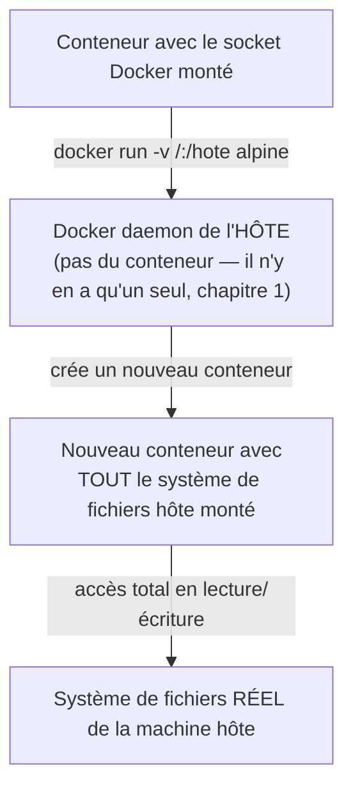

# Chapitre 26 — Sécurité Docker

**Niveau : Avancé**

---

## Introduction

Ce chapitre rassemble tout ce que les précédents ont volontairement laissé en suspens sur le plan sécurité : pourquoi `root` dans un conteneur reste un risque malgré l'isolation, ce que sont les capabilities Linux, comment garder un secret hors de l'image **même pendant sa construction**, comment scanner une image pour des vulnérabilités connues, et surtout — le risque le plus grave de tout ce manuel — pourquoi monter le socket Docker dans un conteneur équivaut, presque toujours, à donner un accès root complet à la machine hôte.

---

## 🎯 Objectifs pédagogiques

À la fin de ce chapitre, tu sauras :
- expliquer pourquoi `root` dans un conteneur reste un risque, malgré l'isolation namespace ;
- utiliser `--cap-drop`/`--cap-add` pour appliquer le principe de moindre privilège au niveau des capabilities Linux ;
- utiliser les secrets BuildKit pour qu'un secret ne soit **jamais** gravé dans une couche d'image, même pendant le build ;
- scanner une image pour des vulnérabilités connues avec `docker scout` ;
- expliquer précisément pourquoi monter le socket Docker dans un conteneur est l'un des risques de sécurité les plus graves de tout l'écosystème Docker ;
- appliquer un système de fichiers en lecture seule pour limiter l'impact d'une compromission.

## 📋 Prérequis

Chapitres 6 (`USER`), 9 (secrets), 25.

## Pourquoi ce chapitre est important

Une mauvaise pratique de sécurité Docker ne casse rien visiblement — elle attend simplement qu'une autre faille (dans l'application, dans une dépendance) survienne pour transformer un incident mineur en compromission totale du serveur. Ce chapitre construit les réflexes qui limitent les dégâts d'une faille, même quand elle finit par se produire ailleurs.

---

## Concepts fondamentaux

1. **`root` dans un conteneur** — un risque réel, pas seulement théorique.
2. **Capabilities Linux** — décomposer "root" en privilèges granulaires.
3. **Secrets au moment du build** — au-delà du chapitre 9.
4. **Scan de vulnérabilités** — `docker scout`.
5. **Le socket Docker** — le risque le plus grave de ce manuel.
6. **Système de fichiers en lecture seule** — limiter l'impact d'une compromission.

---

## 26.1 `root` dans un conteneur : un risque réel, pas seulement théorique

Rappel du chapitre 6 (section 6.7) : sans `USER` explicite, un conteneur tourne en `root` par défaut.

> ⚠️ **Attention — pourquoi c'est un vrai risque, malgré l'isolation du chapitre 1** — Rappel du chapitre 2 (section 2.2) : un conteneur **partage le noyau** de la machine hôte. `root` à l'intérieur d'un conteneur n'est pas un `root` "simulé" séparé du vrai `root` du système — c'est le même concept d'utilisateur privilégié UID 0, dont l'isolation vis-à-vis de l'hôte repose entièrement sur les namespaces et cgroups du noyau (chapitre 1). Si une faille du noyau ou du Docker Engine permet un jour une **évasion de conteneur** (container escape — un scénario documenté historiquement, corrigé à mesure qu'il est découvert), un processus `root` à l'intérieur du conteneur devient directement `root` sur la machine hôte. Un processus non-root, à l'inverse, resterait limité même après une évasion réussie.

> 📌 **À retenir** — `USER` non-root n'est pas une précaution "pour faire bien" — c'est une **réduction mesurable de l'impact potentiel** d'une catégorie entière de failles, même celles qui n'ont rien à voir avec l'application elle-même.

---

## 26.2 Capabilities Linux : décomposer "root"

Le noyau Linux ne traite pas les privilèges comme un simple interrupteur "root ou pas root" — il les découpe en dizaines de **capabilities** indépendantes (`NET_BIND_SERVICE` pour écouter sur un port privilégié inférieur à 1024, `SYS_ADMIN` pour des opérations d'administration système étendues, `NET_RAW` pour manipuler des paquets réseau bruts...).

> 📌 **À retenir** — Docker, par défaut, accorde déjà à un conteneur un **sous-ensemble raisonnable** de capabilities (pas la totalité, contrairement à un processus `root` sur une machine physique classique) — mais ce sous-ensemble par défaut reste souvent plus large que ce dont une application web ordinaire a réellement besoin.

```bash
# [Terminal] — retirer TOUTES les capabilities, puis rajouter UNIQUEMENT celle nécessaire
docker run --cap-drop ALL --cap-add NET_BIND_SERVICE -p 80:80 mon-image
```

**Explication :**
```text
--cap-drop ALL
→ retire l'intégralité des capabilities Linux accordées par défaut au conteneur

--cap-add NET_BIND_SERVICE
→ rajoute UNIQUEMENT celle strictement nécessaire ici : la capacité d'écouter
  sur un port inférieur à 1024 (rappel : sans cette capability précise, seul
  un processus root — ou disposant explicitement de NET_BIND_SERVICE —
  peut se lier à un port comme 80, historiquement réservé)
```

> ✅ **Bonne pratique** — Appliquer systématiquement `--cap-drop ALL` puis rajouter au cas par cas, plutôt que de partir des capabilities par défaut de Docker sans y réfléchir — exactement le principe de moindre privilège déjà appliqué à `USER` non-root, mais à un niveau plus fin.

```yaml
# [compose.yaml, équivalent]
services:
  backend:
    build: ./backend
    cap_drop:
      - ALL
    cap_add:
      - NET_BIND_SERVICE
```

---

## 26.3 Secrets au moment du build : au-delà du chapitre 9

Le chapitre 9 a établi la règle : jamais de secret dans `ENV`/`ARG` d'un Dockerfile, parce qu'ils restent visibles dans `docker history` (chapitre 5). Mais certains besoins légitimes exigent un secret **pendant** la construction elle-même — par exemple, un jeton d'authentification pour installer un paquet npm privé, nécessaire uniquement le temps de `RUN npm install`, jamais après.

```dockerfile
# syntax=docker/dockerfile:1
FROM node:20-alpine
WORKDIR /app
COPY package.json package-lock.json ./
RUN --mount=type=secret,id=npm_token \
    NPM_TOKEN=$(cat /run/secrets/npm_token) \
    npm config set //registry.npmjs.org/:_authToken=$NPM_TOKEN && \
    npm ci --omit=dev
COPY . .
CMD ["node", "src/index.js"]
```

```bash
# [Terminal] — le secret est fourni au build, jamais gravé dans le Dockerfile ni versionné
docker build --secret id=npm_token,src=./npm_token.txt -t mon-image .
```

**Explication :**
```text
--mount=type=secret,id=npm_token
→ monte temporairement un fichier secret à /run/secrets/npm_token,
  UNIQUEMENT pendant l'exécution de CETTE instruction RUN précise

docker build --secret id=npm_token,src=./npm_token.txt
→ fournit le secret au moment du build, depuis un fichier local
  (jamais committé, comme le .env du chapitre 9)
```

> 📌 **À retenir, la différence capitale avec `ARG`** — Contrairement à `ARG` (chapitre 6, section 6.5), le contenu monté via `--mount=type=secret` **n'est jamais écrit dans une couche de l'image finale**, et donc jamais visible dans `docker history` ni dans le Dockerfile lui-même. C'est la réponse durable au problème identifié depuis le chapitre 6 : un secret nécessaire uniquement au moment du build a désormais une solution propre, pas seulement l'interdiction de mal faire.

---

## 26.4 Scanner une image pour des vulnérabilités connues

```bash
# [Terminal] — intégré au Docker CLI moderne
docker scout cves mon-image:latest
```

**Résultat attendu**, en substance :
```text
## Overview
  0C     2H     5M     8L  mon-image:latest

Vulnerabilities found in 3 packages
  ...
  CVE-2024-XXXXX  HIGH  openssl 3.0.8 (fixed in 3.0.12)
```

**Explication :** `docker scout` analyse les paquets connus de l'image (système et applicatifs) et les compare à des bases de données publiques de vulnérabilités (CVE — Common Vulnerabilities and Exposures), classées par sévérité (Critical, High, Medium, Low).

> ✅ **Bonne pratique** — Scanner une image **avant** de la déployer, et **régulièrement** après (section 26.8) — une image parfaitement saine à sa construction peut devenir vulnérable plus tard, quand une faille est découverte dans l'un de ses composants après coup, sans qu'aucune ligne du Dockerfile n'ait changé.

> 📌 **À retenir** — Toutes les vulnérabilités signalées ne sont pas forcément exploitables dans le contexte réel d'une application donnée (un paquet vulnérable jamais réellement utilisé par le code, par exemple) — un scan donne un **signal à investiguer**, pas un verdict automatique à corriger aveuglément ligne par ligne, mais jamais un signal à ignorer non plus sans l'avoir au moins lu.

---

## 26.5 Ports exposés inutilement — rappel synthétique

Rappel des chapitres 8 (section 8.5) et 11 (section 11.6) : ne jamais publier directement le port d'une base de données ou d'un service interne vers l'extérieur — chaque port publié est une surface d'attaque supplémentaire. La règle de ce chapitre, en synthèse : **publier le strict minimum, tout le reste communique par le réseau Docker interne (chapitre 11).**

---

## 26.6 Le socket Docker : le risque le plus grave de ce manuel

```bash
# ❌ DANGEREUX — présenté ici uniquement pour démontrer le risque, jamais à reproduire sans réflexion extrême
docker run -v /var/run/docker.sock:/var/run/docker.sock docker:cli
```

> ⚠️⚠️ **Attention — le risque le plus grave de tout ce manuel** — `/var/run/docker.sock` est le fichier via lequel le Docker CLI communique avec le Docker daemon (chapitre 1, section 1.5). Monter ce socket **à l'intérieur d'un conteneur** donne à ce conteneur la capacité de **commander le Docker daemon de l'hôte exactement comme s'il y avait un accès root direct** — y compris la possibilité de créer un **nouveau** conteneur monté sur `/` de la machine hôte, avec un accès complet en lecture/écriture à absolument tous les fichiers du système, contournant entièrement l'isolation présentée depuis le chapitre 1.


**Explication du schéma :** le conteneur initial n'a même pas besoin d'être `root` en son sein pour que cette attaque fonctionne — l'accès au socket suffit, parce que le Docker daemon **de l'hôte**, une fois sollicité, exécute la demande avec ses propres privilèges (typiquement root), pas avec ceux du conteneur qui l'a sollicité.

> ✅ **Bonne pratique** — **Ne jamais monter le socket Docker dans un conteneur, sauf nécessité absolument explicite et comprise** (des outils légitimes existent — CI/CD qui construisent des images depuis un runner conteneurisé, des outils de supervision Docker comme Portainer) — et dans ces cas rares, uniquement depuis une image de confiance vérifiée, jamais depuis une image tierce non auditée, et idéalement avec un proxy limitant les commandes autorisées sur le socket plutôt qu'un accès total et direct.

---

## 26.7 Système de fichiers en lecture seule

```bash
# [Terminal]
docker run --read-only --tmpfs /tmp -p 4000:4000 backend
```

```yaml
# [compose.yaml, équivalent]
services:
  backend:
    build: ./backend
    read_only: true
    tmpfs:
      - /tmp
```

**Explication :**
```text
--read-only
→ rend le système de fichiers du conteneur ENTIÈREMENT en lecture seule,
  y compris la couche inscriptible normalement disponible (chapitre 1, section 1.4)

--tmpfs /tmp
→ autorise EXPLICITEMENT un dossier précis à rester inscriptible (en mémoire,
  chapitre 10, section 10.6), pour les besoins légitimes d'écriture temporaire
  qu'une application peut avoir (fichiers de verrouillage, caches temporaires)
```

> 📌 **À retenir** — Même si un attaquant parvient à exécuter du code arbitraire dans un conteneur en lecture seule, il ne peut **rien y persister** — ni modifier le code de l'application, ni installer un outil malveillant sur le disque du conteneur. Une limite d'impact réelle, à faible coût de mise en œuvre pour la plupart des applications web sans besoin d'écriture disque hors de dossiers temporaires explicites.

---

## 26.8 Mises à jour de sécurité : ne jamais "construire une fois pour toutes"

> ⚠️ **Attention — la tension avec le chapitre 25** — Le chapitre 25 mentionnait qu'épingler par digest gèle les mises à jour de sécurité de l'image de base. Ce chapitre en tire la conclusion opérationnelle : **une image, même construite parfaitement à un instant T, doit être reconstruite régulièrement** (au minimum lors de la publication d'un correctif de sécurité connu pour l'un de ses composants) — jamais considérée comme "terminée" définitivement.

> ✅ **Bonne pratique** — Reconstruire périodiquement (au minimum mensuellement, idéalement à chaque nouvelle version de l'image de base) même sans changement de code applicatif, puis rescanner (section 26.4) avant de redéployer — une routine formalisée avec l'automatisation CI/CD au chapitre 31.

---

## Checklist sécurité (récapitulatif du chapitre)

- [ ] `USER` non-root dans tous les Dockerfiles de production.
- [ ] `--cap-drop ALL` avec ajout ciblé des seules capabilities réellement nécessaires.
- [ ] Aucun secret dans `ARG`/`ENV` du Dockerfile ; secrets de build via `--mount=type=secret`, secrets d'exécution via `-e`/`.env` (chapitre 9).
- [ ] Images scannées avant déploiement, et régulièrement après (`docker scout`).
- [ ] Ports publiés réduits au strict minimum.
- [ ] Socket Docker **jamais** monté dans un conteneur, sauf nécessité explicitement justifiée et depuis une source de confiance.
- [ ] Système de fichiers en lecture seule appliqué partout où c'est compatible avec le fonctionnement de l'application.
- [ ] Reconstruction périodique planifiée, pas seulement lors d'un changement de code.

---

## Erreurs fréquentes (récapitulatif du chapitre)

| Erreur | Cause | Solution |
|---|---|---|
| Conteneur toujours en `root` en production | `USER` omis, rappel du chapitre 6 non appliqué | Ajouter systématiquement `USER` |
| Un secret de build (jeton npm privé) apparaît dans `docker history` | Utilisation d'`ARG` au lieu des secrets BuildKit | Utiliser `--mount=type=secret` |
| Aucune vulnérabilité connue jamais détectée avant qu'un incident ne survienne | Absence totale de scan avant déploiement | Intégrer `docker scout` (ou équivalent) dans la routine de déploiement |
| Compromission totale de l'hôte suite à une faille applicative mineure | Socket Docker monté sans nécessité réelle | Retirer ce montage, sauf besoin strictement justifié |
| Image jamais reconstruite pendant des mois | Croyance que "ça marche" suffit comme critère de sécurité | Planifier une reconstruction et un rescan périodiques |

---

## Laboratoire pratique n°1 — Appliquer le principe de moindre privilège aux capabilities

**Objectifs :** exécuter la section 26.2.
**Prérequis :** Chapitre 25.

**Étapes :** lance un service nécessitant le port 80 avec `--cap-drop ALL --cap-add NET_BIND_SERVICE`, confirme son bon fonctionnement, puis retire `NET_BIND_SERVICE` et observe l'échec du démarrage.

**Résultat attendu :** une démonstration concrète qu'une capability précise, et uniquement elle, est nécessaire à ce cas d'usage.

---

## Laboratoire pratique n°2 — Secret de build invisible dans l'historique

**Objectifs :** exécuter et vérifier la section 26.3, en contraste direct avec le piège du chapitre 6.
**Prérequis :** Laboratoire 1 complété.

**Étapes :**
1. Construis une image utilisant `--mount=type=secret` avec une valeur de test.
2. `docker history` sur l'image obtenue et confirme l'absence totale de toute trace du secret.
3. Recommence volontairement avec un `ARG` classique portant la même valeur, et confirme cette fois sa présence visible dans `docker history` — le contraste voulu par ce laboratoire.

**Résultat attendu :** une preuve directe, pas seulement affirmée, de la différence entre les deux approches.

---

## Laboratoire pratique n°3 — Observer (en sandbox) le risque du socket Docker

**Objectifs :** comprendre, sans jamais reproduire en dehors d'un environnement de test jetable, la gravité de la section 26.6.
**Prérequis :** Laboratoires 1 et 2 complétés, **environnement de test isolé et jetable uniquement** (jamais une machine de production ni même de développement contenant des données réelles).

**Étapes :**
1. Dans cet environnement jetable, lance un conteneur avec le socket Docker monté.
2. Depuis l'intérieur de ce conteneur, exécute une commande qui crée un nouveau conteneur montant `/` de l'hôte.
3. Depuis ce second conteneur, liste le contenu de la racine de l'hôte monté, confirmant l'accès complet obtenu.
4. Détruis immédiatement cet environnement de test après la démonstration.

**Résultat attendu :** compréhension directe et non plus seulement théorique de pourquoi ce risque justifie l'interdiction par défaut de la section 26.6.

---

## Exercices

1. Explique pourquoi `root` dans un conteneur reste un risque malgré l'isolation des namespaces.
2. Qu'apporte `--cap-drop ALL --cap-add NET_BIND_SERVICE` par rapport à ne rien spécifier du tout ?
3. Quelle est la différence fondamentale entre un secret passé par `ARG` et un secret monté via `--mount=type=secret` ?
4. Pourquoi un scan de vulnérabilités doit-il être répété périodiquement, pas seulement une fois à la construction initiale ?
5. Pourquoi monter le socket Docker dans un conteneur équivaut-il, presque toujours, à donner un accès root sur la machine hôte ?

---

## Quiz

**Question 1.** `root` à l'intérieur d'un conteneur est risqué parce que :
a) Il ralentit les performances
b) Il partage le même noyau que l'hôte ; une évasion de conteneur donnerait alors un accès root réel sur la machine
c) Il empêche le conteneur de démarrer
d) Il double la taille de l'image

**Question 2.** `--cap-drop ALL --cap-add NET_BIND_SERVICE` :
a) Retire toutes les capabilities et n'en rajoute aucune
b) Retire toutes les capabilities puis rajoute uniquement celle nécessaire pour écouter sur un port privilégié
c) N'a aucun effet, car Docker ignore les capabilities
d) Supprime le conteneur

**Question 3.** Un secret monté via `--mount=type=secret` pendant `docker build` :
a) Est gravé dans une couche de l'image, comme `ARG`
b) N'est jamais écrit dans aucune couche de l'image finale
c) Nécessite `docker scout` pour être utilisé
d) Est automatiquement publié sur Docker Hub

**Question 4.** Monter le socket Docker (`/var/run/docker.sock`) dans un conteneur :
a) Est sans danger tant qu'un mot de passe protège le conteneur
b) Peut donner à ce conteneur un accès équivalent à root sur la machine hôte
c) N'a aucun rapport avec la sécurité
d) Est une pratique recommandée pour tous les projets

**Question 5.** `--read-only` sur un conteneur :
a) Empêche le conteneur de démarrer
b) Rend son système de fichiers non modifiable, sauf exceptions explicites comme un `tmpfs`
c) Bloque tout accès réseau
d) Supprime automatiquement les logs

> 🔑 **Corrigé** — 1: b · 2: b · 3: b · 4: b · 5: b

---

## 📝 Résumé du chapitre

- `root` dans un conteneur reste un risque réel à cause du noyau partagé (chapitre 2) — `USER` non-root limite concrètement l'impact d'une évasion.
- Les capabilities Linux permettent d'appliquer le principe de moindre privilège plus finement que "root ou pas root" — `--cap-drop ALL` puis ajout ciblé est la bonne pratique.
- Les secrets BuildKit (`--mount=type=secret`) résolvent définitivement le problème des secrets nécessaires au build, sans jamais les graver dans une couche — contrairement à `ARG`.
- `docker scout` (ou équivalent) scanne une image pour des vulnérabilités connues, à répéter périodiquement, pas une seule fois.
- **Monter le socket Docker dans un conteneur est le risque le plus grave de ce manuel** — un accès quasi-équivalent à root sur l'hôte, à éviter sauf nécessité strictement justifiée.
- Un système de fichiers en lecture seule (`--read-only` + `tmpfs` ciblé) limite ce qu'un attaquant peut persister même après une compromission de l'application elle-même.

## ✅ Checklist avant de passer au chapitre 27

- [ ] Tous mes Dockerfiles utilisent `USER` non-root.
- [ ] Je sais appliquer `--cap-drop`/`--cap-add`.
- [ ] Je sais utiliser un secret de build sans jamais le graver dans l'image.
- [ ] J'ai scanné au moins une image avec `docker scout`.
- [ ] Je sais expliquer précisément pourquoi le socket Docker ne doit jamais être monté sans réflexion.
- [ ] J'ai réalisé les trois laboratoires de ce chapitre (le troisième en environnement jetable uniquement).
- [ ] J'ai obtenu au moins 4/5 au quiz.

---

## Glossaire du chapitre

**Capability (Linux)**
Définition simple : un privilège précis et granulaire, plus fin que la distinction "root ou pas root".
Voir : Chapitre 26, section 26.2.

**Secret BuildKit**
Définition simple : un secret monté temporairement pendant une seule instruction `RUN`, jamais gravé dans une couche d'image.
Voir : Chapitre 26, section 26.3.

**CVE (Common Vulnerabilities and Exposures)**
Définition simple : un identifiant standardisé désignant une vulnérabilité de sécurité connue et publiquement documentée.
Voir : Chapitre 26, section 26.4.

**Évasion de conteneur (container escape)**
Définition simple : une faille permettant à un processus conteneurisé d'accéder à des ressources de la machine hôte hors de son isolation prévue.
Voir : Chapitre 26, sections 26.1 et 26.6.

---

## ❓ FAQ

**`docker scout` est-il gratuit ?**
Une utilisation de base est intégrée gratuitement au Docker CLI moderne, avec des fonctionnalités avancées sous conditions selon l'offre en vigueur au moment de l'utilisation — à vérifier sur la documentation officielle.

**Existe-t-il des alternatives à `docker scout` ?**
Oui, notamment Trivy (open source), largement utilisé en CI/CD (chapitre 31) — mentionné ici pour référence, non détaillé davantage dans ce manuel qui se concentre sur l'outillage intégré à Docker.

**Faut-il appliquer `--read-only` à absolument tous les conteneurs ?**
Non — certaines applications ont des besoins d'écriture légitimes plus larges qu'un simple `/tmp` (un cache de build local, par exemple) ; l'appliquer aveuglément casserait leur fonctionnement. À évaluer service par service, avec les exceptions `tmpfs` nécessaires.

---

## Références officielles

- Isolation des conteneurs — capabilities — [docs.docker.com/engine/containers/run/#runtime-privilege-and-linux-capabilities](https://docs.docker.com/engine/containers/run/#runtime-privilege-and-linux-capabilities)
- Secrets BuildKit — [docs.docker.com/build/building/secrets](https://docs.docker.com/build/building/secrets/)
- Docker Scout — [docs.docker.com/scout](https://docs.docker.com/scout/)
- Sécurité du socket Docker — [docs.docker.com/engine/security/#docker-daemon-attack-surface](https://docs.docker.com/engine/security/#docker-daemon-attack-surface)

---

## Conclusion

La sécurité Docker, dans toute sa profondeur, est désormais un ensemble de réflexes concrets — pas une liste de mises en garde abstraites. Le chapitre 27 s'attaque à un sujet connexe mais distinct : comment partager et distribuer des images en toute confiance, via Docker Hub et un registry privé.

---

⬅️ [Chapitre 25 — Dockerfile professionnel](25-dockerfile-professionnel.md) · ➡️ **Suite : Chapitre 27 — Registries : Docker Hub et registry privé**
