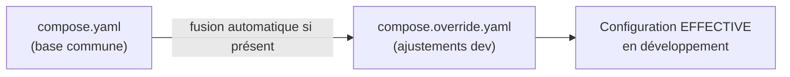

# Chapitre 28 — Environnements dev/test/prod et gestion des `.env`

**Niveau : Avancé**

---

## Introduction

Ce chapitre ouvre la Partie VIII en tenant une promesse faite au chapitre 14 : une solution durable et propre à la tension entre une image de développement (avec `nodemon`, rechargement à chaud) et une image de production (allégée, sans outillage de développement) — issues du **même** projet, sans jamais dupliquer le code ni les Dockerfiles.

---

## 🎯 Objectifs pédagogiques

À la fin de ce chapitre, tu sauras :
- organiser des fichiers `.env` distincts par environnement, sans jamais les confondre ;
- utiliser un Dockerfile multi-étapes avec des **cibles nommées** (`--target`) pour produire une image de développement et une image de production distinctes depuis un seul fichier ;
- utiliser `compose.override.yaml`, fusionné automatiquement par Compose en développement, sans option supplémentaire ;
- construire un fichier `compose.prod.yaml` explicite pour la production, activé uniquement à la demande ;
- reconnaître et éviter les anti-patterns qui mélangent les environnements.

## 📋 Prérequis

Chapitre 9 (`.env`) et chapitre 14 (la tension dev/prod laissée en suspens).

## Pourquoi ce chapitre est important

Une confusion entre environnements — une clé de production utilisée en test, une base de données de développement partagée avec la production par erreur — est une des catégories d'incidents les plus évitables et pourtant les plus fréquentes en informatique. Ce chapitre structure une séparation claire, reprise dans tous les projets de la Partie X.

---

## Concepts fondamentaux

1. **`.env` par environnement** — jamais un seul fichier pour tout.
2. **Cibles de build nommées** — un Dockerfile, plusieurs images.
3. **`compose.override.yaml`** — la fusion automatique de Compose.
4. **`compose.prod.yaml`** — la configuration de production, explicite.
5. **Anti-patterns** — ce qu'il ne faut jamais mélanger.

---

## 28.1 Fichiers `.env` par environnement

```text
projet/
├── .env.development
├── .env.test
├── .env.production
└── .env.example
```

```text
# [.env.development]
NODE_ENV=development
DB_HOST=db
DB_PASSWORD=dev_motdepasse_sans_consequence
LOG_LEVEL=debug
```

```text
# [.env.production]
NODE_ENV=production
DB_HOST=db
DB_PASSWORD=CHANGE_MOI_valeur_reelle_jamais_versionnee
LOG_LEVEL=error
```

> ⚠️ **Attention** — Seul `.env.example` (rappel du chapitre 9) est versionné. **Aucun** des trois autres fichiers réels ne doit l'être, y compris `.env.development` s'il contient déjà un mot de passe, même "sans conséquence" — la discipline doit rester uniforme sur les trois, pour ne jamais avoir à se demander au cas par cas lequel est sûr à committer.

```bash
# [Terminal] — charger explicitement le bon fichier selon le contexte
docker compose --env-file .env.development up -d
docker compose --env-file .env.production up -d
```

---

## 28.2 Cibles de build nommées : résoudre la tension du chapitre 14

```dockerfile
# [backend/Dockerfile]
FROM node:20-alpine AS base
WORKDIR /app
COPY package.json package-lock.json ./

FROM base AS dev
RUN npm ci
COPY . .
EXPOSE 3000
CMD ["npm", "run", "dev"]

FROM base AS production
RUN npm ci --omit=dev
COPY src/ ./src/
ENV NODE_ENV=production
USER node
EXPOSE 3000
CMD ["node", "src/index.js"]
```

**Explication :**
```text
FROM node:20-alpine AS base
→ une étape COMMUNE aux deux cibles (image de base + dépendances de fichiers,
  chapitre 15 pour le principe général du multi-stage build)

FROM base AS dev
→ une cible nommée "dev" qui repart de "base", installe TOUTES les dépendances
  (y compris devDependencies, comme nodemon) et lance "npm run dev"

FROM base AS production
→ une cible nommée "production", séparée, qui n'installe QUE les dépendances
  de production (--omit=dev, rappel du chapitre 14) et lance directement "node"
```

```bash
# [Terminal] — construire spécifiquement l'une ou l'autre cible
docker build --target dev -t mon-backend:dev .
docker build --target production -t mon-backend:prod .
```

**Explication :**
```text
--target dev / --target production
→ indique à "docker build" de s'arrêter à la cible nommée demandée,
  ignorant les instructions des autres cibles du même fichier
```

> 📌 **À retenir, la solution promise au chapitre 14** — Un seul Dockerfile, deux cibles nommées, deux images radicalement différentes (l'une avec `nodemon` et un vrai rechargement automatique, l'autre allégée et prête pour la production) — sans jamais dupliquer le code source ni maintenir deux Dockerfiles séparés qui risqueraient de diverger avec le temps.

```yaml
# [compose.yaml, extrait — cible "production" par défaut]
services:
  backend:
    build:
      context: ./backend
      target: production
```

---

## 28.3 `compose.override.yaml` : la fusion automatique de Compose

```yaml
# [compose.yaml — base commune à tous les environnements]
services:
  backend:
    build:
      context: ./backend
      target: production
    environment:
      NODE_ENV: production
```

```yaml
# [compose.override.yaml — présent UNIQUEMENT en développement]
services:
  backend:
    build:
      target: dev
    volumes:
      - ./backend/src:/app/src
    environment:
      NODE_ENV: development
```

```bash
# [Terminal] — en développement, AUCUNE option -f nécessaire
docker compose up -d
```

> 📌 **À retenir — un comportement peu connu mais central de ce chapitre** — `docker compose up` (et la plupart des sous-commandes Compose) **fusionne automatiquement** `compose.yaml` avec `compose.override.yaml`, s'il existe dans le même dossier, **sans qu'aucune option `-f` ne soit nécessaire** — c'est le comportement par défaut, pensé précisément pour ce cas d'usage : une base commune, et des ajustements de développement appliqués automatiquement en local, jamais ailleurs.



> ⚠️ **Attention** — `compose.override.yaml` ne doit **jamais** être présent (ou doit être explicitement ignoré) sur un serveur de production — sa simple présence dans le dossier suffit à déclencher la fusion automatique, un piège si ce fichier est accidentellement copié vers un serveur qui ne devrait exécuter que `compose.yaml` seul.

---

## 28.4 `compose.prod.yaml` : la production, explicite

```yaml
# [compose.prod.yaml]
services:
  backend:
    build:
      target: production
    environment:
      NODE_ENV: production
    restart: unless-stopped
    deploy:
      resources:
        limits:
          memory: 512M
```

```bash
# [Terminal] — en production, TOUJOURS explicite avec -f
docker compose -f compose.yaml -f compose.prod.yaml --env-file .env.production up -d
```

**Explication :**
```text
-f compose.yaml -f compose.prod.yaml
→ fusionne EXPLICITEMENT ces deux fichiers précis, dans cet ordre
  (le second peut surcharger des valeurs du premier) — contrairement
  à compose.override.yaml, cette fusion n'est JAMAIS automatique,
  elle doit toujours être demandée explicitement
```

> 📌 **À retenir, la distinction centrale de ce chapitre** — `compose.override.yaml` = fusion **automatique**, réservée au développement local par convention. `compose.prod.yaml` (ou tout autre nom explicite, `compose.staging.yaml` pour un environnement de test intermédiaire) = fusion **toujours explicite** via `-f`, jamais accidentelle. Cette asymétrie est volontaire : le risque d'une fusion de production accidentelle doit être structurellement impossible, quand la commodité d'une fusion de développement automatique est, elle, souhaitable.

---

## 28.5 Anti-patterns à éviter

> ❌ **Ne jamais faire** — Utiliser `.env.production` (même en lecture seule, "juste pour tester") sur une machine de développement — un seul copier-coller malheureux peut suffire à faire pointer un environnement de test vers une vraie base de données de production.

> ❌ **Ne jamais faire** — Partager le même volume de base de données (chapitre 10) entre plusieurs environnements — un test destructif en développement ne doit **jamais** pouvoir affecter des données de production, même indirectement.

> ❌ **Ne jamais faire** — Committer `compose.override.yaml` avec des valeurs qui varient d'un développeur à l'autre de l'équipe (des ports personnalisés, par exemple) — le garder dans `.gitignore` si son contenu est individuel, ou le committer seulement s'il est réellement identique pour toute l'équipe.

> ✅ **Bonne pratique** — Nommer les ressources (conteneurs, volumes, réseaux) de façon à ce qu'une confusion entre environnements soit visible au premier coup d'œil — `db-data-dev` plutôt qu'un simple `db-data` ambigu, repris dans les projets de la Partie X.

---

## Erreurs fréquentes (récapitulatif du chapitre)

| Erreur | Cause | Solution |
|---|---|---|
| L'application de développement pointe vers une vraie base de données | `.env.production` chargé par erreur en local | Toujours vérifier explicitement quel `--env-file` est utilisé avant `up` |
| La cible de build "dev" se retrouve en production | `--target` omis ou mal spécifié dans `compose.prod.yaml` | Toujours fixer `target: production` explicitement en production |
| `compose.override.yaml` fusionné sur un serveur de production | Fichier présent par erreur (copié avec le reste du projet) | Exclure ce fichier du déploiement de production, ou vérifier sa non-présence avant `up` |
| Deux développeurs se marchent dessus via un `compose.override.yaml` committé avec des valeurs personnelles | Fichier versionné alors qu'il devrait rester local | L'ajouter au `.gitignore` si son contenu varie par développeur |

---

## Laboratoire pratique n°1 — Construire les deux cibles d'un même Dockerfile

**Objectifs :** exécuter et vérifier la section 28.2.
**Prérequis :** Chapitre 27.

**Étapes :** construis `--target dev` et `--target production` séparément, puis confirme (avec `docker exec ... sh` puis `ls node_modules/.bin/nodemon`, chapitre 23) que `nodemon` est présent dans la première et absent dans la seconde.

**Résultat attendu :** deux images clairement différenciées, issues du même fichier source.

---

## Laboratoire pratique n°2 — Fusion automatique vs fusion explicite

**Objectifs :** vivre la distinction de la section 28.3-28.4.
**Prérequis :** Laboratoire 1 complété.

**Étapes :**
1. Avec `compose.yaml` et `compose.override.yaml` en place, `docker compose up -d` (sans `-f`) — confirme que la cible `dev` est utilisée (via `docker compose config`, qui affiche la configuration fusionnée finale).
2. `docker compose -f compose.yaml -f compose.prod.yaml config` — confirme que la cible `production` apparaît cette fois, sans jamais avoir été mélangée avec l'override de développement.

**Résultat attendu :** confirmation, via `docker compose config`, que les deux chemins de fusion produisent des configurations effectives différentes et cohérentes avec leur environnement respectif.

---

## Laboratoire pratique n°3 — Vérifier l'étanchéité des environnements

**Objectifs :** appliquer consciemment la section 28.5 comme une checklist.
**Prérequis :** Laboratoires 1 et 2 complétés.

**Étapes :** sur un projet de ton choix, vérifie : `.env.production` est-il dans `.gitignore` ? Les volumes de développement et de production portent-ils des noms distincts ? `compose.override.yaml` est-il absent de tout ce qui serait déployé en production ?

**Résultat attendu :** une checklist personnelle validée, réutilisable pour chaque futur projet.

---

## Exercices

1. Pourquoi `compose.override.yaml` se fusionne-t-il automatiquement, alors que `compose.prod.yaml` ne le fait jamais sans `-f` explicite ?
2. Comment un seul Dockerfile peut-il produire deux images aussi différentes qu'une image de développement avec `nodemon` et une image de production allégée ?
3. Pourquoi ne faut-il jamais partager le volume d'une base de données entre développement et production ?
4. Que se passerait-il si `.env.production` était chargé par erreur sur une machine de développement ?
5. Pourquoi la présence même (pas seulement le contenu) de `compose.override.yaml` peut-elle être un risque sur un serveur de production ?

---

## Quiz

**Question 1.** `docker compose up`, sans aucune option `-f`, fusionne automatiquement :
a) `compose.yaml` et n'importe quel autre fichier Compose du dossier
b) `compose.yaml` et `compose.override.yaml`, si ce dernier existe
c) Rien, il faut toujours préciser `-f`
d) `compose.prod.yaml` par défaut

**Question 2.** `docker build --target dev` :
a) Construit toutes les cibles du Dockerfile
b) S'arrête à la cible nommée "dev", ignorant les autres cibles définies
c) Ignore le Dockerfile et utilise une image par défaut
d) N'a aucun effet sans `compose.yaml`

**Question 3.** `compose.prod.yaml` doit être fusionné :
a) Automatiquement, comme `compose.override.yaml`
b) Toujours explicitement, via l'option `-f`
c) Jamais, il est purement documentaire
d) Uniquement en développement

**Question 4.** Partager le même volume de base de données entre développement et production risquerait :
a) Uniquement un ralentissement mineur
b) Qu'un test destructif en développement affecte de vraies données de production
c) Rien, les volumes sont toujours isolés automatiquement par environnement
d) Une erreur de syntaxe Compose

**Question 5.** Un fichier `.env.production` doit :
a) Être versionné pour que toute l'équipe y ait accès
b) Ne jamais être versionné, comme tout fichier `.env` réel
c) Être renommé `.env` avant chaque déploiement
d) Contenir les mêmes valeurs que `.env.development`

> 🔑 **Corrigé** — 1: b · 2: b · 3: b · 4: b · 5: b

---

## 📝 Résumé du chapitre

- Des fichiers `.env` distincts par environnement (`.env.development`, `.env.test`, `.env.production`) évitent toute confusion de configuration — seul `.env.example` est versionné.
- Un Dockerfile avec des cibles nommées (`AS dev`, `AS production`) et `--target` résout durablement la tension entre image de développement (outillée) et image de production (allégée), sans dupliquer de code.
- `compose.override.yaml` se fusionne **automatiquement** avec `compose.yaml` en développement, sans option `-f` — un comportement par défaut de Compose, pas une coïncidence.
- `compose.prod.yaml` (ou tout fichier équivalent) exige toujours une fusion **explicite** via `-f`, une asymétrie volontaire qui rend une erreur de production structurellement plus difficile.
- Ne jamais partager de ressources sensibles (volumes, clés) entre environnements, et vérifier systématiquement quel fichier `.env` est réellement chargé avant chaque `up`.

## ✅ Checklist avant de passer au chapitre 29

- [ ] J'ai construit deux cibles distinctes (`dev`/`production`) depuis un seul Dockerfile.
- [ ] Je sais expliquer pourquoi `compose.override.yaml` se fusionne automatiquement et `compose.prod.yaml` non.
- [ ] Mes fichiers `.env` par environnement sont correctement isolés et non versionnés.
- [ ] Je sais vérifier, avant tout déploiement, qu'aucun mélange d'environnement n'est possible.
- [ ] J'ai réalisé les trois laboratoires de ce chapitre.
- [ ] J'ai obtenu au moins 4/5 au quiz.

---

## Glossaire du chapitre

**Cible de build nommée (`AS nom`, `--target`)**
Définition simple : une étape identifiée d'un Dockerfile multi-étapes, constructible indépendamment des autres.
Voir : Chapitre 28, section 28.2 (rappel du multi-stage général, chapitre 15).

**`compose.override.yaml`**
Définition simple : un fichier Compose fusionné automatiquement avec `compose.yaml`, par convention réservé aux ajustements de développement.
Voir : Chapitre 28, section 28.3.

---

## ❓ FAQ

**Peut-on avoir plus de deux cibles dans un Dockerfile (dev, test, production) ?**
Oui, sans limite technique — un projet avec un environnement de test aux besoins spécifiques (des outils de test précis, par exemple) peut avoir une troisième cible `AS test`, construite avec `--target test`.

**`docker compose config` sert-il uniquement au diagnostic de ce chapitre ?**
Non — c'est un outil général très utile dès que la configuration Compose devient complexe (plusieurs fichiers fusionnés, variables interpolées) pour visualiser, à tout moment, la configuration réellement effective avant de lancer quoi que ce soit.

**Faut-il un `compose.test.yaml` séparé pour un environnement de test intermédiaire (staging) ?**
Généralement oui, sur le même principe explicite que `compose.prod.yaml` — un environnement de test intermédiaire mérite sa propre configuration, ni celle du développement local ni celle de la production réelle.

---

## Références officielles

- Fichiers Compose multiples et fusion — [docs.docker.com/compose/how-tos/multiple-compose-files](https://docs.docker.com/compose/how-tos/multiple-compose-files/)
- `docker compose config` — [docs.docker.com/reference/cli/docker/compose/config](https://docs.docker.com/reference/cli/docker/compose/config/)
- Cibles de build multi-étapes — [docs.docker.com/build/building/multi-stage/#stop-at-a-specific-build-stage](https://docs.docker.com/build/building/multi-stage/#stop-at-a-specific-build-stage)

---

## Conclusion

Développement, test et production sont désormais des environnements structurellement séparés, jamais mélangés par accident. Le chapitre 29 quitte enfin la machine locale : préparer un vrai VPS, de A à Z, jusqu'au premier déploiement réel.

---

⬅️ [Chapitre 27 — Registries](27-registries-docker-hub-et-prive.md) · ➡️ **Suite : Chapitre 29 — Déploiement sur VPS, de A à Z**
