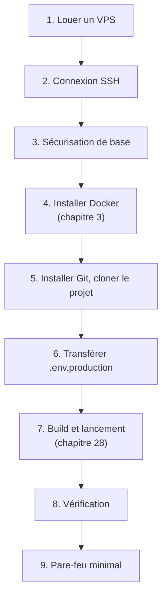

# Chapitre 29 — Déploiement sur VPS, de A à Z

**Niveau : Avancé**

---

## Introduction

Tout ce manuel a préparé ce chapitre : une application complète, dockerisée avec rigueur, prête à être publiée sur un vrai serveur. Ce chapitre reste volontairement concentré sur ce qui est **spécifique à Docker** — l'administration Linux pure (SSH, `ufw`, gestion des utilisateurs) est déjà traitée en profondeur dans le Guide Ultime du Déploiement de ce même portefeuille, et n'est ici que rappelée, jamais réexpliquée depuis zéro.

---

## 🎯 Objectifs pédagogiques

À la fin de ce chapitre, tu sauras :
- préparer un VPS Ubuntu, du choix de l'hébergeur jusqu'à un accès SSH sécurisé de base ;
- installer Docker sur ce serveur en réutilisant directement les commandes du chapitre 3 ;
- transférer un projet et sa configuration de production sur le serveur, sans jamais faire transiter `.env.production` par Git ;
- construire et lancer une application complète en production, avec les fichiers Compose du chapitre 28 ;
- vérifier le bon fonctionnement et configurer un pare-feu minimal.

## 📋 Prérequis

Chapitres 3 (installation Docker), 21 (healthchecks), 28 (environnements). Des bases Linux/SSH aident — voir le Guide Ultime du Déploiement (chapitres 1 à 4) pour un apprentissage complet de ces fondations, non répétées ici.

## Pourquoi ce chapitre est important

C'est le moment où tout le reste du manuel prend un sens concret : une application qui tournait uniquement sur une machine de développement devient accessible depuis Internet, avec les mêmes garanties (isolation, reproductibilité, chapitre 1) qu'en local.

---

## Concepts fondamentaux

1. **Préparer un VPS** — bref rappel, renvoi au Guide Ultime pour le détail.
2. **Installer Docker sur le serveur** — rappel direct du chapitre 3.
3. **Transférer le projet et sa configuration** — sans jamais exposer `.env.production` via Git.
4. **Construire et lancer en production** — application du chapitre 28.
5. **Vérifier et sécuriser le minimum réseau** — rappel des chapitres 8, 11, 26.

---

## 29.1 Vue d'ensemble du parcours



---

## 29.2 Louer un VPS (rappel bref)

| Hébergeur | Repère |
|---|---|
| Hetzner, Contabo | Rapport prix/ressources compétitif, bon point de départ |
| DigitalOcean | Interface simple, bonne documentation |
| OVH | Option locale pour certains contextes francophones |

> Pour un comparatif complet (prix, ressources, cas d'usage) et le détail de la création d'un VPS chez chacun, voir le **Guide Ultime du Déploiement, chapitre 4**. Ce chapitre suppose un VPS Ubuntu 22.04 LTS ou plus récent déjà obtenu, avec ses identifiants de connexion initiaux.

---

## 29.3 Connexion SSH et sécurisation de base (rappel)

```bash
# [Terminal] — première connexion (root, mot de passe temporaire fourni par l'hébergeur)
ssh root@IP_DU_SERVEUR

# [Terminal, sur le serveur] — créer un utilisateur non-root
adduser jaslin
usermod -aG sudo jaslin

# [Terminal, sur le serveur] — pare-feu minimal, SSH d'abord
ufw allow OpenSSH
ufw enable
```

> ⚠️ **Attention** — Ne jamais activer `ufw` sans avoir d'abord autorisé SSH (`ufw allow OpenSSH`) — l'inverse verrouillerait totalement l'accès au serveur, sans solution simple à distance. Ce point, et l'ensemble du durcissement SSH (clé plutôt que mot de passe, désactivation de la connexion root directe), sont traités en détail au **Guide Ultime du Déploiement, chapitre 4** — ce manuel les suppose acquis à partir d'ici.

---

## 29.4 Installer Docker sur le serveur

> 📌 **Reprendre directement la section 3.3 de ce manuel** — L'installation de Docker Engine sur Ubuntu est **identique**, que ce soit sur une machine locale (chapitre 3) ou sur un VPS distant via SSH : repository officiel, `docker-ce`/`docker-ce-cli`/`containerd.io`/`docker-compose-plugin`, groupe `docker`, `systemctl enable docker`. Aucune commande supplémentaire n'est nécessaire spécifiquement pour un VPS.

```bash
# [Terminal, sur le serveur] — vérification, comme au chapitre 3
docker --version
docker compose version
docker run hello-world
```

> ⚠️ **Attention, rappel du chapitre 3 particulièrement important ici** — `sudo systemctl enable docker` garantit que Docker redémarre automatiquement avec la machine — indispensable sur un serveur distant, qui peut redémarrer (maintenance de l'hébergeur, coupure) sans qu'un humain ne soit présent pour relancer manuellement le service.

---

## 29.5 Installer Git et récupérer le projet

```bash
# [Terminal, sur le serveur]
sudo apt install -y git
git clone git@github.com:mon-compte/mon-projet.git
cd mon-projet
```

> Pour un dépôt privé, l'authentification par **clé SSH** (et éventuellement une Deploy Key dédiée au serveur, plus restrictive qu'une clé personnelle complète) est la méthode recommandée — configuration détaillée au **Guide Ultime du Déploiement, chapitre 3**.

---

## 29.6 Transférer `.env.production`, jamais via Git

> ⚠️ **Attention — rappel absolu des chapitres 9 et 28** — `.env.production` n'est **jamais** versionné, donc **jamais** présent après un `git clone`. Il doit être transféré séparément, par un canal qui ne laisse aucune trace dans l'historique du projet.

```bash
# [Terminal, depuis ta machine locale] — transfert sécurisé via SCP (au-dessus de SSH)
scp .env.production jaslin@IP_DU_SERVEUR:~/mon-projet/.env.production
```

**Explication :**
```text
scp
→ "secure copy" : copie un fichier vers un serveur distant, à travers
  une connexion SSH déjà chiffrée (même protocole que la connexion elle-même)
```

> ✅ **Bonne pratique alternative** — Pour une équipe, un gestionnaire de secrets partagé (hors périmètre détaillé de ce manuel, mentionné au chapitre 26) évite de faire transiter les vraies valeurs par un simple transfert de fichier ponctuel — `scp` reste une solution raisonnable pour un déploiement individuel ou une petite équipe, comme celles de la majorité des projets de ce manuel.

---

## 29.7 Construire et lancer en production

```bash
# [Terminal, sur le serveur, depuis le dossier du projet]
docker compose -f compose.yaml -f compose.prod.yaml --env-file .env.production up -d --build
```

**Explication :** exactement la commande introduite au chapitre 28 — aucune nouveauté ici, seulement son exécution sur la machine qui compte réellement : le serveur de production, plutôt qu'une machine de développement.

> 📌 **À retenir** — Ce premier `docker compose ... up -d --build` sur le serveur reconstruit **toutes** les images depuis zéro, sans aucun cache de build préexistant (rappel du chapitre 7 : le cache est propre à la machine où `docker build` a déjà tourné) — une construction plus longue que sur une machine de développement habituée, normale au premier déploiement.

---

## 29.8 Vérification

```bash
# [Terminal, sur le serveur]
docker compose ps
```

**Résultat attendu :** tous les services `Up`, ceux dotés d'un `HEALTHCHECK` (chapitre 21) affichant `(healthy)`.

```bash
# [Terminal, sur le serveur] — tester l'application EN LOCAL sur le serveur lui-même, avant tout domaine (chapitre 30)
curl http://localhost:8080/
curl http://localhost:8080/api/tasks
```

> 📌 **À retenir** — À ce stade, l'application n'est vérifiable **que depuis le serveur lui-même** (`localhost`) ou via son adresse IP brute, éventuellement — aucun nom de domaine ni HTTPS n'est encore configuré, ce sera l'objet du chapitre 30. C'est une étape de vérification intermédiaire volontaire, pas encore la mise en ligne définitive.

```bash
# [Terminal, sur le serveur] — logs en cas de problème (rappel chapitre 22)
docker compose logs -f
```

---

## 29.9 Pare-feu minimal pour l'application

```bash
# [Terminal, sur le serveur]
sudo ufw allow 80
sudo ufw allow 443
sudo ufw status
```

> ⚠️ **Attention — rappel direct et critique des chapitres 8, 11 et 26** — Seuls les ports **22** (SSH), **80** et **443** (HTTP/HTTPS, via Nginx, chapitre 19 et 30) doivent être ouverts sur ce pare-feu. **Aucun port de base de données, de Redis, ou de backend interne ne doit jamais apparaître dans cette liste** — leur accès reste exclusivement interne au réseau Docker du serveur (chapitre 11), jamais exposé publiquement, exactement comme conçu depuis la Partie IV de ce manuel.

```bash
# [Terminal, sur le serveur] — confirmer qu'AUCUN port interne n'est exposé
sudo ufw status numbered
```

**Résultat attendu :** seuls 22, 80 et 443 apparaissent — si un port comme 5432 (PostgreSQL) ou 6379 (Redis) y figurait, ce serait le signe d'une configuration `ports:` laissée par erreur dans `compose.prod.yaml` (rappel du chapitre 20, où seul le service `nginx` publie un port).

---

## Erreurs fréquentes (récapitulatif du chapitre)

| Erreur | Cause | Solution |
|---|---|---|
| Verrouillage total de l'accès SSH | `ufw enable` sans avoir autorisé SSH au préalable | Toujours `ufw allow OpenSSH` en premier (section 29.3) — voir aussi Guide Ultime du Déploiement, chapitre 4 |
| Application accessible mais base de données exposée | Configuration `ports:` de développement copiée telle quelle en production | Vérifier `compose.prod.yaml` : seul le service public doit publier un port |
| `.env.production` absent après `git clone` | Comportement normal et voulu (rappel chapitre 9/28) | Le transférer séparément via `scp` |
| Docker ne redémarre pas après un redémarrage du serveur | `systemctl enable docker` omis | Vérifier avec `systemctl is-enabled docker`, corriger si nécessaire |
| Premier build très long | Absence de cache sur une machine neuve | Normal, attendu, ne se reproduit pas aux déploiements suivants (chapitre 32) |

---

## Laboratoire pratique n°1 — Préparer un VPS sécurisé de base

**Objectifs :** obtenir un accès SSH sécurisé fonctionnel.
**Prérequis :** un VPS Ubuntu (ou une VM locale simulant un VPS, à défaut de budget).

**Étapes :** reproduis les sections 29.2-29.3, en t'appuyant sur le Guide Ultime du Déploiement pour le détail complet de chaque commande si nécessaire.

**Résultat attendu :** connexion SSH réussie avec un utilisateur non-root, pare-feu actif autorisant au minimum SSH.

---

## Laboratoire pratique n°2 — Installer Docker sur ce serveur

**Objectifs :** exécuter la section 29.4.
**Prérequis :** Laboratoire 1 complété.

**Étapes :** reproduis exactement la section 3.3 de ce manuel, cette fois sur le VPS via SSH.

**Résultat attendu :** `docker run hello-world` réussi sur le serveur distant, exactement comme en local au chapitre 3.

---

## Laboratoire pratique n°3 — Déployer le projet complet

**Objectifs :** exécuter les sections 29.5 à 29.9 de bout en bout.
**Prérequis :** Laboratoires 1 et 2 complétés, projet des chapitres 20-21 disponible sur un dépôt Git.

**Étapes :** clone le projet, transfère `.env.production`, construis et lance avec la commande de la section 29.7, vérifie avec `docker compose ps` et `curl` local au serveur, configure le pare-feu minimal.

**Résultat attendu :** l'application complète (chapitres 20-21) tournant réellement sur un vrai serveur, vérifiée fonctionnelle et avec un pare-feu n'exposant que le strict nécessaire.

---

## Exercices

1. Pourquoi ce chapitre ne détaille-t-il pas la configuration SSH en profondeur ?
2. Pourquoi l'installation de Docker est-elle identique entre une machine locale et un VPS ?
3. Comment `.env.production` arrive-t-il sur le serveur, sans jamais passer par Git ?
4. Pourquoi le tout premier `docker compose up -d --build` sur un serveur neuf est-il plus long que les suivants ?
5. Quels sont les seuls ports qui devraient apparaître dans `ufw status` à la fin de ce chapitre, et pourquoi ?

---

## Quiz

**Question 1.** L'installation de Docker sur un VPS Ubuntu, comparée à une machine locale Ubuntu (chapitre 3) :
a) Nécessite des commandes entièrement différentes
b) Utilise exactement les mêmes commandes
c) N'est pas possible sur un VPS
d) Nécessite Docker Desktop

**Question 2.** `.env.production` sur le serveur provient de :
a) `git clone`, comme le reste du projet
b) Un transfert séparé (par exemple `scp`), jamais du dépôt Git
c) Une génération automatique par Docker
d) Docker Hub

**Question 3.** Activer `ufw` sans avoir autorisé SSH au préalable risque de :
a) N'avoir aucun effet
b) Verrouiller totalement l'accès distant au serveur
c) Désinstaller Docker
d) Supprimer le projet cloné

**Question 4.** À la fin de ce chapitre, `ufw status` devrait afficher :
a) Tous les ports des services Docker, y compris la base de données
b) Uniquement 22 (SSH), 80 et 443
c) Aucun port ouvert
d) Uniquement le port de la base de données

**Question 5.** Le tout premier build sur un serveur neuf est plus long parce que :
a) Le serveur est toujours plus lent qu'une machine locale
b) Aucun cache de build (chapitre 7) n'existe encore sur cette machine
c) Docker doit être réinstallé à chaque build
d) Le réseau Docker doit être recréé à chaque fois

> 🔑 **Corrigé** — 1: b · 2: b · 3: b · 4: b · 5: b

---

## 📝 Résumé du chapitre

- Ce chapitre s'appuie explicitement sur le Guide Ultime du Déploiement pour les fondations Linux/SSH pures, et se concentre sur ce qui est spécifique à Docker.
- L'installation de Docker sur un VPS reprend, sans modification, la procédure du chapitre 3.
- `.env.production` ne transite jamais par Git — un transfert séparé (`scp` ou équivalent) est requis à chaque nouveau serveur.
- Le lancement en production réutilise directement la commande à plusieurs fichiers Compose du chapitre 28.
- Le pare-feu final ne doit exposer que 22/80/443 — tout port de base de données ou de service interne exposé serait un signal d'alerte immédiat.

## ✅ Checklist avant de passer au chapitre 30

- [ ] J'ai un VPS avec un accès SSH sécurisé de base.
- [ ] Docker est installé et démarre automatiquement au redémarrage du serveur.
- [ ] `.env.production` est présent sur le serveur, jamais via Git.
- [ ] L'application complète tourne et répond via `curl` local au serveur.
- [ ] Le pare-feu n'expose que 22, 80 et 443.
- [ ] J'ai réalisé les trois laboratoires de ce chapitre.
- [ ] J'ai obtenu au moins 4/5 au quiz.

---

## Glossaire du chapitre

**VPS (Virtual Private Server)**
Définition simple : un serveur virtuel loué chez un hébergeur, avec un accès administrateur complet (rappel du Guide Ultime du Déploiement).
Voir : Chapitre 29, section 29.2.

**`scp`**
Définition simple : la commande de copie sécurisée de fichiers à travers une connexion SSH.
Voir : Chapitre 29, section 29.6.

---

## ❓ FAQ

**Peut-on utiliser un registry privé (chapitre 27) plutôt que de construire directement sur le serveur ?**
Oui, et c'est même l'approche recommandée pour un déploiement plus rapide et plus fiable (l'image est déjà construite et testée avant d'arriver sur le serveur, qui n'a plus qu'à la `pull`) — approfondi dans une forme automatisée au chapitre 31 (CI/CD).

**Faut-il un VPS séparé par environnement (test, production) ?**
Idéalement oui pour un projet sérieux, avec des `.env` et des Compose distincts par serveur (chapitre 28) — un seul VPS peut néanmoins héberger plusieurs projets ou environnements avec des ports/domaines différents, une pratique courante pour des projets de taille modeste.

**Ce chapitre suffit-il pour un vrai lancement en production ?**
Pas encore complètement — il manque HTTPS (chapitre 30), une automatisation du déploiement (chapitre 31) et une stratégie de sauvegarde (chapitre 33), tous couverts dans les chapitres suivants.

---

## Références officielles

- Voir le Guide Ultime du Déploiement (ce portefeuille) pour l'ensemble des fondations Linux, SSH et VPS non répétées ici.
- Installation Docker Engine — [docs.docker.com/engine/install/ubuntu](https://docs.docker.com/engine/install/ubuntu/) (rappel du chapitre 3)
- `scp` — documentation manuelle système (`man scp`) sur toute machine Linux/macOS.

---

## Conclusion

Une application Docker complète tourne maintenant sur un vrai serveur, vérifiée et minimalement sécurisée au niveau réseau. Le chapitre 30 franchit la dernière étape avant une vraie mise en ligne : un nom de domaine et un certificat HTTPS.

---

⬅️ [Chapitre 28 — Environnements dev/test/prod](28-environnements-dev-test-prod.md) · ➡️ **Suite : Chapitre 30 — Domaine et HTTPS**
