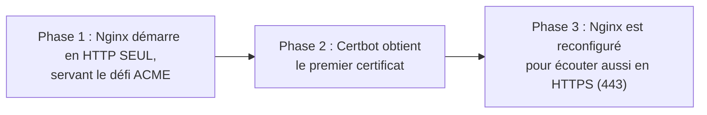

# Chapitre 30 — Domaine et HTTPS

**Niveau : Avancé**

---

## Introduction

Le chapitre 29 a laissé l'application accessible uniquement par IP brute, sans chiffrement. Ce chapitre franchit la dernière étape avant une vraie mise en ligne : un nom de domaine, et un certificat HTTPS — avec un défi spécifiquement lié à Docker que ce chapitre résout en détail : où stocker un certificat de façon persistante, et comment le renouveler sans jamais interrompre le service.

---

## 🎯 Objectifs pédagogiques

À la fin de ce chapitre, tu sauras :
- pointer un nom de domaine vers ton VPS (rappel bref, détail complet ailleurs) ;
- expliquer le problème de "l'œuf et la poule" entre Nginx et Certbot dans un contexte conteneurisé ;
- obtenir un premier certificat Let's Encrypt via le flux webroot, en deux phases ;
- stocker un certificat dans un volume Docker, jamais dans la couche inscriptible d'un conteneur ;
- configurer un renouvellement automatique, avec rechargement de Nginx sans interruption du service.

## 📋 Prérequis

Chapitre 29. Le Guide Ultime du Déploiement (chapitres 1 et 10) pour le détail complet du DNS et des certificats en général, non répété ici.

## Pourquoi ce chapitre est important

Sans ce chapitre, l'application déployée au chapitre 29 reste un projet de test, jamais une vraie mise en production — un site sans HTTPS est aujourd'hui signalé "non sécurisé" par tout navigateur moderne, et de nombreuses fonctionnalités web (géolocalisation, notifications push) exigent HTTPS pour fonctionner.

---

## Concepts fondamentaux

1. **Pointer un domaine** — rappel bref (DNS déjà couvert ailleurs dans ce portefeuille).
2. **Le problème de l'œuf et la poule** — Nginx a besoin d'un certificat, Certbot a besoin de Nginx.
3. **Stockage persistant du certificat** — un volume, comme toute donnée qui compte.
4. **Renouvellement automatique** — sans jamais casser le service en cours.

---

## 30.1 Pointer un domaine vers le VPS (rappel bref)

Chez le registrar du domaine (où il a été acheté), créer un enregistrement DNS de type `A` pointant vers l'adresse IP du VPS (chapitre 29) :

```text
Type   Nom    Valeur              TTL
A      @      IP_DU_VPS           3600
A      www    IP_DU_VPS           3600
```

> Pour tout le détail du fonctionnement du DNS, des types d'enregistrements et de la propagation, voir le **Guide Ultime du Déploiement, chapitres 1 et 10** — ce chapitre suppose un domaine déjà pointé et propagé (vérifiable via `dnschecker.org` ou `nslookup mondomaine.ht`).

---

## 30.2 Le problème spécifique à un Nginx conteneurisé

> ⚠️ **Attention — le vrai défi de ce chapitre** — Nginx (chapitre 19), pour écouter en HTTPS sur le port 443, a besoin d'un certificat **déjà existant**. Mais Certbot (l'outil qui obtient un certificat gratuit auprès de Let's Encrypt) a besoin, pour prouver la propriété du domaine via le défi **webroot**, que Nginx **soit déjà en train de servir du contenu** sur le port 80 à l'emplacement précis du défi. **Aucun des deux ne peut fonctionner sans l'autre** — un problème classique de l'œuf et la poule, résolu ici en deux phases distinctes.



---

## 30.3 Architecture Compose : Nginx + Certbot

```yaml
# [compose.prod.yaml, extrait — ajoute un service certbot et des volumes partagés]
services:
  nginx:
    build:
      context: ./frontend
      target: production
    ports:
      - "80:80"
      - "443:443"
    volumes:
      - certbot-etc:/etc/letsencrypt
      - certbot-webroot:/var/www/certbot
    depends_on:
      - backend

  certbot:
    image: certbot/certbot
    volumes:
      - certbot-etc:/etc/letsencrypt
      - certbot-webroot:/var/www/certbot
    entrypoint: >
      sh -c "trap exit TERM; while :; do certbot renew; sleep 12h & wait $${!}; done"

volumes:
  certbot-etc:
  certbot-webroot:
```

**Explication :**
```text
certbot-etc → /etc/letsencrypt
→ le VOLUME (rappel du chapitre 10) où Certbot écrit le certificat obtenu,
  PARTAGÉ avec le conteneur nginx qui doit pouvoir le lire

certbot-webroot → /var/www/certbot
→ un second volume PARTAGÉ, où Certbot dépose temporairement le "défi"
  que Let's Encrypt viendra vérifier via une requête HTTP standard sur le domaine

entrypoint: "... while :; do certbot renew; sleep 12h ...; done"
→ le conteneur certbot ne fait rien d'autre, en continu, que tenter un
  renouvellement toutes les 12 heures — "certbot renew" ne fait RIEN
  si le certificat existant est encore loin de son expiration (inoffensif à répéter)
```

> ⚠️ **Attention — rappel direct du chapitre 10 et du chapitre 27** — Sans les volumes `certbot-etc`/`certbot-webroot`, un certificat obtenu serait perdu à la moindre suppression du conteneur `certbot`, exactement le même risque déjà rencontré pour une base de données (chapitre 10) et un registry (chapitre 27). Un certificat, une fois obtenu, est une donnée précieuse à ne jamais laisser dans une couche inscriptible éphémère.

---

## 30.4 Phase 1 : Nginx en HTTP seul, prêt pour le défi ACME

```nginx
# [frontend/nginx.conf — PHASE 1, avant tout certificat]
server {
    listen 80;
    server_name mondomaine.ht www.mondomaine.ht;

    location /.well-known/acme-challenge/ {
        root /var/www/certbot;
    }

    location / {
        return 301 https://$host$request_uri;
    }
}
```

**Explication :**
```text
location /.well-known/acme-challenge/
→ sert exactement les fichiers que Let's Encrypt viendra vérifier via HTTP,
  déposés par Certbot dans le volume partagé /var/www/certbot

location / { return 301 https://... }
→ redirige tout le reste vers HTTPS — mais ATTENTION, ce bloc ne doit être
  ajouté qu'APRÈS l'obtention du premier certificat (sinon la redirection
  vers un HTTPS qui n'existe pas encore casserait tout, y compris
  potentiellement le défi ACME lui-même selon l'ordre des blocs)
```

> ✅ **Bonne pratique — pour la toute première obtention** — Lancer Nginx en phase 1 **sans** la redirection HTTPS (juste le bloc `acme-challenge` et une réponse HTTP normale sur `/`), obtenir le certificat, **puis seulement** ajouter la redirection et le bloc HTTPS de la section 30.6.

```bash
# [Terminal, sur le serveur] — démarrer avec la configuration phase 1
docker compose -f compose.yaml -f compose.prod.yaml up -d nginx
```

---

## 30.5 Phase 2 : obtenir le premier certificat

```bash
# [Terminal, sur le serveur]
docker compose -f compose.yaml -f compose.prod.yaml run --rm certbot \
  certonly --webroot -w /var/www/certbot \
  -d mondomaine.ht -d www.mondomaine.ht \
  --email toi@exemple.ht --agree-tos --no-eff-email
```

**Explication :**
```text
docker compose run --rm certbot
→ lance un conteneur TEMPORAIRE (--rm : supprimé après exécution, chapitre 4)
  à partir du service "certbot", pour cette commande ponctuelle uniquement
  (différent du conteneur "certbot" en continu défini dans compose.yaml,
  qui ne démarre qu'ensuite pour le renouvellement automatique)

certonly --webroot -w /var/www/certbot
→ demande UNIQUEMENT le certificat (pas de configuration Nginx automatique,
  Certbot ne modifiant jamais notre nginx.conf directement dans ce montage) ;
  "-w" indique où déposer/vérifier le défi, exactement le dossier
  que Nginx sert déjà en phase 1

-d mondomaine.ht -d www.mondomaine.ht
→ les domaines couverts par CE certificat précis

--agree-tos --no-eff-email
→ accepte les conditions d'utilisation de Let's Encrypt, sans inscription
  optionnelle supplémentaire à leur liste de diffusion
```

**Résultat attendu :** un message de succès de Certbot, et un certificat désormais présent dans le volume `certbot-etc`, à l'emplacement `/etc/letsencrypt/live/mondomaine.ht/`.

---

## 30.6 Phase 3 : activer HTTPS dans Nginx

```nginx
# [frontend/nginx.conf — PHASE 2, après obtention du certificat]
server {
    listen 80;
    server_name mondomaine.ht www.mondomaine.ht;

    location /.well-known/acme-challenge/ {
        root /var/www/certbot;
    }

    location / {
        return 301 https://$host$request_uri;
    }
}

server {
    listen 443 ssl;
    server_name mondomaine.ht www.mondomaine.ht;

    ssl_certificate /etc/letsencrypt/live/mondomaine.ht/fullchain.pem;
    ssl_certificate_key /etc/letsencrypt/live/mondomaine.ht/privkey.pem;

    gzip on;
    gzip_types text/plain text/css application/json application/javascript;

    location /api/ {
        proxy_pass http://backend:4000/api/;
        proxy_set_header Host $host;
        proxy_set_header X-Real-IP $remote_addr;
        proxy_set_header X-Forwarded-For $proxy_add_x_forwarded_for;
        proxy_set_header X-Forwarded-Proto $scheme;
    }

    location / {
        root /usr/share/nginx/html;
        try_files $uri $uri/ /index.html;
    }
}
```

**Explication :** deux blocs `server` désormais — le premier (port 80) ne sert plus que le défi ACME et redirige tout le reste vers HTTPS ; le second (port 443) reprend **exactement** la configuration reverse proxy du chapitre 19-20, avec `ssl_certificate`/`ssl_certificate_key` pointant vers les fichiers du volume partagé.

```bash
# [Terminal, sur le serveur] — reconstruire l'image Nginx avec ce nouveau nginx.conf, et relancer
docker compose -f compose.yaml -f compose.prod.yaml up -d --build nginx
```

```bash
# [Terminal, depuis n'importe quelle machine]
curl -I https://mondomaine.ht
```

**Résultat attendu :** `HTTP/2 200`, avec un certificat valide reconnu par le client `curl` lui-même (aucune option `-k`/`--insecure` nécessaire).

> ⚠️ **Attention, rappel du chapitre 19** — Ajouter `X-Forwarded-Proto $scheme` reste essentiel ici : le backend, qui ne reçoit jamais directement une connexion HTTPS (Nginx la termine), doit être informé via cet en-tête que la connexion d'origine était bien chiffrée, pour toute logique applicative qui en dépendrait (cookies marqués "secure", par exemple).

---

## 30.7 Renouvellement automatique, sans interruption de service

Le conteneur `certbot` (section 30.3) tente un renouvellement toutes les 12 heures, mais **Certbot seul ne recharge jamais Nginx** — un certificat renouvelé sur le disque (le volume) reste ignoré par le processus Nginx déjà en cours d'exécution tant qu'il n'est pas explicitement rechargé.

```bash
# [Terminal, sur le serveur] — planifier un rechargement périodique via cron (hôte, pas conteneur)
crontab -e
```

```cron
0 3 * * * docker compose -f /home/jaslin/mon-projet/compose.yaml -f /home/jaslin/mon-projet/compose.prod.yaml exec nginx nginx -s reload
```

**Explication :**
```text
0 3 * * *
→ tous les jours à 3h du matin (syntaxe cron, détaillée au Guide Ultime
  du Déploiement, chapitre 12)

docker compose ... exec nginx nginx -s reload
→ "nginx -s reload" recharge la configuration ET les certificats
  SANS interrompre les connexions déjà établies — contrairement à un
  redémarrage complet du conteneur (docker compose restart, chapitre 4),
  qui provoquerait une brève coupure de service
```

> 📌 **À retenir** — Cette planification quotidienne est délibérément plus fréquente que nécessaire (Let's Encrypt renouvelle généralement autour de 30 jours avant expiration, sur des certificats valides 90 jours) — un rechargement quotidien sans effet la plupart du temps (si aucun renouvellement récent n'a eu lieu) est totalement inoffensif, et garantit qu'un certificat fraîchement renouvelé par le conteneur `certbot` est pris en compte par Nginx dans les 24 heures, sans intervention manuelle.

```bash
# [Terminal, sur le serveur] — vérifier que le mécanisme de renouvellement fonctionne, SANS consommer de vraie tentative
docker compose -f compose.yaml -f compose.prod.yaml run --rm certbot renew --dry-run
```

**Explication :** `--dry-run` simule un renouvellement complet sans réellement solliciter Let's Encrypt (qui limite le nombre de vraies demandes par domaine et par semaine) — la façon sûre de vérifier que toute la chaîne fonctionnerait le moment venu.

---

## Erreurs fréquentes (récapitulatif du chapitre)

| Erreur | Cause | Solution |
|---|---|---|
| Certbot échoue avec "Connection refused" ou "timeout" au premier essai | DNS pas encore propagé, ou Nginx phase 1 non démarré au moment de la demande | Vérifier la propagation DNS (section 30.1) avant de lancer Certbot |
| Certificat perdu après un redéploiement | Volumes `certbot-etc` non déclarés ou supprimés par erreur (`docker compose down -v`, rappel chapitre 12) | Ne jamais utiliser `-v` sur ce projet sans intention explicite |
| Le site reste en HTTP malgré un certificat obtenu | `nginx.conf` non reconstruit/rechargé après la phase 3 | `docker compose up -d --build nginx` après toute modification de `nginx.conf` |
| Certificat expiré après plusieurs mois | Aucun rechargement périodique planifié (le renouvellement seul ne suffit pas) | Configurer la tâche cron de la section 30.7 |
| "too many certificates already issued" | Trop de tentatives réelles rapprochées auprès de Let's Encrypt pendant les essais | Toujours tester avec `--dry-run` pendant la phase d'apprentissage/débogage |

---

## Laboratoire pratique n°1 — Pointer un domaine et vérifier la propagation

**Objectifs :** exécuter la section 30.1.
**Prérequis :** Chapitre 29, un nom de domaine (ou un sous-domaine gratuit à des fins de test, si aucun domaine payant n'est disponible).

**Étapes :** crée l'enregistrement `A`, vérifie la propagation avec `dnschecker.org` (rappel du chapitre 1 du Guide Ultime du Déploiement) avant de continuer.

**Résultat attendu :** le domaine résout bien vers l'IP du VPS depuis plusieurs emplacements géographiques différents.

---

## Laboratoire pratique n°2 — Obtenir le premier certificat, en deux phases

**Objectifs :** exécuter les sections 30.4 à 30.6.
**Prérequis :** Laboratoire 1 complété.

**Étapes :** déploie la configuration Nginx phase 1, obtiens le certificat, déploie la configuration phase 2, vérifie l'accès HTTPS réel depuis l'extérieur.

**Résultat attendu :** `curl -I https://mondomaine.ht` répond `200`, sans avertissement de certificat invalide.

---

## Laboratoire pratique n°3 — Vérifier le mécanisme de renouvellement

**Objectifs :** exécuter et vérifier la section 30.7, sans consommer de vraies tentatives Let's Encrypt.
**Prérequis :** Laboratoires 1 et 2 complétés.

**Étapes :** exécute `certbot renew --dry-run`, configure la tâche cron de rechargement, et vérifie manuellement son exécution avec `sudo run-parts /etc/cron.d` ou en l'exécutant une fois à la main pour confirmer l'absence d'erreur.

**Résultat attendu :** un `--dry-run` réussi, et une tâche cron correctement enregistrée et fonctionnelle.

---

## Exercices

1. Explique le problème de "l'œuf et la poule" entre Nginx et Certbot dans ce chapitre.
2. Pourquoi le certificat doit-il être stocké dans un volume, pas dans la couche inscriptible du conteneur Nginx ?
3. Que fait exactement `nginx -s reload`, et pourquoi est-ce préférable à un redémarrage complet du conteneur ?
4. Pourquoi tester avec `--dry-run` avant un vrai renouvellement, en particulier pendant la phase d'apprentissage ?
5. Que se passerait-il si la tâche cron de rechargement de Nginx n'était jamais configurée ?

---

## Quiz

**Question 1.** Le défi webroot de Let's Encrypt nécessite :
a) Un certificat déjà valide sur le serveur
b) Que Nginx serve déjà du contenu HTTP sur le domaine ciblé
c) Un accès root complet au DNS
d) Un abonnement payant

**Question 2.** Le certificat Let's Encrypt obtenu doit être stocké :
a) Dans la couche inscriptible du conteneur Nginx
b) Dans un volume Docker persistant, partagé avec le conteneur Nginx
c) Uniquement en mémoire
d) Sur Docker Hub

**Question 3.** `certbot renew` seul, sans action supplémentaire :
a) Recharge automatiquement Nginx après un renouvellement
b) Renouvelle le certificat sur le disque mais ne recharge PAS Nginx
c) N'a aucun effet, quel que soit le contexte
d) Supprime l'ancien certificat sans le remplacer

**Question 4.** `nginx -s reload` :
a) Redémarre entièrement le conteneur, avec une brève coupure
b) Recharge la configuration et les certificats sans interrompre les connexions en cours
c) Supprime tous les certificats
d) N'a aucun rapport avec HTTPS

**Question 5.** `certbot renew --dry-run` sert à :
a) Renouveler réellement le certificat immédiatement
b) Simuler un renouvellement complet sans solliciter réellement Let's Encrypt
c) Supprimer le certificat existant
d) Générer un nouveau domaine

> 🔑 **Corrigé** — 1: b · 2: b · 3: b · 4: b · 5: b

---

## 📝 Résumé du chapitre

- Le domaine doit être pointé et propagé vers le VPS avant toute tentative d'obtention de certificat.
- Nginx et Certbot dépendent l'un de l'autre dans un contexte conteneurisé — la solution est un déploiement en trois phases : HTTP seul avec défi ACME, obtention du certificat, puis activation de HTTPS.
- Le certificat obtenu doit vivre dans un volume Docker partagé, jamais dans la couche inscriptible d'un conteneur, sous peine de le perdre à chaque redéploiement.
- Le renouvellement automatique (`certbot renew` en boucle) ne suffit pas seul — Nginx doit être explicitement rechargé (`nginx -s reload`) pour prendre en compte un certificat renouvelé, via une tâche planifiée régulière.
- `--dry-run` permet de vérifier toute la chaîne sans consommer de vraies tentatives auprès de Let's Encrypt, limitées en fréquence.

## ✅ Checklist avant de passer au chapitre 31

- [ ] Mon domaine pointe vers le VPS et la propagation est confirmée.
- [ ] J'ai obtenu un premier certificat via le flux webroot en deux phases.
- [ ] Le certificat est stocké dans un volume Docker persistant.
- [ ] J'ai configuré un rechargement Nginx périodique pour le renouvellement automatique.
- [ ] J'ai vérifié le mécanisme complet avec `--dry-run`.
- [ ] J'ai réalisé les trois laboratoires de ce chapitre.
- [ ] J'ai obtenu au moins 4/5 au quiz.

---

## Glossaire du chapitre

**Défi webroot (webroot challenge)**
Définition simple : la méthode par laquelle Let's Encrypt vérifie la propriété d'un domaine, via un fichier temporaire servi en HTTP.
Voir : Chapitre 30, sections 30.2 et 30.4-30.5.

**`nginx -s reload`**
Définition simple : le rechargement de la configuration Nginx sans interruption des connexions en cours.
Voir : Chapitre 30, section 30.7.

---

## ❓ FAQ

**Existe-t-il une alternative qui automatise tout ça sans configuration manuelle en trois phases ?**
Oui — des outils comme `nginx-proxy` combiné à `acme-companion`, ou Traefik (un reverse proxy avec gestion HTTPS intégrée), automatisent l'ensemble de ce flux. Ce chapitre a délibérément choisi l'approche manuelle avec Certbot pour comprendre le mécanisme réel — une fois compris, ces outils plus automatisés (hors périmètre détaillé de ce manuel) deviennent des simplifications légitimes, pas des boîtes noires incompréhensibles.

**Faut-il refaire ces trois phases à chaque redéploiement de l'application ?**
Non — une fois le certificat obtenu et stocké dans le volume persistant, seule la configuration Nginx (phase 2, HTTPS activé) reste nécessaire pour tous les déploiements suivants ; Certbot ne redemande un nouveau certificat qu'au moment du renouvellement, automatiquement.

**Un certificat Let's Encrypt gratuit est-il aussi fiable qu'un certificat payant ?**
Oui, techniquement équivalent en termes de chiffrement — la différence avec des certificats payants historiques concerne surtout des garanties commerciales et parfois une validation d'identité plus poussée (certificats à validation étendue), rarement nécessaire pour la majorité des projets de ce manuel.

---

## Références officielles

- Let's Encrypt — [letsencrypt.org](https://letsencrypt.org)
- Certbot, image Docker officielle — [hub.docker.com/r/certbot/certbot](https://hub.docker.com/r/certbot/certbot)
- Nginx et SSL/TLS — [nginx.org/en/docs/http/configuring_https_servers.html](https://nginx.org/en/docs/http/configuring_https_servers.html)
- Voir le Guide Ultime du Déploiement, chapitres 1 et 10, pour le DNS et HTTPS en général, hors du contexte Docker spécifique traité ici.

---

## Conclusion

L'application est maintenant en ligne, sous un vrai domaine, chiffrée, avec un renouvellement qui ne dépend d'aucune intervention manuelle récurrente. Le chapitre 31 automatise la dernière étape manuelle restante : le déploiement lui-même, à chaque `git push`, via un pipeline CI/CD.

---

⬅️ [Chapitre 29 — Déploiement VPS](29-deploiement-vps-de-a-a-z.md) · ➡️ **Suite : Chapitre 31 — CI/CD avec Docker**
