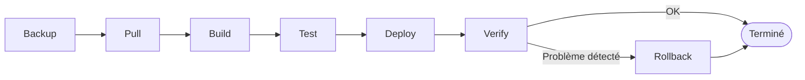

# Chapitre 32 — Mettre à jour, versionner et revenir en arrière

**Niveau : Avancé**

---

## Introduction

Le chapitre 31 a automatisé le déploiement, mais toujours vers un seul tag mouvant : `:latest`. Ce chapitre introduit un versioning réel, qui rend possible ce que `:latest` seul ne permet jamais : revenir en arrière **précisément**, vers une version identifiée avec certitude, en quelques minutes plutôt qu'en réparant dans l'urgence.

---

## 🎯 Objectifs pédagogiques

À la fin de ce chapitre, tu sauras :
- tagger chaque image avec un identifiant immuable en plus de `:latest`, pour garder une trace exacte de chaque déploiement ;
- appliquer le cycle complet d'une mise à jour professionnelle : Backup → Pull → Build → Test → Deploy → Verify → Rollback si nécessaire ;
- exécuter un rollback réel, en pointant explicitement vers une version précédente déjà présente dans le registry ;
- expliquer pourquoi le registry (chapitre 27) constitue, de fait, un historique de versions déployables.

## 📋 Prérequis

Chapitres 27 (registries) et 31 (CI/CD).

## Pourquoi ce chapitre est important

Un déploiement qui casse la production n'est pas une hypothèse rare — c'est un scénario qui finit par arriver à toute application qui évolue dans le temps. La différence entre un incident de deux minutes et un incident de deux heures tient presque entièrement à une chose : avoir, ou non, préparé un mécanisme de retour en arrière **avant** d'en avoir besoin.

---

## Concepts fondamentaux

1. **Versioning au-delà de `:latest`** — un identifiant immuable par déploiement.
2. **Le cycle de mise à jour** — Backup → Pull → Build → Test → Deploy → Verify → Rollback.
3. **Rollback réel** — pointer vers une version précédente déjà disponible.

---

## 32.1 Versioning : `:latest` ne suffit jamais seul

> ⚠️ **Attention — rappel direct du chapitre 5** — `:latest` est un tag **mouvant** : il pointe vers "la dernière image poussée", quelle qu'elle soit à un instant donné. Une fois qu'un nouveau `git push` a reconstruit et republié `:latest`, l'ancienne version **n'est plus identifiable par ce tag** — elle existe peut-être encore dans le registry, mais rien ne permet de la retrouver facilement sans un identifiant précis.

```yaml
# [.github/workflows/deploy.yml, extrait modifié depuis le chapitre 31]
      - name: Construire et pousser l'image backend
        uses: docker/build-push-action@v5
        with:
          context: ./backend
          target: production
          push: true
          tags: |
            ghcr.io/mon-compte/mon-projet-backend:latest
            ghcr.io/mon-compte/mon-projet-backend:${{ github.sha }}
```

**Explication :**
```text
tags: | ... :latest ... :${{ github.sha }}
→ chaque construction pousse DEUX tags vers le MÊME image ID (chapitre 5,
  section 5.1) : le tag mouvant ":latest" ET un tag IMMUABLE correspondant
  exactement au hash du commit Git qui a déclenché ce déploiement précis

github.sha
→ une variable fournie automatiquement par GitHub Actions, contenant
  le hash complet du commit courant (identique à ce que "git rev-parse HEAD"
  afficherait localement)
```

> 📌 **À retenir** — Ce double tag ne coûte rien en espace disque supplémentaire (rappel du chapitre 5 : deux tags peuvent pointer vers le **même** Image ID) mais transforme radicalement ce qui est possible ensuite : chaque déploiement devient identifiable et **retrouvable individuellement**, indéfiniment, tant que le registry conserve cette image.

---

## 32.2 Le cycle complet d'une mise à jour professionnelle



**Explication de chaque étape, avec le renvoi vers le chapitre qui la couvre en détail :**

```text
Backup    → sauvegarder les données AVANT toute mise à jour touchant potentiellement
             leur structure (chapitre 33, en particulier avant une migration de base
             de données) — jamais après coup, une fois qu'il est trop tard

Pull      → dans le contexte CI/CD du chapitre 31, cette étape correspond à
             "actions/checkout" : récupérer le nouveau code

Build     → "docker/build-push-action" (chapitre 31), désormais avec les deux tags
             de la section 32.1

Test      → les vérifications automatisées avant déploiement (mentionnées au
             chapitre 31, une étape à ajouter au workflow si le projet en a)

Deploy    → "docker compose pull" + "up -d" sur le serveur (chapitre 31)

Verify    → docker compose ps (chapitre 21, healthchecks), curl sur les routes
             critiques, docker compose logs (chapitre 22) — jamais supposer qu'un
             déploiement a réussi simplement parce qu'aucune erreur n'est apparue
             pendant son exécution

Rollback  → SI (et seulement si) l'étape Verify révèle un problème (section 32.3)
```

> 📌 **À retenir** — Ce cycle n'est pas une suite d'étapes à suivre "quand on y pense" — c'est une discipline à appliquer **systématiquement**, y compris (surtout) pour une mise à jour qui semble mineure. La majorité des incidents de production évitables du chapitre 48 proviennent d'une étape de ce cycle sautée, le plus souvent "Verify".

---

## 32.3 Rollback : revenir en arrière, précisément

```yaml
# [compose.prod.yaml, adapté pour permettre un rollback ciblé]
services:
  backend:
    image: ghcr.io/mon-compte/mon-projet-backend:${BACKEND_TAG:-latest}
```

**Explication :**
```text
${BACKEND_TAG:-latest}
→ syntaxe Compose : utilise la variable d'environnement BACKEND_TAG si elle
  est définie, SINON retombe sur "latest" par défaut — permettant de cibler
  n'importe quelle version déjà publiée, à la demande, sans modifier
  le fichier compose.prod.yaml lui-même
```

**Scénario réel :** un déploiement au commit `a1b2c3d` casse une route critique de l'API, détecté à l'étape "Verify".

```bash
# [Terminal, sur le serveur] — identifier le commit précédent, connu comme fonctionnel
# (via l'historique Git local, ou un simple journal de déploiements tenu à jour, chapitre 34)
git log --oneline -5
```

```text
a1b2c3d (HEAD) Ajout du filtre de recherche avancée   ← déploiement problématique
d4e5f6a Correction du calcul de la TVA                 ← dernier déploiement CONNU FONCTIONNEL
...
```

```bash
# [Terminal, sur le serveur] — rollback ciblé, SANS reconstruction, en quelques secondes
BACKEND_TAG=d4e5f6a docker compose -f compose.yaml -f compose.prod.yaml up -d backend
```

**Résultat attendu :** le conteneur `backend` redémarre avec l'image exacte du commit `d4e5f6a`, déjà présente dans le registry (chapitre 27) — **aucune reconstruction n'est nécessaire**, le rollback est quasi instantané.

> 📌 **À retenir, la vraie raison d'être de ce chapitre** — Le registry, en conservant chaque image poussée (tant qu'elle n'est pas explicitement supprimée), constitue **de fait un historique de versions déployables**. Un rollback n'est jamais "reconstruire l'ancienne version" (lent, et potentiellement impossible si l'ancien code a changé entre-temps) — c'est simplement **pointer de nouveau** vers une image déjà construite et déjà validée par un déploiement précédent réussi.

```bash
# [Terminal] — vérifier le rollback (rappel de l'étape "Verify" du cycle)
docker compose ps
curl http://localhost:8080/api/tasks
docker compose logs --tail 50 backend
```

> ⚠️ **Attention** — Un rollback de l'**image applicative** ne rétablit **jamais** automatiquement un changement de schéma de base de données déjà appliqué par une migration (chapitre 36) — si la version problématique incluait une migration destructive, le rollback de l'image seule pourrait laisser l'application dans un état incohérent avec sa base. C'est précisément pour cette raison que l'étape "Backup" du cycle (section 32.2) précède toute mise à jour touchant potentiellement le schéma — approfondi au chapitre 36.

---

## Erreurs fréquentes (récapitulatif du chapitre)

| Erreur | Cause | Solution |
|---|---|---|
| Impossible de revenir à une version précédente précise | Seul `:latest` a été poussé, sans tag immuable associé | Toujours pousser un second tag (commit SHA ou version sémantique) en plus de `:latest` |
| Rollback qui semble réussir mais l'application reste cassée | La cause réelle était une migration de base de données, pas seulement le code applicatif | Vérifier aussi l'état de la base ; restaurer une sauvegarde si nécessaire (chapitre 33, 36) |
| "Verify" sauté après un déploiement qui semblait "sans erreur" | Confiance excessive dans l'absence de message d'erreur visible | Toujours exécuter une vérification active (curl, healthcheck), jamais une simple absence d'erreur comme critère de succès |
| Rollback lent, presque aussi long qu'un déploiement normal | Tentative de reconstruire l'ancienne version plutôt que de réutiliser l'image déjà publiée | Toujours cibler un tag déjà présent dans le registry, jamais reconstruire pour un rollback |

---

## Laboratoire pratique n°1 — Adapter le workflow pour un double tag

**Objectifs :** exécuter la section 32.1.
**Prérequis :** Chapitre 31.

**Étapes :** modifie le workflow du chapitre 31 pour pousser `:latest` et `:${{ github.sha }}`, pousse un changement, et confirme dans l'interface `ghcr.io` (ou `docker images` après un `pull` local) que les deux tags existent bien.

**Résultat attendu :** deux tags distincts, un mouvant et un immuable, pointant vers la même image.

---

## Laboratoire pratique n°2 — Exécuter le cycle complet de mise à jour

**Objectifs :** appliquer consciemment chaque étape de la section 32.2.
**Prérequis :** Laboratoire 1 complété.

**Étapes :** pour une prochaine mise à jour réelle (même mineure) du projet, note explicitement, pour chacune des sept étapes du cycle, ce qui a été fait et vérifié.

**Résultat attendu :** une mise à jour menée consciemment étape par étape, plutôt qu'un simple `git push` suivi d'un espoir que tout se passe bien.

---

## Laboratoire pratique n°3 — Provoquer et corriger une régression par rollback

**Objectifs :** vivre un rollback réel, dans un scénario contrôlé.
**Prérequis :** Laboratoires 1 et 2 complétés.

**Étapes :**
1. Introduis volontairement une régression simple dans le backend (une route qui renvoie une erreur 500, par exemple), commit et pousse — note le SHA de ce commit problématique.
2. Une fois déployé, confirme l'échec à l'étape "Verify" (`curl` renvoyant une erreur).
3. Identifie le SHA du commit précédent, fonctionnel.
4. Exécute le rollback ciblé de la section 32.3.
5. Confirme la restauration du bon fonctionnement.

**Résultat attendu :** un cycle complet de régression puis de correction par rollback, exécuté en quelques minutes, sans reconstruction.

---

## Exercices

1. Pourquoi `:latest` seul ne permet-il pas un rollback fiable ?
2. Qu'apporte `${{ github.sha }}` comme tag supplémentaire ?
3. Pourquoi un rollback ciblant une image déjà publiée est-il quasi instantané, contrairement à une reconstruction ?
4. Pourquoi l'étape "Backup" du cycle doit-elle précéder, et non suivre, une mise à jour à risque ?
5. Pourquoi un rollback de l'image applicative seule peut-il rester insuffisant après une migration de base de données ?

---

## Quiz

**Question 1.** Le principal problème de `:latest` comme seul mécanisme de versioning est :
a) Il est trop long à taper
b) Il est mouvant, rendant impossible d'identifier précisément une version antérieure une fois republié
c) Il ne fonctionne pas avec Docker Compose
d) Il double la taille de l'image

**Question 2.** `${{ github.sha }}` comme tag d'image sert à :
a) Chiffrer l'image
b) Fournir un identifiant immuable, lié exactement au commit ayant produit cette image
c) Remplacer `:latest`
d) Accélérer la construction

**Question 3.** Un rollback vers une version déjà publiée dans le registry est :
a) Aussi lent qu'un déploiement normal avec reconstruction
b) Quasi instantané, car aucune reconstruction n'est nécessaire
c) Impossible sans accès au code source
d) Réservé aux images publiques

**Question 4.** L'étape "Backup" du cycle de mise à jour doit avoir lieu :
a) Après le déploiement, en cas de problème
b) Avant toute mise à jour à risque, en particulier une migration de base de données
c) Uniquement une fois par an
d) Jamais, si l'application utilise Docker

**Question 5.** Un rollback de l'image applicative seule, après une migration destructive déjà appliquée :
a) Résout toujours entièrement le problème
b) Peut laisser l'application dans un état incohérent avec sa base de données
c) N'a aucun rapport avec les bases de données
d) Annule automatiquement la migration

> 🔑 **Corrigé** — 1: b · 2: b · 3: b · 4: b · 5: b

---

## 📝 Résumé du chapitre

- `:latest` seul ne permet aucun rollback fiable — un second tag immuable (commit SHA, ou une version sémantique) doit toujours accompagner chaque publication.
- Le cycle Backup → Pull → Build → Test → Deploy → Verify → Rollback structure une mise à jour professionnelle, où "Verify" n'est jamais optionnel et où "Rollback" n'est déclenché qu'en cas de problème réellement détecté.
- Un rollback consiste à pointer explicitement vers une image déjà construite et déjà publiée — quasi instantané, sans reconstruction, grâce au registry qui conserve un historique de versions déployables.
- Un rollback de l'image applicative ne corrige jamais, seul, une migration de base de données déjà appliquée — la sauvegarde préalable (chapitre 33) reste la vraie protection dans ce cas.

## ✅ Checklist avant de passer au chapitre 33

- [ ] Mes images sont toujours publiées avec un tag immuable en plus de `:latest`.
- [ ] Je connais et applique le cycle complet de mise à jour, étape par étape.
- [ ] J'ai exécuté un rollback réel, sans reconstruction.
- [ ] Je sais pourquoi un rollback d'image ne suffit pas toujours après une migration de base de données.
- [ ] J'ai réalisé les trois laboratoires de ce chapitre.
- [ ] J'ai obtenu au moins 4/5 au quiz.

---

## Glossaire du chapitre

**Tag immuable**
Définition simple : un tag qui, une fois publié, pointe toujours vers exactement la même image, jamais réassigné.
Voir : Chapitre 32, section 32.1.

**Rollback**
Définition simple : le retour à une version précédente d'une application, après détection d'un problème sur la version actuelle.
Voir : Chapitre 32, section 32.3.

---

## ❓ FAQ

**Faut-il conserver indéfiniment toutes les versions dans le registry ?**
Non, généralement pas — une politique de rétention (garder par exemple les 10 dernières versions, ou toutes celles des 90 derniers jours) évite une croissance illimitée du registry, un sujet mentionné au chapitre 24 (nettoyage) appliqué ici aux images distantes plutôt que locales.

**Le versioning sémantique (1.0.0, 1.1.0...) est-il préférable au hash de commit ?**
Les deux sont complémentaires, pas concurrents — un hash de commit est automatique et garanti unique ; une version sémantique communique une intention (correctif mineur vs changement majeur) plus lisible pour des humains, généralement réservée aux publications officielles (déclenchées par un tag Git plutôt que chaque commit).

**Peut-on automatiser complètement la détection de problème à l'étape "Verify", pour déclencher un rollback automatique ?**
Oui, c'est une pratique avancée (rollback automatique basé sur des métriques de santé post-déploiement) — mentionnée ici comme perspective, non détaillée dans ce manuel qui privilégie un rollback déclenché consciemment après vérification humaine.

---

## Références officielles

- Versioning sémantique — [semver.org](https://semver.org)
- Variables de contexte GitHub Actions (`github.sha`) — [docs.github.com/actions/learn-github-actions/contexts](https://docs.github.com/actions/learn-github-actions/contexts)
- Variables d'environnement dans Compose (syntaxe `${VAR:-default}`) — [docs.github.com/compose/how-tos/environment-variables](https://docs.docker.com/compose/how-tos/environment-variables/)

---

## Conclusion

Chaque déploiement est maintenant identifiable, et réversible en quelques minutes si nécessaire. Le chapitre 33 s'attaque à ce que le rollback seul ne protège jamais : la perte réelle de données, avec une vraie stratégie de sauvegarde pour les volumes Docker.

---

⬅️ [Chapitre 31 — CI/CD avec Docker](31-cicd-avec-docker.md) · ➡️ **Suite : Chapitre 33 — Sauvegarder les données Docker**
