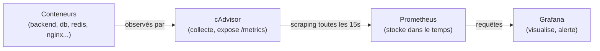

# Chapitre 34 — Monitoring

**Niveau : Avancé**

---

## Introduction

`docker stats` (chapitre 23) répond à "que se passe-t-il **maintenant**", mais s'arrête net dès que le terminal se ferme, sans aucun historique ni alerte. Ce chapitre construit une vraie supervision : cAdvisor pour collecter les métriques de chaque conteneur, Prometheus pour les stocker dans le temps, Grafana pour les visualiser et alerter — le passage d'un simple coup d'œil ponctuel à une surveillance continue.

---

## 🎯 Objectifs pédagogiques

À la fin de ce chapitre, tu sauras :
- expliquer les limites de `docker stats` que ce chapitre résout ;
- déployer cAdvisor pour exposer les métriques de tous les conteneurs d'un hôte ;
- configurer Prometheus pour collecter (scraper) ces métriques régulièrement ;
- visualiser ces données dans un tableau de bord Grafana ;
- configurer une alerte simple, déclenchée automatiquement au dépassement d'un seuil.

## 📋 Prérequis

Chapitre 23 (`docker stats`).

## Pourquoi ce chapitre est important

Un problème de production détecté par un utilisateur qui se plaint est toujours détecté trop tard. Un monitoring correctement en place détecte une dérive (mémoire qui grimpe progressivement, disque qui se remplit) **avant** qu'elle ne devienne un incident visible — le vrai objectif de ce chapitre.

---

## Concepts fondamentaux

1. **Les limites de `docker stats`** — ponctuel, sans historique, sans alerte.
2. **cAdvisor** — collecter les métriques de chaque conteneur.
3. **Prometheus** — stocker ces métriques dans le temps (scraping).
4. **Grafana** — visualiser et alerter.

---

## 34.1 Les limites de `docker stats`, précisément

Rappel du chapitre 23 : `docker stats` est un excellent premier réflexe, mais :
- il ne conserve **aucun historique** — impossible de savoir "la mémoire a-t-elle augmenté progressivement sur trois jours ?" ;
- il ne **déclenche jamais d'alerte** — quelqu'un doit activement regarder l'écran au moment précis du problème ;
- il ne couvre qu'**une seule machine** à la fois, sans vue d'ensemble si plusieurs serveurs sont en jeu.

> 📌 **À retenir** — Ce chapitre ne remplace pas `docker stats`, qui reste l'outil de diagnostic immédiat du chapitre 23 — il ajoute la dimension qui manquait : la mémoire, dans le temps, avec alerte automatique.

---

## 34.2 cAdvisor : collecter les métriques de chaque conteneur

```yaml
# [compose.monitoring.yml, extrait]
services:
  cadvisor:
    image: gcr.io/cadvisor/cadvisor:v0.49.1
    volumes:
      - /:/rootfs:ro
      - /var/run:/var/run:ro
      - /sys:/sys:ro
      - /var/lib/docker/:/var/lib/docker:ro
      - /dev/disk/:/dev/disk:ro
    privileged: true
    devices:
      - /dev/kmsg
```

**Explication :**
```text
cAdvisor (Container Advisor)
→ un outil officiel (maintenu dans l'écosystème Google/Kubernetes) qui
  collecte automatiquement les métriques CPU/RAM/réseau/disque de
  CHAQUE conteneur tournant sur la machine, et les expose via une
  URL HTTP au format Prometheus (/metrics)

-v /:/rootfs:ro, /var/run:/var/run:ro, /sys:/sys:ro, ...
→ des montages en LECTURE SEULE (":ro") vers des chemins système de l'hôte,
  nécessaires pour que cAdvisor puisse observer TOUS les conteneurs
  de la machine, pas seulement lui-même
```

> ⚠️ **Attention — à distinguer clairement du risque du chapitre 26** — Ces montages donnent à cAdvisor un accès en **lecture** à des informations système étendues — un profil de risque **réel mais nettement plus restreint** que le socket Docker (chapitre 26, section 26.6), qui donnait un contrôle total en **écriture** équivalent à root. cAdvisor ne peut ni créer de conteneur, ni exécuter de commande arbitraire sur l'hôte — il ne fait qu'observer et rapporter. C'est un compromis délibéré et documenté, propre à cet outil précis, pas une exception générale à la prudence du chapitre 26.

```bash
# [Terminal] — vérifier que cAdvisor expose bien des métriques
curl http://localhost:8080/metrics | head -20
```

---

## 34.3 Prometheus : collecter dans le temps (scraping)

```yaml
# [compose.monitoring.yml, suite]
  prometheus:
    image: prom/prometheus:v2.53.0
    volumes:
      - ./prometheus.yml:/etc/prometheus/prometheus.yml
      - prometheus-data:/prometheus
    ports:
      - "9090:9090"
```

```yaml
# [prometheus.yml]
global:
  scrape_interval: 15s

scrape_configs:
  - job_name: cadvisor
    static_configs:
      - targets: ["cadvisor:8080"]
```

**Explication :**
```text
scrape_interval: 15s
→ Prometheus fonctionne en mode "PULL" (à l'opposé d'un système qui
  "pousse" activement ses données) : il interroge lui-même, toutes les
  15 secondes ici, l'URL /metrics de chaque cible configurée

targets: ["cadvisor:8080"]
→ "cadvisor" est ici le NOM DU SERVICE Compose (rappel chapitre 11/12) —
  Prometheus trouve cAdvisor par résolution DNS interne, exactement
  comme n'importe quel autre service de ce manuel depuis la Partie III
```

```bash
# [Terminal] — vérifier que Prometheus voit bien sa cible comme active
# (ouvrir http://localhost:9090/targets dans un navigateur, "State: UP" attendu)
```

> 📌 **À retenir** — Une fois collectées, les métriques restent stockées dans le volume `prometheus-data` (rappel du chapitre 10) — sans ce volume, tout l'historique disparaîtrait à chaque redémarrage du conteneur `prometheus`, exactement le même principe que pour toute donnée qui compte dans ce manuel.

---

## 34.4 Grafana : visualiser

```yaml
# [compose.monitoring.yml, suite]
  grafana:
    image: grafana/grafana:11.1.0
    volumes:
      - grafana-data:/var/lib/grafana
    environment:
      GF_SECURITY_ADMIN_PASSWORD: ${GRAFANA_ADMIN_PASSWORD}
    ports:
      - "3001:3000"

volumes:
  prometheus-data:
  grafana-data:
```

**Étapes, une fois Grafana démarré :**
1. Se connecter (`admin` / le mot de passe défini via `GF_SECURITY_ADMIN_PASSWORD`, rappel chapitre 9 pour la gestion de ce secret).
2. Ajouter une **source de données** Prometheus, avec l'URL `http://prometheus:9090` (encore une fois, le nom du service Compose — rappel chapitre 11).
3. Importer un tableau de bord existant dédié à cAdvisor (un identifiant de dashboard communautaire largement utilisé, à rechercher dans la galerie officielle Grafana) plutôt que d'en construire un de zéro.

> ✅ **Bonne pratique** — Importer un tableau de bord communautaire déjà éprouvé pour cAdvisor est largement suffisant pour démarrer — construire un tableau de bord entièrement sur mesure n'a de sens qu'une fois des besoins précis identifiés, non couverts par les tableaux de bord génériques existants.



---

## 34.5 Alertes : être prévenu avant qu'un utilisateur ne le soit

Dans Grafana, une **règle d'alerte** est associée à une requête (par exemple, la consommation mémoire d'un conteneur précis) et un seuil :

```text
Requête : container_memory_usage_bytes{name="backend"} / container_spec_memory_limit_bytes{name="backend"} * 100
Condition : > 90 pendant 5 minutes
Action : notifier via un "contact point" (email, webhook Slack/Discord...)
```

**Explication :** cette règle surveille la consommation mémoire du conteneur `backend` **en proportion de sa limite définie** (rappel du chapitre 35, à venir, sur les limites de ressources) — une alerte se déclenche uniquement si le dépassement de 90% persiste 5 minutes, évitant une fausse alerte pour un pic très bref et normal.

> 📌 **À retenir** — Une alerte qui se déclenche trop souvent pour des variations normales et brèves finit **ignorée** par l'équipe qui la reçoit — un seuil de durée (`pendant 5 minutes`, pas instantané) est presque toujours préférable à un déclenchement immédiat au premier dépassement.

---

## 34.6 Ce qu'il faut surveiller en priorité

| Métrique | Pourquoi | Chapitre lié |
|---|---|---|
| CPU/RAM par conteneur | Détecter une dérive avant saturation | 23, 35 |
| État des healthchecks | Un service `unhealthy` doit alerter immédiatement | 21 |
| Espace disque de l'hôte | Éviter la saturation silencieuse (logs, images accumulées) | 24 |
| Expiration du certificat HTTPS | Éviter un site qui bascule en "non sécurisé" sans avertissement | 30 |

> ✅ **Bonne pratique** — Commencer par un petit nombre d'alertes réellement actionnables (mémoire critique, service `unhealthy`, disque presque plein) plutôt que de tout surveiller dès le premier jour — un excès d'alertes peu pertinentes est, en pratique, presque aussi inutile qu'aucune alerte du tout.

---

## Erreurs fréquentes (récapitulatif du chapitre)

| Erreur | Cause | Solution |
|---|---|---|
| Prometheus affiche "State: DOWN" pour cAdvisor | Nom de service ou port incorrect dans `prometheus.yml`, ou cAdvisor pas encore démarré | Vérifier `targets:`, rappel du chapitre 21 pour un healthcheck qui garantirait l'ordre de démarrage |
| Aucune donnée historique après un redémarrage | Volume `prometheus-data` absent | Toujours monter un volume, rappel du chapitre 10 |
| Alertes ignorées après un temps | Trop d'alertes peu pertinentes ou mal calibrées | Réduire à un petit nombre d'alertes réellement actionnables (section 34.6) |
| cAdvisor confondu avec un risque équivalent au socket Docker | Montages de chemins système impressionnants en apparence | Rappel de la section 34.2 : accès en lecture seule, profil de risque très différent |

---

## Laboratoire pratique n°1 — Déployer la stack de supervision

**Objectifs :** exécuter les sections 34.2 à 34.4.
**Prérequis :** Chapitre 23, un projet avec plusieurs conteneurs actifs (chapitres 20-21).

**Étapes :** déploie `compose.monitoring.yml`, vérifie la cible Prometheus active, connecte Grafana à Prometheus, importe un tableau de bord cAdvisor.

**Résultat attendu :** un tableau de bord Grafana affichant les métriques réelles des conteneurs du projet.

---

## Laboratoire pratique n°2 — Observer une montée en charge avec historique

**Objectifs :** reproduire le laboratoire 2 du chapitre 23, cette fois avec un historique visualisé.
**Prérequis :** Laboratoire 1 complété.

**Étapes :** génère une charge sur le backend (comme au chapitre 23), observe la courbe de CPU/RAM se dessiner en direct dans Grafana, puis reviens sur le tableau de bord après quelques minutes pour confirmer que l'historique reste consultable.

**Résultat attendu :** une courbe historique exploitable, là où `docker stats` seul n'offrait qu'un instantané.

---

## Laboratoire pratique n°3 — Configurer et déclencher une alerte

**Objectifs :** exécuter et vérifier la section 34.5.
**Prérequis :** Laboratoires 1 et 2 complétés.

**Étapes :** configure une règle d'alerte sur la mémoire d'un conteneur avec un seuil bas et facilement atteignable pour ce test, provoque volontairement une consommation mémoire élevée, et confirme le déclenchement de l'alerte.

**Résultat attendu :** une notification reçue, confirmant que la chaîne complète (métrique → seuil → alerte → notification) fonctionne réellement.

---

## Exercices

1. Explique les trois limites de `docker stats` que ce chapitre résout.
2. Pourquoi cAdvisor a-t-il besoin de montages système en lecture seule, et pourquoi ce risque diffère-t-il de celui du socket Docker (chapitre 26) ?
3. Qu'est-ce que le "scraping", et pourquoi Prometheus fonctionne-t-il en mode PULL plutôt qu'en recevant des données poussées ?
4. Pourquoi une alerte avec une condition de durée ("pendant 5 minutes") est-elle préférable à une alerte instantanée dans la plupart des cas ?
5. Cite trois métriques prioritaires à surveiller, selon la section 34.6.

---

## Quiz

**Question 1.** `docker stats`, comparé à la stack Prometheus/Grafana de ce chapitre :
a) Offre un historique complet
b) Ne conserve aucun historique et ne déclenche aucune alerte
c) Est plus complet dans tous les cas
d) Nécessite Grafana pour fonctionner

**Question 2.** Prometheus fonctionne en mode :
a) PUSH — les services lui envoient activement leurs métriques
b) PULL — il interroge lui-même ses cibles à intervalle régulier
c) Aucun des deux, il lit directement les logs
d) Il ne collecte jamais de métriques automatiquement

**Question 3.** Les montages de cAdvisor sur des chemins système de l'hôte sont :
a) Aussi dangereux que le socket Docker du chapitre 26
b) En lecture seule, avec un profil de risque nettement plus restreint que le socket Docker
c) Totalement sans aucun risque
d) Interdits par Docker par défaut

**Question 4.** Sans le volume `prometheus-data` :
a) Rien ne change
b) L'historique des métriques disparaît à chaque redémarrage du conteneur Prometheus
c) cAdvisor cesse de fonctionner
d) Grafana ne peut plus démarrer

**Question 5.** Une alerte avec une condition "pendant 5 minutes" plutôt qu'instantanée :
a) Retarde inutilement toute détection de problème
b) Évite les fausses alertes pour des pics brefs et normaux
c) N'a aucun effet réel sur la pertinence de l'alerte
d) Est une fonctionnalité réservée à Prometheus, absente de Grafana

> 🔑 **Corrigé** — 1: b · 2: b · 3: b · 4: b · 5: b

---

## 📝 Résumé du chapitre

- `docker stats` (chapitre 23) reste utile pour un diagnostic immédiat, mais n'offre ni historique ni alerte — les limites que ce chapitre résout.
- cAdvisor collecte les métriques de tous les conteneurs d'un hôte, avec des montages système en lecture seule dont le risque, réel mais restreint, diffère nettement du socket Docker (chapitre 26).
- Prometheus interroge (scrape) régulièrement ses cibles et stocke l'historique dans un volume persistant.
- Grafana visualise ces données et permet de configurer des alertes actionnables, avec des seuils et des durées calibrés pour éviter le bruit.
- Un petit nombre de métriques réellement prioritaires (CPU/RAM, healthchecks, espace disque, expiration de certificat) vaut mieux qu'une supervision exhaustive mais ignorée.

## ✅ Checklist avant de passer au chapitre 35

- [ ] J'ai déployé cAdvisor, Prometheus et Grafana avec succès.
- [ ] Je sais expliquer le mode de fonctionnement PULL de Prometheus.
- [ ] J'ai un tableau de bord Grafana affichant des métriques réelles.
- [ ] J'ai configuré et déclenché une alerte fonctionnelle.
- [ ] J'ai réalisé les trois laboratoires de ce chapitre.
- [ ] J'ai obtenu au moins 4/5 au quiz.

---

## Glossaire du chapitre

**cAdvisor**
Définition simple : l'outil qui collecte les métriques de ressources de chaque conteneur d'un hôte.
Voir : Chapitre 34, section 34.2.

**Scraping**
Définition simple : la collecte de métriques par interrogation active et régulière d'une cible, plutôt que par réception passive.
Voir : Chapitre 34, section 34.3.

**Règle d'alerte**
Définition simple : une condition, associée à une métrique et un seuil, qui déclenche une notification si elle est remplie.
Voir : Chapitre 34, section 34.5.

---

## ❓ FAQ

**Faut-il aussi superviser la machine hôte elle-même, pas seulement les conteneurs ?**
Oui, idéalement — un outil complémentaire (`node-exporter`, de la même famille que Prometheus) expose les métriques système globales (CPU/RAM/disque de la machine entière, pas seulement des conteneurs) — mentionné ici pour référence, non détaillé davantage dans ce chapitre centré sur la supervision des conteneurs eux-mêmes.

**Cette stack de supervision consomme-t-elle beaucoup de ressources ?**
Un impact réel mais généralement modéré sur un serveur de taille raisonnable — à surveiller comme tout autre service (une supervision qui sature elle-même le serveur serait contre-productive), avec des limites de ressources appropriées (chapitre 35).

**Existe-t-il des alternatives plus simples pour un tout petit projet ?**
Oui — des outils de surveillance externe plus légers (Uptime Kuma, par exemple, mentionné dans le Guide Ultime du Déploiement) conviennent pour une simple vérification "le site répond-il", sans la profondeur de métriques internes qu'offre la stack Prometheus/Grafana de ce chapitre.

---

## Références officielles

- cAdvisor — [github.com/google/cadvisor](https://github.com/google/cadvisor)
- Prometheus — [prometheus.io/docs](https://prometheus.io/docs/introduction/overview/)
- Grafana — [grafana.com/docs](https://grafana.com/docs/grafana/latest/)

---

## Conclusion

Une dérive de ressources ou une panne partielle peut désormais être détectée avant qu'un utilisateur ne s'en plaigne. Le chapitre 35 approfondit ce que ce monitoring vient de rendre visible : comment diagnostiquer et corriger méthodiquement un vrai problème de performance.

---

⬅️ [Chapitre 33 — Sauvegarder les données Docker](33-sauvegarder-les-donnees-docker.md) · ➡️ **Suite : Chapitre 35 — Performance : CPU, RAM, I/O et limites de ressources**
