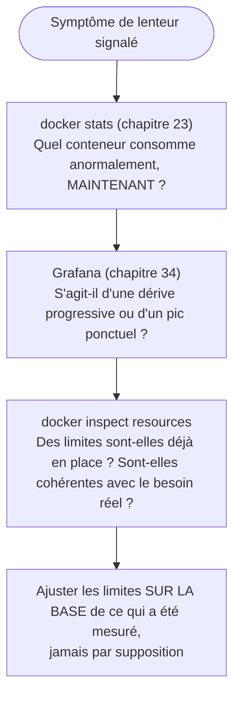

# Chapitre 35 — Performance : CPU, RAM, I/O et limites de ressources

**Niveau : Avancé**

---

## Introduction

Le chapitre 34 a rendu visible ce qui se passe. Ce chapitre agit dessus : limiter les ressources qu'un conteneur peut consommer, comprendre ce qui se passe réellement en cas de dépassement, et choisir la bonne politique de redémarrage. Sans limites explicites, un seul conteneur défaillant peut affamer tous ses voisins sur la même machine — un problème connu sous le nom de "voisin bruyant" (noisy neighbor).

---

## 🎯 Objectifs pédagogiques

À la fin de ce chapitre, tu sauras :
- limiter le CPU et la mémoire d'un conteneur, en ligne de commande et en Compose ;
- expliquer ce que fait exactement l'OOM killer quand une limite mémoire est dépassée ;
- distinguer `limits` (plafond dur) et `reservations` (minimum garanti) ;
- choisir la bonne politique de redémarrage (`no`, `on-failure`, `always`, `unless-stopped`) selon le contexte ;
- appliquer une méthode de diagnostic de performance qui combine les outils déjà vus (chapitres 23, 34).

## 📋 Prérequis

Chapitre 34.

## Pourquoi ce chapitre est important

Sans limites de ressources, un seul bug applicatif (une fuite mémoire, une boucle infinie consommant tout le CPU) peut faire tomber, indirectement, tous les autres services d'un même serveur — y compris ceux qui n'ont rien à voir avec le bug d'origine. Ce chapitre transforme une panne potentiellement totale en un incident contenu à un seul service.

---

## Concepts fondamentaux

1. **Le problème du voisin bruyant** — pourquoi limiter, même sans problème apparent.
2. **Limites CPU et mémoire** — `--cpus`, `--memory`.
3. **L'OOM killer** — ce qui se passe réellement en cas de dépassement.
4. **`limits` vs `reservations`** — plafond dur, minimum garanti.
5. **Politiques de redémarrage** — `no`, `on-failure`, `always`, `unless-stopped`.

---

## 35.1 Le problème du voisin bruyant

> ⚠️ **Attention** — Sans limite explicite, un conteneur peut, en théorie, consommer **la quasi-totalité** des ressources CPU et RAM disponibles sur la machine hôte — même si son propre fonctionnement normal n'en a besoin que d'une fraction. Un bug applicatif (une fuite mémoire progressive, une boucle qui monopolise un cœur CPU) dans un seul service peut ainsi indirectement affamer tous les autres conteneurs de la même machine, y compris ceux qui fonctionnent parfaitement.

> 📌 **À retenir** — Fixer des limites n'est pas une réaction à un problème déjà survenu — c'est une précaution structurelle, appliquée **avant** qu'un bug applicatif quelconque n'ait l'occasion de se propager au-delà de son propre conteneur.

---

## 35.2 Limiter CPU et mémoire

```bash
# [Terminal]
docker run --cpus="0.5" --memory="256m" mon-image
```

**Explication :**
```text
--cpus="0.5"
→ limite le conteneur à l'équivalent d'UN DEMI cœur CPU au maximum
  (peut utiliser jusqu'à 50% du temps d'un cœur, jamais plus, même
  si d'autres cœurs sont totalement inactifs sur la machine)

--memory="256m"
→ un PLAFOND DUR de mémoire : 256 mégaoctets, jamais dépassé
  (contrairement au CPU, un dépassement mémoire déclenche une action
  radicale — section 35.3)
```

```yaml
# [compose.yaml, extrait équivalent]
services:
  backend:
    build: ./backend
    deploy:
      resources:
        limits:
          cpus: '0.50'
          memory: 256M
        reservations:
          cpus: '0.25'
          memory: 128M
```

**Explication :**
```text
limits
→ le PLAFOND que ce service ne peut jamais dépasser, quelle que soit
  la disponibilité réelle des ressources sur la machine

reservations
→ le MINIMUM que Docker s'efforce de garantir à ce service, même
  en cas de forte contention avec d'autres conteneurs — une notion
  de priorité relative, moins stricte qu'un plafond
```

> 📌 **À retenir — différence capitale** — `limits` est un **plafond strict, jamais dépassable**. `reservations` est un **minimum souhaité**, une indication de priorité pour l'ordonnanceur de ressources, pas une garantie absolue en toute circonstance. Fixer uniquement des `reservations` sans `limits` laisse un conteneur défaillant toujours capable de consommer bien plus que prévu.

---

## 35.3 L'OOM killer : ce qui se passe réellement au dépassement mémoire

```bash
# [Terminal] — provoquer volontairement un dépassement, à des fins de démonstration
docker run --name test-oom --memory="50m" alpine sh -c "cat /dev/zero | head -c 100m | tail"
```

**Résultat attendu :** le conteneur s'arrête brutalement.

```bash
# [Terminal] — diagnostiquer précisément ce qui s'est passé
docker inspect --format "{{.State.OOMKilled}}" test-oom
docker inspect --format "{{.State.ExitCode}}" test-oom
```

**Résultat attendu :** `true` pour `OOMKilled`, et un code de sortie `137` (le code conventionnel signalant une terminaison par signal `SIGKILL`, ici déclenché par le noyau lui-même).

> ⚠️ **Attention** — Le noyau Linux, pas Docker, est responsable de cette terminaison : quand un conteneur dépasse sa limite mémoire (`--memory`), le noyau invoque son propre mécanisme de protection (l'**OOM killer**, Out-Of-Memory killer) et met fin **brutalement** au processus principal du conteneur, sans préavis ni possibilité de nettoyage propre côté application. C'est un comportement **voulu et protecteur** — l'alternative (laisser un conteneur épuiser toute la mémoire de la machine hôte) serait bien pire, affectant potentiellement tous les autres conteneurs et le système lui-même.

> 📌 **À retenir** — `docker inspect --format "{{.State.OOMKilled}}"` est le premier réflexe de diagnostic face à un conteneur qui s'arrête de façon inattendue avec le code `137` — approfondi comme scénario complet au chapitre 48.

---

## 35.4 Politiques de redémarrage

| Politique | Redémarre après un arrêt de l'application | Redémarre après un arrêt manuel (`docker stop`) | Redémarre au redémarrage du Docker daemon |
|---|---|---|---|
| `no` (par défaut) | Non | Non | Non |
| `on-failure[:N]` | Oui, si le code de sortie indique une erreur (optionnellement limité à N tentatives) | Non | Non |
| `always` | Oui, systématiquement | **Oui, même après un arrêt manuel** | Oui |
| `unless-stopped` | Oui, systématiquement | **Non, si l'arrêt était volontaire** | Oui |

```yaml
# [compose.prod.yaml, rappel du chapitre 28, désormais expliqué en détail]
services:
  backend:
    restart: unless-stopped
```

**Explication de la nuance capitale entre `always` et `unless-stopped` :**
```text
always
→ redémarre le conteneur MÊME s'il a été explicitement arrêté par un humain
  (docker stop) puis que le service Docker lui-même redémarre — un
  comportement parfois surprenant : "j'ai arrêté ce conteneur exprès,
  pourquoi a-t-il redémarré tout seul après un redémarrage du serveur ?"

unless-stopped
→ respecte un arrêt manuel explicite : si TU as arrêté le conteneur toi-même,
  il ne redémarre pas automatiquement même après un redémarrage du daemon —
  mais redémarre bien après un simple crash de l'application elle-même,
  ou après un redémarrage normal du serveur SANS arrêt manuel préalable
```

> 📌 **À retenir** — `unless-stopped` est le choix par défaut recommandé pour la quasi-totalité des services de production de ce manuel (déjà utilisé sans explication complète au chapitre 28) — il combine la résilience automatique souhaitée (redémarrage après un crash ou un redémarrage serveur) avec le respect d'une intention humaine explicite d'arrêt.

---

## 35.5 Limites d'I/O (bref aperçu)

```bash
# [Terminal] — limiter le débit d'écriture disque d'un conteneur (Linux uniquement)
docker run --device-write-bps /dev/sda:10mb mon-image
```

> 📌 **À retenir** — Rarement nécessaire pour la majorité des applications web de ce manuel (dont le goulot d'étranglement est presque toujours CPU/RAM/réseau plutôt que le débit disque brut), mais utile à connaître pour un cas d'usage impliquant des écritures disque très intensives (traitement de fichiers volumineux, par exemple).

---

## 35.6 Méthode de diagnostic combinée



**Explication du schéma :** ce chapitre ne remplace ni le chapitre 23 (diagnostic immédiat) ni le chapitre 34 (historique) — il ajoute la dernière étape, celle qui transforme une observation en action mesurée.

---

## Erreurs fréquentes (récapitulatif du chapitre)

| Erreur | Cause | Solution |
|---|---|---|
| Conteneur tué de façon inattendue, code de sortie 137 | Limite mémoire dépassée, OOM killer déclenché | Vérifier `docker inspect .State.OOMKilled`, ajuster la limite sur la base d'une mesure réelle |
| Un service redémarre tout seul après un arrêt manuel volontaire | Politique `always` au lieu de `unless-stopped` | Utiliser `unless-stopped` pour respecter un arrêt manuel explicite |
| Application qui semble bridée sans raison apparente | Limite `--cpus` fixée trop bas par rapport au besoin réel | Mesurer d'abord (chapitre 34) avant de fixer une limite arbitraire |
| Aucune limite fixée du tout | Configuration par défaut jamais revue | Appliquer systématiquement des `limits` en production, même généreuses au départ |

---

## Laboratoire pratique n°1 — Limiter et vérifier CPU/mémoire

**Objectifs :** exécuter la section 35.2.
**Prérequis :** Chapitre 34.

**Étapes :** lance un conteneur avec `--cpus`/`--memory`, confirme les limites appliquées avec `docker stats` (rappel chapitre 23, la colonne `MEM USAGE / LIMIT` affichera désormais la vraie limite).

**Résultat attendu :** une limite visible et respectée dans `docker stats`.

---

## Laboratoire pratique n°2 — Provoquer et diagnostiquer un OOM kill

**Objectifs :** exécuter et diagnostiquer la section 35.3.
**Prérequis :** Laboratoire 1 complété.

**Étapes :** reproduis la commande de la section 35.3, puis diagnostique avec `docker inspect --format "{{.State.OOMKilled}}"` et `docker logs` (rappel chapitre 22, souvent muet sur ce type d'arrêt brutal — un indice supplémentaire à reconnaître).

**Résultat attendu :** identification correcte de la cause exacte de l'arrêt, sans deviner.

---

## Laboratoire pratique n°3 — Comparer `always` et `unless-stopped`

**Objectifs :** vivre la nuance de la section 35.4.
**Prérequis :** Laboratoires 1 et 2 complétés.

**Étapes :**
1. Lance deux conteneurs identiques, l'un avec `--restart always`, l'autre avec `--restart unless-stopped`.
2. Arrête les deux manuellement (`docker stop`).
3. Redémarre le service Docker (`sudo systemctl restart docker`, rappel chapitre 3 — à faire sur une machine de test, pas en pleine session de travail).
4. Observe lequel des deux a redémarré automatiquement, et lequel est resté arrêté.

**Résultat attendu :** confirmation directe de la différence de comportement entre les deux politiques.

---

## Exercices

1. Pourquoi le problème du "voisin bruyant" justifie-t-il de fixer des limites même en l'absence de bug connu ?
2. Quelle est la différence entre `limits` et `reservations` en Compose ?
3. Que signifie exactement un code de sortie `137`, et qui en est responsable — Docker ou le noyau Linux ?
4. Pourquoi `unless-stopped` est-il généralement préférable à `always` en production ?
5. Décris la méthode de diagnostic de performance combinant les chapitres 23, 34 et 35.

---

## Quiz

**Question 1.** Sans limite de ressources fixée, un conteneur défaillant peut :
a) N'affecter que lui-même, jamais les autres conteneurs
b) Indirectement affamer les autres conteneurs de la même machine
c) Être automatiquement isolé par Docker
d) Ne jamais consommer plus que 50% des ressources

**Question 2.** `reservations`, contrairement à `limits` :
a) Est un plafond strict, jamais dépassable
b) Est un minimum souhaité, une indication de priorité plutôt qu'une garantie absolue
c) N'a aucune différence avec `limits`
d) Concerne uniquement le réseau

**Question 3.** Un conteneur tué avec le code de sortie 137 après dépassement de sa limite mémoire :
a) A été arrêté par une erreur de Docker Compose
b) A été terminé par l'OOM killer du noyau Linux
c) S'est arrêté normalement, sans rapport avec la mémoire
d) Doit être reconstruit avant de pouvoir redémarrer

**Question 4.** La politique `always`, contrairement à `unless-stopped` :
a) Redémarre le conteneur même après un arrêt manuel explicite
b) Ne redémarre jamais automatiquement
c) N'existe pas dans Docker
d) Est identique en tout point

**Question 5.** La bonne méthode pour fixer une limite de ressources est de :
a) Choisir une valeur arbitraire par précaution
b) Mesurer d'abord le besoin réel (chapitres 23, 34), puis fixer une limite cohérente
c) Ne jamais fixer de limite, pour éviter tout risque de blocage
d) Copier systématiquement les limites d'un autre projet, sans vérification

> 🔑 **Corrigé** — 1: b · 2: b · 3: b · 4: a · 5: b

---

## 📝 Résumé du chapitre

- Sans limite explicite, un conteneur peut affamer ses voisins sur la même machine — le problème du "voisin bruyant", une raison de fixer des limites même sans bug connu.
- `--cpus`/`--memory` (ou `deploy.resources` en Compose) fixent des plafonds ; `reservations` indique un minimum souhaité, pas une garantie absolue.
- Un dépassement de la limite mémoire déclenche l'OOM killer du noyau Linux, terminant brutalement le conteneur (code de sortie 137) — diagnosticable via `docker inspect .State.OOMKilled`.
- `unless-stopped` (contrairement à `always`) respecte un arrêt manuel explicite tout en garantissant un redémarrage après un crash ou un redémarrage serveur — le choix par défaut recommandé en production.
- Une méthode de diagnostic combine `docker stats` (immédiat), Grafana (historique) et l'ajustement mesuré des limites — jamais une supposition arbitraire.

## ✅ Checklist avant de passer au chapitre 36

- [ ] Je sais fixer des limites CPU et mémoire, en ligne de commande et en Compose.
- [ ] Je sais expliquer ce que fait l'OOM killer et comment diagnostiquer son intervention.
- [ ] Je sais la différence entre `always` et `unless-stopped`, et pourquoi ce dernier est généralement préférable.
- [ ] Je sais appliquer une méthode de diagnostic de performance combinée, plutôt qu'une supposition.
- [ ] J'ai réalisé les trois laboratoires de ce chapitre.
- [ ] J'ai obtenu au moins 4/5 au quiz.

---

## Glossaire du chapitre

**Voisin bruyant (noisy neighbor)**
Définition simple : un conteneur qui, sans limite, consomme des ressources au point d'affecter les autres conteneurs de la même machine.
Voir : Chapitre 35, section 35.1.

**OOM killer**
Définition simple : le mécanisme du noyau Linux qui termine brutalement un processus dépassant sa limite mémoire.
Voir : Chapitre 35, section 35.3.

**`limits` / `reservations`**
Définition simple : un plafond strict (`limits`) et un minimum souhaité (`reservations`) de ressources allouées à un service.
Voir : Chapitre 35, section 35.2.

---

## ❓ FAQ

**Comment choisir la bonne valeur de limite au départ, avant d'avoir des mesures réelles ?**
Commencer généreusement (par exemple, deux à trois fois l'usage observé lors d'un test de charge simple), puis affiner sur la base de mesures réelles issues du monitoring du chapitre 34 — jamais deviner une valeur définitive dès le premier jour.

**L'OOM killer peut-il tuer le mauvais processus par erreur ?**
Dans le contexte d'un conteneur avec sa propre limite mémoire dédiée, le processus principal du conteneur est presque toujours la cible directe et évidente — la confusion classique de l'OOM killer choisissant "le mauvais processus" concerne davantage un système entier sans isolation par conteneur, un scénario différent de celui de ce manuel.

**Faut-il fixer des limites même en développement local ?**
Moins critique qu'en production (un seul développeur, une seule machine, pas de "voisins" à protéger) — mais reproduire les mêmes limites qu'en production pendant les tests reste une bonne pratique pour détecter un problème de dimensionnement avant le déploiement réel.

---

## Références officielles

- Limiter les ressources d'un conteneur — [docs.docker.com/engine/containers/resource_constraints](https://docs.docker.com/engine/containers/resource_constraints/)
- Politiques de redémarrage — [docs.docker.com/engine/containers/start-containers-automatically](https://docs.docker.com/engine/containers/start-containers-automatically/)
- `deploy.resources` (Compose) — [docs.docker.com/reference/compose-file/deploy/#resources](https://docs.docker.com/reference/compose-file/deploy/#resources)

---

## Conclusion

Chaque service tourne maintenant dans des limites mesurées et cohérentes, avec une politique de redémarrage adaptée à la production. Le chapitre 36 applique ces mêmes principes de rigueur, en profondeur, à la pièce la plus critique de toute application : sa base de données en production.

---

⬅️ [Chapitre 34 — Monitoring](34-monitoring.md) · ➡️ **Suite : Chapitre 36 — Bases de données en production avec Docker**
